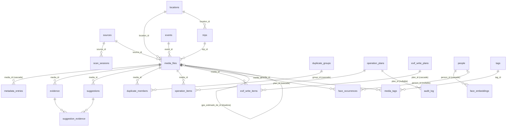

# 03 — Dados: catálogo, tabelas, evidências e migrações

Escopo: tudo que persiste. Fonte: `fotoorganizer/models/*.py`,
`fotoorganizer/database/`, `fotoorganizer/database/migrations/versions/`.
Contagens de exemplo vêm do catálogo real do dono
(`~/Library/Application Support/FotoOrganizer/catalog.db`), lido em
2026-09-19 só com `SELECT` em `mode=ro`.

---

## 1. Visão geral

### 1.1 Onde mora

| Artefato | Caminho | Definido em |
|---|---|---|
| Catálogo (fonte de verdade) | `~/Library/Application Support/FotoOrganizer/catalog.db` | `fotoorganizer/config/paths.py:22-23` (`default_db_path`), sobre `default_data_dir()` em `:10-11` |
| Config TOML | `~/Library/Application Support/FotoOrganizer/config.toml` | `fotoorganizer/config/paths.py:18-19` |
| Logs | `~/Library/Application Support/FotoOrganizer/logs` | `fotoorganizer/config/paths.py:26-27` |
| Cache de thumbnails/previews | `~/Library/Caches/FotoOrganizer` (previews em `<cache>/previews`) | `fotoorganizer/config/paths.py:14-15`; `fotoorganizer/server/app.py:491` |
| Inventário por pasta (derivado, fora do catálogo) | `<pasta de destino>/inventario.json` + `INVENTARIO.md` | `fotoorganizer/operations/inventario.py:151-152` |

`--data-dir` / `FOTOORG_DATA_DIR` troca a raiz inteira, e sozinho também
deriva `cache_dir` (`fotoorganizer/cli.py:122-134`) — é o mecanismo de
catálogo temporário para benchmark e diagnóstico.

### 1.2 Fonte de verdade × cache × derivado

- **Fonte de verdade**: o SQLite. Tudo que o app sabe sobre o acervo está
  nele. Os arquivos de foto NUNCA são fonte de verdade mutável — são
  observados em somente leitura (invariante 1 do CLAUDE.md), com a única
  exceção autorizada da escrita EXIF de localização em campo vazio (D-075,
  `fotoorganizer/exif_write/`).
- **Cache**: thumbnails e previews em disco (`ThumbnailCache`,
  `settings.cache_dir`) — reconstruível a partir dos originais; chaveado
  por `MediaFile.hash_rapido` (`fotoorganizer/server/app.py:847,859`).
- **Derivado dentro do catálogo**: `evidence`, `suggestions`,
  `duplicate_groups`/`duplicate_members`, `locations`, `trips`, `events`,
  `tipo_imagem`. São recalculados por `SuggestionEngine.gerar()` e pelo
  `DuplicateDetector.detectar()`. O que o **usuário** decidiu não é
  derivado e nunca é recalculado: `tipo_confirmado`,
  `DuplicateMember.papel` com decisão humana, `Suggestion.status`,
  `NomeClassificado.origem='manual'`, `PastaClassificada.status`.
- **Derivado fora do catálogo**: `inventario.json` + `INVENTARIO.md` na
  pasta de destino de uma cópia (D-062). Auxiliar: falha ao escrevê-lo
  nunca desfaz uma cópia já verificada
  (`fotoorganizer/operations/executor.py:235-241`).

### 1.3 Engine (`fotoorganizer/database/engine.py`)

`create_db_engine(db_path)` (`:39-47`) cria o diretório pai, abre o SQLite
com `connect_args={"check_same_thread": False}` (`:43-45` — o scan roda
fora da thread do servidor, cada thread usa a própria `Session`) e
registra um listener `connect` que aplica, em **toda** conexão nova
(`_set_sqlite_pragmas`, `:11-32`):

| PRAGMA | Valor | Por quê |
|---|---|---|
| `journal_mode` | `WAL` | leitura concorrente com a escrita do scan |
| `foreign_keys` | `ON` | FK real e ativa — é isto que obriga `AuditLog.plan_id=None` no domínio EXIF (ver §2.22) |
| `synchronous` | `NORMAL` | compromisso durabilidade/velocidade sob WAL |
| `busy_timeout` | `5000` (ms) | escritor único + leitores: espera em vez de `database is locked` |
| `case_sensitive_like` | `ON` | pré-requisito para `pasta LIKE 'prefixo/%'` virar range scan sobre `ix_media_files_pasta` (`:17-31`, verificado por `EXPLAIN QUERY PLAN`; teste `tests/test_indices.py::test_prefixo_de_pasta_usa_indice_nao_scan`) |

`create_session_factory(engine)` (`:50-51`) devolve
`sessionmaker(bind=engine, expire_on_commit=False)`. **Todo** repositório,
scanner, executor e serviço recebe esse `sessionmaker` no construtor —
nunca uma `Session` pronta, nunca o engine.

`Base` (`fotoorganizer/models/base.py:18-19`) carrega uma
`NAMING_CONVENTION` determinística (`:9-15`) para índices, uniques, checks,
FKs e PKs — pré-requisito para o Alembic gerar nomes estáveis.
`utcnow()` (`:22-23`) é o default de todo carimbo de tempo, e devolve
`datetime` **aware** em UTC; todos os outros pontos do código gravam naive
UTC com `datetime.now(timezone.utc).replace(tzinfo=None)`.

### 1.4 Convenção de datas

Duas colunas de instante em `media_files`, sem coluna de offset (D-038,
`fotoorganizer/models/catalog.py:196-256`):

- `data_capturada` — hora de **parede** (o que o relógio marcava no lugar
  da foto), naive. É ela que ordena a grade e agrupa evento e viagem.
- `data_capturada_utc` — o **mesmo instante**, absoluto, naive.
- O offset é a diferença entre as duas. **Iguais significa "fuso
  desconhecido"**, nunca "foi tirada em UTC"
  (`fotoorganizer/models/catalog.py:210-213`). Consequência aceita: fuso
  real +00:00 é indistinguível de desconhecido.
- `tz_estimado` é dado técnico auxiliar (IANA, estimado do país), não passa
  por `evidence`.

Todo o resto (`mtime`, `ctime`, `criado_em`, `indexado_em`, `quando`…) é
UTC naive.

---

## 2. As tabelas

24 classes ORM mapeadas + 1 tabela de associação (`suggestion_evidence`,
declarada como `Table`, não como classe) = **25 tabelas físicas**, mais
`alembic_version` criada pelo Alembic. A lista real no catálogo de produção
confere (26 nomes em `sqlite_master`). Registradas em
`fotoorganizer/models/__init__.py:51-73`.

Coluna "Linhas" = contagem no catálogo real em 2026-09-19, como ordem de
grandeza para o reconstrutor.

### 2.1 `sources` — as fontes de fotos

`fotoorganizer/models/catalog.py:95-123`. Uma raiz de varredura (pasta) ou
um catálogo externo (biblioteca do Apple Fotos, pasta do Takeout, `.lrcat`).
**4 linhas.**

| Coluna | Tipo | Nulo | Default | Significado |
|---|---|---|---|---|
| `id` | int | não | PK autoinc | |
| `caminho` | Text | não | — | raiz da fonte; `UNIQUE` (`:79`) |
| `tipo` | Enum `SourceType` (não-nativo, texto) | não | `pasta` | `:80-82` |
| `apelido` | str | sim | `NULL` | nome legível; catálogos externos nascem com o `provider.apelido` (`sources/importer.py:166-168`) |
| `disponivel` | bool | não | `True` | alcançável **agora** — HD na gaveta é indisponível, não perdido (`:84-86`) |
| `volume_id` | str | sim | `NULL` | identidade de volume: `uuid:…`, `rede:…` ou `caminho:…` (`security/volumes.py:148-153`) |
| `volume_nome` | str | sim | `NULL` | nome legível do volume |
| `visto_em` | datetime | sim | `NULL` | último instante em que respondeu (`sources/disponibilidade.py:109-110`) |
| `padroes_ignorados` | JSON (lista) | não | `[]` | globs de pastas a ignorar dentro desta fonte |
| `criado_em` | datetime | não | `utcnow` | |

Índices: PK; `UNIQUE(caminho)`; `ix_sources_volume_id` (`:75`, existe no
banco desde a migração 0011, o modelo só espelha).
Relações: 1:N com `media_files` (`arquivos`, `:98`), 1:N com
`scan_sessions` (sem `relationship` declarado, só FK).

`SourceType` (`:34-42`), todos os valores:
`pasta` (varredura própria de filesystem) · `apple_photos` ·
`google_takeout` · `lightroom`.

Invariantes: uma fonte nunca é apagada. `_get_or_create_source`
(`scanner/scanner.py:536-551`) reaproveita por caminho exato e, se não
achar, por `samefile` (`:553-575`) — resolve caixa e symlink, e **pula**
fonte cujo caminho não existe agora (criar fonte a mais é recuperável;
fundir duas pastas distintas não é).

Escreve: `scanner/scanner.py` (`_get_or_create_source`,
`scan_source:184`), `sources/importer.py:_obter_source:159-171`,
`sources/disponibilidade.py:verificar:74-121`,
`sources/reapontar.py:aplicar:265-269`.
Lê: `repositories/media.py`, `repositories/inventario.py`,
`server/app.py:472-478,521-533`, `scanner/reconciliacao.py`,
`duplicates/resolucao.py:36`.

### 2.2 `scan_sessions` — uma passada de varredura

`fotoorganizer/models/catalog.py:126-142`. **4 linhas.**

| Coluna | Tipo | Nulo | Default | Significado |
|---|---|---|---|---|
| `id` | int | não | PK | |
| `source_id` | int | não | — | FK → `sources.id` |
| `status` | Enum `ScanStatus` | não | `rodando` | |
| `iniciado_em` | datetime | não | `utcnow` | |
| `finalizado_em` | datetime | sim | `NULL` | |
| `checkpoint` | JSON | sim | `NULL` | `{"ultimo_caminho": …}` (`scanner/scanner.py:353-354`) ou `{"motivo": "volume ou pasta indisponível"}` (`:188`) |
| `arquivos_vistos` | int | não | `0` | |
| `arquivos_indexados` | int | não | `0` | |
| `erros` | int | não | `0` | |
| `bytes_processados` | int | não | `0` | |
| `versao_scanner` | str | não | `""` | `SCANNER_VERSION = "1.0"` (`scanner/scanner.py:57`) |

`ScanStatus` (`:23-31`), todos os valores e o significado de cada um:
- `rodando` — passada em curso.
- `pausado` — carimbado quando a passada foi **cancelada** cooperativamente
  (`scanner/scanner.py:296` grava `PAUSADO` em `cancelado`); a UI oferece
  retomar, e a retomada é um scan novo no mesmo caminho.
- `concluido` — a passada terminou de ver a árvore inteira.
- `erro` — a fonte estava indisponível no início (`:186`).
- `interrompido` — o processo morreu com a varredura em curso. Só o boot do
  servidor carimba isto: `RODANDO` no banco com o servidor nascendo agora é
  sempre órfã (`scanner/scanner.py:reconciliar_orfas:122-144`, chamada por
  `server/app.py:1603-1614`).

Invariante: a reconciliação de alcance NÃO grava aqui de propósito — se
gravasse, uma passada parcial apareceria como "varredura interrompida,
clique para retomar" e dispararia o comando errado
(`scanner/reconciliacao.py:12-19`); o checkpoint dela vive em
`application_settings`.

Escreve: `scanner/scanner.py`. Lê: `server/app.py:1469-1507`
(`/api/scan/interrompidos`).

### 2.3 `media_files` — o coração do catálogo

`fotoorganizer/models/catalog.py:145-356`. Um registro por arquivo
observado **ou** por referência de catálogo externo. **102.251 linhas.**

| Coluna | Tipo | Nulo | Default | Significado |
|---|---|---|---|---|
| `id` | int | não | PK | |
| `source_id` | int | não | — | FK → `sources.id` |
| `caminho` | Text | não | — | caminho absoluto **ou** referência `apple://uuid`, `lightroom://uuid`, `google://…` (`sources/importer.py:274`) |
| `arquivo_ausente` | bool | não | `False` | a foto existe no catálogo externo e não há arquivo local (iCloud). Doa horário e GPS; fora de grade, miniatura, duplicata e plano (`:165-168`) |
| `arquivo_offline` | bool | não | `False` | terceiro estado de alcance: a FONTE responde e ESTE arquivo sumiu. Nunca apaga o registro; volta a `False` sozinho se reaparecer (`:169-182`) |
| `papel` | Enum `MediaRole` | não | `acervo` | acervo × testemunha |
| `volume` | str | sim | `NULL` | legado; sem escritor de produção |
| `pasta` | Text | não | — | diretório pai (`str(path.parent)`); numa referência, a pasta de ORIGEM que o catálogo externo conhecia (`sources/importer.py:294-296`) |
| `nome` | str | não | — | nome do arquivo |
| `extensao` | str | não | — | **sem** ponto, minúscula (`scanner/scanner.py:445`) |
| `tamanho` | int | não | — | bytes |
| `inode` | int | sim | `NULL` | parte da assinatura incremental |
| `ctime` | datetime | sim | `NULL` | `st_birthtime` (macOS) ou `st_ctime`, UTC naive |
| `mtime` | datetime | sim | `NULL` | UTC naive |
| `data_capturada` | datetime | sim | `NULL` | hora de parede da captura (§1.4) |
| `data_capturada_utc` | datetime | sim | `NULL` | mesmo instante, absoluto (§1.4). Sem índice de propósito (`:227-230`) |
| `tz_estimado` | str | sim | `NULL` | fuso IANA estimado do país (D-038) |
| `make`, `model`, `lente` | str | sim | `NULL` | câmera |
| `orientacao` | int | sim | `NULL` | número EXIF |
| `largura`, `altura` | int | sim | `NULL` | pixels |
| `gps_lat`, `gps_lon` | float | sim | `NULL` | coordenada **lida** do arquivo ou do catálogo externo |
| `gps_lat_estimado`, `gps_lon_estimado` | float | sim | `NULL` | coordenada **herdada** de outra foto (`:241-246`) — estimativa e medição nunca se misturam |
| `gps_estimado_de_id` | int | sim | `NULL` | FK → `media_files.id` (auto-referência: a foto doadora) |
| `gps_estimado_delta_s` | int | sim | `NULL` | Δt até a doadora, já corrigido de deriva de relógio |
| `location_id` | int | sim | `NULL` | FK → `locations.id` |
| `trip_id` | int | sim | `NULL` | FK → `trips.id` |
| `event_id` | int | sim | `NULL` | FK → `events.id` |
| `tipo_imagem` | str | sim | `NULL` | veredito do DETECTOR: `foto`\|`captura`\|`recebida`\|`baixada`. `NULL` = não avaliado. **Reescrito a cada geração de sugestões** |
| `tipo_confirmado` | str | sim | `NULL` | o que o USUÁRIO disse. Nada no motor sobrescreve |
| `tipo_confirmado_em` | datetime | sim | `NULL` | |
| `hash_rapido` | str | sim | `NULL` | `xxh3:<hex>` (`security/hashing.py:20-29`) — também a chave do cache de thumbnails |
| `hash_sha256` | str | sim | `NULL` | `sha256:<hex>`, calculado **sob demanda** |
| `hash_perceptual` | str | sim | `NULL` | phash 64-bit em hex, sob demanda |
| `status_revisao` | Enum `ReviewStatus` | não | `nao_revisado` | |
| `erro_leitura` | Text | sim | `NULL` | mensagem do extrator; erro nunca derruba a varredura |
| `indexado_em` | datetime | não | `utcnow` | |

Constraints e índices (`:122-160`): `UNIQUE(source_id, caminho)`;
`ix_media_files_hash_rapido`; `ix_media_files_data_capturada`;
`ix_media_files_mtime_tamanho`; `ix_media_files_papel`;
`ix_media_files_arquivo_offline`; `ix_media_files_trip_id`;
`ix_media_files_event_id` (0017); `ix_media_files_pasta` e
`ix_media_files_location_id` (0018); `ix_media_files_gps_estimado_de_id`
(0005); `ix_media_files_tipo_imagem` (0006); `ix_media_files_tipo_confirmado`
(0007).

FKs: `source_id`→`sources`, `gps_estimado_de_id`→`media_files` (self),
`location_id`→`locations`, `trip_id`→`trips`, `event_id`→`events`.
1:N com `metadata_entries` (`metadados`, cascade `all, delete-orphan`),
`evidence`, `suggestions`, `duplicate_members`, `face_occurrences`,
`media_tags`, `operation_items`, `exif_write_items`.

`MediaRole` (`:45-61`), valores e significado:
- `acervo` — foto do usuário: entra na grade, na revisão e no plano de cópia.
- `sinal` — **testemunha**: miniatura interna de outro app, derivado de
  biblioteca, referência de catálogo externo. Fica fora de tudo que
  organiza e continua doando data, GPS e correlação. 89% do acervo local
  medido eram miniaturas 540×360 do pacote do Apple Fotos.

`ReviewStatus` (`:64-67`): `nao_revisado` · `pendente` · `revisado`.

Propriedades calculadas (não são colunas):
- `organizavel` — **hybrid property** (`:273-324`): vale em memória e em
  SQL. `papel == ACERVO AND NOT arquivo_ausente AND NOT arquivo_offline`.
  Precisa descer para o banco porque filtrar por lista de ids em Python
  estourou o limite de variáveis do SQLite num acervo real.
- `tipo_efetivo` = `tipo_confirmado or tipo_imagem` (`:301-304`).
- `tipo_provisorio` = detector opinou e usuário não respondeu (`:306-312`).
- `coordenada` = a lida, senão a estimada (`:314-321`).
- `coordenada_estimada` = veio de outra foto (`:323-326`).

Invariantes de dados:
1. **Nada é apagado** (invariante 8 do CLAUDE.md, D-024). Registro que não
   serve como acervo é **rebaixado a `papel='sinal'`**, nunca removido.
   Medido em 2026-07-31: apagar as 45.822 miniaturas do Apple Fotos levaria
   as fotos reais com lugar estimado de 2.117 para 162.
2. Quem não tem arquivo local **não pode** ser acervo: toda referência
   nasce `arquivo_ausente=True` + `papel=SINAL`
   (`sources/importer.py:285-291`, migração 0010).
3. `arquivo_offline` é reversível dos dois lados: o scan a zera ao reindexar
   (`scanner/scanner.py:479`) e a reconciliação a zera ao reencontrar
   (`scanner/reconciliacao.py:197-199`).
4. `caminho` com `://` é referência de catálogo externo, **não** um caminho
   de filesystem — módulo único de verdade em
   `scanner/elegibilidade.py:25-42`, usado no scan (Python) e na
   reconciliação (SQL `NOT LIKE '%://%'`).

Escreve: `scanner/scanner.py:_gravar:421-523`,
`sources/importer.py:_gravar:201-263` e `_gravar_referencia:265-323`,
`scanner/reconciliacao.py`, `sources/reapontar.py`,
`classification/` (tipo, GPS estimado, location/trip/event),
`duplicates/detector.py` (hashes), `server/app.py:815-839` (tipo confirmado).
Lê: praticamente tudo.

### 2.4 `metadata_entries` — a base bruta de metadados

`fotoorganizer/models/catalog.py:359-370`. **3.598.491 linhas.**

| Coluna | Tipo | Nulo | Significado |
|---|---|---|---|
| `id` | int | não | PK |
| `media_id` | int | não | FK → `media_files.id` |
| `namespace` | str | não | `exif`\|`gps`\|`iptc`\|`xmp`\|`icc`\|`quicktime`\|`png`\|`xmp_sidecar` (mapa em `metadata/exiftool.py:50-63`), `curadoria`, `derivado`, e o da fonte externa: `apple`\|`google`\|`lightroom` (`sources/importer.py:44-48`) |
| `chave` | str | não | nome da tag |
| `valor` | Text | sim | valor como string |

Índice: `ix_metadata_entries_media_id` (`:336`).
Relação: N:1 com `media_files`, cascade `all, delete-orphan` do lado do pai.

Invariantes:
- Testemunha (`papel=SINAL`) **não** guarda base bruta — custava 685 mil
  linhas e 134 MB sem nada em troca (`scanner/scanner.py:492-494`). A
  exceção é `curadoria`, que vale até para testemunha (`:488-491`).
- `MakerNotes` fica fora de propósito (D-027, `metadata/exiftool.py:65-75`):
  eram 969 mil linhas, 83% de todo o metadado, sem ajudar nenhuma decisão.
- Re-scan **reescreve** os namespaces que voltou a ler, em vez de empilhar
  (`scanner/scanner.py:508-516`); a importação reescreve o namespace da
  fonte (`sources/importer.py:329-333`).
- `curadoria/palavra_chave` é deduplicado entre arquivo e catálogo externo
  (`sources/importer.py:_unificar_curadoria:363-398`) — somar as duas
  inflaria a confiança de uma decisão que tem uma fonte só.

Escreve: `scanner/scanner.py`, `sources/importer.py`.
Lê: `server/app.py:787-813`, `classification/`,
`exif_write/planner.py:111-126`, `duplicates/detector.py:94-108`.

### 2.5 `locations` — lugares resolvidos

`fotoorganizer/models/geo.py:13-26`. **2.203 linhas.**

| Coluna | Tipo | Nulo | Significado |
|---|---|---|---|
| `id` | int | não | PK |
| `pais`, `regiao`, `cidade`, `local` | str | sim | hierarquia do lugar |
| `lat`, `lon` | float | sim | coordenada representativa |
| `fonte` | str | não | quem resolveu: ex. `offline:reverse_geocoder`, `pasta` |
| `cache_key` | str | sim | `UNIQUE` — chave de cache (lat/lon arredondados) para não re-resolver |

Relação: 1:N com `media_files` (`location_id`) e com `trips`.
Escreve: `geolocation/`. Lê: `server/app.py:736-750`,
`operations/inventario.py:69-75`, `exif_write/planner.py:70-86`,
`repositories/media.py`.

### 2.6 `trips` — viagens

`fotoorganizer/models/geo.py:29-38`. **13 linhas.**

| Coluna | Tipo | Nulo | Default | Significado |
|---|---|---|---|---|
| `id` | int | não | PK | |
| `nome` | str | não | — | |
| `inicio`, `fim` | datetime | sim | `NULL` | |
| `location_id` | int | sim | `NULL` | FK → `locations.id` |
| `metodo` | Text | não | `""` | como o grupo foi formado, ex. `gap_temporal>3d`, `gps_cluster` |

Escreve: `grouping/`. Lê: `server/app.py:917-920` (`/api/viagens`), `:928`
(`/api/mapa`), `repositories/media.py` (filtro `trip_id`).

### 2.7 `events` — eventos

`fotoorganizer/models/geo.py:41-49`. **70 linhas.**
Mesma forma de `trips` sem `location_id`, mais `tipo: str|None`.
Escreve: `grouping/`. Lê: `server/app.py:922-925`, `:928`.

### 2.8 `evidence` — a rastreabilidade

Detalhada na §3. **175.569 linhas.**

### 2.9 `suggestions` — destino proposto por foto

`fotoorganizer/models/inference.py:61-87`. **55.096 linhas.**

| Coluna | Tipo | Nulo | Default | Significado |
|---|---|---|---|---|
| `id` | int | não | PK | |
| `media_id` | int | não | — | FK → `media_files.id` |
| `destino_sugerido` | Text | não | — | caminho **relativo** à raiz de destino |
| `template` | str | não | — | o template que produziu este destino |
| `nivel` | Enum `ConfidenceLevel` | não | — | confiança agregada pelo elo mais fraco |
| `status` | Enum `SuggestionStatus` | não | `pendente` | |
| `versao_logica` | str | não | — | versão da lógica que gerou |
| `criado_em` | datetime | não | `utcnow` | |
| `revisado_em` | datetime | sim | `NULL` | |

Índices: `ix_suggestions_status` (`:64`), `ix_suggestions_media_id`
(`:70`, migração 0018 — consumidores citados no próprio `Index()`).
N:N com `evidence` via `suggestion_evidence`.

`SuggestionStatus` (`:24-28`), todos os valores:
`pendente` (não revisada) · `aprovada` (o dono aceitou o destino) ·
`rejeitada` · `editada` (o dono trocou o destino à mão). **`aprovada` e
`editada` são as duas que entram no plano de cópia**
(`operations/planner.py:62-64`).

Invariante de produto: sugestão aprovada REABRE — reprocessamento que muda
o destino manda de volta para revisão.

Escreve: `classification/engine.py` (`_persistir_sugestao`),
`repositories/suggestions.py` (aprovar/rejeitar/desfazer/editar_destino).
Lê: `operations/planner.py:58-66`, `operations/inventario.py:158-167`,
`server/app.py:764-784,1074-1198`, `repositories/media.py` (lacunas de
confiança).

### 2.10 `suggestion_evidence` — associação N:N

`fotoorganizer/models/inference.py:31-36`. **143.044 linhas.**
Duas colunas, as duas PK composta: `suggestion_id` (FK →`suggestions.id`) e
`evidence_id` (FK → `evidence.id`). É `Table`, não classe mapeada — por isso
"24 tabelas" nos modelos e 25 no banco.

### 2.11 `duplicate_groups` — grupos de duplicata

`fotoorganizer/models/duplicates.py:35-53`. **1.348 linhas.**

| Coluna | Tipo | Nulo | Default | Significado |
|---|---|---|---|---|
| `id` | int | não | PK | |
| `nivel` | Enum `DuplicateLevel` | não | — | |
| `resolvido_automaticamente` | bool | não | `False` | o papel dos membros veio da regra determinística (`duplicates/resolucao.py`), não de gente. Qualquer ação humana volta para `False` (`:42-48`) |
| `criado_em` | datetime | não | `utcnow` | |

Relação: 1:N com `duplicate_members`, cascade `all, delete-orphan`.

`DuplicateLevel` (`:12-25`), **todos os cinco valores**:
- `exato` — mesmo SHA-256, bytes idênticos.
- `conteudo` — mesmo phash (distância 0), bytes diferentes: reexport,
  recompressão, metadado alterado.
- `visual` — phash a distância 1..`LIMIAR_VISUAL=8`
  (`duplicates/detector.py:50`): edição leve, redimensionamento, recorte.
- `sequencia` — grupo phash da MESMA câmera a ≤ `GAP_RAJADA = 10 s`
  (`:52`): rajada. **Não é duplicata** — apresentá-la como tal induziria a
  descartar o melhor frame.
- `variante` — RAW e JPEG do MESMO clique (`IMG_1234.CR3` + `IMG_1234.JPG`).
  Também não é duplicata: o RAW é o negativo, o JPEG é a cópia de trabalho,
  e escolher uma é decisão errada por construção.

`DuplicateRole` (`:28-32`), todos os valores:
`indefinido` (ninguém decidiu) · `principal` (a referência de trabalho) ·
`versao` (cópia redundante — **excluída do plano de cópia**,
`operations/planner.py:78-82`) · `ignorado` (o dono olhou e disse que não
são duplicatas; **continua** entrando no plano normalmente).

Invariante de redetecção (`duplicates/detector.py:279-299`): grupo com
decisão **humana** é preservado; grupo `resolvido_automaticamente` é
apagado e regenerado, para que uma terceira cópia idêntica descoberta
depois se junte a ele em vez de ficar invisível.

### 2.12 `duplicate_members`

`fotoorganizer/models/duplicates.py:56-76`. **3.158 linhas.**
`id` (PK) · `group_id` (FK → `duplicate_groups.id`) · `media_id`
(FK → `media_files.id`) · `papel` (Enum `DuplicateRole`, default
`indefinido`).
Constraints: `UNIQUE(group_id, media_id)`; `ix_duplicate_members_media_id`
(`:65`, migração 0018 — o UNIQUE não serve porque `media_id` é a **segunda**
coluna dele).

### 2.13 `operation_plans` — plano de cópia física

`fotoorganizer/models/operations.py:32-45`. **0 linhas** no catálogo real
(nenhuma operação física executada ainda).

| Coluna | Tipo | Nulo | Default |
|---|---|---|---|
| `id` | int | não | PK |
| `nome` | str | não | — |
| `status` | Enum `OperationStatus` | não | `planejada` |
| `dry_run_em` | datetime | sim | `NULL` |
| `criado_em` | datetime | não | `utcnow` |

1:N com `operation_items` (cascade `all, delete-orphan`) e 1:N com
`audit_log` por `plan_id`.

`OperationStatus` (`:18-24`), todos os valores: `planejada` · `aprovada`
(declarado; não escrito pelo executor hoje) · `executando` · `concluida` ·
`cancelada` · `erro`.
`OperationType` (`:27-29`): **só** `copiar`. Mover/excluir não existem por
decisão de segurança (invariante 2).

Invariante: `dry_run_em IS NULL` ⇒ executar é impossível. O servidor recusa
(`server/app.py:1319-1320`) **e** o executor recusa de novo por dentro
(`operations/executor.py:146-150`). E ter rodado não basta: se o último
dry-run aprovou zero itens, executar também é recusado (`:155-161`).

### 2.14 `operation_items`

`fotoorganizer/models/operations.py:48-76`. **0 linhas.**
`id` · `plan_id` (FK) · `media_id` (FK) · `operacao` (Enum `OperationType`,
default `copiar`) · `origem` (Text) · `destino` (Text; **string vazia**
quando o caminho foi recusado) · `conflito` (Text|None) · `status` (Enum
`OperationStatus`, default `planejada`) · `hash_pre`, `hash_pos`
(str|None, SHA-256 com prefixo) · `erro` (Text|None).
Índices: `ix_operation_items_plan_id`, `ix_operation_items_media_id`
(migração 0018).

### 2.15 `audit_log` — trilha de auditoria

`fotoorganizer/models/operations.py:79-92`. **7 linhas.**

| Coluna | Tipo | Nulo | Default | Significado |
|---|---|---|---|---|
| `id` | int | não | PK | |
| `quando` | datetime | não | `utcnow` | |
| `plan_id` | int | sim | `NULL` | **FK real e ativa** → `operation_plans.id` |
| `acao` | str | não | — | ver tabela de ações abaixo |
| `detalhe` | JSON | sim | `NULL` | |
| `resultado` | str | não | — | `ok`, `erro: …`, `falha_parcial`, `bloqueada_sobrescrita`, `falha_verificacao`, ou o `status.value` do plano |

Índice: `ix_audit_log_plan_id` (migração 0018).

**Invariante que o reconstrutor não pode perder**: com
`PRAGMA foreign_keys=ON`, gravar em `plan_id` o id de um `ExifWritePlan`
(sequência de PK independente) **derruba o insert**. Por isso o domínio de
escrita EXIF grava sempre `plan_id=None` e o id viaja em
`detalhe["exif_plan_id"]` — e toda consulta de auditoria daquele domínio
filtra por JSON (`repositories/exif_write.py:140-148`), nunca pela coluna.
Documentado em `fotoorganizer/models/exif_write.py:8-14`.

Ações gravadas hoje:

| `acao` | `plan_id` | Origem |
|---|---|---|
| `plano_criado` | do plano | `operations/planner.py:126-130` |
| `dry_run` | do plano | `operations/executor.py:104-112` |
| `execucao_iniciada` | do plano | `operations/executor.py:163` |
| `copia_verificada` / `copia` | do plano | `operations/executor.py:219,246,252` |
| `inventario` | do plano | `operations/executor.py:239-241` |
| `execucao_finalizada` | do plano | `operations/executor.py:189-192` |
| `reapontar_fonte` | `None` | `sources/reapontar.py:276-286` |
| `plano_exif_criado` | `None` | `exif_write/planner.py:214-222` |
| `dry_run_exif` | `None` | `exif_write/executor.py:226-231` |
| `selecao_exif` | `None` | `exif_write/executor.py:272-275` |
| `execucao_exif_iniciada` | `None` | `exif_write/executor.py:310-312` |
| `escrita_exif` / `escrita_exif_verificada` | `None` | `exif_write/executor.py:532-552` |
| `limpeza_backup_exiftool` | `None` | `exif_write/executor.py:497-502` |
| `execucao_exif_finalizada` | `None` | `exif_write/executor.py:348-350` |

A entrada `reapontar_fonte` é **reversível por construção**: guarda
`source_id`, `prefixo_antigo`, `prefixo_novo`, `linhas_media_files`, e
`desfazer_por_auditoria` reaplica com os prefixos trocados
(`sources/reapontar.py:310-343`).

### 2.16 `exif_write_plans` — plano de escrita EXIF de localização

`fotoorganizer/models/exif_write.py:52-65`. **2 linhas.**
`id` · `nome` · `status` (Enum `ExifWriteStatus`, default `planejada`) ·
`dry_run_em` (datetime|None) · `criado_em`. 1:N com `exif_write_items`,
cascade `all, delete-orphan`.

`ExifWriteStatus` (`:28-33`), todos os valores: `planejada` · `executando` ·
`concluida` · `cancelada` · `erro`. **Não tem `aprovada`** — a aprovação
deste domínio é a seleção de itens (`incluido`), persistida por
`aplicar_selecao`.

Estruturalmente paralelo a `operation_plans` mas **sem herdar nada** dele —
domínio de escrita, não de cópia (`fotoorganizer/models/exif_write.py:1-15`).

### 2.17 `exif_write_items`

`fotoorganizer/models/exif_write.py:68-712`. **2.416 linhas.**

| Coluna | Tipo | Nulo | Default | Significado |
|---|---|---|---|---|
| `id` | int | não | PK | |
| `plan_id` | int | não | — | FK → `exif_write_plans.id` |
| `media_id` | int | não | — | FK → `media_files.id` |
| `origem` | Text | não | — | caminho do arquivo original |
| `valor_gps_lat`, `valor_gps_lon` | float | sim | `NULL` | o que seria gravado |
| `valor_cidade`, `valor_pais` | str | sim | `NULL` | idem |
| `status_gps`, `status_cidade`, `status_pais` | Enum `CampoStatus` | não | `pendente` | **três status independentes** |
| `motivo_gps`, `motivo_cidade`, `motivo_pais` | Text | sim | `NULL` | texto legível do porquê |
| `formato_suportado` | bool | não | `True` | allowlist medida (`exif_write/formatos.py:48`) |
| `motivo_nao_suportado` | Text | sim | `NULL` | D-05 exige motivo visível em toda linha não suportada |
| `sidecar_destino` | Text | sim | `NULL` | `foto.<ext>.xmp` quando o formato reprova |
| `pasta_sincronizada` | str | sim | `NULL` | nome do serviço de sync (aviso, nunca bloqueio) |
| `incluido` | bool | não | `True` | seleção do dono (D-02). Nasce `False` para linha de sidecar (D-06 é opt-in) (`exif_write/planner.py:205-207`) |
| `hash_pre`, `hash_pos` | str | sim | `NULL` | **fato de auditoria, nunca critério de aprovação** — a escrita é mutação intencional, o hash muda sempre (`:117-121`) |
| `backup_original` | Text | sim | `NULL` | caminho do `_original` preservado quando a verificação reprovou |
| `erro` | Text | sim | `NULL` | |

Índices: `ix_exif_write_items_plan_id`, `ix_exif_write_items_media_id`
(migração 0019).

`CampoStatus` (`:36-49`), **todos os valores e por que são distintos**:
- `pendente` — o planner listou, o dry-run ainda não avaliou ao vivo.
- `pronto` — o dry-run confirmou no disco que o campo está vazio e o valor
  passou na validação. É o único estado que a execução escreve.
- `pulado` — o arquivo **já tinha** o campo preenchido; não sobrescrevemos
  (EXIF-02).
- `sem_valor` — o motor não inferiu nada para este campo.
  `pulado` ≠ `sem_valor` de propósito: a UI mostra cópia diferente.
- `gravado` — o diff de tags aprovou a escrita.
- `falha` — o diff reprovou, ou o valor foi rejeitado na validação.

Por que três colunas de status e não um enum de item: o exiftool **não é
atômico por tag dentro de uma invocação** — "gravou cidade e país e falhou o
GPS" é resultado real e frequente (`:89-93`, EXIF-03).

### 2.18 `people` — pessoas conhecidas

`fotoorganizer/models/people.py:25-36`. **0 linhas — recurso stub.**
`id` · `nome` · `relacao` (str|None, ex. `familiar`) · `criado_em`.
1:N com `face_embeddings`, cascade `all, delete-orphan` (um perfil pode ser
apagado por completo).
Reconhecimento facial é desativado por padrão (invariante 6).

### 2.19 `face_embeddings`

`fotoorganizer/models/people.py:39-49`. **0 linhas — stub.**
`id` · `person_id` (FK → `people.id`) · `blob_criptografado` (LargeBinary —
Fernet, chave no Keychain; **nunca em claro**) · `modelo` · `criado_em`.
`person_id` fica de propósito **sem** índice (`:59-64`): grep não achou
nenhum WHERE/join por essa coluna, só travessia de cascade (D-072).

### 2.20 `face_occurrences`

`fotoorganizer/models/people.py:52-77`. **0 linhas — stub.**
`id` · `media_id` (FK) · `person_id` (FK, **nulo** enquanto for só "rosto
detectado") · `bbox` (JSON|None) · `estado` (Enum `FaceState`, default
`detectado`) · `similaridade` (float|None).
Índices: `ix_face_occurrences_media_id`, `ix_face_occurrences_person_id`
(migração 0018).
`FaceState` (`:18-22`): `detectado` · `possivel` · `confirmado` ·
`incorreto`.

### 2.21 `tags`

`fotoorganizer/models/tagging.py:9-15`. **0 linhas — sem escritor hoje.**
`id` · `nome` (`UNIQUE`) · `tipo` (ex. `categoria`, `cena`,
`rotulo_visual`, `usuario`).

### 2.22 `media_tags`

`fotoorganizer/models/tagging.py:18-26`. **0 linhas.**
`id` · `media_id` (FK) · `tag_id` (FK) · `origem` (str) · `score`
(float|None). `UNIQUE(media_id, tag_id)`.

### 2.23 `application_settings` — preferências da UI

`fotoorganizer/models/settings.py:9-18`. **1 linha.**
`chave` (str, **PK**) · `valor` (JSON: dict|list|str|int|float|bool|None).

Diferente do `config.toml` (editado à mão pelo usuário): esta tabela é
escrita pelo próprio app quando o usuário decide algo pela interface
(`repositories/settings.py:1-8`).

Chaves em uso:

| Chave | Valor | Quem escreve | Quem lê |
|---|---|---|---|
| `template_destino` | str | `PUT /api/configuracoes/template` (`server/app.py:1045-1062`) | `server/jobs.py:210-212`, `server/app.py:1041-1043` |
| `classificacao_pasta_genai` | bool (default lógico `False`) | `PUT /api/genai-pasta/config` (`server/genai_pasta.py:143-151`) | `genai_pasta.liberado()` (`:129-135`) |
| `reconciliacao_checkpoint` | `{"ultimo_media_id": int}` ou `{"ultimo_media_id": 0, "concluido_em": iso}` | `scanner/reconciliacao.py:216-223` | `scanner/reconciliacao.py:90-97` |

**D-080**: `servicos_externos` (a chave MESTRA de privacidade) NÃO mora
aqui — fica só no TOML, fora do alcance da UI. O opt-in do RECURSO mora
aqui. O gate é a CONJUNÇÃO dos dois.

### 2.24 `nomes_classificados` — léxico de nomes

`fotoorganizer/models/lexico.py:10-31`. **0 linhas.**
`nome` (str, **PK** — a chave é o NOME, não a foto nem a sessão) ·
`categoria` (o que a palavra é: lugar, ocasião, pessoa, ruído) ·
`justificativa` (str|None) · `origem` (`llm` | `manual`, default `llm`) ·
`classificado_em`.
Invariante: `origem='manual'` (correção do dono) **nunca** é sobrescrito
pela máquina. Populado por `scripts/classificar_nomes.py`, ação separada e
explícita; lido pelo motor de sugestões via `LexicoRepository.conhecidos()`
(`server/jobs.py:217`) a partir do CACHE — nada sai da máquina ali.

### 2.25 `pasta_classificacoes_genai` — propostas do GenAI de pasta

`fotoorganizer/models/pasta_classificacao.py:10-67`. **3 linhas.**
`pasta` (str, **PK** — o CAMINHO da pasta, não `media_id`) · `cidade` ·
`pais` · `categoria` · `evento` (todos str|None) · `justificativa` (str) ·
`origem` (`llm`|`manual`, default `llm`) · `status`
(`proposta`|`aprovada`|`descartada`, default `proposta`) · `sessao`
(carimbo ISO-8601 da rodada) · `classificado_em`.

Por que a tabela existe (D-07/D-080): `SuggestionEngine._persistir_sugestao()`
**apaga e reconstrói** `evidence` a cada `gerar()`. Gravar o resultado do
Claude direto em `Evidence` o faria sumir na próxima regeneração e obrigaria
a pagar de novo pela mesma chamada. Esta tabela sobrevive; `Evidence` é
reconstruída a partir dela sem nova chamada à API.

`status` é eixo separado de `origem`: `origem` responde "quem produziu o
valor", `status` responde "o dono aceitou?". Aprovar **não** transforma o
palpite da máquina em palavra do dono — a evidência continua com origem
`llm_pasta` (GENAI-03).
Só `aprovada` é lida pela cascata; `proposta` e `descartada` são dado morto
no banco, **nunca removido** (invariante 8) — `aprovar()` descarta as não
selecionadas em vez de apagar (`server/genai_pasta.py:373-381`).

---

## 3. `evidence` em detalhe

`fotoorganizer/models/inference.py:39-58`. Cada inferência é uma linha
estruturada que responde "por quê?". **175.569 linhas** no catálogo real.

| Coluna | Tipo | Nulo | Default | Significado |
|---|---|---|---|---|
| `id` | int | não | PK | |
| `media_id` | int | não | — | FK → `media_files.id` |
| `campo` | str | não | — | campo alvo — o comentário do modelo (`:45-47`) lista `data, pais, regiao, cidade, local, viagem, evento, categoria, pessoa`, mas **o que o motor grava de fato** (catálogo real, 2026-09-20) é: `data`, `ano`, `categoria`, `pais`, `viagem`, `regiao`, `evento`, `cidade`, `tipo` — `local` e `pessoa` não têm produtor. Origens reais: `exif`, `pasta`, `geocoding_offline`, `vizinhanca_temporal`, `vizinhanca`, `album_externo`, `fs`, `arquivo`, `nome_arquivo` (contagens em `11-DADOS_ESTATICOS.md`) |
| `origem` | str | não | — | de onde veio: `exif`, `gps`, `pasta`, `nome_arquivo`, `vizinhanca`, `visao`, `geocoding`, `usuario`, `album`, `llm`, `llm_pasta`… (`:48-50`) |
| `valor` | Text | não | — | o valor afirmado |
| `nivel` | Enum `ConfidenceLevel` | não | — | `alta` \| `media` \| `baixa` (`:18-21`) |
| `score` | float | não | — | score de referência da origem (ver tabela de docs/CONFIANCA.md) |
| `justificativa` | Text | não | — | frase legível que a UI mostra |
| `versao_logica` | str | não | — | versão da lógica que produziu esta linha |
| `criado_em` | datetime | não | `utcnow` | |

Índice: `ix_evidence_media_id` (`:41`).
N:N com `suggestions` via `suggestion_evidence`.

### Como a confiança é armazenada — e como NÃO é agregada

Dois campos, deliberadamente: o **enum** (`nivel`) é o que a UI mostra como
badge; o **score** (`score`) é o número de referência da origem. Cruzando
com `docs/CONFIANCA.md`:

| Origem | Nível | Score de referência |
|---|---|---|
| Data EXIF (`DateTimeOriginal`) coerente | alta | 0.95 |
| GPS EXIF válido | alta | 0.95 |
| Geocodificação reversa offline | alta | 0.85 |
| Geocodificação reversa por serviço externo | media | 0.75 |
| GPS herdado de outra fonte por correlação temporal | media | 0.75 × fator (cai com o Δt) |
| País/cidade do nome da pasta | media | 0.60 |
| Nome de álbum de catálogo externo que cobre o período | media | 0.55 |
| Local inferido de fotos vizinhas no tempo | media | 0.55 |
| Categoria/evento sugerido por LLM (origem `llm`) | media | 0.55 |
| Cidade/país/categoria de pasta por LLM (origem `llm_pasta`) | media | 0.55 (D-081, **preliminar** — amostra de 4 pastas) |
| Data do filesystem (sem EXIF) | baixa | 0.40 |
| Cena/local só por análise visual | baixa | 0.30 |
| Correção manual do usuário | alta | 1.0 — prevalece sobre tudo |
| Pessoa reconhecida automaticamente | — | sempre exige confirmação humana |

**Regra de agregação (elo mais fraco)**, `docs/CONFIANCA.md`:
1. cada campo do template usa a **melhor** evidência disponível para ele
   (maior score; empate resolvido pela ordem da tabela);
2. a confiança do campo é a dessa evidência;
3. a confiança da sugestão (`Suggestion.nivel`) é a do campo **mais fraco**
   usado no destino.

Sem médias, sem somas — o score aditivo do protótipo v1 foi descartado por
isso. O usuário vê exatamente qual campo puxou a confiança para baixo.

`versao_logica` é escrito e (fora do inventário por pasta,
`operations/inventario.py:98`) pouco lido — ver D-043.

Ciclo de vida: `evidence` é **apagada e reconstruída** a cada
`SuggestionEngine.gerar()`. É a razão de existirem
`nomes_classificados` e `pasta_classificacoes_genai` como caches
sobreviventes fora dela.

---

## 4. Migrações

`fotoorganizer/database/migrations/versions/`. **20 arquivos**, cadeia
linear `0001 → 0020`, `down_revision=None` só em 0001. A `alembic_version`
do catálogo de produção está em **`0020` = head**, então o schema atual é o
head.

Como um reconstrutor recria o schema: `upgrade_to_head(db_path)`
(`fotoorganizer/database/migrate.py:25-28`) monta um `alembic.Config`
programático — `script_location` apontando para
`fotoorganizer/database/migrations`, `sqlalchemy.url` de
`db_url(db_path)` — e roda `command.upgrade(cfg, "head")`. É chamado no
boot de todo caminho de entrada: `cli._abrir_catalogo`
(`fotoorganizer/cli.py:183`), `cli._build_scanner` (`:201`), `cmd_web`
(`:646`). Nunca criar o schema com `Base.metadata.create_all` em produção;
mudança de schema exige migração versionada, nunca edição à mão (CLAUDE.md).

| Rev | Data | O que muda | Por quê |
|---|---|---|---|
| 0001 | 2026-07-09 | schema inicial (todas as tabelas base) | ponto de partida |
| 0002 | 2026-07-10 | `media_files.hash_perceptual` | phash para duplicata visual, calculado sob demanda |
| 0003 | 2026-07-24 | `sources.tipo` (`pasta`\|`apple_photos`\|`google_takeout`) | catálogos externos entram no MESMO catálogo; o cruzamento entre fontes é o que permite usar a informação mais correta de cada foto |
| 0004 | 2026-07-26 | `media_files.arquivo_ausente` | foto só no iCloud não tem arquivo local mas tem horário e coordenada: entra como REFERÊNCIA, doa GPS, nunca participa de grade/miniatura/duplicata/cópia |
| 0005 | 2026-07-30 | `gps_lat_estimado`, `gps_lon_estimado`, `gps_estimado_de_id`, `gps_estimado_delta_s` + índice | a câmera boa não grava GPS, o telefone grava; a herança vivia só em memória e se perdia |
| 0006 | 2026-07-30 | `media_files.tipo_imagem` (+ índice) | acervo real tem captura de tela, imagem de WhatsApp e banner baixado; `NULL` = ainda não avaliado |
| 0007 | 2026-07-30 | `tipo_confirmado`, `tipo_confirmado_em` (+ índice) | `tipo_imagem` é reescrito a cada geração — sem esta coluna a correção do usuário seria desfeita em silêncio |
| 0008 | 2026-07-31 | `media_files.papel` (`acervo`\|`sinal`) | o scanner entrou no `.photoslibrary` e catalogou 45.822 miniaturas (89% dos arquivos locais); a revisão ficou inutilizável, e apagá-las seria pior (D-024) |
| 0009 | 2026-07-31 | rebaixa a `sinal` o que mora em pasta de trabalho de programação | 499 ícones de app entraram como foto, e `BoraChurrascoRio.imageset` batizou um evento com 1.314 fotos de verdade |
| 0010 | 2026-07-31 | referência é sempre `sinal` (backfill) | quem não tem arquivo local não pode ser acervo — não há o que mostrar nem o que copiar; o importador não sabia disso |
| 0011 | 2026-07-31 | `sources.volume_id`, `volume_nome` (+ índice) | `/Volumes/photo` vira `/Volumes/photo 1`; com o caminho como identidade, remontar vira disco novo e 45.397 fotos seriam recatalogadas |
| 0012 | 2026-08-04 | tabela `nomes_classificados` | a cascata determinística não sabe que "Pantanal" é lugar e "Quizomba" é festa; a chave é o NOME, não a foto |
| 0013 | 2026-08-09 | `media_files.arquivo_offline` (+ índice) | faltava o estado do meio: arquivo que sumiu de uma fonte que CONTINUA montada |
| 0014 | 2026-08-09 | `media_files.data_capturada_utc` | uma foto tem dois instantes e o catálogo guardava um só; o offset é a diferença entre eles, nunca coluna (D-038) |
| 0015 | 2026-08-09 | remove `sources.ativo` | existia desde 0001 e nunca foi lida nem escrita por código de produção (auditoria 2026-08-09) |
| 0016 | 2026-08-09 | `duplicate_groups.resolvido_automaticamente` | distinguir "o algoritmo decidiu, revise se quiser" de "você decidiu"; nasce `False` para todo grupo existente |
| 0017 | 2026-08-14 | índices em `media_files.trip_id` e `.event_id` | a aba Viagens levava 50-120 s: ~190×2 `SELECT COUNT` sem índice, cada um um SCAN de 477 mil linhas (D-072) |
| 0018 | 2026-08-17 | 9 índices de FK ausentes (`pasta`, `location_id`, `suggestions.media_id`, `duplicate_members.media_id`, `operation_items.plan_id`/`media_id`, `audit_log.plan_id`, `face_occurrences.media_id`/`person_id`) | cada um com consumidor real citado no `Index()` espelhado no modelo; `ix_media_files_pasta` exige `case_sensitive_like=ON` para servir ao `LIKE` (fase 5, LANC-02) |
| 0019 | 2026-08-18 | tabelas `exif_write_plans` e `exif_write_items` (+2 índices) | escrita EXIF de localização (D-075, Fase 6), paralela a `operation_*` mas **sem relação** com elas |
| 0020 | 2026-08-18 | tabela `pasta_classificacoes_genai` | persistência do GenAI de pasta (D-07, Fase 7), chaveada pelo CAMINHO da pasta; sobrevive à regeneração de `Evidence` |

---

## 5. Diagrama de relações

Ilhas sem FK, de propósito:
- `application_settings` — chave/valor JSON.
- `nomes_classificados` — chaveada pelo NOME.
- `pasta_classificacoes_genai` — chaveada pelo CAMINHO DA PASTA.
- `audit_log` quando `plan_id IS NULL` — todo o domínio de escrita EXIF e o
  reapontamento de fonte (o vínculo viaja em `detalhe` JSON).

---

## Lacunas e incertezas

1. **20 migrações, não 21.** O enunciado da tarefa dizia 21; `ls` do
   diretório `versions/` devolve 20 arquivos (`0001`..`0020`, mais
   `__pycache__`), e a cadeia `down_revision` é linear e completa. Se havia
   uma 21ª, ela não está no repositório em `524903d`.
2. **24 × 25 tabelas.** São 24 classes ORM mapeadas + a `Table` de
   associação `suggestion_evidence` = 25 tabelas físicas (+
   `alembic_version`). Documentei as 25; o número 24 do enunciado conta só
   as classes.
3. **`media_files.volume`** — coluna declarada
   (`models/catalog.py:188`) para a qual não encontrei escritor de produção
   (a identidade de volume vive em `sources.volume_id`). Não confirmei se é
   resíduo de 0001 ou ponto de extensão; não foi removida como `ativo` foi
   em 0015.
4. **`OperationStatus.APROVADA`** existe no enum mas não encontrei ponto do
   executor ou do planner que o escreva — o fluxo vai de `planejada` direto
   a `executando`. Pode ser estado reservado; não determinei.
5. **Tabelas vazias sem escritor de produção**: `tags`, `media_tags`,
   `people`, `face_embeddings`, `face_occurrences` (**stub** por invariante
   6). Para `tags`/`media_tags` não localizei escritor nenhum — não
   determinei se são stub declarado ou dívida de uma fase abandonada.
6. **Conteúdo exato do `upgrade()`/`downgrade()`** de cada migração: li o
   docstring e o efeito declarado de todas, mas não o corpo SQL linha a
   linha das 20. Para reconstruir, rodar `upgrade_to_head` é o caminho —
   não transcrever esta tabela.
7. Os **valores possíveis de `Evidence.campo` e `.origem`** vêm de
   comentário no modelo e de `docs/CONFIANCA.md`; não são enum. A lista
   exaustiva do que `classification/engine.py` de fato grava está fora do
   meu domínio (imagem/classificação) e não foi verificada por leitura do
   motor.
