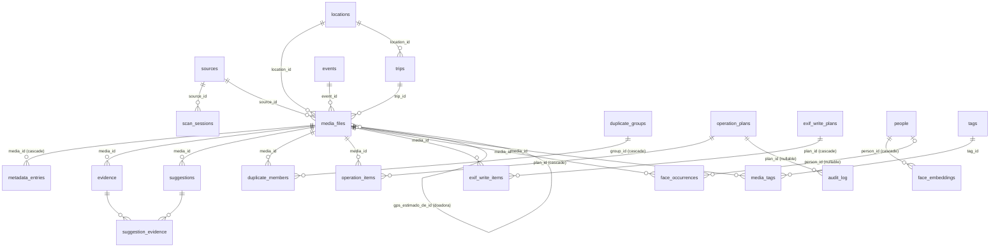

# MAPA COMPLETO — Foto Organizer (pacote autocontido para reconstrução)

> Concatenação gerada em 2026-09-20 de `docs/reconstrucao/00..11` seguida dos docs normativos
> citados, como anexos. Gerado por `cat`; a fonte são os arquivos individuais. Commit-base: `524903d`.


<!-- ===== 00-INDICE.md ===== -->

# Mapa de reconstrução — Foto Organizer

> Gerado em 2026-09-19 a partir do commit `524903d` (branch `main`) por leitura direta do
> código, dos docs normativos e do catálogo real (somente `SELECT`), com quatro agentes de
> domínio (arquivos, imagem/inferência, UX, arte), síntese transversal e um verificador
> independente. Público: um agente (ou pessoa) que vai **reconstruir a aplicação do zero**
> sem acesso a este repositório além desta pasta.

## Como usar

1. Leia na ordem abaixo. Cada arquivo é autocontido, mas os posteriores assumem os anteriores.
2. Toda afirmação cita `arquivo:linha` do repositório original — é a trilha para conferir, não
   um convite a copiar. Onde o mapa diz "verificar", o autor não conseguiu confirmar.
3. `08` e `09` dizem o que **não** reproduzir. Reconstruir bug conhecido é falha de leitura.
4. `10` é o critério de "terminei". Não declare pronto sem ele.
5. `MAPA_COMPLETO.md` é a concatenação 00→11 **mais os docs normativos citados** (`CLAUDE.md`,
   `docs/DECISOES.md`, `CONFIANCA.md`, `AGRUPAMENTO.md`, `EVENTOS.md`, `LOCAL_ESTIMADO.md`,
   `NAVEGACAO.md`, `PRIVACIDADE.md`, `PERFORMANCE.md`, `DIRECAO_DE_ARTE.md`,
   `EMPACOTAMENTO.md`) como anexos — é o pacote autocontido para colar num agente sem acesso
   ao repositório. Dentro do repo, esses docs vivem em `docs/` e são a fonte.

| Ordem | Arquivo | Responde |
|---|---|---|
| 1 | `01-PRODUTO.md` | O que é, valor central, os 8 invariantes, o acervo real, a stack fixa, as decisões a preservar |
| 2 | `02-FUNCIONALIDADES.md` | Inventário funcional com contrato de 10 campos por item (F-A = arquivos, F-I = imagem/inferência, F-U = experiência do usuário) |
| 3 | `04-PIPELINES.md` | Como o dado flui: scan → metadados → thumbnails → evidências → agrupamento → geo → duplicatas → sugestões → revisão → operações/EXIF; GenAI; jobs — com todas as constantes |
| 4 | `03-DADOS.md` | As 25 tabelas, enums, relações, migrações, modelo de evidência/confiança |
| 5 | `05-API_E_CLI.md` | 62 rotas, 12 subcomandos, guard de origem, config |
| 6 | `06-UI.md` | 21 telas/componentes, navegação, teclado, estados, camada de dados; § tokens e regras visuais |
| 7 | `07-INTEGRACOES.md` | exiftool, osxphotos, Takeout, Lightroom, reverse_geocode, Anthropic, Tauri, Keychain |
| 8 | `08-ERROS_CONHECIDOS.md` | Auditoria 2026-09-19 + dívida + histórico, com status e "o que fazer diferente" |
| 9 | `09-MELHORIAS.md` | Milestone v2.0, backlog, dívida, o que **não** carregar, ideias sem decisão |
| 10 | `10-VERIFICACAO.md` | Suítes, fixtures, contagens, invariante → prova, baselines, checklist |
| 11 | `11-DADOS_ESTATICOS.md` | Gerado do código: `TEMPLATE_PADRAO`, `ROTULOS`, `_TELAS`, `LACUNAS`, `ALCANCES`, `PAISES_PT`, `TZ_POR_PAIS`, prompts `_SYSTEM` literais, mensagens 409, shapes JSON sem contrato, valores reais de `evidence.campo/origem`, os 19 cenários do benchmark, formato do `INVENTARIO.md` |

## O que preservar × o que descartar (resumo; detalhe em 01 §8 e 09 §7)

**Preservar sem discussão:** os 8 invariantes; confiança como quantidade e elo mais fraco;
evidência estruturada com "por quê"; rebaixar-nunca-apagar (`papel`); janelas de herança por
campo (10 min / 2 h / 12 h) e raio de incerteza medido; álbum nomeia, não divide; geo-resolução
cedo; exiftool padrão com fallback; opt-in real para qualquer chamada externa com prévia do
payload; dry-run → aprovação → execução verificada → audit; webapp como única UI; SQLite como
única verdade local.

**Descartar:** tudo em `09 §7` — UIs antigas, `http_seguro` sem consumidor, endpoints órfãos,
`select()` fora de repositories, `skipif` silencioso, duplicação de `pastaCurta`, docs
históricos como se fossem spec, qualquer score único/soma/semáforo, qualquer `DELETE`/`move`.

**Corrigir ao reconstruir (não reproduzir):** `08 §A` — A1 (lock de jobs), A2 (sidecar com
sinal + verificação por valor), M1/M5 (base de tempo única), M2 (nome da pasta no payload),
M3 (retomada tolerante), M4 (`exif_transpose` no phash).

## Glossário (termos do domínio, como o código os usa)

- **Fonte (`sources`)** — raiz varrida (`PASTA`) ou catálogo externo importado
  (`APPLE_PHOTOS`, `LIGHTROOM`, Takeout). Tem identidade de volume (`volume_id`) para
  reconhecer o mesmo disco noutro ponto de montagem; **reapontar** é o ato explícito do dono
  de mover a fonte — nunca automático (D-036).
- **Alcance** — se o arquivo responde agora: `disponivel` (fonte), `arquivo_ausente` (não visto
  no walk — não significa apagado, D-037), `arquivo_offline` (volume desmontado). **Reconciliação
  de alcance** é a varredura leve que só confere existência, com orçamento de tempo.
- **Papel (`media_files.papel`)** — `ACERVO` (foto real do dono) vs testemunha/referência
  (miniatura interna, derivado, registro só-iCloud). Registro que não é acervo é **fonte de
  sinal**: sai da grade, da revisão e do plano; continua doando data, GPS e correlação (D-024).
- **Metadados brutos (`metadata_entries`)** — chave-valor de tudo que o extrator leu (3,6 M
  linhas). `media_files` guarda o que foi promovido a coluna tipada.
- **`data_capturada`** — hora de **parede local** da captura (o relógio no lugar), sem fuso.
  **`data_capturada_utc`** — o instante. **`tz_estimado`** — IANA inferido do país. `mtime` é
  UTC naive (`_ts`). Uma foto tem dois instantes; o offset não é coluna (D-038).
- **Evidência (`evidence`)** — uma linha por inferência: origem (`exif`, `gps`, `geocoding`,
  `pasta`, `album`, `nome_arquivo`, `fs`, `llm`, `llm_pasta`, `heranca`, `xmp`…), campo, valor,
  confiança (nível alta/média/baixa + score), justificativa legível, `versao_logica`.
- **Confiança** — quantidade, não cor (D-017). Níveis por origem em `docs/CONFIANCA.md` (EXIF
  0,95; geocoding offline 0,85; pasta 0,60; álbum 0,55; LLM 0,55; filesystem 0,40; visão 0,30;
  correção manual 1,0). **Elo mais fraco:** a sugestão vale o campo mais fraco do destino.
- **Sugestão (`suggestions`)** — destino proposto para uma mídia, renderizado por **template**
  (`{categoria}/{ano} - {viagem}/{evento}/{pais}/{regiao}/{cidade}` por padrão — `classification/templates.py:24`), com as evidências
  usadas (`suggestion_evidence`). Estados: pendente → aprovada/rejeitada. Decisão registrada do dono: reprocessamento que
  muda o destino **reabre** a aprovada; o código atual **congela** a aprovada
  (`engine.py:1120-1124`) — ver § Decisões em aberto, item 1.
- **Sessão** — cluster temporal (gap > 3 dias separa; corte adicional ao cruzar o raio de
  **casa** = 50 km, com confirmação). Ainda não é viagem.
- **Viagem (`trips`)** — sessão classificada pela cascata (pasta "Viagens", país no nome,
  mediana GPS > 100 km de casa, ou geocodificada ≥ 3 dias sem casa conhecida). Multi-país é
  nomeada pelas pernas.
- **Acontecimento / evento (`events`)** — divisão de uma sessão por ritmo local (fator 6× a
  mediana de 12 intervalos), piso 90 min, teto 8 h, deslocamento ≥ 3 km, mínimo 10 fotos, estadia
  > 20 h não se divide; viagem nunca se divide (`docs/EVENTOS.md`). Álbum nomeia, não divide.
- **Neutra** — sessão que nenhuma regra classificou; única que vai ao **advisor de cluster**
  (LLM, opt-in) ou fica sem rótulo. Nunca se inventa viagem nem evento.
- **Casa** — célula GPS modal (~11 km) com ≥ 20 fotos com GPS e ≥ 30% nela; senão "casa
  desconhecida".
- **Herança de GPS** — foto sem GPS recebe lugar de uma **doadora** de outra fonte próxima no
  tempo; janela por campo: cidade 10 min, região 2 h, país 12 h (D-025); confronta doadora
  antes **e** depois (D-074). Resultado: `gps_lat_estimado`, `gps_estimado_de_id`,
  `gps_estimado_delta_s`. **Lugar estimado** com **raio de incerteza**
  `min(50 km, max(15 m, 6 m/s × Δt))` (D-032), desenhado sem tiles (D-031).
- **Location (`locations`)** — resultado de geocodificação reversa offline (cidade, região,
  país) compartilhado por mídias.
- **Duplicata** — níveis: `exato` (xxhash + tamanho + SHA-256), `conteudo`, `visual` (phash,
  distância de Hamming ≤ `LIMIAR_VISUAL`), `sequencia` (rajada/burst — irmãs, não duplicatas),
  `variante` (RAW+JPEG da mesma captura; excluir uma exige aviso, D-070). Nenhuma ação
  automática; `preservados` são decisões do dono.
- **Plano de operação (`operation_plans/items`)** — lista origem → destino calculada pelo
  template. **Dry-run** obrigatório (recalcula conflitos, espaço, alcance) → aprovação →
  **execução** (cópia exclusiva `xb`, hash pré/pós, `copystat`, audit) → **inventário**
  (`inventario.json` + `INVENTARIO.md` na pasta destino, aditivo). Enum único `OperationStatus`
  (`models/operations.py:18-24`): `planejada · aprovada · executando · concluida · cancelada ·
  erro`, usado por plano e por item (item vai `planejada → concluida | erro`); "prontos",
  "pulados" e "copiados" são contadores do dry-run/execução, não estados persistidos.
- **Escrita EXIF (`exif_write_plans/items`)** — só GPS lat/long, cidade, país; só campo vazio;
  **direta** (`.jpg/.jpeg/.cr2`, allowlist medida byte a byte, D-077) ou **sidecar XMP** (demais
  formatos). Verificação por diff de tags, reconferência ao vivo (TOCTOU), backup `_original`
  apagado só após sucesso; estados por campo (PRONTO/GRAVADO/PULADO/…).
- **Advisor de cluster** (`llm`) — Claude Sonnet 5, sem thinking, só para sessões neutras, só
  metadado (pastas, amostra de nomes, período, contagem, lugares). **GenAI de pasta**
  (`llm_pasta`) — sessão interativa: candidatas por pasta, custo estimado antes, payload com
  allowlist, aprovação → `pasta_classificacoes_genai` → evidência 0,55 (D-081). **Léxico de
  nomes** (`nomes_classificados`) — cache do que cada nome significa. Todos opt-in.
- **Job** — trabalho em background do servidor: `scan`, `import`, `sugestoes`, `duplicatas`,
  `reconciliacao`, `operacao`, `escrita_exif`. Um por vez; estado por polling; pausa só para
  scan; cancelamento cooperativo (`ScanControl`) ou com limpeza de parcial (`ExecutionControl`).
- **Hash rápido** (xxhash, sempre) / **SHA-256** (sob demanda, candidatos a duplicata exata) /
  **phash** (perceptual 64 bits, BK-tree).
- **`versao_logica`** — versão da regra que gerou uma evidência/sugestão; muda → regenerar.
- **Organizável** — mídia de acervo cuja fonte responde agora (D-068); é o funil do Panorama.

## Cobertura mecânica da spec (Fase 3)

Script de `10-VERIFICACAO.md` § anexo, rodado em 2026-09-20 sobre `524903d`:

| Superfície | No código | Ausentes no mapa |
|---|---|---|
| Rotas FastAPI (paths únicos; `{plan_id}`≡`{id}`) | 59 (62 decoradores) | 0 |
| Tabelas (24 ORM + `suggestion_evidence`) | 25 | 0 |
| Componentes React | 21 | 0 |
| Subcomandos CLI | 12 | 0 |
| Migrações Alembic (por número) | 20 | 0 |

## Decisões em aberto para o reconstrutor (do dry-run independente)

Levantadas por um agente independente que leu só esta pasta (2026-09-20) e tentou
reconstruir. Cada uma muda a implementação; a coluna "default" é o que o reconstrutor faz se
ninguém responder — e deve registrar como decisão própria.

| # | Pergunta ao dono | Onde a spec silencia | Default do reconstrutor |
|---|---|---|---|
| 1 | Construir o mecanismo de **reabertura de sugestão aprovada**? Gatilho: destino mudou, evidência mudou ou `versao_logica` mudou? | `02` F-I24; `04` § Lacunas 5; código congela (`engine.py:1120-1124`), decisão do dono diz reabrir | Implementar reabertura por "destino renderizado mudou", com a decisão anterior preservada no histórico |
| 2 | **Base de tempo única** (M1/M5): normalizar `mtime` por `tz_estimado`, excluir só-mtime da linha do tempo, ou manter? | `04` § Lacunas 1; `08` M1/M5 | Um `quando(media)`: EXIF → nome do arquivo → mtime convertido para parede local; cenário novo no benchmark antes |
| 3 | M2: enviar `Path(pasta).name` (perde hierarquia que ajuda o modelo) ou enviar relativo à raiz da fonte? | `08` M2 | Relativo à raiz da fonte, com prévia mostrando exatamente o que sai |
| 4 | Corrigir `exif_transpose` no phash invalida todos os `hash_perceptual` e os 1.348 grupos. Invalidar e recomputar? | `08` M4; `04` § Lacunas 2 | Corrigir + migração que zera `hash_perceptual` + rerodar detecção |
| 5 | Recriar as **20 migrações** históricas ou nascer com uma inicial já no head? | `03` §4 dá só o efeito de cada uma | Uma inicial no head; o histórico fica como documentação |
| 6 | Os 11 achados "verificar" de `08` §C são bugs a corrigir ou não-reproduzíveis? | `08` §C | Tratar como abertos: escrever um teste para cada antes de decidir |
| 7 | Origens declaradas sem produtor (`gps` 0,95, `geocoding_externo` 0,75, `visao` 0,30, `agrupamento` 0,70): contrato futuro ou dívida? | `04` § Lacunas 4; `11` § evidence.origem | Manter na tabela de confiança, sem produtor, documentado |
| 8 | Preços do modelo (`$2/$10` por MTok) e câmbio fixo 5,0 na estimativa de custo estão datados. Atualizar como? | `07` § Lacunas 3/4 | Ler preço de config, câmbio fixo com ressalva na UI |
| 9 | Endpoints sem consumidor (`/api/midia/alcances`, `POST /api/reconciliacao`, `/api/midia/filtros`): construir com consumidor ou não construir? | `09` §7 × `10` §9 | Construir com consumidor (reconciliação na UI; filtros ligados) |
| 10 | Lightroom continua só na CLI (sem rota nem UI)? | `05` § Lacunas 4 | Sim, pelo motivo de TCC/volume desmontado |
| 11 | `ConfigClassificacao` (5 limiares) vira configurável em runtime? | `04` § Lacunas 6 | Não; só por código + benchmark |
| 12 | `faces/`, `vision/`, `crypto.py`, `tags`/`media_tags`, `http_seguro.py`: carregar como stub/tabela vazia ou deixar fora? | `09` §7 só decide `http_seguro` | Carregar os `Protocol` + tabelas; `http_seguro` fora até ter consumidor com SSRF fechado |
| 13 | Restaurar backup `_original` vira rota/comando ou continua manual? | `02` F-A24/F-U25 (parcial); `06` § Lacunas 9 | Manual; o app preserva e expõe o caminho |
| 14 | Allowlist de avisos do exiftool (`IPTCDigest is not current`)? | `09` §1; `.planning/STATE.md:222` | Sem allowlist: aviso novo reprova (fail-safe) |
| 15 | Tasks 2/3 do plano 07-10 (sessão real de 10 pastas com a chave do dono; marcar GENAI-01..03 após checkpoint humano) entram na reconstrução? | `09` §1 | Fora de escopo; GENAI fica "feito na essência, não homologado" |

Contradições internas encontradas pelo mesmo verificador foram **corrigidas no mapa** em
2026-09-20 (template com `{pais}`, enum `OperationStatus`, condição da miniatura, dependência
conjunta `rawpy`+`exifread`, D-057 × D-051, 19 cenários do benchmark, 6 etapas do assistente
GenAI, aprovação que descarta as demais, `GET /api/status` com 6 chaves, `Fonte.tipo` sem
`lightroom` no TS, teto 500 de `limit`). Buracos de dado puro viraram `11-DADOS_ESTATICOS.md`;
docs normativos fora da pasta viraram anexos do `MAPA_COMPLETO.md`.


<!-- ===== 01-PRODUTO.md ===== -->

# 01 — Produto: o que é, o que vale, o que nunca pode quebrar

> Parte do mapa de reconstrução (`docs/reconstrucao/`). Leia depois de `00-INDICE.md`.
> Fontes: `CLAUDE.md` (raiz), `.planning/PROJECT.md`, `docs/DECISOES.md` (D-001..D-081),
> `docs/ROADMAP.md`, `docs/CONFIANCA.md`, `docs/PRIVACIDADE.md`. Números do acervo lidos do
> catálogo real em 2026-09-19 (somente `SELECT`).

## 1. O que é

App desktop macOS, **local-first**, para catalogar, analisar e organizar de forma assistida e
**não destrutiva** uma coleção pessoal grande de fotos (ordem de 100 mil registros, 25 anos,
dezenas de câmeras). Um único usuário: o dono, na própria máquina. O núcleo (scan, catálogo,
evidências, agrupamento, geolocalização offline, duplicatas, plano de cópia, escrita EXIF de
localização) funciona **inteiramente offline**. Recursos de nuvem (advisor LLM de cluster e
classificação de pasta por GenAI, ambos via API Anthropic) são **opt-in, desligados por padrão
e nunca pré-requisito**.

Forma de entrega: servidor FastAPI só em `127.0.0.1` servindo um webapp React (única UI), com
shell nativo Tauri 2 que embarca o runtime Python e abre a webview na porta anunciada. CLI para
operação sem UI.

## 2. Valor central (o que diferencia de um DAM comum)

> Toda sugestão de onde uma foto pertence é **auditável até a evidência que a gerou** —
> origem, confiança, justificativa — e **nenhuma operação física acontece sem revisão humana
> e dry-run**. Se isso quebrar, o produto perdeu a única coisa que o diferencia.
> (`.planning/PROJECT.md` § Core Value)

Corolários que a reconstrução precisa manter visíveis na UI, não só no banco:
- Cada campo de uma sugestão responde "por quê?" com origem + confiança + frase legível.
- Confiança é **quantidade** (segmentos), não semáforo de 3 cores (D-017): cor sozinha compete
  com a foto e falha para daltônicos.
- Confiança de uma sugestão é a do **elo mais fraco** entre os campos do destino — nunca média
  nem soma (`docs/CONFIANCA.md` § Regra de agregação).
- A unidade de decisão na Revisão é o **grupo** de sugestões idênticas, não a linha (D-018).

## 3. Princípio operacional

**Primeiro catalogar, depois sugerir, então revisar, e somente por último executar operações
físicas.** Cada etapa é um estado persistido e reversível até a última; a última (cópia,
escrita EXIF) é a única que toca o mundo fora do catálogo e exige plano → dry-run → aprovação
explícita → execução verificada → audit log.

## 4. Invariantes de segurança (nunca violar — `CLAUDE.md` raiz)

| # | Invariante | Onde a reconstrução prova |
|---|---|---|
| 1 | Catalogação é somente leitura: scan/análise nunca move, renomeia, exclui nem altera metadado. | Teste de scanner com hash do diretório antes/depois; ver `04-PIPELINES.arquivos.md`. |
| 2 | Operação física só existe como **plano dry-run** até aprovação explícita; execução é **copiar**, nunca mover. | `operations/` — `DryRunObrigatorio`; `10-VERIFICACAO.md`. |
| 3 | Nunca sobrescrever destino existente; hash antes e depois de cada cópia; tudo em audit log. | `_copiar_exclusivo` com `open("xb")`; ver `08-ERROS_CONHECIDOS.md` A3 (ramo de hash divergente hoje sem teste). |
| 4 | Nenhum dado sai da máquina por padrão. Serviço externo e sync são opt-in explícito, desligados inicialmente, com indicação prévia de **quais dados, finalidade, destino e revogação**. Nunca sincronizar fotos/RAW ou embeddings faciais sem consentimento específico e separado. Minimização de dados. | `settings.privacidade.servicos_externos=False`; opt-in de GenAI de pasta em `application_settings` (D-080); `docs/PRIVACIDADE.md`. **Divergência aberta:** caminho absoluto no payload (A: `08` M2). |
| 5 | Subprocesso sempre sem `shell=True`, argumentos em lista, caminhos validados (anti path traversal). Não atravessar symlinks por padrão. | `security/paths.py`; `metadata/exiftool.py`; `exif_write/writer.py`; `scanner/discovery.py`. |
| 6 | Reconhecimento facial desativado por padrão, processamento local, embeddings criptografados, resultado sempre sugestão a confirmar. | `faces/` é **stub**; `security/crypto.py` (Fernet + Keychain) pronto sem consumidor. |
| 7 | Exclusão de fotos **nunca é implementada**. Escrita EXIF em original só para **localização** (GPS lat/long, cidade, país) e só em **campo vazio** — nunca sobrescreve valor existente. Mesmo rigor de `operations/`: dry-run revisado, hash antes/depois, audit log. Qualquer outro campo EXIF fica fora de escopo (D-075). | `exif_write/` — reconferência ao vivo (TOCTOU); `08` A2/A4. |
| 8 | Nada que possa ser referência real de uma foto é apagado — nem do disco, nem do catálogo. Registro sem valor de acervo é **rebaixado a fonte de sinal** (`papel`), continua doando data/GPS/correlação (D-024). Medido: apagar 45.822 miniaturas do Apple Fotos levaria fotos com lugar estimado de 2.117 para 162. | Coluna `media_files.papel`; filtro `_ACERVO_OU_REFERENCIA`; nenhum `DELETE` de mídia no código. |

## 5. O acervo real (por que o produto é assim)

Estado do catálogo em 2026-09-19 (`SELECT` no `catalog.db`; foi zerado em 2026-08-16/17 para
baseline e re-varrido em 2026-08-19):

| Métrica | Valor |
|---|---|
| `media_files` | 102.251 |
| Fontes | 4: `/Volumes/photo` (rede, DiskStation), `/Volumes/Externo` (USB), Apple Fotos (`Photos Library`), `/Volumes/photo/Portfolio` |
| Com GPS próprio (`gps_lat`) | 21.753 (21%) |
| Sem `data_capturada` (só `mtime`) | 1.129 (1,1%) |
| `evidence` | 175.569 |
| `suggestions` | 55.096 (+143.044 `suggestion_evidence`) |
| `metadata_entries` (tags brutas) | 3.598.491 |
| `locations` | 2.203 |
| `trips` / `events` | 13 / 70 |
| `duplicate_groups` / `duplicate_members` | 1.348 / 3.158 |
| `exif_write_plans` / itens | 2 / 2.416 |
| `pasta_classificacoes_genai` | 3 |
| `people`, `face_*`, `tags`, `media_tags`, `nomes_classificados`, `operation_*` | 0 (stubs, ou nunca usados neste catálogo) |

Fatos medidos que **definem a ordem de prioridade** do roadmap (`docs/ROADMAP.md`, D-024..D-030):
- **Pixel local é raro.** Historicamente ~99 mil registros conhecidos, 44.661 do Apple Fotos só
  no iCloud e 45.397 do Lightroom em volume desmontado — só ~5% com arquivo legível. Tudo que
  precisa abrir a imagem (rosto, visão) alcança pouco.
- **GPS é raro e recente.** 58 câmeras de 2001 a 2026; só a EOS 5D Mark IV tem receptor
  próprio; 4 de 25 anos com GPS. Por isso existe **herança de GPS entre fontes** e **lugar
  estimado com raio de incerteza** — não é enfeite, é a única resposta a "onde" para a maior
  parte do acervo.
- **Intenção declarada é abundante.** 27.226 nomeações de álbum, notas, palavras-chave XMP/IPTC
  já no banco. Por isso "álbum nomeia, não divide" (D-030/D-034) e palavra-chave vira evidência
  de categoria (D-057).
- Escala já medida: 422.738 registros numa rodada de auditoria. Grade virtualizada, sem N+1, sem
  imagem em resolução completa são **requisitos**, não otimizações.

Baseline de performance (M2, 16 GB, 1.382 arquivos, `docs/PERFORMANCE.md`): varredura 59
arq/s; geração de sugestões 1,33 s; duplicatas 4,54 s. Motor e detector são full-scan em memória
(sem caminho incremental) — ver `09-MELHORIAS.md`.

## 6. Stack fixa (decidida; trocar exige justificativa de ganho concreto)

- Python ≥ 3.12; SQLite em WAL como **única fonte local de verdade**; SQLAlchemy 2 + Alembic.
- FastAPI só em `127.0.0.1` (`fotoorganizer/server/`) + React 18 / Vite 6 / TypeScript 5.6 /
  Tailwind 4 / TanStack Query 5 / react-virtual (`webapp/`). **Única UI.** PySide6 e Streamlit
  já foram tentados e removidos (commit `2e0ef1a`) — não reabrir sem evidência nova.
- Tauri 2 + python-build-standalone para o `.app` (não PyInstaller — fragilidade de codesign de
  libraw/libheif; `docs/EMPACOTAMENTO.md`). Marco 1 (assinatura ad-hoc) entregue; Marco 2
  (notarizado, US$ 99/ano) não aprovado.
- Metadados: exiftool em batch (`-stay_open`) quando instalado (D-026), fallback puro-Python
  (Pillow + exifread + pillow-heif + rawpy). MakerNotes fora da base bruta (D-027).
- Hashing: xxhash sempre + SHA-256 sob demanda; duplicata visual por `imagehash.phash`.
- Geocodificação reversa offline (`reverse_geocode`); externo só opt-in (não existe hoje).
- Thumbnails em `~/Library/Caches/FotoOrganizer/thumbs`, geradas em background.
- Testes: pytest (fixtures sintéticas geradas em runtime — **nunca foto real no repo**) + vitest.
- Config TOML; logging estruturado sem conteúdo sensível.
- Railway/Postgres: só como adaptador **opcional** de sync/backup de metadados; binários e
  embeddings nunca vão para lá. Não existe hoje.

## 7. Fora de escopo (com o motivo, para não voltar)

- Visão/rosto via provedor externo — conflita com invariante 4; quando entrarem, entram locais
  (`docs/PLANO_IA_E_PRODUTO.md` §8).
- Exclusão de fotos — invariante 7.
- Escrita EXIF fora de localização, ou sobrescrita de campo preenchido — D-075.
- Outra UI que não o webapp — decidido e revertido.
- Quatro lacunas de esquema DAM (derivados/linhagem, tags hierárquicas, direitos, coleções
  autorais) — não-bloqueio (D-008); só com caso de uso real.
- Score único de "saúde do acervo" — viola elo mais fraco; usar distribuição por dimensão.
- Paginação da grade — medido: não é o problema; o problema é âncora temporal (`NAVEGACAO.md`).

## 8. Decisões que a reconstrução DEVE preservar

Linha = título da decisão (`docs/DECISOES.md`, linha indicada) + o que ela fixa. Quem
reconstrói lê a entrada completa antes de mudar qualquer regra abaixo.

**Modelo de confiança e evidência**
- D-017 (`:269`) confiança como quantidade, não semáforo.
- D-018 (`:288`) unidade de decisão da Revisão é o grupo.
- D-021 (`:335`) precedência XMP → IPTC → EXIF na leitura de metadados.
- D-043 (`:1117`) `versao_logica` precisa ser lido (era escrito e nunca lido) — regenerar quando a
  metodologia mudar.
- D-057 (`:1770`) palavra-chave XMP/IPTC vira evidência de categoria.
- D-074 (`:2637`) herança de GPS confronta doadora antes **e** depois (duas âncoras) em vez de
  descartar o perdedor; nenhum bônus de confiança sem medição.
- D-081 (`:3162`) score de `llm_pasta` = 0,55, preliminar (amostra de 4 pastas).

**Sinal nunca é apagado**
- D-024 (`:387`) rebaixar, nunca apagar (invariante 8). D-035 (`:730`) registra a remoção das
  miniaturas do Apple Fotos feita **antes** de D-024 e o custo medido (10 fotos de 4.938).
- D-036 (`:788`) reapontar fonte não reescreve referência de nuvem. D-037 (`:820`) "não visto
  no walk" ≠ "apagado" — vira `arquivo_ausente`/`arquivo_offline`, nunca remoção.
- D-068 (`:2204`) "organizável" exige a fonte respondendo agora.

**Tempo e lugar**
- D-025 (`:409`) janela de herança depende do campo: cidade 10 min, região 2 h, país 12 h.
- D-029 (`:504`) GPS de câmera com receptor ≠ coordenada de celular (sinais diferentes).
- D-031 (`:542`) mapa do lugar estimado **sem tiles externos** (tile revela coordenada).
- D-032 (`:580`) raio de incerteza é **medido**: `raio(Δt)=min(50 km, max(15 m, 6 m/s×Δt))`.
- D-033 (`:626`) foto fora de alcance continua no mapa com o motivo.
- D-038 (`:863`) uma foto tem dois instantes (parede local e UTC); offset **não é coluna** —
  `data_capturada` é parede, `data_capturada_utc` existe, `tz_estimado` é IANA por país.
- D-051/D-052/D-058 (`:1501`, `:1570`, `:1799`) geo-resolução cedo (antes da cascata), como
  funções puras.
- D-066/D-067/D-073 (`:2101`, `:2156`, `:2585`) normalizar NFD em nome de pasta e mês por
  extenso antes de comparar.

**Agrupamento e nomes**
- D-030 (`:528`) + D-034 (`:653`) álbum **nomeia**, nunca divide; desempate em 3 camadas
  (`docs/AGRUPAMENTO.md` §2c). Os álbuns se aninham (mesma foto em 3 álbuns em 29 dias).
- D-042/D-046 (`:1087`, `:1245`) empilhamento de capturas irmãs (RAW+JPEG etc.) = 11,72% do
  acervo; um mapa só.
- D-053/D-054 (`:1624`, `:1677`) categoria travada em 3 valores; expansão é um **eixo novo**
  (tipo de mídia), não mais opções.

**Extração e fontes**
- D-026/D-027 (`:433`, `:455`) exiftool padrão quando instalado; MakerNotes fora.
- D-028 (`:477`) Lightroom é fonte externa e a principal do discovery.

**IA embarcada**
- D-004 (`:56`) IA é superfície de produto com três restrições (ler a entrada).
- D-022 → D-048/D-049 → D-059/D-060 (`:352`, `:1343`, `:1398`, `:1845`, `:1880`): advisor de
  cluster com `thinking` desligado; Haiku inventa onde Opus recusa; modelo final **Sonnet 5**,
  medido nos 104 clusters reais. Consultado só para sessões "neutra".
- D-047 (`:1288`) "resíduo" do advisor é 39% das sessões / 43% do acervo — não é zero.
- D-079 (`:3051`) prévia de custo do GenAI de pasta: estimativa local antes, contagem exata depois.
- D-080 (`:3113`) opt-in do GenAI de pasta mora em `application_settings`, não em TOML.

**Operações e escrita**
- D-061..D-064 (`:1933`..`:2012`) inventário por pasta (`inventario.json` + `INVENTARIO.md`),
  escrita aditiva, só após cópia verificada.
- D-075 (`:2741`) escrita EXIF de localização em campo vazio revoga parte do invariante 7.
- D-076/D-077 (`:2791`, `:2884`) allowlist de formatos com escrita direta medida **byte a byte**
  contra o acervo: só `.jpg/.jpeg/.cr2`; o resto vai para sidecar XMP.
- D-078 (`:2963`) `IPTC:EnvelopeRecordVersion` entra no andaime incondicional.

**Navegação e arte**
- `docs/NAVEGACAO.md` decisões 1-3: abas com esqueleto comum; esquerda é lugar, topo é recorte,
  um estado só (chips); rolagem contínua com âncora temporal — **não paginar**.
- Tokens de design: fonte de verdade é `webapp/src/index.css` `@theme`; `DIRECAO_DE_ARTE.md`
  espelha (`06-UI.arte.md`).

**Decisões de processo (histórico; não são requisitos do produto):** D-001..D-003, D-005..D-007,
D-009..D-016, D-019/D-020, D-023, D-039..D-041, D-044/D-045, D-050, D-055/D-056, D-069..D-072
(auditoria pós-gate e suas fatias). Úteis para entender *por que*, não *o quê*.

## 9. O que "pronto" significa para o produto inteiro

`scripts/verificar.sh` verde (pytest + benchmark de agrupamento 100% dos cenários + vitest +
build), nenhuma violação dos 8 invariantes, app abre e cada fatia é demonstrável ponta a ponta
com o catálogo real. Detalhe por funcionalidade em `10-VERIFICACAO.md`.


<!-- ===== 02-FUNCIONALIDADES.md ===== -->

# 02 — Funcionalidades: inventário com contrato

> Parte do mapa de reconstrução. Um bloco por funcionalidade, sempre com os 10 campos:
> Propósito · Gatilho · Entradas · Regras de negócio · Saídas · Degradação/falha · Estado ·
> Testes que provam · Decisões · Arquivos. Três partes por domínio, numeradas de forma
> independente: **F-A** (arquivos: scan, fontes, alcance, duplicatas por hash, operações
> físicas, escrita EXIF, segurança, config, empacotamento), **F-I** (imagem e inferência:
> metadados, thumbnails, evidências, cascata, agrupamento, herança de GPS, geolocalização,
> duplicatas visuais, GenAI, stubs) e **F-U** (experiência do usuário: o contrato de cada tela e
> fluxo). O backend de um F-U está no F-A/F-I correspondente; a UI de um F-A/F-I está no F-U.
> Cada parte termina com as lacunas declaradas pelo autor.

---

# Parte A — Arquivos (F-A)

# 02 — Inventário funcional do domínio ARQUIVOS

Uma funcionalidade por bloco, template fixo de 10 campos. "n/a" é literal.
Escopo: `scanner/`, `sources/`, `duplicates/` (hash exato), `operations/`,
`exif_write/`, `security/`, `server/jobs.py`, `config/`, empacotamento.

Detalhe de contrato em `04-PIPELINES.arquivos.md`; rotas e CLI em
`05-API_E_CLI.md`; tabelas em `03-DADOS.md`; integrações em
`07-INTEGRACOES.arquivos.md`.

Achados da auditoria de 2026-09-19 (`A1`-`B10`) são referenciados por id,
não re-auditados.

---

### F-A01 — Scan de pasta (descoberta + indexação incremental)
- Propósito: varrer uma raiz do filesystem e catalogar todo arquivo de mídia
  elegível, somente leitura sobre as fotos. É a porta de entrada do acervo.
- Gatilho: tela `ModalCaminho` / `Sidebar` → rota `POST /api/scan` / CLI
  `fotoorganizer scan <pasta>... [--reprocessar]`
- Entradas: caminho absoluto da pasta; `ScannerSettings` (`workers`,
  `incluir_ocultos`, `seguir_symlinks`); `Source.padroes_ignorados` (globs).
- Regras de negócio:
  1. Extensões aceitas vêm SEMPRE de `PurePythonExtractor.supported_extensions()`
     (`metadata/exiftool.py:311-315`), mesmo com exiftool instalado: Pillow
     (`.jpg .jpeg .png .tif .tiff .webp .bmp .gif`) + vídeo
     (`.mov .mp4 .m4v .avi`) + HEIF se `pillow-heif` + RAW se `rawpy` **e** `exifread` (import conjunto em `metadata/purepython.py:32-41` — faltar qualquer um dos dois desliga RAW inteiro).
  2. Symlinks NÃO são atravessados por padrão (invariante 5); ciclos de
     diretório são cortados por `(st_dev, st_ino)` já visitados.
  3. Ocultos ignorados por padrão; lixo de sistema (`thumbs.db`,
     `desktop.ini`, `.ds_store`) e diretórios `@eadir`/`.thumbnails` sempre.
  4. Pastas de trabalho de programação NÃO são varridas
     (`discovery.py:29-46`): `node_modules`, `cache`, `caches`, `venv`,
     `site-packages`, … e sufixos `.xcassets .imageset .app .framework …`.
  5. Pacotes de biblioteca de foto (`.photoslibrary`, `.photolibrary`,
     `.migratedphotolibrary`, `.aplibrary`, `.lrdata`) SÃO descidos, mas o
     conteúdo entra como `papel=SINAL` — exceto o que estiver diretamente
     sob `originals/` ou `masters/` dos quatro primeiros, que é original e
     volta a `ACERVO`.
  6. Incremental: arquivo com `(tamanho, inode, mtime±1e-6 s)` inalterados é
     pulado. `--reprocessar` ignora a assinatura.
  7. Extração paralela em `ThreadPoolExecutor(max(workers,1))`, janela de
     `max(workers*2, 4)` em voo, teto de `_EXTRACAO_TIMEOUT_S = 120 s` por
     arquivo; **o banco é escrito por uma única thread**, na ordem de
     descoberta.
  8. Commit + checkpoint a cada `_BATCH_SIZE = 200` itens.
  9. `mtime`/`ctime` gravados UTC naive via `_ts()`; `ctime` usa
     `st_birthtime` no macOS. `data_capturada_utc = data_capturada` quando o
     extrator não traz fuso (= "fuso desconhecido").
  10. Arquivo dentro de pacote (`dentro_de_pacote(path)`, `scanner.py:408`) não ganha miniatura — é o mesmo predicado que o rebaixa a `papel=SINAL` (`:440-441`), então no scan os dois conjuntos coincidem; testemunhas criadas por outra via (migração 0009, referência externa) tampouco têm miniatura porque nunca passam por `get_or_generate`. Testemunha (`papel=SINAL`) não ganha miniatura nem base bruta de
      metadado — só `curadoria` e `derivado` (`scanner.py:484-505`).
  11. Identidade de fonte por `samefile` (dispositivo+inode), não por
      string: o APFS não distingue maiúscula. Fonte cujo caminho não existe
      agora é pulada na comparação.
- Saídas: linhas em `media_files` e `metadata_entries`; `Source` criada ou
  reaproveitada com `disponivel` atualizado; `ScanSession` com contadores,
  checkpoint e status. Miniaturas no cache. **Nenhuma escrita em arquivo.**
- Degradação/falha: fonte indisponível → `ScanSession.status=ERRO` +
  `checkpoint={"motivo": "volume ou pasta indisponível"}`, nada é tocado.
  `OSError` por diretório → log + continua (e o diretório entra em
  `diretorios_com_erro`). Erro/timeout por arquivo → `metrics.erros++`,
  `erro_leitura` preenchido, a foto entra sem metadado, varredura segue.
  Sem exiftool → fallback puro-Python, menos tags (sem `Make`/`Model` em
  CR3). Sem `rawpy`/`pillow-heif` → essas extensões somem da descoberta.
- Estado: pronto
- Testes que provam: `tests/test_scanner.py::test_corrompido_nao_interrompe_scan`,
  `::test_extracao_que_excede_o_teto_vira_erro_e_o_scan_segue`,
  `::test_segunda_passada_nao_rele_inalterados`,
  `::test_reprocessar_relê_arquivo_inalterado`,
  `::test_fonte_indisponivel`, `::test_fonte_reutilizada_entre_scans`,
  `::test_testemunha_nao_ganha_thumbnail`;
  `tests/test_discovery.py::test_nao_atravessa_symlink_e_evita_ciclo`,
  `::test_original_dentro_do_pacote_nao_e_rebaixado`
- Decisões: D-024 (rebaixar, nunca apagar), D-026 (exiftool padrão quando
  instalado), D-027 (MakerNotes fora), D-038 (dois instantes)
- Arquivos: `fotoorganizer/scanner/scanner.py:160-575` (entrada
  `scan_source:160`), `fotoorganizer/scanner/discovery.py:134-217`,
  `fotoorganizer/scanner/elegibilidade.py:25-42`,
  `fotoorganizer/security/hashing.py:20-29`,
  `fotoorganizer/server/jobs.py:170-194`, `fotoorganizer/cli.py:219-236`

---

### F-A02 — Pausa, continuação e cancelamento de trabalho
- Propósito: dar ao dono controle sobre um trabalho longo sem perder o que
  já foi feito.
- Gatilho: tela `StatusBar`/`useJob` → rotas `POST /api/job/pausar`,
  `POST /api/job/continuar`, `POST /api/job/cancelar` / CLI n/a (o CLI roda
  em foreground; Ctrl-C mata o processo)
- Entradas: nenhuma (agem sobre o job corrente, um por vez).
- Regras de negócio:
  1. **Só o scan tem pausa cooperativa** (`ScanControl`). Importação,
     execução de plano e escrita EXIF não a oferecem.
  2. `pausar()` exige `tipo=="scan"` e `status=="rodando"`; `continuar()`
     exige `status=="pausado"`. Fora disso devolve `False` **sem efeito
     colateral**, e a rota responde 409 em vez de estourar.
  3. `cancelar()` faz `continuar()` ANTES de `cancelar()` — um job pausado
     precisa acordar para ver o cancelamento — e propaga para o
     `ExecutionControl` quando existe.
  4. Scan cancelado drena o que já estava em voo (`consumir(0)`) para não
     jogar fora extração já paga, e fecha como `ScanStatus.PAUSADO`.
  5. Scan cancelado **não marca sumiço** (viu poucos caminhos; a diferença
     entre conhecidos e vistos explodiria).
  6. Execução de cópia e de escrita EXIF terminam o item corrente e param;
     o plano vira `CANCELADA`. Commit por item torna a retomada segura.
- Saídas: `ScanSession.status`; `OperationPlan.status`/`ExifWritePlan.status`
  = `CANCELADA`; snapshot do job com `status` correspondente.
- Degradação/falha: cancelar sem job em curso é no-op (200). Pausar/continuar
  fora do estado → 409 com mensagem específica. Morte do processo no meio:
  ver F-A03.
- Estado: parcial — falta pausa para importação e para execução de plano;
  `_exec_control` nunca é limpo após o job (**B3**); cancelamento de execução
  e de escrita EXIF **sem teste ponta a ponta** (**M8**).
- Testes que provam: `tests/test_scanner.py::test_cancelamento_e_retomada`,
  `::test_scan_cancelado_nao_marca_sumico_em_massa`;
  `tests/test_server_api.py::test_pausar_e_continuar_scan_em_background`,
  `::test_pausar_continuar_sem_job_e_recusado_limpo`;
  `tests/test_operations.py::test_cancelamento_e_retomada`;
  `tests/test_reconciliacao.py::test_cancelamento_no_meio_da_passada_salva_checkpoint_parcial`
- Decisões: n/a
- Arquivos: `fotoorganizer/server/jobs.py:61-87,124-147`,
  `fotoorganizer/scanner/scanner.py:89-111,292-303`,
  `fotoorganizer/operations/executor.py:42-51,174-177`,
  `fotoorganizer/server/app.py:1513-1528`

---

### F-A03 — Retomada de varredura interrompida
- Propósito: um scan que morreu com o processo (app fechado, Mac desligado)
  deixaria a sessão em `RODANDO` para sempre, e o catálogo mentiria sobre
  trabalho em curso. Esta funcionalidade fecha a mentira e oferece a
  retomada.
- Gatilho: tela `RetomarScan.tsx` / rota `GET /api/scan/interrompidos` (e
  o hook de startup do servidor) / CLI n/a
- Entradas: nenhuma.
- Regras de negócio:
  1. No boot do servidor, `reconciliar_orfas` carimba toda `ScanSession`
     `RODANDO` como `INTERROMPIDO` + `finalizado_em`. É seguro por
     construção: nenhum job pode estar rodando antes de o servidor existir.
  2. A listagem só conta a sessão **mais recente** de cada fonte: se um scan
     posterior concluiu, a interrupção antiga é história, não pendência.
  3. A retomada **não** é um comando novo: é um `POST /api/scan` no mesmo
     caminho. O incremental pula o que já foi indexado, ao custo de um
     `stat()` por arquivo.
  4. A reconciliação de alcance (F-A05) **não** grava `ScanSession` de
     propósito — uma passada parcial dela apareceria nesta tela e o botão
     "Retomar" dispararia o comando errado.
- Saídas: `ScanSession.status = INTERROMPIDO`; a lista com `source_id`,
  `caminho`, `apelido`, `disponivel`, `quando`, `vistos`, `indexados`.
- Degradação/falha: falha no hook de startup é capturada e logada
  (`log.warning`), o servidor sobe mesmo assim. Fonte indisponível aparece
  na lista com `disponivel=false` — a tela diz que não dá para retomar agora.
- Estado: pronto
- Testes que provam: `tests/test_scanner.py::test_sessao_rodando_orfa_vira_interrompida_no_boot`;
  `tests/test_server_api.py::test_scan_orfao_e_reconciliado_no_boot_e_oferecido_para_retomada`
- Decisões: n/a
- Arquivos: `fotoorganizer/scanner/scanner.py:122-144`,
  `fotoorganizer/server/app.py:1469-1507,1603-1614`

---

### F-A04 — Marcação de sumiço no scan (`arquivo_offline`)
- Propósito: distinguir "o arquivo sumiu do disco" de "sempre esteve lá" sem
  nunca apagar o registro.
- Gatilho: efeito colateral do fim de uma passada de `POST /api/scan` / CLI
  `fotoorganizer scan`
- Entradas: o conjunto `conhecidos` (índice da fonte carregado no início) e
  o conjunto `vistos` (todo caminho cujo `stat()` teve sucesso nesta passada).
- Regras de negócio:
  1. Candidato = `conhecidos - vistos`, filtrado por
     `eh_caminho_de_filesystem` (nada com `://`).
  2. **Três guardas antes de escrever**, em ordem:
     (a) passada cancelada → não marca nada;
     (b) `diretorios_com_erro` não vazio → não marca nada, só `log.warning`
         (o walk não viu a árvore inteira; a reconciliação cobre depois);
     (c) segunda confirmação `Path(c).exists()` — um caminho pode ter saído
         do walk porque `padroes_ignorados` ou a lista de extensões mudou.
     A guarda (c) **não substitui** a (b): sob pasta sem permissão de
     leitura, `exists()` também devolve `False`.
  3. `UPDATE` em lotes de `_LOTE_SUMICO = 500` (o limite de variáveis do
     SQLite estoura com tudo de uma vez), com
     `arquivo_ausente IS FALSE` e `caminho NOT LIKE '%://%'` **redundantes de
     propósito**: última linha de defesa contra marcar referência de
     catálogo externo como sumida.
  4. O registro e seus metadados **nunca** são apagados (invariante 8).
  5. Caminho de volta: `_gravar` põe `arquivo_offline=False` — chegar ali
     prova que o arquivo existe agora.
- Saídas: `MediaFile.arquivo_offline`; a UI mostra "arquivo sumiu do disco"
  como `motivo_indisponivel`.
- Degradação/falha: NAS que cai no meio ou subpasta sem permissão → nenhuma
  marcação nesta passada (guardas b/c), e a reconciliação confirma depois com
  calma.
- Estado: pronto
- Testes que provam: `tests/test_scanner.py::test_arquivo_que_some_e_marcado_offline`,
  `::test_arquivo_que_volta_e_marcado_online_de_novo`,
  `::test_diretorio_ilegivel_no_meio_do_walk_nao_marca_sumico`,
  `::test_subpasta_sem_permissao_real_nao_marca_sumico`,
  `::test_padrao_ignorado_novo_nao_marca_arquivo_existente_como_sumido`,
  `::test_referencia_externa_no_mesmo_source_nunca_vira_offline`
- Decisões: D-037 ("não visto no walk" quase virou sinônimo de "arquivo
  apagado"), D-024/invariante 8
- Arquivos: `fotoorganizer/scanner/scanner.py:296-334,357-382`,
  `fotoorganizer/scanner/elegibilidade.py:18-42`

---

### F-A05 — Reconciliação de alcance (varredura de existência)
- Propósito: manter `arquivo_offline` honesto sem depender de um re-scan
  manual. Um acervo em NAS pode passar semanas sem re-scan, e ninguém
  percebe que um arquivo sumiu até tentar abri-lo.
- Gatilho: rota `POST /api/reconciliacao` (**sem consumidor na UI**, achado
  **B8**) / CLI `fotoorganizer verificar-arquivos [--segundos N]`
- Entradas: `orcamento_segundos` (default 30,0), `orcamento_percentual`
  (default 0,20), `control` opcional.
- Regras de negócio:
  1. Só `Path.exists()` por linha — **sem reler metadado, sem recalcular
     hash** ("rehash só sob demanda" é regra do M1).
  2. Elegível = fonte `disponivel` **e** `arquivo_ausente IS FALSE` **e**
     `caminho NOT LIKE '%://%'`. Referência de catálogo externo nunca é
     tocada, nem lida nem escrita.
  3. Auto-limitada pelo que vier primeiro: tempo, percentual do elegível, ou
     `_TETO_DURO_POR_CHAMADA = 20_000` linhas.
  4. Cursor por `MediaFile.id` crescente; checkpoint em
     `application_settings["reconciliacao_checkpoint"]`, **nunca** em
     `ScanSession` (senão a tela de "retomar varredura" chamaria o comando
     errado).
  5. Antes de gastar `exists()` por arquivo, confere a raiz de cada fonte do
     lote **uma vez** — cobre o HD que caiu depois do último scan e ainda
     consta `disponivel=True`. Linha pulada por fonte fora de alcance
     **trava o checkpoint** para continuar elegível na próxima passada.
  6. Ao alcançar o fim do elegível, o checkpoint volta a zero
     (`ciclo_concluido`): a próxima chamada recomeça em vez de ficar presa.
  7. Reversível nos dois sentidos: marca offline e desmarca online.
- Saídas: `MediaFile.arquivo_offline`; checkpoint em `application_settings`;
  `ResultadoReconciliacao(verificados, marcados_offline, marcados_online,
  ciclo_concluido, cancelado)`.
- Degradação/falha: fonte fora de alcance → linhas puladas sem tocar o
  disco. Cancelamento → salva o checkpoint parcial e reporta `cancelado`.
  Um único commit no fim do lote.
- Estado: parcial — a rota existe e não tem consumidor na UI (**B8**); não há
  scheduler, então cada chamada é UMA passada disparada por CLI/API.
- Testes que provam: `tests/test_reconciliacao.py::test_referencia_de_catalogo_externo_nunca_e_tocada`,
  `::test_checkpoint_processa_parte_e_retoma_na_proxima_chamada`,
  `::test_orcamento_de_tempo_para_a_passada_no_meio`,
  `::test_fonte_sumida_no_meio_do_lote_nao_gasta_exists_por_linha`,
  `::test_fonte_indisponivel_nao_e_verificada`;
  `tests/test_cli.py::test_verificar_arquivos_reporta_offline_e_online`
- Decisões: D-037; invariante 8
- Arquivos: `fotoorganizer/scanner/reconciliacao.py:100-238`,
  `fotoorganizer/repositories/settings.py:27-42`,
  `fotoorganizer/server/jobs.py:115-122,314-331`,
  `fotoorganizer/cli.py:380-402`

---

### F-A06 — Disponibilidade de fontes e identidade de volume
- Propósito: dizer TRÊS coisas que hoje se confundem em "arquivo não
  encontrado": está aqui, está na gaveta, mudou de lugar. Sem isso, uma
  remontagem vira "disco novo" e 45.397 fotos seriam recatalogadas do zero.
- Gatilho: hook de startup do servidor; rota `GET /api/fontes` e
  `GET /api/fontes/reapontamentos` / CLI `fotoorganizer volumes`
- Entradas: as `Source` do catálogo.
- Regras de negócio:
  1. Identidade do volume, do mais forte ao mais fraco:
     `uuid:<VolumeUUID>` (diskutil) → `rede:<origem>` (SMB/AFP/NFS/WebDAV/FTP)
     → `caminho:<ponto>` com `estavel=False`.
  2. Gravada na fonte **na primeira vez que ela é vista**; depois é só
     comparada.
  3. `volume_desmontado()`: se o caminho pede `/Volumes/<nome>` e esse ponto
     não está montado, para ali — sem isso, subir a árvore a partir de um
     disco desligado chega em `/` e atribui as fotos dele ao disco de boot,
     trocando "está na gaveta" por "está aqui".
  4. Volume que voltou noutro ponto é **detectado e não reescrito**: mover 45
     mil linhas é operação do usuário, não efeito colateral de uma
     verificação (ver F-A07).
  5. Subprocessos `/sbin/mount` e `diskutil info -plist` em lista, sem
     shell, timeout 10 s. Falha **nunca levanta** — devolve a identidade mais
     fraca e segue; volume de rede não aparece no diskutil e isso é esperado.
  6. `resumo()` produz as quatro frases da UI, inclusive "a pasta não existe
     mais neste volume" — que não é indisponibilidade, é ausência, e a ação
     do usuário é procurar backup, não plugar cabo.
  7. O servidor usa `Source.disponivel` (uma consulta por requisição), não um
     `stat` por miniatura — a grade pede centenas de uma vez.
- Saídas: `Source.disponivel`, `visto_em`, `volume_id`, `volume_nome`;
  `EstadoDaFonte` em memória; `motivo_indisponivel` em cada `_media_json`.
- Degradação/falha: `diskutil`/`mount` ausente ou lento → identidade
  `caminho:`, `estavel=False`, e a UI avisa "identidade frágil". `OSError` ao
  identificar → `volume=None` + log.
- Estado: pronto
- Testes que provam: `tests/test_volumes.py::test_disco_desligado_nao_vira_o_disco_de_boot`,
  `::test_uuid_manda_sobre_o_ponto_de_montagem`,
  `::test_nas_sem_uuid_usa_servidor_e_compartilhamento`,
  `::test_diskutil_quebrado_nao_derruba_a_identificacao`,
  `::test_disco_na_gaveta_e_indisponivel_sem_perder_identidade`,
  `::test_volume_que_voltou_noutro_ponto_e_apontado`,
  `::test_pasta_apagada_no_disco_montado_nao_e_gaveta`
- Decisões: migração 0011 (identidade de volume)
- Arquivos: `fotoorganizer/security/volumes.py:62-170`,
  `fotoorganizer/sources/disponibilidade.py:31-121`,
  `fotoorganizer/server/app.py:291-301,472-478,1616-1632`,
  `fotoorganizer/cli.py:265-291`

---

### F-A07 — Reapontar fonte para o novo ponto de montagem
- Propósito: quando um volume volta em `/Volumes/photo 1` em vez de
  `/Volumes/photo`, reescrever o catálogo para onde ele está — **sem tocar em
  nenhum arquivo**.
- Gatilho: tela `Sidebar` (affordance só para fontes marcadas) → rotas
  `POST /api/fontes/{id}/reapontar/preview` e `POST /api/fontes/{id}/reapontar`
  / CLI `fotoorganizer reapontar <fonte> [--confirmar] [--desfazer ID]`
- Entradas: id ou apelido da fonte; confirmação explícita (`{"confirmar":
  true}` no corpo, ou `--confirmar`); ou um `audit_log_id` para desfazer.
- Regras de negócio:
  1. Duas camadas: `previa`/`aplicar` operam sobre **dois prefixos
     explícitos** e não sabem nada de volumes montados (é isso que dá
     reversibilidade de graça); `prefixos_do_estado` deriva os prefixos do
     estado ao vivo.
  2. Guarda: só age quando o caminho é uma raiz `/Volumes/<nome>...`. Disco
     interno ou identidade `caminho:` frágil não são caso deste mecanismo —
     um replace genérico ali reescreveria o caminho errado.
  3. **Só linhas cujo `caminho` começa com `prefixo_antigo`** são contadas,
     amostradas e reescritas. `apple://uuid` e `lightroom://uuid` não têm
     esse prefixo nunca e ficam bit-a-bit intocadas (invariante 8); o total
     ignorado é reportado para o dono não confundir "não mudou" com "não tem".
  4. `aplicar` recusa se `source.caminho != prefixo_antigo` — abortar para não
     reescrever linhas da fonte errada.
  5. Valida `_TAMANHO_VALIDACAO = 20` caminhos NOVOS no disco (amostragem
     espaçada, só `Path.exists()`); qualquer ausente → `ValidacaoFalhou` e
     **nenhuma linha alterada**.
  6. Colisão proativa: duas linhas caindo no mesmo caminho, ou uma
     reapontada caindo sobre uma intocada → `ColisaoDeCaminho` com mensagem
     que diz qual caminho colidiu, em vez de `IntegrityError` cru.
  7. Uma transação, tudo ou nada: `Source.caminho` + N `MediaFile.caminho` +
     `AuditLog`.
  8. Desfazer = chamar `aplicar` com os prefixos TROCADOS, lendo-os da
     entrada de auditoria; cria uma entrada nova, para desfazer-o-desfazer
     funcionar pelo mesmo caminho.
- Saídas: `Source.caminho`, N `MediaFile.caminho`, uma linha
  `audit_log(acao="reapontar_fonte", plan_id=None)` com `{source_id,
  prefixo_antigo, prefixo_novo, linhas_media_files}`.
- Degradação/falha: sem `confirmar` → 422 e nada acontece. Validação falha,
  colisão ou fonte inaplicável → 409, nada escrito, `rollback` no
  `IntegrityError`. `--desfazer` com id que não é de reapontamento → recusa.
- Estado: parcial — `--desfazer` existe **só na CLI**; não há superfície de
  API/UI (decisão explícita: reapontar errado devia ser raro o bastante para
  não precisar de botão).
- Testes que provam: `tests/test_reapontar.py::test_fonte_mista_execucao_so_reescreve_o_que_tem_o_prefixo`,
  `::test_validacao_aborta_a_operacao_inteira_se_um_caminho_novo_nao_existe`,
  `::test_colisao_de_caminho_aborta_sem_escrever_nada`,
  `::test_desfazer_por_auditoria_reverte_bit_a_bit`,
  `::test_aplicar_recusa_prefixo_antigo_que_nao_bate_com_a_fonte`,
  `::test_prefixo_recusa_fonte_que_nao_e_volume`;
  `tests/test_server_reapontar.py::test_reapontar_ignora_referencias_de_catalogo_externo`,
  `::test_reapontar_sem_confirmar_e_recusado`
- Decisões: D-036 (reapontar quase reescreveu referência de nuvem)
- Arquivos: `fotoorganizer/sources/reapontar.py:100-343`,
  `fotoorganizer/server/app.py:535-607`, `fotoorganizer/cli.py:294-377`

---

### F-A08 — Importação do Apple Fotos
- Propósito: trazer para o catálogo próprio o que a biblioteca do Apple
  Fotos sabe e o arquivo às vezes não — em especial o **fuso por foto**, que
  é o único fuso medido deste acervo, e o GPS das referências de iCloud, que
  é o que localiza as fotos de câmera.
- Gatilho: tela `Sidebar`/`ModalCaminho` → rota `POST /api/importar`
  `{"tipo":"apple_photos"}` / CLI `fotoorganizer importar apple [caminho]`
- Entradas: caminho da biblioteca (default `~/Pictures/Photos
  Library.photoslibrary`).
- Regras de negócio:
  1. **Somente leitura** sobre a biblioteca; nada de rede.
  2. `db.photos(movies=True)`: o vídeo não é ruído — é metade de cada Live
     Photo e carrega GPS e horário quando a foto ao lado não carrega.
  3. Item sem `path` mas com `uuid` vira **referência**
     (`caminho="apple://<uuid>"`, `arquivo_ausente=True`, `papel=SINAL`).
     Numa biblioteca em "Otimizar armazenamento" isso é a maioria.
  4. Item sem `path` **e** sem `uuid` é descartado (sem identidade não há o
     que referenciar).
  5. `photo.date` vem com fuso: o absoluto vai para `data_capturada_utc` e a
     hora de parede naive para `data_capturada`. Fuso descartado não volta
     por inferência.
  6. Fusão: o **arquivo manda**; o catálogo externo preenche lacunas e doa
     contexto (título, descrição, favorito, álbuns, pessoas, palavras-chave)
     em `metadata_entries` com namespace `apple`.
  7. O fuso do catálogo só é emprestado quando as duas horas de parede
     batem dentro de `_TOLERANCIA_DE_PAREDE = 1 s`, e o que se empresta é o
     **offset**, não o absoluto — 65% das linhas do Apple Fotos têm
     microssegundo e nenhuma de EXIF tem.
  8. Reimportar é idempotente (upsert por `(source_id, caminho)`; o namespace
     `apple` é apagado e regravado).
- Saídas: `Source` tipo `apple_photos`; `media_files` (arquivos e
  referências); `metadata_entries` namespace `apple` + `curadoria`.
- Degradação/falha: sem `osxphotos` → `ApplePhotosError` com
  `pip install fotoorganizer[apple]`. Sem Acesso Total ao Disco →
  `ApplePhotosError` que **nomeia o app responsável pelo TCC** (descoberto
  subindo a árvore de processos com `ps`). `PermissionError` em qualquer
  ponto da cadeia de causas durante a iteração ganha a mesma orientação no
  job. Erro por asset → conta e segue.
- Estado: pronto
- Testes que provam: `tests/test_sources_importer.py::test_fuso_do_catalogo_vale_quando_a_hora_de_parede_bate_com_o_exif`,
  `::test_hora_de_parede_divergente_nao_empresta_o_fuso_do_catalogo`,
  `::test_fronteira_da_tolerancia_de_um_segundo`,
  `::test_referencia_aparece_na_biblioteca_e_fica_fora_do_organizavel`,
  `::test_referencia_doa_gps_para_foto_de_camera`;
  `tests/test_jobs.py::test_permissao_crua_do_apple_photos_ganha_orientacao`;
  `tests/test_cli.py::test_erro_do_apple_nomeia_o_app_que_precisa_da_permissao`
- Decisões: D-024 (miniaturas do pacote são testemunha), D-030/D-034
  (álbum nomeia, não divide), D-035, D-038 (dois instantes)
- Arquivos: `fotoorganizer/sources/apple_photos.py:37-172`,
  `fotoorganizer/sources/importer.py:76-427`,
  `fotoorganizer/server/jobs.py:93-97,345-399`, `fotoorganizer/cli.py:405-460`

---

### F-A09 — Importação do Google Takeout
- Propósito: via local-first para o Google Photos (desde março/2025 a Library
  API só acessa mídia criada pelo próprio app). O valor está no `geoData` do
  sidecar, que traz coordenada mesmo quando o export removeu o EXIF.
- Gatilho: tela `Sidebar`/`ModalCaminho` → rota `POST /api/importar`
  `{"tipo":"google_takeout","caminho":…}` / CLI
  `fotoorganizer importar takeout <pasta> [--ler-arquivos]`
- Entradas: pasta do Takeout descompactado; flag `ler_arquivos`.
- Regras de negócio:
  1. **Por padrão não abre as imagens**: o Takeout é exportação de fotos que o
     dono já tem, com dezenas de GB. Os itens entram como **referência**
     (`caminho="google://<relativo>"`), com nome e tamanho lidos da entrada
     de diretório — informação *sobre* o arquivo, não conteúdo dele.
  2. `ler_arquivos=True` restaura a catalogação de verdade, para quando o
     Takeout *for* o acervo.
  3. Sidecar procurado em 4 variantes, cobrindo `IMG(1).jpg` e
     `.supplemental-metadata.json`.
  4. `photoTakenTime.timestamp` é o instante **absoluto**; os dois instantes
     saem iguais (= "não sei o fuso"), nunca "foi tirada em Greenwich".
     Converter com `fromtimestamp(n)` sem fuso fazia a hora depender do fuso
     da MÁQUINA que rodou a importação.
  5. `geoData`/`geoDataExif` com `0.0/0.0` é o "sem GPS" do Takeout, **não**
     uma coordenada real.
  6. Nome da pasta pai vira álbum, **exceto** pasta de ano
     (`^(photos from|fotos de)\s+\d{4}$`).
  7. Vídeo entra: tem sidecar como qualquer foto, e o `geoData` dele é
     coordenada real de um celular que costuma ser o mesmo que não gravou
     EXIF na foto ao lado.
- Saídas: `Source` tipo `google_takeout`; `media_files` (referências por
  padrão); `metadata_entries` namespace `google`.
- Degradação/falha: sidecar ausente → entra com o que a entrada de diretório
  diz. Sidecar ilegível (`OSError`/`JSONDecodeError`) → `log.warning` e segue
  com `{}`. `stat()` falhando → `tamanho=None`. Pasta inexistente → 422 na
  rota, mensagem no CLI.
- Estado: pronto
- Testes que provam: `tests/test_google_takeout.py` (suíte);
  `tests/test_server_api.py::test_import_takeout_em_background`;
  `tests/test_cli.py::test_importar_takeout_traz_gps_do_sidecar`,
  `::test_importar_takeout_sem_pasta_avisa_em_vez_de_estourar`
- Decisões: D-038
- Arquivos: `fotoorganizer/sources/google_takeout.py:49-186`,
  `fotoorganizer/sources/importer.py:265-323`,
  `fotoorganizer/server/jobs.py:99-103`, `fotoorganizer/cli.py:405-460`

---

### F-A10 — Importação do Lightroom Classic (`.lrcat`)
- Propósito: é o inventário mais valioso de um acervo espalhado por um motivo
  que nenhuma outra fonte tem — **responde com os discos desligados**. Num
  acervo real o `.lrcat` conhecia 54.086 fotos, 44.474 num volume desmontado;
  varrer o disco teria encontrado zero.
- Gatilho: rota n/a (**não existe** `POST /api/importar` para Lightroom) /
  CLI `fotoorganizer importar lightroom <catalogo.lrcat>`
- Entradas: caminho do arquivo `.lrcat` (é o arquivo, não a pasta).
- Regras de negócio:
  1. Abre com `sqlite3.connect("file:<cat>?immutable=1", uri=True)`: sem lock,
     sem journal, sem escrita — o Lightroom pode estar aberto ao lado
     (invariante 1).
  2. **Todo item entra como referência** (`caminho="lightroom://<uuid>"`,
     `arquivo_ausente=True`, `papel=SINAL`): o arquivo pode estar
     inacessível, e mesmo acessível é o scanner quem cataloga arquivo.
  3. `caminho_original` guarda onde o Lightroom acredita que o arquivo está —
     é isso que responde "onde estava esta foto?" com o volume na gaveta, e
     vira `MediaFile.pasta`.
  4. Os pedaços do caminho vêm SEPARADOS do SQL: em SQL `a || b` é `NULL` se
     qualquer parte for `NULL`, e uma extensão ausente apagava o caminho
     inteiro — em silêncio, sem exceção e sem log.
  5. `favorito` = `rating >= 4` **ou** `pick > 0`.
  6. Coleções → `albuns`; keywords → `palavras_chave`, que são unificadas com
     a curadoria do arquivo **sem repetir** (o mesmo "Selected" chega pelo
     `.lrcat` e pelo `.xmp` ao lado — mesma afirmação, mesma origem).
  7. Data implausível (o `.lrcat` do dono trazia um registro de 2100) sai das
     **duas** colunas de instante junto.
- Saídas: `Source` tipo `lightroom`; `media_files` (só referências);
  `metadata_entries` namespace `lightroom` + `curadoria`.
- Degradação/falha: arquivo ausente/ilegível → `LightroomError` com instrução
  ("abra-o uma vez no Lightroom Classic para atualizar o formato"). Tabela
  auxiliar ausente numa versão diferente → `log.warning` e dicionário vazio:
  perde-se o contexto, não o mapa. Itens sem caminho reconstruível são
  contados e logados (antes acontecia calado).
- Estado: parcial — **sem superfície de UI/HTTP**; só CLI.
- Testes que provam: `tests/test_lightroom.py::test_le_caminho_data_gps_e_intencao`,
  `::test_nada_e_aberto_do_disco`;
  `tests/test_sources_importer.py::test_data_implausivel_de_referencia_sai_das_duas_colunas_junto`,
  `::test_curadoria_do_catalogo_externo_nao_duplica_a_do_arquivo`
- Decisões: D-028 (Lightroom entra como fonte externa e é a principal do
  discovery), migração 0010 (referência é sempre sinal)
- Arquivos: `fotoorganizer/sources/lightroom.py:34-219`,
  `fotoorganizer/sources/importer.py:265-323,363-398`,
  `fotoorganizer/cli.py:405-460`

---

### F-A11 — Rebaixamento a fonte de sinal (acervo × testemunha)
- Propósito: separar "foto do usuário" de "testemunha" sem apagar nada. 89%
  dos arquivos locais de um acervo real eram miniaturas 540×360 do pacote do
  Apple Fotos, e elas inundaram a revisão com 45.822 sugestões. Apagá-las
  seria pior: são a única testemunha do lugar de milhares de fotos sem GPS
  próprio.
- Gatilho: efeito de `POST /api/scan` e `POST /api/importar` / CLI `scan` e
  `importar`; migrações 0008, 0009 e 0010 fizeram o backfill
- Entradas: o caminho do arquivo (para `dentro_de_pacote`) e a natureza do
  item (arquivo × referência).
- Regras de negócio:
  1. `papel` é reavaliado **a cada passagem** do scan — uma pasta pode virar
     pacote entre scans.
  2. Dentro de pacote de biblioteca de foto → `SINAL`, **exceto** o que
     estiver diretamente sob `originals/`/`masters/` dos pacotes que separam
     original de derivado (`.lrdata` não separa: por dentro é sempre
     pré-visualização).
  3. Toda referência de catálogo externo → `SINAL` obrigatoriamente: quem não
     tem arquivo local não pode ser acervo, porque não há o que mostrar na
     grade nem o que copiar no plano (migração 0010).
  4. Pasta de trabalho de programação nem entra (é pulada na descoberta): um
     ícone de app não é testemunha de nada, não tem data nem GPS para doar.
  5. `SINAL` fica fora de grade, revisão, duplicata e plano de cópia —
     expresso pela hybrid property `MediaFile.organizavel`, que precisa valer
     em SQL porque filtrar por lista de ids em Python estourou o limite de
     variáveis do SQLite.
  6. `SINAL` **continua doando** data, GPS e correlação. Não guarda base
     bruta de metadado (685 mil linhas e 134 MB sem nada em troca), mas
     guarda `curadoria` e `derivado`.
  7. **Nada é apagado, nem do disco nem do catálogo** (invariante 8).
- Saídas: `MediaFile.papel`; `organizavel` muda; a foto some da grade e do
  plano sem sumir do catálogo.
- Degradação/falha: n/a — é uma classificação, não uma operação de IO.
- Estado: pronto
- Testes que provam: `tests/test_discovery.py::test_pacote_de_biblioteca_e_reconhecido_pelo_sufixo`,
  `::test_pacote_reconhecido_em_qualquer_nivel_do_caminho`,
  `::test_original_dentro_do_pacote_nao_e_rebaixado`,
  `::test_original_do_lrdata_continua_testemunha`,
  `::test_smart_previews_do_lightroom_entram_como_testemunha`,
  `::test_pasta_de_fotos_com_nome_parecido_continua_valendo`;
  `tests/test_sources_importer.py::test_referencia_aparece_na_biblioteca_e_fica_fora_do_organizavel`
- Decisões: **D-024** (registro que não é acervo é rebaixado, nunca apagado),
  D-035; invariante 8 do CLAUDE.md
- Arquivos: `fotoorganizer/scanner/discovery.py:48-116`,
  `fotoorganizer/scanner/scanner.py:439-442`,
  `fotoorganizer/sources/importer.py:285-291`,
  `fotoorganizer/models/catalog.py:45-61,273-324`

---

### F-A12 — Duplicatas exatas (nível 1) e resolução automática
- Propósito: achar bytes idênticos sem hashear o acervo inteiro, e já
  responder a única pergunta que sobra num grupo exato — qual caminho é a
  referência de trabalho.
- Gatilho: tela `Duplicates.tsx` → rota `POST /api/duplicatas/detectar` /
  CLI n/a
- Entradas: todas as `media_files` com `tamanho > 0`.
- Regras de negócio:
  1. Hash rápido `xxh3:` é O(1) por arquivo: tamanho em 8 bytes + primeiros
     64 KiB + (se `size > 128 KiB`) últimos 64 KiB. É o que detecta mudança e
     aponta candidatos.
  2. SHA-256 completo só para candidatos — agrupados por
     `(tamanho, hash_rapido)` com 2+ membros. **Nunca** para o acervo inteiro.
  3. Igualdade de conteúdo só é afirmada com SHA-256.
  4. Grupo `EXATO` = 2+ com mesmo `hash_sha256`. O **primeiro** membro
     continua elegível para a passada de phash, para que uma recompressão da
     mesma foto agrupe com ele em vez de ficar órfã.
  5. Resolução automática **só** para `EXATO`: bytes idênticos não deixam
     ambiguidade sobre o conteúdo. Ordem de desempate: (a) fonte própria
     antes de catálogo externo; (b) caminho mais organizado (mais
     segmentos); (c) nome descritivo antes de `IMG_1234`/numérico puro;
     (d) mais metadado conhecido; (e) `id` menor, para ser estável entre
     execuções.
  6. Grava `resolvido_automaticamente=True` e `PRINCIPAL`/`VERSAO`.
  7. **Nada é excluído.** A detecção é somente leitura sobre os arquivos.
- Saídas: `duplicate_groups` (nível `exato`, `resolvido_automaticamente`),
  `duplicate_members` com papéis; `media_files.hash_sha256` preenchido sob
  demanda.
- Degradação/falha: `OSError` ao calcular SHA-256 → `log.warning` e segue
  (aquele membro fica sem hash e não agrupa). Arquivo fora de alcance idem.
  Job ocupado → 409.
- Estado: pronto
- Testes que provam: `tests/test_duplicates.py::test_deteccao_exato_e_conteudo`,
  `::test_deteccao_nao_modifica_arquivos`,
  `::test_sha256_calculado_so_para_candidatos`,
  `::test_grupo_exato_e_resolvido_automaticamente`,
  `::test_resolucao_prefere_fonte_propria_sobre_externa`,
  `::test_resolucao_prefere_nome_descritivo_sobre_generico`,
  `::test_resolucao_desempata_por_id_e_e_estavel_a_ordem_de_entrada`,
  `::test_resolucao_prefere_quem_sabe_mais_antes_de_cair_no_id`;
  `tests/test_hashing.py` (suíte)
- Decisões: migração 0016 (`resolvido_automaticamente`)
- Arquivos: `fotoorganizer/duplicates/detector.py:120-200,248-276`,
  `fotoorganizer/duplicates/resolucao.py:24-67`,
  `fotoorganizer/security/hashing.py:20-37`,
  `fotoorganizer/server/jobs.py:110-113,293-312`

---

### F-A13 — Classificação de grupos além do exato (variante, rajada, conteúdo, visual)
- Propósito: impedir que a interface peça para escolher UMA foto quando a
  resposta certa é "fique com as duas".
- Gatilho: mesma rota `POST /api/duplicatas/detectar`
- Entradas: grupos formados pela busca de phash (BKTree, `LIMIAR_VISUAL = 8`).
- Regras de negócio:
  1. Ordem de decisão **importa**: `VARIANTE` → `SEQUENCIA` → `CONTEUDO`
     (distância 0) → `VISUAL` (1..8).
  2. `VARIANTE` = RAW + JPEG do mesmo clique: **um só** nome base, **duas ou
     mais** extensões distintas, e ao menos uma em `RAW_EXTENSIONS`. Vem
     antes da rajada porque um par RAW+JPEG é sempre da mesma câmera no mesmo
     segundo e casaria como rajada também — e "rajada" convida a escolher o
     melhor frame, que aqui não é a pergunta. O RAW é o negativo, o JPEG é a
     cópia de trabalho, e o dono quase sempre quer os dois.
  3. `SEQUENCIA` (rajada) = **todos** com `data_capturada`, **uma só**
     `(make, model)` não-nula, e frames consecutivos a ≤ `GAP_RAJADA = 10 s`.
     Sem data ou sem câmera identificada, não se afirma rajada.
  4. Dois `.CR3` de nome igual em pastas diferentes são cópia, não variante —
     por isso exigir extensões distintas.
  5. Nenhum desses níveis recebe resolução automática: dependem de julgamento
     sobre o conteúdo e ficam `INDEFINIDO` até um clique humano.
- Saídas: `duplicate_groups.nivel` ∈ `{variante, sequencia, conteudo,
  visual}`; membros `INDEFINIDO`.
- Degradação/falha: sem `hash_perceptual` (erro de leitura, imagem
  indecodificável) a mídia não entra na passada de phash — fica fora dos
  níveis 2-5 sem erro visível.
- Estado: parcial (o cálculo do phash em si é do domínio imagem; achado
  **M4**: `duplicates/phash.py:97` não aplica `exif_transpose` enquanto
  `thumbnails/generator.py:51` aplica — cópias de foto retrato, uma com
  thumb e outra sem, não agrupam, e a docstring `:66-67` fica falsa)
- Testes que provam: `tests/test_duplicates.py::test_raw_e_jpeg_do_mesmo_clique_sao_variante_nao_duplicata`,
  `::test_variante_vence_rajada_na_classificacao`,
  `::test_duas_copias_do_mesmo_raw_nao_sao_variante`,
  `::test_jpeg_e_png_sem_raw_nao_e_variante`,
  `::test_rajada_mesma_camera_vira_sequencia`,
  `::test_phash_identico_em_rajada_tambem_e_sequencia`,
  `::test_sem_data_de_captura_nao_afirma_rajada`,
  `::test_parecidas_com_horas_de_distancia_nao_sao_rajada`
- Decisões: D-070 (UI de duplicata VARIANTE avisa ao excluir RAW ou JPEG)
- Arquivos: `fotoorganizer/duplicates/detector.py:50-91,202-246`,
  `fotoorganizer/metadata/purepython.py:45`

---

### F-A14 — Decisão do usuário sobre um grupo de duplicatas
- Propósito: a decisão humana vale mais que a do algoritmo e precisa
  sobreviver a toda redetecção futura.
- Gatilho: tela `Duplicates.tsx` → rotas
  `POST /api/duplicatas/{id}/principal` `{media_id}`,
  `POST /api/duplicatas/{id}/ignorar`, `POST /api/duplicatas/{id}/desfazer` /
  CLI n/a
- Entradas: id do grupo; para "principal", o `media_id` escolhido.
- Regras de negócio:
  1. Qualquer uma das três ações marca **decisão humana**: zera
     `resolvido_automaticamente`. A partir daí a decisão é do usuário.
  2. Na redetecção, grupo é preservado **só** quando
     `not resolvido_automaticamente and any(papel != INDEFINIDO)`. Um grupo
     EXATO resolvido sozinho é regenerado — se contasse como decisão,
     travaria no tamanho de quando foi criado e uma terceira cópia idêntica
     descoberta depois nunca se juntaria a ele.
  3. `VERSAO` = cópia redundante de grupo com PRINCIPAL definido → **não
     entra** no plano de cópia.
  4. `IGNORADO` = "olhei e não são duplicatas de fato" → **continua
     entrando** no plano normalmente. São coisas diferentes e o planner as
     trata diferente.
  5. O principal **herda** o metadado que só a versão tinha.
  6. Nenhuma dessas ações apaga arquivo. Nunca.
- Saídas: `duplicate_members.papel`;
  `duplicate_groups.resolvido_automaticamente=False`; `metadata_entries`
  herdadas pelo principal.
- Degradação/falha: grupo inexistente não tem tratamento explícito no
  handler (ver Lacunas).
- Estado: pronto
- Testes que provam: `tests/test_duplicates.py::test_acoes_do_repositorio`,
  `::test_redeteccao_preserva_decisao`,
  `::test_decisao_humana_substitui_resolucao_automatica`,
  `::test_desfazer_reverte_resolucao_automatica`,
  `::test_nova_copia_identica_se_junta_a_grupo_resolvido_automaticamente`,
  `::test_principal_herda_o_metadado_que_so_a_versao_tinha`;
  `tests/test_operations.py::test_plano_exclui_versao_de_duplicata_exata`,
  `::test_plano_inclui_grupo_ignorado_por_inteiro`;
  `tests/test_server_api.py::test_duplicatas_detectar_e_decidir`
- Decisões: D-070, D-071
- Arquivos: `fotoorganizer/repositories/duplicates.py:105-190`,
  `fotoorganizer/duplicates/detector.py:279-299`,
  `fotoorganizer/operations/planner.py:72-86`,
  `fotoorganizer/server/app.py:1216-1229`

---

### F-A15 — Plano de cópia física (dry-run como registro)
- Propósito: materializar como **registro** o que uma operação física faria,
  antes de qualquer byte se mover. Nenhum arquivo é tocado aqui.
- Gatilho: tela `Operations` → rota `POST /api/operacoes`
  `{raiz_destino, nome?}` / CLI `fotoorganizer plano <destino> [--nome N]`
- Entradas: raiz de destino absoluta; nome opcional.
- Regras de negócio:
  1. Só sugestões com `status in (APROVADA, EDITADA)` entram.
  2. Exclui mídia já copiada por plano anterior (`OperationItem.status ==
     CONCLUIDA`) — não refaz trabalho.
  3. Exclui mídia marcada `VERSAO` em grupo de duplicata. `IGNORADO` entra.
  4. Caminho de destino passa por `resolver_destino`: cada segmento
     normalizado, `..` e `~` recusados, e **depois de resolver** exige
     `is_relative_to(raiz)` — defesa em profundidade contra path traversal.
  5. Colisão resolvida sufixando **antes da extensão** (`IMG_1 (2).jpg`),
     contra o disco **e** contra o próprio plano. Nunca sobrescreve nome
     ocupado; renomear vira `conflito` visível.
  6. Raiz de destino dentro da árvore da fonte → `conflito` ("copiar para
     dentro da própria origem faria o próximo scan indexar as cópias"). Na
     dúvida (`OSError`), bloqueia.
  7. `CaminhoInvalido` → `conflito` e `destino=""` (string vazia é o sinal de
     "sem destino calculado" para o dry-run e o executor).
  8. A raiz pode não existir (a cópia cria as pastas), mas o **volume que a
     contém** precisa existir — senão o plano nasce apontando para um disco
     desconectado.
  9. A operação é **sempre CÓPIA**. `OperationType` tem um único valor.
- Saídas: `operation_plans` + N `operation_items` (`status=planejada`);
  `audit_log(acao="plano_criado", detalhe={raiz, itens})`.
- Degradação/falha: nenhuma sugestão aprovada pendente → `None` → 409
  "nenhuma sugestão aprovada aguardando cópia" (CLI imprime e sai 1). Raiz
  não absoluta ou volume ausente → 422.
- Estado: pronto
- Testes que provam: `tests/test_operations.py::test_plano_so_inclui_aprovadas_e_resolve_colisao`,
  `::test_plano_exclui_versao_de_duplicata_exata`,
  `::test_plano_inclui_grupo_ignorado_por_inteiro`,
  `::test_destino_dentro_da_origem_e_conflito`,
  `::test_plano_nao_refaz_midias_ja_copiadas`;
  `tests/test_server_api.py::test_plano_exige_aprovadas_e_destino_valido`
- Decisões: invariantes 2 e 3 do CLAUDE.md
- Arquivos: `fotoorganizer/operations/planner.py:37-148`,
  `fotoorganizer/security/paths.py:18-55`,
  `fotoorganizer/server/app.py:1254-1270`, `fotoorganizer/cli.py:500-514`

---

### F-A16 — Dry-run de plano de cópia (obrigatório)
- Propósito: dizer, sem tocar em nada, o que aconteceria — e produzir o
  **veredito** sem o qual a execução é recusada.
- Gatilho: tela `Operations` → rota `POST /api/operacoes/{id}/dry-run` / CLI
  `fotoorganizer dry-run <plano_id>`
- Entradas: id do plano.
- Regras de negócio:
  1. **Só lê.** Confere, por item não-concluído: destino calculado, origem é
     arquivo, destino ainda não existe; soma bytes.
  2. Espaço livre: sobe os `parents` do destino do primeiro item até achar um
     que exista e chama `shutil.disk_usage(...).free`.
  3. Grava `plano.dry_run_em` e `audit_log(acao="dry_run")` com
     `{prontos, problemas, bytes_necessarios, bytes_livres}`.
  4. O veredito **mora no audit log**, nunca copiado para a tabela do plano —
     duas verdades divergiriam. `PlanRow.prontos/problemas` são lidos de lá.
  5. `executavel = dry_run_em is not None and bool(prontos)`. Sem essa linha,
     o resumo mostrava "0 erros · dry-run ✓" para um plano com as 97 origens
     num volume desmontado, que lê como "pronto para copiar".
- Saídas: `{prontos, problemas[], bytes_necessarios, bytes_livres,
  espaco_suficiente}`; `dry_run_em`; uma linha de auditoria.
- Degradação/falha: plano inexistente → 404. Origem indisponível, destino
  ocupado ou caminho inválido viram entradas em `problemas`, nunca exceção.
  Nenhum destino existente ainda → `bytes_livres=None` e
  `espaco_suficiente=True`.
- Estado: pronto
- Testes que provam: `tests/test_operations.py::test_resumo_do_plano_carrega_o_veredito_do_dry_run`,
  `::test_execucao_exige_dry_run`;
  `tests/test_server_api.py::test_plano_dry_run_e_execucao_copiam_sem_tocar_origem`
- Decisões: invariante 2 (plano até aprovação explícita)
- Arquivos: `fotoorganizer/operations/executor.py:67-135`,
  `fotoorganizer/repositories/operations.py:67-101`,
  `fotoorganizer/server/app.py:1307-1312`, `fotoorganizer/cli.py:517-530`

---

### F-A17 — Execução de plano: cópia verificada por hash
- Propósito: a ÚNICA parte do app que escreve fora do catálogo. Copiar sem
  nunca sobrescrever, verificando antes e depois.
- Gatilho: tela `Operations` → rota `POST /api/operacoes/{id}/executar` / CLI
  `fotoorganizer executar <plano_id> --confirmar`
- Entradas: id do plano; aprovação explícita (a UI aprovou o plano; no CLI é
  `--confirmar`, "a aprovação explícita que o invariante 2 pede sem a UI").
- Regras de negócio:
  1. **Duas portas**: sem `dry_run_em` → `DryRunObrigatorio`; com o último
     dry-run reportando `prontos == 0` → `DryRunObrigatorio` com mensagem
     própria. Ter rodado não basta — ele precisa ter aprovado alguma coisa.
     `prontos is None` (plano de versão anterior) deixa a decisão com o
     usuário.
  2. O servidor recusa **e** o executor recusa de novo, por dentro.
  3. Por item: `hash_pre = sha256_full(origem)` → `mkdir(parents=True)` →
     cópia em streaming de 1 MiB com `open("xb")` → `hash_pos =
     sha256_full(destino)`.
  4. `open("xb")` é **criação exclusiva**: se o destino existir, o SO recusa.
     Sobrescrever é impossível no nível do SO, não por checagem do app.
  5. Hash divergente → remove a **CÓPIA** (nunca o original) e marca erro.
  6. Falha no meio da cópia remove o parcial (nunca o original).
  7. `shutil.copystat` preserva mtime/permissões **na cópia**.
  8. Commit **por item** → retomada segura: itens `CONCLUIDA` viram `pulados`
     e não são refeitos.
  9. Cancelamento: o item corrente termina, o plano vira `CANCELADA`.
  10. Mover e excluir **não existem** no MVP, por decisão de segurança.
- Saídas: arquivos copiados no destino; `operation_items` com `status`,
  `hash_pre`, `hash_pos`, `erro`; `operation_plans.status`; audit
  `execucao_iniciada`, `copia_verificada`/`copia`, `execucao_finalizada`.
- Degradação/falha: origem indisponível (volume desconectado) → erro **por
  item**, o resto segue. `FileExistsError` → "destino já existe — sobrescrita
  bloqueada". `ENOSPC` → `erro = "disco cheio"`. Nada disso derruba o plano.
  Job ocupado → 409.
- Estado: parcial — achado **A1** (dois POST simultâneos iniciam duas threads
  no mesmo plano: check-then-act fora do lock); **A3** (o ramo de hash
  divergente não tem teste); **M3** (`OSError` **depois** da verificação
  deixa destino órfão, e a retomada trava em "sobrescrita bloqueada"
  permanente); **B6** (ENOSPC sem teste).
- Testes que provam: `tests/test_operations.py::test_copia_verificada_preserva_originais`,
  `::test_sobrescrita_impossivel`, `::test_execucao_exige_dry_run`,
  `::test_execucao_recusa_plano_sem_nada_copiavel`,
  `::test_origem_indisponivel_nao_para_o_resto`,
  `::test_cancelamento_e_retomada`, `::test_audit_log_completo`;
  `tests/test_server_api.py::test_execucao_nunca_sobrescreve_destino_que_surgiu_depois`
- Decisões: invariantes 1-3 do CLAUDE.md; D-011 (execução de plano não fora
  exercitada)
- Arquivos: `fotoorganizer/operations/executor.py:138-283`,
  `fotoorganizer/server/jobs.py:124-134,243-263`,
  `fotoorganizer/server/app.py:1314-1323`, `fotoorganizer/cli.py:533-555`

---

### F-A18 — Inventário por pasta ao lado das fotos copiadas
- Propósito: deixar um manifesto legível por humano e por máquina junto das
  fotos, que responda "por quê?" mesmo sem o app.
- Gatilho: efeito automático de cada item copiado com sucesso em
  `POST /api/operacoes/{id}/executar` / CLI `executar`
- Entradas: o `OperationItem` já copiado e verificado.
- Regras de negócio:
  1. Roda **só depois** que a cópia já foi verificada por hash. Nunca decide
     se a cópia é válida — só registra o que já foi verificado.
  2. Um par `inventario.json` + `INVENTARIO.md` **por PASTA de destino**,
     **aditivo** entre execuções de planos diferentes. Nunca um par por foto
     nem por plano.
  3. Escrita atômica: `.tmp` no mesmo diretório + `os.replace`.
     `write_text` trunca antes de escrever, e um crash no meio corromperia o
     arquivo para a **próxima** leitura, travando a pasta inteira.
  4. JSON corrompido de execução anterior é **renomeado** para
     `inventario.json.corrompido-<epoch>` e preservado para inspeção; o MD é
     sempre regenerado do JSON inteiro.
  5. Idempotente: se `arquivo` já está no inventário, não duplica.
  6. `tamanho` vem do arquivo **realmente copiado**, não de `media.tamanho` —
     os dois divergem se o original mudou entre o catálogo e esta execução.
  7. Guarda as **evidências** da sugestão aprovada e a `versao_logica`.
- Saídas: `<destino>/inventario.json` e `<destino>/INVENTARIO.md`.
- Degradação/falha: **nunca bloqueante**. Envolto em `except Exception`
  genérico de propósito — não só `OSError`, porque um JSON corrompido levanta
  `JSONDecodeError` (`ValueError`), e qualquer falha inesperada não pode
  abortar o PLANO INTEIRO no meio deixando cópias verificadas com o commit
  pendente. Incrementa `stats["inventario_falhou"]` e grava audit
  `inventario`. A cópia real nunca depende do manifesto.
- Estado: pronto
- Testes que provam: `tests/test_operations.py::test_inventario_registra_evidencia_e_hash_verificado`,
  `::test_inventario_e_aditivo_entre_execucoes_e_idempotente`,
  `::test_falha_no_inventario_nao_desfaz_copia_verificada`,
  `::test_inventario_corrompido_recupera_em_vez_de_travar_o_plano`
- Decisões: **D-062** (desenho), D-061 (entra antes do lançamento), D-063,
  D-064
- Arquivos: `fotoorganizer/operations/inventario.py:38-173`,
  `fotoorganizer/operations/executor.py:221-241`

---

### F-A19 — Plano de escrita EXIF de localização
- Propósito: a única escrita autorizada em arquivo original — GPS lat/long,
  cidade e país, **somente em campo vazio** (D-075 revoga parte do
  invariante 7). O plano é só registro; nada toca o disco aqui.
- Gatilho: tela `EscritaExif.tsx` → rota `POST /api/exif/plano` (**sem
  corpo**: escopo global, escrita in-place, não há raiz a escolher) / CLI n/a
- Entradas: nenhuma.
- Regras de negócio:
  1. Candidato = `MediaFile.organizavel` **e** (GPS lido ausente com GPS
     estimado presente **ou** `Location.cidade`/`Location.pais` presente).
     Sem recorte por fonte — escopo é global.
  2. Exclui mídia cujos **três** campos já estão em `(GRAVADO, PULADO,
     SEM_VALOR)`. Sem isso, todo plano novo renasceria com centenas de linhas
     "nada a gravar" e a tela perderia o sinal. Item com qualquer campo em
     `FALHA` ou `PENDENTE` **continua elegível** — replanejar depois de falha
     parcial é o caminho de recuperação.
  3. "Já preenchido" é checado aqui pelo **catálogo** (`metadata_entries`
     namespace `iptc`/`xmp`, chaves `City`, `Country`,
     `Country-PrimaryLocationName`) numa **única** consulta agregada, não
     N+1. O valor concreto vira o motivo de `PULADO`. A checagem
     autoritativa, ao vivo no disco, é do dry-run.
  4. Status inicial por campo: `PULADO` (já preenchido), `SEM_VALOR` (motor
     não inferiu), `PENDENTE` (candidato real).
  5. Allowlist de formatos é **medida, não suposta**: `.jpg/.jpeg/.cr2`
     aprovam; `.dng/.tif/.tiff` reprovam; `.cr3/.heic/.heif` são **"não
     testado"** — categoria diferente de "reprovado". Toda linha não
     suportada carrega um motivo visível (D-05), e `motivo()` nunca devolve
     string vazia.
  6. Formato não aprovado → `sidecar_destino = foto.<ext>.xmp` e
     `incluido=False` (**D-06 é opt-in**). Formato aprovado →
     `incluido=True` (**D-02 é opt-out**).
  7. Pasta sincronizada (iCloud Drive, File Provider, Dropbox legado) é
     **aviso, nunca bloqueio** — checagem pura de caminho, O(1), com
     `resolve()` antes de comparar (cobre o redirecionamento de
     Desktop/Documents do iCloud).
  8. Auditoria com `plan_id=None` e o id do plano em
     `detalhe["exif_plan_id"]`: a coluna tem FK real e ativa para
     `operation_plans.id`, e gravar ali o id de um `ExifWritePlan` derruba o
     insert com `PRAGMA foreign_keys=ON`.
- Saídas: `exif_write_plans` + N `exif_write_items`;
  `audit_log(acao="plano_exif_criado", plan_id=None)`.
- Degradação/falha: nada a planejar → `None` → 409 com cópia específica.
  `resolve()` falhando na detecção de sync → `None`, a resposta segura.
- Estado: pronto
- Testes que provam: `tests/test_exif_write_planner.py::test_sem_candidato_devolve_none`,
  `::test_lista_campo_vazio_e_valor_que_entraria`,
  `::test_campo_ja_preenchido_no_arquivo_sai_como_pulado`,
  `::test_campo_sem_valor_inferido`,
  `::test_formato_nao_suportado_vira_linha_com_motivo_e_sidecar`,
  `::test_pasta_sincronizada_marcada`,
  `::test_audit_log_do_plano_nao_usa_plan_id`,
  `::test_criar_plano_nao_toca_o_disco`,
  `::test_midia_ja_resolvida_nao_reentra`;
  `tests/test_exif_write_api.py::test_criar_plano_sem_candidato_devolve_409`
- Decisões: **D-075** (autoriza a escrita), **D-076** (allowlist medida),
  **D-077** (remedição byte a byte: jpg/cr2 aprovam), D-078
- Arquivos: `fotoorganizer/exif_write/planner.py:56-229`,
  `fotoorganizer/exif_write/formatos.py:40-128`,
  `fotoorganizer/exif_write/sync_detect.py:15-52`,
  `fotoorganizer/server/app.py:1379-1391`

---

### F-A20 — Dry-run de escrita EXIF (passo autoritativo)
- Propósito: o plano foi montado a partir do catálogo, que pode estar
  desatualizado em relação ao disco. Aqui o disco é lido **ao vivo**, e o
  resultado é o que a execução exige ter acontecido.
- Gatilho: tela `EscritaExif.tsx` → rota `POST /api/exif/{id}/dry-run` /
  CLI n/a
- Entradas: id do plano.
- Regras de negócio:
  1. **Só lê.** `dump_lote` em uma única invocação por fatia de 200 caminhos:
     ~1.400 arquivos a ~200 ms cada seriam ~5 min; em lote são segundos.
  2. `pasta_sincronizada` é recomputada **sempre**, mesmo se a origem sumiu —
     é checagem pura de caminho.
  3. Origem que não é arquivo → entra em `problemas` e **nenhum campo muda de
     status** (o item continua elegível depois).
  4. Sidecar cujo destino **já existe** → os três campos viram `PULADO` com
     "sidecar já existe — nunca será sobrescrito".
  5. Por campo: sem valor → `SEM_VALOR`; já preenchido no dump → `PULADO`
     com o valor legível; `validar_campos` falhou → `FALHA`; senão `PRONTO`.
  6. `prontos` conta **itens** (com `incluido` e ≥1 campo pronto);
     `campos_a_gravar` conta campos. São números diferentes e a UI mostra os
     dois.
  7. Grava `dry_run_em` e `audit_log(acao="dry_run_exif", plan_id=None)`.
- Saídas: `{prontos, problemas[], campos_a_gravar, sidecars, nao_suportados,
  sincronizados}`; status por campo em cada item; uma linha de auditoria.
- Degradação/falha: sem exiftool, `dump`/`dump_lote` devolvem `{}` e **nunca
  levantam** — na prática todo campo aparece como não preenchido, e a
  execução falharia na verificação. Plano inexistente → 404. Timeout de 30 s
  por invocação.
- Estado: parcial — os testes deste caminho têm `skipif` sem exiftool e, sem
  CI, passam verde sem executar (**M6**).
- Testes que provam: `tests/test_exif_write_executor.py::test_dry_run_nao_escreve`,
  `::test_dry_run_promove_campo_vazio_e_pula_preenchido`;
  `tests/test_exif_write_api.py::test_dry_run_e_veredito`,
  `::test_detalhe_traz_campos_por_campo`
- Decisões: D-075 (EXIF-01, EXIF-02)
- Arquivos: `fotoorganizer/exif_write/executor.py:143-255`,
  `fotoorganizer/exif_write/verificacao.py:314-376`,
  `fotoorganizer/server/app.py:1403-1409`

---

### F-A21 — Seleção de itens antes de gravar (D-02 / D-06)
- Propósito: o dono desmarca item pontual antes de confirmar. Item
  desmarcado **não é escrito, e nenhum subprocesso roda para ele** — é isso
  que prova o opt-out.
- Gatilho: tela `EscritaExif.tsx` (checkboxes) → corpo de
  `POST /api/exif/{id}/executar` `{itens: int[] | null}` / CLI n/a
- Entradas: lista de ids de `ExifWriteItem`, ou `null`.
- Regras de negócio:
  1. `itens is None` **preserva** a seleção já persistida; lista **vazia**
     zera a seleção. O endpoint distingue os dois casos, não confunde "não
     mandou nada" com "mandou lista vazia".
  2. A seleção é **persistida antes** de o job começar: a execução relê do
     banco, então passá-la só como argumento perderia o registro de auditoria
     e a fonte de verdade da retomada.
  3. Grava `audit_log(acao="selecao_exif")` com `{exif_plan_id, incluidos,
     excluidos}`.
  4. Seleção resultante zero → 409 "nenhum item selecionado para gravar", e o
     job **não** é disparado.
  5. Assimetria deliberada no nascimento: `incluido=True` para formato
     aprovado (D-02 é opt-out) e `incluido=False` para linha de sidecar
     (D-06 é opt-in).
- Saídas: `exif_write_items.incluido`; uma linha de auditoria; a contagem de
  incluídos.
- Degradação/falha: plano sem dry-run → 409 antes de chegar aqui. Ids
  inexistentes simplesmente não casam (os itens do plano que não estiverem na
  lista viram `incluido=False`).
- Estado: pronto
- Testes que provam: `tests/test_exif_write_executor.py::test_item_desmarcado_nao_e_escrito`;
  `tests/test_exif_write_api.py::test_selecao_vazia_devolve_409`
- Decisões: D-075 (D-02 e D-06 do plano da Fase 6)
- Arquivos: `fotoorganizer/exif_write/executor.py:258-278`,
  `fotoorganizer/exif_write/planner.py:205-207`,
  `fotoorganizer/server/app.py:161-166,1411-1425`

---

### F-A22 — Execução da escrita EXIF, verificada por diff de tags
- Propósito: mutar o arquivo original em escopo estreito, com um critério de
  sucesso que não pode ser enganado pelo subprocesso.
- Gatilho: tela `EscritaExif.tsx` → rota `POST /api/exif/{id}/executar` /
  CLI n/a
- Entradas: id do plano; seleção já persistida (F-A21).
- Regras de negócio:
  1. **Duas portas**, como na cópia: sem `dry_run_em` → `DryRunObrigatorioExif`;
     último dry-run com `prontos == 0` → idem.
  2. **O exit code do exiftool não é sinal de sucesso.** Verificado em 13.55:
     `-GPSLatitude=notanumber -City=X -Country=Y` imprime warning, pula só a
     tag malformada, escreve City e Country, reporta "1 image files updated"
     e sai 0. O único sinal confiável é o diff completo de tags antes/depois.
  3. `hash_pre`/`hash_pos` são **fato de auditoria, nunca critério**: a
     escrita é mutação intencional, o hash do arquivo muda sempre por
     construção. Quem aprova é o diff de tags.
  4. **Reconferência TOCTOU ao vivo**: só entra na lista quem continua
     `PRONTO` **e** cujas tags continuam ausentes **agora**. Campo que passou
     a estar preenchido entre o dry-run e agora vira `PULADO` sem tocar em
     nada. É isto que torna rerodar idempotente sem depender de o dry-run
     estar fresco.
  5. Lista vazia após a reconferência → `pulados++`, **nenhum subprocesso**.
  6. Argumentos exatos (lista, sem shell): `-GPSLatitude=<abs(lat)>`,
     `-GPSLatitudeRef=<N|S>`, `-GPSLongitude=<abs(lon)>`,
     `-GPSLongitudeRef=<E|W>`, `-IPTC:City=`, `-XMP:City=`,
     `-IPTC:Country-PrimaryLocationName=`, `-XMP:Country=`, `-charset
     filename=utf8`, `<alvo>`. Os **dois grupos** de cidade/país são sempre
     gravados: `-City` sem prefixo cai em IPTC e `-Country` sem prefixo cai
     em XMP-photoshop, e gravar só um deixaria o dado invisível para metade
     dos consumidores.
  7. `validar_campos` é a única fronteira de validação do pacote e roda
     **antes de qualquer subprocesso**: lat em `[-90,90]`, lon em
     `[-180,180]`, ambas finitas; cidade/país `str` não vazio, sem quebra de
     linha, ≤ 200 caracteres.
  8. Veredito **por campo**: `campo_gravado` exige **todas** as tags do campo
     em `diff.esperadas`. Cidade que entrou no IPTC mas não no XMP é falha.
  9. Classificação do diff em 4 baldes, nesta ordem: `estruturais` (andaime
     inevitável, lista fechada e justificada item a item) → volátil
     (descartado) → `esperadas` (tag de localização que **entrou**) →
     `inesperadas`. Tag de localização que **sumiu** vai para `inesperadas`.
  10. Allowlist condicional D-077: tag de offset/ponteiro só deixa de contar
      como inesperada quando o conteúdo binário que ela aponta é
      sha256-idêntico antes e depois — prova byte a byte usando o próprio
      `_original` como "antes". **Fail-safe**: qualquer condição que falhe
      mantém a tag em `inesperadas`, nunca promove por omissão.
  11. Critério de aviso é **delta** (nenhum aviso NOVO), não "zero avisos
      depois" — e a coleta é em texto plano, porque a saída `-j` colapsa
      warnings repetidos (um TIFF com 6 devolve 1, silenciando 5).
  12. Corrupção (tag inesperada ou aviso novo) → reprova **tudo** que foi
      tentado e **preserva o backup**.
  13. **Falha parcial é resultado real e esperado** (EXIF-03): algum campo
      gravou, outro não, sem tag inesperada → registrado campo a campo,
      backup mantido, e **não** derruba o plano para `ERRO`.
  14. Commit por item → retomada segura.
- Saídas: tags gravadas no arquivo original; `exif_write_items` com status
  por campo, motivos, `hash_pre`/`hash_pos`, `backup_original`, `erro`;
  `exif_write_plans.status`; auditoria `execucao_exif_iniciada`,
  `escrita_exif`/`escrita_exif_verificada`, `limpeza_backup_exiftool`,
  `execucao_exif_finalizada` — todas com `plan_id=None`.
- Degradação/falha: origem indisponível → erro por item, **nenhum campo muda
  de status** (rerodar retoma). `ValorInvalido` → campos tentados viram
  `FALHA`. `OSError` inesperado → erro por item, nunca derruba o plano. Sem
  exiftool → a escrita é impossível; não há caminho alternativo.
- Estado: parcial — **A1** (dois POST simultâneos: o 2º exiftool renomeia a
  versão modificada por cima do `.jpg_original`); **A2** (no sidecar, grava
  `abs(lat)` + `-GPSLatitudeRef`, que não é gravável em XMP: `(-22.95,
  -43.18)` vira `22,57.0N`, e a verificação só checa presença, marcando
  `GRAVADO` — estado sticky); **A4** (TOCTOU no alvo direto sem teste);
  **M6** (`skipif` sem exiftool, sem CI).
- Testes que provam: `tests/test_exif_write_executor.py::test_executar_sem_dry_run_levanta`,
  `::test_escreve_e_verifica_por_diff`,
  `::test_nunca_escreve_fora_de_localizacao`,
  `::test_diff_detecta_falha_parcial`, `::test_rerodar_e_idempotente`,
  `::test_audit_de_execucao_nao_viola_fk`,
  `::test_executar_nao_regride_por_deslocamento_de_offset`;
  `tests/test_exif_write_writer.py::test_escrever_tag_gps_malformada_falha_sozinha`,
  `::test_validar_campos_nao_chama_subprocesso`,
  `::test_campo_gravado_exige_todas_as_tags_do_campo`,
  `::test_reclassificar_conteudo_corrompido_continua_inesperada_e_reprova`
- Decisões: **D-075** (EXIF-01..EXIF-05), **D-077**, **D-078**
- Arquivos: `fotoorganizer/exif_write/executor.py:287-552`,
  `fotoorganizer/exif_write/writer.py:32-138`,
  `fotoorganizer/exif_write/verificacao.py:33-146,241-490`,
  `fotoorganizer/server/jobs.py:136-147,265-291`

---

### F-A23 — Sidecar XMP para formato não aprovado
- Propósito: gravar a localização **sem tocar** em arquivo cujo formato não
  passou na medição de escrita — o dado fica num `.xmp` ao lado.
- Gatilho: mesma execução de F-A22, para itens com `formato_suportado=False`
  e `incluido=True`
- Entradas: o item do plano, com `sidecar_destino` já calculado pelo planner.
- Regras de negócio:
  1. Nome: `foto.<ext>.xmp` — a convenção Adobe, que
     `metadata/exiftool.py::_sidecar_de` já procura **primeiro** ao ler. Um
     sidecar novo é pego pela próxima varredura sem nenhuma mudança do lado
     da leitura.
  2. **Opt-in** (D-06): a linha nasce `incluido=False`.
  3. **Sidecar existente nunca é sobrescrito**: no dry-run vira `PULADO` nos
     três campos; na execução vira erro do item.
  4. Os argumentos `-IPTC:` são **omitidos** quando o alvo é `.xmp`: IPTC é
     formato de segmento binário de container de imagem, não existe num
     `.xmp` autônomo.
  5. As tags conferidas são outras (`TAGS_POR_CAMPO_SIDECAR`):
     `XMP-exif:GPSLatitude`/`GPSLongitude`, `XMP-photoshop:City`,
     `XMP-photoshop:Country`.
  6. Quando o alvo ainda não existe, o "antes" é `{}` — por isso
     `File:FileType`, `File:FileTypeExtension` e `File:MIMEType` entram no
     andaime estrutural: descrevem só "este arquivo é um .xmp".
  7. Sucesso conta em `stats["sidecars"]`, não em `stats["gravados"]`.
- Saídas: arquivo `.xmp` novo ao lado do original; `exif_write_items`
  atualizado; auditoria com `alvo = sidecar_destino`.
- Degradação/falha: sidecar já existe → erro do item, nada é escrito.
  Formato "não testado" (`.cr3/.heic/.heif`) segue o mesmo caminho de
  sidecar, com motivo que diz **"sem teste de escrita neste acervo"**, não
  "reprovado" — são coisas diferentes e o texto é literal na UI.
- Estado: parcial — o achado **A2** afeta exatamente este caminho
  (`.dng/.tif/.cr3/.heic`; 3 de 1.399 arquivos hoje).
- Testes que provam: `tests/test_exif_write_executor.py::test_formato_nao_suportado_grava_sidecar`,
  `::test_sidecar_existente_nunca_e_sobrescrito`;
  `tests/test_exif_write_writer.py::test_escrever_com_destino_xmp_cria_sidecar_autonomo_sem_iptc`,
  `::test_caminho_sidecar_convencao_foto_ext_xmp`,
  `::test_motivo_cr3_cita_sem_teste_de_escrita`,
  `::test_motivo_extensao_desconhecida_nunca_e_none`
- Decisões: **D-076**, **D-077** (allowlist), D-075 (D-05, D-06, EXIF-05)
- Arquivos: `fotoorganizer/exif_write/formatos.py:48-128`,
  `fotoorganizer/exif_write/writer.py:94-124`,
  `fotoorganizer/exif_write/verificacao.py:47-51,94-103`,
  `fotoorganizer/exif_write/executor.py:362-368`

---

### F-A24 — Backup `_original`: preservação e restauração
- Propósito: mutação in-place não tem o truque da criação exclusiva. O
  backup que o exiftool cria por padrão é a rede de recuperação durante a
  janela entre escrita e verificação.
- Gatilho: efeito automático de F-A22; leitura em `GET /api/exif/{id}`
  (`backup_original` por item) / CLI n/a
- Entradas: nenhuma — é comportamento, não comando.
- Regras de negócio:
  1. O writer **nunca** passa `-overwrite_original`. Passar a flag destruiria
     a recuperação exatamente na janela em que ela importa.
  2. Nome: `Path(str(alvo) + "_original")`.
  3. O backup só é **apagado** depois que o diff de tags **e** o delta de
     avisos aprovarem TUDO. É passo deliberado e auditado
     (`limpeza_backup_exiftool`).
  4. Falha ao apagar o backup **nunca** derruba uma escrita já verificada —
     só `log.warning`. A limpeza é auxiliar; a escrita real já está correta.
  5. Em falha de verificação ou falha parcial, o caminho do backup é gravado
     em `ExifWriteItem.backup_original` e **preservado**.
  6. **O app nunca desfaz nada sozinho** (invariante 8). Quem decide restaurar
     é o dono; o app só preserva e expõe o caminho.
  7. Manter o backup para sempre poluiria a árvore que o scanner trata como
     observada-somente-leitura e confundiria cliente de sync — por isso a
     limpeza no caminho feliz.
- Saídas: arquivo `<alvo>_original` no disco (temporária ou
  permanentemente); `exif_write_items.backup_original`; auditoria.
- Degradação/falha: o backup é o "antes" byte a byte usado pela
  reclassificação de offsets (D-077) — sem ele, toda escrita real em
  `.jpg/.cr2` reprovaria de novo por deslocamento de bloco binário
  pré-existente.
- Estado: parcial — **não há comando de restauração** no app (nem CLI, nem
  rota): a restauração é ato manual do dono, fora do produto.
- Testes que provam: `tests/test_exif_write_executor.py::test_backup_apagado_so_apos_sucesso_verificado`,
  `::test_executar_nao_regride_por_deslocamento_de_offset`;
  `tests/test_exif_write_writer.py::test_escrever_deixa_backup_original_ao_lado`
- Decisões: D-075, **D-077**
- Arquivos: `fotoorganizer/exif_write/writer.py:77-93`,
  `fotoorganizer/exif_write/executor.py:434-521`,
  `fotoorganizer/models/exif_write.py:123`

---

### F-A25 — Trilha de auditoria (audit log)
- Propósito: invariante 3 — "registrar tudo em audit log". Toda ação que
  escreve fora do catálogo, ou que reescreve o catálogo em massa, deixa
  rastro consultável.
- Gatilho: efeito de F-A07, F-A15..F-A19, F-A21..F-A24 → rotas
  `GET /api/operacoes/{id}/auditoria` e `GET /api/exif/{id}/auditoria` /
  CLI `fotoorganizer planos` (mostra o veredito derivado da trilha)
- Entradas: nenhuma para leitura; as ações geram as linhas.
- Regras de negócio:
  1. Colunas: `quando`, `plan_id`, `acao`, `detalhe` (JSON), `resultado`.
  2. **`plan_id` tem FK real e ativa** para `operation_plans.id`. Com
     `PRAGMA foreign_keys=ON`, gravar ali o id de um `ExifWritePlan`
     (sequência de PK independente) **derruba o insert**. Por isso o domínio
     de escrita EXIF e o reapontamento gravam `plan_id=None`, e o id viaja em
     `detalhe["exif_plan_id"]`.
  3. Consequência: a consulta de auditoria do domínio EXIF filtra por JSON
     (`AuditLog.detalhe["exif_plan_id"].as_integer() == plan_id`), nunca pela
     coluna.
  4. O **veredito do dry-run mora no audit log**, não na tabela do plano —
     copiá-lo criaria duas verdades livres para divergir. Vale para os dois
     domínios.
  5. Ações gravadas: `plano_criado`, `dry_run`, `execucao_iniciada`,
     `copia_verificada`, `copia`, `inventario`, `execucao_finalizada`,
     `reapontar_fonte`, `plano_exif_criado`, `dry_run_exif`, `selecao_exif`,
     `execucao_exif_iniciada`, `escrita_exif`, `escrita_exif_verificada`,
     `limpeza_backup_exiftool`, `execucao_exif_finalizada`.
  6. A entrada `reapontar_fonte` é **reversível por construção**: guarda os
     dois prefixos e o `source_id`, e é o insumo de `--desfazer`.
  7. Auditoria por item da escrita EXIF carrega `campos` + `tags_gravadas`
     juntos — exatamente o que EXIF-03 pede: quais tags entraram antes do
     erro, numa linha só.
  8. Nenhuma linha de auditoria é apagada.
- Saídas: `audit_log`; listas ordenadas nas duas rotas (limite 500).
- Degradação/falha: plano inexistente → 404. Scan, importação, reconciliação
  e duplicatas **não** escrevem aqui — não tocam o filesystem (a trilha do
  scan é a `ScanSession`).
- Estado: pronto
- Testes que provam: `tests/test_operations.py::test_audit_log_completo`;
  `tests/test_exif_write_planner.py::test_audit_log_do_plano_nao_usa_plan_id`;
  `tests/test_exif_write_executor.py::test_audit_de_execucao_nao_viola_fk`;
  `tests/test_exif_write_api.py::test_auditoria_do_plano_exif`;
  `tests/test_reapontar.py::test_audit_log_criado_com_os_prefixos`
- Decisões: invariante 3 do CLAUDE.md; D-075
- Arquivos: `fotoorganizer/models/operations.py:79-92`,
  `fotoorganizer/repositories/operations.py:86-133`,
  `fotoorganizer/repositories/exif_write.py:127-154`,
  `fotoorganizer/server/app.py:1292-1305,1427-1440`

---

### F-A26 — Config em camadas e gates de privacidade
- Propósito: dar ao dono controle explícito sobre onde o catálogo mora e o
  que pode sair da máquina, com precedência previsível e nenhum caminho
  acidental para ligar um recurso sensível.
- Gatilho: tela `TemplateEditor` (dentro de `Operations`) e `ClassificacaoPasta.tsx` (gate
  GenAI) → rotas `GET|PUT /api/configuracoes/template`,
  `GET|PUT /api/genai-pasta/config` / CLI: flags globais + env vars
  `FOTOORG_*` em **todos** os subcomandos
- Entradas: `config.toml`, flags de CLI, env vars, e as duas chaves de
  `application_settings`.
- Regras de negócio:
  1. Precedência: `defaults < derivados de outro flag < TOML < CLI/env
     explícito`.
  2. A sentinela `UNSET` distingue "flag não passado" de "passado com valor
     vazio/zero/false" — sem ela, `--workers 0` e `--no-seguir-symlinks`
     seriam indistinguíveis de omitir o flag.
  3. Flag de CLI **vence** env var na mesma invocação (é ainda mais
     explícito).
  4. Env var exportada **vazia** conta como ausente: tratar `""` como valor
     fazia `data_dir` virar `Path('.')`, e um `scan` criava catálogo, cache e
     logs no diretório corrente do shell enquanto o catálogo real ficava
     intacto e simplesmente não aparecia.
  5. Env booleana irreconhecível é **erro de uso** (usage + código 2), nunca
     palpite — um valor virando `False` em silêncio vencia um `true` do TOML.
  6. `--data-dir` sozinho **também deriva** `cache_dir`, como camada
     *derivada*: perde para um `cache_dir` escrito no TOML.
  7. TOML inválido ou ilegível → `log.error` + defaults, nunca derruba o app.
     Seção ou chave desconhecida é ignorada **com aviso**, nunca em silêncio.
  8. `privacidade.servicos_externos` é a chave **mestra** (invariante 4).
     Enquanto for `False`, nada sai da máquina: `jobs._advisor()` devolve
     `None` e o classificador de pasta resolve para `ClassificacaoDePastaNula`.
  9. `privacidade.reconhecimento_facial` fica **fora** da camada de CLI/env
     de propósito: ligar reconhecimento facial (invariante 6) tem de ser
     decisão escrita na config do usuário, não algo que um script de CI, um
     alias de shell ou uma env var herdada consigam ligar de passagem.
  10. **Gate de dois consentimentos** do GenAI de pasta (D-080): exige a
      CONJUNÇÃO de `servicos_externos` (mestra, **só TOML**, fora do alcance
      da UI) **e** `classificacao_pasta_genai` (opt-in do recurso, em
      `application_settings`, gravável pela UI). Copiar o gate de um flag só
      — como `_advisor` faz — seria a regressão nomeada no research: este
      recurso **não pega carona** no consentimento dado ao Advisor.
  11. `PUT /api/genai-pasta/config` grava **só** o opt-in do recurso; ligar
      com o mestre desligado → 409 com mensagem literal reusada pela UI.
- Saídas: `Settings` resolvido; `application_settings.template_destino` e
  `.classificacao_pasta_genai`.
- Degradação/falha: config ausente → defaults. `write_config_template` grava
  o template comentado **sem** sobrescrever config existente.
- Estado: pronto
- Testes que provam: `tests/test_cli.py::test_flag_cli_sobrescreve_toml`,
  `::test_env_var_usada_quando_flag_nao_veio_mas_flag_explicito_vence_env`,
  `::test_env_booleana_irreconhecivel_e_erro_de_uso_e_nao_palpite`,
  `::test_env_var_de_caminho_vazia_nao_reaponta_o_catalogo_para_o_cwd`,
  `::test_cache_dir_explicito_vence_o_derivado_de_data_dir`,
  `::test_data_dir_isola_o_catalogo_do_padrao`,
  `::test_workers_zero_explicito_nao_e_confundido_com_nao_passado`;
  `tests/test_config.py` (suíte);
  `tests/test_settings_repository.py` (suíte);
  `tests/test_api_genai_pasta.py` (suíte)
- Decisões: **D-080** (opt-in mora em `application_settings`), invariantes 4
  e 6 do CLAUDE.md
- Arquivos: `fotoorganizer/config/settings.py:20-243`,
  `fotoorganizer/config/paths.py:10-27`, `fotoorganizer/cli.py:50-170,690-729`,
  `fotoorganizer/repositories/settings.py:16-64`,
  `fotoorganizer/server/genai_pasta.py:42-151`

---

### F-A27 — Servidor local: bind, guard de origem e progresso
- Propósito: expor o motor Python para a UI web **sem** abrir uma superfície
  de rede, e sem deixar que uma página qualquer do navegador do usuário
  dispare ações no catálogo.
- Gatilho: CLI `fotoorganizer web [--porta N] [--encerrar-com-pai]`; rotas
  `GET /api/job`, `GET /api/progresso`
- Entradas: porta (default 8765; `0` = efêmera).
- Regras de negócio:
  1. Socket criado à mão com `bind(("127.0.0.1", porta))` — **só loopback**,
     nunca `0.0.0.0`.
  2. `FOTOORG_READY <url>` no stdout, com `flush=True`, assim que o socket
     está ligado: é a linha estável que o supervisor lê para descobrir a
     porta efêmera.
  3. Guard de origem em **toda** requisição: `Host` não-local → 403 (denuncia
     DNS rebinding); `Origin` **presente** e não-local → 403 + `log.warning`
     (denuncia página de terceiros). `Origin` ausente (curl, CLI, navegação
     na própria página) segue normal. Escutar no loopback não bastaria: POST
     sem corpo é "simple request" e o navegador o envia sem preflight.
  4. `webapp/dist` é montado em `/` **por último**, só se existir — o
     catch-all não engole `/api/*`.
  5. Um trabalho por vez; snapshot atômico do estado, consultável por polling
     (`GET /api/job`) ou SSE (`GET /api/progresso`, emite só quando o
     snapshot muda, intervalo de 0,5 s, fecha quando o status sai de
     "rodando"). O cliente tem fallback de polling com backoff 1→15 s.
  6. `--encerrar-com-pai`: thread daemon compara `os.getppid()` a cada 2 s e
     manda `SIGTERM` em si mesma se o pai mudou — rede de segurança além do
     SIGTERM do shell, para nunca deixar backend órfão.
  7. `uvicorn.Server` instala handlers de SIGINT/SIGTERM: o processo encerra
     limpo, com checkpoint WAL.
  8. Log estruturado **em arquivo**, não só stderr: o servidor morre junto
     com o terminal que o abriu, e dois scans do acervo real (93 mil e 225
     mil arquivos) morreram sem uma linha de log que dissesse por quê.
- Saídas: servidor HTTP em `http://127.0.0.1:<porta>`; logs em
  `<data_dir>/logs`.
- Degradação/falha: hooks de startup (`reconciliar_orfas`, `verificar`) são
  protegidos por `try/except` + `log.warning` — falha neles não impede o
  servidor de subir. `webapp/dist` ausente → só a API responde.
- Estado: parcial — **B1** (`localhost` sem porta no guard de Origin);
  **B2** (`csp: null` no Tauri e nenhum header CSP no FastAPI); **A1**
  (rotas de execução são `def` síncronas, servidas em threadpool, e o
  check-then-act do job está fora do lock); **B9** (12 `select()` diretos no
  `app.py`, fora dos repositórios).
- Testes que provam: `tests/test_server_api.py::test_pagina_externa_nao_dispara_acoes`,
  `::test_host_nao_local_e_recusado`,
  `::test_origem_local_e_ausencia_de_origem_seguem_normais`,
  `::test_scan_em_background_indexa_e_reporta`;
  `tests/test_web_launch.py` (falha no sandbox por restrição de rede);
  `tests/test_logsetup.py`
- Decisões: UI web local (2026-07-24); invariante 5 do CLAUDE.md global
- Arquivos: `fotoorganizer/server/app.py:97-112,450-470,1509-1545,1598-1632`,
  `fotoorganizer/server/jobs.py:41-163`, `fotoorganizer/cli.py:615-682`

---

### F-A28 — Empacotamento macOS: Tauri + runtime Python embarcado
- Propósito: distribuir um `.app` assinado e notarizado em que o backend
  Python e o webapp já vêm dentro, sem o usuário instalar nada.
- Gatilho: n/a (build) — `scripts/empacotar_runtime.sh`,
  `scripts/assinar_runtime.sh`, `cargo tauri build`
- Entradas: `webapp/dist` construído; certificado Developer ID no keychain;
  toolchain Rust + `tauri-cli ^2`.
- Regras de negócio:
  1. **python-build-standalone, não PyInstaller**: o gargalo não é embarcar
     Python, é assinar e notarizar as bibliotecas nativas (libraw via rawpy,
     libheif via pillow-heif, os `.so` de Pillow) sob hardened runtime. No
     PBS a árvore é um Python "normal" e um loop `codesign` sobre
     `*.dylib/*.so` cobre tudo.
  2. Descartados: **PyInstaller sidecar** (cada dep nativa nova pode exigir
     hook/`--collect`) e **venv no 1º boot** (baixa wheels em runtime → código
     nativo não assinado, e fura o invariante local-first).
  3. O webview carrega de `http://127.0.0.1:<porta>` servido pelo próprio
     FastAPI: o front usa só URLs relativas, herda a origem e o guard de
     origem local passa intacto. O Tauri fica reduzido a janela, ciclo de vida
     e assinatura — **nenhuma mudança na comunicação front↔back**.
  4. `windows: []` na config é intencional: a janela só nasce depois que a
     porta efêmera é conhecida (o shell lê `FOTOORG_READY` do stdout).
  5. O shell passa `--porta 0 --encerrar-com-pai` e **nenhum** `--data-dir`:
     o catálogo fica no padrão.
  6. Encerramento com **SIGTERM, não SIGKILL** → uvicorn drena e faz o
     checkpoint WAL. Sem netos: os workers são threads.
  7. O build **embarca o `webapp/dist` dentro do runtime**, em
     `site-packages/webapp/dist`, que é onde `_WEBAPP_DIST =
     parents[2]/webapp/dist` resolve lá dentro. Sem isso o backend empacotado
     não serve a UI e `/` dá 404.
  8. Extras padrão do runtime: `xmp,apple`. `dev` fica de fora; **`llm` (que
     envia dados) é opt-in de release**.
  9. O script **prova** que `rawpy`, `pillow_heif`, `reverse_geocode`,
     `osxphotos`, `PIL` e `fotoorganizer` importam a partir do runtime
     congelado.
  10. Assinatura é passo **separado**, antes do `cargo tauri build`: o Tauri
      assina o `.app` externo, mas não os binários aninhados; sem isso a
      notarização falha com "signature invalid".
- Saídas: `src-tauri/resources/runtime/python/`; `.app` e `.dmg` assinados.
- Degradação/falha: depende de **rede** no momento do build (API do GitHub +
  tarball do PBS), e o asset é resolvido por regex sobre a resposta da API —
  mudança de nomenclatura quebra com "não encontrei asset". `webapp/dist`
  ausente vira aviso, não erro. O **exiftool não é embarcado**: num `.app`
  distribuído, o app degrada para puro-Python e a escrita EXIF fica
  indisponível.
- Estado: parcial — milestone futuro, não exercitado num build real neste
  repositório. Achado **M7**: `allow-unsigned-executable-memory=true`
  contradiz o próprio comentário ("comece sem esta chave") e, junto com
  `disable-library-validation`, derruba boa parte do hardened runtime.
  Achado **B2**: `csp: null`.
- Testes que provam: n/a (nenhum teste cobre o empacotamento;
  `tests/test_web_launch.py` cobre só o anúncio `FOTOORG_READY` e falha no
  sandbox)
- Decisões: `docs/EMPACOTAMENTO.md` (decisão PBS × PyInstaller)
- Arquivos: `src-tauri/src/main.rs:18-88`, `src-tauri/tauri.conf.json`,
  `src-tauri/Entitlements.plist`, `scripts/empacotar_runtime.sh`,
  `scripts/assinar_runtime.sh`, `fotoorganizer/cli.py:615-682`,
  `fotoorganizer/server/app.py:242,1598-1601`

---

### F-A29 — Benchmark de indexação com fixtures sintéticas
- Propósito: medir antes de otimizar, sem nunca tocar o catálogo nem o cache
  de produção.
- Gatilho: rota n/a / CLI `fotoorganizer bench [-n N] [--cache-dir PASTA]`
- Entradas: quantidade de JPEGs sintéticos (default 500); cache opcional.
- Regras de negócio:
  1. Gera N JPEGs 64×48 de cor determinística (`seed`) em 10 subpastas, tudo
     num `TemporaryDirectory`.
  2. O banco é `bench.db` no temporário — **nunca** o catálogo real.
  3. As miniaturas vão para um cache no temporário por padrão;
     `--cache-dir` do bench é **opt-in explícito** para medir contra o cache
     real de propósito, e tem `dest="bench_cache_dir"` próprio para não
     colidir com o `--cache-dir` global (que é outra coisa: aquele troca o
     cache de produção da invocação inteira).
  4. Mede duas passadas: indexação a frio e re-scan (pulando inalterados),
     em arq/s.
  5. Passa pela **mesma** camada de config dos outros comandos — sem isso,
     `fotoorganizer --workers 16 bench` mediria o `workers` do TOML, não o
     que foi pedido; foi assim que `bench` passou a ignorar `--workers`.
  6. Regra do projeto: otimização de produção deve ser medida com **arquivos
     reais do usuário em catálogo temporário** (`--data-dir`), nunca no
     catálogo de produção. O `bench` é o caso sintético.
- Saídas: duas linhas no stdout; nada persistido.
- Degradação/falha: o `TemporaryDirectory` é removido ao final mesmo em erro.
- Estado: pronto
- Testes que provam: `tests/test_cli.py::test_bench_passa_pela_camada_de_cli_e_env`,
  `::test_bench_nao_grava_miniaturas_no_cache_real_do_usuario`,
  `::test_bench_com_cache_dir_explicito_usa_a_pasta_escolhida`
- Decisões: método de trabalho do CLAUDE.md (performance é requisito
  mensurável; baseline antes de otimizar)
- Arquivos: `fotoorganizer/cli.py:558-612,187-207,826-837`

---

### F-A30 — Inventário e funil do acervo (o que existe e onde)
- Propósito: o Panorama responde só sobre o que dá para abrir agora. Num
  acervo em NAS e discos externos isso é a minoria — 5.191 de 100.164 num
  caso real — e a pergunta de quem está descobrindo é outra: **o que existe,
  e onde**.
- Gatilho: tela `Panorama` (seção O acervo)/`Funil` → rotas `GET /api/inventario` e
  `GET /api/funil` / CLI `fotoorganizer inventario`
- Entradas: nenhuma.
- Regras de negócio:
  1. Conta **fotos**, não registros: `fotos` e `total_registros` são números
     diferentes e os dois aparecem.
  2. Agrupa por **raiz** de caminho, com `fotos`, `alcancaveis` e
     `so_no_catalogo` por lugar, e as fontes que contribuíram.
  3. Referências sem arquivo local aparecem numa linha própria
     (`sem_caminho`) — não somem e não se confundem com o que está no disco.
  4. "Alcançável" tem **três** condições, não duas: não offline, não ausente,
     **e a fonte montada**. Sem a terceira, uma pasta em volume desligado
     aparecia com 225 mil "alcançáveis" ao lado do Panorama dizendo "fora de
     alcance" — dois números contraditórios na mesma tela é pior que número
     nenhum.
  5. `GET /api/funil` é **caro por natureza** (~1,4 s em 197 mil linhas):
     percorre o catálogo inteiro para contar foto, não registro. O cliente
     guarda o resultado e só refaz quando um job termina — o número não muda
     sozinho, só scan, importação e geração de sugestões o alteram.
  6. Consultas em lote por limite de variáveis do SQLite (mesmo remédio do
     `_LOTE_SUMICO` do scanner).
- Saídas: `{fotos, alcancaveis, registros, sem_caminho, lugares[]}` e
  `{conhecidas, alcancaveis, organizaveis, registros}`; no CLI, uma tabela
  por raiz.
- Degradação/falha: catálogo vazio → o CLI imprime "Catálogo vazio. Use
  `scan` ou `importar` primeiro." e sai 0.
- Estado: pronto
- Testes que provam: `tests/test_inventario.py` (suíte);
  `tests/test_server_api.py::test_panorama_conta_lacunas_e_facetas`
- Decisões: **D-068** ("Organizáveis" passa a exigir a fonte respondendo, e o
  funil), D-050
- Arquivos: `fotoorganizer/repositories/inventario.py:45-280`,
  `fotoorganizer/server/app.py:503-519,699-724`,
  `fotoorganizer/cli.py:239-262`

---

## Lacunas e incertezas

1. **Nomes de componentes React** citados no campo "Gatilho"
   (`ModalCaminho`, `Sidebar`, `Duplicates.tsx`, `EscritaExif.tsx`,
   `RetomarScan.tsx`, `Operacoes`, `Configuracoes`, `ClassificacaoPasta.tsx`,
   `Inventario`/`Funil`) vêm de grep por rota em `webapp/src` e de
   comentários no código Python. **Não verifiquei a árvore de componentes**:
   alguns podem ser telas compostas, e nomes como `Operacoes`,
   `Configuracoes` e `Inventario` são inferência do domínio, não leitura do
   arquivo. O domínio UX tem a fonte correta.
2. **F-A14**: `POST /api/duplicatas/{id}/*` não tem tratamento visível de
   grupo inexistente no handler (`app.py:1216-1229`); não determinei se
   `repositories/duplicates.py` levanta ou é no-op silencioso.
3. **F-A24**: afirmo que não existe comando de restauração de backup por
   busca no CLI e nas rotas; não varri `scripts/` exaustivamente atrás de um
   utilitário solto.
4. **F-A22/F-A23**: o corpo completo de
   `verificacao._ler_intervalo`, `_valores_numericos`,
   `_e_relocacao_comprovada` e `avisos` (~90 linhas) não foi lido linha a
   linha — as condições de fail-safe vêm dos docstrings e dos nomes dos
   testes.
5. **Retomada de escrita EXIF após crash do processo** (não cancelamento):
   o plano fica `EXECUTANDO` e nada o reconcilia no boot, ao contrário de
   `ScanSession`. Não achei mecanismo equivalente — pode ser lacuna real ou
   intencional (o commit por item torna rerodar seguro), mas não determinei.
6. **F-A28**: nada sobre notarização foi verificado por execução; tudo vem de
   `docs/EMPACOTAMENTO.md` e dos comentários dos scripts. `src-tauri/build.rs`
   e `src-tauri/capabilities/` não foram abertos.
7. **Funcionalidades adjacentes deixadas fora de propósito** por serem de
   outro domínio, embora toquem arquivos: geração de sugestões
   (`classification/`), thumbnails e previews (`thumbnails/`), cálculo de
   phash (`duplicates/phash.py`), geocodificação (`geolocation/`) e o
   assistente GenAI de pasta em si (só o **gate** de privacidade entrou, em
   F-A26). `security/http_seguro.py` (445 linhas) não virou bloco por não ter
   nenhum consumidor em produção.
8. **Números "medidos no acervo real"** reproduzidos como o código os
   declara (45.822 miniaturas, 54.086 fotos no `.lrcat`, 1.399 arquivos
   testados, 5.191 de 100.164 alcançáveis etc.); não foram remedidos contra o
   catálogo atual.


---

# Parte B — Imagem e inferência (F-I)

# 02 — Funcionalidades do domínio IMAGEM / INFERÊNCIA

Um bloco por funcionalidade, template fixo de 10 campos (`n/a` quando não se
aplica). Base: commit `524903d` (main). Detalhes de limiar, precedência e
payload estão em `docs/reconstrucao/04-PIPELINES.imagem.md`; aqui está o
recorte por funcionalidade, com gatilho, estado e prova.

Índice:

| id | nome | estado |
|---|---|---|
| F-I01 | Extração de metadados (contrato e escolha do extrator) | pronto |
| F-I02 | Leitura de RAW e CR3 via libraw | pronto |
| F-I03 | Sidecar XMP e curadoria humana unificada | pronto |
| F-I04 | Instante absoluto a partir do offset declarado | parcial |
| F-I05 | Miniatura e cache por conteúdo | pronto |
| F-I06 | Preview grande para o loupe | pronto |
| F-I07 | Detecção de tipo de imagem | pronto |
| F-I08 | Confirmação de tipo pelo usuário | pronto |
| F-I09 | Evidência de data | pronto |
| F-I10 | Evidência de ano pelo nome da pasta | pronto |
| F-I11 | Evidência de lugar (país/região/cidade) | pronto |
| F-I12 | Herança de GPS entre fontes | pronto |
| F-I13 | Correção de deriva de relógio | pronto |
| F-I14 | Concordância de duas âncoras | pronto |
| F-I15 | Lugar estimado e raio de incerteza | pronto |
| F-I16 | Sessões temporais | pronto |
| F-I17 | Transição casa↔fora | pronto |
| F-I18 | Cascata de classificação de sessão | pronto |
| F-I19 | Nomeação por álbum de catálogo externo | pronto |
| F-I20 | Viagem multi-país (pernas) | pronto |
| F-I21 | Subdivisão em acontecimentos | pronto |
| F-I22 | Evidência de categoria | pronto |
| F-I23 | Montagem do destino e confiança final | pronto |
| F-I24 | Preservação de decisão na regeneração | parcial |
| F-I25 | Descarte de sugestões órfãs | pronto |
| F-I26 | Geocodificação reversa offline e cache | pronto |
| F-I27 | Fuso estimado por país | pronto |
| F-I28 | Duplicatas visuais (phash + BK-tree) | parcial |
| F-I29 | Rajadas (SEQUENCIA) | pronto |
| F-I30 | Variante de revelação (RAW + JPEG) | pronto |
| F-I31 | Advisor de cluster por GenAI | pronto |
| F-I32 | Classificação de pasta por GenAI | pronto |
| F-I33 | Léxico de nomes por GenAI | pronto |
| F-I34 | Cobertura de metadados (medição) | pronto |
| F-I35 | Inventário de sinais (medição) | pronto |
| F-I36 | Reconhecimento facial | stub |
| F-I37 | Análise visual (visão) | stub |

---

### F-I01 — Extração de metadados
- **Propósito:** ler de cada arquivo tudo que ele diz sobre si — data, câmera, lente, orientação, dimensões, GPS e a base bruta de tags — sem nunca derrubar a varredura por causa de um arquivo ruim.
- **Gatilho:** job `scan` (`POST /api/scan`, `server/jobs.py:170-176`) e CLI `fotoorganizer scan` (`cli.py:197-206`); chamado por arquivo em `CatalogScanner._extrair`.
- **Entradas:** `Path` do arquivo. Nenhum estado, nenhum banco.
- **Regras de negócio:**
  1. `Protocol MetadataExtractor` com `supported_extensions()` e `extract(path)`; **nunca levanta exceção** — devolve `MediaMetadata(erro=...)`.
  2. Precedência do extrator: exiftool quando `shutil.which("exiftool")` responde, senão puro-Python. A escolha mora em `criar_extrator`, num lugar só.
  3. `data_capturada` é **hora de parede local**, naive, sem fuso — é ela que ordena a grade e agrupa evento e viagem.
  4. Data impossível (`> agora + 1 dia`, `_FOLGA_DE_RELOGIO`) não entra na coluna; o valor bruto vai para `extras` como `("exif","data_invalida",…)`. **Não há piso** — filme digitalizado pode ser de 1950.
  5. Precedência de data no exiftool: `Composite:SubSecDateTimeOriginal → EXIF:DateTimeOriginal → Composite:SubSecCreateDate → EXIF:CreateDate → QuickTime:CreateDate → XMP:DateCreated → IPTC:DateCreated → EXIF:ModifyDate`. `Composite:GPSDateTime` fica **fora** (é UTC, e a coluna é parede).
  6. No puro-Python, `DateTimeOriginal` mora na **sub-IFD Exif** (`get_ifd`), com `DateTime` da IFD0 como fallback; sem EXIF, a data vem de IPTC/XMP (`datecreated`, `datetimeoriginal`, `createdate` — nunca `ModifyDate`).
  7. GPS: exiftool usa `Composite:GPSLatitude/Longitude` (já com hemisfério); puro-Python converte DMS→decimal com `_dms_to_decimal`.
  8. Orientação: exiftool traduz as 8 strings por extenso para 1..8; libraw traduz o vocabulário dcraw por `_FLIP_PARA_ORIENTACAO = {0:1, 3:3, 5:8, 6:6}`, com `flip == -1` → `None`.
  9. Base bruta filtrada: `_TAGS_OPACAS` fora, valor > 500 caracteres fora (puro-Python) ou truncado em 2000 (exiftool), `bytes` fora, `MakerNotes` fora (D-027).
  10. `supported_extensions()` do exiftool **delega ao fallback** — o exiftool entende mais formatos do que o app trata.
- **Saídas:** `MediaMetadata` (dataclass), gravada em `media_files` e `metadata_entries` por `CatalogScanner._gravar`.
- **Degradação/falha:** arquivo corrompido → `erro` preenchido, linha criada mesmo assim; exiftool travado → morto em 30 s, fallback puro-Python daquele arquivo; exiftool morto ou JSON inválido → fallback; caminho com `\n`/`\r` → fallback antes de tentar.
- **Estado:** pronto.
- **Testes que provam:** `tests/test_metadata.py::test_jpeg_com_exif_completo`, `::test_arquivo_corrompido_registra_erro`, `::test_data_exif_invalida_nao_quebra`, `::test_extras_trazem_as_tags_do_arquivo`, `::test_valor_ilegivel_ou_gigante_fica_de_fora`, `::test_video_entra_no_catalogo_em_vez_de_ser_invisivel`; `tests/test_exiftool_extractor.py::test_data_aceita_subsegundo_e_fuso`, `::test_gps_datetime_nao_entra_como_hora_de_parede`, `::test_coordenada_vem_do_composite_com_sinal`, `::test_orientacao_por_extenso_vira_numero`, `::test_exiftool_travado_cai_no_fallback_dentro_do_teto`, `::test_quebra_de_linha_no_nome_vai_para_o_fallback`, `::test_binario_ausente_cai_no_fallback`, `::test_criar_extrator_prefere_exiftool_quando_existe`, `::test_makernotes_fica_fora_da_base_bruta`, `::test_data_impossivel_nao_entra_na_coluna`, `::test_extensoes_sao_as_que_o_app_trata`.
- **Decisões:** D-020 (exiftool não entrava), D-021 (precedência XMP→IPTC→EXIF), D-026 (exiftool vira padrão quando instalado), D-027 (MakerNotes fora), D-038 (dois instantes, sem coluna de offset).
- **Arquivos:** `fotoorganizer/metadata/base.py:17-106`, `fotoorganizer/metadata/__init__.py:20-35`, `fotoorganizer/metadata/purepython.py:43-398`, `fotoorganizer/metadata/exiftool.py:43-521`, `fotoorganizer/metadata/camera.py:23-38`, `fotoorganizer/scanner/scanner.py:404-521`.

---

### F-I02 — Leitura de RAW e CR3 via libraw
- **Propósito:** dar data, lente, orientação e parâmetros de disparo a arquivos RAW — inclusive CR3, onde nenhuma outra biblioteca do stack entra.
- **Gatilho:** job `scan`, ramo `_extract_raw` quando a extensão está em `RAW_EXTENSIONS`.
- **Entradas:** `Path` de `.dng .cr2 .cr3 .nef .arw .raf .orf .rw2`.
- **Regras de negócio:**
  1. A data vem de `raw.other.timestamp` (libraw), que entende todas as variantes, **inclusive CR3 (ISO-BMFF)**, onde o `exifread` falha em silêncio.
  2. `raw.lens.model` → `lente`; `raw.sizes.flip` → `orientacao` via `_FLIP_PARA_ORIENTACAO`; `raw.sizes.width/height` → dimensões.
  3. Base bruta `libraw`: iso, abertura, obturador, distância focal, artista, ordem de disparo, focal mín/máx, flip.
  4. **`.cr3` retorna cedo**, sem tentar `exifread`: economiza uma segunda leitura de ~25 MB por foto. O preço é `make`/`model` em branco no CR3 — o libraw não expõe o fabricante, e deduzir "Canon" do prefixo `EF` da lente seria adivinhação disfarçada de evidência.
  5. Demais RAW: `exifread.process_file(details=False)` best-effort para make/model/GPS, todo o bloco sob `except Exception: pass`.
  6. O logger `exifread` é rebaixado a `ERROR` no import — ele avisa "File format not recognized" para cada CR3, e num scan grande isso inunda o log.
- **Saídas:** `MediaMetadata` com `data_capturada`, `lente`, `orientacao`, `largura`, `altura`, `extras` namespace `libraw`, e `make`/`model`/GPS quando não for CR3.
- **Degradação/falha:** sem `rawpy`/`exifread` (`_HAS_RAW = False`), `RAW_EXTENSIONS` sai de `supported_extensions()` e os arquivos ficam invisíveis ao scanner; se `_extract_raw` for chamado assim mesmo, devolve `erro = "suporte RAW indisponível (rawpy/exifread não instalados)"`. Exceção de leitura → `erro` preenchido.
- **Estado:** pronto.
- **Testes que provam:** `tests/test_metadata.py::test_raw_ganha_lente_e_orientacao_do_libraw`, `::test_flip_do_libraw_vira_orientacao_exif`, `::test_raw_sem_lente_ou_rotacao_conhecida_nao_inventa`, `::test_extensoes_suportadas_incluem_raw_e_heif`.
- **Decisões:** n/a (medição registrada em `docs/COBERTURA_METADADOS.md`: 195 de 300 arquivos sem lente e sem orientação eram todos RAW; make/model no CR3 deixado em branco de propósito).
- **Arquivos:** `fotoorganizer/metadata/purepython.py:34-41,45,58,342-398`.

---

### F-I03 — Sidecar XMP e curadoria humana unificada
- **Propósito:** ler a curadoria que uma pessoa escreveu sobre a foto — palavra-chave, nota, rótulo — venha de dentro do arquivo ou do `.xmp` ao lado, e entregá-la como **um** conjunto, sem contar a mesma afirmação duas vezes.
- **Gatilho:** job `scan`, dentro de `ExifToolExtractor.extract` (sidecar) e `PurePythonExtractor._extract_pillow` (XMP/IPTC embutidos).
- **Entradas:** `Path` do arquivo; o `.xmp` irmão é procurado no filesystem.
- **Regras de negócio:**
  1. Sidecar: procura `foto.jpg.xmp` (Adobe) e depois `foto.xmp` (darktable/Lightroom). **O primeiro que existir vence** — fundir os dois arriscaria juntar curadoria de dois editores.
  2. Fusão: o sidecar vence onde os dois falam (é mais novo por construção). **Exceção crítica:** se o sidecar declara qualquer data (`XMP:DateTimeOriginal`, `XMP:DateCreated`, `XMP:CreateDate`), **todas** as tags de data do original saem junto — inclusive o offset de fuso. Casar a data do editor com o fuso da câmera produziria um instante que nunca existiu.
  3. Tags do sidecar entram na base bruta com grupo `XMPSidecar` → namespace `xmp_sidecar`, separado de `xmp`, para a pergunta "de onde veio?" continuar tendo resposta.
  4. Palavras-chave dos quatro formatos, nesta precedência: `XMPSidecar:TagsList`, `XMP:TagsList`, `XMPSidecar:HierarchicalSubject`, `XMP:HierarchicalSubject`, `XMPSidecar:Subject`, `XMP:Subject`, `IPTC:Keywords`. Os dois primeiros pares carregam hierarquia; os últimos são lista plana.
  5. Cada nível da hierarquia entra **separado além** do caminho inteiro: `"Viagens|2019|Patagônia"` também vale como `"Patagônia"`.
  6. Deduplicação preservando ordem — contar duas vezes a mesma afirmação de uma pessoa só é soma indevida de confiança (`docs/CONFIANCA.md`).
  7. O resultado é gravado no namespace unificado `NAMESPACE_CURADORIA = "curadoria"`, chave `palavra_chave`, **inclusive para mídia rebaixada a testemunha** — é a única exceção à regra de não gravar base bruta de não-acervo.
  8. No puro-Python, XMP e IPTC são coletados **antes** do short-circuit do EXIF: arquivo editado no Lightroom pode ter palavras-chave sem trazer EXIF nenhum.
- **Saídas:** `MediaMetadata.palavras_chave` (tupla) e linhas em `metadata_entries` nos namespaces `xmp`, `xmp_sidecar`, `iptc`, `curadoria`.
- **Degradação/falha:** sem `defusedxml`, `_HAS_XMP = False` e `_coletar_xmp` retorna em silêncio (um log no import, nunca um por arquivo); sidecar ilegível → `warning` e o original segue; `getiptcinfo` que levanta → ignorado.
- **Estado:** pronto para a leitura. **Parcial no consumo:** `_carregar_curadoria` só alimenta `_categoria` (regra 2b); usar essas palavras para inferir LUGAR "fica para quando esse uso existir de fato" (`engine.py:120-125`). Nota, rótulo de cor e `crs:` de revelação são capturados e não consumidos.
- **Testes que provam:** `tests/test_exiftool_extractor.py::test_sidecar_e_encontrado_nos_dois_padroes`, `::test_sidecar_vence_o_arquivo_e_leva_a_data_junto`, `::test_sidecar_sem_data_nao_apaga_a_do_arquivo`, `::test_palavras_chave_dos_quatro_formatos_sem_repetir`, `::test_hierarquia_entra_inteira_e_por_nivel`, `::test_sem_palavra_chave_o_campo_fica_vazio`; `tests/test_metadata.py::test_xmp_traz_autor_e_palavras_chave`, `::test_iptc_traz_autor_direitos_e_palavras_chave`, `::test_arquivo_sem_iptc_nao_inventa_namespace`, `::test_sem_exif_a_data_vem_dos_extras_iptc_ou_xmp`, `::test_data_dos_extras_chega_a_data_capturada_num_jpeg_com_xmp`; `tests/test_suggestion_engine.py::test_palavra_chave_curadoria_decide_categoria_sem_pasta`.
- **Decisões:** D-019 (`defusedxml` declarado, não instalado), D-021 (precedência XMP→IPTC→EXIF), D-023 (colunas tipadas de direitos e autoria ficam para depois da medição), D-057 (palavra-chave vira evidência de categoria).
- **Arquivos:** `fotoorganizer/metadata/exiftool.py:148-269`, `fotoorganizer/metadata/purepython.py:101-198,213-234`, `fotoorganizer/metadata/base.py:38-52`, `fotoorganizer/scanner/scanner.py:485-509`, `fotoorganizer/classification/engine.py:116-134`.

---

### F-I04 — Instante absoluto a partir do offset declarado
- **Propósito:** quando o arquivo **declara** o fuso da captura, guardar também o instante absoluto — sem inventar fuso para quem não o declara.
- **Gatilho:** job `scan`, dentro de `ExifToolExtractor._converter`.
- **Entradas:** `EXIF:OffsetTimeOriginal` → `EXIF:OffsetTimeDigitized` → `EXIF:OffsetTime`.
- **Regras de negócio:**
  1. Regex `([+-])(\d{2}):?(\d{2})`; recusa `horas > 14` ou `minutos > 59`.
  2. `data_capturada_utc = data_capturada - offset` — o offset diz quanto o relógio local está **à frente** de UTC (14h em +02:00 são 12h UTC).
  3. `"+00:00"` é aceito como fato: a foto foi tirada em Greenwich (ou Lisboa no inverno).
  4. Sem offset, o extrator **não inventa** — `data_capturada_utc` fica `None`, e o scanner grava `data_capturada_utc = data_capturada_utc or data_capturada`. **A igualdade é como se diz "não sei o fuso"**, nunca "foi tirada em UTC".
  5. **Não existe coluna de offset**: ele é a diferença entre as duas datas. Uma terceira coluna criaria um terceiro lugar para a mesma verdade, livre para discordar em silêncio.
  6. Sem hora de parede não há instante absoluto, mesmo que o extrator mande um (`scanner.py:462-466`).
- **Saídas:** `MediaFile.data_capturada_utc`.
- **Degradação/falha:** offset inválido → ignorado, `data_capturada_utc` fica igual à parede. Nenhuma exceção.
- **Estado:** **parcial.** O `PurePythonExtractor` **não lê offset nenhum** — só o exiftool preenche (`metadata/base.py:58-67` diz que ler o fuso no puro-Python "exige `_data()` devolver o PAR em vez de só a hora local, o que muda todos os campos de data dos dois extratores de uma vez. Fica para a fase 11"). E fuso real `+00:00` fica indistinguível de desconhecido — limitação inerente ao padrão, declarada e aceita.
- **Testes que provam:** `tests/test_exiftool_extractor.py::test_offset_declarado_vira_instante_absoluto`, `::test_offset_negativo_e_sem_dois_pontos`, `::test_sem_offset_o_extrator_nao_inventa_instante`, `::test_offset_invalido_e_ignorado`.
- **Decisões:** D-038.
- **Arquivos:** `fotoorganizer/metadata/exiftool.py:117-146,458-468`, `fotoorganizer/metadata/base.py:56-67`, `fotoorganizer/models/catalog.py:196-231`, `fotoorganizer/scanner/scanner.py:455-466`.

---

### F-I05 — Miniatura e cache por conteúdo
- **Propósito:** ter uma imagem pequena pronta para a grade, o phash e a capa de card, sem nunca carregar resolução completa e sem reprocessar o que já foi feito.
- **Gatilho:** job `scan` (`CatalogScanner._extrair`, na mesma leitura do arquivo) e rota `GET /api/midia/{media_id}/thumb`.
- **Entradas:** `hash_rapido` (chave) + caminho do original.
- **Regras de negócio:**
  1. **Chave é o conteúdo, não o caminho**: duas cópias do mesmo arquivo compartilham a miniatura; arquivo alterado ganha chave nova e o cache se invalida sozinho.
  2. Caminho: `<cache_dir>/thumbs/<2 primeiros chars da chave>/<chave>.jpg`, com `:` trocado por `_` (o prefixo `xxh3:` não pode virar diretório).
  3. `THUMB_SIZE = 320` (lado maior, caixa 320×320), `_JPEG_QUALITY = 82`.
  4. **`ImageOps.exif_transpose` é aplicado** — a orientação EXIF entra na miniatura.
  5. RAW abre pela **miniatura JPEG embutida** via `rawpy.extract_thumb()`; nunca revela o RAW.
  6. Escrita atômica: `.tmp` com sufixo `"{pid}-{thread_id}"` e `replace()` — duas cópias idênticas geradas em paralelo têm a mesma chave e não podem disputar o mesmo `.tmp`.
  7. Gerada durante o scan "aproveitando que o arquivo já está sendo lido" — em RAW, ~0,4 s a menos por arquivo depois.
  8. **Não gera para arquivo dentro de pacote** (`.photoslibrary`, `.imageset`): ele nunca aparece na grade, e a miniatura era quase só custo — 2 GB de cache e RAW inteiro lido pelo SMB no acervo real. O phash ainda a alcança sob demanda, lendo o original.
  9. Resposta HTTP com `Cache-Control: max-age=31536000`.
  10. Modo de cor diferente de `RGB`/`L` é convertido para `RGB` antes de salvar.
- **Saídas:** arquivo JPEG no cache; `FileResponse` na rota; `True`/`False` da função.
- **Degradação/falha:** imagem indecodificável → `log.debug` + `False`/`None`, **nunca exceção**; a UI mostra placeholder e a rota devolve 404 "imagem indecodificável". Mídia sem `hash_rapido` → 404 "sem miniatura". Disco desligado tira a miniatura, **não** a coordenada — no mapa a foto continua desenhada com `motivo_indisponivel`.
- **Estado:** pronto.
- **Testes que provam:** `tests/test_thumbnails.py::test_gera_miniatura_reduzida`, `::test_orientacao_exif_aplicada`, `::test_corrompida_retorna_false_sem_excecao`, `::test_cache_gera_uma_vez`, `::test_cache_chave_sanitizada_e_metricas`.
- **Decisões:** D-024 (testemunha é rebaixada, nunca apagada — e por isso não ganha miniatura), D-035 (as 45.822 miniaturas do Apple Fotos saíram do catálogo).
- **Arquivos:** `fotoorganizer/thumbnails/generator.py:25-69`, `fotoorganizer/thumbnails/cache.py:22-46`, `fotoorganizer/scanner/scanner.py:404-419`, `fotoorganizer/server/app.py:490,842-851`.

---

### F-I06 — Preview grande para o loupe
- **Propósito:** dar ao loupe um JPEG grande sem abrir o original em resolução completa a cada visualização.
- **Gatilho:** rota `GET /api/midia/{media_id}/preview`.
- **Entradas:** `media_id`; a chave é o mesmo `hash_rapido`.
- **Regras de negócio:**
  1. Diretório **separado** do de miniaturas: `<cache_dir>/previews/<2 chars>/<chave>.jpg`.
  2. `_PREVIEW_SIZE = 2048`; mesma função `generate_thumbnail`, só o `size` muda.
  3. RAW usa a prévia embutida do arquivo (mesmo `_open_source`).
  4. Geração **sob demanda**, nunca durante o scan.
  5. `Cache-Control: max-age=31536000`.
- **Saídas:** `FileResponse` image/jpeg.
- **Degradação/falha:** sem `hash_rapido` → 404 "sem preview"; indecodificável → 404 "imagem indecodificável".
- **Estado:** pronto.
- **Testes que provam:** n/a — nenhum teste cobre a rota `/preview` nem o diretório `previews` (`tests/test_thumbnails.py` cobre só `THUMB_SIZE`).
- **Decisões:** n/a.
- **Arquivos:** `fotoorganizer/server/app.py:240,491,853-867`, `fotoorganizer/thumbnails/generator.py:43-69`.

---

### F-I07 — Detecção de tipo de imagem
- **Propósito:** separar foto de câmera do que só passou pelo disco — captura de tela, imagem recebida em mensageiro, arquivo baixado — para que isso não entope a grade nem seja organizado por viagem.
- **Gatilho:** job `sugestoes` (`POST /api/sugestoes/gerar`), dentro de `_evidencias_para`, para toda mídia organizável ainda não decidida.
- **Entradas:** `nome`, `pasta`, `extensao`, `largura`, `altura`, `make`, `model`, `lente`, `exposicao`, `tem_gps`.
- **Regras de negócio (ordem importa — sinal forte antes de fraco):**
  1. **`tem_gps` usa `media.gps_lat` (LIDO do arquivo), nunca a coordenada efetiva** — a herdada é justamente o que uma captura de tela ganha das fotos vizinhas.
  2. GPS gravado → `foto`, 0.95. Vence qualquer heurística de nome: é o caso da foto que você tirou e mandou para si mesmo.
  3. Nome WhatsApp (`^(IMG|VID|AUD|PTT)-\d{8}-WA\d+` ou `^WhatsApp (Image|Video)\b`) → `recebida` 0.95; Telegram (`^photo_\d{4}-\d{2}-\d{2}_`) → `recebida` 0.90; captura (`^(captura de (tela|ecrã|ecra)|screenshot|screen shot|simulator screen shot)`) → `captura` 0.95.
  4. Pasta de mensageiro (`whatsapp|telegram|signal|messenger`) → `recebida` 0.85; pasta de capturas (`screenshots|capturas de tela|capturas`) → `captura` 0.85.
  5. Resolução **exatamente** igual a uma de `_TELAS` (24 pares + transpostos) **e** sem assinatura de câmera → `captura` 0.85.
  6. Sem câmera e pasta `downloads|transferências|transferencias` → `baixada` 0.80; nome genérico (`image|imagem|unnamed|download|untitled|sem título` + `(N)` opcional) → `baixada` 0.70.
  7. PNG sem câmera → `captura` 0.55 (sinal fraco sozinho, não passa de média).
  8. Sem câmera e `largura*altura < _MP_MINIMO = 480_000` (≈ 800×600) → `recebida` 0.55. Piso deliberadamente baixo: uma compacta de 1999 tirava 0,78 MP.
  9. Sem câmera, nada indica o contrário → `foto` 0.50. Com câmera → `foto` 0.90.
  10. Normalização de pasta por NFKD+ascii+lower, não `lower()` — o Finder/APFS grava pasta acentuada em NFD (D-066).
  11. `media.tipo_imagem` é **reescrito a cada geração** (um arquivo reprocessado pode ganhar EXIF); `tipo_confirmado` **nunca** é tocado pelo motor.
  12. Draft de evidência só nasce quando o veredito **não** é `foto`: origem `arquivo` com `score_override = veredito.score` e justificativa `"<motivo> — a confirmar"`.
  13. Regra de ouro: **na dúvida, é foto** — marcar foto legítima como lixo custa a confiança no catálogo inteiro.
- **Saídas:** `MediaFile.tipo_imagem`; `_Draft("tipo", ...)`; destino no ramo `"Não são fotos/<Rótulo>/<ano>"`.
- **Degradação/falha:** sem dimensões, sem câmera e sem nome reconhecível, cai na regra 9 (`foto`, 0.50) — nunca condena por ausência de sinal.
- **Estado:** pronto.
- **Testes que provam:** `tests/test_tipo_imagem.py::TestReconhece::test_whatsapp_pelo_nome`, `::TestReconhece::test_whatsapp_do_desktop`, `::TestReconhece::test_telegram`, `::TestReconhece::test_captura_pelo_nome`, `::TestReconhece::test_pasta_de_mensageiro`, `::TestReconhece::test_resolucao_exata_de_tela_sem_camera`, `::TestReconhece::test_download_por_pasta`, `::TestReconhece::test_pasta_transferencias_bate_em_nfc_e_nfd`, `::TestReconhece::test_pasta_captura_de_tela_bate_em_nfc_e_nfd`, `::TestReconhece::test_png_sem_camera_e_captura_com_confianca_media`, `::TestReconhece::test_resolucao_muito_baixa_sem_camera_parece_recomprimida`, `::TestNaoCondena::test_gps_vence_nome_de_whatsapp`, `::TestNaoCondena::test_resolucao_de_tela_com_camera_nao_e_captura`, `::TestNaoCondena::test_foto_de_camera_antiga_sem_exif_continua_foto`, `::TestNaoCondena::test_sem_nada_nao_condena`, `::test_justificativa_sempre_existe_e_e_legivel`; `tests/test_suggestion_engine.py::test_captura_de_tela_sai_do_fluxo_de_viagem`.
- **Decisões:** D-053 (categoria travada em 3 valores; expansão é eixo novo — tipo de mídia), D-054 (hipótese refutada: sessões neutras não são screenshots disfarçados), D-066 (NFD no detector).
- **Arquivos:** `fotoorganizer/classification/tipo_imagem.py:32-199`, `fotoorganizer/grouping/origens.py:14-16`, `fotoorganizer/classification/engine.py:793-819,1084-1096,1231-1239`.

---

### F-I08 — Confirmação de tipo pelo usuário
- **Propósito:** deixar a palavra final sobre o que a imagem é com quem sabe — e garantir que nenhuma regeneração a sobrescreva.
- **Gatilho:** rota `POST /api/midia/{media_id}/tipo`.
- **Entradas:** `{"tipo": "foto" | "captura" | "recebida" | "baixada" | null}`.
- **Regras de negócio:**
  1. Tipo fora de `TIPOS_VALIDOS` → HTTP 422.
  2. Grava `tipo_confirmado` e `tipo_confirmado_em`; `tipo: null` devolve a decisão ao detector e zera o carimbo de tempo.
  3. `tipo_efetivo = tipo_confirmado or tipo_imagem` — é o que decide o destino.
  4. `tipo_provisorio = (tipo_confirmado is None and tipo_imagem is not None)` — é o que permite a interface **perguntar em vez de afirmar**.
  5. Na cascata, tipo confirmado vira evidência de origem `usuario` com `score_override = 1.0` e justificativa `"classificado por você"`.
- **Saídas:** `{"tipo_imagem": <efetivo>, "tipo_provisorio": <bool>}`.
- **Degradação/falha:** mídia inexistente → 404.
- **Estado:** pronto.
- **Testes que provam:** n/a no nível da rota; o efeito na cascata é coberto indiretamente por `tests/test_suggestion_engine.py::test_captura_de_tela_sai_do_fluxo_de_viagem`.
- **Decisões:** n/a.
- **Arquivos:** `fotoorganizer/server/app.py:815-839`, `fotoorganizer/models/catalog.py:257-313`, `fotoorganizer/classification/engine.py:806-819`.

---

### F-I09 — Evidência de data
- **Propósito:** responder "quando esta foto foi tirada?" com a melhor testemunha disponível, dizendo qual é e o quanto ela vale.
- **Gatilho:** job `sugestoes`, dentro de `_evidencias_para`.
- **Entradas:** `media.data_capturada`, `media.nome`, `media.mtime`.
- **Regras de negócio:**
  1. **Exatamente uma evidência de data por foto** — é ela que vira o `{ano}` do destino, e duas testemunhas do mesmo campo disputariam a vaga.
  2. Precedência: `data_capturada` (origem `exif`, 0.95) → data no nome do arquivo (`nome_arquivo`, 0.65) → `mtime` (`fs`, 0.40).
  3. O nome só é consultado quando `data_capturada is None`.
  4. Três convenções reconhecidas, nesta ordem: WhatsApp (`^(IMG|VID|AUD|PTT)-(\d{8})-WA`), ISO (`(?<!\d)(19|20)\d{2}-\d{2}-\d{2}(?!\d)`), compacto de câmera de celular (`(?<!\d)(19|20)\d{2}\d{2}\d{2}(?!\d)`). Os lookarounds isolam o número: um serial de 13 dígitos que contém "20240315" é serial, não data.
  5. Toda data do nome passa por `_data_valida` — mês/dia válidos e **não no futuro**, mesmo teto do EXIF.
  6. O nome vale mais que o mtime porque **nasce com o arquivo**; vale menos que o EXIF porque a data do WhatsApp é a do RECEBIMENTO, não a do clique.
  7. Justificativas literais: `"data de captura lida do EXIF (DateTimeOriginal)"`; `"sem EXIF; '<texto>' no nome do arquivo (<padrão>)"`; `"sem EXIF; data de modificação do arquivo (pouco confiável)"`.
- **Saídas:** uma linha em `evidence` com `campo = "data"`; `campos["ano"]` derivado dela.
- **Degradação/falha:** sem EXIF, sem nome reconhecível e sem mtime → **nenhuma** evidência de data; o destino vai para `"Não classificadas/sem data"`.
- **Estado:** pronto.
- **Testes que provam:** `tests/test_datas_em_pastas.py::test_nome_whatsapp_carrega_a_data`, `::test_nome_de_video_whatsapp_tambem`, `::test_nome_compacto_de_camera_de_celular`, `::test_nome_iso_de_captura_e_mensageiro`, `::test_nome_sem_data_ou_com_data_impossivel_nao_inventa`, `::test_numero_de_serie_nao_vira_data`; `tests/test_suggestion_engine.py::test_data_no_nome_do_arquivo_vira_evidencia_media`, `::test_fotos_sem_data_de_captura_nao_viram_viagem`, `::test_nao_classificadas_quebram_por_ano_e_mes`.
- **Decisões:** D-043 (`versao_logica` é escrito e nunca lido — conserto pendente).
- **Arquivos:** `fotoorganizer/classification/engine.py:821-845`, `fotoorganizer/grouping/datas.py:209-270`, `fotoorganizer/classification/confidence.py:14,56-57`.
- **⚠️ Divergência M5:** a cascata de data prefere o nome ao mtime, mas a **linha do tempo** do agrupamento usa `data_capturada or mtime` e **ignora o nome** (`engine.py:469`). `IMG-20150420-WA0001.jpg` copiado em 2024 recebe ano 2015 e viagem de 2024.

---

### F-I10 — Evidência de ano pelo nome da pasta
- **Propósito:** ter uma segunda testemunha do ano, independente do EXIF — e tornar visível a divergência quando as duas discordam.
- **Gatilho:** job `sugestoes`, dentro de `_evidencias_para`, sempre que a pasta carrega data.
- **Entradas:** `media.pasta`, `media.data_capturada`.
- **Regras de negócio:**
  1. `data_no_caminho` procura da **folha para a raiz**: a pasta mais funda fala da foto, as de cima falam do arquivamento. Em empate de ano, vence a de maior precisão (mês + dia).
  2. Seis padrões, do mais específico ao mais genérico: `2025-05-24` · `24-05-2025` (**convenção brasileira** — dia primeiro) · `29 de outubro de 2016` · `Abril 2015`/`Jul.2023`/`Julho de 2023` · `2015-04` (não aceita espaço: "Rio 2016 04" é ano + número) · `2015`.
  3. `_ANO = (?:18|19|20)\d{2}` é a âncora que impede "15 Anos" de virar data e "Serena 15 Anos" de perder o nome.
  4. `_MESES` cobre PT e EN, com e sem acento, abreviado e por extenso; o alternador ordena por comprimento decrescente para "janeiro" casar antes de "jan".
  5. Normalização NFC **da string inteira, uma vez no início** — normalizar só na comparação dessincronizaria os índices de fatiamento (NFC e NFD têm comprimentos diferentes).
  6. `"novembro 30"` (mês + dia sem ano, segmento inteiro) **não vira data e também não é nome** — sem isso virava nome de álbum e podia ser promovido a evento falso pela regra 6.
  7. Justificativa: `"'<texto>' escrito no nome da pasta"` + `" — confere com o EXIF"` ou `" — DIVERGE do EXIF (<ano>)"`.
  8. **O EXIF continua mandando no destino**: o draft de `ano` é removido de `usados` antes do cálculo de confiança. Concordância **não** sobe score — `docs/CONFIANCA.md` proíbe soma.
- **Saídas:** linha em `evidence` com `campo = "ano"`, origem `pasta`, 0.60. No catálogo real: 32.484 linhas.
- **Degradação/falha:** pasta sem data reconhecível → nenhuma evidência de ano; nada muda.
- **Estado:** pronto.
- **Testes que provam:** `tests/test_datas_em_pastas.py::test_separa_nome_e_data`, `::test_marco_em_nfd_bate_igual_a_nfc`, `::test_data_no_caminho_reconhece_marco_em_nfd`, `::test_mes_dia_sem_ano_esvazia_o_nome`, `::test_mes_dia_sem_ano_so_esvazia_o_segmento_inteiro`, `::test_mes_dia_sem_ano_valida_faixa_do_dia`, `::test_nomes_sem_data_ficam_intactos`, `::test_mes_invalido_nao_vira_data`, `::test_data_no_caminho_prefere_a_mais_especifica`; `tests/test_suggestion_engine.py::test_pasta_com_lugar_e_data_nomeia_o_evento_e_confirma_o_ano`, `::test_data_da_pasta_que_diverge_do_exif_e_denunciada`.
- **Decisões:** D-067 (mês acentuado em NFD), D-073 (mês por extenso sem reconhecimento — 303 fotos com destino `Eventos/2016/29 de`).
- **Arquivos:** `fotoorganizer/grouping/datas.py:35-206`, `fotoorganizer/classification/engine.py:826-844,1266-1274`.

---

### F-I11 — Evidência de lugar (país / região / cidade)
- **Propósito:** responder "onde esta foto foi tirada?" pela melhor fonte disponível, e **nunca inventar** quando não há fonte.
- **Gatilho:** job `sugestoes`, `_evidencias_geo`.
- **Entradas:** `media.gps_lat/lon`, a `Heranca` desta mídia, `media.pasta`, a proposta de GenAI aprovada para esta pasta, e o país dominante da sessão.
- **Regras de negócio (cada ramo que resolve faz `return` — não há acúmulo):**
  1. **GPS próprio + resolver** → até 3 drafts, origem `geocoding_offline` (0.85), justificativa `"geocodificação offline das coordenadas GPS do EXIF (<lat:.4f>, <lon:.4f>)"`. Grava `media.location_id`.
  2. **GPS herdado** → um draft por campo em que `heranca.fator_de(campo)` não é `None`; score `round(0.75 * fator, 3)`; justificativa monta-se em camadas (ver F-I12).
  3. **Nome da pasta** → `extrair_hierarquia_da_pasta`: no primeiro segmento que é país, o penúltimo resto é região e o último é cidade; sem resto, só país. Origem `pasta` (0.60), justificativa `"reconhecido no caminho da pasta ('<segmento>')"`.
  4. **Proposta de GenAI de pasta aprovada** (cidade/país) → origem `llm_pasta` (0.55). Fica **acima** da vizinhança porque a proposta é sobre ESTA pasta; vizinhança é inferência sobre o grupo inteiro.
  5. **Vizinhança de sessão** → um draft `("pais", "vizinhanca", 0.55)`, `"outras fotos da mesma sessão têm GPS em <país>"`.
  6. Nada acima → `return []`. **Não inventa localização** — o v1 chutava a pasta mais funda como cidade e isso foi removido.
  7. País é sempre canonizado para a grafia em português (`canonizar_pais`): uma pasta "France" e outra "França" dariam duas pastas para o mesmo país no destino.
  8. **Uma viagem é uma pasta**: quando o destino já tem `viagem` ou `evento`, país/região/cidade são zerados do caminho — mas continuam gravados como evidência e vinculados à sugestão por `_contexto_da_sugestao`.
- **Saídas:** linhas em `evidence` com `campo ∈ {pais, regiao, cidade}`; `media.location_id`. No catálogo real: 3.648 de cada campo por `geocoding_offline`, 10.507 `pais` por `vizinhanca_temporal`, 7.506 `pais` por `vizinhanca`.
- **Degradação/falha:** `resolver = None` (sem `reverse_geocode`) → ramos 1, 2 e a geocodificação de sessão desligam; a cascata cai para pasta e vizinhança. Provider mudo → `LocationResolver` devolve o que já sabia, não apaga.
- **Estado:** pronto.
- **Testes que provam:** `tests/test_suggestion_engine.py::test_gps_gera_destino_com_alta_e_justificativas`, `::test_pasta_da_pais_com_media_confianca`, `::test_vizinhanca_infere_pais_de_fotos_proximas`, `::test_sem_evidencia_fica_baixa_e_nao_inventa`, `::test_uma_viagem_e_uma_pasta_so`, `::test_lugar_suprimido_do_caminho_continua_vinculado_a_sugestao`, `::test_location_id_resolvido_mesmo_para_sugestao_ja_decidida`; `tests/test_geolocation.py::test_hierarquia_da_pasta`, `::test_sem_pais_nao_inventa`, `::test_identificar_pais_normaliza_acentos_e_caixa`; `tests/test_paises.py::test_apelidos_convergem_para_uma_grafia`, `::test_nome_de_pasta_usa_a_mesma_grafia_do_geocoder`; `tests/test_cascata_llm_pasta.py::test_determinismo_vence_o_llm`.
- **Decisões:** D-025 (janela por campo), D-051/D-052/D-058 (geo-first), D-081 (score de `llm_pasta`).
- **Arquivos:** `fotoorganizer/classification/engine.py:902-1025,1126-1143,1218-1229`, `fotoorganizer/geolocation/folder_names.py:51-81`, `fotoorganizer/geolocation/paises.py:151-233`.

---

### F-I12 — Herança de GPS entre fontes
- **Propósito:** dar lugar a foto sem GPS, emprestando a coordenada da foto **de outra origem** mais próxima no tempo — como evidência com origem, confiança por Δt e justificativa legível, **nunca** como escrita no arquivo.
- **Gatilho:** job `sugestoes`, `SuggestionEngine._correlacionar`, antes de tudo.
- **Entradas:** `FotoRef` de **todas** as mídias com `data_capturada or mtime` — inclusive as referências sem arquivo local e as testemunhas rebaixadas, que são quem traz GPS de celular numa biblioteca em iCloud.
- **Regras de negócio:**
  1. Doadora precisa ser de **outra origem**: `source_id` diferente **ou** câmera `(make, model)` diferente. Duas fotos da mesma câmera na mesma fonte já vivem na mesma linha do tempo.
  2. **Uma janela por campo** (D-025): cidade ≤ 10 min, região ≤ 2 h, país ≤ 12 h. A busca usa a maior (`JANELA_HERANCA = 12 h`); cada campo é filtrado depois.
  3. Fator por campo: `1.0` até `_JANELA_CURTA = 2 min`, decaindo linearmente até `0.6` na borda da **própria** janela — "país a 6 h" e "cidade a 6 min" não competem na mesma escala.
  4. Hora vinda do mtime em qualquer dos dois lados (`hora_incerta`) multiplica o fator por `_PENALIDADE_HORA_DE_ARQUIVO = 0.6` — escolhido para derrubar a herança de "alta" para "média" mesmo com Δt curto.
  5. A busca **caminha** para cada lado até estourar a janela, não olha só os vizinhos imediatos: a versão anterior barrou **27.117 candidatos** que tinham doador válido logo atrás.
  6. O lado mais próximo vence; o outro vira testemunha (ver F-I14).
  7. Score final da evidência: `round(SCORES_REFERENCIA["vizinhanca_temporal"] * fator, 3)`, com `vizinhanca_temporal = 0.75`.
  8. A justificativa monta-se em camadas: base `"GPS herdado de '<nome>' (<câmera>) — tirada a <Δt> de distância"`; + `"; a essa distância dá para afirmar <o país|a região>, não a cidade"` quando a granularidade não alcança cidade; + `"; a hora de uma delas é a do arquivo, não a da captura — a proximidade pode ser coincidência"` quando incerta; + `"; confirmada por outra foto do lado oposto no tempo, na mesma área plausível"` só no campo concordante.
  9. `gps_lat_estimado`, `gps_lon_estimado`, `gps_estimado_de_id` e `gps_estimado_delta_s` são **reescritos a cada rodada** e **limpos** quando não há doador ou quando a foto ganhou coordenada própria.
  10. Coordenada herdada **não** entra na detecção de casa — repetiria a do doador e inflaria a célula modal.
- **Saídas:** `dict[media_id, Heranca]`; as quatro colunas `gps_*_estimado`; evidências `vizinhanca_temporal`. No catálogo real: **13.375 mídias com GPS estimado** (contra 21.753 com GPS próprio).
- **Degradação/falha:** nenhuma doadora na janela → sem herança, sem erro. `campos_confiaveis` vazio → herança não é criada.
- **Estado:** pronto.
- **Testes que provam:** `tests/test_correlacao.py::test_heranca_do_doador_mais_proximo`, `::test_fora_da_janela_da_cidade_ainda_herda_o_pais`, `::test_longe_demais_para_qualquer_campo`, `::test_confianca_decai_com_delta`, `::test_mesma_camera_na_mesma_fonte_nao_doa`, `::test_doadora_de_outra_fonte_mesmo_sem_camera`, `::test_procura_alem_dos_dois_vizinhos_imediatos`, `::test_a_busca_para_na_borda_da_janela`, `::test_o_mais_proximo_vence_mesmo_vindo_do_outro_lado`, `::test_hora_vinda_do_arquivo_vale_menos`; `tests/test_suggestion_engine.py::test_gps_herdado_de_outra_fonte_gera_evidencia_e_destino`, `::test_gps_herdado_dentro_de_viagem_chega_a_sugestao`, `::test_coordenada_herdada_e_persistida_com_doador_e_delta`, `::test_estimativa_some_quando_a_foto_ganha_gps_proprio`.
- **Decisões:** D-024 (testemunha continua doando), D-025 (janela por campo), D-029 (GPS de receptor × de celular pareado), D-074 (concordância).
- **Arquivos:** `fotoorganizer/grouping/correlacao.py:38-57,88-165,222-344,414-436`, `fotoorganizer/classification/engine.py:287-288,350-372,465-494,928-983`.

---

### F-I13 — Correção de deriva de relógio
- **Propósito:** corrigir a linha do tempo de câmeras com relógio errado (fuso não ajustado na viagem, minutos de atraso) antes de cruzar fontes — senão a herança de GPS aponta para a hora errada.
- **Gatilho:** job `sugestoes`, `estimar_offsets`, imediatamente antes de `herdar_gps`.
- **Entradas:** a mesma lista de `FotoRef`.
- **Regras de negócio:**
  1. **Par-âncora** = a mesma foto presente em duas fontes: `hash_rapido` igual, **ou** `hash_perceptual` igual quando o export foi recomprimido.
  2. Só conta par com `source_id` diferente e em que **exatamente uma** das duas tem GPS: a com GPS é a **referência de relógio** (Google/Apple normalizam a hora real); a outra é a câmera.
  3. Câmera `(None, None)` é descartada — não há a que atribuir o offset.
  4. Por câmera: exige `_MIN_ANCORAS = 2`; calcula **mediana** dos desvios e o **MAD** (mediana dos desvios absolutos); descarta se `MAD > _DISPERSAO_MAX = 3 min` — dispersão grande indica pareamento ruim.
  5. Offset aplicado como `quando + offset` na busca de doadora; câmeras sem âncoras suficientes ficam com offset implícito zero.
  6. Loga `"correlação: deriva de relógio estimada para %d câmeras"`.
- **Saídas:** `dict[(make, model), timedelta]`, consumido só por `herdar_gps`. **Nada é gravado no catálogo** — a correção existe apenas durante a geração.
- **Degradação/falha:** sem âncoras → dicionário vazio, herança roda com as horas cruas.
- **Estado:** pronto.
- **Testes que provam:** `tests/test_correlacao.py::test_offset_estimado_pelas_ancoras`, `::test_offset_corrige_a_heranca`, `::test_ancoras_dispersas_sao_descartadas`, `::test_ancora_unica_nao_basta`; `tests/test_suggestion_engine.py::test_deriva_de_relogio_corrigida_pelas_ancoras`.
- **Decisões:** n/a (registrado em `docs/AGRUPAMENTO.md` §2a, lógica 4.1).
- **Arquivos:** `fotoorganizer/grouping/correlacao.py:51-52,167-220`, `fotoorganizer/classification/engine.py:486-491`.

---

### F-I14 — Concordância de duas âncoras
- **Propósito:** usar a doadora do lado perdedor como testemunha — a favor ou **contra** a mais próxima — em vez de descartá-la.
- **Gatilho:** job `sugestoes`, dentro de `herdar_gps`, quando existe doadora dos dois lados.
- **Entradas:** os dois achados (`(delta, doador)` de cada lado) e os `campos_base` já calculados.
- **Regras de negócio:**
  1. Testa **campo a campo**, e **nunca `pais`**: `raio_incerteza` é calibrado para deslocamento de pessoa em até 12 h (teto 50 km), não para o tamanho de um país — duas doadoras a 300 km, claramente no mesmo país, falhariam o teste.
  2. Hora de arquivo em **qualquer** dos três lados envolvidos desativa o teste: um raio calculado sobre Δt arbitrariamente errado não prova nada. Assim a justificativa nunca diz "confirmada" na mesma frase em que avisa que a hora é incerta.
  3. Se o Δt do lado distante **não cabe** na janela daquele campo, o campo segue como âncora única — sem teste, sem regressão.
  4. **Concordam** quando `distancia_haversine(doadorA, doadorB) <= raio_incerteza(Δt_perto) + raio_incerteza(Δt_longe)`.
  5. Concordar **não aumenta o fator** (seria bônus inventado) — só marca `concordancia` e adiciona uma frase à justificativa.
  6. **Discordam** → o campo **não é herdado por ninguém**, nem pelo lado mais próximo: duas doadoras a horas uma da outra, uma de cada lado, significa que a foto do meio está **em trânsito**.
  7. `doador_concordante_id` só é preenchido quando houve ao menos uma concordância.
  8. Limitação declarada, não escondida: ida e volta no mesmo dia entre duas âncoras concordantes (casa → cidade vizinha → casa, sem foto com GPS no meio) produz falso-negativo.
- **Saídas:** `Heranca.campos` filtrado, `Heranca.concordancia`, `Heranca.doador_concordante_id`. No catálogo real: **880 justificativas** com a frase de concordância.
- **Degradação/falha:** sem outro lado → `campos_base` inalterado, `concordancia = ()`.
- **Estado:** pronto.
- **Testes que provam:** `tests/test_correlacao.py::test_duas_ancoras_concordantes_confirmam_sem_inflar_score`, `::test_duas_ancoras_discordantes_nao_herdam_a_granularidade_em_disputa`, `::test_lado_distante_demais_no_tempo_nao_opina_sobre_o_campo_mais_fino`, `::test_pais_nunca_ganha_bonus_de_concordancia`, `::test_ancora_unica_sem_concordancia_por_padrao`, `::test_hora_incerta_em_qualquer_lado_desativa_o_teste_de_concordancia`.
- **Decisões:** D-074.
- **Arquivos:** `fotoorganizer/grouping/correlacao.py:118-165,276-344,346-411`, `fotoorganizer/classification/engine.py:952-957`.

---

### F-I15 — Lugar estimado e raio de incerteza
- **Propósito:** desenhar no mapa o tamanho honesto da dúvida — um círculo, não um ponto — quando a coordenada é da doadora e não da foto.
- **Gatilho:** rota `GET /api/mapa?trip_id=N` ou `?event_id=N`.
- **Entradas:** as mídias do grupo, com `coordenada` (própria ou estimada), `gps_estimado_delta_s`, `gps_estimado_de_id`.
- **Regras de negócio:**
  1. `raio(Δt) = min(RAIO_TETO_M, max(RAIO_PISO_M, VELOCIDADE_PLAUSIVEL_MS × |Δt|))` com `6.0 m/s` (≈ 22 km/h), piso `15 m`, teto `50.000 m`.
  2. **Os três números foram calibrados** contra 2.083 pares reais em que as duas fotos têm GPS próprio e origens diferentes. Achado que derrubou a hipótese de partida: a distância real **satura** — o p90 da banda 6–12 h (25 km) é *menor* que o da banda 30 min–2 h (39 km). Um teto derivado da janela de país daria 259 km e não informaria nada.
  3. `COBERTURA_MEDIDA = 0.936` (ponderada pelas bandas de Δt do acervo); mora ao lado das constantes que a produziram porque a interface promete honestidade em cima dela.
  4. `estimado = False` → ponto cheio, `raio_m = None`.
  5. `estimado = True` **sem** `gps_estimado_delta_s` → `raio_m = RAIO_TETO_M`: "Δt ausente não é Δt zero" — a dúvida máxima é a resposta honesta para "não sei há quanto tempo".
  6. A frase nasce em Python (`frase_do_raio`), **não em TypeScript**, em três formas — no piso fala do receptor de GPS, no teto diz que o raio parou de crescer, no meio explica velocidade × tempo. Constante duplicada é constante que diverge.
  7. Os limites do enquadramento já vêm **esticados pelo raio de cada círculo**: num grupo em que todas herdaram da mesma doadora (o caso comum), a caixa dos pontos tem lado zero e os círculos, 50 km.
  8. `escala` traduz metros em graus na latitude média (`metros_por_grau`), para o círculo sair redondo e não elipse fora do equador.
  9. **Um grupo por vez**: sem cartografia real (D-031), o acervo inteiro numa tela só não tem escala em que informe nada.
  10. Foto fora de alcance **continua no mapa**, com `motivo_indisponivel` — o disco desligado leva a miniatura, não a coordenada. `no_mapa + sem_coordenada == total`; `fora_de_alcance` é subconjunto de `no_mapa`.
  11. A rota é de **leitura pura**: não recalcula herança, não escreve.
- **Saídas:** `{pontos: [...], limites, escala, contagens}` — cada ponto com `estimado`, `raio_m`, `delta_s`, `doadora_id`, `doadora_nome`, `porque`.
- **Degradação/falha:** grupo sem pontos → `{"limites": None, "escala": None}`. Doadora não encontrada no dict → `doadora_nome = None` e a frase usa "de outra foto".
- **Estado:** pronto.
- **Testes que provam:** `tests/test_correlacao.py::test_raio_nunca_vira_ponto`, `::test_raio_cresce_com_a_velocidade_plausivel`, `::test_raio_para_de_crescer_no_teto`, `::test_raio_ignora_o_sinal_do_delta`, `::test_raio_nunca_encolhe_com_o_tempo`, `::test_raio_por_granularidade_bate_com_a_escala_do_campo`, `::test_heranca_carrega_o_proprio_raio`, `::test_frase_do_raio_cita_a_doadora_o_tempo_e_o_tamanho`, `::test_frase_no_piso_fala_do_receptor_e_nao_de_deslocamento`, `::test_frase_no_teto_diz_que_o_raio_parou_de_crescer`, `::test_frase_sem_nome_da_doadora_nao_deixa_buraco`, `::test_frase_acompanha_o_raio_quando_a_constante_mudar`.
- **Decisões:** D-031 (mapa nasce sem tiles), D-032 (raio medido, não suposto), D-033 (foto fora de alcance continua no mapa), D-050/D-065 (o mapa existia e ninguém achava; badge no card corrige).
- **Arquivos:** `fotoorganizer/grouping/correlacao.py:59-84,439-521`, `fotoorganizer/geolocation/escala.py:21-39`, `fotoorganizer/server/app.py:343-437,928-1020`, `scripts/calibrar_raio_incerteza.py`.

---

### F-I16 — Sessões temporais
- **Propósito:** agrupar fotos em *sessões* pela lacuna de tempo entre elas — o primeiro recorte, que ainda não diz o que a sessão é.
- **Gatilho:** job `sugestoes`, `SuggestionEngine._montar_sessoes`.
- **Entradas:** `[(media_id, data_capturada or mtime)]` de todas as mídias organizáveis que têm uma das duas datas.
- **Regras de negócio:**
  1. `GAP_NOVA_VIAGEM = timedelta(days=3)`: ordena por data e corta onde `(data - atual.fim) > gap`.
  2. **Não usa dia de calendário** — uma viagem pode durar semanas; o que separa é a lacuna longa sem fotos ("voltou pra casa").
  3. Foto sem `data_capturada` **e** sem `mtime` fica de fora: não dá para saber a que sessão pertence.
  4. Depois do corte por casa (F-I17), sessões com menos de `_MIN_FOTOS_SESSAO = 2` fotos são descartadas.
  5. **Sessão em que nenhum membro tem `data_capturada`** (100% mtime) **fica neutra sem passar pela cascata**: agrupar por mtime cria uma "viagem" no dia do scan — captura de tela e arquivo recuperado viram passeio. A foto continua catalogada e cai no ramo de não classificadas.
  6. A ordem de entrada não importa: `agrupar_viagens` ordena antes.
- **Saídas:** `list[ViagemDraft]` com `inicio`, `fim`, `media_ids`, `n_fotos`, `periodo_legivel()` (`"dd/mm/aaaa"` ou `"dd/mm/aaaa – dd/mm/aaaa"`).
- **Degradação/falha:** lista vazia → nenhuma sessão, nenhuma exceção.
- **Estado:** pronto.
- **Testes que provam:** `tests/test_grouping.py::test_lacuna_separa_viagens`, `::test_viagem_longa_nao_quebra_por_dia`, `::test_ordem_de_entrada_nao_importa`, `::test_dia_unico_tem_periodo_simples`; `tests/test_suggestion_engine.py::test_fotos_sem_data_de_captura_nao_viram_viagem`.
- **Decisões:** n/a (`docs/AGRUPAMENTO.md` §1).
- **Arquivos:** `fotoorganizer/grouping/temporal.py:13-52`, `fotoorganizer/classification/engine.py:98,496-543`.
- **⚠️ Divergência M1:** a base de tempo mistura `data_capturada` (parede local) com `mtime` (UTC naive). 33,3% de 53.967 registros têm delta múltiplo exato de 1 h. Viagens são imunes (gap de 3 dias); eventos e herança, não.

---

### F-I17 — Transição casa↔fora
- **Propósito:** separar duas viagens coladas que a lacuna temporal não vê — `[viagem A][2 dias em casa][viagem B]` virava uma sessão só.
- **Gatilho:** job `sugestoes`, `SuggestionEngine._dividir_draft`, só quando a casa é conhecida.
- **Entradas:** o `ViagemDraft`, as coordenadas efetivas dos membros e a casa detectada.
- **Regras de negócio:**
  1. **Detecção da casa:** célula GPS modal arredondada a `_PRECISAO_CELULA = 1` casa decimal (≈ 11 km), exigindo `_MIN_FOTOS_GPS = 20` fotos com GPS e `_FRACAO_MINIMA = 0.30` delas na célula. Abaixo disso, "casa desconhecida" e nada acontece.
  2. **Só GPS real entra na detecção** — coordenadas herdadas repetem as dos doadores e inflariam artificialmente a célula modal.
  3. Estado de cada foto: `distancia_km(coords, casa) <= raio_casa_km` (50 km), ou `None` sem coordenada (**herda o estado corrente**).
  4. **A transição só corta quando confirmada pela foto com GPS SEGUINTE no mesmo estado novo**: uma foto isolada (GPS errado, escala rápida perto de casa) não divide uma viagem real.
  5. Distância por haversine, `RAIO_TERRA_KM = 6371.0`.
  6. Sem GPS nenhum ou sem casa conhecida, nada muda.
- **Saídas:** a lista de `ViagemDraft` substituída pelos segmentos.
- **Degradação/falha:** um só segmento → devolve o draft original intacto.
- **Estado:** pronto.
- **Testes que provam:** `tests/test_grouping.py::test_viagens_coladas_separadas_ao_passar_por_casa`, `::test_foto_isolada_em_casa_nao_corta_viagem_real`, `::test_fotos_sem_gps_herdam_o_segmento_corrente`, `::test_sessao_sem_gps_nenhum_fica_inteira`; `tests/test_eventos_home.py::test_detectar_casa_exige_massa_minima`, `::test_detectar_casa_celula_modal`, `::test_detectar_casa_sem_moda_clara`, `::test_distancia_km`; `tests/test_suggestion_engine.py::test_viagens_coladas_separadas_pela_passagem_em_casa`.
- **Decisões:** n/a (`docs/AGRUPAMENTO.md` §1).
- **Arquivos:** `fotoorganizer/grouping/temporal.py:55-113`, `fotoorganizer/geolocation/home.py:13-40`, `fotoorganizer/classification/engine.py:505-517,598-620`.

---

### F-I18 — Cascata de classificação de sessão
- **Propósito:** decidir **o quê** cada sessão é — viagem, evento ou neutra — e **como se chama**, de forma determinística, auditável e testável cenário a cenário.
- **Gatilho:** job `sugestoes`, `classificar_sessao(DadosSessao, ConfigClassificacao)` — função pura.
- **Entradas:** `DadosSessao(pastas, duracao, pais_dominante, dist_mediana_casa_km, periodo_curto, paises_no_tempo, albuns, fonte_dos_albuns, cameras, tipos_de_nome)`.
- **Regras de negócio (ordem é a regra):**
  1. Segmento de pasta em `{"viagens","viagem"}` → **VIAGEM**, origem `pasta`.
  2. Pasta com palavra-chave de evento (`aniversario, casamento, formatura, batizado, cha de bebe, festa, natal, reveillon, ano novo, pascoa, churrasco, show, festival, despedida, confraternizacao, bodas` ou `\b\d{1,3}\s*anos?\b`) → **EVENTO** nomeado pela pasta, `rotulo_de_pasta = True`.
  3a. Um segmento que lista **≥ 2 países** (`identificar_paises`) → **VIAGEM** nomeada pelo **segmento cru**. A lista do dono vale mais que as pernas do GPS: em "Dubai, Thai & Viet", 106 de 2.405 fotos tinham GPS e **nenhuma** nos Emirados. Detecta com a tabela canônica, **nomeia com as palavras do dono**; os países reconhecidos vão para a justificativa.
  3b. País reconhecido na hierarquia da pasta → **VIAGEM** nomeada pelo país, `rotulo_de_pasta = True`.
  4. `dist_mediana_casa_km > dist_viagem_km` (100 km) → **VIAGEM**, origem `gps`.
  5. `pais_dominante` **e** `duracao >= duracao_min_viagem` (3 dias) **e** casa desconhecida → **VIAGEM**, origem `geocoding_offline`. A exigência de casa desconhecida é o resultado do benchmark: com casa conhecida quem decide é a regra 4, senão férias EM CASA (6 dias de GPS a 2 km) viravam "viagem".
  6. Nome de álbum de pasta **e** `duracao <= duracao_max_evento` (2 dias) → **EVENTO** pela pasta; **exceto** se o léxico disser que o nome é `lugar` (→ VIAGEM, origem `lexico`) ou se o léxico conhecer outro nível do caminho (`_opiniao_no_caminho`, da folha à raiz).
  7. Nada acima → **NEUTRA**. Um cluster de horas **nunca** vira viagem sozinho — era o defeito original do v3 (`2026/Serena 15 Anos`, 4 horas, rotulada "Viagem de 09-05").
  8. Nomeação de viagem: país explícito → pernas em ordem cronológica juntadas por `" – "` → `pais_dominante` → `periodo_curto`. **Nunca rótulo vazio.**
  9. `origem_do_rotulo` é separada de `origem` porque divergem: a sessão pode ser viagem pelo GPS e o nome vir do álbum.
  10. Sessão neutra é a **única** que consulta o advisor LLM (F-I31).
  11. Com o léxico desligado (padrão), `tipo_do_nome` devolve `None` e a cascata decide exatamente como decidia antes.
- **Saídas:** `Decisao(tipo, rotulo, origem, justificativa, origem_do_rotulo, rotulo_de_pasta)`; depois `Trip`/`Event` recriados do zero a cada geração.
- **Degradação/falha:** sem resolver, `pais_dominante` é `None` e as regras 4/5 desligam. Sem casa, a regra 4 desliga.
- **Estado:** pronto.
- **Testes que provam:** `tests/test_eventos_home.py::test_classificador_cenarios_chave`, `::test_keywords_de_evento`, `::test_pastas_tecnicas_nao_sao_album`, `::test_nomes_de_album`, `::test_extrair_evento_prefere_keyword`, `::test_nome_de_usuario_nao_e_album`; `tests/test_grouping.py::test_pasta_que_lista_destinos_nomeia_a_viagem_inteira`; `tests/test_paises.py::test_pasta_lista_os_destinos_da_viagem`, `::test_meia_lista_ou_nenhuma_nao_vira_viagem`, `::test_abreviacao_curta_demais_nao_chuta`; `tests/test_suggestion_engine.py::test_aniversario_na_pasta_nao_vira_viagem`, `::test_album_curto_vira_evento_nomeado`, `::test_viagem_nomeada_pelo_pais_dominante`, `::test_pastas_tecnicas_sem_sinal_ficam_neutras`; `tests/test_lexico.py::test_nome_de_lugar_vira_viagem_e_nao_evento`, `::test_nome_de_ocasiao_continua_evento`, `::test_sem_lexico_a_cascata_decide_como_sempre`, `::test_lexico_alcanca_o_lugar_um_nivel_acima_da_folha`, `::test_lexico_reconhece_ocasiao_em_nivel_intermediario`, `::test_lugar_nao_transforma_sessao_longa_em_evento`; benchmark: `scripts/avaliar_agrupamento.py` (19 cenários (contagem real em `scripts/avaliar_agrupamento.py`, 2026-09-20; `docs/EVENTOS.md` ainda diz 17)).
- **Decisões:** D-030 (álbum nomeia, não divide), D-034 (álbum nomeia onde a pasta não nomeia).
- **Arquivos:** `fotoorganizer/grouping/classifier.py:20-262`, `fotoorganizer/grouping/eventos.py:19-134`, `fotoorganizer/geolocation/paises.py:168-207`, `fotoorganizer/classification/engine.py:622-661,745-780`.

---

### F-I19 — Nomeação por álbum de catálogo externo
- **Propósito:** aproveitar as 27.226 nomeações de álbum do Apple Fotos e do Lightroom como **nome** de sessão — sem deixá-las criar nem dividir acontecimento.
- **Gatilho:** job `sugestoes`, `_nomear_por_album`, aplicado **depois** da cascata.
- **Entradas:** `dados.albuns` (tupla `(nome, contagem)` do período, vinda de `_IndiceDeAlbuns`), `dados.cameras`, `dados.fonte_dos_albuns`.
- **Regras de negócio:**
  1. **Três limites, nesta ordem:** sessão neutra continua neutra (nomear o que a cascata não classificou seria detectar evento por álbum, proibido por D-030); quando o rótulo já é segmento de pasta, a pasta ganha; só substitui nome **derivado** (país geocodificado ou período).
  2. Desempate entre álbuns: **não-prateleira antes de prateleira** → **mais fotos primeiro** → **nome mais curto, depois alfabético** (determinismo: "Empolga 2025" e "Empolga as 9 - 2025" têm 159 fotos cada, e o rótulo não pode dançar entre regenerações).
  3. Prateleira (`_PRATELEIRAS`: `ferias, family, viagens, trips, travel, eventos, momentos, memories, melhores, selecao, geral, diversos, casa, trabalho, album, fotos, pictures`…) é **rebaixada, não rejeitada** — a ação menor, que preserva o único sinal num acervo onde o dono só usou a gaveta.
  4. `MIN_FOTOS_ALBUM = 3` — mesmo número e mesma razão de `_MIN_FOTOS_PERNA`.
  5. `album_nomeia` descarta app/serviço (`_APPS` + `_RE_SERVICO`) e **câmera por dois caminhos**: o conjunto aprendido do catálogo **e** a lista de marcas. Os dois são necessários — o maior álbum de um acervo real era "Canon EOS 5D Mark IV" e o catálogo alcançável só conhecia quatro modelos, nenhum deles esse.
  6. `separar_data` tira a data do nome ("Peru - Julho de 2026" nomeia "Peru"); se sobrar só a data, não nomeia.
  7. `_IndiceDeAlbuns` carrega todas as marcações **uma vez por geração** e responde por **bisseção**, **sem folga nas bordas** — a régua é o período que o agrupamento já decidiu. Uma consulta por sessão seria N+1 sobre a maior tabela do catálogo.
  8. `origem_do_rotulo = "album_externo"` (0.55), **abaixo** de `pasta` (0.60): a foto *está* na pasta e apenas *coincide no tempo* com o álbum.
  9. Justificativa concatenada: `"<justificativa da cascata>; nome do álbum '<nome>' (<fonte>), que cobre <N> fotos deste período"`.
- **Saídas:** `Decisao` com `rotulo` novo e `origem_do_rotulo = "album_externo"`. No catálogo real: **1.605 evidências** `viagem|album_externo`.
- **Degradação/falha:** nenhum candidato sobrevive aos filtros → `escolher_album` devolve `None` e a decisão segue intacta.
- **Estado:** pronto.
- **Testes que provam:** `tests/test_nome_de_album.py::test_o_aninhado_especifico_vence_a_prateleira_mais_frequente`, `::test_o_album_do_acontecimento_inteiro_vence_o_aninhado_dentro_dele`, `::test_camera_e_app_nao_nomeiam_nem_quando_sao_maioria`, `::test_punhado_de_fotos_nao_nomeia_o_conjunto`, `::test_empate_de_contagem_e_deterministico`, `::test_a_data_sai_do_nome_como_ja_sai_da_pasta`, `::test_album_que_e_so_data_nao_nomeia`, `::test_pasta_informativa_vence_album`, `::test_pais_lido_da_pasta_tambem_vence_album`, `::test_pasta_tecnica_cede_para_album`, `::test_periodo_sem_nome_nenhum_cede_para_album`, `::test_sessao_neutra_continua_sem_nome_mesmo_com_album`, `::test_album_do_apple_fotos_nomeia_a_viagem`, `::test_a_evidencia_diz_de_onde_o_nome_veio`; `tests/test_albuns.py::test_nomes_que_o_dono_escreveu_nomeiam`, `::test_app_e_servico_nao_nomeiam`, `::test_nome_de_aparelho_nao_nomeia`, `::test_camera_do_proprio_acervo_e_reconhecida_sem_estar_na_lista`, `::test_camera_fora_do_alcance_ainda_e_barrada_pela_marca`.
- **Decisões:** D-028 (Lightroom como fonte), D-030, D-034.
- **Arquivos:** `fotoorganizer/grouping/albuns.py:50-196`, `fotoorganizer/grouping/classifier.py:95,107-140`, `fotoorganizer/classification/engine.py:113,136-201`.

---

### F-I20 — Viagem multi-país (pernas)
- **Propósito:** nomear uma viagem que passou por vários países pelas **pernas em ordem cronológica de chegada**, em vez de só o país com mais fotos.
- **Gatilho:** job `sugestoes`, `_geo_da_sessao`, antes de `classificar_sessao`.
- **Entradas:** os membros da sessão **em ordem temporal**, com coordenada efetiva.
- **Regras de negócio:**
  1. Acumula `paises` (Counter) e `ordem_paises` (ordem de chegada) resolvendo cada coordenada efetiva.
  2. **Corte por granularidade**: para foto com coordenada herdada, o país só conta se `heranca.fator_de("pais")` não for `None`, e a cidade só entra em `lugares` se `fator_de("cidade")` existir. Sem esse corte, uma foto correlata a 6 h nomearia a viagem com a cidade errada.
  3. `pernas` = países com `>= _MIN_FOTOS_PERNA = 3` fotos geocodificadas — uma escala de aeroporto com 1-2 fotos não nomeia a viagem.
  4. **Menos de 2 pernas → `()`**: não é multi-país.
  5. `lugares` = `"Cidade, País"` sem repetição, **até 5** — é o que vai para o payload do advisor e para o contexto da sugestão.
  6. O rótulo sai como `" – ".join(pernas)`: `"Emirados Árabes Unidos – Tailândia – Vietnã"`.
  7. A hierarquia região/cidade de **cada foto** continua refletindo a perna dela, mesmo com a viagem nomeada pelo conjunto.
- **Saídas:** `(pais_dominante, lugares, pernas)`; o rótulo da viagem.
- **Degradação/falha:** sem resolver → `(None, (), ())`. Nenhuma coordenada resolvida → idem.
- **Estado:** pronto.
- **Testes que provam:** `tests/test_suggestion_engine.py::test_viagem_multipais_rotulada_pelas_pernas`; `tests/test_eventos_home.py::test_viagem_multipais_nomeada_pelas_pernas_em_ordem`.
- **Decisões:** D-025 (o corte por granularidade).
- **Arquivos:** `fotoorganizer/classification/engine.py:109,663-703`, `fotoorganizer/grouping/classifier.py:167-181`.

---

### F-I21 — Subdivisão em acontecimentos
- **Propósito:** separar dois acontecimentos no mesmo dia — aniversário de manhã e show à noite — que a lacuna de 3 dias nunca encontra.
- **Gatilho:** job `sugestoes`, `SuggestionEngine._subdividir`, **depois** da classificação; cada bloco é **reclassificado**.
- **Entradas:** `Momento(media_id, quando, lat, lon)` dos membros, com coordenada **efetiva**, e o tipo já decidido da sessão.
- **Regras de negócio:**
  1. **Viagem não se divide.** `dividir_sessao(..., e_viagem=True)` devolve um bloco só — dividir uma viagem produz uma saída por manhã e por tarde, desfazendo "uma viagem é uma pasta".
  2. **Sessão que atravessa noites também não**: `> DURACAO_MAX_ACONTECIMENTO = 20 h` corridas é estadia, mesmo que o classificador a tenha rotulado "evento" por não alcançar o limiar de 3 dias. É o que segura o Pantanal (97 fotos em 3 dias, que a régua partia em quatro).
  3. **A régua é relativa ao ritmo local**, não um intervalo fixo: corta quando `intervalo > mediana(até JANELA=12 intervalos ANTERIORES) × FATOR=6.0`. A janela olha **só para trás** — uma janela simétrica se contamina com o bloco seguinte.
  4. `PISO = 90 min`: nunca corta abaixo disso. Num dia disparando a cada 10 min, 70 min é sete vezes o ritmo e ainda é almoço. 90 e não 45 porque o erro barato é juntar demais — o dono desfaz com um clique.
  5. `TETO = 8 h`: sempre corta acima disso, por mais espaçado que o ritmo venha sendo.
  6. `DESLOCAMENTO_KM = 3.0`: mudar de lugar corta **independente do tempo**, quando há coordenada dos dois lados. 3 km separa bairros sem separar salões do mesmo casamento.
  7. `MIN_FOTOS_EVENTO = 10`: bloco menor é absorvido no vizinho anterior (o primeiro bloco, que não tem anterior, é prependido ao segundo). A Serena 15 Anos tinha 5 fotos de teste às 17:25 — tecnicamente dois eventos, e o dono não reconhece 5 fotos como evento da própria vida.
  8. Um bloco só, por menor que seja, fica: se a sessão inteira tem três fotos, elas são o acontecimento.
  9. Cada bloco vira seu próprio `Event`; nenhum arquivo é tocado.
  10. **Sinais cogitados e não implementados**: câmera/lente (troca de lente é exemplo do que **não** deve cortar), álbum (D-030 — os álbuns se aninham), hora do dia (não há regra "manhã ≠ noite").
- **Saídas:** `list[list[media_id]]` na ordem do tempo; cada bloco reclassificado vira uma `_Sessao`.
- **Degradação/falha:** lista vazia → `[]`; um momento → um bloco. Sem coordenada dos dois lados, `_km` devolve `None` e o deslocamento não opina.
- **Estado:** pronto. **Sem desligamento por configuração** — é incondicional; desligar exige remover a chamada em `engine.py:553-556`.
- **Testes que provam:** `tests/test_eventos_temporais.py::test_aniversario_de_manha_e_show_a_noite_sao_dois`, `::test_viagem_continua_nao_e_partida_na_meia_noite`, `::test_pausa_de_almoco_nao_corta`, `::test_respiro_de_rajada_nao_vira_evento`, `::test_ritmo_lento_ainda_tem_fronteira_pelo_teto`, `::test_mudar_de_lugar_corta_mesmo_com_as_fotos_coladas`, `::test_andar_pelo_bairro_nao_corta`, `::test_coordenada_de_um_lado_so_nao_decide`, `::test_viagem_continua_sendo_uma_pasta_so`, `::test_sessao_que_atravessa_noites_e_um_destino_so`, `::test_festa_que_vira_a_noite_ainda_e_uma_festa`, `::test_fotos_de_teste_nao_viram_evento_proprio`, `::test_bloco_pequeno_no_fim_tambem_e_absorvido`, `::test_sessao_inteira_pequena_continua_existindo`, `::test_dois_eventos_grandes_continuam_dois`; `tests/test_suggestion_engine.py::test_aniversario_de_manha_e_show_a_noite_viram_dois_eventos`.
- **Decisões:** D-030 (álbum não divide). Medições em `docs/EVENTOS.md` e nos commits `076630f` e `6214828`.
- **Arquivos:** `fotoorganizer/grouping/eventos_temporais.py:52-201`, `fotoorganizer/classification/engine.py:545-595`.

---

### F-I22 — Evidência de categoria
- **Propósito:** decidir a categoria de topo do destino — `Viagens`, `Família` ou `Eventos` — pela fonte mais forte que existir.
- **Gatilho:** job `sugestoes`, `SuggestionEngine._categoria`.
- **Entradas:** `media.pasta`, a `_Sessao`, as palavras-chave de curadoria da foto, a proposta de GenAI aprovada para a pasta.
- **Regras de negócio (ordem é a regra):**
  1. Segmento de pasta em `_CATEGORIAS_PASTA` (`viagens|viagem → Viagens`, `familia|família → Família`, `eventos|evento → Eventos`), procurando **da folha para a raiz** → origem `pasta` (0.60).
  2. Tipo da sessão: viagem → `Viagens`; evento → `Eventos`. Origem = `sessao.origem` (0.60–0.85 conforme a regra que decidiu).
  3. **2b — palavra-chave humana** (XMP/IPTC) com o mesmo vocabulário → origem `curadoria` (0.55). Fica **abaixo** da sessão de propósito: a sessão é o mesmo veredito para todas as fotos do grupo, e uma palavra-chave de uma foto só não pode fragmentar esse veredito. Fica **acima** do advisor porque é determinística e grátis.
  4. Advisor de cluster (`sessao.categoria`) → origem `llm` (0.55).
  5. Proposta de GenAI de pasta → origem `llm_pasta` (0.55). É **irmão** do advisor, nunca fundido: a origem chega diferente ao banco porque são afirmações de natureza distinta (nome de pasta × metadado de mídia) e a Revisão precisa distinguir as duas.
  6. Nada acima → `None`, e o destino cai no ramo de não classificadas.
  7. O vocabulário é fechado em três valores, e expandir é **um eixo novo** (tipo de mídia), não mais opções no mesmo campo (D-053).
- **Saídas:** um `_Draft("categoria", ...)`. No catálogo real: 13.271 por `geocoding_offline`, 11.366 por `pasta`.
- **Degradação/falha:** nenhuma — a ausência de categoria é um resultado válido.
- **Estado:** pronto.
- **Testes que provam:** `tests/test_suggestion_engine.py::test_palavra_chave_curadoria_decide_categoria_sem_pasta`, `::test_curadoria_nao_sobrepoe_sessao_de_alta_confianca`, `::test_pasta_vence_palavra_chave_curadoria_divergente`, `::test_advisor_llm_apoia_sessao_neutra`, `::test_advisor_nulo_nao_opina`; `tests/test_cascata_llm_pasta.py::test_advisor_de_cluster_vence_na_categoria`, `::test_determinismo_vence_o_llm`, `::test_sem_proposta_o_resultado_e_identico`.
- **Decisões:** D-057 (palavra-chave vira evidência de categoria), D-053, D-057 (Fase A implementada), D-081.
- **Arquivos:** `fotoorganizer/classification/engine.py:95-97,1027-1083`.

---

### F-I23 — Montagem do destino e confiança final
- **Propósito:** transformar as evidências num caminho de pasta legível e numa confiança que o usuário entende — **o elo mais fraco**, nunca uma soma.
- **Gatilho:** job `sugestoes`, `_persistir_sugestao` + `_salvar_sugestao`.
- **Entradas:** a lista de `_Draft` da foto e o template (de `SettingsRepository.obter_template(TEMPLATE_PADRAO)`).
- **Regras de negócio:**
  1. `TEMPLATE_PADRAO = "{categoria}/{ano} - {viagem}/{evento}/{pais}/{regiao}/{cidade}"`; `campos["ano"]` é derivado da evidência de `data`.
  2. **Uma viagem é uma pasta**: quando há `viagem` ou `evento`, país/região/cidade são zerados do caminho. Não é estético — das 2.405 fotos de uma mesma viagem, 106 tinham coordenada; deixar a hierarquia descer partia a viagem em três pastas conforme **qual foto por acaso gravou GPS**.
  3. Três ramos de destino: **não é foto** → `"Não são fotos/<Rótulo>/<ano>"`; **nada nomeia** (`_CAMPOS_QUE_NOMEIAM` todos vazios) → `"Não classificadas/<ano>/<jul.2023>"`, ou só o ano, ou `"sem data"`; senão → `render_destino(template, campos)`.
  4. `render_destino`: segmento com todos os placeholders vazios é descartado; **valor que já apareceu acima no caminho não repete** (comparação por parte inteira, sem acento e sem caixa — senão "York" sumiria sob "New York"); sobras de separador aparadas; cada segmento normalizado (NFC, inválidos → `_`, `strip(". ")`, máximo **80** caracteres); tudo vazio → `"Não classificadas"`.
  5. `usados` = só as evidências cujo placeholder está no template **e** tem valor. `_contexto_da_sugestao` anexa país/região/cidade que **não** viraram pasta — sem esse vínculo a justificativa existiria no banco e não chegaria a lugar nenhum.
  6. **`elo_mais_fraco(scores) = min(scores)`**, calculado **só sobre `usados`**: contexto que não virou pasta não puxa a confiança para baixo.
  7. Níveis: `>= 0.8 ALTA`, `>= 0.5 MEDIA`, `< 0.5 BAIXA`. Sem evidência → `(BAIXA, 0.0)`.
  8. **Concordância não sobe score**: o draft de `ano` (testemunha da pasta) é removido de `usados` antes do cálculo. `docs/CONFIANCA.md` proíbe soma de confianças.
  9. `resolver_colisao` sufixa `" (2)"`… até 9.999; nunca sobrescreve nome usado.
  10. `versao_logica = "4.1"` é gravado em cada `Evidence` e em cada `Suggestion`.
- **Saídas:** `Suggestion(media_id, destino_sugerido, template, nivel, versao_logica)` + vínculos em `suggestion_evidence`. No catálogo real: **ALTA 40.747 · MEDIA 13.044 · BAIXA 1.305**.
- **Degradação/falha:** sem nenhuma evidência usada → nível BAIXA, score 0.0, destino `"Não classificadas/sem data"`.
- **Estado:** pronto.
- **Testes que provam:** `tests/test_confidence.py::test_mapeamento_de_niveis`, `::test_elo_mais_fraco_manda`, `::test_sem_evidencia_e_baixa`, `::test_tabela_de_referencia_coerente`; `tests/test_templates.py::test_render_completo`, `::test_segmento_vazio_cai_fora`, `::test_tudo_vazio_nao_inventa`, `::test_normalizacao_remove_invalidos`, `::test_normalizacao_limita_comprimento`, `::test_unicode_preservado`, `::test_colisao_recebe_sufixo`, `::test_pais_nao_repete_dentro_do_rotulo_da_viagem`, `::test_cidade_igual_a_regiao_aparece_uma_vez`, `::test_supressao_compara_parte_inteira_nao_pedaco_de_palavra`, `::test_supressao_ignora_acento_e_caixa`; `tests/test_suggestion_engine.py::test_uma_viagem_e_uma_pasta_so`, `::test_nao_classificadas_quebram_por_ano_e_mes`, `::test_mes_nao_invade_destino_que_ja_tem_nome`, `::test_sem_evidencia_fica_baixa_e_nao_inventa`.
- **Decisões:** D-017 (confiança como quantidade, não semáforo), D-018 (a unidade de decisão da Revisão é o grupo), D-043 (`versao_logica` escrito e nunca lido), D-071 (badge "Alta" em "Não classificadas" vira "Sem categoria").
- **Arquivos:** `fotoorganizer/classification/templates.py:24-117`, `fotoorganizer/classification/confidence.py:86-103`, `fotoorganizer/classification/engine.py:100-107,1084-1118,1181-1290`.

---

### F-I24 — Preservação de decisão na regeneração
- **Propósito:** garantir que reprocessar o catálogo nunca desfaça o que o usuário já decidiu.
- **Gatilho:** job `sugestoes`, `_midias_com_decisao` no início de `gerar()`.
- **Entradas:** `Suggestion.status` de todas as sugestões.
- **Regras de negócio:**
  1. Mídia com `status != PENDENTE` (`aprovada`, `rejeitada`, `editada`) é **pulada inteira** no laço de geração.
  2. `_persistir_sugestao` apaga **só as PENDENTES** da mídia, mais os vínculos e todas as `Evidence` daquela mídia, e recria.
  3. `tipo_confirmado` nunca é tocado pelo motor — só pela rota do usuário.
  4. `PastaClassificada` com `origem == "manual"` é **inteiramente intocável**, inclusive nos campos vazios: a máquina não completa o que o dono já assumiu a autoria de decidir.
  5. `NomeClassificado` com `origem == "manual"` nunca é sobrescrito por reclassificação.
  6. Dois recálculos rodam **mesmo para mídia decidida**, porque senão congelariam para sempre: `gps_*_estimado` (`_persistir_herancas`) e `tz_estimado` (`_atualizar_tz_estimado`, CR-01). `location_id` idem (`_resolver_locations`, WR-01).
  7. `trips`/`events` são recriados do zero a cada geração — a limpeza percorre **todas** as mídias, não só as organizáveis, senão o `DELETE` esbarra na FK de uma que foi rebaixada a testemunha.
- **Saídas:** `resultado["preservadas"]` = quantidade de mídias puladas.
- **Degradação/falha:** n/a.
- **Estado:** **parcial.** Não existe mecanismo de **reabertura**: uma sugestão aprovada cujo destino mudaria por reprocessamento fica congelada no que foi aprovado, e nada avisa. A memória do projeto registra a decisão do dono de "reabrir, não congelar", e `plano-refactor.md:288-292` confirma que "A1+A2 saíram sem flag e sem mecanismo de reabertura de sugestões… a decisão fica registrada para a próxima mudança que de fato desloque a hora".
- **Testes que provam:** `tests/test_suggestion_engine.py::test_regeneracao_preserva_decisao_do_usuario`, `::test_regeneracao_de_pendentes_nao_duplica`, `::test_tz_estimado_atualiza_ao_regenerar_sugestoes`, `::test_tz_estimado_atualiza_mesmo_com_sugestao_decidida`, `::test_location_id_resolvido_mesmo_para_sugestao_ja_decidida`; `tests/test_pasta_classificacao_genai.py::test_linha_manual_nao_e_tocada`, `::test_nunca_sobrescreve_campo_ja_preenchido`; `tests/test_lexico.py::test_correcao_do_dono_sobrevive_a_reclassificacao`.
- **Decisões:** D-043; decisão do dono sobre reabertura registrada e **não implementada**.
- **Arquivos:** `fotoorganizer/classification/engine.py:278,316-330,1120-1124,1181-1194`, `fotoorganizer/repositories/pasta_classificacao.py:70-114`, `fotoorganizer/repositories/lexico.py:33-60`.

---

### F-I25 — Descarte de sugestões órfãs
- **Propósito:** não pedir decisão sobre miniatura de cache — sem apagar nada que o usuário tenha decidido.
- **Gatilho:** job `sugestoes`, `_descartar_sugestoes_orfas`, antes do laço de geração.
- **Entradas:** `Suggestion` PENDENTES cuja mídia não é mais `organizavel`.
- **Regras de negócio:**
  1. Alvo: `status == PENDENTE` **e** `NOT MediaFile.organizavel` (papel ≠ ACERVO, ou arquivo ausente, ou arquivo offline).
  2. **Só as PENDENTES.** Aprovada e rejeitada são decisão do usuário, e decisão dele não se apaga por mudança de classificação nossa.
  3. O alvo é uma **subconsulta** (`scalar_subquery`), não uma lista de ids: com 45.822 mídias rebaixadas de uma vez, o `IN (?, ?, …)` estoura o limite de variáveis do SQLite.
  4. Apaga primeiro os vínculos em `suggestion_evidence`, depois as `Suggestion`.
  5. **Nenhuma `MediaFile` e nenhuma `Evidence` é apagada** — a mídia rebaixada continua doando data, GPS e correlação (invariante 8).
  6. Loga `"descartadas %d sugestões de mídia que não é acervo"`.
- **Saídas:** `resultado["descartadas"]` (inteiro).
- **Degradação/falha:** n/a — `rowcount` 0 é resultado válido.
- **Estado:** pronto.
- **Testes que provam:** n/a diretamente; o efeito é coberto por `tests/test_inventario.py::test_testemunha_nao_conta_como_organizavel`, `::test_miniatura_alcancavel_nao_e_organizavel`.
- **Decisões:** D-024 (rebaixar, nunca apagar), D-035 (as 45.822 miniaturas), D-068 ("organizáveis" exige a fonte respondendo).
- **Arquivos:** `fotoorganizer/classification/engine.py:307,1144-1179`, `fotoorganizer/models/catalog.py:273-300`.

---

### F-I26 — Geocodificação reversa offline e cache
- **Propósito:** traduzir coordenada em país/região/cidade **sem que nada saia da máquina**, e sem consultar o dataset duas vezes pelo mesmo lugar.
- **Gatilho:** job `sugestoes`, `_resolver_locations` (para TODA coordenada efetiva, antes de sessão e categoria) e `_evidencias_geo`.
- **Entradas:** `(lat, lon)`.
- **Regras de negócio:**
  1. Dataset **local** (`reverse_geocode`, GeoNames `cities1000`), import **lazy** — monta uma KDTree na primeira consulta e deve rodar fora da thread da UI.
  2. Resultado é o **vizinho mais próximo** entre as cidades do dataset, não um polígono administrativo. Não há raio máximo nem nível de rua.
  3. `pais` ← código ISO traduzido por `PAISES_PT` (tabela estática), com fallback para o nome em inglês quando o código é desconhecido — melhor em inglês do que ausente.
  4. `regiao` ← `limpar_regiao`, que tira sufixo/prefixo administrativo em inglês ("Quảng Nam Province" → "Quảng Nam").
  5. `cidade` fica **no idioma local**: "Hoi An" e "Chiang Mai" são os nomes certos dos lugares, não erros de tradução.
  6. Cache: `cache_key = f"{round(lat,3):.3f},{round(lon,3):.3f}"` (≈ 110 m). Fotos no mesmo lugar reusam a mesma linha de `locations`.
  7. `FONTE = "offline:reverse_geocode/2"` — a **versão** dentro da string é o que invalida o cache quando a nomenclatura muda; sem ela, as fotos já resolvidas guardariam para sempre o nome antigo.
  8. Provider mudo (`None`) **não apaga** o que já se sabia do lugar.
  9. Mesmo lugar com nomenclatura nova → a linha é **reescrita no lugar**, para as fotos já apontadas acompanharem.
  10. `_resolver_locations` memoiza por `cache_key` **dentro do loop**: sem isso, uma viagem de 500 fotos na mesma coordenada arredondada vira 500 SELECTs.
  11. Grava `location_id` **inclusive `None`**: coordenada que deixou de resolver não pode deixar a mídia presa a um país que ela não tem mais.
  12. **Nenhuma rede.** O provider externo opt-in existe só como `Protocol`.
- **Saídas:** linha em `locations`; `MediaFile.location_id`. No catálogo real: **2.203 lugares distintos, 17 países**.
- **Degradação/falha:** qualquer exceção do dataset → `log.warning` + `None`; a cascata cai para nome de pasta e vizinhança. Sem o pacote, `resolver` pode ser `None` e as regras 4/5 da cascata de sessão desligam.
- **Estado:** pronto para o caminho offline. **O provider externo (`geocoding_externo`, 0.75) está na tabela de confiança e não tem implementação.**
- **Testes que provam:** `tests/test_geolocation.py::test_resolver_usa_cache_da_tabela`, `::test_geocoder_offline_real`, `::test_cache_de_lugar_e_reescrito_quando_a_nomenclatura_muda`; `tests/test_paises.py::test_codigo_iso_da_nome_em_portugues`, `::test_codigo_desconhecido_ou_vazio_nao_explode`, `::test_rotulo_administrativo_ingles_sai_da_regiao`, `::test_tabela_iso_sem_nomes_repetidos`, `::test_o_que_nao_e_pais_continua_nao_sendo`.
- **Decisões:** D-051/D-052/D-058 (geocodificação cedo, "geo-first").
- **Arquivos:** `fotoorganizer/geolocation/offline.py:20-57`, `fotoorganizer/geolocation/resolver.py:16-66`, `fotoorganizer/geolocation/paises.py:22-233`, `fotoorganizer/geolocation/base.py:14-36`, `fotoorganizer/classification/engine.py:374-409`.

---

### F-I27 — Fuso estimado por país
- **Propósito:** saber em que fuso a foto provavelmente foi tirada, com granularidade grosseira e honesta, sem dependência nova e sem rede.
- **Gatilho:** job `sugestoes`, `_atualizar_tz_estimado`, para **toda** mídia organizável.
- **Entradas:** o país efetivo, calculado por `_pais_efetivo`.
- **Regras de negócio:**
  1. `_pais_efetivo` repete a cascata geográfica **sem gravar evidência**: GPS próprio → GPS herdado (só se `fator_de("pais")` existir) → país da pasta → país dominante da sessão. Duplicada de propósito, para não arriscar mudar o texto das justificativas existentes.
  2. `media.tz_estimado = TZ_POR_PAIS.get(pais)`; sem país, `None`.
  3. A chave é o **nome em português** (mesma grafia de `PAISES_PT`), não o código ISO: `Evidence.valor` já chega como nome, e recodificar seria trabalho e bug a mais.
  4. Granularidade **grosseira de propósito**: um fuso por país, não geometria coordenada→fuso. `timezonefinder`, `pytz` e `geo-tz` foram descartados (D-07).
  5. Regra de preenchimento: fuso único → IANA da capital; multi-fuso → capital ou maior população; território sem população permanente → fuso fixo mais próximo pela longitude; território sem IANA próprio → o do vizinho com as mesmas regras; Antártida → `Antarctica/McMurdo`.
  6. Recalculado **incondicionalmente** a cada geração, inclusive para mídia com sugestão decidida (CR-01) — antes ficava congelado no valor da última rodada em que a sugestão ainda estava pendente.
  7. O sinal de "fuso conhecido" é `tz_estimado IS NOT NULL`, **nunca** a diferença entre `data_capturada` e `data_capturada_utc`.
- **Saídas:** `MediaFile.tz_estimado`. No catálogo real: `America/Sao_Paulo 11.467`, `America/Santiago 2.322`, `Africa/Accra 1.901`, `Asia/Bangkok 1.293`, `America/New_York 1.214`, `America/Argentina/Buenos_Aires 1.042`.
- **Degradação/falha:** país desconhecido ou ausente → `None`, sem erro.
- **Estado:** pronto como estimativa. **Nenhum código consome `tz_estimado`** além da gravação — a conversão de fuso prevista é da fase 11.
- **Testes que provam:** `tests/test_timezones.py::test_cobre_todos_os_paises_de_paises_pt`, `::test_todo_valor_e_identificador_iana_valido`; `tests/test_suggestion_engine.py::test_tz_estimado_de_gps_proprio`, `::test_tz_estimado_de_pais_herdado`, `::test_tz_estimado_none_sem_pais_conhecido`, `::test_tz_estimado_atualiza_ao_regenerar_sugestoes`, `::test_tz_estimado_atualiza_mesmo_com_sugestao_decidida`.
- **Decisões:** D-038 (dois instantes, e `tz_estimado` como saída).
- **Arquivos:** `fotoorganizer/geolocation/timezones.py:25-305`, `fotoorganizer/classification/engine.py:411-462`, `fotoorganizer/models/catalog.py:218-232`.

---

### F-I28 — Duplicatas visuais (phash + BK-tree)
- **Propósito:** encontrar a mesma imagem em versões diferentes — reexport, recompressão, edição leve, recorte pequeno — sem comparar todo mundo com todo mundo.
- **Gatilho:** job `duplicatas` (`POST /api/duplicatas/detectar`).
- **Entradas:** todas as `MediaFile` com `tamanho > 0`.
- **Regras de negócio:**
  1. `phash` de 64 bits (`imagehash.phash`, DCT sobre 32×32), em hex, gravado em `hash_perceptual`. Calculado **só para quem ainda não tem** e **só se não houver `erro_leitura`**.
  2. Fonte preferida: a **miniatura em cache** (`thumb_cache.get(hash_rapido)`); depois o original. RAW abre pela miniatura embutida do libraw.
  3. BK-tree com distância de Hamming (`(a ^ b).bit_count()`); a busca só desce ramos com `d - max_dist <= dist_filho <= d + max_dist`.
  4. `LIMIAR_VISUAL = 8`: distância 0 é `CONTEUDO`, 1..8 é `VISUAL`.
  5. Ordem de precedência ao classificar um grupo: `VARIANTE` → `SEQUENCIA` → `CONTEUDO` → `VISUAL`.
  6. `EXATO` vem antes, por SHA-256, com `_completar_sha256` calculando o hash completo **só** para candidatos agrupados por `(tamanho, hash_rapido)` com ≥ 2 membros — nunca para o acervo inteiro.
  7. Cada grupo exato mantém **1 representante elegível** na passada de phash, para que uma recompressão da mesma foto agrupe com ele em vez de ficar órfã.
  8. **Só grupos EXATO** recebem resolução automática: bytes idênticos não deixam ambiguidade sobre o conteúdo, só sobre qual caminho é a referência. Os demais dependem de julgamento sobre o conteúdo e ficam `INDEFINIDO`.
  9. Desempate automático (`escolher_principal_automatico`): fonte própria antes de externa → caminho mais organizado (mais segmentos) → nome descritivo antes de genérico (`IMG_1234`) → mais metadado conhecido → `id` menor (estabilidade entre execuções).
  10. Redetecção preserva **só decisão humana**: `resolvido_automaticamente` **não conta** — se contasse, um grupo EXATO travaria no tamanho de quando foi criado e uma terceira cópia idêntica nunca se juntaria a ele.
  11. **Nada é excluído.** A detecção é somente leitura sobre os arquivos.
- **Saídas:** `duplicate_groups` + `duplicate_members`; stats por nível. No catálogo real: `EXATO 200 · CONTEUDO 61 · VISUAL 619 · SEQUENCIA 304 · VARIANTE 164`.
- **Degradação/falha:** imagem indecodificável → `calcular_phash` devolve `None` e a mídia fica fora do agrupamento por phash; `sha256_full` com `OSError` → `warning` e segue.
- **Estado:** **parcial.** ⚠️ M4: `duplicates/phash.py:97` abre a imagem **sem `exif_transpose`**, enquanto `thumbnails/generator.py:51` aplica — duas cópias de uma foto retrato (uma com miniatura em cache, outra sem) produzem phashes diferentes e **não agrupam**. A docstring de `calcular_phash` ("o resultado é o mesmo, a leitura é menor") é falsa nesse caso.
- **Testes que provam:** `tests/test_duplicates.py::test_distancia_hamming`, `::test_bktree_busca_por_distancia`, `::test_bktree_payloads_iguais_agrupados`, `::test_deteccao_exato_e_conteudo`, `::test_deteccao_nao_modifica_arquivos`, `::test_sha256_calculado_so_para_candidatos`, `::test_redeteccao_preserva_decisao`, `::test_grupo_exato_e_resolvido_automaticamente`, `::test_nova_copia_identica_se_junta_a_grupo_resolvido_automaticamente`, `::test_decisao_humana_substitui_resolucao_automatica`, `::test_desfazer_reverte_resolucao_automatica`, `::test_grupo_conteudo_nao_e_resolvido_automaticamente`, `::test_resolucao_prefere_fonte_propria_sobre_externa`, `::test_resolucao_prefere_caminho_mais_organizado_em_empate_de_fonte`, `::test_resolucao_prefere_nome_descritivo_sobre_generico`, `::test_resolucao_desempata_por_id_e_e_estavel_a_ordem_de_entrada`, `::test_resolucao_prefere_quem_sabe_mais_antes_de_cair_no_id`, `::test_riqueza_nao_atropela_os_criterios_anteriores`, `::test_principal_herda_o_metadado_que_so_a_versao_tinha`, `::test_mesma_foto_em_duas_fontes_conta_n_fontes`, `::test_bytes_recuperaveis`.
- **Decisões:** D-042/D-046 (empilhamento de capturas irmãs), D-070 (UI de VARIANTE avisa ao excluir RAW ou JPEG).
- **Arquivos:** `fotoorganizer/duplicates/phash.py:21-97`, `fotoorganizer/duplicates/detector.py:50,120-291`, `fotoorganizer/duplicates/resolucao.py:17-68`, `fotoorganizer/security/hashing.py:20-38`.

---

### F-I29 — Rajadas (SEQUENCIA)
- **Propósito:** reconhecer uma rajada como **escolha do melhor frame**, não como duplicata — apresentar como duplicata induziria a descartar o melhor frame.
- **Gatilho:** job `duplicatas`, dentro de `_grupos_por_phash`.
- **Entradas:** os membros de um grupo de phash: `data_capturada`, `(make, model)`.
- **Regras de negócio:**
  1. `GAP_RAJADA = timedelta(seconds=10)`: **todos** os frames consecutivos a ≤ 10 s um do outro.
  2. Exige **uma só câmera** no grupo, e ela não pode ser `(None, None)`.
  3. **Sem `data_capturada` em algum membro, não se afirma rajada** — não se supõe.
  4. **Rajada tem precedência sobre os dois níveis de phash**: até phash idêntico (cena estática em burst) não é cópia se veio da mesma câmera em segundos.
  5. Mas **perde para VARIANTE**: um par RAW+JPEG é sempre da mesma câmera no mesmo segundo e casaria como rajada — e "rajada" convida a escolher o melhor frame, que ali não é a pergunta.
  6. O nível `SEQUENCIA` **não** recebe resolução automática: qual frame é o melhor é julgamento humano.
  7. O subsegundo (`Composite:SubSecDateTimeOriginal`) existe justamente para desempatar a ordem dentro da rajada, onde seis fotos dividem o mesmo segundo.
- **Saídas:** `DuplicateGroup(nivel=SEQUENCIA)` com membros `INDEFINIDO`. No catálogo real: **304 grupos**.
- **Degradação/falha:** falta de data ou câmera → não é rajada, cai em CONTEUDO ou VISUAL.
- **Estado:** pronto como detecção. **Rajada é agrupamento pronto que a classificação ignora** (`docs/INVENTARIO_DE_SINAIS.md` §7): alimenta só a tela de duplicatas.
- **Testes que provam:** `tests/test_duplicates.py::test_rajada_mesma_camera_vira_sequencia`, `::test_phash_identico_em_rajada_tambem_e_sequencia`, `::test_fotos_parecidas_de_cameras_diferentes_seguem_visuais`, `::test_parecidas_com_horas_de_distancia_nao_sao_rajada`, `::test_sem_data_de_captura_nao_afirma_rajada`, `::test_variante_vence_rajada_na_classificacao`; `tests/test_exiftool_extractor.py::test_subsegundo_desempata_rajada_sem_mudar_a_hora`.
- **Decisões:** n/a.
- **Arquivos:** `fotoorganizer/duplicates/detector.py:52,55-65,225-236`.

---

### F-I30 — Variante de revelação (RAW + JPEG)
- **Propósito:** não pedir que o dono escolha entre o negativo e a cópia de trabalho — `IMG_1234.CR3` e `IMG_1234.JPG` são o **mesmo clique**, e ele quase sempre quer os dois.
- **Gatilho:** job `duplicatas`, dentro de `_grupos_por_phash`, **antes** do teste de rajada.
- **Entradas:** os membros do grupo: `nome`, `extensao`.
- **Regras de negócio:**
  1. Todos os membros com o **mesmo nome base** (`Path(nome).stem.lower()`, um único valor no conjunto).
  2. **Pelo menos duas extensões distintas** no grupo.
  3. **Pelo menos uma delas em `RAW_EXTENSIONS`.**
  4. Casar por nome funciona aqui e não funcionaria entre fotos quaisquer: as duas gravações do mesmo disparo saem com o mesmo número de série do arquivo.
  5. Duas cópias do mesmo `.CR3` em pastas diferentes **não** são variante (exige extensões diferentes) — continuam caindo em `CONTEUDO`, que é onde devem cair.
  6. Testado **antes** da rajada, senão o par casaria como rajada e a interface convidaria a escolher o melhor frame.
  7. Nível `VARIANTE` não recebe resolução automática.
- **Saídas:** `DuplicateGroup(nivel=VARIANTE)`. No catálogo real: **164 grupos**.
- **Degradação/falha:** n/a — o teste é puro sobre nomes e extensões.
- **Estado:** pronto.
- **Testes que provam:** `tests/test_duplicates.py::test_raw_e_jpeg_do_mesmo_clique_sao_variante_nao_duplicata`, `::test_duas_copias_do_mesmo_raw_nao_sao_variante`, `::test_jpeg_e_png_sem_raw_nao_e_variante`, `::test_nomes_base_diferentes_nao_sao_variante`, `::test_variante_vence_rajada_na_classificacao`.
- **Decisões:** D-070 (a UI avisa antes de excluir RAW ou JPEG de um grupo VARIANTE).
- **Arquivos:** `fotoorganizer/duplicates/detector.py:68-92,228-233`, `fotoorganizer/metadata/purepython.py:45`.

---

### F-I31 — Advisor de cluster por GenAI
- **Propósito:** dar uma opinião sobre a sessão que a cascata determinística **não** resolveu — nunca sobre as que ela resolveu.
- **Gatilho:** job `sugestoes`, `_consultar_advisor`, **apenas** para sessão `neutra` e **apenas** quando o advisor foi construído.
- **Entradas:** `ClusterInfo(pastas, exemplos_arquivos[:8], inicio, fim, n_fotos, lugares)`.
- **Regras de negócio:**
  1. **Gate**: `[privacidade] servicos_externos = true` no TOML, mais a lib `anthropic` instalada (`pip install -e ".[llm]"`), mais credencial no ambiente. Sem qualquer um → `None`, 100% local.
  2. **Só metadados saem**. Payload exato, serializado com `ensure_ascii=False`: `{"pastas": [...], "exemplos_de_arquivos": [até 8 nomes], "periodo": {"inicio", "fim"}, "quantidade_de_fotos": int, "lugares_geocodificados": [até 5]}`. **Nunca a imagem.**
  3. Modelo `claude-sonnet-5`, `max_tokens=1024`, `thinking={"type":"disabled"}` explícito (no Opus 5 o padrão passou a ser pensar, e `max_tokens` cobre raciocínio **mais** resposta — 1024 truncaria o JSON no meio).
  4. `output_config` com JSON Schema estrito: `categoria ∈ {Viagens, Eventos, Família} | null`, `evento: string | null`, `justificativa: string`; `additionalProperties: false`, todos `required`.
  5. System prompt manda **devolver nulo quando os metadados não bastarem — "nunca invente"**.
  6. Escolha do modelo **medida**: em 104 clusters reais, Haiku 4.5 afirmava categoria onde Opus recusava em ≥ 19 de 31 discordâncias; Sonnet 5 cai nesse padrão 7 vezes.
  7. `categoria == "Viagens"` **promove a sessão a viagem** e cria `Trip`: sem isso, um "Viagens" do LLM só preenchia `categoria` e a sessão nunca aparecia na aba Viagens. Rótulo: `evento or pais_dominante or periodo_curto()` — **nunca vazio**.
  8. Resultado vira evidência origem `llm`, score **0.55** — abaixo de qualquer evidência determinística, e sempre sujeito a revisão humana.
  9. Justificativa prefixada `"LLM (apenas metadados): "`.
  10. `NullAdvisor` é o padrão: `local = True`, sempre `None`. `ClaudeAdvisor.local = False` — **é isso que a UI usa para indicar envio externo**.
- **Saídas:** `AdvisorResult(categoria, evento, justificativa)`; evidência `llm`; possivelmente um `Trip`/`Event`.
- **Degradação/falha:** rede/auth/limite → `warning` + `None`; `stop_reason == "refusal"` → `info` + `None`; JSON inválido → `warning` + `None`. **A geração nunca cai** — a sessão simplesmente fica sem rótulo.
- **Estado:** pronto e **desligado por padrão**. Zero evidências `llm` no catálogo real — é resíduo por construção.
- **Testes que provam:** `tests/test_suggestion_engine.py::test_advisor_llm_apoia_sessao_neutra`, `::test_advisor_llm_promove_sessao_neutra_a_viagem`, `::test_advisor_llm_viagem_sem_nome_usa_pais_dominante`, `::test_advisor_nulo_nao_opina`; `tests/test_cascata_llm_pasta.py::test_advisor_de_cluster_vence_na_categoria`.
- **Decisões:** D-004 (IA embarcada é superfície de produto, com três restrições), D-022 (Opus 5 com `thinking` desligado), D-047 (o resíduo é 39% das sessões), D-048/D-049 (Haiku inventa onde Opus recusa), D-059/D-060 (Sonnet 5 medido e adotado).
- **Arquivos:** `fotoorganizer/classification/advisor.py:29-176`, `fotoorganizer/classification/engine.py:530-531,705-742`, `fotoorganizer/server/jobs.py:335-346`, `fotoorganizer/classification/confidence.py:40`.
- **⚠️ Divergência M2:** `ClusterInfo.pastas` recebe `media.pasta`, que é o **caminho absoluto** (`scanner.py:441`), enquanto `docs/PRIVACIDADE.md` promete "nomes de pastas".

---

### F-I32 — Classificação de pasta por GenAI
- **Propósito:** preencher cidade/país/categoria/evento em pastas que a hierarquia determinística, o GPS e o advisor de cluster já não resolveram — sob **dois consentimentos**, com custo mostrado antes de gastar e aprovação explícita antes de valer.
- **Gatilho:** rotas `GET|PUT /api/genai-pasta/config`, `GET /api/genai-pasta/candidatas`, `POST /api/genai-pasta/estimar-custo`, `POST /api/genai-pasta/rodar`, `GET /api/genai-pasta/propostas`, `POST /api/genai-pasta/aprovar` — o assistente de 6 etapas (`gate → candidatas → custo → rodando → revisao → concluido`, mais `erro`; ver F-U12 e `06-UI.md` §3.2) da tela.
- **Entradas:** a lista de pastas que o dono confirmou no passo 1.
- **Regras de negócio:**
  1. **Gate de DOIS consentimentos**: `servicos_externos` (chave mestra, TOML) **E** `classificacao_pasta_genai` (opt-in próprio, `application_settings`, gravável pela UI). Um só não basta — este recurso **não pega carona** no consentimento dado ao advisor de cluster. Gate fechado → HTTP 409 com mensagem literal do Copywriting Contract.
  2. **Pré-filtro D-01**: o dono nunca digita nada — o sistema lista sozinho toda pasta com `categoria` **ou** `cidade/país` vazios. `cidade_pais` é **um campo lógico** (basta um resolvido). Duas consultas agregadas, **nunca uma por pasta**. `MediaFile.organizavel` filtra **os dois lados**: evidência presa a miniatura não pode "resolver" um campo.
  3. **Reconciliação**: pasta pedida que já saiu da lista de candidatas (o catálogo mudou entre passos) é **ignorada**, não vira erro.
  4. **Allowlist literal** — `PastaPayload` é tudo que pode atravessar a fronteira, e o corpo é montado **campo a campo por atribuição explícita**, nunca por serialização genérica: `{pasta, n_fotos, periodo, campos_a_preencher, ja_conhecido}`. **Exatamente cinco chaves.** Nunca a imagem, nunca um byte de imagem, nunca miniatura.
  5. **Custo antes de gastar (D-79)**: a prévia usa contagem **local**, deliberadamente conservadora (`3,0 caracteres/token`, abaixo da razão nominal de ~4, para compensar a subcontagem conhecida em PT-BR e JSON). `$2,00`/MTok de entrada, `$10,00`/MTok de saída, câmbio de referência fixo `5,0`. O teto de saída é o **mesmo `max_tokens`** que o payload real leva. `messages.count_tokens` **transmite o payload**, então só roda **depois** da confirmação, e o número exato vai para o resumo pós-execução, não para a prévia.
  6. Modelo `claude-sonnet-5`, `max_tokens = 16000`, `thinking` desabilitado. **UMA chamada para a lista inteira** (D-03) — sem laço de lote, sem chamada por pasta.
  7. System prompt: `null` é a resposta **válida e preferida**; só proponha campos em `campos_a_preencher`; nunca proponha campo que aparece em `ja_conhecido`; justificativa de uma frase em português; responda TODAS as pastas com a grafia exata.
  8. **Filtros sobre a resposta** (a obediência do modelo nunca é pré-requisito de segurança): pasta que o modelo inventou → descartada em silêncio; resposta com os quatro campos `null` → não vira proposta; campo já conhecido → zerado mesmo que respondido.
  9. **Persistência guarda por CAMPO**: campo já preenchido nunca é sobrescrito, mesmo por proposta nova e mesmo divergente. Linha `origem == "manual"` é **inteiramente intocável**.
  10. **Só `status == 'aprovada'` entra na cascata.** `aprovar` marca as listadas e **descarta** as demais; `descartar` só muda status — **nenhuma linha é apagada em nenhum caminho** (invariante 8).
  11. Entrada na cascata em **três pontos, todos como último degrau**: `pais`/`cidade` acima da vizinhança e abaixo da hierarquia determinística; `evento` só quando não há evento de sessão; `categoria` só quando o advisor não decidiu. Origem `llm_pasta`, **chave separada** de `llm` — a Revisão precisa distinguir as duas.
  12. Score `llm_pasta = 0.55`, **medido** (D-081) contra a verdade determinística do próprio catálogo: categoria 2/2, cidade/país recusou 2/2 (`null`, comportamento seguro), **zero erros**. Preliminar — amostra de 4 pastas.
  13. `propostas_pendentes` **não exige o gate**: o dono pode ter desligado o recurso e ainda precisar rever o que já pagou.
  14. Revogar impede sessões **novas**, não desfaz o que já foi aprovado.
- **Saídas:** linhas em `pasta_classificacoes_genai`; propostas achatadas **por campo** (`valor_antes` sempre `None`); `custo_real` quando disponível; evidências `llm_pasta` na geração seguinte.
- **Degradação/falha:** gate fechado → 409; classificador escapa do contrato never-crash → `ClassificacaoIndisponivel` → **HTTP 502 com cópia amigável, e o servidor continua respondendo**; `contar_exato` falha → `custo_real = None` e a UI cai no fallback de estimativa; classificador local/nulo → sessão vazia com custo zero, sem sequer resolver o cliente.
- **Estado:** pronto e **desligado por padrão**. No catálogo real: 3 linhas, todas `status='proposta'` — nenhuma aprovada, logo **nenhuma evidência `llm_pasta` existe hoje**.
- **Testes que provam:** `tests/test_classification_pasta_genai.py::test_payload_nunca_envia_imagem`, `::test_modelo_e_thinking`, `::test_uma_chamada_para_muitas_pastas`, `::test_falha_nunca_derruba`, `::test_ignora_pasta_que_nao_foi_pedida`, `::test_resposta_incerta_nao_vira_proposta`, `::test_nao_propoe_campo_ja_conhecido`, `::test_nula_e_o_padrao`; `tests/test_candidatas_e_custo_genai.py::test_candidata_pasta_sem_categoria`, `::test_candidata_pasta_sem_cidade_pais`, `::test_pasta_completa_nao_e_candidata`, `::test_pasta_ja_classificada_nao_e_candidata`, `::test_candidata_ignora_evidencia_de_midia_nao_organizavel`, `::test_pasta_so_com_nao_acervo_nao_e_candidata`, `::test_candidatas_ordenadas_por_pasta_deterministico`, `::test_custo_calcula_entrada_e_saida_pelas_constantes_de_preco`, `::test_teto_tokens_saida_vem_do_max_tokens_do_corpo`, `::test_entrada_exata_false_na_estimativa_local`, `::test_estimar_sessao_vazia_devolve_custo_zero`, `::test_contar_exato_cliente_que_levanta_devolve_zero`; `tests/test_pasta_classificacao_genai.py::test_nunca_sobrescreve_campo_ja_preenchido`, `::test_linha_manual_nao_e_tocada`, `::test_so_aprovada_e_lida_pela_cascata`, `::test_descartar_nao_apaga_linha`, `::test_conhecidas_cobre_todos_os_status`; `tests/test_api_genai_pasta.py::test_config_tudo_desligado_por_padrao`, `::test_habilitar_com_mestre_desligado_devolve_409_com_mensagem_exata`, `::test_candidatas_com_gate_desligado_devolve_409_sem_chamar_classificador`, `::test_rodar_com_gate_desligado_devolve_409_e_nada_e_gravado`, `::test_gate_aberto_rodar_grava_propostas_e_separa_sem_resposta`, `::test_aprovar_marca_aprovadas_e_descarta_demais_sem_apagar_linha`, `::test_rodar_com_cliente_que_falha_devolve_502_e_servidor_continua`; `tests/test_cascata_llm_pasta.py::test_evidencia_tem_origem_propria`, `::test_sobrevive_a_segunda_geracao`, `::test_proposta_nao_aprovada_nao_vira_evidencia`, `::test_determinismo_vence_o_llm`, `::test_evento_da_sessao_prevalece`, `::test_sem_proposta_o_resultado_e_identico`.
- **Decisões:** D-079 (prévia híbrida de custo), D-080 (opt-in em `application_settings`, não no TOML), D-081 (score medido).
- **Arquivos:** `fotoorganizer/classification/location_advisor.py:41-289`, `fotoorganizer/classification/candidatas_de_pasta.py:22-120`, `fotoorganizer/classification/custo_genai.py:26-146`, `fotoorganizer/server/genai_pasta.py:42-381`, `fotoorganizer/repositories/pasta_classificacao.py:53-141`, `fotoorganizer/server/app.py:1547-1596`, `fotoorganizer/classification/engine.py:886-900,998-1017,1072-1081`.
- **⚠️ Divergência M2:** `PastaPayload.pasta` recebe `MediaFile.pasta`, que é **caminho absoluto**, enquanto o módulo, a doc de privacidade e a UI prometem "nome da pasta". O teste-prova de privacidade verifica as cinco chaves e termos proibidos, mas **não pega** o caminho absoluto.

---

### F-I33 — Léxico de nomes por GenAI
- **Propósito:** ensinar à cascata o que ela não tem como saber: que "Pantanal" é um lugar aonde se viaja e "Quizomba" é uma festa.
- **Gatilho:** CLI `scripts/classificar_nomes.py --listar | --enviar | --mostrar | --corrigir "Pantanal=lugar"`. **Nunca roda dentro de `gerar()`.**
- **Entradas:** a lista de nomes distintos do acervo, já limpos de data por `separar_data`, incluindo **cada nível nomeável** do caminho (a cascata consulta da folha à raiz).
- **Regras de negócio:**
  1. Classifica o **NOME**, não a sessão — e é isso que o torna barato: são 100 nomes distintos no acervo inteiro, e uma consulta resolve todos.
  2. Quatro categorias: `lugar`, `ocasiao`, `pessoa`, `ruido`.
  3. **Privacidade**: sai da máquina apenas a **LISTA DE PALAVRAS** — nunca imagem, caminho completo, data, coordenada ou contagem. `--listar` mostra exatamente o que sairia, **sem enviar nada**.
  4. Exige `servicos_externos = true` **e** `--enviar` explícito. Sem isso, `LexicoNulo` responde "não sei" para tudo.
  5. Modelo `claude-opus-5`, `max_tokens=16000`, `thinking` desabilitado, lotes de `TAMANHO_DO_LOTE = 200`. Opus **apesar** de o plano recomendar Haiku para rotulagem barata: a recomendação vale quando a chamada é por sessão; aqui é **uma só para o acervo inteiro**, então o critério é qualidade da distinção lugar × ocasião, não custo.
  6. System prompt com exemplos reais do acervo e três regras: na dúvida entre lugar e ocasião, prefira "lugar" **apenas** quando for reconhecidamente topônimo; nome não reconhecido → classifique pela forma e diga isso; responda TODOS na mesma grafia.
  7. **Filtro sobre a resposta**: só nomes que vieram na pergunta e com categoria conhecida — a resposta não pode introduzir nome que o acervo não tem.
  8. O que já foi classificado **nunca é reenviado** (`LexicoRepository.faltantes`); correção manual (`origem='manual'`) **nunca** é sobrescrita pela máquina.
  9. Uso na cascata: **só na regra 6**. Lugar → VIAGEM nomeada pelo lugar; ocasião → EVENTO; se o nome extraído é desconhecido, `_opiniao_no_caminho` procura outro nível. Origem `lexico`, score **0.58** — acima de `llm` (a pergunta é muito mais estreita) e abaixo de `pasta` (a palavra é do dono, o significado é nosso).
  10. Medido: sem o léxico, a regra 6 mandou **Pantanal** (1d23h) e **Visconde de Mauá** (18 fotos) para Eventos — os dois são destino de viagem.
  11. Com o léxico desligado (padrão), `tipo_do_nome` devolve `None` e a cascata decide exatamente como decidia antes.
- **Saídas:** linhas em `nomes_classificados`; `DadosSessao.tipos_de_nome` lido do **cache local** em `gerar()`.
- **Degradação/falha:** rede/auth/limite → `warning` + `{}`; recusa → `info` + `{}`; JSON inválido → `warning` + `{}`. Nunca derruba a geração.
- **Estado:** pronto e **nunca executado neste catálogo** — a tabela `nomes_classificados` está vazia.
- **Testes que provam:** `tests/test_lexico.py::test_nome_de_lugar_vira_viagem_e_nao_evento`, `::test_nome_de_ocasiao_continua_evento`, `::test_sem_lexico_a_cascata_decide_como_sempre`, `::test_lexico_alcanca_o_lugar_um_nivel_acima_da_folha`, `::test_lexico_reconhece_ocasiao_em_nivel_intermediario`, `::test_lugar_nao_transforma_sessao_longa_em_evento`, `::test_so_o_que_falta_sai_da_maquina`, `::test_correcao_do_dono_sobrevive_a_reclassificacao`, `::test_manda_so_as_palavras`, `::test_resposta_nao_pode_inventar_nome`, `::test_falha_nunca_derruba_a_geracao`, `::test_lexico_nulo_e_o_padrao_e_nao_fala_com_ninguem`, `::test_categorias_sao_as_quatro_documentadas`, `::test_a_chave_e_o_nome_extraido_nao_o_segmento_cru`.
- **Decisões:** n/a explícita; racional no cabeçalho de `lexico.py:1-30` e em `docs/AGRUPAMENTO.md` §2 regra 6.
- **Arquivos:** `fotoorganizer/classification/lexico.py:39-197`, `fotoorganizer/repositories/lexico.py:20-60`, `fotoorganizer/grouping/classifier.py:66-76,142-160,244-262`, `scripts/classificar_nomes.py`, `fotoorganizer/server/jobs.py:212-217`.

---

### F-I34 — Cobertura de metadados (medição)
- **Propósito:** decidir **onde** vale ampliar a extração antes de escrever código — ampliar no escuro custa migração e teste sem ganho comprovado.
- **Gatilho:** CLI `.venv/bin/python scripts/cobertura_metadados.py <pasta> [...] [-n 400]`.
- **Entradas:** uma ou mais pastas reais; amostra estratificada por pasta, com semente fixa (reproduzível).
- **Regras de negócio:**
  1. **Somente leitura**: nenhum catálogo é escrito, nenhum arquivo é tocado.
  2. Usa o `PurePythonExtractor` diretamente, sem banco.
  3. Mede vazios em `data_capturada, make, model, lente, orientacao, largura, altura, gps_lat`.
  4. Regra que decorre da medição: **campo que já vem cheio não precisa de código novo, e campo que o arquivo não tem não se resolve com código nenhum.**
  5. Resultado registrado em `docs/COBERTURA_METADADOS.md`, com a correção explícita de 2026-07-26: a frase original extrapolava a amostra (300 fotos de três pastas de material de câmera ≠ o acervo).
- **Saídas:** relatório no terminal; tabela "antes × depois" no doc.
- **Degradação/falha:** n/a.
- **Estado:** pronto. Medição registrada: lente e orientação saíram de 195/300 vazios (65%, todos RAW) para 0; `make`/`model` em CR3 permanecem 99/300 **de propósito**; GPS 300/300 vazio **naquela fatia** (a câmera escreve o compartimento e não preenche).
- **Testes que provam:** n/a — é script de medição, não código de produção.
- **Decisões:** n/a; a medição embasou D-026 (exiftool vira padrão).
- **Arquivos:** `scripts/cobertura_metadados.py:1-27`, `docs/COBERTURA_METADADOS.md`.

---

### F-I35 — Inventário de sinais (medição)
- **Propósito:** separar três coisas que se confundem — o que o dado **oferece**, o que o catálogo **captura** e o que a cascata **usa para decidir**. Sinal capturado e não usado é trabalho pronto parado.
- **Gatilho:** medição manual registrada em `docs/INVENTARIO_DE_SINAIS.md` (2026-07-26).
- **Entradas:** 4.496 fotos com arquivo + 43.309 referências do Apple Fotos.
- **Regras de negócio / achados que viraram código:**
  1. `OffsetTimeOriginal` em 1.527 fotos, capturado e ignorado → virou `data_capturada_utc` (F-I04).
  2. `SubsecTimeOriginal` em 1.524 → entrou na precedência de data para desempatar rajada.
  3. 605 sidecars `.xmp`, 599 com curadoria, **nenhum lido** → virou F-I03.
  4. XMP embutido em 100% dos JPG; IPTC em 21% → viraram base bruta + `NAMESPACE_CURADORIA`.
  5. **Buraco de cobertura**: os 2.852 CR3 (63% do acervo) são ilegíveis pelo Pillow — qualquer sinal de curadoria via Pillow alcança no máximo 34%. Para eles, a curadoria vive nos sidecars.
  6. Nome de arquivo é **sinal morto neste acervo** (100% `ACM_NNNN`, zero datas) — mas as referências do Apple e material de celular têm outro padrão, com data no nome.
  7. Apple Fotos: 99.678 registros, e só GPS e data eram usados. `album` (25.304) e `pessoa` (12.760) são **intenção humana já declarada** — álbum virou F-I19; pessoa continua sem uso.
  8. Rajada é agrupamento pronto que a classificação ignora (F-I29).
  9. **Regra que vale para toda extração daqui em diante: um sinal ausente na amostra não é um sinal ausente no acervo.** A extração trata cada fonte como primeira classe mesmo quando os arquivos disponíveis hoje não a exercitam — e os testes cobrem isso com fixtures sintéticas.
  10. Conclusão de método: nenhum sinal isolado cobre o acervo, e é por isso que a decisão tem de ser por **acúmulo de evidências**, não por eleger um mecanismo.
- **Saídas:** `docs/INVENTARIO_DE_SINAIS.md`; e a lista do que ainda não é consumido.
- **Degradação/falha:** n/a.
- **Estado:** pronto como medição. **O que continua capturado e não usado**: `BodySerialNumber`, `LensSerialNumber`, `Artist`, ISO/abertura/obturador/focal, `Flash`/`WhiteBalance`/`SceneCaptureType`, `xmp:Rating`/`xmp:Label`, campos `crs:` de revelação, `pessoa` e `titulo`/`favorito`/`descricao` do Apple Fotos, e a rajada como sinal de classificação.
- **Testes que provam:** n/a — é documento de medição. O que virou código está coberto nos blocos correspondentes.
- **Decisões:** D-023 (colunas tipadas de direitos e autoria ficam para depois da medição), D-028, D-029, D-051.
- **Arquivos:** `docs/INVENTARIO_DE_SINAIS.md`, `scripts/diagnosticar_fontes.py`, `scripts/medir_heranca_gps.py`, `scripts/medir_impacto_da_data.py`.

---

### F-I36 — Reconhecimento facial
- **Propósito:** sugerir quem está na foto — **sempre como sugestão a confirmar**, com processamento local e embeddings criptografados.
- **Gatilho:** n/a — nenhum gatilho existe no código. `PrivacySettings.reconhecimento_facial` é `False` por padrão e **nunca é lido por nenhum código**.
- **Entradas:** `Path` da imagem (contrato `detectar(path)`).
- **Regras de negócio (contrato, não implementação):**
  1. Desativado por padrão; processamento **100% local**; nenhuma busca de identidade na internet.
  2. Embeddings gravados **criptografados** (chave no Keychain).
  3. Limiar conservador — e **quem decide se é "possível pessoa" é o chamador**, não o provider.
  4. Resultado é **sempre sugestão**; associar um nome exige confirmação humana.
  5. Estados previstos: `detectado → possível → confirmado/incorreto`.
  6. Apagar um perfil remove pessoa + embeddings + ocorrências (cascade).
  7. `FaceDetection(bbox normalizada 0-1, embedding, modelo)`.
- **Saídas:** nenhuma hoje. Tabelas `people`, `face_embeddings`, `face_occurrences` existem e estão **vazias**.
- **Degradação/falha:** `NullFaceProvider.detectar` devolve `[]` sempre. `similaridade` **está implementada de verdade** (cosseno), "pronta para quando houver embeddings reais".
- **Estado:** **stub.** O que existe: o `Protocol`, o provider nulo, a criptografia completa (`Fernet` + `KeychainKeyStore` com `subprocess` sem shell e `FileKeyStore` 0600 de fallback), as tabelas e a associação **manual** via `PeopleRepository`. O que **não** existe: qualquer detector, qualquer dependência de detecção no `pyproject.toml`, e qualquer leitura da flag de configuração.
- **Testes que provam:** `tests/test_faces_privacy.py::test_cifra_e_decifra_embedding`, `::test_chave_persiste_com_permissao_restrita`, `::test_cadastro_e_embedding_cifrado_em_repouso`, `::test_apagar_pessoa_remove_todos_os_vestigios`, `::test_associacao_manual_e_correcao`, `::test_stubs_sao_locais_e_inertes`, `::test_recursos_sensiveis_desligados_por_padrao`, `::test_remover_catalogo_preserva_fotos`.
- **Decisões:** decisão 2 do gate da fase 5 (`docs/PLANO_IA_E_PRODUTO.md` §8): **visão e rostos ficam locais, sem opção remota** — fecha a porta para qualidade de modelo de fronteira e mantém o invariante 4 sem asterisco.
- **Arquivos:** `fotoorganizer/faces/base.py:17-39`, `fotoorganizer/faces/stub.py:13-29`, `fotoorganizer/security/crypto.py:19-78`, `fotoorganizer/config/settings.py:63`, `fotoorganizer/repositories/people.py`.
- **Limitação declarada:** num app desktop a chave precisa estar acessível ao próprio app — quem tem a sessão desbloqueada tem acesso. A criptografia protege o banco **em repouso** (backup copiado, disco acessado por outra conta), não contra código rodando como o usuário. Proteções complementares reais: FileVault e senha de sessão.

---

### F-I37 — Análise visual (visão)
- **Propósito:** responder o que **só o conteúdo da imagem** responde — cena, qualidade, e a fronteira entre dois acontecimentos no mesmo dia, mesmo lugar e mesma câmera.
- **Gatilho:** n/a — nenhum chamador existe. `grep` por `VisionProvider` fora de `fotoorganizer/vision/` não encontra consumidor.
- **Entradas:** `Path` da imagem (contrato `analisar(path)`).
- **Regras de negócio (contrato, não implementação):**
  1. Dois modos previstos: local/privado (padrão) e serviço externo opcional, com opt-in explícito, indicação visual na UI e lista dos arquivos a enviar.
  2. **Rótulos visuais nunca afirmam cidade/vila específica** — só cena (praia, montanha, urbano…).
  3. `VisionResult(rotulos: dict[str, float], tem_pessoas, qualidade_baixa, tipo, fonte)`; `fonte` identifica o provedor para auditoria.
  4. Score de referência já reservado: origem `visao`, **0.30** — o mais baixo da tabela depois de `fs`.
  5. `local: bool` no Protocol é o que a UI usaria para indicar envio externo.
- **Saídas:** nenhuma hoje.
- **Degradação/falha:** `NullVisionProvider.analisar` devolve `None` sempre; "o motor de sugestões já trata a ausência de rótulos visuais".
- **Estado:** **stub.** A auditoria de IA identificou exatamente **três** situações em que nenhum metadado deste acervo distingue os casos: (1) dois acontecimentos no mesmo dia/lugar/câmera; (2) 2001–2018 sem GPS próprio nem doador para herdar — 58 câmeras no acervo e só a EOS 5D Mark IV com receptor embutido; (3) metadado corrompido (1.135 fotos sem modelo, datas no intervalo 2002–2100, scanner de filme gravando a data da digitalização). E recomendou: **consertar a régua antes de chamar modelo** — o corte da meia-noite e a confusão álbum/evento eram erros de regra, e resolvê-los pode reduzir o caso 1 a um resíduo pequeno demais para justificar o download.
- **Testes que provam:** `tests/test_faces_privacy.py::test_stubs_sao_locais_e_inertes`.
- **Decisões:** D-004 (regra determinística antes de modelo), decisão 2 do gate da fase 5 (visão fica local, sem opção remota). A distinção que a auditoria força: **agente embutido** (LLM que decide, com prompt e resposta em linguagem natural) é o que o princípio condena; **modelo local** (imagem → vetor) é determinístico, offline e não é agente — é extrator de característica, como o phash que o app já usa.
- **Arquivos:** `fotoorganizer/vision/base.py:17-44`, `fotoorganizer/vision/stub.py:12-20`, `fotoorganizer/classification/confidence.py:58`, `docs/AUDITORIA_IA.md`, `docs/PLANO_IA_E_PRODUTO.md` §3.
- **Custo, se fosse remoto** (aritmética, não medição): ~1.600 tokens de entrada por foto → $23 (Haiku) a $69 (Sonnet) por 10 mil fotos; $230 a $690 por 100 mil; metade com Batches. **Recomendação explícita: não fazer** — não pelo custo, mas porque cena e qualidade não decidem nada que a cascata já não resolva melhor.

---

## Lacunas e incertezas

1. **Reabertura de sugestão aprovada (F-I24).** O código **congela**: mídia decidida é pulada inteira. A memória do projeto e `plano-refactor.md:288-292` registram a decisão do dono de **reabrir**, explicitamente não implementada ("A1+A2 saíram sem flag e sem mecanismo de reabertura"). A reconstrução precisa saber se deve construir o mecanismo, e com qual gatilho (destino mudou? evidência mudou? `versao_logica` mudou?).

2. **Base de tempo mista (F-I16, M1).** `data_capturada` (parede local) e `mtime` (UTC naive) são intercambiáveis em `engine.py:469,501,571,585`. 33,3% de 53.967 registros com delta múltiplo exato de 1 h. Não sei se a correção é normalizar pelo `tz_estimado`, excluir só-mtime da linha do tempo, ou manter — e as três exigem cenário novo em `scripts/avaliar_agrupamento.py` antes do ajuste.

3. **`exif_transpose` ausente no phash (F-I28, M4).** Corrigir muda **todos** os `hash_perceptual` já gravados e invalida os grupos existentes. Não há medição de quantos grupos mudariam, nem decisão sobre invalidar o cache de phash.

4. **Caminho absoluto no payload da Anthropic (F-I31, F-I32, M2).** Não sei se a promessa de "nome da pasta" deve ser cumprida (enviar só o basename, perdendo o contexto hierárquico que ajuda o modelo) ou se a documentação deve ser corrigida. O teste-prova de privacidade não pega.

5. **Origens declaradas sem produtor.** `gps` (0.95), `geocoding_externo` (0.75), `visao` (0.30) e `agrupamento` (0.70) estão em `SCORES_REFERENCIA` e em `docs/CONFIANCA.md`, mas nenhum código as emite e nenhuma linha de `evidence` no catálogo real as usa. Não sei se são contrato futuro a preservar ou dívida a remover.

6. **`ConfigClassificacao` não é configurável em runtime (F-I18).** `engine.py:252` aceita o parâmetro, `server/jobs.py:225-233` nunca o passa. Os cinco limiares só mudam por código. Não sei se é intencional ou lacuna de UI.

7. **`versao_logica = "4.1"` é escrito e nunca lido.** D-043 registra o achado; `docs/CONFIANCA.md` promete que ele "permite re-gerar sugestões quando a metodologia evoluir e auditar com qual regra cada sugestão foi produzida". A leitura não existe.

8. **Subdivisão de acontecimento sem benchmark próprio (F-I21).** `docs/EVENTOS.md` declara: os 19 cenários (contagem real em `scripts/avaliar_agrupamento.py`, 2026-09-20; `docs/EVENTOS.md` ainda diz 17) de `avaliar_agrupamento.py` cobrem sessão, não subdivisão; não há script equivalente; e **não existe medição no acervo real** do caso positivo que motivou a feature — só timestamps sintéticos. Mudar `PISO`/`TETO`/`FATOR`/`MIN_FOTOS_EVENTO` hoje não tem rede de proteção equivalente.

9. **`/api/midia/{id}/preview` sem teste (F-I06).** Nem a rota, nem o diretório `previews`, nem `_PREVIEW_SIZE` são cobertos. `tests/test_thumbnails.py` só cobre `THUMB_SIZE`.

10. **`_MIN_FOTOS_SESSAO = 2` descarta sessões de 1 foto em silêncio (F-I16).** A foto continua catalogada e sem sessão, caindo em "Não classificadas". Não há log nem métrica, e não encontrei decisão registrada para esse número.

11. **`identidade_de_captura` (Live Photo) é capturada e não é usada (F-I01).** O comentário em `exiftool.py:490-500` diz que a correlação precisa saber que os dois arquivos são a MESMA captura para não tratar um como doador do outro a Δt zero — mas `FotoRef` não tem o campo e `correlacao.py` não o lê. O par `.heic`/`.mov` com fontes ou câmeras diferentes ainda pode herdar um do outro a Δt zero.

12. **Preços da API possivelmente vencidos (F-I32).** `PRECO_ENTRADA_USD_POR_MTOK = 2.0` / `PRECO_SAIDA_USD_POR_MTOK = 10.0` são o promocional de Sonnet 5 datado "até 31/08/2026" em `docs/PLANO_IA_E_PRODUTO.md` §3. Hoje é setembro de 2026. Se voltou a $3/$15, a prévia mostra 33% a menos do que o real — exatamente a falha que o fator conservador de tokens existe para evitar. Não consultei a rede para verificar.

13. **Curadoria capturada e subutilizada (F-I03, F-I35).** `xmp:Rating`, `xmp:Label` e os campos `crs:` de revelação são lidos e gravados, e **nada os consome**. O próprio código diz que usar palavras-chave para inferir LUGAR "fica para quando esse uso existir de fato". O eixo "qualidade e seleção" — ortogonal a onde e quando — não existe no produto.

14. **`_Draft` duplicado por campo não tem guarda (F-I23).** `evidencias[draft.campo] = evidencia` faz o último draft de um campo vencer no destino. Hoje nenhum caminho produz dois drafts do mesmo campo, mas um ramo novo que esqueça o `return` sobrescreveria em silêncio.

15. **Nenhuma medição de custo real com dinheiro (F-I32).** Todos os números são aritmética sobre tokens estimados. `contar_exato` alimenta o resumo pós-execução, mas não há registro de execução real com o total gasto — e `_custo_real` depende de acessar `classificador._client` (atributo privado).


---

# Parte C — Experiência do usuário (F-U)

# 02 — Funcionalidades vistas pelo usuário (contrato de experiência)

Cada bloco descreve **o que o usuário pede e o que a interface promete em
troca**. O motor por trás (scanner, metadados, classificação, operações) é
coberto pelos outros arquivos de `docs/reconstrucao/`; aqui está o contrato
de experiência: gatilho, o que a UI valida, a ordem dos passos, o que muda na
tela e o que acontece quando algo falha.

Template fixo de 10 campos em todos os blocos; `n/a` onde não se aplica.

Convenção de decisões: `D-0NN` com três dígitos refere-se a
`docs/DECISOES.md`. `D-0N` com dois dígitos (ex.: `D-01`, `D-07`) que aparece
em comentários de `EscritaExif.tsx` e `ClassificacaoPasta.tsx` é **decisão
local da UI-SPEC daquele plano**, não do arquivo global — a colisão de
numeração é real e está registrada nas Lacunas.

---

### F-U01 — Grade virtualizada e navegação por teclado

- **Propósito:** percorrer um acervo de centenas de milhares de registros sem
  travar a interface e sem precisar do mouse.
- **Gatilho:** tela `App` aba `Biblioteca` / rota `GET /api/midia?<filtros>&offset&limit` / atalhos `←` `→` `↑` `↓`, `espaço`, `Escape`, `[`, `]`
- **Entradas:** filtros ativos (`FiltrosMidia`), `zoom` (96–320 px, slider em `App.tsx:445-453`), largura do contêiner (medida por `ResizeObserver`).
- **Regras de negócio:**
  1. A grade carrega em páginas de 200 (`useMidia.ts:6`) e só renderiza as linhas visíveis + 4 de overscan (`PhotoGrid.tsx:50-55`).
  2. Cada célula é **miniatura cacheada**, nunca resolução completa (`Miniatura.tsx:76` → `api.thumbUrl`).
  3. O número de colunas é derivado da largura e do zoom, não fixo: `max(1, floor((largura-10)/(zoom+10)))` (`PhotoGrid.tsx:46`), e é reportado ao pai para que `↑`/`↓` andem exatamente uma linha (`PhotoGrid.tsx:47` → `App.tsx:198-199`).
  4. As setas só agem na aba Biblioteca, fora de campo de texto e fora do modo mapa (`App.tsx:193`).
  5. `espaço` abre/fecha o loupe apenas com uma foto selecionada (`App.tsx:204-206`); clique simples seleciona, duplo clique abre o loupe (`PhotoGrid.tsx:115-116`).
  6. A próxima página é buscada por dois gatilhos independentes: ao chegar a 3 linhas do fim visível (`PhotoGrid.tsx:71`) e ao selecionar um índice a menos de 20 do fim carregado (`App.tsx:164`).
  7. Trocar qualquer filtro invalida a seleção e fecha o loupe (`App.tsx:143-146`).
  8. A seleção por teclado sempre rola o item para dentro da janela (`PhotoGrid.tsx:58-64`).
- **Saídas:** célula selecionada ganha contorno de 2 px; o Inspetor à direita passa a descrever a foto; o degrau "no filtro" do rodapé atualiza (`App.tsx:501`).
- **Degradação/falha:** miniatura ausente ou indecodificável (404 em `/thumb`) → ⊘ + data + motivo, nunca imagem quebrada (`Miniatura.tsx:52-72`); célula além do fim carregado → espaçador vazio (`PhotoGrid.tsx:110`); nenhum resultado → estado vazio com "Adicionar pasta…" (`PhotoGrid.tsx:76-86`). **Servidor ocupado (409) não afeta a grade** — ela é só leitura.
- **Estado:** parcial. Falta distinguir "primeira carga" de "vazio" (a tela mostra o estado vazio enquanto a primeira página não chega, `PhotoGrid.tsx:76`); falta o cabeçalho de período fixo previsto em `docs/NAVEGACAO.md:80-83`.
- **Testes que provam:** `webapp/src/App.test.tsx::[ e ] recolhem os painéis laterais`; `webapp/src/App.test.tsx::Biblioteca com grade vazia: o estado vazio da grade também tem o botão`. **Setas, espaço, Escape e duplo clique não têm teste.**
- **Decisões:** `docs/NAVEGACAO.md` decisão 3 (rolagem contínua, não paginação — medido: 200 itens em 98 ms, 103.938 registros contados em 2 ms)
- **Arquivos:** `webapp/src/components/PhotoGrid.tsx:22-131`; `webapp/src/App.tsx:157-218,466-477`; `webapp/src/hooks/useMidia.ts:9-27`; `webapp/src/components/Miniatura.tsx:22-82`

---

### F-U02 — Loupe (vista ampliada)

- **Propósito:** olhar uma foto em tamanho grande, alternar ajustar↔100% e
  andar pela seleção sem voltar à grade — o gesto do Photo Mechanic.
- **Gatilho:** tela `Loupe` (overlay) / rota `GET /api/midia/{id}/preview` / atalhos `espaço` (abre e fecha), `Escape` (fecha), `←` `→` (navegam), duplo clique na célula
- **Entradas:** a lista de itens já carregada (`itens`), o índice selecionado.
- **Regras de negócio:**
  1. Abre em "ajustar à tela"; clique na área central alterna para 100% e de volta (`Loupe.tsx:63,83-87`).
  2. Pré-carrega as prévias de `index-1` e `index+1` para que a navegação seja instantânea (`Loupe.tsx:21-28`).
  3. Trocar de foto reseta o zoom e o estado de falha — a próxima não herda o erro da anterior (`Loupe.tsx:26-27`).
  4. A faixa de contato mostra ±12 vizinhas, clicáveis (`Loupe.tsx:32,92-112`).
  5. O cabeçalho anuncia os atalhos em texto: "espaço/Esc fecha · ←→ navegam · clique = 100%" (`Loupe.tsx:46-48`).
  6. Grade e loupe compartilham o mesmo cache de `useMidia` — navegar no loupe não refaz requisição de listagem (`useMidia.ts:8`).
- **Saídas:** overlay em tela cheia com nome, data em pt-BR, posição "N / M", a imagem e a faixa de contato.
- **Degradação/falha:** prévia que não carrega (404 em `/preview`, `app.py:858,865`) → ⊘ + "Não foi possível carregar esta imagem em alta resolução." + "O arquivo pode ter sido movido, renomeado ou corrompido desde a catalogação."; **o toggle de 100% é desligado** nesse estado, porque não há imagem para ampliar (`Loupe.tsx:63,65-76`). Cabeçalho e faixa continuam funcionando.
- **Estado:** pronto.
- **Testes que provam:** `webapp/src/components/Loupe.test.tsx::prévia que falha ao carregar mostra as duas frases e o glifo ⊘, sem o `; `…::no estado de erro, clicar na área central não alterna o zoom`; `…::navegar para outro índice reseta o estado de falha`; `…::cabeçalho e rodapé continuam renderizando no estado de erro`
- **Decisões:** n/a (referência de classe: Photo Mechanic, `docs/DIRECAO_DE_ARTE.md:5`)
- **Arquivos:** `webapp/src/components/Loupe.tsx:15-114`; `webapp/src/App.tsx:204-209,511-518`

---

### F-U03 — Filtros e busca

- **Propósito:** reduzir o acervo ao conjunto sobre o qual se quer trabalhar,
  com um estado só e sempre visível.
- **Gatilho:** tela `App` aba `Biblioteca` (barra de controles) / rota `GET /api/midia` / atalho `n/a`
- **Entradas:** texto livre (nome ou caminho), ordenação (4 opções), alcance (3 opções), fonte, pasta, recorte vindo de outra aba, mês.
- **Regras de negócio:**
  1. Os sete eixos convergem para um único objeto `FiltrosMidia` (`App.tsx:108-120`), que é também a chave de cache (`useMidia.ts:11`).
  2. **Alcance** tem três valores com explicação em `title`: `tudo` ("seu acervo inteiro, com arquivo local ou sem — miniatura de outro app fica fora"), `organizaveis` ("acervo seu com o arquivo ao alcance agora"), `faltantes` ("o resto: no iCloud, em volume desmontado, ou miniatura de outro app") — `App.tsx:375-382`.
  3. Trocar de aba pelo botão limpa a busca; reclicar a aba já ativa **não** limpa (`App.tsx:227-233`).
  4. Abrir um grupo de Viagens ou uma lacuna do Panorama limpa a busca antes de aplicar o recorte (`App.tsx:292,303`), senão um recorte de 4.812 fotos apareceria como vazio por causa de uma busca antiga.
  5. Fonte e recorte aparecem como **chip removível**; alcance como segmentado; pasta como estado do botão na árvore; mês como "todo o período ✕" na régua.
  6. Controles que não agem na tela atual não aparecem: a barra inteira some no modo mapa (`App.tsx:366,395`), e a fonte só existe em Biblioteca/Revisão/Viagens (`App.tsx:68`).
  7. Validação de valores é do servidor: `alcance` ou `lacuna` desconhecidos respondem 422 (`app.py:631-633`).
- **Saídas:** grade, régua de tempo e degrau "no filtro" do rodapé recalculam juntos.
- **Degradação/falha:** filtro que não devolve nada → estado vazio da grade com a ação de adicionar pasta; volume desmontado → as fotos continuam listadas em `tudo` e somem de `organizaveis`, por desenho.
- **Estado:** parcial. `pasta`, `mes` e `alcance` não viram chip, contra a regra "um estado, uma aparência" de `docs/NAVEGACAO.md:58-60`. Os campos `camera`, `pais`, `cidade`, `palavra_chave` existem no contrato (`api.ts:142-145`) e no servidor (`app.py:622-625`) mas **nenhum controle os preenche**.
- **Testes que provam:** `webapp/src/App.test.tsx::clicar numa lacuna recorta a Biblioteca com chip removível`; `…::abrir uma viagem limpa a busca deixada de outra visita à Biblioteca`; `…::trocar de aba pelo botão limpa a busca deixada na Biblioteca`; `…::clicar na aba já ativa não apaga a busca recém-digitada`; `…::escolher uma pasta na lateral limpa a busca deixada na Biblioteca`
- **Decisões:** D-068 (o que conta como "organizável"); `docs/NAVEGACAO.md` decisão 2 (esquerda é lugar, topo é recorte)
- **Arquivos:** `webapp/src/App.tsx:108-120,317-456`; `webapp/src/api.ts:126-146,595-603`

---

### F-U04 — Recorte por pasta (árvore do disco)

- **Propósito:** responder "onde isso estava?" — para 225.914 registros num
  volume não montado, a pasta de origem é a única pista de lugar que sobrou.
- **Gatilho:** tela `Sidebar` → `ArvoreDePastas` / rota `GET /api/pastas?prefixo=` / atalho `n/a`
- **Entradas:** o caminho navegado (`aberta`), o caminho filtrando (`pastaAtual`).
- **Regras de negócio:**
  1. **Um nível por chamada**, nunca a árvore inteira (`ArvoreDePastas.tsx:7-18`) — com 371 mil registros são dezenas de milhares de pastas.
  2. **Navegar ≠ filtrar**: descer na árvore não muda a grade; só o botão explícito "ver na grade" aplica o recorte (`ArvoreDePastas.tsx:29-31,76-91`).
  3. O recorte é por **prefixo**: a pasta exata e tudo abaixo dela (`api.ts:140`).
  4. Reclicar o botão com o recorte ativo remove o filtro (`ArvoreDePastas.tsx:79`).
  5. Aplicar um recorte de pasta limpa a busca, zera a seleção e leva para a Biblioteca (`App.tsx:254-262`).
  6. Cada filho mostra o total **recursivo** e, quando menor, quantas são alcançáveis agora (`ArvoreDePastas.tsx:121-134`).
  7. Trilha de migalhas sempre presente, começando em "todos os discos" (`ArvoreDePastas.tsx:45-71`).
- **Saídas:** grade recortada; o botão da árvore vira "recorte ativo ✕".
- **Degradação/falha:** volume desmontado → "nenhuma alcançável agora" em vez de esconder a pasta ("o zero é a resposta, não um erro", `ArvoreDePastas.tsx:126-127`); pasta sem subpastas → "só arquivos aqui, sem subpastas" ou "nada nesta pasta" (`:98-104`); carregando → "carregando…" (`:96`). **Sem tratamento de erro de rede próprio.**
- **Estado:** parcial — a régua de tempo (F-U05) **não** respeita o recorte de pasta, porque `GET /api/midia/linha-do-tempo` não aceita o parâmetro (`app.py:676-684`).
- **Testes que provam:** `webapp/src/components/ArvoreDePastas.test.tsx::lista as raízes com a contagem recursiva`; `…::diz quando nada é alcançável agora, em vez de esconder a pasta`; `…::desce um nível ao clicar e oferece a trilha de volta`; `…::navegar não filtra a grade — só o botão explícito filtra`; `…::clicar de novo no recorte ativo remove o filtro`; `…::pasta sem subpasta diz isso em vez de ficar vazia`
- **Decisões:** D-061, D-062, D-063, D-064 (inventário por pasta entra antes do lançamento e como)
- **Arquivos:** `webapp/src/components/ArvoreDePastas.tsx:28-145`; `webapp/src/components/Sidebar.tsx:108-116`; `webapp/src/App.tsx:253-262`

---

### F-U05 — Âncora temporal (régua de meses)

- **Propósito:** alcançar 2015 sem rolar. Num acervo paginado de 200 em 200,
  chegar ao offset de março de 2019 rolando exigiria carregar tudo que veio
  antes.
- **Gatilho:** tela `App` aba `Biblioteca` (coluna à direita da grade) / rota `GET /api/midia/linha-do-tempo?<filtros>` / atalho `n/a`
- **Entradas:** os filtros atuais **menos** o mês escolhido.
- **Regras de negócio:**
  1. O salto é por **filtro**, não por rolagem (`LinhaDoTempo.tsx:16-24`).
  2. A régua mostra os meses do recorte, e por isso a consulta exclui `mes` da chave — senão escolher um mês faria os outros desaparecerem (`LinhaDoTempo.tsx:34-40`).
  3. Clicar no mês ativo limpa o filtro (`LinhaDoTempo.tsx:67`); há ainda "todo o período ✕" fixo no topo quando há mês ativo (`:48-56`).
  4. Cada mês exibe uma barra proporcional à sua contagem, com piso de 4 px — é a única pista de onde o acervo se concentra (`LinhaDoTempo.tsx:74-82`).
  5. Cabeçalho de ano aparece só quando o ano muda (`:59-65`).
- **Saídas:** grade recortada ao mês; o mês ativo destacado.
- **Degradação/falha:** sem meses no recorte → o componente inteiro **desaparece** (`LinhaDoTempo.tsx:42`). Sem estado de carregando e sem estado de erro.
- **Estado:** parcial. (a) `docs/NAVEGACAO.md:80-83` prevê também um "cabeçalho de período fixo no topo enquanto se rola" — não existe. (b) A consulta envia `pasta` e `ordenacao`, que o endpoint ignora (`app.py:676-684`), então **com recorte de pasta a régua mostra os meses do acervo inteiro**.
- **Testes que provam:** `webapp/src/App.test.tsx::a régua de tempo salta filtrando, e dá para voltar`. Sem arquivo de teste próprio.
- **Decisões:** `docs/NAVEGACAO.md` decisão 3 e ordem de implementação item 1
- **Arquivos:** `webapp/src/components/LinhaDoTempo.tsx:25-88`; `webapp/src/App.tsx:478-482`; `webapp/src/api.ts:625-631`

---

### F-U06 — Inspetor: metadados, sugestão e "por quê?"

- **Propósito:** responder, sobre a foto selecionada, o que o catálogo sabe e
  **por que** ele propõe o destino que propõe.
- **Gatilho:** tela `Inspector` (painel direito, aba Biblioteca) / rota `GET /api/midia/{id}` / atalho `]` recolhe o painel
- **Entradas:** a foto selecionada na grade.
- **Regras de negócio:**
  1. O detalhe só é buscado quando há seleção (`enabled: media !== null`, `Inspector.tsx:21`).
  2. Campo vazio **não vira linha vazia**: `Linha` retorna `null` (`Inspector.tsx:274`).
  3. Datas sempre em pt-BR, nunca ISO cru (`data.ts:1-12`).
  4. **A granularidade vai no rótulo**, não no valor: "Lugar", "Lugar · estimado", "Lugar · região estimada", "Lugar · país estimado" (`Inspector.tsx:266-271`) — um lugar herdado de horas atrás diz o país, não a cidade.
  5. Havendo sugestão, o bloco mostra o destino, o badge de confiança e a lista "Por quê?" com uma linha por evidência (campo, valor, nível, justificativa) — `Inspector.tsx:97-124`.
  6. O bloco de estimativa de GPS só aparece **quando não há sugestão**, para não repetir o que a evidência já conta (`Inspector.tsx:76-91`).
  7. Confiança nunca é número: só "Alta"/"Média"/"Baixa" (ou "Sem categoria"), e como quantidade de segmentos (`Confianca.tsx:14-19`).
- **Saídas:** painel de 288 px com thumb, nome, sete campos, blocos condicionais e as evidências.
- **Degradação/falha:** sem seleção → "Selecione uma foto para ver metadados, sugestão e evidências." (`Inspector.tsx:27-30`); sem sugestão → o bloco simplesmente não existe; `GET` que falha → o painel fica com os campos vazios, **sem mensagem de erro**.
- **Estado:** pronto (com a ressalva do erro silencioso de `GET`).
- **Testes que provam:** `webapp/src/components/Inspector.test.tsx::formata a data capturada em pt-BR, não o ISO cru`; `…::mostra o lugar mesmo quando a foto não tem coordenada própria`; `…::mostra de quem o lugar foi herdado, não só que foi`; `…::marca o lugar como estimado no rótulo, não só no texto`; `…::não repete a história da herança quando a evidência já a conta`; `…::foto sem lugar resolvido não inventa linha vazia`; `…::herança de horas anuncia o país, não a cidade`
- **Decisões:** D-017 (confiança como quantidade), D-025 (a janela da herança depende do que se herda), D-071 (badge "Sem categoria")
- **Arquivos:** `webapp/src/components/Inspector.tsx:17-128,266-286`; `webapp/src/components/Confianca.tsx:21-87`; `webapp/src/data.ts:2-12`

---

### F-U07 — Confirmar o tipo da imagem (captura / recebida / baixada)

- **Propósito:** deixar o usuário corrigir o detector sem que a correção seja
  desfeita em silêncio na próxima passagem do motor.
- **Gatilho:** tela `Inspector` (bloco `TipoDaImagem`) / rota `POST /api/midia/{id}/tipo` / atalho `n/a`
- **Entradas:** clique em "Confere", "Não, é foto" ou "desfazer".
- **Regras de negócio:**
  1. A interface **pergunta em vez de afirmar** enquanto `tipo_provisorio` for verdadeiro (`Inspector.tsx:131-136,164-191`).
  2. Só a conclusão de que **não** é foto merece pergunta: `tipo === "foto" && provisorio` não renderiza nada (`Inspector.tsx:161`) — perguntar em 5.071 de 5.601 fotos seria ruído (`:157-160`).
  3. Respondido, o bloco vira "X · classificado por você" com "desfazer", que devolve a decisão ao detector enviando `tipo: null` (`Inspector.tsx:193-208`).
  4. A resposta invalida detalhe, grade e panorama (`Inspector.tsx:149-151`).
  5. O botão fica desabilitado enquanto a mutação está em voo (`:175,183`).
  6. Tipo desconhecido é rejeitado pelo servidor com 422 (`app.py:825`).
- **Saídas:** o bloco troca de pergunta para afirmação; contagens do Panorama podem mudar.
- **Degradação/falha:** erro da mutação **não é exibido** — não há `onError` (`Inspector.tsx:146-153`).
- **Estado:** parcial (falta superfície de erro).
- **Testes que provam:** `webapp/src/components/Inspector.test.tsx::classificação provisória pergunta, em vez de afirmar`; `…::responder grava a palavra do usuário, não a do detector`; `…::classificação já confirmada não volta a perguntar`; `…::foto normal não ganha bloco de tipo`; `…::quem respondeu 'é foto' consegue voltar atrás`
- **Decisões:** D-066 (pasta acentuada em NFD no detector de tipo)
- **Arquivos:** `webapp/src/components/Inspector.tsx:138-209`; `webapp/src/api.ts:606-610`

---

### F-U08 — Metadados brutos do arquivo

- **Propósito:** ver tudo que estava gravado no arquivo — EXIF, GPS, IPTC,
  XMP, RAW — sem pagar por isso em toda seleção.
- **Gatilho:** tela `Inspector` → seção "Metadados do arquivo" / rota `GET /api/midia/{id}/metadados` / atalho `n/a`
- **Entradas:** clique no toggle.
- **Regras de negócio:**
  1. **Fechado por padrão e buscado só ao abrir** (`enabled: aberto`, `Inspector.tsx:220`) — "um JPEG editado traz dezenas de chaves XMP, e o inspetor é recarregado a cada seleção" (`:211-214`).
  2. Agrupado por namespace, com rótulo legível (`Inspector.tsx:243-258`).
  3. O total aparece ao lado do título depois de carregado (`:232`).
- **Saídas:** lista `chave / valor` por namespace.
- **Degradação/falha:** carregando → "lendo…" (`:235-237`); arquivo sem metadado → "Este arquivo não trouxe metadado nenhum." em vez de painel vazio (`:238-242`); erro de rede → nenhuma mensagem.
- **Estado:** pronto.
- **Testes que provam:** `webapp/src/components/Inspector.test.tsx::os metadados do arquivo só são lidos quando o painel abre`; `…::arquivo sem metadado diz isso, em vez de painel vazio`
- **Decisões:** D-021 (precedência XMP → IPTC → EXIF), D-026 (exiftool padrão quando instalado), D-027 (MakerNotes fora da base bruta)
- **Arquivos:** `webapp/src/components/Inspector.tsx:215-261`; `webapp/src/api.ts:109-118,605`

---

### F-U09 — Revisão de sugestões por grupo (aprovar / rejeitar / desfazer)

- **Propósito:** decidir o destino de milhares de fotos com um número de
  gestos que cabe numa sessão. A unidade de decisão é o **grupo de destino**,
  não a foto solta.
- **Gatilho:** tela `Review` (aba Revisão) / rotas `GET /api/sugestoes/grupos`, `GET /api/sugestoes`, `POST /api/sugestoes/acao` / atalhos `Enter`/`espaço` no cabeçalho do grupo
- **Entradas:** status (Pendentes / Aprovadas / Rejeitadas), fonte selecionada na lateral, grupo aberto.
- **Regras de negócio:**
  1. A tela nasce com **todos os grupos dobrados** (`Review.tsx:49-54`): no acervo real são 5.048 pendências em 10 destinos, e a linha por foto não distingue nada.
  2. As contagens e o total são **do banco**, não da página carregada (`Review.tsx:62-72,153-157`) — antes a tela dizia "200 em 3 grupos" para uma fila de 5.048 em 10.
  3. **"Aprovar N" age no grupo inteiro**: a tela manda o `destino`, o servidor resolve os ids (`api.ts:678-686`, `Review.tsx:237`). Sem isso, "Aprovar 597" aprovava as 85 da página.
  4. O cabeçalho lê `origem → destino` na mesma linha (`Review.tsx:201-211`) e avisa, **antes** da aprovação, "N com lugar estimado" e "N fora de alcance" (`:215-229`) — "sem isto o dono aprova 2.405 fotos de um disco desligado sem saber".
  5. O badge de confiança do grupo vira "Sem categoria" quando o destino é "Não classificadas" (`Review.tsx:231` + `sugestoes.ts:9-14`).
  6. Abrir um grupo busca até 200 fotos daquele destino; o que não coube ganha o botão "mostrar mais N · faltam M de T" (`Review.tsx:398,448-457`).
  7. Ações por linha: Aprovar / Rejeitar (status pendente) ou Desfazer (demais) — `Review.tsx:348-373`.
  8. Sugestões vizinhas com mesmo nome+data+câmera e `media_id` diferente ganham o selo com o nome da fonte (`Review.tsx:433-446,318-325`).
  9. Toda ação invalida o prefixo `["sugestoes"]`, recarregando grupos, contagens e páginas (`Review.tsx:80-81,89-90`).
  10. **Aprovar não move nada**: a dica do rodapé diz "o destino só sai do papel em Operações" (`App.tsx:43`).
- **Saídas:** contadores das três abas atualizam; o grupo muda de aba; o total na barra recalcula.
- **Degradação/falha:** fila vazia → "Nada aqui — gere as sugestões ou mude o filtro de status." (`:171-174`); grupo carregando → "carregando…" (`:426-428`); foto fora de alcance → `Miniatura` densa com ⊘ e o motivo no `title` (`:298-311`); **409 de "Gerar/atualizar sugestões" não aparece na tela** — a chamada não tem `.catch` (`:163`).
- **Estado:** parcial — falta a superfície de erro do disparo de job e falta qualquer marca de "sugestão reaberta por reprocessamento".
- **Testes que provam:** `webapp/src/components/Review.test.tsx::agrupa por destino em vez de listar tudo plano`; `…::abre e fecha o grupo pelo teclado, sem depender do mouse`; `…::Enter no botão Aprovar do grupo não fecha o cabeçalho junto`; `…::a contagem do grupo é a do banco, não a da página carregada`; `…::aprovar o grupo manda o destino, não os ids da página`; `…::o grupo diz de onde as fotos vêm — a metade que faltava do par`; `…::avisa quantas do grupo estão fora de alcance antes de aprovar`; `…::avisa quantas fotos do grupo têm lugar estimado`; `…::a linha diz por quê em vez de desenhar imagem quebrada`; `…::sugestões vizinhas com mesmo nome+data+câmera mostram o selo com o nome da fonte…`
- **Decisões:** D-018 (a unidade de decisão é o grupo), D-033 (foto fora de alcance continua visível com o motivo), D-071 ("Sem categoria")
- **Arquivos:** `webapp/src/components/Review.tsx:41-392,394-469`; `webapp/src/api.ts:273-303,644-686`; `webapp/src/sugestoes.ts:7-14`

---

### F-U10 — "Por quê?" de uma sugestão (evidências sob demanda)

- **Propósito:** toda sugestão responde por si, a um clique, com origem e
  justificativa de cada evidência.
- **Gatilho:** tela `Review` (botão de confiança na linha) e `Inspector` (sempre visível) / rota `GET /api/midia/{media_id}` / atalho `n/a`
- **Entradas:** clique no badge de confiança da linha.
- **Regras de negócio:**
  1. Em Revisão a busca é **sob demanda**: "63 linhas não podem disparar 63 requisições no carregamento" (`Review.tsx:471-472`).
  2. Reclicar fecha (`Review.tsx:341`); o botão tem `aria-expanded` (`:343`) e `title` nomeando o arquivo (`:344`).
  3. Cada evidência mostra nível (quantidade, não cor), campo, valor e justificativa (`Review.tsx:491-509`).
  4. Evidência com `origem === "llm_pasta"` ganha a pastilha **"IA · pasta"** numa cor própria, distinta do selo de colisão de fonte — "reusar a mesma cor faria uma proposta de IA parecer outra coisa" (`Review.tsx:495-503`).
  5. No Inspector as mesmas evidências aparecem sem clique, porque o painel já é sobre uma foto só (`Inspector.tsx:109-122`).
  6. O `score` numérico nunca é mostrado; só o rótulo (`Confianca.tsx:14-18`).
- **Saídas:** lista de evidências abaixo da linha.
- **Degradação/falha:** carregando → "carregando…" (`Review.tsx:480-482`); sugestão sem evidência → "Sem evidência registrada para esta sugestão." (`:483-489`).
- **Estado:** pronto.
- **Testes que provam:** `webapp/src/components/Review.test.tsx::o porquê é buscado só quando o usuário pergunta`; `…::evidência llm_pasta ganha a pastilha`; `…::evidência de outra origem não ganha pastilha`; `webapp/src/components/Inspector.test.tsx::sugestão 'Não classificadas' mostra 'Sem categoria', não 'Alta' (D-071)`
- **Decisões:** D-017, D-071, D-081 (score de `llm_pasta` = 0.55, preliminar)
- **Arquivos:** `webapp/src/components/Review.tsx:339-347,473-512`; `webapp/src/components/Inspector.tsx:109-122`; `webapp/src/api.ts:89-104`

---

### F-U11 — Editar o destino de uma sugestão

- **Propósito:** corrigir à mão o que o motor errou, sem precisar de uma
  segunda aprovação.
- **Gatilho:** tela `Review` (botão ✎ na linha) / rota `PATCH /api/sugestoes/{id}/destino` / atalhos `Enter` salva, `Escape` cancela
- **Entradas:** o novo caminho de destino, digitado.
- **Regras de negócio:**
  1. Edição **inline**, substituindo a linha; input com `autoFocus` (`Review.tsx:254-295,268`).
  2. Valor vazio (após `trim`) não salva (`Review.tsx:120-121`).
  3. Editar marca a sugestão como **editada** no servidor, então ela sai da aba "Pendentes" ao recarregar — "a correção já valeu, não precisa de uma segunda aprovação" (`Review.tsx:93-96`).
  4. Destino inválido responde 422 e a mensagem do servidor aparece **abaixo do campo**, sem travar a edição (`Review.tsx:105,276-280`; `app.py:1194`).
  5. Salvar invalida `["sugestoes"]` e fecha a edição (`Review.tsx:100-104`).
  6. Cancelar descarta o valor digitado (`Review.tsx:114-117`).
- **Saídas:** a linha volta ao modo leitura com o destino novo; o grupo recarrega.
- **Degradação/falha:** 422 do servidor tratado (acima); botão "Salvar" desabilitado durante o `isPending` (`:285`).
- **Estado:** pronto.
- **Testes que provam:** `webapp/src/components/Review.test.tsx::edita o destino inline e salva via PATCH`; `…::mostra a mensagem do servidor quando o destino editado é inválido (422)`; `…::cancelar a edição descarta o valor digitado`
- **Decisões:** n/a
- **Arquivos:** `webapp/src/components/Review.tsx:97-123,254-295`; `webapp/src/api.ts:657-658`

---

### F-U12 — Classificação de pasta por GenAI (assistente de 6 passos)

- **Propósito:** deixar um modelo externo propor categoria e cidade/país para
  pastas onde esses campos estão vazios — com consentimento explícito, custo
  antes do envio e revisão antes da gravação.
- **Gatilho:** tela `Review` → botão "Classificar pastas por IA…" → modal `ClassificacaoPasta` / rotas `GET|PUT /api/genai-pasta/config`, `GET /api/genai-pasta/candidatas`, `POST /api/genai-pasta/estimar-custo`, `POST /api/genai-pasta/rodar`, `GET /api/genai-pasta/propostas`, `POST /api/genai-pasta/aprovar` / atalho `Escape` fecha (exceto durante a chamada)
- **Entradas:** checkbox de consentimento; seleção de pastas; seleção de propostas a aprovar.
- **Regras de negócio:**
  1. **Gate de dois consentimentos**: `servicos_externos` (chave mestra, só no TOML, sem UI de escrita) **e** `classificacao_pasta_genai` (opt-in próprio, gravável aqui). Os dois precisam ser verdadeiros (`api.ts:464-472`; `ClassificacaoPasta.tsx:104,135-147`).
  2. Antes de habilitar, a tela declara o que sai da máquina: "o nome de cada pasta candidata e os metadados já catalogados (**nunca imagens**) são enviados ao Claude Sonnet 5 numa única chamada por sessão" (`:106-112`).
  3. Habilitar exige o **checkbox marcado**; o botão fica desabilitado sem ele (`:113-132`).
  4. As candidatas vêm de um pré-filtro: só pastas com categoria **ou** cidade/país vazios (`:182-185`). Nascem todas marcadas, com fraseologia **opt-out** ("Desmarque o que não quer incluir") — `:671-675`.
  5. O passo de custo mostra entrada estimada, teto de saída e total, sempre prefixados por "até", em BRL e USD, e afirma: **"Nada foi enviado ainda — os dois números acima são estimativas locais"** (`:284-317`). Estimativa é **local**, nunca um `count_tokens` real, que transmitiria o payload antes do consentimento (`api.ts:489-492`).
  6. Confirmado, a chamada é **uma só** e **não cancelável**: todo caminho de fechar é desligado no passo 3 (`:741,745,772`) e a tela mostra um relógio, não uma barra de progresso falsa (`:337-353,729-731`).
  7. A revisão é **por pasta**, com `antes:` / `depois:` por campo, justificativa a um clique (`ⓘ`), pastilha "IA · pasta" e confiança "Média" fixa (`:412-477`). Todas nascem marcadas.
  8. Pastas sem resposta confiável viram um resumo de **uma linha** com "Ver quais »" expansível — "Claude não teve segurança pra classificar. Nenhuma sugestão foi criada." (`:485-513`).
  9. Aprovar grava só as pastas marcadas **e descarta as demais que estavam em `proposta`** (`genai_pasta.py:374-381` → `pasta_classificacao.py:137-142`; não reaparecem na sessão seguinte); a conclusão mostra o **custo real** (contagem exata) ou o estimado com a ressalva "estimativa — contagem exata indisponível", nunca R$ 0,00 (`:538-595`).
  10. **Recuperação de sessão paga**: se a página recarregar depois de a chamada ter sido cobrada, o assistente reabre direto no passo de revisão a partir de `GET /api/genai-pasta/propostas` (`:624-654`).
  11. Aprovar não escreve destino nenhum: as propostas viram sugestões, que ainda passam pela Revisão — "As sugestões aparecem em Revisão na próxima geração de sugestões" (`:585-587`).
- **Saídas:** propostas aprovadas viram evidências `llm_pasta` nas próximas sugestões (visíveis com a pastilha "IA · pasta" em F-U10).
- **Degradação/falha:** chave mestra desligada → a tela explica e só oferece Cancelar (`:135-147`); zero candidatas → "Nenhuma pasta com categoria ou cidade/país vazios no catálogo atual." + Fechar (`:200-211`); gate fechado no servidor → 409 (`app.py:1556,1563,1570,1577`) exibido acima do passo; falha do modelo → 502 com a cópia pronta do contrato (`app.py:1581-1587`) e passo `erro` com Fechar / Voltar (`:357-382`); falha na consulta de recuperação não trava o assistente (`:647`).
- **Estado:** parcial. (a) O nível de confiança é **fixado em "média" no cliente** porque o endpoint não devolve nível por proposta (`:60-67`). (b) A cópia promete "nome da pasta" enquanto o backend envia o **caminho absoluto** — achado **M2** da auditoria de 2026-09-19 (`ClassificacaoPasta.tsx:107-108` × `genai_pasta.py:224-230`). (c) A mensagem de erro do servidor já vem com o prefixo "Não foi possível classificar:", que `PassoErro` reimprime — prefixo duplicado.
- **Testes que provam:** `webapp/src/components/ClassificacaoPasta.test.tsx::mestre desligado não oferece caixa`; `…::habilitar exige a caixa marcada`; `…::candidatas nascem todas marcadas`; `…::passo de custo mostra "até" no total`; `…::durante a rodada não há como fechar`; `…::erro do servidor vira a cópia do contrato`; `…::duas propostas da mesma pasta viram uma linha`; `…::resumo de sem-resposta é uma linha só`; `…::aprovar envia só as marcadas`; `…::fechar sem aprovar não chama aprovar`; `…::abre no passo 4 quando há proposta pendente`; `…::passo concluído mostra a frase de expectativa`
- **Decisões:** D-079 (prévia de custo híbrida), D-080 (onde mora o opt-in), D-081 (score 0.55 preliminar), D-004 (IA é superfície de produto com restrições), D-022/D-060 (Sonnet 5 no advisor)
- **Arquivos:** `webapp/src/components/ClassificacaoPasta.tsx:82-860`; `webapp/src/api.ts:464-528,701-718`; `webapp/src/components/Review.tsx:158-161,387-389`

---

### F-U13 — Duplicatas e survey de rajadas

- **Propósito:** decidir qual cópia é a principal comparando lado a lado —
  sem que nada seja excluído.
- **Gatilho:** tela `Duplicates` (aba Duplicatas) / rotas `GET /api/duplicatas`, `POST /api/duplicatas/detectar`, `POST /api/duplicatas/{id}/principal|ignorar|desfazer` / atalho `n/a`
- **Entradas:** filtro de nível, grupo selecionado, clique em "Manter esta" / "Melhor frame" / "Manter só esta".
- **Regras de negócio:**
  1. **Nada é excluído**: o usuário marca papéis para a fase de operações (`Duplicates.tsx:17-18`).
  2. Seis filtros de nível: Todos, Idênticos (`exato`), Mesmo conteúdo, Parecidos (`visual`), RAW + JPEG (`variante`), Sequências (`sequencia`) — `:8-15`.
  3. **`sequencia` e `variante` não somam bytes recuperáveis** (`:44-48`): nos dois casos o normal é manter todos os membros.
  4. O texto que orienta a decisão muda por nível (`:144-150`): rajada → "marque o melhor frame"; RAW+JPEG → "normalmente mantenha os dois; marcar uma exclui a outra do plano"; resolvido pelo algoritmo → "Cópia idêntica (SHA-256) — o algoritmo já marcou a principal. Escolha outra se discordar."
  5. Grupo resolvido automaticamente recebe um selo com `title` explicando a origem e convidando ao override (`:135-142`).
  6. O botão de RAW+JPEG carrega a consequência no `title`: "A outra versão sai do plano de cópia — continua no disco de origem, mas não vai para o destino organizado" (`:245-247`).
  7. A comparação usa a **prévia**, não a miniatura (`:225`), porque comparar exige ver.
  8. "Ignorar grupo" e "Desfazer" estão sempre disponíveis (`:152-165`).
  9. Trocar de filtro zera a seleção de grupo (`:58-61`).
- **Saídas:** borda verde + "✓ principal" no membro escolhido; membros ignorados a 50% de opacidade; a lista de grupos marca "decidido ✓" ou "resolvido automaticamente".
- **Degradação/falha:** nenhum grupo no filtro → "Nenhum grupo — rode a detecção." (`:118-122`); nenhum grupo selecionado → "Selecione um grupo para comparar lado a lado." (`:127-130`); prévia que falha → ⊘ + "imagem indisponível" com `title` explicando, **sem afetar os outros membros** (`:201,213-222`); job rodando → botão "Detectando…" desabilitado (`:75-79`); **409 do disparo não aparece** (sem `.catch`, `:74`).
- **Estado:** parcial (superfície de erro do disparo).
- **Testes que provam:** `webapp/src/components/Duplicates.test.tsx::grupo EXATO resolvido pelo algoritmo mostra rótulo distinto de decisão humana`; `…::grupo decidido por humano continua mostrando 'decidido ✓', sem o rótulo automático`; `…::único grupo nasce selecionado e explica a decisão automática, com override manual disponível`; `…::grupo VARIANTE (RAW+JPEG) orienta a manter os dois, não soma no total recuperável e o botão avisa a consequência`; `…::filtro 'RAW + JPEG' existe e isola só os grupos VARIANTE`; `…::membro cuja prévia falha mostra 'imagem indisponível'…`
- **Decisões:** D-070 (UI de duplicata VARIANTE avisa antes de excluir RAW ou JPEG), D-024 (registro que não é acervo é rebaixado, nunca apagado)
- **Arquivos:** `webapp/src/components/Duplicates.tsx:19-262`; `webapp/src/api.ts:659,721-740`

---

### F-U14 — Cards de viagem e evento

- **Propósito:** apresentar o agrupamento explicável do motor "do jeito que se
  mostra pra alguém" — com capa, período e contagem.
- **Gatilho:** tela `Trips` (aba Viagens) / rotas `GET /api/viagens?source_id`, `GET /api/eventos?source_id` / atalhos `Enter`/`espaço` no card
- **Entradas:** fonte selecionada na lateral; clique no card ou no badge "Mapa".
- **Regras de negócio:**
  1. Clicar no card abre o grupo na Biblioteca, vista **lista** (`Trips.tsx:65,73`; `App.tsx:302-307`).
  2. O **badge "Mapa"** abre direto na vista de mapa, e é sempre visível — não só no hover (`Trips.tsx:113,199-209`). Existe porque o mapa "existe mas não tinha nenhuma pista visível de que existe antes de já saber procurar".
  3. O badge é **irmão** do `role="button"` do card, nunca descendente: botão dentro de `role="button"` é anti-padrão ARIA e faz o leitor de tela anunciar duplicado (`Trips.tsx:141-146`). Consequência: nada de `stopPropagation`.
  4. O **selo de origem** ("Álbum" / "Evento detectado") aparece só quando dois cards da **mesma seção Eventos** colidem no nome — sinal de ambiguidade, não decoração permanente (`Trips.tsx:91-100,194-198`). Comparação sem caixa e sem espaço nas pontas.
  5. A capa é **miniatura cacheada** do tamanho do card, nunca a prévia do loupe (`Trips.tsx:162`).
  6. "Carregando" e "realmente vazio" são estados distintos (`Trips.tsx:38-45`).
  7. O filtro de fonte vale nesta tela (`Trips.tsx:8-9`) — antes ficava visível e inerte.
- **Saídas:** grade de cards responsiva (mínimo 260 px), separada em Viagens e Eventos.
- **Degradação/falha:** consultas pendentes → "carregando…" (`:49-53`); catálogo vazio → "Nenhuma viagem ou evento ainda — gere as sugestões na aba Revisão." + botão "Adicionar pasta…" (`:54-59`); capa ausente ou que falha → ⊘ + "capa fora de alcance" em vez de cartão em branco (`:169-176`) — "ele estava mudo, não quebrado" (`:136-139`).
- **Estado:** pronto.
- **Testes que provam:** `webapp/src/components/Trips.test.tsx::não mostra 'nenhuma viagem' enquanto as consultas ainda estão pendentes (D-072)`; `…::a capa é a miniatura cacheada, não a prévia grande do loupe`; `…::card sem capa alcançável diz 'fora de alcance' em vez de ficar em branco`; `…::badge Mapa abre o grupo direto na vista de mapa, sem também disparar o clique do card (D-050)`; `…::badge Mapa não é descendente do card — foco/Tab alcança os dois independentemente`; `…::dois eventos com o mesmo nome mostram, cada um, de onde vieram (D-03/CONS-02)`; `…::nomes que diferem só por caixa/espaço contam como colisão`
- **Decisões:** D-050 (o mapa existe e ninguém acha), D-065 (badge "Mapa" corrige D-050), D-072 (aba Viagens de 50-120 s para ~0,1 s), D-030/D-034 (álbum nomeia, não divide)
- **Arquivos:** `webapp/src/components/Trips.tsx:28-224`; `webapp/src/App.tsx:299-310`; `webapp/src/api.ts:193-201,632-635`

---

### F-U15 — Mapa do lugar de um grupo

- **Propósito:** responder "de onde veio esta coordenada e quanta dúvida ela
  carrega" — não "qual é o nome da rua".
- **Gatilho:** tela `Mapa` (Biblioteca com grupo aberto, toggle "Mapa"; ou badge "Mapa" do card) / rota `GET /api/mapa?trip_id|event_id` / atalhos `⇥` percorre os lugares, `⏎`/`espaço` abre o painel
- **Entradas:** o grupo aberto (`trip_id` ou `event_id`).
- **Regras de negócio:**
  1. **Nenhuma cartografia, nenhum tile, nenhuma requisição para fora**: mandar lat/lon de foto a terceiro é o que o invariante 4 proíbe (`Mapa.tsx:15-21`). A única requisição é a da API local.
  2. **O desenho é por lugar, não por foto** (`Mapa.tsx:23-29`): "Dubai, Thai & Viet" tem 2.406 fotos sobre 31 coordenadas. Cada marcador diz quantas fotos estão ali.
  3. Linguagem visual: ponto cheio = coordenada lida do arquivo; anel tracejado = lugar herdado, e **o raio é o tamanho da dúvida** (`Mapa.tsx:607-630`).
  4. Um fator de escala para os dois eixos — "a dúvida não tem direção preferida", senão todo círculo viraria elipse (`Mapa.tsx:136-143`).
  5. O rótulo "×N" é **omitido** quando ficaria mais perto do ponto do vizinho do que do seu: "número no ponto errado não é informação parcial, é informação falsa" (`Mapa.tsx:526-547`). Quando isso acontece, o painel **diz quantos lugares ficaram calados** e como vê-los (`:726-734`).
  6. O traço herdeira→doadora só é desenhado quando a doadora está em coordenada diferente — medido, 17.819 de 17.819 pares têm distância zero (`Mapa.tsx:279-297`).
  7. O painel "Neste lugar" usa a frase `porque` **pronta do servidor**, verbatim, para não duplicar a calibração do raio (`Mapa.tsx:693-697,800`).
  8. As duas contagens que explicam o que sumiu ficam **na tela**: "N sem coordenada (não dá para desenhar)" e "N fora de alcance (desenhadas; o arquivo é que não responde)" (`Mapa.tsx:675-687`).
  9. A lista "Fotos aqui" corta em 40 e diz quantas faltam (`:50,867-872`).
  10. Entrar no mapa remove a barra de grade, a régua de tempo e o Inspetor, porque nenhum deles age ali (`App.tsx:366,395,458,491`).
- **Saídas:** SVG com malha, marcadores, traços e rótulos; rodapé com legenda e contagens; painel direito de 300 px.
- **Degradação/falha:** carregando → "Montando o mapa de <nome>…" (`:220-226`); erro → "Não consegui montar o mapa deste grupo." + a mensagem (`:227-236`); **grupo sem nenhuma coordenada** → tela dedicada com ⊘, os números e a próxima ação ("importar uma fonte que grave GPS (iPhone, Apple Fotos) e regerar as sugestões na aba Revisão") — `:243-264`; nesse caso a dica do rodapé também muda, para não convidar a um clique que não existe (`:215-218`, `App.tsx:498`); foto fora de alcance continua desenhada, só sem miniatura (`api.ts:215-217`).
- **Estado:** pronto.
- **Testes que provam:** `webapp/src/components/Mapa.test.tsx::não sai da máquina: a única requisição é a da API local`; `…::GPS próprio vira ponto cheio; herdado vira círculo tracejado`; `…::clicar no círculo mostra a frase pronta do servidor, sem outra chamada`; `…::as contagens de sem coordenada e fora de alcance aparecem na tela`; `…::grupo sem nenhuma coordenada diz por quê em vez de desenhar nada`; `…::avisa o pai quando o grupo não tem nenhum lugar…`; `…::foto fora de alcance continua desenhada e o painel diz por que não há imagem`; `…::80 fotos sobre 4 coordenadas viram 4 marcadores, não 80`; `…::usa um só fator para os dois eixos — círculo não vira elipse`
- **Decisões:** D-031 (nasce sem tiles), D-032 (raio medido, não suposto), D-033 (foto fora de alcance continua no mapa), D-025 (janela da herança), D-050/D-065 (descoberta do mapa)
- **Arquivos:** `webapp/src/components/Mapa.tsx:193-395,654-875`; `webapp/src/api.ts:203-271,636-643`; `webapp/src/App.tsx:54-56,137-140,458-464`

---

### F-U16 — Panorama: lacunas do acervo

- **Propósito:** abrir o app respondendo "em que estado isso está?" e, mais
  útil, **onde o catálogo não sabe** — com cada lacuna clicável.
- **Gatilho:** tela `Panorama` (aba inicial) / rotas `GET /api/panorama`, `GET /api/fontes`, `GET /api/inventario` / atalho `n/a`
- **Entradas:** clique numa lacuna, num ano ou num formato.
- **Regras de negócio:**
  1. É a aba inicial: "a primeira pergunta de quem tem 30 mil fotos é 'em que estado isso está?', não 'me mostre a grade'" (`App.tsx:71-73`).
  2. Cada lacuna é **um filtro pronto**: o número na tela e o conjunto filtrado são o mesmo (`api.ts:172-173`); clicar recorta a Biblioteca e troca de aba (`Panorama.tsx:192-194`; `App.tsx:287-295`).
  3. Lacuna com contagem zero fica **desabilitada** — "não há conjunto para atacar" (`Panorama.tsx:195`).
  4. A frase declara de qual conjunto as lacunas falam: "as N fotos do seu acervo, estejam elas ao alcance agora ou não" (`Panorama.tsx:176-182`) — e por isso o total é maior que "organizáveis" (D-068).
  5. **"Por câmera" é leitura, não botão**: o catálogo não filtra por câmera hoje, "e um botão que não faz nada é pior do que texto" (`Panorama.tsx:263-265`).
  6. Ano "sem data" vira a lacuna `sem_data`, não um filtro por ano (`Panorama.tsx:257-261`).
  7. Cada lista de facetas corta em 12 e diz "e mais N…" (`:55-59`).
  8. A tabela ano × fonte só aparece quando há fonte com fotos e ano conhecido (`:207`).
- **Saídas:** cartões de lacuna com barra proporcional; tabela ano × fonte; três listas de facetas.
- **Degradação/falha:** carregando → "Lendo o catálogo…" (`:144-150`); catálogo vazio → "Catálogo vazio — adicione uma pasta na barra lateral para começar." + botão "Adicionar pasta…" (`:151-158`); sem lacunas → "Nenhuma lacuna — tudo que o motor precisa está preenchido." (`:179-181`).
- **Estado:** pronto.
- **Testes que provam:** `webapp/src/App.test.tsx::abre no Panorama e mostra as lacunas do catálogo`; `…::clicar numa lacuna recorta a Biblioteca com chip removível`; `…::lacuna zerada não é clicável — não há conjunto para atacar`; `…::Panorama vazio: clicar 'Adicionar pasta…' abre 'Caminho da pasta de fotos'…`
- **Decisões:** D-068 (o funil e o denominador de "organizáveis")
- **Arquivos:** `webapp/src/components/Panorama.tsx:124-275`; `webapp/src/api.ts:167-191,623`

---

### F-U17 — Inventário por pasta ("O acervo")

- **Propósito:** dizer o que existe, e não só o que dá para abrir agora — num
  acervo em NAS e discos externos, o alcançável é a minoria.
- **Gatilho:** tela `Panorama` → bloco "O acervo" / rota `GET /api/inventario` / atalho `n/a`
- **Entradas:** nenhuma (leitura).
- **Regras de negócio:**
  1. Um cartão por **raiz** de disco, com total de fotos, situação e as fontes que a alimentam (`Panorama.tsx:82-103`).
  2. A situação é uma de três frases: "tudo alcançável", "fora de alcance — volume não montado", ou "N fora de alcance" (`:94-98`).
  3. Um cartão extra para `sem_caminho`: "sem arquivo local / referências de catálogo na nuvem" (`:104-116`).
  4. O funil cheio aparece acima dos cartões (`:78-80`) — "era esta tela que dizia '190.828 conhecidas · 91.937 alcançáveis' enquanto o rodapé dizia '26.023 organizáveis', sem nada ligando os três números" (`:75-77`).
  5. Abrir o Panorama com "5.191 no catálogo" respondia a pergunta errada para quem está tentando descobrir o que tem (`:64-70`).
- **Saídas:** grade de 1–2 colunas de cartões.
- **Degradação/falha:** inventário ausente → o bloco não renderiza (`Panorama.tsx:169`), o resto da tela continua.
- **Estado:** pronto.
- **Testes que provam:** `webapp/src/App.test.tsx::abre com o que existe, não com o que dá para abrir agora`
- **Decisões:** D-061, D-062, D-063, D-064 (inventário por pasta), D-068
- **Arquivos:** `webapp/src/components/Panorama.tsx:64-120`; `webapp/src/api.ts:742-756,624`

---

### F-U18 — Funil do acervo (uma leitura, quatro degraus)

- **Propósito:** parar de mostrar cinco números diferentes para a mesma
  pergunta. Existe porque cinco telas contavam com denominadores diferentes e
  nenhuma dizia qual.
- **Gatilho:** telas `StatusBar` (compacto, todas as abas) e `Panorama` (cheio) / rota `GET /api/funil` / atalho `n/a`
- **Entradas:** o total do filtro da tela atual (`noFiltro`), quando há grade.
- **Regras de negócio:**
  1. Quatro degraus, na ordem em que estreitam: **conhecidas → alcançáveis → organizáveis → no filtro** (`Funil.tsx:35-38`).
  2. Os três primeiros vêm do catálogo na mesma passada e na mesma unidade (foto); o quarto é da tela e conta **registro** — e o `title` avisa que por isso ele pode ser maior (`Funil.tsx:98-102`).
  3. O degrau "no filtro" só aparece quando o filtro realmente muda o conjunto (`:94`).
  4. Cada degrau tem um `title` que explica de onde vem a diferença para o anterior (`:71-92`).
  5. Degrau **clicável leva ao conjunto que descreve** ("conhecidas" → alcance `tudo`; "organizáveis" → alcance `organizaveis`); degrau sem navegação é `<span>`, não botão que finge (`:118-132`).
  6. Clicar num degrau limpa busca, recorte e fonte, e leva para a Biblioteca (`App.tsx:502-508`).
  7. A consulta tem `staleTime` próprio de 5 min, porque recontar custa ~1,4 s e o número só muda com job (`:8-16`).
- **Saídas:** a mesma leitura, nos mesmos termos, no rodapé e no Panorama.
- **Degradação/falha:** enquanto conta, a variante compacta **não ocupa espaço** (`null`) e a cheia diz "contando o acervo…" (`:61-65`).
- **Estado:** pronto.
- **Testes que provam:** `webapp/src/components/Funil.test.tsx::mostra os três degraus do catálogo na ordem em que estreitam`; `…::o degrau 'no filtro' aparece só quando o filtro muda o conjunto`; `…::o degrau explica de onde vem a diferença para o anterior`; `…::clicar num degrau navega para o conjunto que ele descreve`; `…::sem navegação disponível, os degraus não fingem ser botões`; `…::a variante compacta do rodapé não ocupa espaço enquanto conta`; `webapp/src/App.test.tsx::clicar um degrau do funil na barra de status limpa a busca`
- **Decisões:** D-068
- **Arquivos:** `webapp/src/components/Funil.tsx:12-152`; `webapp/src/components/StatusBar.tsx:157-166`; `webapp/src/App.tsx:499-508`

---

### F-U19 — Escanear uma pasta (com progresso)

- **Propósito:** trazer uma pasta para o catálogo sem bloquear a interface e
  sem tocar em arquivo nenhum.
- **Gatilho:** telas `Sidebar`, `Panorama` (vazio), `PhotoGrid` (vazio), `Trips` (vazio) → modal `ModalCaminho` / rota `POST /api/scan {caminho}` / atalhos `Enter` confirma, `Escape` cancela
- **Entradas:** caminho absoluto digitado.
- **Regras de negócio:**
  1. **Quatro pontos de entrada, um modal só**, dono do `App` — antes o modal vivia na Sidebar, com estado privado, inalcançável na aba Panorama (`App.tsx:125-135`; `ModalCaminho.tsx:5-10`).
  2. Valor vazio (após `trim`) não confirma (`ModalCaminho.tsx:35,48`).
  3. A catalogação é **somente leitura** (invariante 1): nada é movido, renomeado ou alterado.
  4. Só um trabalho por vez: o servidor responde 409 "já existe um trabalho em andamento" (`app.py:1449`), e os botões de disparo ficam desabilitados enquanto `job.rodando` (`Sidebar.tsx:122,128`).
  5. Sucesso fecha o modal; **erro mantém o modal aberto** com a mensagem do servidor ao lado do campo que causou a falha (`App.tsx:524-530`; `ModalCaminho.tsx:20-23`).
  6. O progresso é do **SSE**, e vive na barra de status da janela inteira — o trabalho continua quando o usuário troca de aba (`useJob.ts:49-68`; `StatusBar.tsx:16-19`).
  7. Ao concluir, todas as consultas são invalidadas de uma vez (`useJob.ts:57-60`) e a barra oferece o próximo passo: **"Gerar sugestões"** (`StatusBar.tsx:125-139`).
- **Saídas:** barra de progresso, contadores (processados / vistos, erros, arq/s), e o catálogo inteiro recontado ao fim.
- **Degradação/falha:** pasta inexistente → 422 com o caminho na mensagem (`app.py:1447`); servidor ocupado → 409; conexão SSE caída → reconexão com backoff exponencial até 15 s, consultando `/api/job` a cada tentativa (`useJob.ts:28-47`) — "fechar e nunca voltar era o que congelava os contadores com o disco ainda girando" (`:62-64`); erro de leitura de arquivo não derruba a varredura (contrato do scanner).
- **Estado:** pronto.
- **Testes que provam:** `webapp/src/App.test.tsx::Panorama vazio: clicar 'Adicionar pasta…' abre 'Caminho da pasta de fotos' e confirmar dispara POST /api/scan com o caminho digitado`; `…::o mesmo modal é alcançável pelo botão da barra lateral, na aba Biblioteca`; `…::quando o POST /api/scan responde erro, o modal permanece aberto e a mensagem do servidor aparece`; `webapp/src/hooks/useJob.test.tsx::um erro na conexão não congela os contadores: reassina e segue`
- **Decisões:** CONS-05 e "D-07" do plano 04-06 (mesma ação nas quatro telas) — **não** é o D-007 global; LANC-03 (opacidade do backdrop, `App.test.tsx:518`)
- **Arquivos:** `webapp/src/App.tsx:125-135,520-533`; `webapp/src/components/ModalCaminho.tsx:11-54`; `webapp/src/hooks/useJob.ts:94-135`

---

### F-U20 — Importar catálogo (Apple Fotos / Google Takeout)

- **Propósito:** trazer catálogos externos como fonte, sem importar nem
  duplicar arquivo, e avisando antes sobre permissão do macOS.
- **Gatilho:** tela `Sidebar` → "Importar catálogo…" / rota `POST /api/importar {tipo, caminho?}` / atalho `n/a`
- **Entradas:** escolha entre "🍎 Apple Fotos (somente leitura)" e "🌐 Google Takeout (pasta local)"; para o Takeout, o caminho da pasta extraída.
- **Regras de negócio:**
  1. Apple Fotos exibe um **aviso prévio** antes de qualquer chamada: "A importação é somente leitura — nenhuma foto é movida, renomeada ou alterada na sua biblioteca" **e** "O macOS pode pedir Acesso Total ao Disco… em Ajustes → Privacidade e Segurança → Acesso Total ao Disco" (`Sidebar.tsx:281-310`). É melhor o usuário saber antes do que descobrir num erro do macOS (`:278-280`).
  2. Cancelar o aviso **não dispara** a importação (`Sidebar.tsx:175`).
  3. Takeout reusa `ModalCaminho` com outro título (`Sidebar.tsx:163-168`); pasta inexistente → 422 (`app.py:1461`).
  4. A partir daí é o mesmo circuito de job/SSE/invalidação de F-U19, com o rótulo "Importando <apelido>…" (`StatusBar.tsx:10`).
  5. Ao concluir, a barra também oferece "Gerar sugestões" (`StatusBar.tsx:130`).
  6. Fotos importadas sem arquivo local aparecem na Biblioteca por padrão, marcadas, e o controle de alcance é que as isola (`App.tsx:94-97`).
- **Saídas:** fonte nova na lateral com ícone por tipo; contagens recalculadas.
- **Degradação/falha:** 409 se já há trabalho; erro do disparo aparece abaixo das ações da lateral (`Sidebar.tsx:57,154`); fonte cujo volume não responde ganha ⚠ com `title="indisponível"` (`Sidebar.tsx:90-94`).
- **Estado:** pronto.
- **Testes que provam:** `webapp/src/components/Sidebar.test.tsx::avisa sobre leitura somente e Acesso Total ao Disco antes de importar`; `…::cancelar o aviso não dispara a importação`; `webapp/src/components/StatusBar.test.tsx::importação concluída também oferece gerar sugestões`
- **Decisões:** D-028 (Lightroom como fonte externa), D-035 (miniaturas do Apple Fotos fora do catálogo), D-024 (rebaixar, nunca apagar)
- **Arquivos:** `webapp/src/components/Sidebar.tsx:125-176,278-310`; `webapp/src/hooks/useJob.ts:136-139`

---

### F-U21 — Retomar uma varredura interrompida

- **Propósito:** dar rastro visível a trabalho perdido. "O dono varreu 225 mil
  arquivos num dia e o app abriu no dia seguinte como se nada tivesse
  acontecido."
- **Gatilho:** faixa `RetomarScan`, visível em **qualquer aba** / rota `GET /api/scan/interrompidos` → `POST /api/scan` / atalho `n/a`
- **Entradas:** clique em "Retomar" ou em "✕".
- **Regras de negócio:**
  1. O servidor carimba as sessões órfãs no boot; a UI as transforma em pendência com a ação que a resolve (`RetomarScan.tsx:8-15`).
  2. Só a sessão **mais recente de cada fonte** conta — se um scan posterior concluiu, a interrupção antiga é história (`app.py:1471-1476`).
  3. Retomar é um **novo scan do mesmo caminho**; o incremental pula o que já foi indexado, e o `title` diz isso (`RetomarScan.tsx:50,54`).
  4. "Retomar" fica desabilitado quando há job rodando ou o volume não está montado, com `title` explicando qual dos dois (`:51-56`).
  5. "✕" é **local e da sessão**: "a pendência real só morre quando um scan mais novo da fonte conclui" (`:16-17,60-70`).
  6. A faixa mostra quantos arquivos já tinham sido vistos, quando o número existe (`:40-45`).
- **Saídas:** faixa some ao dispensar ou ao concluir um scan novo daquela fonte.
- **Degradação/falha:** sem pendências → o componente não renderiza nada (`:27-28`); volume desmontado → botão desabilitado com o motivo.
- **Estado:** pronto.
- **Testes que provam:** `webapp/src/components/RetomarScan.test.tsx::não renderiza nada quando não há varredura interrompida`; `…::oferece a retomada e dispara o scan no mesmo caminho`; `…::desabilita Retomar quando o volume da fonte está fora de alcance`; `…::dispensar esconde a pendência sem chamar o servidor`
- **Decisões:** D-037 ("não visto no walk" ≠ "arquivo apagado")
- **Arquivos:** `webapp/src/components/RetomarScan.tsx:18-74`; `webapp/src/api.ts:441-452,671-672`; `webapp/src/App.tsx:246`

---

### F-U22 — Reapontar uma fonte que mudou de lugar

- **Propósito:** quando o volume remonta noutro ponto (`/Volumes/photo` →
  `/Volumes/photo 1`), reapontar o catálogo em vez de recatalogar tudo.
- **Gatilho:** tela `Sidebar` → botão "↦ mudou de lugar" → `ModalReapontar` / rotas `POST /api/fontes/{id}/reapontar/preview` e `POST /api/fontes/{id}/reapontar` / atalho `n/a`
- **Entradas:** confirmação explícita.
- **Regras de negócio:**
  1. A affordance aparece **só** para as fontes detectadas como remontadas (`GET /api/fontes/reapontamentos`, `Sidebar.tsx:53,96`). A detecção custa um `diskutil` por fonte e por isso vive em consulta própria, não em `/api/fontes` (`api.ts:581-583`).
  2. Uma fonte indisponível **sem** reapontamento possível mostra ⚠, não o botão (`Sidebar.tsx:90-94`).
  3. **Prévia sempre visível antes de confirmar** (invariante 2): prefixo antigo → novo, quantos arquivos de mídia serão reapontados, e quantas referências sem esse prefixo (ex.: `apple://uuid`) ficam **intocadas** (`Sidebar.tsx:220-254`; `api.ts:26-32`).
  4. A frase declara o escopo: "Isto reescreve só o catálogo — nenhum arquivo é tocado no disco" (`Sidebar.tsx:222-226`).
  5. Confirmar exige `{confirmar: true}` no corpo; sem isso o servidor responde 422 (`api.ts:593`; `app.py:592`).
  6. Sucesso invalida `["fontes"]` e `["reapontamentos"]` e fecha o modal (`Sidebar.tsx:205-209`).
  7. A operação grava no audit log (`audit_log_id` no retorno, `api.ts:593`).
- **Saídas:** a fonte volta a ser alcançável; contagens recalculam.
- **Degradação/falha:** prévia carregando → "Verificando…" (`:216`); prévia com erro → a mensagem em vermelho (`:217-219`); confirmação com erro → mensagem própria acima dos botões (`:255-259`); botão "Reapontar" desabilitado sem prévia ou durante a gravação, virando "Reapontando…" (`:267-271`).
- **Estado:** pronto.
- **Testes que provam:** `webapp/src/components/Sidebar.test.tsx::sem fonte movida, nenhuma affordance aparece`; `…::fonte cujo volume remontou mostra o botão, com prévia antes de confirmar`; `…::confirmar reaponta e fecha o modal`; `…::cancelar não chama a escrita`
- **Decisões:** D-036 (reapontar quase reescreveu referência de nuvem como se fosse caminho de disco)
- **Arquivos:** `webapp/src/components/Sidebar.tsx:42-45,96-103,188-276`; `webapp/src/api.ts:12-33,584-594`

---

### F-U23 — Operações físicas: plano → dry-run → cópia verificada

- **Propósito:** a única forma de mexer em arquivo. Cada passo explícito, e
  reversível até o último clique.
- **Gatilho:** tela `Operations` (aba Operações) / rotas `POST /api/operacoes`, `POST /api/operacoes/{id}/dry-run`, `POST /api/operacoes/{id}/executar`, `GET /api/operacoes/{id}/auditoria` / atalho `n/a`
- **Entradas:** pasta de destino da biblioteca organizada (caminho absoluto).
- **Regras de negócio:**
  1. O plano só existe a partir das sugestões **aprovadas** (a tela diz isso no estado vazio, `:137-141`).
  2. **Execução bloqueada até o dry-run aprovar algo**: `podeExecutar = plano.executavel && !job.rodando` — "ter rodado o dry-run não basta: ele precisa ter aprovado alguma coisa" (`:110-111`).
  3. O `title` do botão nomeia a condição que falta: "Rode o dry-run antes de copiar" / "O dry-run não encontrou nenhum arquivo copiável" / "Copia os arquivos para o destino" (`:201-207`).
  4. O **veredito textual** fica sempre visível ao lado dos botões, e em vermelho quando o dry-run rodou e nada é copiável (`:223-231,42-54`) — sem ele, "um plano com todas as origens num volume desmontado se lia como pronto".
  5. O diff mostra `origem → destino` por item, com o prefixo comum extraído para o cabeçalho ("de X / para Y") e removido de cada linha (`:26-40,271-307`).
  6. O relatório do dry-run traz prontos, bytes necessários, bytes livres (verde/vermelho) e a lista de problemas (`:242-269`).
  7. Trocar de plano **zera o relatório** — a evidência é sempre do plano em tela (`:81-82`).
  8. Durante a execução, a faixa afirma o invariante: "os originais permanecem intactos" (`:234-240`), e há Cancelar (`:213-221`).
  9. Na lista lateral, "dry-run: nada copiável" só aparece enquanto ainda há o que copiar — num plano concluído a frase lia como falha ao lado do próprio sucesso (`:160-171`).
  10. A auditoria fica num `<details>` colapsado ao pé da tela (`:310-324`).
  11. A operação é **cópia**, nunca movimentação (invariante 2), e o destino nunca é sobrescrito (invariante 3).
- **Saídas:** itens com status por linha; contadores `concluidos/total` na lista; trilha de auditoria.
- **Degradação/falha:** destino não absoluto ou indisponível → 422 com mensagem no topo (`app.py:1258,1263`; `Operations.tsx:91,130`); 409 "rode o dry-run antes de executar" é prevenido pelo `disabled`; 409 "já existe um trabalho" chega em `setErro` (`:196-198`); item com conflito ou erro mostra a mensagem abaixo da linha (`:301-305`); **não há botão de retomar plano parcial** — reexecutar é clicar "Copiar" de novo.
- **Estado:** parcial — o botão de executar depende de `job.rodando` (SSE) e não de `isPending`, o que é o gatilho de duplo clique descrito no achado **A1** da auditoria de 2026-09-19 (mesmo padrão de `EscritaExif.tsx:395`).
- **Testes que provam:** `webapp/src/components/Operations.test.tsx::sem dry-run, copiar fica bloqueado e a tela diz por quê`; `…::com dry-run, copiar libera e dispara o plano certo`; `…::dry-run sem nada copiável bloqueia, mesmo tendo rodado`; `…::o diff mostra o caminho relativo, sem o prefixo comum das árvores`; `…::estado vazio orienta a próxima ação`; `…::Cancelar de cópia em andamento é neutro em repouso, vermelho só no hover (D-05, CONS-07)`
- **Decisões:** D-011 (execução de plano não foi exercitada), CONS-07 e "D-05" do plano de consistência (cor do Cancelar)
- **Arquivos:** `webapp/src/components/Operations.tsx:26-330`; `webapp/src/api.ts:305-341,660-667`; `webapp/src/hooks/useJob.ts:142-143`

---

### F-U24 — Template do destino

- **Propósito:** decidir em que pasta cada foto cai, com prévia real, sem
  disparar trabalho pesado a cada tecla.
- **Gatilho:** tela `Operations` → seção colapsável "Template do destino" / rotas `GET|PUT /api/configuracoes/template`, `POST /api/configuracoes/template/preview`, `POST /api/sugestoes/gerar` / atalho `n/a`
- **Entradas:** o texto do template.
- **Regras de negócio:**
  1. Vive dentro de Operações porque é a única tela sobre "como o destino é decidido no disco", e nasce fechado com o template atual visível no rótulo (`:26-29,91-95`).
  2. Sete placeholders válidos, listados como chips: `{categoria} {ano} {viagem} {evento} {pais} {regiao} {cidade}` (`:14-22,109-113`) — lista fixa, espelhada do motor.
  3. A prévia segue o campo com **debounce de 350 ms** (`:24,56-59`) e é **renderizada pelo backend** — a UI nunca reimplementa o colapso/dedupe de segmento (`api.ts:428-430`).
  4. Dois exemplos fixos mostram os dois casos: com viagem/evento preenchido e sem (`:100-107,136-141`).
  5. **Salvar e Regenerar são ações distintas de propósito** (`:31-35`): "Regenerar sugestões pendentes" fica desabilitado enquanto houver rascunho não salvo, com `title` dizendo "Salve o template antes de regenerar" (`:145-152`).
  6. Escopo declarado: "Só sugestões pendentes são recriadas — aprovadas, rejeitadas ou com destino editado à mão não mudam" (`:157-160`).
  7. Template vazio não salva (`:128`); placeholder inválido responde 422 e a mensagem aparece inline **sem travar o campo** (`:74,132`; `app.py:1055`).
- **Saídas:** o template salvo passa a valer a partir do próximo plano; regenerar recria as pendentes.
- **Degradação/falha:** erro de salvar e erro de regenerar têm superfícies separadas (`:132,161-163`); o disparo de regenerar **tem** `.catch` (`:79`), ao contrário dos outros dois gatilhos de "gerar sugestões".
- **Estado:** pronto.
- **Testes que provam:** `webapp/src/components/TemplateEditor.test.tsx::mostra o template atual, carregado do servidor`; `…::preview atualiza com debounce ao digitar, sem uma requisição por tecla`; `…::salvar chama PUT com o texto do campo`; `…::placeholder inválido mostra o erro do servidor inline, sem travar o campo`; `…::regenerar sugestões pendentes chama o job de gerar sugestões`; `…::editar o campo sem salvar desabilita regenerar — evita recriar sugestões a partir de um rascunho`
- **Decisões:** n/a
- **Arquivos:** `webapp/src/components/TemplateEditor.tsx:14-168`; `webapp/src/api.ts:422-439,687-691`

---

### F-U25 — Escrita EXIF de localização (in-place, campo vazio)

- **Propósito:** gravar GPS, cidade e país **em campo vazio** do arquivo
  original — a única escrita destrutiva-adjacente permitida, e sempre
  precedida de plano, dry-run e seleção explícita.
- **Gatilho:** tela `EscritaExif` (aba Localização) / rotas `POST /api/exif/plano`, `POST /api/exif/{id}/dry-run`, `POST /api/exif/{id}/executar`, `GET /api/exif/{id}/auditoria` / atalho `n/a`
- **Entradas:** criação do plano (sem parâmetro, escopo global) e a seleção de linhas.
- **Regras de negócio:**
  1. **Campo já preenchido nunca é sobrescrito** — o chip diz "Cidade já preenchida" em cor **neutra**, nunca vermelha: é comportamento esperado (`:23-27,40,85-96`).
  2. A seleção nasce **do servidor**, nunca de "tudo marcado": o backend já decidiu o default por tipo de linha, e duplicar a regra no cliente criaria duas verdades (`:261-265,291-295`).
  3. **Três tipos de linha**: A (escrita direta), B (formato não suportado → sidecar `.xmp`, nasce desmarcada, motivo **visível como texto**), C (pasta sincronizada → aviso aditivo, continua marcada). Uma linha pode ser B e C ao mesmo tempo, e a semântica do checkbox segue a de B (`:456-504`).
  4. O aviso de pasta sincronizada é literal e é aviso, **não bloqueio**: "O app de sincronização pode sobrescrever este arquivo com a versão antiga ou gerar conflito silencioso. Você decide incluir ou não." (`:195-198`).
  5. Gravar exige três condições simultâneas: dry-run aprovou algo, ao menos uma linha marcada, e nenhum job rodando (`:325-326`); o `title` nomeia qual falta (`:396-404`).
  6. A execução envia **a seleção real**, nunca `null`, "para o servidor persistir exatamente o que a tela mostrava" (`:388-392`).
  7. Pós-execução, cada linha troca os chips por um detalhamento ✓/✗/— por campo, e **todo campo em falha é nomeado com o motivo** — nunca um "erro" nu (`:158-193`).
  8. A faixa de execução afirma a garantia: "o original só muda campo por campo, com verificação antes de seguir" (`:430-436`).
  9. Item com falha e backup mostra "Cópia de recuperação preservada — é a forma de desfazer esta gravação." com o caminho no `title` (`:552-567`).
  10. Auditoria completa em `<details>` (`:573-587`).
- **Saídas:** contagem `gravados/total` por plano; detalhamento por linha; trilha de auditoria.
- **Degradação/falha:** nenhum plano possível → bloco "Nada para gravar" explicando por quê e o que fazer antes (`:340-348`); 409 "rode o dry-run antes de gravar" / "nenhum item selecionado" prevenidos pelo `disabled` (`app.py:1417,1422`); 409 "já existe um trabalho" cai em `setErro` (`:393`); Cancelar disponível durante a execução (`:409-417`). **Não há ação de restaurar na UI** — a recuperação é manual, a partir do caminho do backup.
- **Estado:** parcial. (a) A CTA depende de `job.rodando` e não de `isPending` — achado **A1** (`EscritaExif.tsx:395`). (b) A `StatusBar` não tem rótulo para o tipo de job `escrita_exif` e diz "Trabalhando…" (`StatusBar.tsx:8-14,69`). (c) Restaurar backup não é ação de UI.
- **Testes que provam:** `webapp/src/components/EscritaExif.test.tsx::sem dry-run, gravar fica desabilitado`; `…::estado vazio`; `…::linha tipo A mostra o valor que entraria`; `…::campo já preenchido aparece como pulado, não como erro`; `…::desmarcar uma linha muda a contagem da CTA`; `…::desmarcar tudo desabilita a CTA`; `…::a execução envia só os ids marcados`; `…::linha de formato não suportado nasce desmarcada e mostra o motivo`; `…::linha em pasta sincronizada avisa e continua marcada`; `…::linha que é B e C ao mesmo tempo mostra os dois badges`; `…::detalhamento por campo depois da execução`; `…::backup preservado aparece quando há falha`
- **Decisões:** D-075 (escrita EXIF de localização autorizada em campo vazio, revoga parte do invariante 7), D-076 e D-077 (allowlist de formatos), D-078 (andaime IPTC); e as decisões locais da UI-SPEC do plano EXIF (`D-01` a `D-07`, `EXIF-03`, `EXIF-05`) citadas em `EscritaExif.tsx:158,200,213,226,261`
- **Arquivos:** `webapp/src/components/EscritaExif.tsx:15-593`; `webapp/src/api.ts:351-420,692-700`; `webapp/src/hooks/useJob.ts:144-147`

---

### F-U26 — Barra de status: progresso honesto, pausar, cancelar

- **Propósito:** um único lugar, presente em todas as abas, dizendo o que o
  app está fazendo e permitindo intervir — sem spinner modal.
- **Gatilho:** componente `StatusBar` (rodapé da janela) / rotas `GET /api/status`, `GET /api/progresso` (SSE), `POST /api/job/pausar|continuar|cancelar` / atalho `n/a`
- **Entradas:** o estado do job; a dica da aba atual; o total do filtro.
- **Regras de negócio:**
  1. A barra atravessa a janela inteira e é a **mesma em todas as abas**, porque o trabalho continua quando o usuário troca de tela (`:16-19`; `DIRECAO_DE_ARTE.md:43-45`).
  2. Três modos exclusivos: **ativo** (progresso + controles), **concluído** (resumo + próximo passo + dispensar), **repouso** (a dica da aba) — `:43,55,112,152`.
  3. **Progresso honesto**: largura real só quando o total é conhecido; senão barra indeterminada — "nunca fingir um progresso que não temos como medir" (`:45-51,58-59`).
  4. **Pausar só existe para scan** (`:39-41`): mostrá-lo para outros tipos seria uma ação que sempre volta 409.
  5. Pausado é estado próprio: o texto vira "Pausado" (sem reticências) e o botão vira "Continuar" (`:69,82-90`); cancelar continua disponível (`:101-108`).
  6. Após um scan ou import **concluído**, aparece o CTA "Gerar sugestões" — "no acervo real, 86% do organizável ficou sem sugestão porque o fluxo morria aqui, num scan mudo" (`:125-139`). Não aparece após o próprio job de sugestões.
  7. O rodapé mostra o **funil inteiro**, não só um número solto, mais "· N fontes · M erros" (`:157-166`).
  8. Recarregar a página durante um job em andamento **ou pausado** reencontra o trabalho e reassina o SSE (`useJob.ts:74-87`).
- **Saídas:** barra de 28 px de altura, sempre presente.
- **Degradação/falha:** SSE caído → reconexão com backoff exponencial (1 s → 15 s) consultando `/api/job` a cada tentativa (`useJob.ts:28-47`); 409 de pausar/continuar é **silenciado de propósito**, porque o estado do job já é a verdade (`useJob.ts:111-129`); job com status `erro` → a mensagem do servidor em vermelho (`:119-120`).
- **Estado:** parcial — `ROTULO_JOB` não cobre `escrita_exif` nem `reconciliacao` (`:8-14`), que caem em "Trabalhando".
- **Testes que provam:** `webapp/src/components/StatusBar.test.tsx::mostra Pausar durante um scan e chama o endpoint ao clicar`; `…::mostra Continuar e o texto honesto quando o scan está pausado`; `…::continua permitindo cancelar mesmo pausado`; `…::não oferece pausar para um job que não é scan (evita 409 previsível)`; `…::scan concluído oferece o próximo passo: gerar sugestões`; `…::sugestões concluídas não oferecem gerar sugestões de novo`; `…::a barra de progresso é proporcional a processados/vistos`; `…::sem total conhecido a barra fica indeterminada, não fingindo progresso`; `webapp/src/App.test.tsx::a barra de status mostra os totais em qualquer aba`
- **Decisões:** D-068 (o funil no rodapé)
- **Arquivos:** `webapp/src/components/StatusBar.tsx:20-169`; `webapp/src/hooks/useJob.ts:18-152`; `webapp/src/App.tsx:496-509`

---

### F-U27 — Painéis recolhíveis e adaptação da tela à aba

- **Propósito:** densidade profissional — a janela mostra os controles que
  agem na tela atual, e o usuário esconde o que não quer.
- **Gatilho:** tela `App` / rota `n/a` / atalhos `[` (sidebar), `]` (inspetor), `⌘1`/`⌘3` (só no app empacotado)
- **Entradas:** atalhos de teclado.
- **Regras de negócio:**
  1. Três painéis: sidebar (fontes + pastas), centro (grade/tela da aba), inspetor (detalhe) — `docs/DIRECAO_DE_ARTE.md:17-27`, realizado em `App.tsx:248-494`.
  2. `[` e `]` funcionam **em qualquer aba** (`App.tsx:183-190`), mesmo onde o painel correspondente não está montado.
  3. ⌘1/⌘3 são reconhecidos, mas o navegador reserva ⌘1–⌘8 para trocar de aba e nunca entrega essas teclas à página; só passam a funcionar no Tauri (`App.tsx:178-181`).
  4. A sidebar só é montada em Biblioteca / Revisão / Viagens (`App.tsx:68,249`) — "um controle visível age sobre a tela em que está".
  5. O inspetor só existe onde há grade: Biblioteca e não no modo mapa (`App.tsx:491`). No mapa quem ocupa a direita é o painel "neste lugar".
  6. A barra de controles da Biblioteca some inteira no modo mapa (`App.tsx:366,395`).
  7. Os atalhos são anunciados na dica do rodapé, **e a dica só cita `[ fontes` nas telas em que a lateral existe** (`App.tsx:36-37,40-43`).
  8. Em telas estreitas a barra de controles quebra em **dois grupos**, nunca em sub-linhas internas: cada grupo usa `flex-nowrap` + rolagem horizontal própria, para garantir o teto de duas linhas (`App.tsx:318-324,396-398`).
- **Saídas:** painéis somem e voltam; o centro se expande.
- **Degradação/falha:** n/a (estado puramente local).
- **Estado:** pronto.
- **Testes que provam:** `webapp/src/App.test.tsx::[ e ] recolhem os painéis laterais`; `…::cada aba renderiza sem quebrar, e o inspetor não invade as sem grade`; `…::a barra lateral só aparece onde ela age`; `…::CONS-06: a barra da Biblioteca empilha em dois grupos, não um flex único`
- **Decisões:** `docs/NAVEGACAO.md` decisões 1 e 2; CONS-06 e "D-08" do plano de consistência (teto de 2 linhas abaixo de `lg`)
- **Arquivos:** `webapp/src/App.tsx:36-48,68,170-213,248-494`; `docs/DIRECAO_DE_ARTE.md:15-47`

---

### F-U28 — Fontes e alcance (o que está online, o que está offline)

- **Propósito:** deixar claro, o tempo todo, que parte do acervo responde
  agora e que parte só existe no catálogo — sem esconder nem inventar.
- **Gatilho:** telas `Sidebar`, `App` (segmentado de alcance), `Panorama`, `StatusBar` / rotas `GET /api/fontes`, `GET /api/status`, `GET /api/funil`, `GET /api/inventario` / atalho `n/a`
- **Entradas:** escolha de fonte e de alcance.
- **Regras de negócio:**
  1. Cada fonte tem ícone por tipo (pasta / Apple Fotos / Google Takeout), rótulo desambiguado e contagem (`Sidebar.tsx:11-15,75-105`).
  2. **Rótulos nunca colidem**: `rotulosDeFontes` cresce a cauda do caminho até distinguir, e cai no caminho literal quando nem isso basta (mesma pasta em caixas diferentes) — `fontes.ts:14-57`. O acervo real tem `/Users/acamerini` e `/users/acamerini`, e a lateral mostrava dois itens idênticos.
  3. Fonte indisponível ganha ⚠; fonte remontada ganha a ação de reapontar (F-U22) em vez do aviso (`Sidebar.tsx:90-103`).
  4. O segmentado de alcance separa três conjuntos, cada um com `title` próprio (`App.tsx:366-393`) — ver F-U03 regra 2.
  5. Fotos importadas do Apple Fotos **sem arquivo local aparecem por padrão**, marcadas: "o dono importou 44.661 fotos e a Biblioteca respondia (0)" (`App.tsx:94-97`).
  6. O funil (F-U18) e o inventário (F-U17) dizem, em números, a distância entre "existe" e "dá para abrir".
  7. Nada sai da máquina por padrão: a única funcionalidade que fala com serviço externo é F-U12, atrás de dois consentimentos.
- **Saídas:** lateral com fontes e contagens; grade filtrada; funil e inventário coerentes entre si.
- **Degradação/falha:** volume desmontado → fotos continuam no catálogo, visíveis em `tudo`, com ⊘ e motivo na miniatura (`Miniatura.tsx:52-72`) e "fora de alcance" nos avisos de Revisão e mapa; registro que não é acervo é **rebaixado a fonte de sinal**, nunca apagado (invariante 8 / D-024).
- **Estado:** pronto.
- **Testes que provam:** `webapp/src/fontes.test.ts::cresce o caminho quando dois nomes curtos colidem`; `…::mesma pasta em caixas diferentes deixa de ser dois rótulos iguais`; `…::nomeia a fonte no chip em vez de dizer a palavra 'fonte'`; `webapp/src/App.test.tsx::abre com o que existe, não com o que dá para abrir agora`
- **Decisões:** D-024 (rebaixar, nunca apagar), D-035 (miniaturas do Apple Fotos), D-068 (o que conta como organizável)
- **Arquivos:** `webapp/src/fontes.ts:27-62`; `webapp/src/components/Sidebar.tsx:29-186`; `webapp/src/App.tsx:94-97,366-393`; `webapp/src/api.ts:3-10`

---

### F-U29 — Configurações e privacidade

- **Propósito:** registrar o que o usuário **consegue** e o que **não
  consegue** ajustar pela interface hoje.
- **Gatilho:** tela `Operations` → `TemplateEditor`; tela `Review` → `ClassificacaoPasta` (passo 0); tela `Sidebar` → `ModalAvisoApple` / rotas `PUT /api/configuracoes/template`, `PUT /api/genai-pasta/config` / atalho `n/a`
- **Entradas:** o template de destino; o opt-in de classificação por GenAI.
- **Regras de negócio:**
  1. **Não existe tela de Configurações.** As duas únicas preferências graváveis pela UI são o template (F-U24) e o opt-in de GenAI (F-U12).
  2. A chave mestra `servicos_externos` **não tem endpoint de escrita** nesta fase: só se muda no TOML, e a tela diz isso ao usuário — "habilite [privacidade] servicos_externos antes de usar este recurso" (`api.ts:702-703`; `ClassificacaoPasta.tsx:137-141`).
  3. O gate de GenAI pode ser desligado de volta pela própria tela, pelo link "Desligar" do passo 1 (`ClassificacaoPasta.tsx:187-197,800`).
  4. A única permissão do sistema operacional que a UI antecipa é o Acesso Total ao Disco, e ela aponta o caminho exato do ajuste (`Sidebar.tsx:293-297`).
  5. Antes de qualquer envio externo, a tela declara **o que** sai (nome da pasta e metadados, nunca imagens), **para onde** (Claude Sonnet 5), **quanto custa** e **como recusar** (`ClassificacaoPasta.tsx:106-112,284-317`).
- **Saídas:** as duas preferências persistidas no servidor.
- **Degradação/falha:** 409 quando a mestra está desligada (`app.py:1556`); 422 quando o template é inválido (`app.py:1049,1055`).
- **Estado:** parcial (é o maior buraco funcional da UI). Não há na interface: tema, limites de CPU/workers, caminho do cache de thumbnails, revogação de consentimento **com apagamento** dos dados já enviados, registro do que já foi enviado, nem qualquer ajuste de face/vision (que seguem desligados por padrão e sem UI).
- **Testes que provam:** `webapp/src/components/ClassificacaoPasta.test.tsx::mestre desligado não oferece caixa`; `…::habilitar exige a caixa marcada`; `webapp/src/components/Sidebar.test.tsx::avisa sobre leitura somente e Acesso Total ao Disco antes de importar`; `webapp/src/components/TemplateEditor.test.tsx::salvar chama PUT com o texto do campo`
- **Decisões:** D-080 (o opt-in mora em `application_settings`, não em `PrivacySettings`/TOML), D-079, D-004
- **Arquivos:** `webapp/src/components/ClassificacaoPasta.tsx:82-151,604-694`; `webapp/src/components/TemplateEditor.tsx:36-168`; `webapp/src/components/Sidebar.tsx:278-310`; `webapp/src/api.ts:464-472,687-705`

---

## Lacunas e incertezas

1. **Reabertura de sugestão após reprocessamento é invisível.** A decisão
   existe (reprocessamento que muda destino manda de volta para revisão), e o
   efeito acontece — a sugestão reaparece em "Pendentes" depois da invalidação
   global do job. Mas **nenhum campo do contrato** (`SugestaoRow`,
   `api.ts:273-282`; `GrupoSugestoes`, `:296-303`) carrega "foi reaberta", e
   nenhuma tela mostra badge, aviso ou o destino anterior. Não determinei se
   falta backend, frontend ou os dois.

2. **Não há tela de Configurações** (F-U29). Falta tema, workers, cache,
   revogação de consentimento com apagamento, e histórico do que já foi
   enviado a serviço externo. Não sei se isso é escopo adiado
   deliberadamente ou dívida não registrada.

3. **Colisão de numeração de decisões.** `EscritaExif.tsx` e
   `ClassificacaoPasta.tsx` citam `D-01`…`D-07` como decisões da UI-SPEC do
   próprio plano; `Operations.test.tsx:174` cita "D-05, CONS-07";
   `App.test.tsx` e `Trips.tsx` citam "D-03/CONS-02" e "CONS-05/D-07". Nenhuma
   dessas é a decisão homônima de `docs/DECISOES.md` (onde D-003 é sobre
   arquivos de prompt e D-007 sobre `ARQUITETURA.md`). **Não localizei os
   documentos UI-SPEC/CONS de origem** — se a reconstrução precisar deles,
   eles não estão em `docs/`.

4. **Três disparos de job sem superfície de erro:** `Review.tsx:163`,
   `Duplicates.tsx:74` e `StatusBar.tsx:133` chamam `job.*()` sem `.catch`. Um
   409 "já existe um trabalho em andamento" vira rejeição não tratada no
   console e **nada** na tela. A reconstrução deve tratar os três.

5. **Nada garante "um job por vez" do lado do cliente.** As CTAs de executar
   plano (`Operations.tsx:200`) e gravar EXIF (`EscritaExif.tsx:395`) dependem
   de `job.rodando`, que só chega pelo SSE, e não do `isPending` da própria
   ação — é o gatilho do achado **A1** (duplo clique inicia duas threads no
   mesmo plano; reproduzido 55/200). O conserto de fundo é no servidor, mas a
   UI deve desabilitar no clique.

6. **Nenhum teste de teclado além de `[`/`]`.** Setas, espaço, Escape, ⌘1/⌘3,
   duplo clique e a guarda de "está digitando" (`App.tsx:172-176`) não têm
   cobertura. É o vocabulário central da categoria e é o que está menos
   protegido contra regressão.

7. **A régua de tempo ignora o recorte de pasta.** `LinhaDoTempo.tsx:36-39`
   envia o objeto de filtros inteiro, mas `GET /api/midia/linha-do-tempo`
   (`app.py:676-684`) não aceita `pasta` (nem `camera`/`pais`/`cidade`/
   `palavra_chave`), e o FastAPI descarta o que não conhece. Identificado por
   leitura cruzada, **não verificado em execução**.

8. **A grade confunde "carregando" com "vazio"** (`PhotoGrid.tsx:76`) —
   exatamente o defeito que D-072 corrigiu em `Trips.tsx:38-45`. Enquanto a
   primeira página não chega, o usuário vê "Nenhuma foto no filtro atual".

9. **Restaurar uma gravação EXIF não é ação de UI.** A tela informa que existe
   uma cópia de recuperação e onde (`EscritaExif.tsx:557-564`), mas a
   restauração é manual, fora do app. Não sei se há endpoint para isso.

10. **Job `reconciliacao` não tem gatilho na interface.** Existe em
    `jobs.py:115-121` e em `POST /api/reconciliacao` (`app.py:1206`), mas
    **nenhuma tela o dispara** e `StatusBar` nem tem rótulo para ele. Ou é
    acionado fora da UI, ou é funcionalidade órfã.

11. **`api.opcoesFiltros` é código morto** (`api.ts:611-618`) e com ele os
    filtros por câmera, país, cidade e palavra-chave: existem no contrato e no
    servidor, e nenhuma tela os oferece. `Panorama.tsx:263-265` documenta a
    consequência visível ("Por câmera é leitura"). Não sei se é vestígio ou
    preparação.

12. **Acessibilidade de modal é uniformemente ausente** nos cinco overlays
    (`ModalCaminho`, `Loupe`, os dois da `Sidebar`, `ClassificacaoPasta`):
    sem `role="dialog"`, sem `aria-modal`, sem rótulo acessível, sem trap de
    foco; os dois modais da Sidebar nem fecham com Escape. Não determinei se
    foi decisão consciente (app local, um usuário) ou omissão.


<!-- ===== 03-DADOS.md ===== -->

# 03 — Dados: catálogo, tabelas, evidências e migrações

Escopo: tudo que persiste. Fonte: `fotoorganizer/models/*.py`,
`fotoorganizer/database/`, `fotoorganizer/database/migrations/versions/`.
Contagens de exemplo vêm do catálogo real do dono
(`~/Library/Application Support/FotoOrganizer/catalog.db`), lido em
2026-09-19 só com `SELECT` em `mode=ro`.

---

## 1. Visão geral

### 1.1 Onde mora

| Artefato | Caminho | Definido em |
|---|---|---|
| Catálogo (fonte de verdade) | `~/Library/Application Support/FotoOrganizer/catalog.db` | `fotoorganizer/config/paths.py:22-23` (`default_db_path`), sobre `default_data_dir()` em `:10-11` |
| Config TOML | `~/Library/Application Support/FotoOrganizer/config.toml` | `fotoorganizer/config/paths.py:18-19` |
| Logs | `~/Library/Application Support/FotoOrganizer/logs` | `fotoorganizer/config/paths.py:26-27` |
| Cache de thumbnails/previews | `~/Library/Caches/FotoOrganizer` (previews em `<cache>/previews`) | `fotoorganizer/config/paths.py:14-15`; `fotoorganizer/server/app.py:491` |
| Inventário por pasta (derivado, fora do catálogo) | `<pasta de destino>/inventario.json` + `INVENTARIO.md` | `fotoorganizer/operations/inventario.py:151-152` |

`--data-dir` / `FOTOORG_DATA_DIR` troca a raiz inteira, e sozinho também
deriva `cache_dir` (`fotoorganizer/cli.py:122-134`) — é o mecanismo de
catálogo temporário para benchmark e diagnóstico.

### 1.2 Fonte de verdade × cache × derivado

- **Fonte de verdade**: o SQLite. Tudo que o app sabe sobre o acervo está
  nele. Os arquivos de foto NUNCA são fonte de verdade mutável — são
  observados em somente leitura (invariante 1 do CLAUDE.md), com a única
  exceção autorizada da escrita EXIF de localização em campo vazio (D-075,
  `fotoorganizer/exif_write/`).
- **Cache**: thumbnails e previews em disco (`ThumbnailCache`,
  `settings.cache_dir`) — reconstruível a partir dos originais; chaveado
  por `MediaFile.hash_rapido` (`fotoorganizer/server/app.py:847,859`).
- **Derivado dentro do catálogo**: `evidence`, `suggestions`,
  `duplicate_groups`/`duplicate_members`, `locations`, `trips`, `events`,
  `tipo_imagem`. São recalculados por `SuggestionEngine.gerar()` e pelo
  `DuplicateDetector.detectar()`. O que o **usuário** decidiu não é
  derivado e nunca é recalculado: `tipo_confirmado`,
  `DuplicateMember.papel` com decisão humana, `Suggestion.status`,
  `NomeClassificado.origem='manual'`, `PastaClassificada.status`.
- **Derivado fora do catálogo**: `inventario.json` + `INVENTARIO.md` na
  pasta de destino de uma cópia (D-062). Auxiliar: falha ao escrevê-lo
  nunca desfaz uma cópia já verificada
  (`fotoorganizer/operations/executor.py:235-241`).

### 1.3 Engine (`fotoorganizer/database/engine.py`)

`create_db_engine(db_path)` (`:39-47`) cria o diretório pai, abre o SQLite
com `connect_args={"check_same_thread": False}` (`:43-45` — o scan roda
fora da thread do servidor, cada thread usa a própria `Session`) e
registra um listener `connect` que aplica, em **toda** conexão nova
(`_set_sqlite_pragmas`, `:11-32`):

| PRAGMA | Valor | Por quê |
|---|---|---|
| `journal_mode` | `WAL` | leitura concorrente com a escrita do scan |
| `foreign_keys` | `ON` | FK real e ativa — é isto que obriga `AuditLog.plan_id=None` no domínio EXIF (ver §2.22) |
| `synchronous` | `NORMAL` | compromisso durabilidade/velocidade sob WAL |
| `busy_timeout` | `5000` (ms) | escritor único + leitores: espera em vez de `database is locked` |
| `case_sensitive_like` | `ON` | pré-requisito para `pasta LIKE 'prefixo/%'` virar range scan sobre `ix_media_files_pasta` (`:17-31`, verificado por `EXPLAIN QUERY PLAN`; teste `tests/test_indices.py::test_prefixo_de_pasta_usa_indice_nao_scan`) |

`create_session_factory(engine)` (`:50-51`) devolve
`sessionmaker(bind=engine, expire_on_commit=False)`. **Todo** repositório,
scanner, executor e serviço recebe esse `sessionmaker` no construtor —
nunca uma `Session` pronta, nunca o engine.

`Base` (`fotoorganizer/models/base.py:18-19`) carrega uma
`NAMING_CONVENTION` determinística (`:9-15`) para índices, uniques, checks,
FKs e PKs — pré-requisito para o Alembic gerar nomes estáveis.
`utcnow()` (`:22-23`) é o default de todo carimbo de tempo, e devolve
`datetime` **aware** em UTC; todos os outros pontos do código gravam naive
UTC com `datetime.now(timezone.utc).replace(tzinfo=None)`.

### 1.4 Convenção de datas

Duas colunas de instante em `media_files`, sem coluna de offset (D-038,
`fotoorganizer/models/catalog.py:196-256`):

- `data_capturada` — hora de **parede** (o que o relógio marcava no lugar
  da foto), naive. É ela que ordena a grade e agrupa evento e viagem.
- `data_capturada_utc` — o **mesmo instante**, absoluto, naive.
- O offset é a diferença entre as duas. **Iguais significa "fuso
  desconhecido"**, nunca "foi tirada em UTC"
  (`fotoorganizer/models/catalog.py:210-213`). Consequência aceita: fuso
  real +00:00 é indistinguível de desconhecido.
- `tz_estimado` é dado técnico auxiliar (IANA, estimado do país), não passa
  por `evidence`.

Todo o resto (`mtime`, `ctime`, `criado_em`, `indexado_em`, `quando`…) é
UTC naive.

---

## 2. As tabelas

24 classes ORM mapeadas + 1 tabela de associação (`suggestion_evidence`,
declarada como `Table`, não como classe) = **25 tabelas físicas**, mais
`alembic_version` criada pelo Alembic. A lista real no catálogo de produção
confere (26 nomes em `sqlite_master`). Registradas em
`fotoorganizer/models/__init__.py:51-73`.

Coluna "Linhas" = contagem no catálogo real em 2026-09-19, como ordem de
grandeza para o reconstrutor.

### 2.1 `sources` — as fontes de fotos

`fotoorganizer/models/catalog.py:95-123`. Uma raiz de varredura (pasta) ou
um catálogo externo (biblioteca do Apple Fotos, pasta do Takeout, `.lrcat`).
**4 linhas.**

| Coluna | Tipo | Nulo | Default | Significado |
|---|---|---|---|---|
| `id` | int | não | PK autoinc | |
| `caminho` | Text | não | — | raiz da fonte; `UNIQUE` (`:79`) |
| `tipo` | Enum `SourceType` (não-nativo, texto) | não | `pasta` | `:80-82` |
| `apelido` | str | sim | `NULL` | nome legível; catálogos externos nascem com o `provider.apelido` (`sources/importer.py:166-168`) |
| `disponivel` | bool | não | `True` | alcançável **agora** — HD na gaveta é indisponível, não perdido (`:84-86`) |
| `volume_id` | str | sim | `NULL` | identidade de volume: `uuid:…`, `rede:…` ou `caminho:…` (`security/volumes.py:148-153`) |
| `volume_nome` | str | sim | `NULL` | nome legível do volume |
| `visto_em` | datetime | sim | `NULL` | último instante em que respondeu (`sources/disponibilidade.py:109-110`) |
| `padroes_ignorados` | JSON (lista) | não | `[]` | globs de pastas a ignorar dentro desta fonte |
| `criado_em` | datetime | não | `utcnow` | |

Índices: PK; `UNIQUE(caminho)`; `ix_sources_volume_id` (`:75`, existe no
banco desde a migração 0011, o modelo só espelha).
Relações: 1:N com `media_files` (`arquivos`, `:98`), 1:N com
`scan_sessions` (sem `relationship` declarado, só FK).

`SourceType` (`:34-42`), todos os valores:
`pasta` (varredura própria de filesystem) · `apple_photos` ·
`google_takeout` · `lightroom`.

Invariantes: uma fonte nunca é apagada. `_get_or_create_source`
(`scanner/scanner.py:536-551`) reaproveita por caminho exato e, se não
achar, por `samefile` (`:553-575`) — resolve caixa e symlink, e **pula**
fonte cujo caminho não existe agora (criar fonte a mais é recuperável;
fundir duas pastas distintas não é).

Escreve: `scanner/scanner.py` (`_get_or_create_source`,
`scan_source:184`), `sources/importer.py:_obter_source:159-171`,
`sources/disponibilidade.py:verificar:74-121`,
`sources/reapontar.py:aplicar:265-269`.
Lê: `repositories/media.py`, `repositories/inventario.py`,
`server/app.py:472-478,521-533`, `scanner/reconciliacao.py`,
`duplicates/resolucao.py:36`.

### 2.2 `scan_sessions` — uma passada de varredura

`fotoorganizer/models/catalog.py:126-142`. **4 linhas.**

| Coluna | Tipo | Nulo | Default | Significado |
|---|---|---|---|---|
| `id` | int | não | PK | |
| `source_id` | int | não | — | FK → `sources.id` |
| `status` | Enum `ScanStatus` | não | `rodando` | |
| `iniciado_em` | datetime | não | `utcnow` | |
| `finalizado_em` | datetime | sim | `NULL` | |
| `checkpoint` | JSON | sim | `NULL` | `{"ultimo_caminho": …}` (`scanner/scanner.py:353-354`) ou `{"motivo": "volume ou pasta indisponível"}` (`:188`) |
| `arquivos_vistos` | int | não | `0` | |
| `arquivos_indexados` | int | não | `0` | |
| `erros` | int | não | `0` | |
| `bytes_processados` | int | não | `0` | |
| `versao_scanner` | str | não | `""` | `SCANNER_VERSION = "1.0"` (`scanner/scanner.py:57`) |

`ScanStatus` (`:23-31`), todos os valores e o significado de cada um:
- `rodando` — passada em curso.
- `pausado` — carimbado quando a passada foi **cancelada** cooperativamente
  (`scanner/scanner.py:296` grava `PAUSADO` em `cancelado`); a UI oferece
  retomar, e a retomada é um scan novo no mesmo caminho.
- `concluido` — a passada terminou de ver a árvore inteira.
- `erro` — a fonte estava indisponível no início (`:186`).
- `interrompido` — o processo morreu com a varredura em curso. Só o boot do
  servidor carimba isto: `RODANDO` no banco com o servidor nascendo agora é
  sempre órfã (`scanner/scanner.py:reconciliar_orfas:122-144`, chamada por
  `server/app.py:1603-1614`).

Invariante: a reconciliação de alcance NÃO grava aqui de propósito — se
gravasse, uma passada parcial apareceria como "varredura interrompida,
clique para retomar" e dispararia o comando errado
(`scanner/reconciliacao.py:12-19`); o checkpoint dela vive em
`application_settings`.

Escreve: `scanner/scanner.py`. Lê: `server/app.py:1469-1507`
(`/api/scan/interrompidos`).

### 2.3 `media_files` — o coração do catálogo

`fotoorganizer/models/catalog.py:145-356`. Um registro por arquivo
observado **ou** por referência de catálogo externo. **102.251 linhas.**

| Coluna | Tipo | Nulo | Default | Significado |
|---|---|---|---|---|
| `id` | int | não | PK | |
| `source_id` | int | não | — | FK → `sources.id` |
| `caminho` | Text | não | — | caminho absoluto **ou** referência `apple://uuid`, `lightroom://uuid`, `google://…` (`sources/importer.py:274`) |
| `arquivo_ausente` | bool | não | `False` | a foto existe no catálogo externo e não há arquivo local (iCloud). Doa horário e GPS; fora de grade, miniatura, duplicata e plano (`:165-168`) |
| `arquivo_offline` | bool | não | `False` | terceiro estado de alcance: a FONTE responde e ESTE arquivo sumiu. Nunca apaga o registro; volta a `False` sozinho se reaparecer (`:169-182`) |
| `papel` | Enum `MediaRole` | não | `acervo` | acervo × testemunha |
| `volume` | str | sim | `NULL` | legado; sem escritor de produção |
| `pasta` | Text | não | — | diretório pai (`str(path.parent)`); numa referência, a pasta de ORIGEM que o catálogo externo conhecia (`sources/importer.py:294-296`) |
| `nome` | str | não | — | nome do arquivo |
| `extensao` | str | não | — | **sem** ponto, minúscula (`scanner/scanner.py:445`) |
| `tamanho` | int | não | — | bytes |
| `inode` | int | sim | `NULL` | parte da assinatura incremental |
| `ctime` | datetime | sim | `NULL` | `st_birthtime` (macOS) ou `st_ctime`, UTC naive |
| `mtime` | datetime | sim | `NULL` | UTC naive |
| `data_capturada` | datetime | sim | `NULL` | hora de parede da captura (§1.4) |
| `data_capturada_utc` | datetime | sim | `NULL` | mesmo instante, absoluto (§1.4). Sem índice de propósito (`:227-230`) |
| `tz_estimado` | str | sim | `NULL` | fuso IANA estimado do país (D-038) |
| `make`, `model`, `lente` | str | sim | `NULL` | câmera |
| `orientacao` | int | sim | `NULL` | número EXIF |
| `largura`, `altura` | int | sim | `NULL` | pixels |
| `gps_lat`, `gps_lon` | float | sim | `NULL` | coordenada **lida** do arquivo ou do catálogo externo |
| `gps_lat_estimado`, `gps_lon_estimado` | float | sim | `NULL` | coordenada **herdada** de outra foto (`:241-246`) — estimativa e medição nunca se misturam |
| `gps_estimado_de_id` | int | sim | `NULL` | FK → `media_files.id` (auto-referência: a foto doadora) |
| `gps_estimado_delta_s` | int | sim | `NULL` | Δt até a doadora, já corrigido de deriva de relógio |
| `location_id` | int | sim | `NULL` | FK → `locations.id` |
| `trip_id` | int | sim | `NULL` | FK → `trips.id` |
| `event_id` | int | sim | `NULL` | FK → `events.id` |
| `tipo_imagem` | str | sim | `NULL` | veredito do DETECTOR: `foto`\|`captura`\|`recebida`\|`baixada`. `NULL` = não avaliado. **Reescrito a cada geração de sugestões** |
| `tipo_confirmado` | str | sim | `NULL` | o que o USUÁRIO disse. Nada no motor sobrescreve |
| `tipo_confirmado_em` | datetime | sim | `NULL` | |
| `hash_rapido` | str | sim | `NULL` | `xxh3:<hex>` (`security/hashing.py:20-29`) — também a chave do cache de thumbnails |
| `hash_sha256` | str | sim | `NULL` | `sha256:<hex>`, calculado **sob demanda** |
| `hash_perceptual` | str | sim | `NULL` | phash 64-bit em hex, sob demanda |
| `status_revisao` | Enum `ReviewStatus` | não | `nao_revisado` | |
| `erro_leitura` | Text | sim | `NULL` | mensagem do extrator; erro nunca derruba a varredura |
| `indexado_em` | datetime | não | `utcnow` | |

Constraints e índices (`:122-160`): `UNIQUE(source_id, caminho)`;
`ix_media_files_hash_rapido`; `ix_media_files_data_capturada`;
`ix_media_files_mtime_tamanho`; `ix_media_files_papel`;
`ix_media_files_arquivo_offline`; `ix_media_files_trip_id`;
`ix_media_files_event_id` (0017); `ix_media_files_pasta` e
`ix_media_files_location_id` (0018); `ix_media_files_gps_estimado_de_id`
(0005); `ix_media_files_tipo_imagem` (0006); `ix_media_files_tipo_confirmado`
(0007).

FKs: `source_id`→`sources`, `gps_estimado_de_id`→`media_files` (self),
`location_id`→`locations`, `trip_id`→`trips`, `event_id`→`events`.
1:N com `metadata_entries` (`metadados`, cascade `all, delete-orphan`),
`evidence`, `suggestions`, `duplicate_members`, `face_occurrences`,
`media_tags`, `operation_items`, `exif_write_items`.

`MediaRole` (`:45-61`), valores e significado:
- `acervo` — foto do usuário: entra na grade, na revisão e no plano de cópia.
- `sinal` — **testemunha**: miniatura interna de outro app, derivado de
  biblioteca, referência de catálogo externo. Fica fora de tudo que
  organiza e continua doando data, GPS e correlação. 89% do acervo local
  medido eram miniaturas 540×360 do pacote do Apple Fotos.

`ReviewStatus` (`:64-67`): `nao_revisado` · `pendente` · `revisado`.

Propriedades calculadas (não são colunas):
- `organizavel` — **hybrid property** (`:273-324`): vale em memória e em
  SQL. `papel == ACERVO AND NOT arquivo_ausente AND NOT arquivo_offline`.
  Precisa descer para o banco porque filtrar por lista de ids em Python
  estourou o limite de variáveis do SQLite num acervo real.
- `tipo_efetivo` = `tipo_confirmado or tipo_imagem` (`:301-304`).
- `tipo_provisorio` = detector opinou e usuário não respondeu (`:306-312`).
- `coordenada` = a lida, senão a estimada (`:314-321`).
- `coordenada_estimada` = veio de outra foto (`:323-326`).

Invariantes de dados:
1. **Nada é apagado** (invariante 8 do CLAUDE.md, D-024). Registro que não
   serve como acervo é **rebaixado a `papel='sinal'`**, nunca removido.
   Medido em 2026-07-31: apagar as 45.822 miniaturas do Apple Fotos levaria
   as fotos reais com lugar estimado de 2.117 para 162.
2. Quem não tem arquivo local **não pode** ser acervo: toda referência
   nasce `arquivo_ausente=True` + `papel=SINAL`
   (`sources/importer.py:285-291`, migração 0010).
3. `arquivo_offline` é reversível dos dois lados: o scan a zera ao reindexar
   (`scanner/scanner.py:479`) e a reconciliação a zera ao reencontrar
   (`scanner/reconciliacao.py:197-199`).
4. `caminho` com `://` é referência de catálogo externo, **não** um caminho
   de filesystem — módulo único de verdade em
   `scanner/elegibilidade.py:25-42`, usado no scan (Python) e na
   reconciliação (SQL `NOT LIKE '%://%'`).

Escreve: `scanner/scanner.py:_gravar:421-523`,
`sources/importer.py:_gravar:201-263` e `_gravar_referencia:265-323`,
`scanner/reconciliacao.py`, `sources/reapontar.py`,
`classification/` (tipo, GPS estimado, location/trip/event),
`duplicates/detector.py` (hashes), `server/app.py:815-839` (tipo confirmado).
Lê: praticamente tudo.

### 2.4 `metadata_entries` — a base bruta de metadados

`fotoorganizer/models/catalog.py:359-370`. **3.598.491 linhas.**

| Coluna | Tipo | Nulo | Significado |
|---|---|---|---|
| `id` | int | não | PK |
| `media_id` | int | não | FK → `media_files.id` |
| `namespace` | str | não | `exif`\|`gps`\|`iptc`\|`xmp`\|`icc`\|`quicktime`\|`png`\|`xmp_sidecar` (mapa em `metadata/exiftool.py:50-63`), `curadoria`, `derivado`, e o da fonte externa: `apple`\|`google`\|`lightroom` (`sources/importer.py:44-48`) |
| `chave` | str | não | nome da tag |
| `valor` | Text | sim | valor como string |

Índice: `ix_metadata_entries_media_id` (`:336`).
Relação: N:1 com `media_files`, cascade `all, delete-orphan` do lado do pai.

Invariantes:
- Testemunha (`papel=SINAL`) **não** guarda base bruta — custava 685 mil
  linhas e 134 MB sem nada em troca (`scanner/scanner.py:492-494`). A
  exceção é `curadoria`, que vale até para testemunha (`:488-491`).
- `MakerNotes` fica fora de propósito (D-027, `metadata/exiftool.py:65-75`):
  eram 969 mil linhas, 83% de todo o metadado, sem ajudar nenhuma decisão.
- Re-scan **reescreve** os namespaces que voltou a ler, em vez de empilhar
  (`scanner/scanner.py:508-516`); a importação reescreve o namespace da
  fonte (`sources/importer.py:329-333`).
- `curadoria/palavra_chave` é deduplicado entre arquivo e catálogo externo
  (`sources/importer.py:_unificar_curadoria:363-398`) — somar as duas
  inflaria a confiança de uma decisão que tem uma fonte só.

Escreve: `scanner/scanner.py`, `sources/importer.py`.
Lê: `server/app.py:787-813`, `classification/`,
`exif_write/planner.py:111-126`, `duplicates/detector.py:94-108`.

### 2.5 `locations` — lugares resolvidos

`fotoorganizer/models/geo.py:13-26`. **2.203 linhas.**

| Coluna | Tipo | Nulo | Significado |
|---|---|---|---|
| `id` | int | não | PK |
| `pais`, `regiao`, `cidade`, `local` | str | sim | hierarquia do lugar |
| `lat`, `lon` | float | sim | coordenada representativa |
| `fonte` | str | não | quem resolveu: ex. `offline:reverse_geocoder`, `pasta` |
| `cache_key` | str | sim | `UNIQUE` — chave de cache (lat/lon arredondados) para não re-resolver |

Relação: 1:N com `media_files` (`location_id`) e com `trips`.
Escreve: `geolocation/`. Lê: `server/app.py:736-750`,
`operations/inventario.py:69-75`, `exif_write/planner.py:70-86`,
`repositories/media.py`.

### 2.6 `trips` — viagens

`fotoorganizer/models/geo.py:29-38`. **13 linhas.**

| Coluna | Tipo | Nulo | Default | Significado |
|---|---|---|---|---|
| `id` | int | não | PK | |
| `nome` | str | não | — | |
| `inicio`, `fim` | datetime | sim | `NULL` | |
| `location_id` | int | sim | `NULL` | FK → `locations.id` |
| `metodo` | Text | não | `""` | como o grupo foi formado, ex. `gap_temporal>3d`, `gps_cluster` |

Escreve: `grouping/`. Lê: `server/app.py:917-920` (`/api/viagens`), `:928`
(`/api/mapa`), `repositories/media.py` (filtro `trip_id`).

### 2.7 `events` — eventos

`fotoorganizer/models/geo.py:41-49`. **70 linhas.**
Mesma forma de `trips` sem `location_id`, mais `tipo: str|None`.
Escreve: `grouping/`. Lê: `server/app.py:922-925`, `:928`.

### 2.8 `evidence` — a rastreabilidade

Detalhada na §3. **175.569 linhas.**

### 2.9 `suggestions` — destino proposto por foto

`fotoorganizer/models/inference.py:61-87`. **55.096 linhas.**

| Coluna | Tipo | Nulo | Default | Significado |
|---|---|---|---|---|
| `id` | int | não | PK | |
| `media_id` | int | não | — | FK → `media_files.id` |
| `destino_sugerido` | Text | não | — | caminho **relativo** à raiz de destino |
| `template` | str | não | — | o template que produziu este destino |
| `nivel` | Enum `ConfidenceLevel` | não | — | confiança agregada pelo elo mais fraco |
| `status` | Enum `SuggestionStatus` | não | `pendente` | |
| `versao_logica` | str | não | — | versão da lógica que gerou |
| `criado_em` | datetime | não | `utcnow` | |
| `revisado_em` | datetime | sim | `NULL` | |

Índices: `ix_suggestions_status` (`:64`), `ix_suggestions_media_id`
(`:70`, migração 0018 — consumidores citados no próprio `Index()`).
N:N com `evidence` via `suggestion_evidence`.

`SuggestionStatus` (`:24-28`), todos os valores:
`pendente` (não revisada) · `aprovada` (o dono aceitou o destino) ·
`rejeitada` · `editada` (o dono trocou o destino à mão). **`aprovada` e
`editada` são as duas que entram no plano de cópia**
(`operations/planner.py:62-64`).

Invariante de produto: sugestão aprovada REABRE — reprocessamento que muda
o destino manda de volta para revisão.

Escreve: `classification/engine.py` (`_persistir_sugestao`),
`repositories/suggestions.py` (aprovar/rejeitar/desfazer/editar_destino).
Lê: `operations/planner.py:58-66`, `operations/inventario.py:158-167`,
`server/app.py:764-784,1074-1198`, `repositories/media.py` (lacunas de
confiança).

### 2.10 `suggestion_evidence` — associação N:N

`fotoorganizer/models/inference.py:31-36`. **143.044 linhas.**
Duas colunas, as duas PK composta: `suggestion_id` (FK →`suggestions.id`) e
`evidence_id` (FK → `evidence.id`). É `Table`, não classe mapeada — por isso
"24 tabelas" nos modelos e 25 no banco.

### 2.11 `duplicate_groups` — grupos de duplicata

`fotoorganizer/models/duplicates.py:35-53`. **1.348 linhas.**

| Coluna | Tipo | Nulo | Default | Significado |
|---|---|---|---|---|
| `id` | int | não | PK | |
| `nivel` | Enum `DuplicateLevel` | não | — | |
| `resolvido_automaticamente` | bool | não | `False` | o papel dos membros veio da regra determinística (`duplicates/resolucao.py`), não de gente. Qualquer ação humana volta para `False` (`:42-48`) |
| `criado_em` | datetime | não | `utcnow` | |

Relação: 1:N com `duplicate_members`, cascade `all, delete-orphan`.

`DuplicateLevel` (`:12-25`), **todos os cinco valores**:
- `exato` — mesmo SHA-256, bytes idênticos.
- `conteudo` — mesmo phash (distância 0), bytes diferentes: reexport,
  recompressão, metadado alterado.
- `visual` — phash a distância 1..`LIMIAR_VISUAL=8`
  (`duplicates/detector.py:50`): edição leve, redimensionamento, recorte.
- `sequencia` — grupo phash da MESMA câmera a ≤ `GAP_RAJADA = 10 s`
  (`:52`): rajada. **Não é duplicata** — apresentá-la como tal induziria a
  descartar o melhor frame.
- `variante` — RAW e JPEG do MESMO clique (`IMG_1234.CR3` + `IMG_1234.JPG`).
  Também não é duplicata: o RAW é o negativo, o JPEG é a cópia de trabalho,
  e escolher uma é decisão errada por construção.

`DuplicateRole` (`:28-32`), todos os valores:
`indefinido` (ninguém decidiu) · `principal` (a referência de trabalho) ·
`versao` (cópia redundante — **excluída do plano de cópia**,
`operations/planner.py:78-82`) · `ignorado` (o dono olhou e disse que não
são duplicatas; **continua** entrando no plano normalmente).

Invariante de redetecção (`duplicates/detector.py:279-299`): grupo com
decisão **humana** é preservado; grupo `resolvido_automaticamente` é
apagado e regenerado, para que uma terceira cópia idêntica descoberta
depois se junte a ele em vez de ficar invisível.

### 2.12 `duplicate_members`

`fotoorganizer/models/duplicates.py:56-76`. **3.158 linhas.**
`id` (PK) · `group_id` (FK → `duplicate_groups.id`) · `media_id`
(FK → `media_files.id`) · `papel` (Enum `DuplicateRole`, default
`indefinido`).
Constraints: `UNIQUE(group_id, media_id)`; `ix_duplicate_members_media_id`
(`:65`, migração 0018 — o UNIQUE não serve porque `media_id` é a **segunda**
coluna dele).

### 2.13 `operation_plans` — plano de cópia física

`fotoorganizer/models/operations.py:32-45`. **0 linhas** no catálogo real
(nenhuma operação física executada ainda).

| Coluna | Tipo | Nulo | Default |
|---|---|---|---|
| `id` | int | não | PK |
| `nome` | str | não | — |
| `status` | Enum `OperationStatus` | não | `planejada` |
| `dry_run_em` | datetime | sim | `NULL` |
| `criado_em` | datetime | não | `utcnow` |

1:N com `operation_items` (cascade `all, delete-orphan`) e 1:N com
`audit_log` por `plan_id`.

`OperationStatus` (`:18-24`), todos os valores: `planejada` · `aprovada`
(declarado; não escrito pelo executor hoje) · `executando` · `concluida` ·
`cancelada` · `erro`.
`OperationType` (`:27-29`): **só** `copiar`. Mover/excluir não existem por
decisão de segurança (invariante 2).

Invariante: `dry_run_em IS NULL` ⇒ executar é impossível. O servidor recusa
(`server/app.py:1319-1320`) **e** o executor recusa de novo por dentro
(`operations/executor.py:146-150`). E ter rodado não basta: se o último
dry-run aprovou zero itens, executar também é recusado (`:155-161`).

### 2.14 `operation_items`

`fotoorganizer/models/operations.py:48-76`. **0 linhas.**
`id` · `plan_id` (FK) · `media_id` (FK) · `operacao` (Enum `OperationType`,
default `copiar`) · `origem` (Text) · `destino` (Text; **string vazia**
quando o caminho foi recusado) · `conflito` (Text|None) · `status` (Enum
`OperationStatus`, default `planejada`) · `hash_pre`, `hash_pos`
(str|None, SHA-256 com prefixo) · `erro` (Text|None).
Índices: `ix_operation_items_plan_id`, `ix_operation_items_media_id`
(migração 0018).

### 2.15 `audit_log` — trilha de auditoria

`fotoorganizer/models/operations.py:79-92`. **7 linhas.**

| Coluna | Tipo | Nulo | Default | Significado |
|---|---|---|---|---|
| `id` | int | não | PK | |
| `quando` | datetime | não | `utcnow` | |
| `plan_id` | int | sim | `NULL` | **FK real e ativa** → `operation_plans.id` |
| `acao` | str | não | — | ver tabela de ações abaixo |
| `detalhe` | JSON | sim | `NULL` | |
| `resultado` | str | não | — | `ok`, `erro: …`, `falha_parcial`, `bloqueada_sobrescrita`, `falha_verificacao`, ou o `status.value` do plano |

Índice: `ix_audit_log_plan_id` (migração 0018).

**Invariante que o reconstrutor não pode perder**: com
`PRAGMA foreign_keys=ON`, gravar em `plan_id` o id de um `ExifWritePlan`
(sequência de PK independente) **derruba o insert**. Por isso o domínio de
escrita EXIF grava sempre `plan_id=None` e o id viaja em
`detalhe["exif_plan_id"]` — e toda consulta de auditoria daquele domínio
filtra por JSON (`repositories/exif_write.py:140-148`), nunca pela coluna.
Documentado em `fotoorganizer/models/exif_write.py:8-14`.

Ações gravadas hoje:

| `acao` | `plan_id` | Origem |
|---|---|---|
| `plano_criado` | do plano | `operations/planner.py:126-130` |
| `dry_run` | do plano | `operations/executor.py:104-112` |
| `execucao_iniciada` | do plano | `operations/executor.py:163` |
| `copia_verificada` / `copia` | do plano | `operations/executor.py:219,246,252` |
| `inventario` | do plano | `operations/executor.py:239-241` |
| `execucao_finalizada` | do plano | `operations/executor.py:189-192` |
| `reapontar_fonte` | `None` | `sources/reapontar.py:276-286` |
| `plano_exif_criado` | `None` | `exif_write/planner.py:214-222` |
| `dry_run_exif` | `None` | `exif_write/executor.py:226-231` |
| `selecao_exif` | `None` | `exif_write/executor.py:272-275` |
| `execucao_exif_iniciada` | `None` | `exif_write/executor.py:310-312` |
| `escrita_exif` / `escrita_exif_verificada` | `None` | `exif_write/executor.py:532-552` |
| `limpeza_backup_exiftool` | `None` | `exif_write/executor.py:497-502` |
| `execucao_exif_finalizada` | `None` | `exif_write/executor.py:348-350` |

A entrada `reapontar_fonte` é **reversível por construção**: guarda
`source_id`, `prefixo_antigo`, `prefixo_novo`, `linhas_media_files`, e
`desfazer_por_auditoria` reaplica com os prefixos trocados
(`sources/reapontar.py:310-343`).

### 2.16 `exif_write_plans` — plano de escrita EXIF de localização

`fotoorganizer/models/exif_write.py:52-65`. **2 linhas.**
`id` · `nome` · `status` (Enum `ExifWriteStatus`, default `planejada`) ·
`dry_run_em` (datetime|None) · `criado_em`. 1:N com `exif_write_items`,
cascade `all, delete-orphan`.

`ExifWriteStatus` (`:28-33`), todos os valores: `planejada` · `executando` ·
`concluida` · `cancelada` · `erro`. **Não tem `aprovada`** — a aprovação
deste domínio é a seleção de itens (`incluido`), persistida por
`aplicar_selecao`.

Estruturalmente paralelo a `operation_plans` mas **sem herdar nada** dele —
domínio de escrita, não de cópia (`fotoorganizer/models/exif_write.py:1-15`).

### 2.17 `exif_write_items`

`fotoorganizer/models/exif_write.py:68-712`. **2.416 linhas.**

| Coluna | Tipo | Nulo | Default | Significado |
|---|---|---|---|---|
| `id` | int | não | PK | |
| `plan_id` | int | não | — | FK → `exif_write_plans.id` |
| `media_id` | int | não | — | FK → `media_files.id` |
| `origem` | Text | não | — | caminho do arquivo original |
| `valor_gps_lat`, `valor_gps_lon` | float | sim | `NULL` | o que seria gravado |
| `valor_cidade`, `valor_pais` | str | sim | `NULL` | idem |
| `status_gps`, `status_cidade`, `status_pais` | Enum `CampoStatus` | não | `pendente` | **três status independentes** |
| `motivo_gps`, `motivo_cidade`, `motivo_pais` | Text | sim | `NULL` | texto legível do porquê |
| `formato_suportado` | bool | não | `True` | allowlist medida (`exif_write/formatos.py:48`) |
| `motivo_nao_suportado` | Text | sim | `NULL` | D-05 exige motivo visível em toda linha não suportada |
| `sidecar_destino` | Text | sim | `NULL` | `foto.<ext>.xmp` quando o formato reprova |
| `pasta_sincronizada` | str | sim | `NULL` | nome do serviço de sync (aviso, nunca bloqueio) |
| `incluido` | bool | não | `True` | seleção do dono (D-02). Nasce `False` para linha de sidecar (D-06 é opt-in) (`exif_write/planner.py:205-207`) |
| `hash_pre`, `hash_pos` | str | sim | `NULL` | **fato de auditoria, nunca critério de aprovação** — a escrita é mutação intencional, o hash muda sempre (`:117-121`) |
| `backup_original` | Text | sim | `NULL` | caminho do `_original` preservado quando a verificação reprovou |
| `erro` | Text | sim | `NULL` | |

Índices: `ix_exif_write_items_plan_id`, `ix_exif_write_items_media_id`
(migração 0019).

`CampoStatus` (`:36-49`), **todos os valores e por que são distintos**:
- `pendente` — o planner listou, o dry-run ainda não avaliou ao vivo.
- `pronto` — o dry-run confirmou no disco que o campo está vazio e o valor
  passou na validação. É o único estado que a execução escreve.
- `pulado` — o arquivo **já tinha** o campo preenchido; não sobrescrevemos
  (EXIF-02).
- `sem_valor` — o motor não inferiu nada para este campo.
  `pulado` ≠ `sem_valor` de propósito: a UI mostra cópia diferente.
- `gravado` — o diff de tags aprovou a escrita.
- `falha` — o diff reprovou, ou o valor foi rejeitado na validação.

Por que três colunas de status e não um enum de item: o exiftool **não é
atômico por tag dentro de uma invocação** — "gravou cidade e país e falhou o
GPS" é resultado real e frequente (`:89-93`, EXIF-03).

### 2.18 `people` — pessoas conhecidas

`fotoorganizer/models/people.py:25-36`. **0 linhas — recurso stub.**
`id` · `nome` · `relacao` (str|None, ex. `familiar`) · `criado_em`.
1:N com `face_embeddings`, cascade `all, delete-orphan` (um perfil pode ser
apagado por completo).
Reconhecimento facial é desativado por padrão (invariante 6).

### 2.19 `face_embeddings`

`fotoorganizer/models/people.py:39-49`. **0 linhas — stub.**
`id` · `person_id` (FK → `people.id`) · `blob_criptografado` (LargeBinary —
Fernet, chave no Keychain; **nunca em claro**) · `modelo` · `criado_em`.
`person_id` fica de propósito **sem** índice (`:59-64`): grep não achou
nenhum WHERE/join por essa coluna, só travessia de cascade (D-072).

### 2.20 `face_occurrences`

`fotoorganizer/models/people.py:52-77`. **0 linhas — stub.**
`id` · `media_id` (FK) · `person_id` (FK, **nulo** enquanto for só "rosto
detectado") · `bbox` (JSON|None) · `estado` (Enum `FaceState`, default
`detectado`) · `similaridade` (float|None).
Índices: `ix_face_occurrences_media_id`, `ix_face_occurrences_person_id`
(migração 0018).
`FaceState` (`:18-22`): `detectado` · `possivel` · `confirmado` ·
`incorreto`.

### 2.21 `tags`

`fotoorganizer/models/tagging.py:9-15`. **0 linhas — sem escritor hoje.**
`id` · `nome` (`UNIQUE`) · `tipo` (ex. `categoria`, `cena`,
`rotulo_visual`, `usuario`).

### 2.22 `media_tags`

`fotoorganizer/models/tagging.py:18-26`. **0 linhas.**
`id` · `media_id` (FK) · `tag_id` (FK) · `origem` (str) · `score`
(float|None). `UNIQUE(media_id, tag_id)`.

### 2.23 `application_settings` — preferências da UI

`fotoorganizer/models/settings.py:9-18`. **1 linha.**
`chave` (str, **PK**) · `valor` (JSON: dict|list|str|int|float|bool|None).

Diferente do `config.toml` (editado à mão pelo usuário): esta tabela é
escrita pelo próprio app quando o usuário decide algo pela interface
(`repositories/settings.py:1-8`).

Chaves em uso:

| Chave | Valor | Quem escreve | Quem lê |
|---|---|---|---|
| `template_destino` | str | `PUT /api/configuracoes/template` (`server/app.py:1045-1062`) | `server/jobs.py:210-212`, `server/app.py:1041-1043` |
| `classificacao_pasta_genai` | bool (default lógico `False`) | `PUT /api/genai-pasta/config` (`server/genai_pasta.py:143-151`) | `genai_pasta.liberado()` (`:129-135`) |
| `reconciliacao_checkpoint` | `{"ultimo_media_id": int}` ou `{"ultimo_media_id": 0, "concluido_em": iso}` | `scanner/reconciliacao.py:216-223` | `scanner/reconciliacao.py:90-97` |

**D-080**: `servicos_externos` (a chave MESTRA de privacidade) NÃO mora
aqui — fica só no TOML, fora do alcance da UI. O opt-in do RECURSO mora
aqui. O gate é a CONJUNÇÃO dos dois.

### 2.24 `nomes_classificados` — léxico de nomes

`fotoorganizer/models/lexico.py:10-31`. **0 linhas.**
`nome` (str, **PK** — a chave é o NOME, não a foto nem a sessão) ·
`categoria` (o que a palavra é: lugar, ocasião, pessoa, ruído) ·
`justificativa` (str|None) · `origem` (`llm` | `manual`, default `llm`) ·
`classificado_em`.
Invariante: `origem='manual'` (correção do dono) **nunca** é sobrescrito
pela máquina. Populado por `scripts/classificar_nomes.py`, ação separada e
explícita; lido pelo motor de sugestões via `LexicoRepository.conhecidos()`
(`server/jobs.py:217`) a partir do CACHE — nada sai da máquina ali.

### 2.25 `pasta_classificacoes_genai` — propostas do GenAI de pasta

`fotoorganizer/models/pasta_classificacao.py:10-67`. **3 linhas.**
`pasta` (str, **PK** — o CAMINHO da pasta, não `media_id`) · `cidade` ·
`pais` · `categoria` · `evento` (todos str|None) · `justificativa` (str) ·
`origem` (`llm`|`manual`, default `llm`) · `status`
(`proposta`|`aprovada`|`descartada`, default `proposta`) · `sessao`
(carimbo ISO-8601 da rodada) · `classificado_em`.

Por que a tabela existe (D-07/D-080): `SuggestionEngine._persistir_sugestao()`
**apaga e reconstrói** `evidence` a cada `gerar()`. Gravar o resultado do
Claude direto em `Evidence` o faria sumir na próxima regeneração e obrigaria
a pagar de novo pela mesma chamada. Esta tabela sobrevive; `Evidence` é
reconstruída a partir dela sem nova chamada à API.

`status` é eixo separado de `origem`: `origem` responde "quem produziu o
valor", `status` responde "o dono aceitou?". Aprovar **não** transforma o
palpite da máquina em palavra do dono — a evidência continua com origem
`llm_pasta` (GENAI-03).
Só `aprovada` é lida pela cascata; `proposta` e `descartada` são dado morto
no banco, **nunca removido** (invariante 8) — `aprovar()` descarta as não
selecionadas em vez de apagar (`server/genai_pasta.py:373-381`).

---

## 3. `evidence` em detalhe

`fotoorganizer/models/inference.py:39-58`. Cada inferência é uma linha
estruturada que responde "por quê?". **175.569 linhas** no catálogo real.

| Coluna | Tipo | Nulo | Default | Significado |
|---|---|---|---|---|
| `id` | int | não | PK | |
| `media_id` | int | não | — | FK → `media_files.id` |
| `campo` | str | não | — | campo alvo — o comentário do modelo (`:45-47`) lista `data, pais, regiao, cidade, local, viagem, evento, categoria, pessoa`, mas **o que o motor grava de fato** (catálogo real, 2026-09-20) é: `data`, `ano`, `categoria`, `pais`, `viagem`, `regiao`, `evento`, `cidade`, `tipo` — `local` e `pessoa` não têm produtor. Origens reais: `exif`, `pasta`, `geocoding_offline`, `vizinhanca_temporal`, `vizinhanca`, `album_externo`, `fs`, `arquivo`, `nome_arquivo` (contagens em `11-DADOS_ESTATICOS.md`) |
| `origem` | str | não | — | de onde veio: `exif`, `gps`, `pasta`, `nome_arquivo`, `vizinhanca`, `visao`, `geocoding`, `usuario`, `album`, `llm`, `llm_pasta`… (`:48-50`) |
| `valor` | Text | não | — | o valor afirmado |
| `nivel` | Enum `ConfidenceLevel` | não | — | `alta` \| `media` \| `baixa` (`:18-21`) |
| `score` | float | não | — | score de referência da origem (ver tabela de docs/CONFIANCA.md) |
| `justificativa` | Text | não | — | frase legível que a UI mostra |
| `versao_logica` | str | não | — | versão da lógica que produziu esta linha |
| `criado_em` | datetime | não | `utcnow` | |

Índice: `ix_evidence_media_id` (`:41`).
N:N com `suggestions` via `suggestion_evidence`.

### Como a confiança é armazenada — e como NÃO é agregada

Dois campos, deliberadamente: o **enum** (`nivel`) é o que a UI mostra como
badge; o **score** (`score`) é o número de referência da origem. Cruzando
com `docs/CONFIANCA.md`:

| Origem | Nível | Score de referência |
|---|---|---|
| Data EXIF (`DateTimeOriginal`) coerente | alta | 0.95 |
| GPS EXIF válido | alta | 0.95 |
| Geocodificação reversa offline | alta | 0.85 |
| Geocodificação reversa por serviço externo | media | 0.75 |
| GPS herdado de outra fonte por correlação temporal | media | 0.75 × fator (cai com o Δt) |
| País/cidade do nome da pasta | media | 0.60 |
| Nome de álbum de catálogo externo que cobre o período | media | 0.55 |
| Local inferido de fotos vizinhas no tempo | media | 0.55 |
| Categoria/evento sugerido por LLM (origem `llm`) | media | 0.55 |
| Cidade/país/categoria de pasta por LLM (origem `llm_pasta`) | media | 0.55 (D-081, **preliminar** — amostra de 4 pastas) |
| Data do filesystem (sem EXIF) | baixa | 0.40 |
| Cena/local só por análise visual | baixa | 0.30 |
| Correção manual do usuário | alta | 1.0 — prevalece sobre tudo |
| Pessoa reconhecida automaticamente | — | sempre exige confirmação humana |

**Regra de agregação (elo mais fraco)**, `docs/CONFIANCA.md`:
1. cada campo do template usa a **melhor** evidência disponível para ele
   (maior score; empate resolvido pela ordem da tabela);
2. a confiança do campo é a dessa evidência;
3. a confiança da sugestão (`Suggestion.nivel`) é a do campo **mais fraco**
   usado no destino.

Sem médias, sem somas — o score aditivo do protótipo v1 foi descartado por
isso. O usuário vê exatamente qual campo puxou a confiança para baixo.

`versao_logica` é escrito e (fora do inventário por pasta,
`operations/inventario.py:98`) pouco lido — ver D-043.

Ciclo de vida: `evidence` é **apagada e reconstruída** a cada
`SuggestionEngine.gerar()`. É a razão de existirem
`nomes_classificados` e `pasta_classificacoes_genai` como caches
sobreviventes fora dela.

---

## 4. Migrações

`fotoorganizer/database/migrations/versions/`. **20 arquivos**, cadeia
linear `0001 → 0020`, `down_revision=None` só em 0001. A `alembic_version`
do catálogo de produção está em **`0020` = head**, então o schema atual é o
head.

Como um reconstrutor recria o schema: `upgrade_to_head(db_path)`
(`fotoorganizer/database/migrate.py:25-28`) monta um `alembic.Config`
programático — `script_location` apontando para
`fotoorganizer/database/migrations`, `sqlalchemy.url` de
`db_url(db_path)` — e roda `command.upgrade(cfg, "head")`. É chamado no
boot de todo caminho de entrada: `cli._abrir_catalogo`
(`fotoorganizer/cli.py:183`), `cli._build_scanner` (`:201`), `cmd_web`
(`:646`). Nunca criar o schema com `Base.metadata.create_all` em produção;
mudança de schema exige migração versionada, nunca edição à mão (CLAUDE.md).

| Rev | Data | O que muda | Por quê |
|---|---|---|---|
| 0001 | 2026-07-09 | schema inicial (todas as tabelas base) | ponto de partida |
| 0002 | 2026-07-10 | `media_files.hash_perceptual` | phash para duplicata visual, calculado sob demanda |
| 0003 | 2026-07-24 | `sources.tipo` (`pasta`\|`apple_photos`\|`google_takeout`) | catálogos externos entram no MESMO catálogo; o cruzamento entre fontes é o que permite usar a informação mais correta de cada foto |
| 0004 | 2026-07-26 | `media_files.arquivo_ausente` | foto só no iCloud não tem arquivo local mas tem horário e coordenada: entra como REFERÊNCIA, doa GPS, nunca participa de grade/miniatura/duplicata/cópia |
| 0005 | 2026-07-30 | `gps_lat_estimado`, `gps_lon_estimado`, `gps_estimado_de_id`, `gps_estimado_delta_s` + índice | a câmera boa não grava GPS, o telefone grava; a herança vivia só em memória e se perdia |
| 0006 | 2026-07-30 | `media_files.tipo_imagem` (+ índice) | acervo real tem captura de tela, imagem de WhatsApp e banner baixado; `NULL` = ainda não avaliado |
| 0007 | 2026-07-30 | `tipo_confirmado`, `tipo_confirmado_em` (+ índice) | `tipo_imagem` é reescrito a cada geração — sem esta coluna a correção do usuário seria desfeita em silêncio |
| 0008 | 2026-07-31 | `media_files.papel` (`acervo`\|`sinal`) | o scanner entrou no `.photoslibrary` e catalogou 45.822 miniaturas (89% dos arquivos locais); a revisão ficou inutilizável, e apagá-las seria pior (D-024) |
| 0009 | 2026-07-31 | rebaixa a `sinal` o que mora em pasta de trabalho de programação | 499 ícones de app entraram como foto, e `BoraChurrascoRio.imageset` batizou um evento com 1.314 fotos de verdade |
| 0010 | 2026-07-31 | referência é sempre `sinal` (backfill) | quem não tem arquivo local não pode ser acervo — não há o que mostrar nem o que copiar; o importador não sabia disso |
| 0011 | 2026-07-31 | `sources.volume_id`, `volume_nome` (+ índice) | `/Volumes/photo` vira `/Volumes/photo 1`; com o caminho como identidade, remontar vira disco novo e 45.397 fotos seriam recatalogadas |
| 0012 | 2026-08-04 | tabela `nomes_classificados` | a cascata determinística não sabe que "Pantanal" é lugar e "Quizomba" é festa; a chave é o NOME, não a foto |
| 0013 | 2026-08-09 | `media_files.arquivo_offline` (+ índice) | faltava o estado do meio: arquivo que sumiu de uma fonte que CONTINUA montada |
| 0014 | 2026-08-09 | `media_files.data_capturada_utc` | uma foto tem dois instantes e o catálogo guardava um só; o offset é a diferença entre eles, nunca coluna (D-038) |
| 0015 | 2026-08-09 | remove `sources.ativo` | existia desde 0001 e nunca foi lida nem escrita por código de produção (auditoria 2026-08-09) |
| 0016 | 2026-08-09 | `duplicate_groups.resolvido_automaticamente` | distinguir "o algoritmo decidiu, revise se quiser" de "você decidiu"; nasce `False` para todo grupo existente |
| 0017 | 2026-08-14 | índices em `media_files.trip_id` e `.event_id` | a aba Viagens levava 50-120 s: ~190×2 `SELECT COUNT` sem índice, cada um um SCAN de 477 mil linhas (D-072) |
| 0018 | 2026-08-17 | 9 índices de FK ausentes (`pasta`, `location_id`, `suggestions.media_id`, `duplicate_members.media_id`, `operation_items.plan_id`/`media_id`, `audit_log.plan_id`, `face_occurrences.media_id`/`person_id`) | cada um com consumidor real citado no `Index()` espelhado no modelo; `ix_media_files_pasta` exige `case_sensitive_like=ON` para servir ao `LIKE` (fase 5, LANC-02) |
| 0019 | 2026-08-18 | tabelas `exif_write_plans` e `exif_write_items` (+2 índices) | escrita EXIF de localização (D-075, Fase 6), paralela a `operation_*` mas **sem relação** com elas |
| 0020 | 2026-08-18 | tabela `pasta_classificacoes_genai` | persistência do GenAI de pasta (D-07, Fase 7), chaveada pelo CAMINHO da pasta; sobrevive à regeneração de `Evidence` |

---

## 5. Diagrama de relações



Ilhas sem FK, de propósito:
- `application_settings` — chave/valor JSON.
- `nomes_classificados` — chaveada pelo NOME.
- `pasta_classificacoes_genai` — chaveada pelo CAMINHO DA PASTA.
- `audit_log` quando `plan_id IS NULL` — todo o domínio de escrita EXIF e o
  reapontamento de fonte (o vínculo viaja em `detalhe` JSON).

---

## Lacunas e incertezas

1. **20 migrações, não 21.** O enunciado da tarefa dizia 21; `ls` do
   diretório `versions/` devolve 20 arquivos (`0001`..`0020`, mais
   `__pycache__`), e a cadeia `down_revision` é linear e completa. Se havia
   uma 21ª, ela não está no repositório em `524903d`.
2. **24 × 25 tabelas.** São 24 classes ORM mapeadas + a `Table` de
   associação `suggestion_evidence` = 25 tabelas físicas (+
   `alembic_version`). Documentei as 25; o número 24 do enunciado conta só
   as classes.
3. **`media_files.volume`** — coluna declarada
   (`models/catalog.py:188`) para a qual não encontrei escritor de produção
   (a identidade de volume vive em `sources.volume_id`). Não confirmei se é
   resíduo de 0001 ou ponto de extensão; não foi removida como `ativo` foi
   em 0015.
4. **`OperationStatus.APROVADA`** existe no enum mas não encontrei ponto do
   executor ou do planner que o escreva — o fluxo vai de `planejada` direto
   a `executando`. Pode ser estado reservado; não determinei.
5. **Tabelas vazias sem escritor de produção**: `tags`, `media_tags`,
   `people`, `face_embeddings`, `face_occurrences` (**stub** por invariante
   6). Para `tags`/`media_tags` não localizei escritor nenhum — não
   determinei se são stub declarado ou dívida de uma fase abandonada.
6. **Conteúdo exato do `upgrade()`/`downgrade()`** de cada migração: li o
   docstring e o efeito declarado de todas, mas não o corpo SQL linha a
   linha das 20. Para reconstruir, rodar `upgrade_to_head` é o caminho —
   não transcrever esta tabela.
7. Os **valores possíveis de `Evidence.campo` e `.origem`** vêm de
   comentário no modelo e de `docs/CONFIANCA.md`; não são enum. A lista
   exaustiva do que `classification/engine.py` de fato grava está fora do
   meu domínio (imagem/classificação) e não foi verificada por leitura do
   motor.


<!-- ===== 04-PIPELINES.md ===== -->

# 04 — Pipelines: como o dado flui

> Parte do mapa de reconstrução. Duas partes escritas por agentes de domínio distintos:
> **A — arquivos** (scan, alcance, fontes externas, duplicatas por hash, operações físicas,
> escrita EXIF, segurança, jobs) e **B — imagem e inferência** (metadados, thumbnails,
> evidências e confiança, cascata de classificação, agrupamento, herança de GPS, geolocalização,
> duplicatas visuais, GenAI, stubs). Constantes numéricas estão com nome e valor em cada etapa.

---

# Parte A — Arquivos

# 04 — Pipelines do domínio ARQUIVOS

Contrato por etapa: entrada → processamento → saída, limites numéricos,
checkpoint/retomada, degradação e audit log. Escopo: `scanner/`, `sources/`,
`duplicates/` (níveis 1-2), `operations/`, `exif_write/`, `security/`,
`server/jobs.py`.

Os cinco invariantes que **nenhuma** etapa abaixo viola:
1. catalogação é somente leitura;
2. operação física só existe como plano até aprovação explícita, e a
   execução é copiar, nunca mover;
3. nunca sobrescrever destino; hash antes e depois; tudo no audit log;
4. subprocesso sem `shell=True`, argumentos em lista, caminho validado;
5. erro de leitura nunca derruba a varredura — registrar e continuar.

A única escrita autorizada em arquivo original é a de localização em campo
vazio (D-075), etapa 6.

---

## 1. Descoberta (`fotoorganizer/scanner/discovery.py`)

**Entrada**: `root: Path`, `DiscoveryConfig(extensoes, incluir_ocultos,
seguir_symlinks, padroes_ignorados)` (`:119-124`), e opcionalmente uma
lista `erros: list[Path]` passada por referência.

**Saída**: `Iterator[Path]` de arquivos elegíveis, em ordem de
`sorted(os.scandir(dir))` por nome dentro de cada diretório, com a pilha
consumida por `pop()` (ou seja, profundidade, ordem inversa por nível).

### Extensões aceitas

Vêm de `extractor.supported_extensions()`
(`scanner/scanner.py:209`). O `ExifToolExtractor` **delega ao fallback**
(`metadata/exiftool.py:311-315`) de propósito: o exiftool entende mais
formatos do que o app sabe tratar, e a lista de quem manda continua sendo a
do fallback.

| Grupo | Extensões | Condição |
|---|---|---|
| Pillow (`purepython.py:43`) | `.jpg .jpeg .png .tif .tiff .webp .bmp .gif` | sempre |
| Vídeo (`:51`) | `.mov .mp4 .m4v .avi` | sempre — o `.mov` é metade de cada Live Photo e doa GPS |
| HEIF (`:44`) | `.heic .heif .hif` | só com `pillow-heif` importável (`_HAS_HEIF`) |
| RAW (`:45`) | `.dng .cr2 .cr3 .nef .arw .raf .orf .rw2` | só com `rawpy` importável (`_HAS_RAW`) |

Degradação: sem `pillow-heif` ou sem `rawpy`, aqueles arquivos **somem da
descoberta** — não entram no catálogo com erro, simplesmente não são
oferecidos.

### Regras de travessia

| Regra | Onde | Comportamento |
|---|---|---|
| Symlinks | `:174-182` | `entry.is_dir(follow_symlinks=config.seguir_symlinks)` e, redundante, `if is_symlink and not seguir_symlinks: continue`. **Desligado por padrão** (invariante 5) |
| Ciclos | `:147,153-157` | conjunto de `(st_dev, st_ino)` já visitados |
| Ocultos | `:168-169` | nome começando com `.` é pulado, salvo `incluir_ocultos` |
| `padroes_ignorados` | `:170-171,127-131` | `fnmatch` contra o **nome** e contra o **caminho relativo à raiz** |
| Lixo de sistema | `:20,183-184` | arquivos `thumbs.db`, `desktop.ini`, `.ds_store` |
| Diretórios-lixo | `:21,177` | `@eadir`, `.thumbnails` |
| Pastas de código | `:29-46,91-94,177` | nomes `node_modules, bower_components, __pycache__, site-packages, deriveddata, pods, venv, vendor, target, cache, caches` e sufixos `.xcassets .imageset .appiconset .colorset .dataset .xcodeproj .xcworkspace .playground .lproj .framework .bundle .app`. **Não se desce** neles: um ícone de app não tem data nem GPS para doar, e num acervo real `BoraChurrascoRio.imageset` batizou um evento com 1.314 fotos de verdade |

### Pacotes de biblioteca de foto

`SUFIXOS_DE_PACOTE` (`:56-70`): `.photoslibrary`, `.photolibrary`,
`.migratedphotolibrary`, `.aplibrary`, `.lrdata`.

Casamento **por sufixo**, não por nome exato — o nome real é
`<Qualquer Nome>.photoslibrary`, e enquanto estavam em `JUNK_DIRS`
(comparação exata) nunca casavam: um acervo real entrou com 45.822
miniaturas internas catalogadas como foto.

**Desce-se** neles de propósito: os derivados carregam GPS que o catálogo
externo não reporta. O que muda é o **papel** — entram como testemunha
(`MediaRole.SINAL`), não como acervo (invariante 8, D-024).

`dentro_de_pacote(caminho)` (`:97-116`) olha o caminho **inteiro**, não só o
pai (os derivados ficam em `.../resources/derivatives/masters/`). Exceção:
em `SUFIXOS_COM_ORIGINAL_PROPRIO` (`:76-81`, todos menos `.lrdata`), se o
segmento **imediatamente** abaixo da raiz do pacote for `originals` ou
`masters` (`_PASTAS_DE_ORIGINAL_NO_PACOTE`, `:88`), o arquivo é **original**
e volta a ser acervo. Sem essa exceção, 21.387 arquivos eram rebaixados a
testemunha, 8.419 deles sem cópia em lugar nenhum.

`.lrdata` fica fora dessa exceção: por dentro é sempre pré-visualização
(14.755 Smart Previews eram 57% do que o app dizia ser organizável, todos
ilegíveis; rebaixados e não pulados porque carregam 1.113 coordenadas).
`.lrlibrary` **não** entra na lista — aquele guarda original.

### Degradação

`OSError` ao `stat()`/`scandir()` de um diretório: `log.warning`, append em
`erros` (se passado) e **`continue`** (`:159-163`). `OSError` por entrada:
idem (`:187-190`).

O parâmetro `erros` existe porque o generator **só para de produzir** dali
pra frente, sem levantar exceção: um NAS que cai ou uma subpasta que perde
permissão é indistinguível de "a árvore acabou" — e um scan que confia
nisso marcaria arquivo de verdade como offline (`:137-145`).

Testes: `tests/test_discovery.py::test_nao_atravessa_symlink_e_evita_ciclo`,
`::test_diretorio_com_erro_e_reportado_em_erros`,
`::test_pacote_reconhecido_em_qualquer_nivel_do_caminho`,
`::test_original_dentro_do_pacote_nao_e_rebaixado`,
`::test_smart_previews_do_lightroom_entram_como_testemunha`,
`::test_pasta_de_codigo_nao_e_varrida`.

---

## 2. Scan / indexação (`fotoorganizer/scanner/scanner.py`)

**Entrada**: `CatalogScanner(session_factory, extractor, ScannerSettings,
thumb_cache=None).scan_source(caminho, progress=None, control=None,
padroes_ignorados=(), reprocessar=False)` (`:160-196`).

**Saída**: `(ScanSession, ScanMetrics)`. No banco: linhas em `media_files`
e `metadata_entries`, `ScanSession` fechada, `MediaFile.arquivo_offline`
atualizado. No disco: **nada** (invariante 1) — exceto miniaturas no cache.

### Limites numéricos

| Constante | Valor | Onde | Significado |
|---|---|---|---|
| `SCANNER_VERSION` | `"1.0"` | `:57` | gravado em `ScanSession.versao_scanner` |
| `_BATCH_SIZE` | `200` | `:58` | itens entre commits/checkpoints |
| `_MTIME_TOLERANCE` | `1e-6` s | `:59` | tolerância do mtime na comparação incremental |
| `_EXTRACAO_TIMEOUT_S` | `120.0` | `:60-64` | teto por arquivo para EXIF+hash+thumbnail. Folgado: um RAW de 25 MB num NAS frio leva segundos. O que passar vira erro de leitura — a foto entra sem metadado e a varredura segue |
| `_LOTE_SUMICO` | `500` | `:65-68` | tamanho do lote do `UPDATE ... IN (...)` que marca sumiço (o limite de variáveis do SQLite estoura com tudo de uma vez) |
| `janela` | `max(workers*2, 4)` | `:231` | extrações em voo simultâneas |
| `max_workers` | `max(settings.workers, 1)` | `:258` | pool `scan-extract` |

### Paralelismo com escritor único

`ThreadPoolExecutor(thread_name_prefix="scan-extract")` (`:257-260`) roda
`_extrair` (`:404-419`) — **só leitura de arquivo, nada de DB**: extrai
metadado, calcula `quick_signature` e, se houver `thumb_cache` **e o
arquivo não estiver dentro de pacote**, deixa a miniatura pronta.

Justificativa: ler EXIF/RAW e hashear é o custo dominante do primeiro scan
(libraw ~0,4 s por RAW) e Pillow/libraw/xxhash soltam o GIL. **O banco
continua sendo escrito por uma única thread** (a do scan), na ordem de
descoberta (`:9-12`).

`consumir(max_restantes)` (`:234-255`) drena a `deque` de pendentes:
`futuro.result(timeout=_EXTRACAO_TIMEOUT_S)` → `_gravar` → contadores. Toda
exceção vira `metrics.erros += 1` + `log.error`, **nunca** derruba o scan.
A cada `_BATCH_SIZE` itens, `_checkpoint`.

Testemunha **não** ganha miniatura (`:414-418`): ela nunca aparece na grade,
e a miniatura era quase só custo — 2 GB de cache e RAW inteiro lido pelo SMB
no acervo real. O phash das duplicatas ainda a alcança sob demanda.

### Incremental

`_carregar_conhecidos` (`:384-402`) traz **numa query só** o índice
`caminho → (tamanho, mtime_ts, inode)` de toda a fonte. Em 30 mil fotos
isso substituiu 30 mil SELECTs.
`_unchanged_sig` (`:525-534`): igual se `tamanho`, `inode` e `mtime`
(tolerância `1e-6`) baterem. `mtime` nulo nunca conta como inalterado.
`reprocessar=True` (`:168-171`) ignora a assinatura e relê tudo — porta
necessária quando a extração passa a capturar algo novo.

### `_ts` e as datas

`_ts(epoch)` (`:117-119`) = `datetime.fromtimestamp(epoch,
tz=timezone.utc).replace(tzinfo=None)` — **UTC naive**, forma canônica do
SQLite. Usado em `mtime` e `ctime` (este a partir de `st_birthtime` no
macOS, com fallback `st_ctime`, `:448-450`).

`data_capturada_utc` (`:463-466`): `None` se não há hora de parede; senão
`meta.data_capturada_utc or meta.data_capturada`. Sem fuso vindo do arquivo
— o caso de todo scan hoje — os dois ficam iguais, e a igualdade é como se
diz "não sei o fuso".

> **Achado M1 (MÉDIO)**: o motor de classificação usa `data_capturada or
> mtime` em quatro pontos (`engine.py:469,501,571,585`), misturando hora de
> parede local com UTC naive. 33,3% de 53.967 registros têm delta múltiplo
> exato de 1 h.

### Checkpoint, pausa e cancelamento

`ScanControl` (`:89-111`): dois `threading.Event`. `aguardar_se_pausado()`
dorme em fatias de 50 ms enquanto pausado e não cancelado. Consultado no
topo do laço (`:264-267`).

`_checkpoint` (`:342-355`) grava contadores + `{"ultimo_caminho": …}` e faz
`session.commit()`. Ao final, um checkpoint com `checkpoint_path=None`.

Cancelamento: `scan.status = PAUSADO` (`:296`), mas **drena o que já estava
em voo** (`consumir(0)`, `:292-294`) para não jogar fora extração já paga.
Retomada = novo scan no mesmo caminho: re-varre e pula os inalterados ao
custo de um `stat()` cada.

Morte do processo: a sessão fica `RODANDO` para sempre e o catálogo mente.
`reconciliar_orfas` (`:122-144`), chamado no boot do servidor, carimba
`INTERROMPIDO` + `finalizado_em`. Seguro por construção: nenhum job pode
estar rodando antes de o servidor existir.

### Marcação de sumiço — três guardas

No fim da passada (`:302-334`), o que estava em `conhecidos` e não em
`vistos` seria "sumiu". Três guardas antes de escrever:

1. **cancelado** → não marca nada (`:302-303`). Um scan interrompido viu
   poucos caminhos; a diferença explodiria.
2. **`diretorios_com_erro` não vazio** → não marca nada, só `log.warning`
   (`:304-316`). O walk não viu a árvore inteira. A reconciliação cobre
   depois.
3. **filtro de referência externa + `Path(c).exists()`** (`:318-330`): um
   caminho pode ter saído do walk porque `padroes_ignorados` ou a lista de
   extensões mudou. Só marca quem de fato não existe. **Não substitui** a
   guarda 2: sob pasta sem permissão de leitura, `exists()` também devolve
   `False`.

`_marcar_sumidos` (`:357-382`) faz `UPDATE ... SET arquivo_offline=True` em
lotes de 500, com `arquivo_ausente.is_(False)` e
`caminho NOT LIKE '%://%'` **redundantes de propósito** — última linha de
defesa contra marcar uma referência de catálogo externo como sumida.

Caminho de volta: `_gravar` põe `arquivo_offline=False` (`:479`) — chegar
ali prova que o arquivo existe agora.

### Identidade de fonte

`_get_or_create_source` (`:536-551`): busca por caminho exato; se não
achar, `_fonte_equivalente` (`:553-575`) compara por `samefile` (dispositivo
+ inode), que resolve caixa, symlink e caminho equivalente de uma vez. O
APFS não distingue maiúscula, e varrer `/users/acamerini` depois de
`/Users/acamerini` criava duas fontes "acamerini" (93.400 e 695 fotos) lado
a lado. Fonte cujo caminho não existe agora é **pulada**: criar uma fonte a
mais é recuperável, fundir duas pastas distintas num registro só não é.

### Métricas

`ScanMetrics` (`:71-86`): `vistos, indexados, pulados, erros,
bytes_processados`, `segundos_decorridos`, `arquivos_por_segundo`.
Callback `progress(metrics, caminho)` a cada item consumido ou pulado.

### Fonte indisponível

`scan_source` checa `caminho.is_dir()` antes de tudo (`:184-191`): se falso,
`ScanSession.status = ERRO`, `checkpoint = {"motivo": "volume ou pasta
indisponível"}`, `log.warning`, e devolve sem tocar em nada.

### Audit log

O scan **não** escreve em `audit_log` — a trilha dele é a `ScanSession`.

Testes-chave: `tests/test_scanner.py::test_corrompido_nao_interrompe_scan`,
`::test_extracao_que_excede_o_teto_vira_erro_e_o_scan_segue`,
`::test_cancelamento_e_retomada`,
`::test_scan_cancelado_nao_marca_sumico_em_massa`,
`::test_diretorio_ilegivel_no_meio_do_walk_nao_marca_sumico`,
`::test_subpasta_sem_permissao_real_nao_marca_sumico`,
`::test_referencia_externa_no_mesmo_source_nunca_vira_offline`,
`::test_sessao_rodando_orfa_vira_interrompida_no_boot`,
`::test_testemunha_nao_ganha_thumbnail`.

---

## 3. Reconciliação de alcance (`fotoorganizer/scanner/reconciliacao.py`)

Laço independente que mantém `arquivo_offline` honesto sem esperar por um
re-scan manual. Mais barato que um scan completo: só `Path.exists()` por
linha, **sem reler metadado nem recalcular hash**.

**Entrada**: `reconciliar(session_factory, *, orcamento_segundos=30.0,
orcamento_percentual=0.20, control=None)` (`:100-238`).
**Saída**: `ResultadoReconciliacao(verificados, marcados_offline,
marcados_online, ciclo_concluido, cancelado)` (`:61-73`).

### Nota sobre `ALCANCES`

`ALCANCES` **não** vive aqui — é o mapa de filtros de alcance da grade, em
`fotoorganizer/repositories/media.py:90-94`, com três chaves:

| Chave | Rótulo | Significado |
|---|---|---|
| `tudo` | acervo inteiro, ao alcance ou não | sem filtro |
| `organizaveis` | acervo com o arquivo ao alcance agora | `MediaFile.organizavel` + fonte disponível |
| `faltantes` | o resto: sem arquivo, fora de alcance ou não é acervo | complemento |

Validado nas rotas `/api/midia`, `/api/midia/linha-do-tempo` (422 quando
desconhecido) e exposto por `/api/midia/alcances`.

### Elegibilidade

`_condicoes_elegiveis()` (`:76-87`), em SQL:
`Source.disponivel IS TRUE` **e** `MediaFile.arquivo_ausente IS FALSE`
**e** `MediaFile.caminho NOT LIKE '%://%'`.

O padrão `'%://%'` vem de `PADRAO_SQL_REFERENCIA_EXTERNA`
(`scanner/elegibilidade.py:22`) — **um só símbolo** para os dois lados
(Python no scan, SQL aqui) nunca saírem de sincronia. Referência de
catálogo externo não é caminho de filesystem; `Path.exists()` nela não tem
sentido, e tratá-la como se tivesse já causou bug real
(`elegibilidade.py:1-14`).

### Orçamento

| Constante | Valor | Onde |
|---|---|---|
| `_ORCAMENTO_SEGUNDOS_PADRAO` | `30.0` s | `:53` |
| `_ORCAMENTO_PERCENTUAL_PADRAO` | `0.20` (20% do elegível) | `:54` |
| `_TETO_DURO_POR_CHAMADA` | `20_000` linhas | `:55-58` |

`teto_linhas = min(20_000, max(1, int(total_elegivel * percentual)))`
(`:145-148`). A consulta pede `teto_linhas + 1` (`:152-160`) para saber, sem
uma segunda contagem, se sobrou trabalho além do teto.

O laço para pelo que vier primeiro: tempo (`:187-189`), cancelamento
(`:190-192`) ou fim do lote.

### Checagem barata de fonte

Antes de gastar um `exists()` por arquivo, confere **uma vez por fonte
presente no lote** (não por linha) se a raiz responde (`:165-176`).
`Source.disponivel` já filtra o que o scan sabe; esta checagem cobre o
buraco entre passadas — um HD que caiu **depois** do último scan e ainda
consta `disponivel=True`.

Quando a raiz não responde, as linhas daquela fonte são puladas **e o
checkpoint trava** (`checkpoint_travado`, `:185,193-195,204-205`): elas
continuam elegíveis na próxima passada em vez de ficarem presas atrás do
cursor, ao custo de raramente reconferir o que veio depois delas.

### Checkpoint e ciclo

Cursor = `MediaFile.id`, ordem crescente, começando em `id > ultimo_id`.
Guardado em `application_settings["reconciliacao_checkpoint"]` via
`SettingsRepository` — **de propósito não** em `ScanSession`
(`:12-19`): `RetomarScan.tsx` lista sessão `PAUSADO` como "varredura
interrompida, clique para retomar" e dispara um scan de PASTA de verdade;
uma passada parcial de reconciliação ali chamaria o comando errado.

`ciclo_concluido = not (ha_mais_depois_deste_lote or
sobrou_no_lote_por_tempo or checkpoint_travado)` (`:211-215`). Quando
concluído, grava `{"ultimo_media_id": 0, "concluido_em": <iso>}` — a próxima
chamada recomeça o ciclo em vez de ficar presa no fim para sempre.

### Marcação

Por linha (`:196-203`): existe e estava offline → `arquivo_offline=False`,
`marcados_online++`; não existe e não estava offline → `True`,
`marcados_offline++`. **Nunca apaga registro nem metadado** (invariante 8).
Um único `session.commit()` no fim do lote (`:209`).

**Audit log**: nenhum. A trilha é o `log.info` final (`:225-231`) e o
resultado devolvido ao chamador.

Gatilhos: `POST /api/reconciliacao` (sem consumidor na UI hoje — achado B8)
e `fotoorganizer verificar-arquivos [--segundos N]`.

Testes: `tests/test_reconciliacao.py::test_referencia_de_catalogo_externo_nunca_e_tocada`,
`::test_checkpoint_processa_parte_e_retoma_na_proxima_chamada`,
`::test_orcamento_de_tempo_para_a_passada_no_meio`,
`::test_cancelamento_no_meio_da_passada_salva_checkpoint_parcial`,
`::test_fonte_sumida_no_meio_do_lote_nao_gasta_exists_por_linha`.

---

## 4. Fontes externas (`fotoorganizer/sources/`)

### 4.1 Contrato (`base.py`)

`ExternalCatalogProvider` é `Protocol` (`:71-85`): `tipo: SourceType`,
`raiz: Path`, `apelido: str`, `iter_assets() -> Iterator[ExternalAsset]`.

`ExternalAsset` (`:21-68`) — campos e o que significam:
`caminho` (aponta para o arquivo real **quando ele deve ser LIDO**; `None`
= é REFERÊNCIA e nenhum byte de imagem é aberto) · `referencia` (identidade
estável no lugar do caminho) · `caminho_original` (onde o catálogo externo
acredita que o arquivo está — a única pista de LUGAR numa referência; não é
aberto) · `nome`, `tamanho` (informação **do** arquivo, da entrada de
diretório, não conteúdo dele) · `data_capturada` (parede, naive) ·
`data_capturada_utc` · `gps_lat`, `gps_lon` · `titulo`, `descricao`,
`favorito`, `albuns`, `pessoas`, `palavras_chave`.

### 4.2 Apple Fotos (`apple_photos.py`)

**Entrada**: `ApplePhotosProvider(biblioteca=None)`; default
`~/Pictures/Photos Library.photoslibrary` (`:28-30`).
**Processamento**: `import osxphotos`; `osxphotos.PhotosDB(str(biblioteca))`;
itera `db.photos(movies=True)`.

`movies=True` de propósito (`:152-156`): numa biblioteca de iPhone o vídeo é
metade de cada Live Photo e carrega GPS e horário quando a foto ao lado não
carrega — doador de correlação. Excluí-lo descartava sinal e quebrava o par
foto+vídeo.

`_asset_de(photo)` (`:65-111`), duck-typed (testável com fakes):
- sem `path` **e** sem `uuid` → descartado (`sem_identidade`);
- sem `path` mas com `uuid` → **referência** (numa biblioteca em "Otimizar
  armazenamento" isso é a maioria, e é delas que vem o GPS que localiza as
  fotos de câmera);
- `photo.date` vem **com fuso** (o Apple Fotos guarda `ZTIMEZONEOFFSET`/
  `ZTIMEZONENAME` por foto): `data_capturada_utc` recebe o absoluto e
  `data_capturada` a hora de parede naive. É o único fuso medido que este
  acervo tem, e fuso descartado não volta por inferência (D-038);
- importa `title`, `description`, `favorite`, `albums`, `persons`,
  `keywords` (via `getattr`, porque o provider é duck-typed).

**Nunca escreve** na biblioteca; nada de rede.

**Degradação**:
- `osxphotos` ausente (extra `apple` não instalado) → `ApplePhotosError`
  com a instrução `pip install fotoorganizer[apple]` (`:133-137`).
- Biblioteca inacessível → `ApplePhotosError` que **nomeia o app
  responsável pelo TCC**: `_app_responsavel()` (`:37-62`) sobe a árvore de
  processos com `ps -o ppid=,comm= -p <pid>` (subprocesso em lista, sem
  shell, timeout 2 s, até 8 níveis) e devolve o app `.app/Contents/MacOS/`
  no topo. Em qualquer falha, cai numa descrição genérica — a mensagem de
  erro não pode virar um segundo erro. Saber isso economiza a hora que se
  perde autorizando o app errado.
- No job, `_mensagem_falha_import` (`server/jobs.py:384-399`) acrescenta a
  orientação quando o erro é um `PermissionError` cru em qualquer ponto da
  cadeia de causas.

### 4.3 Google Takeout (`google_takeout.py`)

**Formato esperado** (`:8-10`): `Takeout/Google Photos/<álbum ou "Photos
from 2024">/IMG_001.jpg` + sidecar JSON ao lado. Qualquer nível acima também
serve (`rglob("*")`, `:139`).

Sidecar (`_sidecar_de`, `:49-66`) — variantes cobertas:
`IMG.jpg.json`, `IMG.jpg.supplemental-metadata.json`, e para
`IMG_001(1).jpg` também `IMG_001.jpg(1).json` e
`IMG_001.jpg.supplemental-metadata(1).json`.

Extensões (`_MEDIA_EXTS`, `:39-43`): `.jpg .jpeg .png .gif .webp .tif .tiff
.bmp .heic .heif .mp4 .mov .m4v .avi .mkv .3gp .webm`.

O que é lido do JSON:
- `photoTakenTime.timestamp` → `_data` (`:79-104`): o epoch **é** o instante
  absoluto. Converter com `fromtimestamp(n)` sem fuso era defeito de duas
  faces (a hora dependia do fuso da MÁQUINA que rodou a importação, e o
  absoluto pronto era descartado). Os dois instantes saem **iguais**, que é
  como este catálogo diz "não sei o fuso".
- `geoData` / `geoDataExif` → `_gps` (`:69-76`). **`0.0/0.0` é o "sem GPS"
  do Takeout**, não uma coordenada real.
- `description`, `favorited`, `people[].name`.
- Nome da pasta pai vira álbum, **exceto** pasta de ano
  (`_RE_PASTA_ANO`, `:46`: `^(photos from|fotos de)\s+\d{4}$`, case-insensitive).

**Por padrão não abre as imagens** (`:108-120`): o Takeout é uma exportação,
quase sempre de fotos que o dono já tem em outro lugar, com dezenas de GB.
Os itens entram como **referência** (nome, tamanho via `stat()` — entrada de
diretório, não conteúdo — e o que o Google sabe). `ler_arquivos=True`
restaura a catalogação de verdade, para quando o Takeout *for* o acervo.

Degradação: sidecar ilegível → `log.warning` e segue com `dados={}`
(`:148-150`); `stat()` falhando → `tamanho=None`.

### 4.4 Lightroom (`lightroom.py`)

Por que é a fonte mais valiosa de um acervo espalhado (`:3-10`): **ele
responde com os discos desligados**. Num acervo real o `.lrcat` conhecia
54.086 fotos, 44.474 num volume externo desmontado; varrer o disco teria
encontrado zero.

Abertura (`_abrir`, `:147-166`): `sqlite3.connect(f"file:{cat}?immutable=1",
uri=True)`. `immutable=1` = sem lock, sem journal, sem escrita — o Lightroom
pode estar aberto ao lado (invariante 1). Sanity check
`select count(*) from Adobe_images`.

O que lê (`_CONSULTA`, `:46-63`): `f.id_global` (uuid),
`rf.absolutePath`, `fo.pathFromRoot`, `f.baseName`, `f.extension`,
`i.captureTime`, `e.gpsLatitude`, `e.gpsLongitude`, `i.rating`, `i.pick`.
Consultas auxiliares: coleções (`_COLECOES`, `:67-73` → `albuns`) e
palavras-chave (`_PALAVRAS`, `:75-82`).

Os pedaços do caminho vêm **separados de propósito** (`:38-45`): em SQL,
`a || b` é `NULL` se qualquer parte for `NULL`, e uma extensão ausente
apagava o caminho inteiro — a referência perdia a única pista de lugar que
tinha, sem exceção e sem log. `_nome_e_caminho` (`:103-126`) tolera cada
pedaço ausente com consequência diferente e degrada por partes.

`favorito` = `rating >= 4` (`_NOTA_DE_FAVORITO`, `:86`) **ou** `pick > 0`.
`_data` (`:89-100`) tenta quatro cortes progressivos de `captureTime`.

**Todo item entra como referência** (`caminho=None`, `:198`): o arquivo pode
estar inacessível, e mesmo acessível é o scanner quem cataloga arquivo. O
valor aqui é saber que a foto existe, onde estava e o que se sabe dela.

Degradação: tabela auxiliar ausente numa versão diferente do Lightroom →
`log.warning` e dicionário vazio, nunca derruba a importação (`:175-179`).
Itens sem caminho reconstruível são contados e logados no fim (`:210-217`) —
antes isso acontecia calado.
Só via CLI: `fotoorganizer importar lightroom <.lrcat>`.

### 4.5 Importador (`importer.py`)

**Regra de fusão** (`:3-11`): o **ARQUIVO manda** (EXIF lido por extração
normal); o catálogo externo preenche o que o arquivo não tem e contribui
contexto que só ele conhece — gravado em `metadata_entries` com o namespace
da fonte (`apple`, `google`, `lightroom`, `:44-48`), para toda informação
continuar respondendo "de onde veio?".

Estrutura idêntica à do scan: `deque` de pendentes, `janela =
max(workers*2, 4)`, `ThreadPoolExecutor("import-extract")`,
`_BATCH_SIZE = 200`, escritor único.

Dois caminhos por asset:
- `asset.caminho is None` → `_gravar_referencia` (`:265-323`): **nenhum byte
  de imagem é aberto**. Sempre `arquivo_ausente=True` e
  `papel=MediaRole.SINAL` (uma referência é testemunha por definição — sem
  isso o registro dizia duas coisas contraditórias, e foi o que aconteceu
  com as 54.086 do Lightroom na primeira importação). `caminho` vira
  `"{namespace}://{referencia}"`. `pasta` recebe
  `asset.caminho_original.parent` — o que responde "onde estava esta foto?"
  com o volume desmontado.
- caso contrário → `stat()` + `_extrair` no pool + `_gravar` (`:201-263`).

`_inalterado` (`:185-192`) usa **só tamanho + mtime**, com tolerância de
**2,0 s** (mais frouxa que a do scan) e sem inode.

**Fuso emprestado** (`_com_o_fuso_do_catalogo`, `:400-427`): quando o
ARQUIVO diz a hora e o CATÁLOGO EXTERNO diz o fuso, empresta-se o **offset**
(`utc - local` do catálogo) aplicado à hora do arquivo — nunca o absoluto do
catálogo direto, porque os dois medem o mesmo momento com precisão diferente
(Apple Fotos guarda subsegundo, EXIF trunca no segundo). A concordância se
mede com `_TOLERANCIA_DE_PAREDE = 1 s` (`:41`) e não por igualdade exata:
65% das 44.661 linhas do Apple Fotos têm microssegundo e nenhuma das 120.448
de EXIF tem — exigir igualdade descartaria o fuso medido em quase toda foto,
em silêncio.

Data implausível de referência (`data_plausivel`, `:306-308`) sai das **duas**
colunas junto — o `.lrcat` do dono trazia um registro datado de 2100.

Idempotência: upsert por `(source_id, caminho)`; `_gravar_metadados_externos`
(`:325-360`) **apaga e regrava** o namespace daquela fonte a cada import.
`_unificar_curadoria` (`:363-398`) junta a palavra-chave do catálogo à do
arquivo **sem repetir**: o mesmo "Selected" chega pelo `.lrcat` e pelo
`.xmp` que o mesmo fluxo gravou ao lado — mesma afirmação, mesma origem, e
somar as duas inflaria a confiança.

Degradação por item: `OSError` no `stat()` → `erros++` + log + `continue`
(`:134-138`); exceção no consumo → `erros++` + log (`:103-105`).

Testes: `tests/test_sources_importer.py::test_exif_do_arquivo_vence_o_catalogo_externo`,
`::test_fuso_do_catalogo_vale_quando_a_hora_de_parede_bate_com_o_exif`,
`::test_hora_de_parede_divergente_nao_empresta_o_fuso_do_catalogo`,
`::test_fronteira_da_tolerancia_de_um_segundo`,
`::test_referencia_aparece_na_biblioteca_e_fica_fora_do_organizavel`,
`::test_data_implausivel_de_referencia_sai_das_duas_colunas_junto`,
`::test_curadoria_do_catalogo_externo_nao_duplica_a_do_arquivo`.

### 4.6 Reapontar fonte (`reapontar.py`)

`sources/disponibilidade.py` detecta que um volume remontou noutro ponto e
**recusa-se, por desenho, a reescrever o caminho** — mover 45 mil linhas é
operação do usuário, não efeito colateral de uma verificação. Este módulo é
essa operação. **Nunca toca em arquivo**: só reescreve `Source.caminho` e
`MediaFile.caminho`.

Duas camadas de propósito (`:11-20`):
- `previa`/`aplicar` — operação pura sobre **dois prefixos explícitos**. Não
  sabe nada sobre volumes montados. É isso que dá reversibilidade de graça.
- `prefixos_do_estado(estado)` (`:118-146`) — deriva os prefixos do estado
  ao vivo, com a guarda de segurança: só age quando `estado.caminho` é uma
  raiz `/Volumes/<nome>...` (`len(partes) >= 3 and partes[1] == "Volumes"`).
  Disco interno, ou identidade `caminho:` frágil, não são caso deste
  mecanismo — um replace genérico ali arriscaria reescrever o caminho errado.

Filtro crítico (`:22-30`): `MediaFile.caminho` **nem sempre é um caminho de
filesystem** — fontes externas guardam `apple://<uuid>`,
`lightroom://<uuid>`. Fatiar essas strings pelo mesmo prefixo destruiria a
referência em silêncio (invariante 8). Por isso as duas funções filtram por
`caminho.startswith(prefixo_antigo)` antes de qualquer coisa; o resto fica
bit-a-bit intocado e é contado em `total_ignoradas_sem_prefixo`.

| Limite | Valor | Onde |
|---|---|---|
| `_TAMANHO_AMOSTRA` | 10 | amostra exibida no dry-run (`:50`) |
| `_TAMANHO_VALIDACAO` | 20 | amostra **validada no disco** antes de escrever — maior porque aqui o custo é `Path.exists()`, não pixel de tela (`:53`) |
| `_ACAO_AUDITORIA` | `"reapontar_fonte"` | `:54` |

`aplicar` (`:186-307`), tudo-ou-nada numa transação:
1. recusa se `source.caminho != prefixo_antigo` (`:212-217`) — abortar para
   não reescrever linhas da fonte errada;
2. amostragem espaçada (`passo = len//20`) e `Path.exists()` em cada caminho
   novo; qualquer ausente → `ValidacaoFalhou`, nada escrito (`:234-243`);
3. **colisão proativa** (`:255-263`): duas linhas caindo no mesmo caminho,
   ou uma reapontada caindo sobre uma intocada → `ColisaoDeCaminho` com
   mensagem que diz qual caminho colidiu, em vez de deixar o `UNIQUE`
   estourar `IntegrityError` cru;
4. `UPDATE Source.caminho` + N `MediaFile.caminho`;
5. `AuditLog(plan_id=None, acao="reapontar_fonte", detalhe={source_id,
   prefixo_antigo, prefixo_novo, linhas_media_files}, resultado="ok")`;
6. `IntegrityError` no commit → rollback + `ColisaoDeCaminho` (`:288-295`).

`desfazer_por_auditoria(factory, audit_log_id)` (`:310-343`): lê a entrada,
confere `acao`, e **chama `aplicar` de novo com os prefixos trocados** —
mesma validação, mesma trilha, e a chamada cria uma entrada nova, para
desfazer-o-desfazer funcionar pelo mesmo caminho. Só existe como recuperação
na CLI; não há superfície de API/UI.

Testes: `tests/test_reapontar.py::test_fonte_mista_execucao_so_reescreve_o_que_tem_o_prefixo`,
`::test_validacao_aborta_a_operacao_inteira_se_um_caminho_novo_nao_existe`,
`::test_colisao_de_caminho_aborta_sem_escrever_nada`,
`::test_desfazer_por_auditoria_reverte_bit_a_bit`,
`::test_aplicar_recusa_prefixo_antigo_que_nao_bate_com_a_fonte`;
`tests/test_server_reapontar.py::test_reapontar_ignora_referencias_de_catalogo_externo`.

---

## 5. Duplicatas — níveis 1 e 2 (`fotoorganizer/duplicates/detector.py`)

**Somente leitura, nada é excluído** (`:1`). Cinco níveis; os dois primeiros
são deste domínio (o phash em si é do domínio imagem).

**Entrada**: `DuplicateDetector(session_factory, thumb_cache).detectar(progress=None)`.
**Saída**: `dict` com `{exato, conteudo, visual, sequencia, variante,
preservados}` e, no banco, `duplicate_groups` + `duplicate_members`.

### Sequência de `detectar()` (`:120-156`)

1. carrega todas as mídias com `tamanho > 0`, com
   `selectinload(MediaFile.source)` — a resolução automática olha
   `media.source.tipo` por membro, e sem isso cada grupo dispara um SELECT
   extra;
2. `_completar_phashes` + `_completar_sha256`, commit;
3. `_limpar_grupos_sem_decisao` → `preservados`;
4. `_grupos_exatos` → devolve os **não-representantes**;
5. `_grupos_por_phash` excluindo já agrupados ∪ não-representantes;
6. commit.

### Hash rápido → SHA-256 sob demanda

`quick_signature` (`security/hashing.py:20-29`): O(1) por arquivo —
`xxh3_64` sobre o **tamanho em 8 bytes little-endian** + os primeiros 64 KiB
+ (se `size > 128 KiB`) os últimos 64 KiB. Prefixo `xxh3:`. É o que detecta
mudança e aponta candidatos.

`sha256_full` (`:32-37`): stream em blocos de 256 KiB, prefixo `sha256:`.
Igualdade de conteúdo **só** é afirmada com ele.

`_completar_sha256` (`:168-183`): agrupa por `(tamanho, hash_rapido)` e
calcula SHA-256 **só** para grupos com 2+ membros — nunca para o acervo
inteiro. `OSError` vira `log.warning` e segue.

### Nível 1 — EXATO

`_grupos_exatos` (`:186-200`): agrupa por `hash_sha256`, cria grupo quando
há 2+ membros, e devolve `{m.id for m in membros[1:]}`. O **primeiro** de
cada grupo continua elegível para a passada de phash — assim uma
recompressão da mesma foto agrupa com ele em vez de ficar órfã
(`:145-147`).

### Resolução automática (`duplicates/resolucao.py`)

Só para `EXATO` (`detector.py:253-264`): bytes idênticos não deixam
ambiguidade sobre o CONTEÚDO — só resta decidir qual caminho é a referência.
Os outros níveis dependem de julgamento sobre o conteúdo e ficam
`INDEFINIDO` até um clique humano.

`escolher_principal_automatico` = `min` por `_pontuacao` (`:33-55`), em
ordem de desempate:
1. **fonte própria** (`SourceType.PASTA` = 0) antes de catálogo externo (1);
2. **caminho mais organizado** (mais segmentos: `-_profundidade`);
3. **nome descritivo** antes de genérico —
   `^(img|dsc|dscn|dcim|pxl|mvimg|vid|mov|p|photo|foto)[_-]?\d+$` ou
   puramente numérico (`:18-26`);
4. **riqueza de metadados** (`-count` de `metadata_entries`, uma consulta
   agregada por grupo em `_riqueza_de_metadados`, `detector.py:94-108`).
   Ideia vinda do Immich; o tamanho em bytes não serve aqui (num grupo
   EXATO os bytes são idênticos), a contagem serve — neste acervo o
   metadado É o ativo;
5. **`id` menor**, para o resultado ser estável entre execuções.

Quando resolve, grava `grupo.resolvido_automaticamente = True` e
`PRINCIPAL`/`VERSAO` nos membros.

### Nível 2 — CONTEUDO (e a classificação completa)

`_grupos_por_phash` (`:202-246`) monta uma `BKTree` e busca vizinhos a
`LIMIAR_VISUAL = 8`. Ordem de decisão, **que importa**:
1. `_eh_variante_de_revelacao` (`:68-91`) → `VARIANTE`. Critério: **um só
   nome base** entre os membros, **pelo menos duas extensões distintas**, e
   ao menos uma em `RAW_EXTENSIONS`. Vem **antes** da rajada porque um par
   RAW+JPEG é sempre da mesma câmera no mesmo segundo e casaria como rajada
   também — e "rajada" convida a escolher o melhor frame, que aqui não é a
   pergunta;
2. `_eh_rajada` (`:55-65`) → `SEQUENCIA`. Exige **todas** com
   `data_capturada`, **uma só** `(make, model)` não-nula, e todos os frames
   consecutivos a ≤ `GAP_RAJADA = 10 s`;
3. distância 0 → `CONTEUDO`;
4. distância 1..8 → `VISUAL`.

### Preservação de decisões

`_limpar_grupos_sem_decisao` (`:279-299`): grupo é **decidido** só quando
`not resolvido_automaticamente and any(papel != INDEFINIDO)`. Ou seja,
`resolvido_automaticamente` **não conta** como decisão: se contasse, um
grupo EXATO resolvido sozinho travaria para sempre no tamanho de quando foi
criado, e uma terceira cópia idêntica descoberta depois nunca se juntaria a
ele. Só decisão **humana** fecha o grupo. O resto é `session.delete(grupo)`,
com cascade removendo os membros.

### Decisões do usuário (`repositories/duplicates.py`)

`escolher_principal(group_id, media_id)` (`:149`),
`ignorar_grupo` (`:170`), `desfazer_grupo` (`:174`). As três chamam
`_marcar_decisao_humana` (`:187`), que zera `resolvido_automaticamente`.

Consequência a jusante, em `operations/planner.py:72-82`:
- `VERSAO` = cópia redundante de um grupo com PRINCIPAL definido →
  **não entra** no plano de cópia;
- `IGNORADO` = o dono olhou e decidiu que não são duplicatas de fato
  ("nenhum arquivo será tocado") → **continua entrando** normalmente.

`GroupRow` expõe `bytes_recuperaveis` e `n_fontes` calculados
(`repositories/duplicates.py:51,57`), e `_herdar_metadados` (`:63`) passa
para o principal o metadado que só a versão tinha
(`tests/test_duplicates.py::test_principal_herda_o_metadado_que_so_a_versao_tinha`).

**Audit log**: nenhum. Detecção e decisão de duplicata não escrevem em
`audit_log` — não tocam o filesystem.

Testes: `tests/test_duplicates.py::test_deteccao_nao_modifica_arquivos`,
`::test_sha256_calculado_so_para_candidatos`,
`::test_redeteccao_preserva_decisao`,
`::test_nova_copia_identica_se_junta_a_grupo_resolvido_automaticamente`,
`::test_decisao_humana_substitui_resolucao_automatica`,
`::test_raw_e_jpeg_do_mesmo_clique_sao_variante_nao_duplicata`,
`::test_variante_vence_rajada_na_classificacao`.

---

## 6. Operações físicas (`fotoorganizer/operations/`)

O único domínio autorizado a escrever fora do catálogo.
Fluxo obrigatório: **plano → dry-run → aprovação → cópia verificada**.

### 6.1 Planner (`planner.py`)

**Entrada**: `OperationPlanner(factory).criar_plano(raiz_destino, nome=None)`.
**Saída**: `plan_id: int | None` (`None` = não havia nada a planejar).
**Nenhum arquivo é tocado** — só leitura para detectar colisão.

Seleção (`:58-86`):
- join `Suggestion × MediaFile × Source` com
  `status in (APROVADA, EDITADA)`, ordenado por
  `(destino_sugerido, MediaFile.nome)`;
- exclui `media_id` já em `OperationItem.status == CONCLUIDA` (não refaz
  cópia de plano anterior);
- exclui `media_id` em `DuplicateMember.papel == VERSAO`.

Destino por item (`:98-124`):
1. `resolver_destino(raiz, sugestao.destino_sugerido)` →
   `security/paths.py:37-44`: sanitiza cada segmento e, **depois de
   resolver**, exige `destino.is_relative_to(raiz_resolvida)` (defesa em
   profundidade contra path traversal);
2. `destino = pasta_destino / media.nome`;
3. `destino_recursivo(Path(fonte.caminho), raiz)` →
   conflito `"raiz de destino dentro da árvore de origem"` (copiar para
   dentro da própria origem faria o próximo scan indexar as cópias);
4. `_destino_livre(destino, usados)` (`:37-45`): resolve colisão **com o
   disco e com o próprio plano**, sufixando **antes da extensão** —
   `IMG_1 (2).jpg`. Nunca sobrescreve nome ocupado. Renomeou → conflito
   `"destino ocupado; renomeado para X"`;
5. `CaminhoInvalido` → conflito `"caminho inválido: …"` e `destino = ""`
   (string vazia é o sinal de "sem destino calculado" para o dry-run e o
   executor).

Audit: `AuditLog(plan_id, "plano_criado", {"raiz", "itens"}, "ok")`.

### 6.2 Dry-run (`executor.py:67-120`) — obrigatório

Só lê. Por item não-concluído:
- sem `destino` → problema `"{nome}: {conflito}"`;
- origem não é arquivo → `"{origem}: origem indisponível"`;
- destino já existe → `"{nome}: destino já existe (nunca será sobrescrito)"`;
- caso contrário: soma `origem.stat().st_size` e `prontos++`.

Espaço livre: sobe os `parents` do destino do **primeiro** item até achar
um que exista e chama `shutil.disk_usage(...).free` (`:96-101`).

Grava `plano.dry_run_em` e
`AuditLog(plan_id, "dry_run", {prontos, problemas, bytes_necessarios,
bytes_livres}, "ok")`.
Devolve `{prontos, problemas, bytes_necessarios, bytes_livres,
espaco_suficiente}`.

### 6.3 Execução (`executor.py:138-194`)

Duas portas antes de qualquer byte:
1. `plano.dry_run_em is None` → `DryRunObrigatorio` (`:147-150`);
2. `_prontos_no_ultimo_dry_run(...) == 0` → `DryRunObrigatorio` com
   mensagem própria (`:151-161`). Exigir que o dry-run tenha acontecido não
   basta: um plano com todas as origens num volume desmontado passava na
   porta antiga e "executava" 97 itens sem copiar nenhum. `None` (plano de
   versão anterior, sem veredito) **não é executável pela UI** — `executavel = dry_run_em is not None and bool(prontos)` (`repositories/operations.py:38-40`), e `prontos=None` dá `False`; o executor, por sua vez, exige dry-run e `prontos > 0` no último audit (`operations/executor.py:155-161`). Plano de versão anterior precisa de um dry-run novo antes de executar.

`plano.status = EXECUTANDO` + audit `execucao_iniciada`, commit.
Pendentes = itens com `status != CONCLUIDA`.
`stats = {copiados, erros, pulados, cancelado, inventario_falhou}`.
Laço: checa `control.cancelado` no topo, `progress(n, total, origem)`,
`_executar_item`, **commit por item** (retomada segura).

Status final: `CANCELADA` se cancelado, `ERRO` se houve erro, senão
`CONCLUIDA`; audit `execucao_finalizada` com `dict(stats)`.

### 6.4 `_executar_item` (`:196-252`) — a cópia verificada

```
hash_pre = sha256_full(origem)          # antes
destino.parent.mkdir(parents=True, exist_ok=True)
_copiar_exclusivo(origem, destino)      # open('xb')
hash_pos = sha256_full(destino)         # depois
if hash_pos != hash_pre:
    destino.unlink(missing_ok=True)     # remove a CÓPIA, nunca o original
    raise OSError("verificação de hash falhou após a cópia")
shutil.copystat(origem, destino)
```

`_copiar_exclusivo` (`:254-267`): stream em blocos de `_CHUNK = 1 MiB`
(`:39`) com `destino.open("xb")` — **criação exclusiva**: se o destino
existir, o SO recusa, e sobrescrever é impossível por construção. Falha no
meio remove o parcial (nunca o original).

Tratamento de erro:
- `FileExistsError` → `status=ERRO`, `erro="destino já existe — sobrescrita
  bloqueada"`, audit `copia/bloqueada_sobrescrita`;
- `OSError` → `status=ERRO`, `erro = "disco cheio"` quando
  `errno == ENOSPC`, senão `str(exc)`; audit `copia/erro: …`.

`copystat` preserva mtime/permissões do original **na cópia**.

Audit por item: `_audit_item` (`:276-283`) com
`{origem, destino, hash_pre, hash_pos}`.

### 6.5 Inventário por pasta (`operations/inventario.py`, D-062)

Roda **só depois** que a cópia já foi verificada por hash. Um par
`inventario.json` + `INVENTARIO.md` por **PASTA de destino**, **aditivo**
entre execuções de planos diferentes — nunca um par por foto nem por plano.

Nunca decide se a cópia é válida: só registra o que já foi verificado
(`:8-10`).

Escrita atômica (`_escrever_atomico`, `:38-46`): grava num `.tmp` no mesmo
diretório e faz `os.replace` — `write_text` trunca antes de escrever, e um
crash no meio corromperia o arquivo para a **próxima** leitura, travando o
inventário da pasta inteira.

JSON corrompido de execução anterior (`_carregar`, `:49-66`): renomeia para
`inventario.json.corrompido-<epoch>`, loga, e recomeça — o MD é sempre
regenerado do JSON inteiro, então não se perde nada que não já estivesse
perdido, e o arquivo ruim fica ao lado para inspeção.

Idempotente: se `arquivo` já está no inventário, não duplica (`:155-156`).

Entrada gravada (`_montar_entrada`, `:78-109`): `arquivo, origem, tamanho`
(do arquivo **realmente copiado**, não o do catálogo — os dois divergem se o
original mudou entre o scan e esta execução), `hash_sha256` (= `hash_pos`),
`copiado_em`, `data_capturada`, `camera`, `lugar{pais,regiao,cidade}`,
`evidencias[]` e `versao_logica`.

**Nunca bloqueante** (`executor.py:221-241`): envolvido em `except
Exception` genérico de propósito — não só `OSError`, porque um
`inventario.json` corrompido levanta `json.JSONDecodeError` (`ValueError`),
e qualquer outra falha inesperada não pode abortar o PLANO INTEIRO no meio.
Incrementa `stats["inventario_falhou"]` e grava audit `inventario`.

### 6.6 Cancelamento e retomada

`ExecutionControl` (`:42-51`): um `Event`, sem pausa. Checado no topo do
laço de itens. O item em curso **termina**; o plano vira `CANCELADA`.
Retomada = chamar `executar` de novo: itens `CONCLUIDA` viram `pulados` e
não são refeitos.

> **Achado M3 (MÉDIO)**: um `OSError` **depois** da verificação de hash
> (`:210,215` — `sha256_full(destino)` ou `copystat`) deixa o destino órfão.
> Na retomada, `FileExistsError` → "sobrescrita bloqueada" **permanente**.

### 6.7 Estados

`OperationPlan.status`: `planejada` → `executando` →
`concluida` | `erro` | `cancelada`.
`OperationItem.status`: `planejada` → `concluida` | `erro`.

Testes: `tests/test_operations.py::test_execucao_exige_dry_run`,
`::test_copia_verificada_preserva_originais`,
`::test_sobrescrita_impossivel`, `::test_cancelamento_e_retomada`,
`::test_origem_indisponivel_nao_para_o_resto`,
`::test_execucao_recusa_plano_sem_nada_copiavel`,
`::test_falha_no_inventario_nao_desfaz_copia_verificada`,
`::test_inventario_corrompido_recupera_em_vez_de_travar_o_plano`;
`tests/test_server_api.py::test_execucao_nunca_sobrescreve_destino_que_surgiu_depois`.
Achados **A3** (ramo de hash divergente sem teste) e **B6** (ENOSPC sem
teste).

---

## 7. Escrita EXIF de localização (`fotoorganizer/exif_write/`, D-075)

Módulo **paralelo**, não filho, de `operations/`. Nada é herdado — nem
classe, nem exceção, nem convenção de status; só `ExecutionControl`
(cancelamento genérico) é reusado.

Por que o modelo de segurança é outro (`__init__.py:1-16`): a cópia se
protege criando um caminho novo que ainda não existe (`open('xb')`).
**Mutação in-place não tem equivalente disso.** Então o critério de sucesso
é o **diff completo de tags antes/depois**, e o backup `_original` do
próprio exiftool é a rede de recuperação durante a janela entre escrita e
verificação.

### 7.1 Allowlist de formatos (`formatos.py`) — medida, não suposta

Medido em 2026-08-18 por `scripts/testar_escrita_exif.py` contra o
`catalog.db` de produção (1.399 arquivos: 1.384 `.jpg`, 12 `.cr2`, 2 `.dng`,
1 `.tif`). D-076 = medição original; D-077 = remedição byte a byte.

```
FORMATOS_APROVADOS = {".jpg", ".jpeg", ".cr2"}     # formatos.py:48
MEDIDO_EM = "2026-08-18"                            # :40
```

| Extensão | Situação | Motivo (`MOTIVOS_NAO_SUPORTADO`, `:54-78`) |
|---|---|---|
| `.jpg`, `.jpeg`, `.cr2` | **aprovado** | 20/20 e 12/12 amostras; todo deslocamento medido é relocação comprovada |
| `.dng` | reprovado | `SubIFD:TileOffsets`/`SubIFD3:TileOffsets` têm tiles demais para o exiftool expor como lista de inteiros (`"(Binary data N bytes…)"`), então a prova byte a byte não parseia e fica **fail-safe** |
| `.tif` / `.tiff` | reprovado | tag `IPTC:EnvelopeRecordVersion` nova + 2 avisos novos — motivo não relacionado a offset |
| `.cr3`, `.heic`, `.heif` | **não testado** | zero arquivos no catálogo (D-09) — categoria diferente de "reprovado" |
| qualquer outra | não testado | `motivo()` (`:86-97`) **nunca** devolve string vazia (D-05 exige motivo visível em toda linha não suportada) |

Formato reprovado ou não testado cai no **sidecar XMP** (D-06/EXIF-05):
`caminho_sidecar(origem)` = `foto.<ext>.xmp` (`:100-128`) — a convenção
Adobe, que `metadata/exiftool.py::_sidecar_de` já procura **primeiro** ao
ler. Um sidecar novo é pego pela próxima varredura sem nenhuma mudança do
lado da leitura.

### 7.2 Planner (`planner.py`)

**Entrada**: `ExifWritePlanner(factory).criar_plano_exif(nome=None)`.
Escopo **global** — uma linha por arquivo catalogado elegível, **sem**
recorte por fonte (ao contrário de `operations/planner.py`).
**Nada toca o disco aqui** (`:1-10`); a checagem de "campo vazio" deste
módulo é a barata, baseada só no catálogo. A autoritativa é do dry-run.

Candidatos (`:69-86`): `MediaFile.organizavel` **e**
(`gps_lat IS NULL AND gps_lat_estimado IS NOT NULL`
**ou** `Location.cidade IS NOT NULL OR Location.pais IS NOT NULL`),
com `outerjoin(Location)`, ordenado por caminho.

Exclusão (`:88-102`): mídia cujos **três** campos já estão em
`_RESOLVIDOS = (GRAVADO, PULADO, SEM_VALOR)` (`:46`). Sem isso, todo plano
novo renasceria com centenas de linhas "nada a gravar" e a tela perderia o
sinal. Item com qualquer campo em `FALHA` ou `PENDENTE` **continua
elegível** — replanejar depois de falha parcial é o caminho de recuperação.

Campos já presentes no arquivo: **uma** consulta agregada (não N+1,
T-06-13) sobre `metadata_entries` com `namespace in ('iptc','xmp')` e
`chave in ('City','Country','Country-PrimaryLocationName')` (`:109-126`).
O valor concreto vira o motivo de `PULADO`:
`"já preenchido: {valor} — não sobrescrito"` (`:51-53`).

Status inicial por campo (`:146-174`): `PULADO` se já preenchido,
`SEM_VALOR` se o motor não inferiu, senão `PENDENTE`.

`incluido` nasce `True`, **exceto** para linha de sidecar (formato não
suportado), que nasce `False` — D-06 é opt-in, D-02 é opt-out (`:205-207`).

Audit: `AuditLog(plan_id=None, "plano_exif_criado",
{exif_plan_id, itens, nao_suportados, sincronizados}, "ok")`.

### 7.3 Detecção de pasta sincronizada (`sync_detect.py`, D-07)

**Aviso, nunca bloqueio**: o dono decide pelo mesmo checkbox de D-02.
Checagem pura de caminho, O(1), sem processo externo: "está materializado
agora" é transitório; "este caminho vive numa pasta gerida por sync" é fato
estável (`:1-9`).

Raízes (`:15-24`): `~/Library/Mobile Documents` → `"iCloud Drive"`;
`~/Library/CloudStorage` → `"Nuvem (File Provider)"` (cobre OneDrive,
Google Drive, Box e o Dropbox atual); `~/Dropbox` → `"Dropbox (legado)"`.

Resolve symlinks **antes** de comparar (`:44`) — cobre o redirecionamento
de Desktop/Documents do iCloud. `OSError` no `resolve()` devolve `None`, a
resposta segura. Nunca levanta.

### 7.4 Dry-run (`executor.py:143-237`) — autoritativo

O plano foi montado a partir do catálogo, que pode estar desatualizado.
Aqui o **disco é lido ao vivo, em lote**: `verificacao.dump_lote(caminhos)`
— 1.400 invocações a ~200 ms seriam ~5 min; em lote são segundos.

Por item:
- recomputa `pasta_sincronizada` **sempre**, mesmo se a origem sumiu (é
  checagem pura de caminho);
- origem não é arquivo → problema, **nenhum campo muda de status**;
- formato não suportado e o sidecar **já existe** → todos os três campos
  viram `PULADO` com `_MOTIVO_SIDECAR_EXISTE = "sidecar já existe — nunca
  será sobrescrito"`;
- por campo: sem valor inferido → `SEM_VALOR`; já preenchido no dump →
  `PULADO` com o valor legível; `validar_campos` falhou → `FALHA`; senão
  `PRONTO`.

`prontos` conta **itens** com `incluido` e ≥1 campo pronto;
`campos_a_gravar` conta campos.
Grava `dry_run_em` e audit `dry_run_exif` com
`{exif_plan_id, prontos, problemas, campos_a_gravar, sidecars,
nao_suportados, sincronizados}`.

`_campo_ja_preenchido` (`:107-135`) monta o valor legível de GPS juntando
`GPSLatitude`+`GPSLatitudeRef` (escrita direta grava o Ref separado; sidecar
grava o valor já assinado).

### 7.5 Seleção (`aplicar_selecao`, `:258-278`)

Materializa D-02. Persiste `ExifWriteItem.incluido` **antes** de
`executar()` começar — a execução relê do banco, então passar a seleção só
como argumento perderia o registro de auditoria e a fonte de verdade da
retomada. `itens is None` não muda nada, só devolve a contagem atual.
Audit: `selecao_exif` com `{exif_plan_id, incluidos, excluidos}`.

### 7.6 Writer (`writer.py`) — os argumentos exatos

`ExifToolWriter` usa **um `subprocess.run` curto por escrita, não
`-stay_open`** (`:60-68`): o leitor persistente serve um scan inteiro; aqui
o volume é um plano revisado (dezenas a milhares), então ~200 ms de partida
é aceitável e evita disputar o lock do processo `-stay_open` do leitor.

`validar_campos(campos)` (`:32-57`) — **única fronteira de validação do
pacote**, porque `exiftool -GPSLatitude=999` é aceito em silêncio, exit 0:
- lat finita em `[-90, 90]`, lon finita em `[-180, 180]`;
- cidade/país: `str` não vazio, sem `\n`/`\r`, ≤ `_TAMANHO_MAXIMO_TEXTO =
  200` caracteres.
Violação → `ValorInvalido`, **antes de qualquer subprocesso**
(`tests/test_exif_write_writer.py::test_validar_campos_nao_chama_subprocesso`).

Argumentos montados (`escrever`, `:82-138`), lista, sem shell:

```
[exiftool,
 -GPSLatitude=<abs(lat)>, -GPSLatitudeRef=<N|S>,
 -GPSLongitude=<abs(lon)>, -GPSLongitudeRef=<E|W>,
 -IPTC:City=<cidade>,      -XMP:City=<cidade>,
 -IPTC:Country-PrimaryLocationName=<pais>, -XMP:Country=<pais>,
 -charset, filename=utf8, <alvo>]
```

- Os **dois grupos** de cidade/país são sempre gravados explicitamente:
  `-City` sem prefixo cai em IPTC e `-Country` sem prefixo cai em
  XMP-photoshop (assimetria verificada, Pitfall 3) — gravar só um deixaria
  o dado invisível para metade dos consumidores.
- Quando o alvo é `.xmp`, os argumentos `-IPTC:` são **omitidos**: IPTC é
  segmento binário de container de imagem, não existe num `.xmp` autônomo.
- **Sem `-overwrite_original`**, de propósito: o backup `_original` que o
  exiftool cria por padrão é a cópia literal de recuperação durante a janela
  entre escrita e verificação (Pitfall 7). Quem apaga esse backup é o
  executor, depois que o diff aprovar, como passo deliberado e auditado.
  `caminho_backup(alvo)` = `Path(str(alvo) + "_original")` (`:77-80`).
- O `CompletedProcess` devolvido **nunca** é o sinal de sucesso.

> **Achado A2 (ALTO)**: no caminho de **sidecar**, o writer grava
> `abs(lat)` + `-GPSLatitudeRef`, e `GPSLatitudeRef` não é gravável em XMP
> (exiftool 13.55 `-listx`: `writable='false'`). `(-22.95, -43.18)` vira
> `22,57.0N`. A verificação só checa presença, então o campo é marcado
> `GRAVADO`, e o estado é sticky. Alcance: `.dng/.tif/.cr3/.heic`.

### 7.7 Verificação por diff (`verificacao.py`) — o único sinal confiável

Verificado empiricamente (exiftool 13.55): `exiftool
-GPSLatitude=notanumber -City="X" -Country="Y" <file>` imprime um warning,
**pula só a tag malformada**, escreve City e Country, ainda reporta
"1 image files updated" e ainda sai 0 (`:1-11`).

`dump(caminho)` (`:314-337`): `exiftool -j -G1 -a -n -charset filename=utf8
<arquivo>`, timeout 30 s, `check=False`. `-n` (valor decimal, não
`23 deg 33' 1.87" S`), `-G1` (grupo de família 1, distingue
`XMP-photoshop:City` de `IPTC:City`), `-a` (tags duplicadas em grupos
diferentes). **Nunca levanta**: `{}` em qualquer falha.
`dump_lote` (`:342-376`): mesma invocação, `tamanho_lote=200` caminhos por
chamada (evita `ARG_MAX`); caminho sem resposta entra com `{}`.

`avisos(caminho)` (`:379-…`): texto plano, **não** `-j` — a saída JSON
**colapsa** `Warning`/`Error` repetidas em uma só (um TIFF com 6 warnings
devolve 1, silenciando 5). `Validate` (o resumo agregado) é descartado: ele
muda de valor inclusive quando **melhora**. O critério de D-04 é **delta**
de avisos, não "zero avisos depois".

Tags por campo:

| Campo | Escrita direta (`TAGS_POR_CAMPO`, `:33-42`) | Sidecar (`TAGS_POR_CAMPO_SIDECAR`, `:47-51`) |
|---|---|---|
| `gps` | `GPS:GPSLatitude`, `GPS:GPSLatitudeRef`, `GPS:GPSLongitude`, `GPS:GPSLongitudeRef` | `XMP-exif:GPSLatitude`, `XMP-exif:GPSLongitude` |
| `cidade` | `IPTC:City`, `XMP-photoshop:City` | `XMP-photoshop:City` |
| `pais` | `IPTC:Country-PrimaryLocationName`, `XMP-photoshop:Country` | `XMP-photoshop:Country` |

`TAGS_ESTRUTURAIS_ESPERADAS` (`:70-103`) — andaime inevitável ao criar um
bloco GPS/IPTC/XMP pela primeira vez, **cada entrada justificada
individualmente** (isentar o prefixo `IPTC:`/`XMP:` inteiro mascararia
escrita real fora de escopo): `GPS:GPSVersionID`,
`IPTC:ApplicationRecordVersion`, `File:CurrentIPTCDigest`,
`XMP-x:XMPToolkit`, `IPTC:EnvelopeRecordVersion` (D-078),
`File:FileType`, `File:FileTypeExtension`, `File:MIMEType` (as três últimas
só descrevem "este arquivo é um .xmp", para o caso de sidecar novo).

`TAGS_VOLATEIS` (`:109-120`): `SourceFile`, `File:FileSize`,
`File:FileModifyDate`, `File:FileAccessDate`, `File:FileInodeChangeDate`,
`File:FilePermissions`, `File:Directory`, `File:FileName`,
`ExifTool:ExifToolVersion`, `ExifTool:Warning`.
`PREFIXOS_VOLATEIS` (`:124`): `System:`, `Composite:`. `File:` **não** entra
como prefixo inteiro — `File:ImageWidth`/`Height` mudando É sinal real de
corrupção.

`diferenca(antes, depois)` (`:438-…`) classifica em 4 baldes, **nesta
ordem**: `estruturais` → volátil (descartado) → `esperadas` (tag de
localização que **entrou**) → `inesperadas`. Tag de localização que
**sumiu** vai para `inesperadas` com `(valor, None)` — "esperada" significa
"entrou", e sumir é o oposto.

`campo_gravado(campo, diff, sidecar)` (`:479-…`): `True` só quando **todas**
as tags do campo estão em `diff.esperadas`. Esse "todas" é o detector de
falha parcial de EXIF-03 — cidade no IPTC mas não no XMP é falha.

`reclassificar_deslocamentos_de_offset(diff, antes, depois, arquivo_antes,
arquivo_depois)` (`:241-…`, D-077): rebaixa de `inesperadas` para
`esperadas_condicionais` toda tag de offset cujo deslocamento é
**relocação pura comprovada** — o conteúdo binário que o par offset+tamanho
aponta é sha256-idêntico antes e depois. Mapa fechado
`_SUFIXOS_OFFSET_PARA_TAMANHO` (`:138-146`), seis pares:
`ThumbnailOffset→ThumbnailLength`, `PreviewImageStart→PreviewImageLength`,
`StripOffsets→StripByteCounts`, `TileOffsets→TileByteCounts`,
`JpgFromRawStart→JpgFromRawLength`, `MPImageStart→MPImageLength`.
**Fail-safe**: qualquer condição que falhe (tag fora do mapa, tag que sumiu,
tamanho mudou junto, valor não parseável, leitura além do fim do arquivo)
mantém a tag em `inesperadas`. Nunca promove por omissão.

### 7.8 Execução (`executor.py:287-352` e `_executar_item:354-530`)

Portas (`:295-307`), iguais em espírito às da cópia: `dry_run_em is None` →
`DryRunObrigatorioExif`; último dry-run com `prontos == 0` → idem.

Pendentes = itens com `incluido` **e** algum campo em `PRONTO`. Item não
incluído entra direto em `pulados` — **nenhuma chamada de escrita acontece
para ele**, e é isso que prova o opt-out.

`stats = {gravados, sidecars, pulados, falhas_parciais, erros, cancelado}`.
Commit **por item**.

Por item (`_executar_item`):
1. origem não é arquivo → `erro`, audit, `return` — **nenhum campo muda de
   status**, então rerodar depois retoma;
2. sidecar cujo destino já existe → `erro`, `return`;
3. `antes_alvo = dump(alvo)` e `avisos_antes` (ou `{}`/`set()` se o alvo
   ainda não existe);
4. **reconferência TOCTOU ao vivo** (`:374-392`): só entra na lista quem
   continua `PRONTO` **e** cujas tags continuam ausentes **agora**. Campo
   que passou a estar preenchido entre o dry-run e agora vira `PULADO` sem
   tocar em nada. É isto que torna rerodar idempotente sem depender de o
   dry-run estar fresco;
5. lista vazia → `pulados++`, audit `pulado`, **nenhum subprocesso**;
6. `validar_campos` de novo; falha → todos os campos tentados viram `FALHA`;
7. `hash_pre = sha256_full(origem)` — **fato de auditoria, não critério**;
8. `ExifToolWriter().escrever(origem, campos, destino=alvo se ≠ origem)`;
9. `depois = dump(alvo)`, `avisos_depois`, `diff = diferenca(...)`;
10. se `diff.inesperadas` e o backup existe → `reclassificar_deslocamentos_de_offset`
    usando o próprio `_original` como o "antes" byte a byte;
11. veredito **por campo** via `campo_gravado` → `GRAVADO` ou `FALHA`;
12. `hash_pos = sha256_full(origem)`;
13. **corrupção** (`diff.inesperadas` ou aviso novo): reprova TUDO que foi
    tentado, grava `item.erro` dizendo qual tag mudou, **preserva o
    backup** em `backup_original`, `erros++`, audit
    `escrita_exif/falha_verificacao` com `tags_gravadas`. **O backup nunca é
    apagado numa falha de verificação** — quem decide restaurar é o dono
    (invariante 8);
14. **todos gravados**: apaga o backup (`unlink`), e se o `unlink` falhar,
    apenas `log.warning` — a limpeza é auxiliar, a escrita já está correta e
    confirmada. Audit `limpeza_backup_exiftool` + `escrita_exif_verificada/ok`;
15. **falha parcial** (algum gravou, algum não, sem tag inesperada):
    `falhas_parciais++`, mantém o backup, audit
    `escrita_exif/falha_parcial`. **Não** derruba o plano para `ERRO`
    (`:345-347`) — parcial é resultado esperado e já está registrado campo a
    campo;
16. `OSError` inesperado → `erro` por item, nunca derruba o plano.

`_audit_item` (`:532-552`) grava sempre `{exif_plan_id, item_id, origem,
alvo, hash_pre, hash_pos, campos:{gps,cidade,pais}, tags_gravadas}` — os
campos + as tags juntos são exatamente o que EXIF-03 pede.

### 7.9 Restauração de backup

**O app nunca desfaz nada sozinho** (`executor.py:39-41`). O que ele faz é
preservar o `_original` e expor o caminho em
`ExifWriteItem.backup_original` (e em `GET /api/exif/{id}` como
`backup_original`). A restauração é ato do dono, fora do app.

Testes: `tests/test_exif_write_executor.py::test_executar_sem_dry_run_levanta`,
`::test_dry_run_nao_escreve`, `::test_nunca_escreve_fora_de_localizacao`,
`::test_diff_detecta_falha_parcial`,
`::test_backup_apagado_so_apos_sucesso_verificado`,
`::test_rerodar_e_idempotente`, `::test_item_desmarcado_nao_e_escrito`,
`::test_formato_nao_suportado_grava_sidecar`,
`::test_sidecar_existente_nunca_e_sobrescrito`,
`::test_audit_de_execucao_nao_viola_fk`,
`::test_executar_nao_regride_por_deslocamento_de_offset`.
Achados **A2**, **A4** (TOCTOU no alvo direto sem teste) e **M6** (esses
testes têm `skipif` sem exiftool e, sem CI, passam verde sem executar).

---

## 8. Segurança (`fotoorganizer/security/`)

### 8.1 `paths.py` — validação de caminhos

`caminho_relativo_seguro(relativo)` (`:18-34`): normaliza `\` → `/`, corta
segmentos vazios e `.`, **rejeita** `..` e qualquer segmento começando com
`~` (`CaminhoInvalido`), passa cada segmento por
`classification.templates.normalizar_segmento` e rejeita o que ficar vazio
depois de normalizar. Caminho inteiro vazio também é rejeitado.

`resolver_destino(raiz, relativo)` (`:37-44`): `raiz.expanduser().resolve()`
+ o relativo sanitizado, e **depois de resolver** exige
`destino.is_relative_to(raiz_resolvida)` — defesa em profundidade.

`destino_recursivo(arvore_origem, raiz_destino)` (`:47-55`): `True` se a
raiz de destino está dentro da árvore da fonte. **Na dúvida (`OSError`),
bloqueia.**

Consumidores: `operations/planner.py:103,105` e
`server/app.py:1192` (o `PATCH` de destino de sugestão usa a mesma
sanitização do planejador). Auditoria de hoje classificou path traversal
como **limpo**.

### 8.2 `hashing.py`

Ver §5. Duas funções, prefixo no valor (`xxh3:`, `sha256:`) — o prefixo é o
que permite trocar de algoritmo sem ambiguidade.

### 8.3 `volumes.py` — identidade de volume

Três níveis de identidade, do mais forte ao mais fraco (`:9-20`):
1. `uuid:<VolumeUUID>` do `diskutil` — sobrevive a remontagem, renomear e
   troca de máquina;
2. `rede:<origem>` para NAS — um SMB não tem UUID, mas
   `//alex@nas/fotos` identifica o mesmo lugar em qualquer sessão;
3. `caminho:<ponto>` como último recurso, com `estavel=False`.

Subprocessos, ambos em lista e sem shell, `_TIMEOUT_S = 10.0`:
`["/sbin/mount"]` (`:99-102`) e
`["diskutil", "info", "-plist", str(ponto)]` (`:117-120`, parseado com
`plistlib`). **Falha nunca levanta** — devolve a identidade mais fraca e
segue; volume de rede não aparece no `diskutil` e isso é esperado, não erro.

`volume_desmontado(caminho)` (`:62-74`): se o caminho pede
`/Volumes/<nome>` e esse ponto não está montado, devolve a raiz. Sem essa
checagem, subir a árvore a partir de um disco desligado chega até `/` e
atribui as fotos dele ao disco de boot — trocando "está na gaveta" por
"está aqui", o erro mais caro possível num acervo espalhado.

`montado_em(identidade)` (`:156-170`): percorre a tabela de montagem e
devolve onde aquele volume está **agora**. É o que permite reencontrar um
disco que voltou noutro ponto — a fonte guarda a identidade, e o caminho é
resolvido a cada uso.

`sources/disponibilidade.verificar(factory)` (`:74-121`) atualiza
`Source.disponivel`, `visto_em` e, **na primeira vez que a fonte é vista**,
grava `volume_id`/`volume_nome`. Quando o volume voltou noutro ponto,
registra `ponto_atual` e **não reescreve o caminho** — mover 45 mil linhas é
operação do usuário. `EstadoDaFonte.resumo()` (`:60-71`) produz as quatro
frases da UI: "mudou de lugar → X", "disponível", "na gaveta (volume
conhecido, não montado)" / "volume não montado", "a pasta não existe mais
neste volume" (esta última não é indisponibilidade: é ausência, e a ação do
usuário é procurar backup, não plugar cabo).

Testes: `tests/test_volumes.py::test_disco_desligado_nao_vira_o_disco_de_boot`,
`::test_uuid_manda_sobre_o_ponto_de_montagem`,
`::test_nas_sem_uuid_usa_servidor_e_compartilhamento`,
`::test_diskutil_quebrado_nao_derruba_a_identificacao`,
`::test_volume_que_voltou_noutro_ponto_e_apontado`,
`::test_pasta_apagada_no_disco_montado_nao_e_gaveta`.

### 8.4 `crypto.py` — chave dos embeddings faciais

`KeyStore` é `Protocol` com um método: `obter_ou_criar_chave() -> bytes`.

- `KeychainKeyStore` (`:47-67`): `security find-generic-password -a
  embeddings-key -s FotoOrganizer -w` e, se não achar,
  `security add-generic-password … -U`. Argumentos em lista, timeout 10 s,
  **nunca** `shell=True`.
- `FileKeyStore` (`:30-44`): fallback `<data_dir>/embeddings.key` com
  `touch(mode=0o600)` + `chmod(0o600)`.
- `keystore_padrao(data_dir)` (`:70-78`): tenta o Keychain; em `OSError`/
  `SubprocessError`, loga aviso e cai no arquivo (CI, testes).
- `EmbeddingCipher` (`:81-89`): Fernet sobre `json.dumps(vetor)`.

Limitação documentada em `docs/PRIVACIDADE.md`: protege o banco **em
repouso**, não contra código rodando na sessão desbloqueada do usuário.
Achado **B5**: sem teste (faces é stub, sem consumidor).

### 8.5 `http_seguro.py`

445 linhas, **sem consumidor em produção hoje** — nenhum módulo de
`fotoorganizer/` o importa. Existe como cliente HTTP endurecido para quando
um provider externo opt-in precisar. Os 23 testes dele
(`tests/test_http_seguro.py`) falham **no sandbox** por restrição de rede,
não por defeito do código.

---

## 9. Jobs — ciclo de vida da thread

Detalhado em `05-API_E_CLI.md` §3. Aqui só o ciclo:

```
POST /api/<algo>  →  JobManager.iniciar_X()
                     ├─ ocupado()?  →  False  →  rota devolve 409
                     └─ _control = ScanControl()          (novo a cada job)
                        _estado = {status:"rodando", tipo, alvo, contadores}
                        Thread(daemon=True, name="job-<tipo>").start()
                                │
                                ├─ _rodar_X() chama o executor real,
                                │  passando `progress` que faz _atualizar(**campos)
                                │  sob o lock
                                │
                                └─ fim: _atualizar(status=..., resultado=...)
                                   ou, em exceção, log.exception +
                                   _atualizar(status="erro", mensagem=str(exc))

GET /api/job        →  cópia do snapshot sob o lock
GET /api/progresso  →  SSE: emite quando o snapshot muda, 0,5 s de intervalo,
                       fecha quando status != "rodando"
POST /api/job/pausar|continuar  →  só `tipo == "scan"` (ScanControl)
POST /api/job/cancelar          →  continuar() e depois cancelar(), + ExecutionControl
```

A thread é **daemon**: o processo não espera por ela ao sair. Quem garante
integridade é o commit por item/lote de cada executor, não o join da thread.

Achados: **A1** (check-then-act fora do lock permite duas threads no mesmo
plano), **B3** (`_exec_control` órfão, nunca limpo), **M8** (cancelamento de
execução e de escrita EXIF sem teste ponta a ponta).

---

## Lacunas e incertezas

1. **`verificacao.py` linhas 148-240 e 379-420** — li as assinaturas, os
   docstrings e a lógica de classificação, mas não o corpo completo de
   `_ler_intervalo`, `_valores_numericos`, `_e_relocacao_comprovada` e
   `avisos`. As condições de fail-safe que listei vêm dos docstrings e dos
   nomes dos testes, não da leitura linha a linha das ~90 linhas dessas
   quatro funções.
2. **`ThumbnailCache`** (`fotoorganizer/thumbnails/`) é domínio imagem:
   descrevi só a interface que o scanner e o servidor usam
   (`get`, `get_or_generate`), não o layout do cache nem a política de
   invalidação.
3. **`GoogleTakeoutProvider` com `ler_arquivos=True`** só é acessível pela
   CLI (`--ler-arquivos`); não confirmei se algum caminho de UI ou de teste
   exercita essa variante de ponta a ponta.
4. **Retomada de escrita EXIF após crash do processo** (não cancelamento):
   o plano fica `EXECUTANDO` no banco e nada o reconcilia no boot — ao
   contrário de `ScanSession`, que tem `reconciliar_orfas`. Não achei
   mecanismo equivalente; pode ser lacuna real ou intencional (o commit por
   item torna rerodar seguro), mas não determinei.
5. **`operations/executor.py` e volume que desmonta no meio da execução**:
   cada item falha isoladamente com "origem indisponível", mas não
   determinei se há algum ponto que aborte o plano inteiro nesse caso.
6. **Ordem de descoberta**: `iter_media_files` usa `stack.pop()` sobre uma
   lista com `sorted(scandir)` — a ordem resultante entre diretórios é
   determinística mas não é alfabética global. Não verifiquei se algum
   consumidor depende da ordem.
7. **Números do "medido no acervo real"** citados nos comentários do código
   (45.822 miniaturas, 14.755 Smart Previews, 1.399 arquivos testados etc.)
   foram reproduzidos como o código os declara; não os remedi contra o
   catálogo atual.


---

# Parte B — Imagem e inferência

# 04 — Pipelines do domínio IMAGEM / INFERÊNCIA

Spec de reconstrução. Tudo aqui foi lido do código do commit `524903d` (main).
Cada afirmação cita `arquivo:linha`. O que não foi possível determinar está em
"Lacunas e incertezas", no fim.

Convenção: quando o texto diz "hoje", quer dizer "no código lido"; quando diz
"prometido", é doc/comentário sem código correspondente — e isso está marcado.

Ordem real de execução no produto:

```
scan  →  (1) extração de metadados  →  (2) miniatura (mesma leitura do arquivo)
                                          ↓
gerar sugestões (SuggestionEngine.gerar)
   (6) correlação entre fontes / herança de GPS
   (7) geocodificação de TODA coordenada efetiva
   (5) sessões temporais → transição casa↔fora → cascata → subdivisão em acontecimentos
   (3)(4) evidências por foto → destino → confiança (elo mais fraco)
                                          ↓
detectar duplicatas (job separado)  →  (8) phash / BKTree / rajada
sessão interativa de GenAI de pasta (opt-in) → (9) → cascata na geração seguinte
```

---

## 1. Extração de metadados

### 1.1 Contrato

`Protocol MetadataExtractor` — `fotoorganizer/metadata/base.py:99-106`:

```python
class MetadataExtractor(Protocol):
    def supported_extensions(self) -> set[str]: ...   # extensões COM ponto, minúsculas
    def extract(self, path: Path) -> MediaMetadata: ...
```

Regra de ouro do módulo (`metadata/base.py:1-5`): **um extrator nunca levanta
exceção por arquivo ruim** — devolve `MediaMetadata` com `erro` preenchido e o
scanner cataloga assim mesmo. É o invariante 4 do agente (erro de decode não
derruba processamento) e o aceite M1 do scanner (`scanner/scanner.py:243-247`).

### 1.2 `MediaMetadata` — a saída completa (`metadata/base.py:55-97`)

| Campo | Tipo | Significado |
|---|---|---|
| `data_capturada` | `datetime \| None` | **hora de parede local**, naive, sem fuso |
| `data_capturada_utc` | `datetime \| None` | mesmo instante em UTC, naive; só o `ExifToolExtractor` preenche, e só quando o arquivo DECLARA o offset |
| `make` | `str \| None` | fabricante |
| `model` | `str \| None` | modelo |
| `lente` | `str \| None` | modelo da lente |
| `orientacao` | `int \| None` | 1..8, vocabulário EXIF |
| `largura`, `altura` | `int \| None` | pixels |
| `gps_lat`, `gps_lon` | `float \| None` | grau decimal COM sinal |
| `extras` | `list[tuple[ns, chave, valor]]` | base bruta → `metadata_entries` |
| `palavras_chave` | `tuple[str, ...]` | curadoria humana unificada (namespace `curadoria`) |
| `identidade_de_captura` | `str \| None` | UUID que amarra `.heic` + `.mov` de uma Live Photo |
| `erro` | `str \| None` | `"{TipoDaExcecao}: {mensagem}"` |

**Por que `data_capturada` é hora de parede** (`models/catalog.py:196-202`): é
ela que ordena a grade e agrupa evento e viagem — "8 da manhã em Roma e 8 da
manhã no Rio são a mesma manhã para quem viveu as duas". O EXIF não tem fuso.
Consequência aceita e documentada: quando o fuso é desconhecido,
`data_capturada_utc == data_capturada`, e **a igualdade é como se diz "não sei o
fuso"**, nunca "foi tirada em UTC" (`models/catalog.py:212-217`). Fuso real
`+00:00` fica indistinguível de desconhecido; a saída prevista é
`tz_estimado IS NOT NULL`, nunca a diferença entre as duas colunas
(`models/catalog.py:218-220`). Não existe coluna de offset — um terceiro lugar
para a mesma verdade poderia divergir em silêncio (D-038,
`models/catalog.py:205-211`).

**Plausibilidade da data** (`metadata/base.py:17-35`): `data_plausivel(quando)`
aceita qualquer data `<= agora + _FOLGA_DE_RELOGIO`, com
`_FOLGA_DE_RELOGIO = timedelta(days=1)`. **Não há piso**: filme digitalizado
com data manual pode ser legitimamente de 1950. O motivo do teto: num acervo
real existia exatamente um registro datado de 2100, e ele dominava o topo da
grade ordenada por data. Data impossível não entra na COLUNA; o valor bruto
continua nos `extras` (`purepython.py:307-308` grava
`("exif", "data_invalida", <bruto>)`).

### 1.3 Escolha do extrator (precedência)

`metadata/__init__.py:20-35` — `criar_extrator(preferir_exiftool=True)`:

1. `ExifToolExtractor.disponivel()` (`shutil.which("exiftool")`,
   `exiftool.py:307-309`) → `ExifToolExtractor`.
2. Senão → `PurePythonExtractor`.

A escolha mora **num lugar só** para não existirem quatro versões da mesma
decisão. Medição que a justifica: num CR3 de acervo real são 361 tags do
exiftool contra 8 do libraw, e é o exiftool quem entrega `Make`/`Model` — sem
os quais não há correção de deriva de relógio nem "outra origem" na herança de
GPS (`metadata/__init__.py:22-30`; D-026).

Chamadores: `server/jobs.py:172,347`, `cli.py:205,450`.

### 1.4 `PurePythonExtractor` (`metadata/purepython.py`)

Extensões (`purepython.py:43-51`, `:249-255`):

```python
PILLOW_EXTENSIONS = {".jpg",".jpeg",".png",".tif",".tiff",".webp",".bmp",".gif"}
HEIF_EXTENSIONS   = {".heic",".heif",".hif"}           # só com pillow-heif
RAW_EXTENSIONS    = {".dng",".cr2",".cr3",".nef",".arw",".raf",".orf",".rw2"}  # só com rawpy+exifread
VIDEO_EXTENSIONS  = {".mov",".mp4",".m4v",".avi"}
```

`supported_extensions()` = Pillow ∪ vídeo, mais HEIF se `_HAS_HEIF`
(`:27-30`), mais RAW se `_HAS_RAW` (`:34-41`). Essa lista **governa a
descoberta** (`scanner/scanner.py:205-206` monta `DiscoveryConfig.extensoes`
a partir dela) — um `.mov` numa pasta de fotos era invisível por completo antes
de `VIDEO_EXTENSIONS` existir (`purepython.py:46-51`).

Três rotas em `extract()` (`:257-263`):

**(a) Vídeo** (`:265-272`): devolve `MediaMetadata()` vazio, **sem `erro`** — o
arquivo não está corrompido, só não há extração local dele. Com exiftool
instalado, o `ExifToolExtractor` já leu `QuickTime:CreateDate`/dimensões antes.

**(b) Pillow/HEIF** (`:273-340`), nesta ordem:
1. `img.size` → largura/altura.
2. XMP (`_coletar_xmp`, `:153-168`) e IPTC (`_coletar_iptc`, `:171-198`) vêm
   **ANTES** do short-circuit do EXIF: arquivo editado no Lightroom pode ter
   palavras-chave sem trazer EXIF nenhum (`:277-280`).
3. `exif.get(Make/Model/Orientation)` na IFD0.
4. **`DateTimeOriginal` vem da sub-IFD Exif** (`exif.get_ifd(ExifTags.IFD.Exif)`,
   `:295-297`), com `DateTime` da IFD0 como fallback menos confiável. Formato
   `_EXIF_DATE_FORMAT = "%Y:%m:%d %H:%M:%S"` (`:53`).
5. `LensModel` da sub-IFD.
6. Base bruta: TODAS as tags de IFD0 e sub-IFD, namespace `exif` (`:304-310`).
7. GPS: `exif.get_ifd(ExifTags.IFD.GPSInfo)`, namespace `gps`; conversão DMS→
   decimal com sinal por `_dms_to_decimal` (`:236-241`); falha grava
   `("exif","gps_invalido",…)` (`:324-325`).
8. `_completar_data` (`:334-339`): sem EXIF, a data vem de IPTC/XMP.

**(c) RAW** (`:342-398`):
- **A data vem do libraw** (`raw.other.timestamp`, `:347-348`), que entende
  todas as variantes **inclusive CR3 (ISO-BMFF)**, onde o exifread falha
  silenciosamente (`purepython.py:6-11`).
- `raw.sizes.width/height`, `raw.lens.model`, `raw.sizes.flip`.
- **Conversão de rotação**: `_FLIP_PARA_ORIENTACAO = {0:1, 3:3, 5:8, 6:6}`
  (`:58`). libraw fala dcraw, o catálogo guarda EXIF. `flip == -1` (não sei) cai
  fora do dict e vira `None` — nunca "sem rotação". Medido: 65% de 300 fotos
  reais ficavam sem lente e sem orientação, e todas eram RAW
  (`docs/COBERTURA_METADADOS.md`).
- Base bruta `libraw`: iso, abertura, obturador, distância focal, artista,
  ordem de disparo, focal mín/máx da lente, flip (`:364-374`).
- **`.cr3` retorna cedo** (`:380-382`): exifread não abre ISO-BMFF, e pular
  economiza uma segunda leitura de ~25 MB por foto. O preço, declarado:
  `make`/`model` em branco no CR3 — o libraw não expõe o fabricante, e inferir
  "Canon" do prefixo `EF` da lente seria adivinhação disfarçada de evidência
  (`docs/COBERTURA_METADADOS.md`, seção "make/model no CR3").
- Demais RAW: exifread best-effort para make/model/GPS (`:383-398`); qualquer
  exceção é engolida (`except Exception: pass`, `:397-398`).

**Filtros da base bruta** (`purepython.py:60-98`):
- `_TAGS_OPACAS` (`:63-67`): `MakerNote, UserComment, ICCProfile,
  InterColorProfile, ThumbnailData, PrintImageMatching, XMLPacket, ExifTool,
  JPEGThumbnail, TIFFThumbnail, ImageResources, Padding`.
- `_VALOR_MAX = 500` caracteres (`:68`); `bytes` sempre descartado
  (`:80-81`). O corte é por tamanho, não por adivinhação de tipo.

**IPTC** (`purepython.py:101-119`): allowlist por `(registro, campo)` —
`(2,5) ObjectName`, `(2,25) Keywords`, `(2,55) DateCreated`, `(2,60)
TimeCreated`, `(2,80) By-line`, `(2,85) By-lineTitle`, `(2,90) City`,
`(2,92) Sub-location`, `(2,95) Province-State`, `(2,101)
Country-PrimaryLocationName`, `(2,105) Headline`, `(2,110) Credit`,
`(2,115) Source`, `(2,116) CopyrightNotice`, `(2,120) Caption-Abstract`.

**XMP na leitura** (`purepython.py:122-168`): a árvore XMP é achatada em chaves
pontuadas (`dc.creator`, `photoshop.City`) por `_achatar_xmp`; lista repetível
vira `"a; b; c"` (índice em chave não sobrevive a reprocessamento, `:132-136`).
**Exige `defusedxml`** — `img.getxmp()` do Pillow só analisa XMP com parser
endurecido (`:139-152`). Sem ele `_HAS_XMP = False` e a função retorna em
silêncio, com UM log informativo no import (não um por arquivo: em 500 mil
fotos seriam meio milhão de linhas iguais).

**Data de captura sobrevivente** (`purepython.py:213-234`): quando o EXIF se
perdeu, `_data_dos_extras` procura nas chaves IPTC/XMP cujo último segmento
esteja em `_CHAVES_DATA_EXTRAS = ("datecreated","datetimeoriginal","createdate")`.
`ModifyDate` fica de fora **de propósito** — data de edição não é data de
captura. Aceita ISO-8601 (`fromisoformat`, com `Z` removido) e o `"20150420"`
compacto do IIM; fallback para `"%Y:%m:%d %H:%M:%S"`. Motivo medido: 7.957 JPGs
de acervo estavam sem data por esse caminho.

### 1.5 `ExifToolExtractor` (`metadata/exiftool.py`)

Processo persistente `-stay_open` (`exiftool.py:322-332`): `exiftool -stay_open
True -@ -`. Motivo: `exiftool <arquivo>` por foto paga ~200 ms de partida do
Perl; num scan de dezenas de milhares é a diferença entre minutos e horas
(`:13-17`).

Segurança (invariante 5): sem `shell=True`, argumentos em lista, `stderr`
descartado, `is_file()` verificado (`:396-400`); caminho com `\n`/`\r` **vai
para o fallback** em vez de arriscar o protocolo delimitado por linha
(`:393-395`).

Argumentos de cada rodada (`:351-358`): `-j` (JSON), `-G` (grupo junto da
chave), `-c %+.8f` (coordenada em grau decimal **com sinal**),
`-charset filename=utf8`, `<caminho>`, `-execute`. Terminador `_FIM = "{ready}"`
(`:43`).

**Timeout**: `_TIMEOUT_S = 30.0` (`:44`), imposto por `threading.Timer` que mata
o processo (`:368-369`). É a única espera potencialmente infinita do scan
inteiro; no estouro o `readline` devolve EOF, `_conversar` devolve `None` e o
fallback puro-Python responde pelo arquivo (`:414-417`). Lock de instância
serializa o acesso — o protocolo é uma conversa única por stdin/stdout
(`:294-297`).

**Sidecar XMP na leitura** (`exiftool.py:161-183`): procura `foto.jpg.xmp`
(padrão Adobe) e depois `foto.xmp` (darktable / parte do Lightroom); **o
primeiro que existir vence** — procurar os dois e fundir arriscaria juntar
curadoria de dois editores. Medido: 605 sidecars no acervo, 599 com curadoria
(`docs/INVENTARIO_DE_SINAIS.md` §2).

**Fusão sidecar × original** (`exiftool.py:186-226`): o sidecar vence onde os
dois falam (ele é mais novo por construção). **Exceção crítica — a data**: se o
sidecar declara QUALQUER data de `_TAGS_DE_DATA_DO_SIDECAR`
(`XMP:DateTimeOriginal`, `XMP:DateCreated`, `XMP:CreateDate`, `:156-159`), então
TODAS as tags de `_TAGS_DE_DATA_DO_ORIGINAL` saem (`:148-154`):
`EXIF:DateTimeOriginal`, `EXIF:CreateDate`, `EXIF:ModifyDate`,
`Composite:SubSecDateTimeOriginal`, `Composite:SubSecCreateDate`,
`QuickTime:CreateDate`, `IPTC:DateCreated`, `EXIF:OffsetTimeOriginal`,
`EXIF:OffsetTimeDigitized`, `EXIF:OffsetTime`. Casar a data do editor com o fuso
da câmera produziria um instante que nunca existiu, e o erro seria invisível.
Tags do sidecar entram com grupo `XMPSidecar` (namespace `xmp_sidecar`) **e**
duplicadas nas chaves `XMP:` normais, para a precedência de `_converter`
funcionar sem saber que existe um arquivo ao lado.

**Precedência da hora de parede** (`exiftool.py:449-456`), primeira não-vazia:

```
Composite:SubSecDateTimeOriginal → EXIF:DateTimeOriginal
→ Composite:SubSecCreateDate     → EXIF:CreateDate
→ QuickTime:CreateDate           → XMP:DateCreated
→ IPTC:DateCreated               → EXIF:ModifyDate
```

As duas primeiras carregam subsegundo — não mudam dia nem hora, **desempatam
rajada**, onde seis fotos dividem o mesmo segundo (1.524 fotos do acervo têm
`SubSecTimeOriginal`, `:434-441`). `IPTC:DateCreated` entra antes de
`ModifyDate` porque é a data em que a foto foi FEITA e sobrevive à edição que
apaga o EXIF. **`Composite:GPSDateTime` NÃO entra nesta lista** (`:442-447`),
apesar de ser a data mais confiável do arquivo: ela é UTC, e esta coluna é hora
de parede — colocá-la aqui repetiria o defeito do Takeout, deslocando a foto
pelo tamanho do fuso.

Formatos aceitos (`_FORMATOS_DE_DATA`, `:96-101`): `%Y:%m:%d %H:%M:%S`,
`%Y:%m:%d %H:%M:%S%z`, `%Y-%m-%dT%H:%M:%S`, `%Y-%m-%dT%H:%M:%S%z`, `%Y:%m:%d`,
`%Y-%m-%d`. Limpeza prévia (`:106-107`): corta subsegundos no `.` e troca `Z`
por `+0000`. O resultado é sempre `.replace(tzinfo=None)`.

**Instante absoluto** (`exiftool.py:458-468`): `_offset()` (`:117-146`) lê
`EXIF:OffsetTimeOriginal` → `OffsetTimeDigitized` → `OffsetTime`, regex
`([+-])(\d{2}):?(\d{2})`, recusa `horas > 14` ou `minutos > 59`. Então
`data_capturada_utc = data_capturada - offset` (o offset diz quanto o relógio
local está À FRENTE de UTC: 14h em +02:00 são 12h UTC). `"+00:00"` é aceito como
fato. Medido: 1.527 fotos do acervo tinham o offset e ele estava sendo
descartado.

Demais campos (`:469-480`):
- `make` ← `EXIF:Make` → `XMP:Make`; `model` ← `EXIF:Model` → `XMP:Model`.
- `lente` ← `EXIF:LensModel` → `MakerNotes:LensType` → `XMP:Lens` →
  `Composite:LensID`.
- `orientacao` ← `EXIF:Orientation` mapeado por `_ORIENTACAO` (`:80-89`), que
  traduz as oito strings por extenso do exiftool para 1..8. Pedir `-n` global
  resolveria isso e estragaria a base bruta, que existe para ser lida por gente.
- `largura` ← `EXIF:ExifImageWidth` → `EXIF:ImageWidth` → `File:ImageWidth` →
  `QuickTime:ImageWidth` (idem altura).
- **GPS** ← `Composite:GPSLatitude` / `Composite:GPSLongitude` (`:482-485`).
  Composite já aplica o hemisfério; a tag crua é sempre positiva e usá-la direto
  põe o Rio no hemisfério errado.

**Palavras-chave** (`exiftool.py:228-269`) — quatro formatos, nesta precedência:

```
XMPSidecar:TagsList, XMP:TagsList,
XMPSidecar:HierarchicalSubject, XMP:HierarchicalSubject,
XMPSidecar:Subject, XMP:Subject,
IPTC:Keywords
```

Os dois primeiros pares carregam hierarquia (`"Viagens|2019|Patagônia"`); os
últimos são lista plana. Cada nível da hierarquia entra separado **além** do
caminho inteiro. Deduplicação por `dict.setdefault` preservando ordem. O motivo
é a regra de confiança: o mesmo "Selected" chega pelo `.lrcat` importado E pelo
`.xmp` gravado ao lado, e contar duas vezes a mesma afirmação de uma pessoa só é
soma indevida de confiança (`metadata/base.py:38-52`, `docs/CONFIANCA.md`).

**Live Photo** (`exiftool.py:487-506`): `identidade_de_captura` ←
`Apple:ContentIdentifier` → `QuickTime:ContentIdentifier` →
`Keys:ContentIdentifier` → `XMP:ContentIdentifier`. Não é coluna: entra em
`metadata_entries` sob `("derivado","identidade_de_captura", …)`
(`scanner/scanner.py:503-509`). O ganho maior não é cosmético: o `.mov` costuma
ter GPS quando o `.heic` não tem, e a correlação precisa saber que os dois são a
MESMA captura para não tratar um como doador do outro a Δt zero, o que inflaria
a confiança da herança.

**Namespaces da base bruta** (`_GRUPOS`, `exiftool.py:50-67`): `EXIF→exif`,
`GPS→gps`, `IPTC→iptc`, `XMP→xmp`, `ICC_Profile→icc`, `QuickTime→quicktime`,
`PNG→png`, `XMPSidecar→xmp_sidecar`. O que não estiver no mapa fica de fora:
`File` repete o filesystem, `ExifTool` fala do próprio exiftool, `Composite` é
derivado. **`MakerNotes` fica fora de propósito** (D-027, `:69-78`): ~259 campos
por CR3, 969 mil linhas, 83% de todo o metadado de um acervo real, sem nada que
ajude a decidir viagem, evento ou lugar. Para reativar: devolver
`"MakerNotes": "makernotes"` ao mapa e rodar `scan --reprocessar`.

Tags opacas do exiftool (`:91-94`): `ThumbnailImage, PreviewImage, JpgFromRaw,
OtherImage, ThumbnailTIFF, PhotoshopThumbnail, DataDump, Padding`. Valor que
começa com `"(Binary data"` é pulado; o resto é truncado em **2000 caracteres**
(`:519`). `dict`/`list` viram JSON (`:515-516`).

`supported_extensions()` do exiftool **delega ao fallback** (`:311-316`): o
exiftool entende mais formatos do que o app trata, e alargar aqui faria o
scanner descobrir arquivo que o resto do sistema não sabe tratar.

### 1.6 Hash rápido

Não é do extrator, mas é gerado na mesma passada e é **a chave de tudo que vem
depois** (`scanner/scanner.py:404-419`). `quick_signature`
(`security/hashing.py:20-30`): `xxh3_64` sobre `tamanho (8 bytes LE) + primeiros
64 KiB + últimos 64 KiB` (quando `size > 2*64KiB`), prefixado: `"xxh3:<hex>"`.
`_SAMPLE = 64*1024`. É O(1) por arquivo.

`sha256_full` (`:33-38`): `"sha256:<hex>"`, chunk de `256*1024`, **sob demanda**
(duplicatas nível exato e verificação de cópia).

### 1.7 Degradação

| Falha | Comportamento | Onde |
|---|---|---|
| Arquivo corrompido | `meta.erro` preenchido, catálogo grava a linha | `purepython.py:327-328`, `scanner.py:475` |
| `defusedxml` ausente | XMP não é lido; EXIF e IPTC seguem; 1 log no import | `purepython.py:139-152` |
| `pillow-heif` ausente | HEIC sai de `supported_extensions` (invisível ao scan) | `purepython.py:27-30,251-252` |
| `rawpy`/`exifread` ausentes | RAW sai de `supported_extensions`; se chamado, `erro` explícito | `purepython.py:34-41,343-345` |
| exiftool ausente | `criar_extrator` escolhe puro-Python | `metadata/__init__.py:31-34` |
| exiftool trava | `Timer` mata em 30 s → fallback puro-Python daquele arquivo | `exiftool.py:360-382,414-417` |
| exiftool morre / JSON inválido | `_conversar` → `None` → fallback | `exiftool.py:373-388` |
| Sidecar ilegível | ignorado, original segue | `exiftool.py:420-428` |
| Data impossível | fora da coluna, bruto nos extras | `base.py:20-35`, `purepython.py:307-308`, `exiftool.py:457` |

---

## 2. Thumbnails

### 2.1 Cache (`thumbnails/cache.py`)

- Raiz: `<cache_dir>/thumbs`, com `cache_dir` = `~/Library/Caches/FotoOrganizer`
  por padrão (`config/settings.py:39,69`).
- **Chave = conteúdo, não caminho**: a chave é o `hash_rapido`
  (`server/app.py:847`, `scanner/scanner.py:418`). Duas cópias do mesmo arquivo
  compartilham a miniatura; arquivo alterado ganha chave nova e o cache se
  invalida sozinho (`cache.py:3-7`).
- Sharding: `path_for_key` (`:22-24`) troca `:` por `_` (o prefixo `xxh3:` não
  pode virar diretório) e usa os 2 primeiros caracteres como subpasta:
  `<cache>/thumbs/xx/xxh3_<hex>.jpg`.
- API: `get(chave)`, `get_or_generate(chave, original)` (`:30-38`),
  `tamanho_bytes()` (`:40-43`, soma `rglob("*.jpg")`), `limpar()` (`:45-46`,
  `rmtree`).

### 2.2 Geração (`thumbnails/generator.py`)

```python
THUMB_SIZE = 320       # generator.py:25 — lado maior, caixa (320, 320)
_JPEG_QUALITY = 82     # generator.py:26
_PREVIEW_SIZE = 2048   # server/app.py:240 — JPEG grande do loupe
```

Passos de `generate_thumbnail(source, destino, size)` (`:43-69`):
1. `_open_source` (`:29-41`): se a extensão está em `RAW_EXTENSIONS`, abre a
   **miniatura JPEG embutida** via `rawpy.extract_thumb()` — `ThumbFormat.JPEG`
   vira `Image.open(BytesIO)`, `ThumbFormat.BITMAP` vira `Image.fromarray`;
   caso contrário `Image.open(path)`. HEIC/HEIF funcionam porque
   `pillow_heif.register_heif_opener()` roda no import de
   `fotoorganizer.metadata` (`purepython.py:26-28`).
2. **`ImageOps.exif_transpose(img)`** (`:51`) — a orientação EXIF é aplicada na
   miniatura.
3. `img.thumbnail((size, size))` — preserva proporção.
4. Converte para RGB se o modo não for `RGB`/`L`.
5. Grava em `.tmp` com **sufixo único por processo+thread**
   (`f".{os.getpid()}-{threading.get_ident()}.tmp"`, `:58-60`) e faz
   `tmp.replace(destino)` — duas cópias idênticas geradas em paralelo têm a
   mesma chave e não podem disputar o mesmo `.tmp`.
6. Qualquer exceção → `log.debug` + `return False`. **Nunca levanta.**

### 2.3 Quando a miniatura é gerada

- **Durante o scan**, na mesma leitura do arquivo (`scanner/scanner.py:404-419`):
  "aproveita que o arquivo já está sendo lido" — em RAW, ~0,4 s a menos por
  arquivo depois. Roda nas threads do pool de extração.
- **Sob demanda** na rota `GET /api/midia/{id}/thumb` (`server/app.py:842-851`),
  com `Cache-Control: max-age=31536000`.
- **Preview do loupe**: `GET /api/midia/{id}/preview` (`server/app.py:853-867`),
  diretório separado `<cache_dir>/previews` (`app.py:491`), mesma função com
  `size=_PREVIEW_SIZE`.

### 2.4 Quando NÃO gera

`scanner/scanner.py:408` — `if self._thumb_cache is not None and not
dentro_de_pacote(path)`. Arquivo **dentro de um pacote** (`.photoslibrary`,
`.imageset` etc.) é rebaixado a `MediaRole.SINAL` (`scanner.py:437-439`) e nunca
aparece na grade: a miniatura dele era quase só custo — 2 GB de cache e RAW
inteiro lido pelo SMB no acervo real (`scanner.py:413-417`). O phash das
duplicatas ainda a alcança sob demanda, lendo o original.

### 2.5 Quem reaproveita a miniatura

- Grade e loupe da UI (rotas acima). **Nunca carregar resolução completa para a
  grade.**
- phash das duplicatas: `DuplicateDetector._completar_phashes`
  (`duplicates/detector.py:159-167`) busca `thumb_cache.get(media.hash_rapido)`
  e passa como primeira fonte a `calcular_phash`.
- Capa de card de viagem/evento prefere foto **com miniatura já em cache**
  (`server/app.py:871-882`), porque volume desconectado não gera imagem agora.

### 2.6 Degradação

Imagem indecodificável → `False`/`None` → a UI mostra placeholder
(`generator.py:44-45`, `cache.py:37-38`, `app.py:848-850`). Disco desligado tira
a miniatura, **não** a coordenada: no mapa a foto continua desenhada com
`motivo_indisponivel` preenchido (`server/app.py:365-368`,
`docs/LOCAL_ESTIMADO.md`).

---

## 3. Modelo de evidências e confiança — a seção central

É o que diferencia o produto: **toda sugestão é auditável até a evidência**.

### 3.1 Estrutura persistida

Tabela `evidence` (`models/inference.py:39-58`):

| Coluna | Tipo | Conteúdo |
|---|---|---|
| `media_id` | FK | a foto |
| `campo` | str | `data \| ano \| pais \| regiao \| cidade \| viagem \| evento \| categoria \| tipo` |
| `origem` | str | chave de `SCORES_REFERENCIA` |
| `valor` | Text | o que se afirma |
| `nivel` | enum `alta \| media \| baixa` | derivado do score |
| `score` | float | score de referência, ou modulado |
| `justificativa` | Text | **uma frase em português que o usuário entende** |
| `versao_logica` | str | `VERSAO_LOGICA = "4.1"` (`engine.py:79`) |
| `criado_em` | datetime | |

Tabela de ligação `suggestion_evidence` (`models/inference.py:31-36`): a
sugestão aponta para as evidências que a sustentam — e apenas para elas.

### 3.2 Tabela de referência (`classification/confidence.py:13-84`)

| Origem | Score | Linha | Razão |
|---|---:|---|---|
| `exif` | 0.95 | `:14` | `DateTimeOriginal` coerente |
| `gps` | 0.95 | `:15` | coordenadas EXIF válidas (chave declarada; ver Lacunas) |
| `geocoding_offline` | 0.85 | `:16` | reverse geocoding do dataset local |
| `geocoding_externo` | 0.75 | `:17` | provider externo (chave declarada, sem produtor) |
| `vizinhanca_temporal` | 0.75 | `:22` | GPS herdado de outra fonte; **multiplicado por `fator ≤ 1.0`** |
| `arquivo` | 0.70 | `:51` | tipo da imagem por sinais de arquivo — piso; o detector manda o score real |
| `agrupamento` | 0.70 | `:39` | viagem por lacuna temporal |
| `nome_arquivo` | 0.65 | `:56` | data carimbada no nome |
| `pasta` | 0.60 | `:18` | país/cidade/evento lido do caminho |
| `lexico` | 0.58 | `:47` | o que a PALAVRA significa (opt-in) |
| `album_externo` | 0.55 | `:31` | nome de álbum de catálogo externo que cobre o período |
| `vizinhanca` | 0.55 | `:23` | país dominante da sessão |
| `curadoria` | 0.55 | `:38` | palavra-chave humana XMP/IPTC |
| `llm` | 0.55 | `:40` | advisor de cluster (opt-in) |
| `llm_pasta` | 0.55 | `:83` | GenAI de pasta (opt-in) |
| `fs` | 0.40 | `:57` | mtime |
| `visao` | 0.30 | `:58` | só análise visual (sem produtor — stub) |
| `usuario` | 1.00 | `:59` | correção manual prevalece sobre tudo |

Ordenações que **não** podem ser invertidas sem quebrar o desenho, com o motivo
escrito no próprio código:

- `album_externo` (0.55) **abaixo** de `pasta` (0.60): a foto *está* na pasta e
  apenas *coincide no tempo* com o álbum — 100% das 27.226 nomeações vivem em
  registros sem arquivo local (`confidence.py:24-31`, D-030/D-034).
- `curadoria` (0.55) mesmo motivo: é palavra do dono, mas não é a organização
  dele em diretório — pode ter vindo de editor de terceiro (`:32-38`).
- `lexico` (0.58) **acima** de `llm` e **abaixo** de `pasta`: a pergunta é muito
  mais estreita (classificar um substantivo em quatro categorias) mas o
  significado é nosso; quando a pasta decide sozinha, ela decide (`:41-47`).
- `nome_arquivo` (0.65) **acima** de `fs` e **abaixo** de `exif`: o nome nasce
  com o arquivo, o mtime muda a cada cópia; mas a data do WhatsApp é a do
  RECEBIMENTO, não a do clique (`:52-56`).
- `llm_pasta` é **chave separada** de `llm` mesmo com o mesmo número: são
  afirmações de natureza diferente (nome de pasta × metadado de mídia), e
  `docs/CONFIANCA.md` proíbe fundir origens distintas (`:60-83`, D-081).

**Níveis** (`confidence.py:86-95`): `_LIMIAR_ALTA = 0.8`, `_LIMIAR_MEDIA = 0.5`.
`score ≥ 0.8 → ALTA`; `≥ 0.5 → MEDIA`; `< 0.5 → BAIXA`. Os níveis são a
interface estável com a UI (badges); os scores são configuráveis no futuro
(`docs/CONFIANCA.md`, última seção).

### 3.3 Regra de combinação — **elo mais fraco, nunca soma**

`elo_mais_fraco(scores)` (`confidence.py:98-103`):

```python
if not scores: return ConfidenceLevel.BAIXA, 0.0
menor = min(scores)
return nivel_para_score(menor), menor
```

Aplicado em `SuggestionEngine._salvar_sugestao` (`engine.py:1276-1290`) **só
sobre `usados`** — as evidências que de fato decidiram o destino. Contexto que
não virou pasta **não** puxa o elo para baixo (`engine.py:1279-1281`).

Três consequências que o código implementa explicitamente e que a reconstrução
não pode perder:

1. **Concordância não sobe score.** O ano lido da pasta que confere com o EXIF é
   registrado como evidência (`engine.py:826-844`) mas é removido de `usados`
   (`engine.py:1266-1274`): "o ano do destino veio do EXIF; o da pasta é
   testemunha, não fonte" — e `docs/CONFIANCA.md` proíbe soma de confianças.
   Idem na herança: uma segunda doadora concordante ganha uma frase extra na
   justificativa e **o mesmo fator de sempre** (`correlacao.py:243-251`,
   `engine.py:952-957`, D-074).
2. **Lugar suprimido do caminho continua vinculado à sugestão.**
   `_contexto_da_sugestao` (`engine.py:1126-1143`) anexa país/região/cidade que
   não viraram pasta — sem vínculo, a justificativa existiria no banco e não
   chegaria a lugar nenhum (`Suggestion.evidencias` é o que a API serializa).
3. **Sem evidência, não se inventa.** `_evidencias_geo` termina com
   `return []  # sem evidência: não inventa localização` (`engine.py:1025`).

### 3.4 Como uma sugestão responde "por quê?"

A justificativa é montada em português, no ponto em que a evidência nasce, e
cita o indício. Exemplos **reais do catálogo** (`SELECT` somente leitura sobre
`~/Library/Application Support/FotoOrganizer/catalog.db`, 102.251 mídias):

| origem | campo | valor | justificativa |
|---|---|---|---|
| `geocoding_offline` | cidade | Traipu | `geocodificação offline das coordenadas GPS do EXIF (-10.0159, -36.9598)` |
| `geocoding_offline` | viagem | Brasil – Bolívia | `2450 fotos entre 15/07/2023 – 22/07/2023 — fotos com GPS em Brasil ao longo de 7 dias` |
| `vizinhanca_temporal` | cidade | Poconé | `GPS herdado de 'ACM_6412.dng' (Canon EOS R6m2) — tirada a 40s de distância` |
| `vizinhanca` | pais | Brasil | `outras fotos da mesma sessão têm GPS em Brasil` |
| `pasta` | viagem | Dubai, Thai & Viet | `2405 fotos entre 01/11/2025 – 21/11/2025 — pasta 'Dubai, Thai & Viet' lista 3 destinos: Emirados Árabes Unidos, Tailândia, Vietnã` |
| `pasta` | ano | 2023 | `'Jul.2023' escrito no nome da pasta — confere com o EXIF` |
| `album_externo` | viagem | Estrada Real | `363 fotos entre 27/03/2025 – 08/04/2025 — fotos com GPS em Brasil ao longo de 13 dias; nome do álbum 'Estrada Real' (Apple Fotos), que cobre 58 fotos deste período` |
| `nome_arquivo` | data | 2014-07-06T00:00:00 | `sem EXIF; '20140706' no nome do arquivo (padrão de câmera de celular)` |
| `fs` | data | 2023-06-10T15:41:31 | `sem EXIF; data de modificação do arquivo (pouco confiável)` |
| `arquivo` | tipo | baixada da web | `está na pasta de downloads e não tem dado de câmera — a confirmar` |

Distribuição real de `evidence` (mesma consulta, 102.251 mídias):

```
data|exif|ALTA                    53967   score 0.95
ano|pasta|MEDIA                   32484   0.60
categoria|geocoding_offline|ALTA  13271   0.85
viagem|geocoding_offline|ALTA     12557   0.85
categoria|pasta|MEDIA             11366   0.60
pais|vizinhanca_temporal|MEDIA    10507   0.505–0.75
evento|pasta|MEDIA                 7673   0.60
pais|vizinhanca|MEDIA              7506   0.55
cidade/pais/regiao|geocoding_offline|ALTA  3648 cada   0.85
cidade|vizinhanca_temporal|BAIXA   2521   0.28–0.499
viagem|pasta|MEDIA                 2405   0.60
viagem|album_externo|MEDIA         1605   0.55
data|fs|BAIXA                      1121   0.40
tipo|arquivo|MEDIA/ALTA            385/37 0.55 / 0.80–0.95
data|nome_arquivo|MEDIA               8   0.65
```

Sugestões por nível: `ALTA 40.747`, `MEDIA 13.044`, `BAIXA 1.305`.
Justificativas com a frase de concordância D-074: 880. Com o aviso de hora de
arquivo: 806. Com o aviso de granularidade ("a essa distância dá para afirmar
o país/a região, não a cidade"): 10.221.

### 3.5 Regeneração e preservação

- `_midias_com_decisao` (`engine.py:1120-1124`): mídia com `Suggestion.status !=
  PENDENTE` é **pulada inteira** na geração — decisão do usuário é preservada.
  `SuggestionStatus = pendente | aprovada | rejeitada | editada`
  (`models/inference.py:24-28`).
- `_persistir_sugestao` (`engine.py:1181-1194`): apaga as PENDENTES antigas da
  mídia, os vínculos e **todas** as `Evidence` daquela mídia, depois recria.
- `_descartar_sugestoes_orfas` (`engine.py:1144-1179`): apaga sugestões
  **PENDENTES** de mídia que deixou de ser acervo (rebaixada a testemunha). Num
  catálogo real foram 45.822 sugestões que ficariam pedindo decisão sobre
  miniatura. Aprovada e rejeitada **não** são apagadas. O alvo é uma
  `scalar_subquery`, não uma lista de ids: `IN (?, ?, …)` com 45.822 valores
  estoura o limite de variáveis do SQLite.
- `trips`/`events` são **recriados do zero** a cada `gerar()`
  (`engine.py:745-758`): `media.trip_id = media.event_id = None` para TODAS as
  mídias (inclusive as rebaixadas, senão o `DELETE` esbarra na FK), depois
  `delete(Trip)`, `delete(Event)`.

---

## 4. Cascata de classificação (`classification/engine.py`, 1289 linhas)

### 4.1 Construtor

```python
SuggestionEngine(
    session_factory,
    resolver: LocationResolver | None = None,
    template: str = TEMPLATE_PADRAO,
    advisor: ClassificationAdvisor | None = None,
    config: ConfigClassificacao = ConfigClassificacao(),
    lexico: dict[str, str] | None = None,              # {nome: categoria}
    pastas_classificadas: dict[str, PropostaDePasta] | None = None,
)   # engine.py:246-272
```

`lexico` e `pastas_classificadas` são lidos **do cache local, em lote, uma vez
por rodada** — nada sai da máquina em `gerar()` (`engine.py:262-272`,
`server/jobs.py:207-224`). Vazios = a cascata decide exatamente como decidia
antes.

Wiring de produção (`server/jobs.py:196-234`): template de
`SettingsRepository.obter_template(TEMPLATE_PADRAO)`, resolver
`LocationResolver(OfflineGeocoder())`, advisor de `_advisor()`
(`jobs.py:335-346`, `None` sem `servicos_externos`), léxico de
`LexicoRepository.conhecidos()`, propostas de
`ClassificacaoPastaRepository.aprovadas()`.

### 4.2 `gerar()` passo a passo (`engine.py:275-348`)

```
 1. midias      = todas as MediaFile                                    :277
 2. decididas   = ids com Suggestion.status != PENDENTE                 :278
 3. curadoria   = {media_id: (palavras-chave,)} numa consulta só        :280,116-134
 4. herancas    = _correlacionar(TODAS as mídias)                       :287
      ↑ inclusive referências sem arquivo local: são elas que trazem
        GPS de celular numa biblioteca em iCloud
 5. _persistir_herancas(midias, herancas)                               :288,350-372
 6. _resolver_locations(session, midias)                                :300,374-409
      ↑ geocodifica TODA foto com coordenada efetiva ANTES de sessão/
        categoria (regra "geo-first", D-051/D-052/D-058)
 7. organizaveis = [m for m in midias if m.organizavel]                 :306
 8. orfas       = _descartar_sugestoes_orfas(session)                   :307
 9. sessoes, sessao_da_media = _montar_sessoes(...)                     :309-311
10. _persistir_agrupamentos(...)  → cria Trip/Event                     :312-314
11. _atualizar_tz_estimado(...)   → para TODA organizável (CR-01)       :323-325
12. para cada organizável NÃO decidida:
       drafts = _evidencias_para(...)                                   :331-336
       _persistir_sugestao(...)                                         :337
       commit a cada 500                                                :339-340
13. retorna {sugestoes, viagens, eventos, herancas_gps, preservadas,
             descartadas}                                               :343-348
```

Dois recálculos são **incondicionais** (rodam mesmo para mídia com sugestão já
decidida, que nunca passa pelo laço 12), porque senão congelariam para sempre no
valor da última rodada em que a sugestão ainda estava pendente:
`gps_*_estimado` (passo 5) e `tz_estimado` (passo 11, CR-01,
`engine.py:316-322,447-462`).

`_persistir_herancas` (`:350-372`): grava `gps_lat_estimado`,
`gps_lon_estimado`, `gps_estimado_de_id`, `gps_estimado_delta_s` (segundos,
inteiro). **Limpa os quatro** quando não há doador ou quando a foto passou a ter
coordenada própria. Reescreve a cada rodada porque a herança depende do
conjunto.

`_resolver_locations` (`:374-409`): memoiza por `cache_key` **dentro do loop**,
não só na tabela `locations` — sem isso, uma viagem de 500 fotos na mesma
coordenada arredondada vira 500 SELECTs. Grava `location_id` **inclusive
`None`**: coordenada que deixou de resolver não pode deixar a mídia presa a um
país que ela não tem mais (WR-01, `:401-407`).

`_atualizar_tz_estimado` (`:447-462`) usa `_pais_efetivo` (`:411-445`), que
repete a cascata geográfica **sem gravar evidência**: GPS próprio → GPS herdado
(só se `heranca.fator_de("pais")` não for `None`) → país da pasta → país
dominante da sessão. Duplicada de propósito para não arriscar mudar o texto das
justificativas existentes. Depois `media.tz_estimado = TZ_POR_PAIS.get(pais)`.

### 4.3 `_Draft` (`engine.py:203-217`)

```python
@dataclass(slots=True)
class _Draft:
    campo: str
    origem: str
    valor: str
    justificativa: str
    score_override: float | None = None   # herança modula pelo Δt; detector de tipo manda o próprio

    @property
    def score(self) -> float:
        return self.score_override if self.score_override is not None \
               else SCORES_REFERENCIA[self.origem]
```

É a evidência antes de virar linha no banco. `_persistir_sugestao` converte cada
`_Draft` em `Evidence` e indexa por campo num dict — **um draft por campo
vence**: `evidencias[draft.campo] = evidencia` (`engine.py:1196-1207`), o último
draft de um campo sobrescreve os anteriores no dict de destino (todos continuam
gravados como linhas em `evidence`).

### 4.4 `_Sessao` (`engine.py:219-243`)

Campos: `draft: ViagemDraft`, `tipo ∈ {viagem, evento, neutra}`, `rotulo`,
`origem`, `origem_do_rotulo`, `justificativa`, `categoria` (só do advisor),
`pais_dominante`, `lugares` (até 5), `trip_id`, `event_id`.
`periodo_curto()` (`:239-243`) → `"Viagem de 08-07 a 11-07"` ou
`"Viagem de 08-07"`.

`origem_do_rotulo` existe separada de `origem` porque as duas divergem: a sessão
pode ser viagem pelo GPS (`geocoding_offline`) e o nome vir do álbum
(`album_externo`). A categoria cita `origem`; a evidência de viagem/evento, cujo
valor **é** o rótulo, cita `origem_do_rotulo` (`grouping/classifier.py:78-86`).

### 4.5 Cascata por campo

#### `tipo` (`engine.py:793-819`)

`classificar_tipo(...)` (`classification/tipo_imagem.py:107-199`) roda **antes
de tudo** — o que não é foto não deve ser organizado por viagem. Entrada: nome,
pasta, extensão, largura, altura, make, model, lente, `tem_gps`.

**`tem_gps` usa `media.gps_lat` (LIDO do arquivo), nunca a coordenada efetiva**
(`engine.py:800-805`): a coordenada herdada é justamente o que uma captura de
tela feita no meio da viagem ganha das fotos vizinhas; usar a efetiva
transformaria a herança em atestado de origem de câmera.

Ordem interna do detector (`tipo_imagem.py:137-199`), do sinal mais específico
ao mais fraco — "na dúvida, é foto" (`tipo_imagem.py:12-16`):

| # | Sinal | Veredito | Score |
|---|---|---|---:|
| 0 | tem GPS gravado | `foto` | 0.95 |
| 1 | nome `^(IMG\|VID\|AUD\|PTT)-\d{8}-WA\d+` ou `^WhatsApp (Image\|Video)\b` | `recebida` | 0.95 |
| 1 | nome `^photo_\d{4}-\d{2}-\d{2}_` (Telegram) | `recebida` | 0.90 |
| 1 | nome `^(captura de (tela\|ecrã\|ecra)\|screenshot\|screen shot\|simulator screen shot)` | `captura` | 0.95 |
| 2 | pasta contém `whatsapp\|telegram\|signal\|messenger` | `recebida` | 0.85 |
| 2 | pasta contém `screenshots\|capturas de tela\|capturas` | `captura` | 0.85 |
| 3 | `(largura, altura)` em `_TELAS` **e** sem assinatura de câmera | `captura` | 0.85 |
| 4 | pasta `downloads\|transferências\|transferencias` sem câmera | `baixada` | 0.80 |
| 4 | nome `^(image\|imagem\|unnamed\|download\|untitled\|sem[-_ ]t[ií]tulo)[\s_-]*(\(\d+\))?$` sem câmera | `baixada` | 0.70 |
| 5 | extensão `png` sem câmera | `captura` | 0.55 |
| 6 | sem câmera e `largura*altura < _MP_MINIMO` | `recebida` | 0.55 |
| 7 | sem câmera, nada indica o contrário | `foto` | 0.50 |
| 8 | tem câmera | `foto` | 0.90 |

Constantes: `_MP_MINIMO = 480_000` (≈ 800×600, `tipo_imagem.py:99`) —
deliberadamente baixo, porque uma compacta de 1999 tirava 0,78 MP e marcar a
foto de infância de alguém como lixo custa a confiança no catálogo inteiro.
`_TELAS` (`:84-91`) tem 24 resoluções (Apple + monitores) **e suas transpostas**.
Vocabulário de pasta compartilhado com `grouping/origens.py:14-16`, um
vocabulário, dois usos.

Normalização de pasta por `_normalizar` (NFKD + ascii + lower,
`geolocation/folder_names.py:41-45`), não só `lower()`: o Finder/APFS grava
pasta acentuada em NFD (D-066, `tipo_imagem.py:130-134`).

No motor:
- `media.tipo_imagem = veredito.tipo` **sempre** (reescrito a cada geração — um
  arquivo reprocessado pode ganhar EXIF).
- `media.tipo_confirmado` **nunca** é tocado: é palavra do usuário
  (`engine.py:806-808`, gravada por `POST /api/midia/{id}/tipo`,
  `server/app.py:815-839`).
- Draft de `tipo` só nasce quando o veredito **não** é `foto`:
  origem `usuario` score 1.0 se confirmado, senão origem `arquivo` com
  `score_override = veredito.score` e justificativa `"<motivo> — a confirmar"`
  (`engine.py:809-819`).

#### `data` — exatamente UMA evidência por foto (`engine.py:821-845`)

```
1. media.data_capturada  → origem "exif"        0.95
     "data de captura lida do EXIF (DateTimeOriginal)"
2. data_no_nome(media.nome) → origem "nome_arquivo" 0.65
     "sem EXIF; '<texto>' no nome do arquivo (<padrão>)"
3. media.mtime → origem "fs"                     0.40
     "sem EXIF; data de modificação do arquivo (pouco confiável)"
```

"Uma evidência só de data por foto: é ela que vira o `{ano}` do destino, e duas
testemunhas do mesmo campo disputariam a vaga" (`engine.py:821-825`).

`data_no_nome` (`grouping/datas.py:243-270`) reconhece três convenções, nesta
ordem, e sempre valida a data (`_data_valida`, `:232-240`, com o mesmo teto de
"foto não nasce no futuro"):

| Padrão | Regex | `padrao` reportado |
|---|---|---|
| WhatsApp | `^(?:IMG\|VID\|AUD\|PTT)-(\d{8})-WA` | `convenção do WhatsApp` |
| ISO | `(?<!\d)((?:19\|20)\d{2})-(\d{2})-(\d{2})(?!\d)` | `data escrita no nome` |
| compacto | `(?<!\d)((?:19\|20)\d{2})(\d{2})(\d{2})(?!\d)` | `padrão de câmera de celular` |

Os lookarounds `(?<!\d)`/`(?!\d)` isolam o número: um serial de 13 dígitos que
contém "20240315" no meio é serial, não data (`datas.py:224-226`).

#### `ano` — segunda testemunha, nunca fonte (`engine.py:826-844`)

`data_no_caminho(media.pasta)` (`grouping/datas.py:179-193`) procura da **folha
para a raiz** a data mais específica; em empate de ano, a de maior precisão
(`_precisao` = tem mês + tem dia). Gera draft `("ano", "pasta", str(ano))` com
justificativa `"'<texto>' escrito no nome da pasta"`, mais:
- `" — confere com o EXIF"` quando `data_capturada.year == data_pasta.ano`;
- `" — DIVERGE do EXIF (<ano do exif>)"` quando não.

O EXIF continua mandando no destino: `campos["ano"]` é derivado de
`evidencias["data"]` (`engine.py:1213-1215`) e o draft de `ano` é **removido de
`usados`** (`engine.py:1266-1274`).

`separar_data(segmento)` (`datas.py:150-177`) é a função-base: normaliza para
NFC **uma vez, no início** (índices de fatiamento ficam presos à string
normalizada — NFC e NFD têm comprimentos diferentes, D-067, `datas.py:25-34`),
testa `_PADROES` (`:79-115`) em ordem do mais específico ao mais genérico:

1. `ano-mes-dia` (`2025-05-24`, `2025_05_24`, `2025.05.24`)
2. `dia-mes-ano` (`24-05-2025` — **convenção brasileira**, `datas.py:11-14`)
3. `dia de <mês> de ano` (`29 de outubro de 2016`) — D-073: sem ele, "29 de"
   sobrava como se fosse nome, e 303 fotos reais tinham destino
   `Eventos/2016/29 de`
4. `<mês> [de] ano` (`Abril 2015`, `Jul.2023`, `Julho de 2023`, `Abril/2015`)
5. `ano-mes` com separador `[-_.]` (não aceita espaço: "Rio 2016 04" é ano +
   número)
6. `ano` sozinho

`_ANO = r"(?:18|19|20)\d{2}"` (`:55`) — a âncora que impede "15 Anos" de virar
data e "Serena 15 Anos" de perder o nome. `_SEP = r"[-_./ ]"` (`:56`).
`_MESES` (`:35-50`) cobre PT e EN, com e sem acento, abreviado e por extenso;
`_MES_ALT` ordena por comprimento decrescente para "janeiro" casar antes de
"jan". Validação: mês 1..12, dia 1..31 (`_montar`, `:129-147`).

`_MES_DIA_SEM_ANO = ^<mês> <dia>$` (`:117-120`) — "novembro 30" não vira
`DataDaPasta` (falta o ano) mas também **não é nome**: sem isto virava nome de
álbum e podia ser promovido a evento falso pela regra 6 da cascata. Ancorado no
segmento inteiro: "Viagem novembro 30" é nome de verdade.

`rotulo_mes(ano, mes)` (`datas.py:203-206`) → `"jul.2023"` — o formato que o
dono já usa no próprio acervo, em minúsculas.

#### Geografia: `pais`, `regiao`, `cidade` (`_evidencias_geo`, `engine.py:902-1025`)

**Cada ramo que resolve faz `return` — não há acúmulo entre ramos.**

```
1.  GPS PRÓPRIO + resolver                                          :908-926
      → até 3 drafts, origem "geocoding_offline" (0.85)
      → justificativa: "geocodificação offline das coordenadas GPS do
        EXIF (<lat:.4f>, <lon:.4f>)"
      → grava media.location_id

1b. GPS HERDADO (Heranca) + resolver                                :928-983
      → um draft por campo em que heranca.fator_de(campo) is not None
      → score = round(SCORES_REFERENCIA["vizinhanca_temporal"] * fator, 3)
      → justificativa base: "GPS herdado de '<nome>' (<câmera>) — tirada
        a <Δt legível> de distância"
        + se granularidade != "cidade": "; a essa distância dá para afirmar
          <o país|a região>, não a cidade"
        + se heranca.hora_incerta: "; a hora de uma delas é a do arquivo,
          não a da captura — a proximidade pode ser coincidência"
        + se campo in heranca.concordancia: "; confirmada por outra foto do
          lado oposto no tempo, na mesma área plausível"

2.  NOME DA PASTA (extrair_hierarquia_da_pasta)                     :985-996
      → até 3 drafts, origem "pasta" (0.60)
      → justificativa: "reconhecido no caminho da pasta ('<segmento>')"

2c. PROPOSTA GenAI DE PASTA aprovada (cidade/país)                  :998-1017
      → origem "llm_pasta" (0.55), justificativa = a do modelo
      → fica ACIMA da vizinhança porque a proposta é sobre ESTA pasta

3.  VIZINHANÇA: país dominante da sessão                            :1019-1024
      → 1 draft ("pais", "vizinhanca", 0.55)
      → "outras fotos da mesma sessão têm GPS em <país>"

4.  return []  — não inventa localização                            :1025
```

`_delta_legivel` (`engine.py:82-86`): `<60s → "Ns"`, senão `"Nmin"`.
`_camera_legivel` (`:88-92`): `" (Canon EOS R6m2)"` via
`nome_da_camera(make, model)`.

`nome_da_camera` (`metadata/camera.py:23-38`): se o modelo já começa pelo
fabricante **em fronteira de palavra**, o modelo basta — `("Canon", "Canon EOS
5D Mark III")` → `"Canon EOS 5D Mark III"`, não "Canon Canon EOS…". A comparação
por prefixo exige que o caractere seguinte não seja alfanumérico, para
"Canonical" não casar com "Canon". Nunca remove pedaço do meio.

#### `viagem` e `evento` (`engine.py:876-900`)

Quando `sessao.tipo == "viagem"`:
`_Draft("viagem", sessao.origem_do_rotulo, sessao.rotulo, "<N> fotos entre
<período> — <justificativa da sessão>")`.
Quando `== "evento"`: idem com `"<N> fotos em <período>"`.
`periodo_legivel()` (`grouping/temporal.py:25-29`): `"dd/mm/aaaa"` ou
`"dd/mm/aaaa – dd/mm/aaaa"`.

Evento da proposta GenAI (`engine.py:886-900`) só entra **se nenhum draft de
`evento` existe** — a sessão determinística tem precedência absoluta; a proposta
só preenche o silêncio.

#### `categoria` (`_categoria`, `engine.py:1027-1083`)

```
1.  Segmento de pasta em _CATEGORIAS_PASTA, procurando da FOLHA para a raiz
        {"viagens","viagem"→"Viagens"; "familia","família"→"Família";
         "eventos","evento"→"Eventos"}                  engine.py:95-97,1032-1039
        origem "pasta" (0.60) — "pasta '<seg>' no caminho original"
2.  Tipo da sessão: viagem → "Viagens"; evento → "Eventos"
        origem = sessao.origem (0.60–0.85 conforme a regra que decidiu)
        justificativa = sessao.justificativa                     :1045-1052
2b. Palavra-chave humana (XMP/IPTC) com o MESMO vocabulário
        origem "curadoria" (0.55)                                :1053-1066
        "palavra-chave '<p>' (XMP/IPTC) na foto"
3.  sessao.categoria do advisor de cluster → origem "llm" (0.55) :1067-1071
3b. proposta_de_pasta.categoria → origem "llm_pasta" (0.55)      :1072-1081
4.  None
```

A ordem 2 antes de 2b é deliberada e está escrita no código
(`engine.py:1040-1044`): a sessão é o mesmo veredito para todas as fotos do
grupo, e uma palavra-chave de uma foto só não pode fragmentar esse veredito.
2b acima de 3 porque é determinístico e grátis. 3b é **irmão** de 3, nunca
fundido: a origem chega diferente ao banco (`llm_pasta` ≠ `llm`) porque são
afirmações de natureza distinta e a Revisão precisa distinguir as duas.

### 4.6 Templates de destino (`classification/templates.py`)

```python
TEMPLATE_PADRAO = "{categoria}/{ano} - {viagem}/{evento}/{pais}/{regiao}/{cidade}"
DESTINO_NAO_CLASSIFICADO = "Não classificadas"
DESTINO_NAO_FOTO = "Não são fotos"
_MAX_SEGMENTO = 80
_CHARS_INVALIDOS = re.compile(r'[<>:"/\\|?*\x00-\x1f]')
_PLACEHOLDER = re.compile(r"\{(\w+)\}")
_RE_PARTES = re.compile(r"\s+[-–—]\s+")
```
(`templates.py:24-52`)

Placeholders reconhecidos são **quaisquer** `{palavra}` — o dict `campos` decide.
Os que o motor preenche: `categoria`, `ano`, `viagem`, `evento`, `pais`,
`regiao`, `cidade` (`engine.py:1213-1215`). `ano` é derivado da evidência `data`
(`datetime.fromisoformat(...).year`).

Regras de `render_destino` (`:99-107`) / `_render_segmento` (`:72-96`):
1. Segmento cujos placeholders ficaram **todos** vazios é descartado inteiro.
2. Valor que **já apareceu acima no caminho** não repete. A comparação é por
   parte inteira (`_partes` quebra em ` - `/` – `/` — `), normalizada sem acento
   e sem caixa (`_chave`, `:55-63`) — senão "York" sumiria sob "New York".
   Exemplo real: `2025 - Tailândia – Vietnã/Tailândia/Chiang Mai/Chiang Mai` →
   `2025 - Tailândia – Vietnã/Chiang Mai`.
3. Sobras de separador são aparadas: `"2024 - "` → `"2024"`; `" - - "` → `" - "`.
4. `normalizar_segmento` (`:38-49`): NFC, inválidos → `_`, espaços colapsados,
   `strip(". ")` nas bordas (problemáticas em vários filesystems), truncado em
   80 com `rstrip(". ")`.
5. Tudo vazio → `"Não classificadas"`.

`resolver_colisao(destino, existentes)` (`:110-117`): sufixa `" (2)"`, `" (3)"`…
até 9.999; nunca sobrescreve nome usado.

### 4.7 Montagem do destino (`_persistir_sugestao`, `engine.py:1181-1274`)

```
campos = {campo: evidencia.valor}                              :1213
campos["ano"] = ano de evidencias["data"]                      :1214-1215
sem_nome = nenhum de _CAMPOS_QUE_NOMEIAM preenchido            :1216
           ("categoria","viagem","evento","pais","regiao","cidade")  :100-101

SE campos["viagem"] ou campos["evento"]:                       :1228-1229
    campos["pais"] = campos["regiao"] = campos["cidade"] = None
    # UMA VIAGEM É UMA PASTA. Motivo medido: das 2.405 fotos de uma
    # mesma viagem, 106 tinham coordenada — deixar a hierarquia descer
    # partia a viagem em três pastas conforme QUAL foto por acaso
    # gravou GPS, que é acidente de equipamento (:1218-1227)
    # O lugar continua gravado como evidência e visível no inspetor.

SE media.tipo_efetivo not in (None, "foto"):                   :1231-1239
    destino = "Não são fotos/<Rótulo capitalizado>[/<ano>]"    :1084-1096
    usados = {tipo, data}

SENÃO SE sem_nome:                                             :1241-1252
    destino = _destino_nao_classificado(...)                   :1097-1118
      "Não classificadas/<ano>/<jul.2023>"  (data da evidência)
      ou, sem evidência de data, data_no_caminho(pasta):
        sem mês → "Não classificadas/<ano>"
        sem data → "Não classificadas/sem data"
    usados = {data}, contexto = lugar não usado

SENÃO:                                                          :1254-1274
    destino = render_destino(template, campos)
    usados  = {campo: ev for campo in evidencias
               if "{campo}" está no template e campos[campo] tem valor}
    se "{ano}" no template e há "data": usados["data"] = …; usados.pop("ano")
```

`_salvar_sugestao` (`:1276-1290`) então calcula
`nivel, _score = elo_mais_fraco([ev.score for ev in usados.values()])`, cria a
`Suggestion(media_id, destino_sugerido, template, nivel, versao_logica)` e
vincula `usados + contexto`.

---

## 5. Agrupamento temporal

### 5.1 Base de tempo

**Em todo o motor a base é `media.data_capturada or media.mtime`**
(`engine.py:469, 501, 571-573, 585`, `_IndiceDeAlbuns` em `:167`). Fotos sem
nenhum dos dois ficam de fora (`engine.py:502-504`).

⚠️ **Divergência conhecida (M1 da auditoria de 2026-09-19)**: `data_capturada` é
hora de parede local (`models/catalog.py:195-202`) e `mtime` é UTC naive
(`scanner/scanner.py:117-119`). No acervo real, 33,3% de 53.967 registros têm
delta múltiplo exato de 1 h (+3h em 17.468). 1.129 fotos só-mtime (1.046 sem
GPS) perdem herança de cidade/região (`correlacao.py:424-425`); eventos
(`eventos_temporais.py:56-58`) podem cortar errado; viagens são imunes (gap de
3 dias).

⚠️ **Divergência conhecida (M5)**: a cascata de `data` prefere o nome do arquivo
ao mtime (`engine.py:827-844`), mas a linha do tempo **ignora** o nome
(`engine.py:469`). `IMG-20150420-WA0001.jpg` copiado em 2024 recebe ano 2015 e
viagem de 2024.

### 5.2 Sessões por lacuna temporal (`grouping/temporal.py`)

```python
GAP_NOVA_VIAGEM = timedelta(days=3)     # temporal.py:13
```

`agrupar_viagens(itens, gap=GAP_NOVA_VIAGEM)` (`:32-52`): ordena por data e
corta onde `(data - atual.fim) > gap`. **Não usa dia de calendário** — uma
viagem pode durar semanas; o que separa é a lacuna longa sem fotos
(`temporal.py:1-6`).

`ViagemDraft` (`:16-29`): `inicio`, `fim`, `media_ids`, `n_fotos`,
`periodo_legivel()`.

### 5.3 Transição casa↔fora (`temporal.py:55-113`)

Só roda quando a casa é conhecida (`engine.py:508-515`).

**Detecção da casa** (`geolocation/home.py:29-40`): célula GPS modal,
arredondando a `_PRECISAO_CELULA = 1` casa decimal (≈ 11 km), exigindo
`_MIN_FOTOS_GPS = 20` fotos com GPS e `_FRACAO_MINIMA = 0.30` delas na célula.
Abaixo disso, "casa desconhecida". **Só GPS real** entra
(`engine.py:505-508`): coordenadas herdadas repetem as dos doadores e
inflariam artificialmente a célula modal.

`dividir_por_transicao_casa(itens)` recebe `[(media_id, data, estado)]` com
`estado = distancia_km(coords, casa) <= config.raio_casa_km` (50 km,
`classifier.py:33`) ou `None` sem coordenada (herda o estado corrente).
**A transição só corta quando confirmada pela foto com GPS SEGUINTE no mesmo
estado novo** (`temporal.py:81-88, 100-102`): uma foto isolada (GPS errado,
escala rápida perto de casa) não divide uma viagem real.

Depois do corte, `drafts = [d for d in drafts if d.n_fotos >= _MIN_FOTOS_SESSAO]`
com `_MIN_FOTOS_SESSAO = 2` (`engine.py:98,518`).

### 5.4 Sessão 100% mtime é neutra (`engine.py:525-543`)

```python
if any(m.data_capturada for m in membros):
    sessao = self._classificar(...)
    if sessao.tipo == "neutra" and self._advisor is not None:
        self._consultar_advisor(sessao, membros)
else:
    sessao = _Sessao(draft=draft)   # neutra, sem classificar
```

Motivo escrito no código (`:534-542`): "o que sobrou é mtime, a data em que o
arquivo chegou ao disco. Agrupar por ela cria uma 'viagem' no dia do scan —
captura de tela e arquivo recuperado viram passeio." A foto continua catalogada
e cai no ramo de não classificadas.

### 5.5 Cascata determinística de sessão (`grouping/classifier.py`)

Função pura, testável cenário a cenário e comparável entre variantes
(`scripts/avaliar_agrupamento.py`).

**`ConfigClassificacao`** (`classifier.py:23-38`):

| Campo | Default | Papel |
|---|---:|---|
| `duracao_min_viagem` | `3 dias` | estadia mínima para GPS geocodificado virar viagem (regra 5) |
| `duracao_max_evento` | `2 dias` | duração máxima para nome de álbum virar evento (regra 6) |
| `dist_viagem_km` | `100.0` | distância mediana até casa que caracteriza deslocamento (regra 4) |
| `raio_casa_km` | `50.0` | raio de casa para o corte por transição |
| `estadia_exige_casa_desconhecida` | `True` | regra 5 só vale com casa desconhecida |

A última linha é o resultado do benchmark (`docs/AGRUPAMENTO.md` §2b): variante
D venceu 16/16 (eram 16 cenários à época; hoje o benchmark tem 19) porque, com casa conhecida, quem decide deslocamento é a regra 4;
senão férias EM CASA (6 dias de GPS a 2 km) viravam "viagem".

**`DadosSessao`** (`classifier.py:41-76`): `pastas`, `duracao`,
`pais_dominante`, `dist_mediana_casa_km`, `periodo_curto`, `paises_no_tempo`,
`albuns` (tupla `(nome, contagem)`), `fonte_dos_albuns`, `cameras`,
`tipos_de_nome` (o léxico).

**`_cascata`** (`classifier.py:162-262`), em ordem:

| # | Condição | Resultado | origem | `rotulo_de_pasta` |
|---|---|---|---|---|
| 1 | `_normalizar(segmento) in {"viagens","viagem"}` | VIAGEM | `pasta` | False |
| 2 | `extrair_evento` devolveu nome **de keyword** | EVENTO nomeado pela pasta | `pasta` | True |
| 3a | um segmento lista **≥ 2 países** (`identificar_paises`) | VIAGEM nomeada pelo segmento cru | `pasta` | True |
| 3b | `extrair_hierarquia_da_pasta(pasta).pais` | VIAGEM nomeada pelo país | `pasta` | True |
| 4 | `dist_mediana_casa_km > dist_viagem_km` (100 km) | VIAGEM | `gps` | False |
| 5 | `pais_dominante` **e** `duracao >= 3d` **e** (`dist_mediana_casa_km is None`) | VIAGEM | `geocoding_offline` | False |
| 6 | `extrair_evento` devolveu nome **e** `duracao <= 2d` | VIAGEM se o léxico disser "lugar"; EVENTO se "ocasiao"; senão EVENTO pela pasta | `lexico` ou `pasta` | True |
| 7 | nada | NEUTRA | `agrupamento` | — |

Nomeação de viagem (`viagem()`, `:167-181`): país explícito → `" – ".join(pernas
cronológicas)` se ≥ 2 → `pais_dominante` → `periodo_curto`. Nunca rótulo vazio.

Regra 3a antes de 3b porque a pasta pode listar a viagem inteira ("Dubai, Thai &
Viet") e essa lista vale mais que as pernas deduzidas do GPS: nessa viagem, 106
de 2.405 fotos tinham GPS e **nenhuma** nos Emirados (`classifier.py:188-200`).
Detecta com a tabela canônica mas **nomeia com as palavras do dono**; os países
reconhecidos vão para a justificativa.

Regra 6 com léxico (`classifier.py:244-262`): sem léxico, `tipo_do_nome` devolve
`None` e nada muda. Com léxico, "Pantanal" (1d23h) vira VIAGEM em vez de EVENTO.
Se o nome extraído não é conhecido, `_opiniao_no_caminho` (`:142-160`) procura
da folha à raiz o primeiro segmento (com a data já removida) que o léxico
conheça como `lugar` ou `ocasiao` — em "Pantanal/Dia 2" a folha nomeia a
subpasta e quem diz o que a sessão É mora um nível acima.

**Nomeação por álbum** (`_nomear_por_album`, `classifier.py:107-140`), aplicada
DEPOIS da cascata, com três limites (D-030/D-034):
1. Sessão **neutra** continua neutra — álbum nunca cria acontecimento.
2. Se `rotulo_de_pasta` é True, a pasta ganha — o álbum não entra.
3. Só substitui nome **derivado** (país geocodificado ou período).

Justificativa concatenada: `"<justificativa da cascata>; nome do álbum '<nome>'
(<fonte>), que cobre <N> fotos deste período"`, com
`origem_do_rotulo = ORIGEM_ALBUM = "album_externo"`.

**Escolha do álbum** (`grouping/albuns.py:138-182`), entre os que cobrem o
período, nesta ordem de desempate:
1. **Não-prateleira antes de prateleira** — `_PRATELEIRAS` (`:118-129`):
   `ferias, vacation, holiday, familia, family, viagens, trips, travel, eventos,
   events, momentos, moments, memories, lembrancas, melhores, best of, selecao,
   selection, geral, general, diversos, misc, casa, home, trabalho, work, album,
   albuns, albums, fotos, photos, pictures, imagens` (+ variantes). Sem isto o
   acervo escolheria "Férias" (4.352) em vez de "Portugal e Italia com as
   Meninas" (3.729).
2. **Mais fotos primeiro** — separa o álbum do acontecimento inteiro do álbum
   aninhado dentro dele ("Dubai, Thai & Viet" 2.019 × "Nosso Casamento" 107).
3. **Nome mais curto, depois alfabético** — puro determinismo ("Empolga 2025" e
   "Empolga as 9 - 2025", 159 cada): o rótulo não pode dançar entre regenerações.

Filtros antes do desempate: `MIN_FOTOS_ALBUM = 3` (`albuns.py:131`, mesmo número
e mesma razão de `_MIN_FOTOS_PERNA`) e `album_nomeia` (`:91-104`), que descarta
`_APPS` (`:50-62`: instagram, twitter, x, facebook, flickr, tiktok, snapchat,
linkedin, pinterest, dropbox, icloud, email, airdrop, drone, gopro, print,
recentes, favoritos, importados, sem titulo, untitled, novo album + os
vocabulários de `grouping/origens.py`), o serviço dentro de frase
(`_RE_SERVICO`, `:63-65`), e câmera por dois caminhos (`_e_camera`, `:81-89`):
o conjunto `cameras` aprendido do catálogo **e** `_MARCAS` (`:70-76`: canon,
nikon, sony, fujifilm, fuji, olympus, panasonic, lumix, leica, pentax, sigma,
hasselblad, phase one, iphone, ipad, ipod, pixel, galaxy, xiaomi, motorola, eos,
nikkor, alpha, dji, mavic, insta360). Os dois são necessários: o maior álbum de
um acervo real era "Canon EOS 5D Mark IV" e o catálogo alcançável só conhecia
quatro modelos, nenhum deles esse (`albuns.py:19-36`). `_MIN_CARACTERES = 3`
(`:78`); precisa conter ao menos uma letra (`:103`). A data sai do nome por
`separar_data` ("Peru - Julho de 2026" nomeia "Peru").

`cameras_do_catalogo(pares)` (`albuns.py:184-196`) normaliza `(make, model)` e
guarda o modelo sozinho **e** marca+modelo — o dono escreve tanto "EOS R6m2"
quanto "Canon EOS R6m2".

**`_IndiceDeAlbuns`** (`engine.py:136-201`): carrega TODAS as marcações
`MetadataEntry.chave == "album"` uma vez por geração (com
`quando = data_capturada or mtime`), ordena, e responde por **bisseção**
(`bisect_left`/`bisect_right`, `:190-199`) quais caem em `[inicio, fim]` —
**sem folga nas bordas**, porque a régua é o período que o agrupamento já
decidiu. Uma consulta por sessão seria N+1 sobre a maior tabela do catálogo.
`fonte_legivel` (`:183-189`) traduz o namespace: `{"apple": "Apple Fotos",
"lightroom": "Lightroom"}` (`engine.py:113`), senão `"catálogo externo"`.

**Reconhecimento de evento na pasta** (`grouping/eventos.py`):
- `_KEYWORDS_EVENTO` (`:19-24`): `aniversario, casamento, formatura, batizado,
  cha de bebe, festa, natal, reveillon, ano novo, pascoa, churrasco, show,
  festival, despedida, confraternizacao, bodas` + `_RE_ANOS = \b\d{1,3}\s*anos?\b`
  (`:25`).
- `pasta_tecnica` (`:68-81`): `_RE_TECNICO` (`:28-44`) cobre datas, contadores
  de câmera (`img\d*`, `dsc\d*`, `dcim`), etapas de workflow (`originals`,
  `exports`, `edits`, `raw`, `jpeg`, `selecao`, `developed`, `revelados`,
  `tratados`, `finalizados`, `culling`, `picks`, `rejects`, `descartes`, `lixo`,
  `previews`, `thumbs`, `cache`, `sidecars`), nomes genéricos (`fotos`,
  `photos`, `imagens`, `camera`, `backup`, `nova pasta`, `sem titulo`,
  `untitled`) e pastas de sistema (`pictures`, `users`, `home`, `volumes`,
  `desktop`, `documents`, `downloads`, `library`). Mais: sufixo de pacote
  (`SUFIXOS_DE_CODIGO` de `scanner/discovery.py`) — sem isto,
  "BoraChurrascoRio.imageset" batizou 1.314 fotos de um acervo real; e
  contêiner com extensão no nome ("Pictures.wrp2").
- `_PASTAS_CONTEINER` (`:53-59`): `portfolio, portifolio, fotos organizadas,
  organizadas, organizado, acervo, catalogo, biblioteca, galeria, colecao,
  colecoes, arquivo, arquivos, diversos, geral, varios, outros, misc, temp, tmp,
  novo, novas` — prateleiras que dizem o que o dono FEZ com as fotos.
- `extrair_evento(pastas)` (`:101-134`) → `(nome, veio_de_keyword)`. Prefere o
  segmento **mais fundo** com keyword; senão o nome de álbum mais fundo, com
  `_PROFUNDIDADE_ALBUM = 3` (`:46`) contado da folha (`nivel 0 = folha`). Filho
  direto de `Users`/`home` é nome de usuário, não álbum (`:118-120`).

### 5.6 Subdivisão em acontecimentos (`grouping/eventos_temporais.py`)

Roda **depois** da classificação (`engine.py:545-556` → `_subdividir`,
`:564-595`), e cada bloco é **reclassificado** — a ordem é contraintuitiva e
está justificada em `docs/EVENTOS.md`: sem a classificação não dá para saber se
subdividir é permitido (viagem é uma pasta só), e cada pedaço tem duração e
lugar próprios.

Constantes (`eventos_temporais.py:52-88`):

| Constante | Valor | Papel | Por quê |
|---|---:|---|---|
| `PISO` | `90 min` | nunca corta abaixo disso | num dia disparando a cada 10 min, 70 min é sete vezes o ritmo e ainda é almoço. 90 e não 45 — o erro barato é juntar demais |
| `TETO` | `8 h` | sempre corta acima disso | protege a fronteira seguinte num dia de fotos esparsas |
| `FATOR` | `6.0` | múltiplo do ritmo local que vira corte | |
| `JANELA` | `12` | quantos intervalos **anteriores** definem o ritmo | janela simétrica se contamina com o bloco seguinte — num cenário de fotos esparsas seguidas de rajada, cortava quatro vezes |
| `DESLOCAMENTO_KM` | `3.0` | corta independente do tempo | 3 km separa bairros sem separar salões do mesmo casamento |
| `DURACAO_MAX_ACONTECIMENTO` | `20 h` | acima disso é estadia, não se divide | segura o Pantanal (97 fotos, 1d23h) que a régua de ritmo partia em quatro |
| `MIN_FOTOS_EVENTO` | `10` | bloco menor é absorvido no vizinho | Serena 15 Anos tinha 5 fotos de teste às 17:25 e a festa das 19:28 — tecnicamente dois eventos, mas o dono não reconhece 5 fotos como evento da vida dele |

`Momento` (`:91-100`): `media_id`, `quando`, `lat`, `lon` — as coordenadas são
as **efetivas** (`engine.py:571-573` usa `self._coords`).

`dividir_sessao(momentos, e_viagem)` (`:123-144`):
```
atravessa_noites = (ultimo - primeiro) > DURACAO_MAX_ACONTECIMENTO
if e_viagem or atravessa_noites: return [um bloco só]
return dividir_em_eventos(ordenados)
```

`dividir_em_eventos` (`:146-181`), para cada intervalo consecutivo:
```
distancia = _km(anterior, atual)        # None sem coordenada dos dois lados
if distancia is not None and distancia >= DESLOCAMENTO_KM: corta
elif intervalo >= TETO:                                    corta
elif intervalo <  PISO:                                    não corta
else:
    ritmo = mediana dos até JANELA intervalos anteriores
    corta = ritmo is not None and intervalo > ritmo * FATOR
```

`_km` (`:103-110`) é uma aproximação equirretangular com correção de cosseno
(não haversine) — suficiente para a escala de quilômetros.

`_absorver_pequenos` (`:183-201`): funde bloco `< MIN_FOTOS_EVENTO` no vizinho
anterior; o primeiro bloco, que não tem anterior, é prependido ao segundo. Um
bloco só, por menor que seja, fica.

**Sinais cogitados e NÃO implementados** (`docs/EVENTOS.md`): câmera/lente (o
próprio código cita troca de lente como exemplo do que não deve cortar), álbum
(D-030 — os álbuns se aninham) e hora do dia (não existe regra "manhã ≠ noite").

**Não há flag de configuração para desligar a subdivisão** — é incondicional
(`docs/EVENTOS.md`, "Como reverter ou desligar"). Desligar exige remover a
chamada a `_subdividir` em `engine.py:553-556`.

### 5.7 Pernas multi-país e lugares (`_geo_da_sessao`, `engine.py:663-703`)

Percorre os membros **em ordem temporal** (a sessão já vem ordenada), resolve a
coordenada efetiva de cada um e acumula:
- `paises` (Counter) e `ordem_paises` (ordem cronológica de chegada);
- `lugares`: `"Cidade, País"` sem repetição, **até 5** (`:701`).

**Corte por granularidade**: para foto com coordenada herdada, um campo só conta
se `heranca.fator_de(campo) is not None` (`:684-690`). Sem esse corte, uma foto
correlata a 6 h de distância nomearia a viagem com a cidade errada (D-025).

`pernas` = países com `>= _MIN_FOTOS_PERNA` (3, `engine.py:109`) fotos
geocodificadas, em ordem de chegada; **menos de 2 pernas → `()`**
(`:697-700`). Uma escala de aeroporto com 1-2 fotos não nomeia a viagem.

`dist_mediana_casa_km` (`_classificar`, `engine.py:630-639`): mediana (elemento
central da lista ordenada, não a média de dois em lista par) das distâncias das
coordenadas **efetivas** até a casa.

---

## 6. Correlação entre fontes e herança de GPS (`grouping/correlacao.py`)

A premissa: **a câmera boa não grava GPS; o telefone grava**
(`correlacao.py:1-6`). Nada é escrito em EXIF — a herança existe apenas como
evidência (`docs/AGRUPAMENTO.md` §2a).

### 6.1 Entrada — `FotoRef` (`correlacao.py:88-115`)

Projeção mínima, independente do ORM:

```python
media_id, source_id, quando,
camera: tuple[make, model] = (None, None),
lat, lon, hash_rapido, hash_perceptual,
hora_do_arquivo: bool = False    # quando veio do mtime, não do EXIF
```

`outra_origem(outra)` (`:112-115`): `source_id != outra.source_id or camera !=
outra.camera`. Duas fotos da mesma câmera na mesma fonte já vivem na mesma linha
do tempo e não acrescentam nada.

Construído em `engine.py:465-494` a partir de **todas** as mídias com
`data_capturada or mtime`, com
`hora_do_arquivo = (m.data_capturada is None)`.

### 6.2 Deriva de relógio (`estimar_offsets`, `correlacao.py:167-220`)

1. Indexa todas as fotos por `hash_rapido` **e** por `hash_perceptual`
   (`:179-184`) — phash cobre o caso do export recomprimido.
2. Para cada grupo com ≥ 2 fotos, todo par `(a, b)` com `a.media_id <
   b.media_id` e `a.source_id != b.source_id` (`:188-196`).
3. Exige que **exatamente uma** das duas tenha GPS (`a.tem_gps == b.tem_gps` →
   pula, `:197-198`): a que tem GPS é a **referência de relógio** (Google/Apple
   normalizam a hora real); a outra é a câmera. Câmera `(None, None)` é
   descartada.
4. Acumula `referencia.quando - camera.quando` por câmera.
5. Por câmera: exige `len >= _MIN_ANCORAS` (2, `:52`); calcula mediana e **MAD**
   (mediana dos desvios absolutos em torno da mediana); descarta se
   `mad > _DISPERSAO_MAX` (3 min, `:51`) — dispersão grande indica pareamento
   ruim.
6. Devolve `{camera: timedelta}` tal que `quando + offset` aproxima a linha do
   tempo da referência. Câmeras de fora ficam com offset implícito zero.

### 6.3 Janelas por campo (D-025)

```python
JANELAS_POR_CAMPO = (          # correlacao.py:38-42
    ("cidade", timedelta(minutes=10)),
    ("regiao", timedelta(hours=2)),
    ("pais",   timedelta(hours=12)),
)
JANELA_HERANCA = max(...)      # = 12 h — usada na BUSCA; cada campo é filtrado depois
_JANELA_CURTA  = timedelta(minutes=2)          # :49
_PENALIDADE_HORA_DE_ARQUIVO = 0.6              # :57
```

`campos_confiaveis(delta, hora_incerta)` (`:414-436`), do campo mais grosso ao
mais fino:
```
para (campo, janela) em JANELAS_POR_CAMPO ordenado por janela DESC:
    se delta > janela: pula
    se delta <= 2 min: fator = 1.0
    senão: fator = 1.0 - 0.4 * ((delta - 2min) / (janela - 2min))
    se hora_incerta: fator *= 0.6
    → (campo, round(fator, 3))
```

Cada campo decai **dentro da própria janela**, de 1.0 a 0.6 na borda dele —
"país a 6 h" e "cidade a 6 min" não competem na mesma escala. A penalidade 0.6
foi escolhida para derrubar a herança de "alta" para "média" mesmo com Δt curto:
`0.75 × 1.0 × 0.6 = 0.45`, abaixo do piso de média (`correlacao.py:53-57`).
Score final na evidência: `round(0.75 * fator, 3)` (`engine.py:966-968`).

### 6.4 Busca da doadora (`herdar_gps`, `correlacao.py:222-344`)

```
doadores = fotos com GPS, ordenadas pela hora CORRIGIDA (quando + offset)
para cada foto SEM GPS:
    alvo = corrigida(foto)
    i = bisect_left(tempos, alvo)
    achados = [procurar(i-1, passo -1),   # para trás
               procurar(i,   passo +1)]   # para frente
    delta, doador = min(achados)          # o mais próximo vence
```

`procurar` (`:254-274`) **caminha** para um lado só até estourar a janela — não
olha só os vizinhos imediatos. A versão anterior desistia quando os dois
vizinhos eram da mesma origem e nunca alcançava o terceiro: num acervo real isso
barrou **27.117 candidatos** que tinham doador válido logo atrás deles.

### 6.5 Concordância de duas âncoras (D-074, `_confrontar_com_outro_lado`, `:346-394`)

O lado perdedor não é descartado — testemunha a favor ou contra, **campo a
campo**:

- Sem outro lado → `campos_base` inalterado, `concordancia = ()`.
- `incerta` (a foto ou o doador escolhido com hora de arquivo) **ou**
  `doador_outro.hora_do_arquivo` → nenhum teste, `concordancia = ()`
  (`:381-382`). Um raio calculado sobre Δt que pode estar arbitrariamente errado
  não prova nada — e assim a justificativa nunca diz "confirmada" na mesma frase
  em que avisa que a hora é incerta.
- `campo == "pais"` → **nunca testado** (`:387`): `raio_incerteza` é calibrado
  para deslocamento de pessoa em até 12 h (teto 50 km), não para o tamanho de um
  país; duas doadoras a 300 km, claramente no mesmo país, falhariam o teste.
- `delta_outro > _JANELA_DO_CAMPO[campo]` → o outro lado não opina; campo segue
  como âncora única.
- Senão: **concordam** se `_distancia_m(doador, doador_outro) <=
  raio_incerteza(delta) + raio_incerteza(delta_outro)` (`:388-393`).
  Concordar **não** aumenta o fator (seria bônus inventado) — só marca
  `concordancia` e adiciona a frase. **Discordam** → o campo é removido, e não é
  herdado nem pelo lado mais próximo: duas doadoras a horas uma da outra, uma de
  cada lado, significam que a foto do meio está **em trânsito**.

Medido (`docs/LOCAL_ESTIMADO.md`, 2026-08-17, 39.443 pares na janela de 12 h):
`unica 5.554 (14,1%)`, `concordante 33.071 (83,8%)`, `discordante 818 (2,1%)`;
cobertura geral 94,2% / 97,5% / **91,1%** (50,9% na banda 1–10 min) — era aí que
a versão anterior errava calada.

**Limitação declarada, não escondida** (`correlacao.py:294-300`): ida e volta no
mesmo dia entre duas âncoras concordantes (casa → cidade vizinha → casa, sem
foto com GPS na cidade vizinha) produz falso-negativo — a foto do meio herda
"casa" com a confiança de concordância.

`_distancia_m` (`:399-411`) é haversine com `_RAIO_TERRA_M = 6_371_008.8`,
duplicada de propósito em relação a `scripts/calibrar_raio_incerteza.py` (o
script é ferramenta offline e este módulo puro não deve depender dele).

### 6.6 `Heranca` (`correlacao.py:118-165`)

```python
media_id, doador_id, lat, lon, delta,
campos: tuple[(campo, fator), ...],   # do mais grosso ao mais fino; nunca vazia
hora_incerta: bool = False,
concordancia: tuple[str, ...] = (),   # subconjunto de {"cidade","regiao"}
doador_concordante_id: int | None = None
```

- `fator_de(campo)` → fator ou `None` quando o Δt não permite afirmá-lo.
- `granularidade` → `campos[-1][0]`, o campo mais fino que este Δt sustenta.
- `raio_m` → `raio_incerteza(self.delta)`.

### 6.7 Raio de incerteza (D-032, `correlacao.py:59-84, 439-458`)

```python
VELOCIDADE_PLAUSIVEL_MS = 6.0       # ≈ 22 km/h
RAIO_PISO_M             = 15.0      # imprecisão do próprio receptor GPS
RAIO_TETO_M             = 50_000.0  # platô medido
COBERTURA_MEDIDA        = 0.936

raio(Δt) = min(50_000, max(15, 6.0 * |Δt| em segundos))
```

**Todos os três números foram calibrados contra 2.083 pares reais** do acervo
em que as duas fotos têm GPS próprio e origens diferentes
(`scripts/calibrar_raio_incerteza.py`). O achado central que derrubou a hipótese
de partida: a distância real **satura** — o p90 da banda 6–12 h (25 km) é
*menor* que o da banda 30 min–2 h (39 km). Um teto derivado da janela de país
daria 259 km e não informaria nada. Grade de sensibilidade em
`docs/LOCAL_ESTIMADO.md`: 6 m/s com 50 km é o **menor** par que passa dos 90%.

`frase_do_raio(delta, doadora)` (`:489-521`) devolve o texto pronto para a tela,
em três formas (piso: erro do receptor; teto: parou de crescer; meio:
velocidade × tempo). **Nasce em Python, não em TypeScript** — a frase cita o raio
e a velocidade que o produziram, e constante duplicada é constante que diverge.
`NOTA_DO_RAIO` (`:482-486`) diz a cobertura uma vez, para a legenda.

`_metros_legiveis` (`:461-467`): metros até 1 km, depois km com vírgula decimal.
`_tempo_legivel` (`:470-477`): `Ns` / `Nmin` / `Nh` / `Nh Nmin`.

### 6.8 Miniaturas do Apple Fotos como testemunha (D-024)

Registro que não serve como acervo é **rebaixado a fonte de sinal**
(`MediaRole.SINAL`), nunca removido: sai da grade, da revisão e do plano,
**continua doando data, GPS e correlação**. `_correlacionar` recebe TODAS as
mídias (`engine.py:287`), não só as organizáveis (`engine.py:282-286`). Medido
em 2026-07-31: apagar as 45.822 miniaturas do Apple Fotos levaria as fotos reais
com lugar estimado de **2.117 para 162** (CLAUDE.md invariante 8).

A base bruta da testemunha **não** é gravada (`scanner/scanner.py:485-492`) —
ninguém abre o IPTC de uma miniatura de cache, e guardar custou 685 mil linhas e
134 MB. A curadoria é a exceção (`:489-492`): é afirmação de gente sobre a foto.

Números do catálogo real hoje: 102.251 mídias, **21.753 com GPS próprio**,
**13.375 com GPS estimado**, 2.203 `locations` distintas cobrindo 17 países.

---

## 7. Geolocalização

### 7.1 `GeocodingProvider` (Protocol, `geolocation/base.py:14-36`)

```python
@dataclass(frozen=True, slots=True)
class GeoResult:
    pais: str | None; regiao: str | None; cidade: str | None
    fonte: str          # ex.: "offline:reverse_geocode/2"

class GeocodingProvider(Protocol):
    @property
    def fonte(self) -> str: ...        # identidade E VERSÃO
    def resolve(self, lat, lon) -> GeoResult | None: ...   # None = não sei, nunca inventa
```

A **versão** dentro de `fonte` não é decoração: lugar resolvido fica em cache no
catálogo, e sem versão uma mudança de nomenclatura só valeria para coordenadas
novas — as fotos já resolvidas guardariam para sempre o nome antigo
(`base.py:22-33`).

### 7.2 `OfflineGeocoder` (`geolocation/offline.py`)

```python
FONTE = "offline:reverse_geocode/2"    # offline.py:20
```
`/2` = país canonizado por código ISO e região sem rótulo administrativo em
inglês. **Bump obrigatório a cada mudança de nomenclatura.**

`_carregar()` (`:31-37`): import **lazy** de `reverse_geocode` — o dataset
carrega e monta uma árvore na primeira consulta (alguns segundos), por isso o
resolver deve rodar fora da thread da UI (`offline.py:1-5`).

`resolve` (`:39-57`): `rg.search([(lat, lon)])[0]`; qualquer exceção → `warning`
+ `None` (nunca levanta). Mapeamento:
- `pais` ← `pais_por_codigo(country_code)`, com fallback para `country` original
  em inglês se o código for desconhecido — "melhor em inglês do que ausente";
- `regiao` ← `limpar_regiao(state)`;
- **`cidade` fica no idioma local**: "Hoi An" e "Chiang Mai" são os nomes certos
  dos lugares, não erros de tradução (`:49-51`).

### 7.3 `LocationResolver` (`geolocation/resolver.py`)

```python
_PRECISAO = 3
cache_key(lat, lon) = f"{round(lat,3):.3f},{round(lon,3):.3f}"     # ≈ 110 m
```

`resolve(session, lat, lon)` (`:36-66`):
1. `SELECT Location WHERE cache_key = chave` — devolve se existe e **não está
   desatualizado**.
2. `_desatualizado` (`:27-33`): `location.fonte != provider.fonte`. `getattr`
   porque fakes de teste não declaram versão — sem ela o cache nunca expira, que
   é o comportamento antigo.
3. Provider mudo (`None`) → **devolve o que já se sabia**, não apaga (`:43-45`).
4. Mesmo lugar com nomenclatura nova → **reescreve a linha no lugar**, para que
   as fotos já resolvidas (`media_files.location_id`) acompanhem (`:46-54`).
5. Senão cria `Location(pais, regiao, cidade, lat, lon, fonte, cache_key)`.

### 7.4 Canonização de país (`geolocation/paises.py`)

`PAISES_PT` (`:22-148`): ISO 3166-1 alfa-2 → nome em pt-BR, tabela estática
completa, **sem rede** (invariante 4). Existe porque o dataset offline devolve
"Thailand"/"France" (GeoNames, inglês) e o nome de pasta devolve o que estiver
escrito — duas grafias do mesmo país viram duas pastas no destino.

- `pais_por_codigo(codigo)` (`:151-155`) — chave preferida, não depende de grafia.
- `canonizar_pais(nome)` (`:158-162`) — `"France"|"França"|"FRANCE"` → `"França"`
  via `_CANONICO` (apelidos normalizados).
- `identificar_paises(texto)` (`:188-207`) — países listados num segmento só, em
  ordem. Separadores `_RE_LISTA = [,&+/ ou " e "]` (`:168`); **hífen fica de
  fora** porque "Guiné-Bissau" e "Timor-Leste" o usam dentro do nome. Aceita
  abreviação por prefixo (`_por_prefixo`, `:173-185`) a partir de
  `_MIN_PREFIXO = 4` caracteres **e só quando UM país responde**: "Viet"
  identifica, "Ma" não, e se duas nações começam igual nenhuma é escolhida.
  Devolve `()` quando **nem toda** parte é país — meia lista reconhecida é ruído.
- `limpar_regiao(nome)` (`:227-233`) — tira sufixo/prefixo administrativo em
  inglês (`province, state, region, prefecture, county, district, governorate,
  municipality, oblast, territory, department, canton, emirate, autonomous
  region, metropolitan city, federal district`; e `Province of X`). O nome
  próprio é o que interessa; **não se traduz o nome em si** — endônimo é o nome
  certo do lugar.

### 7.5 Inferência por nome de pasta (`geolocation/folder_names.py`)

`_PAISES_RAW` (`:18-40`): lista PT/EN de ~90 grafias usada para montar
`PAISES_NORMALIZADOS`; `identificar_pais` (`:51-59`) delega a `canonizar_pais` e
**sempre devolve a grafia canônica em português**.

`extrair_hierarquia_da_pasta(pasta)` (`:69-81`): percorre os segmentos de cima
para baixo; no **primeiro** que for país:
- sem resto → `(pais, None, None, segmento)`;
- 1 segmento de resto → `(pais, None, resto[0], segmento)` (cidade);
- ≥ 2 → `(pais, resto[-2], resto[-1], segmento)` (região = penúltimo, cidade =
  último).

Sem país reconhecido → hierarquia **vazia**. Diferente do protótipo v1, que
chutava a pasta mais funda como cidade — removido por violar "não invente
localização" (`folder_names.py:1-8`).

`segmento_pais` existe para a justificativa poder citar o que foi lido.

### 7.6 Escala do desenho (`geolocation/escala.py`)

`metros_por_grau(lat)` (`:21-39`) — série de Taylor da WGS84, devolve
`(metros por grau de latitude, metros por grau de longitude)` separados, para o
mapa desenhar um **círculo redondo** e não uma elipse achatada fora do equador
(111 km no equador × 79 km no Rio). Clampa a longitude em `max(por_lon, 1.0)`:
nos polos o grau tende a zero e a divisão explodiria o desenho.

### 7.7 "Lugar estimado" na API (`server/app.py:343-437, 928-1020`)

`GET /api/mapa?trip_id=N` ou `?event_id=N` — **um grupo por vez**, porque sem
cartografia real (D-031) o acervo inteiro numa tela só não tem escala em que
informe nada. Rota de leitura pura: não recalcula herança, não escreve.

Cada ponto (`_ponto_do_mapa`, `:343-402`): `media_id`, `nome`, `lat`, `lon`,
`data_capturada`, `camera`, `motivo_indisponivel`, `estimado`, `raio_m`,
`delta_s`, `doadora_id`, `doadora_nome`, `porque`.
- `estimado = False` → ponto cheio, `raio_m = None`.
- `estimado = True` sem `gps_estimado_delta_s` → `raio_m = RAIO_TETO_M` e uma
  frase própria: "Δt ausente não é Δt zero" (`:382-393`).
- Senão → `raio_incerteza(delta)` e `frase_do_raio(delta, doadora.nome)`.

`_enquadramento` (`:404-437`): os limites já vêm **esticados pelo raio de cada
círculo** — num grupo em que todas herdaram da mesma doadora (o caso comum), a
caixa dos pontos tem lado zero e os círculos, 50 km. `escala` traduz metros em
graus na latitude média do grupo.

Contagens (`app.py:1008-1016`): `no_mapa + sem_coordenada == total`;
`fora_de_alcance` é **subconjunto** de `no_mapa` (desenhadas, sem miniatura).
Estar fora de alcance **não** tira a foto do mapa (D-033): o evento "Pantanal"
tem 80 das 97 fotos em `/Volumes/Externo`.

### 7.8 Timezones (`geolocation/timezones.py`)

`TZ_POR_PAIS: dict[str, str]` (`:54-305`) — **nome em português** (a mesma grafia
que `PAISES_PT` produz) → identificador IANA. A chave é o nome e não o código
ISO porque `Evidence.valor` já chega como nome (`timezones.py:20-23`).

Granularidade grosseira **de propósito** (D-038/D-07): um fuso por país, não
geometria coordenada→fuso. Sem dependência nova (`timezonefinder`, `pytz`,
`geo-tz` descartados) e sem rede.

Regra de preenchimento (D-08, `timezones.py:25-52`):
- país de fuso único → IANA canônico da capital;
- multi-fuso → capital ou maior população (Brasil → `America/Sao_Paulo`, EUA →
  `America/New_York`, Rússia → `Europe/Moscow`, Canadá → `America/Toronto`,
  Austrália → `Australia/Sydney`);
- território sem população permanente → fuso fixo mais próximo pela longitude
  (Ilha Bouvet → `Etc/GMT`; Heard/McDonald → `Indian/Kerguelen`);
- território sem IANA próprio (Kosovo) → o do território com as mesmas regras
  (`Europe/Belgrade`);
- Antártida → `Antarctica/McMurdo`.

Validado em teste contra `zoneinfo.available_timezones()`
(`tests/test_timezones.py:18`) e contra cobertura total de `PAISES_PT`
(`:14`). Uso: `media.tz_estimado = TZ_POR_PAIS.get(pais)`
(`engine.py:461-462`). Distribuição real: `America/Sao_Paulo 11.467`,
`America/Santiago 2.322`, `Africa/Accra 1.901`, `Asia/Bangkok 1.293`,
`America/New_York 1.214`, `America/Argentina/Buenos_Aires 1.042`.

### 7.9 Provider externo opt-in

**Não existe implementação.** A chave `geocoding_externo: 0.75` está declarada
em `SCORES_REFERENCIA` (`confidence.py:17`) e na tabela de
`docs/CONFIANCA.md`, e o `Protocol` está pronto (`geolocation/base.py:26-36`),
mas nenhuma classe além de `OfflineGeocoder` o implementa e nenhuma evidência
com essa origem existe no catálogo real. O CLAUDE.md promete "serviço externo
somente opt-in, com cache local e rate limit" — isso é contrato a cumprir, não
código a portar.

---

## 8. Duplicatas nível 3 — similaridade visual

### 8.1 phash (`duplicates/phash.py`)

`calcular_phash(original, thumb=None)` (`:65-81`):
```
fontes = [p for p in (thumb, original) if p is not None]   # thumb primeiro
para cada fonte: tenta abrir e devolver str(imagehash.phash(img))
qualquer exceção → log.debug e tenta a próxima; nada abriu → None
```

`imagehash.phash` é o phash de 64 bits (DCT sobre 32×32), devolvido em hex.
`_abrir` (`:84-97`) espelha `_open_source` do gerador de miniatura: RAW pela
miniatura embutida do libraw, o resto pelo Pillow.

⚠️ **Divergência conhecida (M4 da auditoria)**: `phash.py:97` abre o arquivo
**sem `exif_transpose`**, enquanto `thumbnails/generator.py:51` aplica. Duas
cópias de uma foto retrato — uma com miniatura em cache, outra sem — produzem
phashes diferentes e **não agrupam**. A docstring `phash.py:66-67` ("o resultado
é o mesmo, a leitura é menor") é falsa nesse caso.

### 8.2 BK-tree (`phash.py:25-62`)

Nó = `[valor, [payloads], {distância: nó_filho}]`. `distancia_hamming(a,b) =
(a ^ b).bit_count()` (`:21-22`).

- `inserir(valor, payload)` (`:31-46`): distância 0 acumula no mesmo nó.
- `buscar(valor, max_dist)` (`:48-62`): percorre por pilha e só desce os ramos
  com `d - max_dist <= dist_filho <= d + max_dist` — desigualdade triangular.
  Devolve `[(distância, valor, payloads)]`.

Evita a comparação O(n²); suficiente para dezenas de milhares de fotos sem
dependência extra (`phash.py:1-6`).

### 8.3 Níveis (`duplicates/detector.py:1-24`)

```
1. EXATO     — mesmo SHA-256 (candidatos por (tamanho, hash_rápido))
2. CONTEUDO  — mesmo phash (distância 0), bytes diferentes
3. VISUAL    — phash a distância 1..LIMIAR_VISUAL
4. SEQUENCIA — rajada: mesma câmera, frames a ≤ GAP_RAJADA
5. VARIANTE  — RAW + JPEG do mesmo clique
```

```python
LIMIAR_VISUAL = 8                      # detector.py:50
GAP_RAJADA    = timedelta(seconds=10)  # detector.py:52
```

### 8.4 Rajada × duplicata (`_eh_rajada`, `detector.py:55-65`)

```python
se alguma data_capturada é None: False      # sem data não se afirma rajada
se {(make, model)} tem != 1 elemento ou == {(None,None)}: False
ordena datas; True se TODOS os consecutivos estão a <= 10 s
```

**Rajada não é duplicata** — apresentar como tal induziria a descartar o melhor
frame (`detector.py:15-17`). É escolha do melhor frame, não desperdício.
**Precedência**: rajada vence os dois níveis de phash — até phash idêntico
(cena estática em burst) não é cópia se veio da mesma câmera em segundos
(`detector.py:225-227`).

### 8.5 Variante de revelação (`_eh_variante_de_revelacao`, `detector.py:68-92`)

`{Path(nome).stem.lower()}` com 1 elemento, ≥ 2 extensões distintas, e ao menos
uma em `RAW_EXTENSIONS`. **Testada ANTES da rajada** (`detector.py:228-233`):
um par RAW+JPEG é sempre da mesma câmera no mesmo segundo e casaria como rajada
— e "rajada" convida a escolher o melhor frame, que aqui não é a pergunta. O RAW
é o negativo, o JPEG é a cópia de trabalho, e o dono quase sempre quer os dois.
Duas cópias do mesmo `.CR3` em pastas diferentes **não** são variante (exige
extensões diferentes) e continuam caindo em CONTEUDO.

### 8.6 Fluxo de `detectar()` (`detector.py:120-157`)

```
1. midias com tamanho > 0, com selectinload(source)     :125-129
2. _completar_phashes: só quem não tem, e sem erro_leitura;
   usa thumb_cache.get(hash_rapido) como fonte preferida :159-167
3. _completar_sha256: SÓ para candidatos agrupados por
   (tamanho, hash_rapido) com ≥ 2 membros                :169-186
4. _limpar_grupos_sem_decisao → preservados              :141,271-291
5. _grupos_exatos: por SHA-256; devolve os NÃO-representantes
   (o primeiro de cada grupo segue elegível ao phash)    :188-200
6. _grupos_por_phash: BKTree + LIMIAR_VISUAL             :202-246
7. commit; devolve stats por nível + preservados
```

`_grupos_por_phash` separa os vizinhos em `identicos` (dist 0) e `parecidos`
(1..8) e escolhe:
```
VARIANTE  se _eh_variante_de_revelacao
SEQUENCIA se _eh_rajada
CONTEUDO  se havia idênticos
VISUAL    caso contrário
```

### 8.7 Decisões do usuário

`_criar_grupo` (`detector.py:248-269`): **só grupos EXATO** recebem resolução
automática (`escolher_principal_automatico`) e `resolvido_automaticamente =
True`. Bytes idênticos não deixam ambiguidade sobre o conteúdo — só resta
decidir qual caminho é a referência. CONTEUDO, VISUAL, SEQUENCIA e VARIANTE
ficam `INDEFINIDO` até um clique humano.

`escolher_principal_automatico` (`duplicates/resolucao.py:59-68`) minimiza a
tupla (`_pontuacao`, `:36-56`):
1. fonte própria (`SourceType.PASTA`) antes de catálogo externo;
2. `-profundidade(pasta)` — caminho mais organizado antes de raiz solta;
3. nome genérico depois de descritivo (`_NOME_GENERICO =
   ^(img|dsc|dscn|dcim|pxl|mvimg|vid|mov|p|photo|foto)[_-]?\d+$` ou só dígitos,
   `:17-25`);
4. `-riqueza` = menos entradas de `metadata_entries` perde (ideia vinda do
   Immich, adaptada: o tamanho não serve porque num grupo EXATO os bytes são
   idênticos);
5. `media.id` menor — último desempate, para o resultado ser estável entre
   execuções.

`_limpar_grupos_sem_decisao` (`:271-291`): preserva só grupos com decisão
**HUMANA** (`papel != INDEFINIDO` **e** `not resolvido_automaticamente`). Se
`resolvido_automaticamente` contasse, um grupo EXATO travaria no tamanho de
quando foi criado e uma terceira cópia idêntica nunca se juntaria a ele.

Contagens reais no catálogo: `EXATO 200`, `CONTEUDO 61`, `VISUAL 619`,
`SEQUENCIA 304`, `VARIANTE 164`.

---

## 9. GenAI

Três recursos **distintos**, com contratos de privacidade distintos. Todos
opt-in, todos desligados por padrão, todos "só metadados, nunca a imagem".

### 9.1 Advisor de cluster (`classification/advisor.py`)

**Quando é chamado**: `engine.py:530-531` — **apenas** para sessão que a cascata
classificou como `neutra`, e só quando `self._advisor is not None`. O advisor é
`None` sem `settings.privacidade.servicos_externos` (`server/jobs.py:335-346`).
Requer também a lib `anthropic` instalada (`pip install -e ".[llm]"`) e
credencial no ambiente — qualquer falha de import vira `warning` e `None`.

**Payload EXATO** (`advisor.py:129-139`), serializado como
`json.dumps(payload, ensure_ascii=False)` no único `content` de user:

```json
{
  "pastas":                  ["<caminho de pasta>", ...],
  "exemplos_de_arquivos":    ["<nome de arquivo>", ...],   // até 8
  "periodo":                 {"inicio": "<ISO>", "fim": "<ISO>"},
  "quantidade_de_fotos":     <int>,
  "lugares_geocodificados":  ["<Cidade, País>", ...]       // até 5
}
```

Montado em `_consultar_advisor` (`engine.py:705-712`) a partir de
`ClusterInfo(pastas=sorted({m.pasta}), exemplos_arquivos=tuple(m.nome for m in
membros[:8]), inicio, fim, n_fotos, lugares)`.

⚠️ **Divergência M2**: `m.pasta` é o caminho **ABSOLUTO** (gravado em
`scanner/scanner.py:441` como `str(path.parent)`), enquanto
`docs/PRIVACIDADE.md`, `location_advisor.py:6,67` e a UI prometem "nome da
pasta". A UI exibe `pastaCurta()`; o que sai da máquina é o caminho inteiro.

**Chamada** (`advisor.py:136-152`):
```python
client.messages.create(
    model="claude-sonnet-5",        # MODELO_PADRAO, :29
    max_tokens=1024,
    thinking={"type": "disabled"},  # explícito — ver abaixo
    system=_SYSTEM,                 # :95-103
    output_config={"format": {"type": "json_schema", "schema": _SCHEMA}},
    messages=[{"role": "user", "content": json.dumps(payload, ensure_ascii=False)}],
)
```

`thinking` explicitamente desabilitado (`:139-145`): no Opus 4.8 omitir já
significava não pensar; no Opus 5 o padrão passou a ser pensar, e `max_tokens`
cobre raciocínio MAIS resposta — 1024 truncaria o JSON no meio.

**Escolha do modelo** (D-048/D-049/D-060, `advisor.py:22-29`): em 104 clusters
reais, Haiku 4.5 afirmava categoria onde Opus recusava por falta de evidência em
**≥ 19 de 31 discordâncias** — violava a instrução "nunca invente" do próprio
system prompt. Sonnet 5, medido depois nos mesmos 104 clusters, cai nesse padrão
**7 vezes**. Daí a escolha.

**Schema de resposta** (`_SCHEMA`, `:71-93`), `additionalProperties: false`,
todos obrigatórios:
- `categoria`: `"Viagens" | "Eventos" | "Família" | null`
- `evento`: `string | null` (nome curto)
- `justificativa`: `string` (uma frase em português citando o indício)

**System prompt** (`:95-103`, literal):
> "Você classifica grupos de fotos de um acervo pessoal a partir de METADADOS
> (nomes de pastas e arquivos, datas, lugares). Você nunca vê as imagens.
> Responda apenas o que os metadados sustentam: nomes de pasta como 'Serena 15
> Anos' indicam aniversário (Eventos); estadias de dias em outro país indicam
> Viagens. Se os metadados não bastarem, devolva categoria e evento nulos —
> nunca invente."

**Aplicação do resultado** (`engine.py:713-742`):
- `sessao.categoria = resultado.categoria`;
- se `categoria == "Viagens"`: `tipo = "viagem"`, `rotulo = evento or
  pais_dominante or periodo_curto()` (**nunca rótulo vazio**), `origem =
  origem_do_rotulo = "llm"`, justificativa prefixada
  `"LLM (apenas metadados): "`. Sem essa promoção, um "Viagens" do LLM só
  preenchia `categoria` e **nunca criava um Trip** — a sessão nunca aparecia na
  aba Viagens (medido em `docs/AVALIACAO_UX.md` §C.4);
- senão, se `evento`: `tipo = "evento"`, mesma marcação.

**Degradação** (`advisor.py:153-171`): qualquer exceção (rede, auth, limite) →
`warning` + `None`. `stop_reason == "refusal"` → `info` + `None`. JSON inválido
→ `warning` + `None`. A sessão simplesmente fica sem rótulo; a geração nunca cai.

`NullAdvisor` (`:60-68`) é o padrão: `local = True`, sempre `None`.
`ClaudeAdvisor.local = False` — **a UI usa isso para indicar envio externo**
(`:118-120`).

**Uso real hoje**: zero evidências de origem `llm` no catálogo. O advisor é
resíduo por construção (`docs/PLANO_IA_E_PRODUTO.md` §2).

### 9.2 Classificação de pasta por GenAI (fase 7)

Três módulos + um orquestrador de sessão.

#### (a) Pré-filtro D-01 — `classification/candidatas_de_pasta.py`

`candidatas(session, ja_classificadas)` (`:37-120`) lista **toda pasta com ao
menos um dos dois campos-alvo vazio**. O dono nunca digita nada: o sistema lista
sozinho.

Duas consultas agregadas sobre o catálogo inteiro, **nunca uma por pasta**:
1. `GROUP BY pasta` com `count(id)`, `min(data_capturada)`,
   `max(data_capturada)`, filtrando `MediaFile.organizavel` (`:79-88`);
2. `Evidence.campo IN ("categoria","cidade","pais")` join `MediaFile`, **também**
   com `organizavel` (`:90-98`).

`MediaFile.organizavel` nos **dois** lados é deliberado (`:47-64`): uma
`Evidence` presa a uma mídia não-organizável não pode "resolver" um campo aos
olhos deste filtro — senão uma pasta cuja única mídia é uma miniatura com
`categoria` já inferida pareceria completa. Pasta só com não-acervo nem aparece
na primeira consulta.

`"cidade_pais"` é **UM campo lógico**: basta um dos dois resolvido para o par
contar como preenchido (`:22-24,103-104`).

Saída `CandidataDePasta` (`:27-35`): `pasta`, `n_fotos`, `campos_ausentes`
(`("categoria",)` | `("cidade_pais",)` | ambos, nessa ordem), `periodo`
(`"2024-03-12 a 2024-03-19"` ou `None`). Ordenada por `pasta` — determinismo.

`ja_classificadas` chega de fora (`ClassificacaoPastaRepository.conhecidas()` —
pastas com linha em **qualquer** status) para não acoplar o pré-filtro à
persistência.

#### (b) Estimativa de custo — `classification/custo_genai.py`

```python
PRECO_ENTRADA_USD_POR_MTOK = 2.0        # :26
PRECO_SAIDA_USD_POR_MTOK   = 10.0       # :27
CAMBIO_USD_BRL_PADRAO      = 5.0        # :34
_CARACTERES_POR_TOKEN_CONSERVADOR = 3.0 # :50
```

`estimar(corpo, cambio)` (`:74-117`) — **sem rede**:
```
tokens_entrada    = ceil(len(json.dumps(corpo, ensure_ascii=False)) / 3.0)
teto_tokens_saida = corpo["max_tokens"]     # o MESMO que o payload real leva
custo_entrada_usd = tokens_entrada / 1e6 * 2.0
teto_custo_saida  = teto_tokens_saida / 1e6 * 10.0
teto_total_usd    = soma;  teto_total_brl = teto_total_usd * cambio
entrada_exata     = False
```
`corpo` vazio → tudo zero, sem calcular nada.

O fator 3,0 caracteres/token é **deliberadamente conservador** (`:41-49`): a
Anthropic desaconselha tokenizador genérico, que subconta 15-20% em texto típico
e mais em PT-BR (acentuação) e JSON (aspas, escapes). Um custo mostrado **abaixo**
do real é a falha que importa aqui.

`CAMBIO_FONTE_PADRAO` (`:35-38`): "taxa de referência fixa, capturada em 2026-08
— conversão de exibição, não cotação ao vivo". O módulo **não busca cotação
online**: abrir uma segunda saída de rede não consentida está fora do escopo do
que o dono aprovou.

`contar_exato(client, corpo)` (`:120-146`): **a única função do módulo que
transmite** (`client.messages.count_tokens`). Remove `max_tokens` do corpo (é
parâmetro de geração, não de contagem). Qualquer exceção → `warning` + `0`.
D-079: a prévia usa contagem local, e `contar_exato` só roda **depois** de
"Confirmar e classificar", aproveitando a mesma transmissão consentida; o número
exato aparece no resumo pós-execução, não na prévia.

#### (c) Cliente — `classification/location_advisor.py`

```python
MODELO_PADRAO = "claude-sonnet-5"   # :41
MAX_TOKENS    = 16000               # :45
_CATEGORIAS_PASTA = ("Viagens", "Família", "Eventos")   # :51
```

Modelo: o precedente D-059/D-060 vale **a fortiori** (`:36-40`) — um nome de
pasta sozinho é entrada mais esparsa que o cluster inteiro que foi medido, logo
o risco de o modelo afirmar sem base é **maior** aqui, não menor. "Nunca descer
para haiku sem repetir a mesma medição contra o caso de pasta isolada."

**`PastaPayload` — a allowlist inteira** (`:54-71`):

```python
pasta: str                            # caminho relativo/nome da pasta
n_fotos: int
periodo: str | None                   # "2024-03-12 a 2024-03-19"
campos_a_preencher: tuple[str, ...]   # ("categoria",) | ("cidade","pais") | ambos
ja_conhecido: dict[str, str]          # campos que JÁ têm valor
```

`corpo_da_chamada(pastas)` (`:196-226`) monta **campo a campo, por atribuição
explícita** — nunca serialização genérica de dataclass ou objeto. É o controle
que garante que um campo novo em `PastaPayload` (ou em qualquer objeto de
domínio) jamais vaze por acidente. Corpo exato:

```python
{
  "model": "claude-sonnet-5",
  "max_tokens": 16000,
  "thinking": {"type": "disabled"},
  "system": _SYSTEM,                                       # :148-174
  "output_config": {"format": {"type": "json_schema", "schema": _SCHEMA}},
  "messages": [{"role": "user", "content": json.dumps({"pastas": [
      {"pasta": p.pasta, "n_fotos": p.n_fotos, "periodo": p.periodo,
       "campos_a_preencher": list(p.campos_a_preencher),
       "ja_conhecido": dict(p.ja_conhecido)}
      for p in pastas
  ]}, ensure_ascii=False)}],
}
```

Exatamente **cinco chaves por pasta**. O teste
`tests/test_classification_pasta_genai.py::test_payload_nunca_envia_imagem`
verifica por **igualdade de conjunto** que só essas cinco saem, e varre cada
valor contra termos proibidos (`caminho`, `thumb`, `miniatura`, `base64`,
`image`, `.jpg`, `.cr2`, `.heic`).

`_SCHEMA` (`:114-146`): array `pastas` de objetos com `pasta` (string),
`cidade`/`pais`/`evento` (string ou null), `categoria` (enum das três ou null),
`justificativa` (string). Todos `required`, `additionalProperties: false`.

`_SYSTEM` (`:148-174`, literal, resumido): "Você classifica PASTAS… recebe
apenas o nome da pasta e metadado já catalogado (contagem de fotos, período) —
nunca a imagem, nunca um caminho de arquivo, nunca uma miniatura." Regras: NUNCA
invente (`null` é a resposta válida e **preferida**); só proponha campos em
`campos_a_preencher`; nunca proponha campo que aparece em `ja_conhecido`;
justificativa de uma frase em português; responda TODAS as pastas com a grafia
exata.

**UMA chamada para a lista inteira** (D-03, `:228-235`) — sem laço de lote, sem
chamada por pasta.

**Filtros sobre a resposta** (`:246-289`) — a obediência do modelo ao prompt
nunca é pré-requisito de segurança:
- pasta que não estava no pedido → descartada em silêncio (D-06);
- resposta com os **quatro** campos de valor `null` → não vira proposta (D-06);
- **D-02 reaplicada**: campo presente em `ja_conhecido` é zerado, mesmo que o
  modelo o tenha respondido.

Degradação (`:231-244`): qualquer exceção → `warning` + `[]`;
`stop_reason == "refusal"` → `info` + `[]`; JSON inválido → `warning` + `[]`.
`ClassificacaoDePastaNula` (`:100-111`) é o padrão: `local = True`, `[]`, `{}`.

#### (d) Sessão e gate — `server/genai_pasta.py`

**Gate de DOIS consentimentos** (`liberado()`, `:129-135`):
```python
settings.privacidade.servicos_externos          # chave MESTRA, TOML-only
AND settings_repo.genai_pasta_habilitado()      # opt-in PRÓPRIO, application_settings
```
Copiar o gate de UM flag só, como `jobs.py::_advisor` faz para o advisor de
cluster, é a regressão nomeada em `07-RESEARCH.md` Pitfall 4: este recurso **não
pega carona** no consentimento já dado ao Advisor (D-080).

`habilitar(True)` com o mestre desligado levanta `ValueError` com a mensagem
literal `MENSAGEM_MESTRE_DESLIGADO` (`:42-49`), que o endpoint converte em 409.
`MENSAGEM_GATE_FECHADO` (`:51-56`) é defesa em profundidade contra cliente HTTP
direto.

Ciclo (rotas em `server/app.py:1547-1596`):

| Passo | Método | Rota | Sessão |
|---|---|---|---|
| 0 | GET/PUT | `/api/genai-pasta/config` | `config()` / `habilitar()` |
| 1 | GET | `/api/genai-pasta/candidatas` | `candidatas()` |
| 2 | POST | `/api/genai-pasta/estimar-custo` | `estimar_custo(pastas)` — **sem rede** |
| 3 | POST | `/api/genai-pasta/rodar` | `rodar(pastas)` — a única que transmite |
| 4 | GET | `/api/genai-pasta/propostas` | `propostas_pendentes()` — **sem gate** |
| 5 | POST | `/api/genai-pasta/aprovar` | `aprovar(pastas)` |

`_payloads(pastas)` (`:182-232`): **reconcilia contra as candidatas reais** —
uma pasta pedida que já saiu da lista (o catálogo mudou entre o passo 1 e o 2)
é ignorada, não vira erro. Depois uma consulta agregada única para todas as
pastas confirmadas monta `ja_conhecido` a partir de `Evidence` de mídia
organizável nos campos `categoria`/`cidade`/`pais`.

`rodar` (`:287-352`): monta o corpo, chama `classificar` (envolto em try/except
que vira `ClassificacaoIndisponivel` → HTTP 502 com cópia amigável), grava as
propostas com `sessao = datetime.now(timezone.utc).isoformat()`, calcula
`pastas_sem_resposta` e devolve as propostas **achatadas por CAMPO**
(`_achatar_proposta`, `:101-113`: uma entrada por campo, com `valor_antes`
sempre `None` porque o pré-filtro garante que só campo vazio chega aqui).

`propostas_pendentes` (`:354-372`) **não exige o gate**: o dono pode ter
desligado o recurso e ainda assim precisar rever o que já foi pago.

`aprovar(pastas)` (`:373-381`): aprova as listadas, **descarta** as demais que
estavam em `proposta`. **Nenhuma linha é apagada em nenhum caminho**
(invariante 8).

#### (e) Persistência — `repositories/pasta_classificacao.py`

Tabela `pasta_classificacoes_genai`, chave primária `pasta`. Eixo
origem (`llm` | `manual`) × status (`proposta` | `aprovada` | `descartada`).

`salvar_propostas` (`:70-114`) — **guarda por CAMPO**, disciplina mais estrita
que a guarda por linha: campo já preenchido nunca é sobrescrito, mesmo por
proposta nova e mesmo quando o valor discorda. Linha com `origem == "manual"` é
**inteiramente intocável**, inclusive nos campos vazios — a máquina não completa
o que o dono já assumiu a autoria de decidir.

`aprovadas()` (`:53-56`) — **é isto, e só isto, que a cascata lê**.
`aprovar`/`descartar` (`:126-141`) só mudam `status`, nunca apagam.

#### (f) Entrada na cascata

`server/jobs.py:222-224` lê `ClassificacaoPastaRepository(...).aprovadas()` **do
cache local** e passa ao motor; `engine.py:336` busca
`self._pastas_classificadas.get(media.pasta)`. Três pontos de entrada, todos
como **último degrau**:
- `pais`/`cidade` em `_evidencias_geo` passo 2c (`engine.py:998-1017`), acima da
  vizinhança e abaixo da hierarquia determinística;
- `evento` (`engine.py:886-900`), só quando não há evento de sessão;
- `categoria` (`engine.py:1072-1081`), só quando o advisor não decidiu.

Score `llm_pasta = 0.55`, **medido** (D-081, `confidence.py:60-83`): 4 pastas de
amostra contra verdade determinística do próprio catálogo; categoria acertou
2/2, cidade/país recusou 2/2 (`null` — comportamento seguro de D-06, não falha);
**zero erros observados**. Preliminar — a base de medição da Fase 7 tem só ~1.400
arquivos e 2 fontes cadastradas.

Estado real do catálogo: 3 linhas em `pasta_classificacoes_genai`, todas
`status='proposta'`, `origem='llm'`. Nenhuma aprovada → nenhuma evidência
`llm_pasta` existe hoje.

### 9.3 Léxico de nomes (`classification/lexico.py` + `scripts/classificar_nomes.py`)

**O que classifica**: o NOME, não a sessão — e essa diferença é o que o torna
barato. São 100 nomes distintos no acervo inteiro; uma consulta resolve todos e
o resultado fica gravado (`lexico.py:9-14`).

```python
MODELO_PADRAO   = "claude-opus-5"   # :39
TAMANHO_DO_LOTE = 200               # :50
CATEGORIAS = ("lugar", "ocasiao", "pessoa", "ruido")   # :41-45
```

Opus e não Haiku (`:36-38`): `docs/PLANO_IA_E_PRODUTO.md` §3 recomenda Haiku para
rotulagem barata, e a recomendação vale quando a chamada é por sessão; **aqui ela
é uma só para o acervo inteiro**, então o custo não é o critério — a qualidade da
distinção lugar × ocasião é.

Chamada (`_lote`, `:155-197`): `max_tokens=16000`, `thinking={"type":
"disabled"}`, `output_config` com `_SCHEMA` (`:52-77`: array de
`{nome, categoria (enum das 4), justificativa}`), `content = json.dumps({"nomes":
[...]}, ensure_ascii=False)`.

`_SYSTEM` (`:79-108`) define as quatro categorias com exemplos reais do acervo
("Pantanal", "Chapada dos Veadeiros", "Visconde de Mauá" = lugar; "Serena 15
Anos", "Quizomba", "Teatro" = ocasião; "Vovó", "Meninas" = pessoa; "Canon EOS 5D
Mark IV", "DerivedData-access004", "node_modules" = ruído) e três regras: na
dúvida entre lugar e ocasião, prefira "lugar" **apenas** quando for
reconhecidamente topônimo; nome não reconhecido → classifique pela forma e diga
isso; responda TODOS na mesma grafia.

**Filtro sobre a resposta** (`:189-197`): só nomes que vieram na pergunta e com
categoria conhecida — a resposta não pode introduzir nome que o acervo não tem.

**Privacidade** (`lexico.py:16-22`): sai da máquina apenas a **LISTA DE
PALAVRAS** — nunca imagem, caminho completo, data, coordenada ou contagem.
Requer `servicos_externos = true`. `LexicoNulo` (`:119-127`) é o padrão.

**Acionamento**: **não** roda dentro de `gerar()`. É ação separada e explícita
via `scripts/classificar_nomes.py`, com quatro modos: `--listar` (mostra
exatamente o que sairia, **sem enviar**), `--enviar`, `--mostrar`, `--corrigir
"Pantanal=lugar"`. O que já foi classificado nunca é reenviado
(`LexicoRepository.faltantes`, `repositories/lexico.py:28-31`), e correção manual
(`origem='manual'`) nunca é sobrescrita pela máquina (`:33-60`).

**Uso na cascata**: `server/jobs.py:217` lê `LexicoRepository.conhecidos()` do
cache; vira `DadosSessao.tipos_de_nome` e só age na **regra 6**
(`classifier.py:244-262`). Com o léxico desligado, `tipo_do_nome` devolve `None`
e a cascata decide exatamente como decidia antes.

Estado real: tabela `nomes_classificados` **vazia** — o léxico nunca foi rodado
neste catálogo.

### 9.4 Privacidade — resumo operacional

| Recurso | Gate | O que sai | Quando sai | Revogar |
|---|---|---|---|---|
| Advisor de cluster | `[privacidade] servicos_externos` (TOML) | pastas (⚠️ caminho absoluto, M2), até 8 nomes de arquivo, período, contagem, lugares geocodificados | dentro de `gerar()`, por sessão neutra | desligar o TOML + reiniciar |
| GenAI de pasta | `servicos_externos` **E** `classificacao_pasta_genai` (`application_settings`) | 5 chaves por pasta: `pasta` (⚠️ caminho absoluto, M2), `n_fotos`, `periodo`, `campos_a_preencher`, `ja_conhecido` | só no POST `/rodar`, após confirmação explícita | link "Desligar" na própria tela (imediato) ou o TOML (derruba tudo) |
| Léxico | `servicos_externos` + `--enviar` explícito no script | **só a lista de palavras** | nunca automaticamente | não rodar o script |

Nenhum dos três envia imagem, byte de imagem ou miniatura. Nenhum roda por
padrão. `local: bool` em cada Protocol é o que a UI usa para indicar envio
externo (`advisor.py:118-120`, `lexico.py:146-148`,
`location_advisor.py:192-194`).

**Propostas já persistidas não são apagadas ao revogar** — revogar impede sessões
NOVAS, não desfaz classificações já aprovadas (`docs/PRIVACIDADE.md`).

---

## 10. Stubs: `vision/` e `faces/`

Os dois existem como `Protocol` + implementação nula. **Nenhum modelo é baixado,
nenhuma análise acontece, nenhum dado sai da máquina.**

### 10.1 `VisionProvider` (`vision/base.py`)

```python
@dataclass(frozen=True, slots=True)
class VisionResult:                     # base.py:17-31
    rotulos: dict[str, float]           # {"praia": 0.9, "externo": 0.8}
    tem_pessoas: bool | None = None
    qualidade_baixa: bool | None = None
    tipo: str | None = None             # captura_de_tela | documento | fotografia
    fonte: str = ""                     # identificação do provedor (auditoria)

class VisionProvider(Protocol):         # base.py:34-44
    @property
    def local(self) -> bool: ...        # True quando nenhum dado sai da máquina
    def analisar(self, path: Path) -> VisionResult | None: ...
```

Restrição de produto escrita no contrato (`base.py:1-8`): **rótulos visuais nunca
afirmam cidade/vila específica** — só cena (praia, montanha, urbano…).

`NullVisionProvider` (`vision/stub.py:12-20`): `local = True`, `analisar → None`.

**O que existe além disso**: nada. Zero consumidores — `grep` por
`VisionProvider` fora de `fotoorganizer/vision/` não encontra chamador. A
origem `visao: 0.30` está declarada em `SCORES_REFERENCIA`
(`confidence.py:58`) e nunca é produzida.

**O que o MVP promete** (`docs/AUDITORIA_IA.md`): visão, quando entrar, entra
**local** — o `[visao]` extra (~150–400 MB) é decisão em aberto do dono. A
auditoria identificou exatamente três casos em que só o conteúdo responde (dois
acontecimentos no mesmo dia/lugar/câmera; 2001–2018 sem GPS nem doador; metadado
corrompido) e recomendou consertar a régua antes de chamar modelo.

### 10.2 `FaceRecognitionProvider` (`faces/base.py`)

```python
@dataclass(frozen=True, slots=True)
class FaceDetection:                    # base.py:17-24
    bbox: tuple[float, float, float, float]   # normalizada 0-1: (x, y, w, h)
    embedding: list[float] | None              # será criptografado
    modelo: str

class FaceRecognitionProvider(Protocol):  # base.py:27-39
    @property
    def local(self) -> bool: ...
    def detectar(self, path: Path) -> list[FaceDetection]: ...
    def similaridade(self, a, b) -> float: ...   # 0-1; o LIMIAR é do chamador
```

Regras invioláveis no contrato (`base.py:1-9`, CLAUDE.md invariante 6): local,
nenhuma busca de identidade na internet, embeddings criptografados, limiar
conservador, resultado é **sempre SUGESTÃO**. Estados previstos:
`detectado → possível → confirmado/incorreto` (`models.FaceState`).

`NullFaceProvider` (`faces/stub.py:13-29`): `detectar → []`; **`similaridade`
está implementada de verdade** (cosseno, `:22-29`) — "pronto para quando houver
embeddings reais".

**A criptografia está pronta sem embedding** (`security/crypto.py`):
- `KeyStore` Protocol (`:26-27`);
- `KeychainKeyStore` (`:45-78`) — chave Fernet no Keychain do macOS via
  `subprocess.run` com **argumentos em lista, nunca `shell=True`**, timeout 10 s;
- `FileKeyStore` (`:30-42`) — fallback em arquivo `0600` no diretório de dados
  (CI, testes);
- serviço `FotoOrganizer`, conta `embeddings-key` (`:23-24`).

Tabelas `face_embeddings`, `face_occurrences`, `people` existem no catálogo e
estão vazias. `PeopleRepository` permite associação manual sem detector
(`faces/stub.py:3-5`). Provas: `tests/test_faces_privacy.py` —
`test_cifra_e_decifra_embedding`, `test_chave_persiste_com_permissao_restrita`,
`test_cadastro_e_embedding_cifrado_em_repouso`,
`test_apagar_pessoa_remove_todos_os_vestigios`, `test_stubs_sao_locais_e_inertes`,
`test_recursos_sensiveis_desligados_por_padrao`.

Configuração: `PrivacySettings.reconhecimento_facial: bool = False`
(`config/settings.py:63`) — **e essa flag nunca é lida por nenhum código**
(B5 da auditoria: `security/crypto.py:47-78` sem teste, faces stub, sem
consumidor).

**Limitação honesta declarada** (`docs/PRIVACIDADE.md`): num app desktop a chave
precisa estar acessível ao próprio app — quem tem a sessão desbloqueada tem
acesso. A criptografia protege contra leitura do arquivo do banco **fora da
sessão** (backup copiado, disco acessado por outra conta), não contra malware
rodando como o usuário.

---

## Lacunas e incertezas

1. **Base de tempo mista (M1)**. `data_capturada` (parede local) e `mtime` (UTC
   naive) são usados intercambiavelmente em `engine.py:469,501,571,585`. Medido:
   33,3% de 53.967 registros com delta múltiplo exato de 1 h. **Não sei** se a
   reconstrução deve (a) normalizar o mtime pelo `tz_estimado`, (b) excluir
   só-mtime da linha do tempo, ou (c) manter o comportamento atual. As três
   mudam resultado de agrupamento e exigem cenário novo em
   `scripts/avaliar_agrupamento.py` antes do ajuste.

2. **`phash` sem `exif_transpose` (M4)**. `duplicates/phash.py:97` diverge de
   `thumbnails/generator.py:51`. Corrigir muda **todos** os phashes já gravados
   em `media_files.hash_perceptual` — a reconstrução precisa decidir se
   normaliza (e invalida o cache de phash) ou se preserva o comportamento. Não
   há medição de quantos grupos mudariam.

3. **Caminho absoluto sai para a Anthropic (M2)**. `engine.py:707` e
   `candidatas_de_pasta.py:72 → genai_pasta.py:224-230 →
   location_advisor.py:203` enviam `MediaFile.pasta`, que é
   `str(path.parent)` absoluto (`scanner/scanner.py:441`). `docs/PRIVACIDADE.md`,
   `location_advisor.py:6,67`, D-075..D-081 e `ClassificacaoPasta.tsx:107-108`
   prometem "nome da pasta"; a UI mostra `pastaCurta()`. **Não sei** se a
   promessa deve ser cumprida (enviar só o basename, perdendo o contexto
   hierárquico que ajuda o modelo) ou se a documentação deve ser corrigida. O
   teste-prova `test_payload_nunca_envia_imagem` não pega isso.

4. **Origens declaradas sem produtor**. `gps: 0.95`, `geocoding_externo: 0.75` e
   `visao: 0.30` estão em `SCORES_REFERENCIA` (`confidence.py:15,17,58`) e na
   tabela de `docs/CONFIANCA.md`, mas **nenhum código as emite** e nenhuma linha
   de `evidence` no catálogo real as usa. `agrupamento: 0.70`
   (`confidence.py:39`) também não aparece no catálogo, embora
   `classifier.py:92` use `"agrupamento"` como origem da `Decisao NEUTRA` — que
   por construção nunca vira evidência. **Não sei** se são contrato futuro a
   preservar ou dívida a remover.

5. **Reabertura de sugestão aprovada**. O código **preserva**: mídia com
   `status != PENDENTE` é pulada inteira (`engine.py:1120-1124,330`). A memória
   do projeto registra a decisão do dono de "reabrir, não congelar" quando o
   reprocessamento muda o destino — e um documento de worktree
   (`.claude/worktrees/interesting-solomon-1c4c4b/plano-refactor.md:288-292`)
   diz explicitamente que "A1+A2 saíram sem flag e sem mecanismo de reabertura
   de sugestões" e que a decisão "fica registrada para a próxima mudança que de
   fato desloque a hora". **Não existe mecanismo de reabertura no código lido.**
   A reconstrução precisa saber se deve construí-lo.

6. **`ConfigClassificacao` não é configurável em runtime**. `engine.py:252`
   aceita o parâmetro, mas `server/jobs.py:225-233` nunca o passa — sempre o
   default. Os cinco limiares (`duracao_min_viagem`, `duracao_max_evento`,
   `dist_viagem_km`, `raio_casa_km`, `estadia_exige_casa_desconhecida`) só mudam
   por código ou por `scripts/avaliar_agrupamento.py`. Não sei se isso é
   intencional ou lacuna de UI.

7. **`VERSAO_LOGICA = "4.1"` é escrito e nunca lido** (D-043 registra o achado).
   Grep não encontra consumidor de `Evidence.versao_logica` nem de
   `Suggestion.versao_logica` fora da escrita. `docs/CONFIANCA.md` promete
   "permite re-gerar sugestões quando a metodologia evoluir e auditar com qual
   regra cada sugestão foi produzida" — a leitura não existe.

8. **Subdivisão de acontecimento sem benchmark próprio**. `docs/EVENTOS.md`
   declara: os 19 cenários de `avaliar_agrupamento.py` (contagem real 2026-09-20; `docs/EVENTOS.md` diz 17) cobrem sessão
   (viagem×evento×neutra), **não** subdivisão; não há script equivalente para o
   nível de acontecimento; e **não existe medição no acervo real** de um dia com
   dois acontecimentos genuinamente distintos sendo corretamente separado — só
   timestamps sintéticos. Mudar `PISO`/`TETO`/`FATOR`/`MIN_FOTOS_EVENTO` hoje não
   tem rede de proteção equivalente.

9. **Versão do dataset de geocodificação não é rastreada**. `reverse-geocode
   1.6.6` embarca `geocode.gz` (3.458.676 bytes) derivado de GeoNames
   `cities1000`, mas **nem o pacote nem o app registram a data do snapshot**. O
   `FONTE = "offline:reverse_geocode/2"` versiona a *nomenclatura do app*, não o
   dataset: atualizar a lib mudaria respostas sem invalidar o cache. Não sei se
   isso já mordeu alguém.

10. **`_Draft` duplicado por campo**. `_persistir_sugestao` indexa
    `evidencias[draft.campo] = evidencia` (`engine.py:1206`) — o último draft de
    um campo vence no destino, embora todos virem linha em `evidence`. Hoje
    nenhum caminho produz dois drafts do mesmo campo (cada ramo de
    `_evidencias_geo` faz `return`; a data é exclusiva por construção; o evento
    da proposta GenAI só entra se não houver outro). Mas **não há guarda** — um
    ramo novo que esqueça o `return` sobrescreveria em silêncio.

11. **Live Photo: o dado é capturado e não é usado**. `identidade_de_captura` é
    extraída (`exiftool.py:487-506`) e gravada
    (`scanner/scanner.py:503-509`), com a justificativa de que a correlação
    precisa saber que os dois arquivos são a MESMA captura para não tratar um
    como doador do outro a Δt zero. **`correlacao.py` não lê esse campo** —
    `FotoRef` não o tem. O par `.heic`/`.mov` com fontes ou câmeras diferentes
    ainda pode herdar um do outro a Δt zero.

12. **`_MIN_FOTOS_SESSAO = 2` descarta sessões de 1 foto silenciosamente**
    (`engine.py:518`). A foto continua catalogada e sem sessão, caindo em
    "Não classificadas". Não há log nem métrica dizendo quantas foram. Não
    encontrei decisão registrada para esse número.


<!-- ===== 05-API_E_CLI.md ===== -->

# 05 — API HTTP local, jobs e CLI

Escopo: `fotoorganizer/server/` (FastAPI em 127.0.0.1), `fotoorganizer/cli.py`
e `fotoorganizer/config/settings.py`. **62 rotas**, **12 subcomandos**.

---

## 1. Servidor: como sobe

### 1.1 `cmd_web` (`fotoorganizer/cli.py:615-682`)

Sequência exata:

1. `settings = _settings(args)` e `settings.ensure_dirs()` (`:637-638`) —
   cria `data_dir`, `cache_dir`, `log_dir`.
2. `setup_logging(settings.log_dir)` (`fotoorganizer/app/logsetup.py`,
   chamado em `:643-645`). Log **em arquivo**, não só stderr: o servidor
   morre junto com o terminal que o abriu, e dois scans do acervo real (93
   mil e 225 mil arquivos) morreram sem uma linha de log que dissesse por quê.
3. `upgrade_to_head(settings.db_path)` (`:646`) — migra antes de servir.
4. `factory = create_session_factory(create_db_engine(settings.db_path))`
   (`:647`).
5. `app = create_app(settings, factory)` (`:648`).
6. **Socket criado à mão** (`:650-653`): `AF_INET`/`SOCK_STREAM`,
   `SO_REUSEADDR`, `bind(("127.0.0.1", args.porta))`. Só loopback, nunca
   `0.0.0.0`. `--porta 0` faz o SO escolher; a porta efetiva é lida de
   `sock.getsockname()[1]`.
7. **Anúncio**: `print(f"FOTOORG_READY {url}", flush=True)` (`:658`). É a
   linha estável que o supervisor (shell Tauri) lê para descobrir a porta
   efêmera. Antes dela sai uma linha humana com a URL e o caminho do
   catálogo (`:656`).
8. `--encerrar-com-pai` (`:664-678`): thread daemon que a cada 2 s compara
   `os.getppid()` com o pai original; se mudou (o app pai morreu de
   qualquer forma), manda `SIGTERM` em si mesma — uvicorn drena e faz o
   checkpoint WAL. Sem backend órfão.
9. `uvicorn.Server(uvicorn.Config(app, log_level="warning")).run(sockets=[sock])`
   (`:680-681`). O `uvicorn.Server` instala handlers de SIGINT/SIGTERM.

Default de porta: `8765` (`:741`).

### 1.2 Middleware Host/Origin (`fotoorganizer/server/app.py:450-470`)

Escutar só no loopback impede acesso pela rede mas **não** impede que uma
página qualquer aberta no navegador do usuário chame o servidor: POST sem
corpo é "simple request" e vai sem preflight (`:97-101`).

```
_HOSTS_LOCAIS = {"127.0.0.1", "localhost", "::1"}   # app.py:102
```

Em **toda** requisição:
- `Host` cujo hostname não está em `_HOSTS_LOCAIS` → **403** `{"detail": "host não local"}` (`:459-461`). Denuncia DNS rebinding.
- `Origin` **presente** e não-local → **403** `{"detail": "origem não permitida"}` + `log.warning` (`:463-469`). Denuncia página de terceiros.
- `Origin` **ausente** (curl, CLI, navegação na própria página) → segue normal.

`_hostname()` (`:105-112`) usa `urlsplit`, com `//` prefixado quando o valor
não tem esquema (caso do `Host`), e devolve `None` em `ValueError`.
Testes: `tests/test_server_api.py::test_pagina_externa_nao_dispara_acoes`,
`::test_host_nao_local_e_recusado`,
`::test_origem_local_e_ausencia_de_origem_seguem_normais`.
Achado **B1**: `localhost` sem porta no guard.

### 1.3 Startup hooks

- `@app.on_event("startup") _reconciliar_scans` (`:1603-1614`): chama
  `scanner.reconciliar_orfas(session_factory)`. `RODANDO` no banco com o
  servidor nascendo agora é sempre órfã → vira `INTERROMPIDO`, e a UI
  oferece retomar. Envolvido em `try/except Exception` com `log.warning` —
  falha aqui não impede o servidor de subir.
- `@app.on_event("startup") _conferir_fontes` (`:1616-1632`): chama
  `sources.disponibilidade.verificar(session_factory)`, que atualiza
  `Source.disponivel`/`visto_em`/identidade de volume. Custa um `diskutil`
  por fonte, uma vez no boot. Sem isto, quem plugou o disco antes de abrir
  o app veria tudo fora de alcance. Também protegido por `try/except`.

### 1.4 Frontend estático e imagens

- `webapp/dist` é montado em `/` com `StaticFiles(..., html=True)`
  **apenas se o diretório existir** (`:1598-1601`). `_WEBAPP_DIST =
  Path(__file__).resolve().parents[2] / "webapp" / "dist"` (`:242`). No
  runtime empacotado isso resolve para `site-packages/webapp/dist`, e é por
  isso que `scripts/empacotar_runtime.sh` copia o build para lá.
- **Montado por último**, depois de todas as rotas `/api/*` — o catch-all
  não engole a API.
- Thumbnails: `GET /api/midia/{id}/thumb` serve do `ThumbnailCache`
  (`settings.cache_dir`), chaveado por `hash_rapido`, `Cache-Control:
  max-age=31536000` (`:842-851`).
- Preview grande (loupe): `GET /api/midia/{id}/preview`, `_PREVIEW_SIZE =
  2048` (`:240`), gerado sob demanda em `<cache_dir>/previews/<xx>/<hash>.jpg`
  (`:859-867`).

### 1.5 Composição do app (`create_app`, `:438-495`)

Recebe `settings` e `session_factory`; o terceiro parâmetro
`classificador_pasta_genai` é **só para teste** (injeta um classificador
falso sem rede). Instancia uma vez, em closure: `MediaRepository`,
`SuggestionRepository`, `DuplicateRepository`, `OperationRepository`,
`SettingsRepository`, `OperationPlanner`, `OperationExecutor`,
`ExifWriteRepository`, `ExifWritePlanner`, `ExifWriteExecutor`,
`ThumbnailCache`, `JobManager`, `SessaoDeClassificacaoDePasta` (`:480-495`).

Helper transversal `_fontes_fora_de_alcance()` (`:472-478`): **uma**
consulta por requisição devolvendo os ids de fontes com
`disponivel=False` — em vez de um `stat` por miniatura, que transformaria
rolagem em espera num NAS.

---

## 2. As 62 rotas

Convenções da tabela: "Efeito" diz se **lê** catálogo, **escreve**
catálogo, **dispara job** (background, um por vez) ou **toca filesystem**.
"Consumidor" cita `webapp/src/api.ts` (ou `webapp/src/hooks/useJob.ts`)
com a linha; "sem consumidor" é literal.

### 2.1 Status e fontes

| # | Rota | Params | Corpo | Resposta | Efeito | Consumidor | Erros |
|---|---|---|---|---|---|---|---|
| 1 | `GET /api/status` (`:498-501`) | — | — | `{versao, total, erros, fontes, referencias, referencias_com_gps}` — `media_repo.estatisticas()` (`repositories/media.py:593-183`) | lê | `api.ts:578` | — |
| 2 | `GET /api/funil` (`:503-519`) | — | — | `{conhecidas, alcancaveis, organizaveis, registros}` | lê (caro: ~1,4 s em 197 mil linhas — o cliente cacheia e só refaz quando um job termina) | `api.ts:670` | — |
| 3 | `GET /api/fontes` (`:521-533`) | — | — | `[{id, caminho, apelido, tipo, disponivel, fotos}]` | lê | `api.ts:580` | — |
| 4 | `GET /api/fontes/reapontamentos` (`:535-554`) | — | — | `[{source_id, apelido, prefixo_antigo, prefixo_novo}]` — só fontes cujo volume voltou noutro ponto | lê + **toca filesystem** (`verificar()` roda `diskutil`/`mount` por fonte; também **escreve** `Source.disponivel`/`visto_em`) | `api.ts:584` | — |
| 5 | `POST /api/fontes/{source_id}/reapontar/preview` (`:568-587`) | path `source_id` | — | `{source_id, apelido, prefixo_antigo, prefixo_novo, total_media_files, total_ignoradas_sem_prefixo, amostra:[{antigo,novo}]}` | lê + filesystem (nada é escrito) | `api.ts:586` | 404 fonte não encontrada; **409** `ReapontamentoInaplicavel` |
| 6 | `POST /api/fontes/{source_id}/reapontar` (`:589-607`) | path `source_id` | `{confirmar: bool}` | `{source_id, prefixo_antigo, prefixo_novo, linhas_media_files, audit_log_id}` | **escreve catálogo** (`Source.caminho` + N `MediaFile.caminho`, uma transação) + audit log; valida amostra no disco antes | `api.ts:594` | **422** sem `confirmar:true`; 404; **409** `ValidacaoFalhou` / `ReapontamentoInaplicavel` / `ColisaoDeCaminho` |

Confirmação explícita **no corpo**, não só o método POST — mesma disciplina
do `--confirmar` no CLI (`app.py:124-128`).

### 2.2 Mídia (leitura)

| # | Rota | Params | Resposta | Efeito | Consumidor | Erros |
|---|---|---|---|---|---|---|
| 7 | `GET /api/midia` (`:610-648`) | query: `busca, extensao, source_id, ano, trip_id, event_id, lacuna, ordenacao="data_desc", alcance="tudo", mes, pasta, camera, pais, cidade, palavra_chave, offset=0, limit=200` | `{total, offset, itens:[_media_json]}` | lê | `api.ts:602` | **422** `lacuna` fora de `LACUNAS`; 422 `alcance` fora de `ALCANCES` |
| 8 | `GET /api/pastas` (`:650-658`) | query `prefixo` | `{caminho, aqui, filhos:[{nome, caminho, total, alcancaveis}]}` — **um nível por chamada** | lê | `api.ts:621` | — |
| 9 | `GET /api/midia/alcances` (`:660-662`) | — | `[{chave, rotulo}]` dos 3 alcances | lê (constante) | **sem consumidor** (achado **B8**) | — |
| 10 | `GET /api/midia/filtros` (`:664-674`) | — | `{extensoes, anos, cameras, paises, palavras_chave}` | lê | `api.ts:618` | — |
| 11 | `GET /api/midia/linha-do-tempo` (`:676-693`) | query `busca, extensao, source_id, ano, trip_id, event_id, lacuna, alcance` | `[{mes, quantidade,…}]` para a grade saltar | lê | `api.ts:630` | 422 alcance |
| 12 | `GET /api/panorama` (`:695-697`) | — | `{total, lacunas:[{chave,rotulo,quantidade}], por_ano, por_camera, por_extensao, cruzamento_ano_fonte}` | lê (agregações pesadas) | `api.ts:623` | — |
| 13 | `GET /api/inventario` (`:699-724`) | — | `{fotos, alcancaveis, registros, sem_caminho, lugares:[{raiz, fotos, alcancaveis, so_no_catalogo, fontes}]}` | lê | `api.ts:624` | — |
| 14 | `GET /api/midia/{media_id}` (`:726-785`) | path | `_media_json` + opcionais `local`, `estimativa`, `sugestao{…evidencias}` | lê | `api.ts:604` | 404 |
| 15 | `GET /api/midia/{media_id}/metadados` (`:787-813`) | path | `{total, namespaces:[{nome, rotulo, itens:[{chave,valor}]}]}` | lê | `api.ts:605` | — (devolve vazio) |

`_media_json` (`:304-340`) — campos: `id, nome, caminho, pasta, extensao,
tamanho, data_capturada, make, model, lente, largura, altura, gps_lat,
gps_lon, tipo_imagem (= tipo_efetivo), tipo_provisorio, gps_estimado,
gps_lat_efetivo, gps_lon_efetivo, tz_estimado, source_id, trip_id,
event_id, erro_leitura, motivo_indisponivel`.

`motivo_indisponivel` (`_motivo_indisponivel`, `:291-301`) tem três valores
possíveis e nenhum é genérico: `"sem arquivo neste Mac"`
(`arquivo_ausente`), `"volume ou pasta fora de alcance"` (fonte com
`disponivel=False`), `"arquivo sumiu do disco"` (`arquivo_offline`). `None`
quando dá para abrir. A interface precisa separar "miniatura ainda não
pronta" de "não tenho como abrir isto".

No detalhe (`:736-750`), o **lugar herdado é entregue só até onde o Δt
sustenta** (D-025): `_campos_do_lugar` (`:270-282`) devolve
`("pais","regiao","cidade")` para GPS lido, `("pais",)` quando não há
`gps_estimado_delta_s`, e o que `campos_confiaveis(Δt)` permitir nos demais
casos. `granularidade` é o último campo permitido.

### 2.3 Mídia (escrita) e imagens

| # | Rota | Corpo | Resposta | Efeito | Consumidor | Erros |
|---|---|---|---|---|---|---|
| 16 | `POST /api/midia/{media_id}/tipo` (`:815-839`) | `{tipo: str \| null}` | `{tipo_imagem, tipo_provisorio}` | **escreve catálogo** (`tipo_confirmado`, `tipo_confirmado_em`) | `api.ts:608` | **422** tipo fora de `TIPOS_VALIDOS` (`classification/tipo_imagem.TIPOS`); 404 |
| 17 | `GET /api/midia/{media_id}/thumb` (`:842-851`) | — | `image/jpeg`, `Cache-Control: max-age=31536000` | lê + **toca filesystem** (gera no cache se faltar) | `api.ts:668` (`thumbUrl`) | 404 "sem miniatura" (sem `hash_rapido`), 404 "imagem indecodificável" |
| 18 | `GET /api/midia/{media_id}/preview` (`:853-867`) | — | `image/jpeg` 2048 px | lê + filesystem | `api.ts:669` (`previewUrl`) | 404 (idem) |

`tipo: null` **devolve a decisão ao detector** — grava `NULL` em
`tipo_confirmado` e `tipo_confirmado_em`.

### 2.4 Agrupamentos e mapa

| # | Rota | Params | Resposta | Efeito | Consumidor | Erros |
|---|---|---|---|---|---|---|
| 19 | `GET /api/viagens` (`:917-920`) | query `source_id` | `[{id, nome, inicio, fim, metodo, fotos, capa_id}]` | lê | `api.ts:633` | — |
| 20 | `GET /api/eventos` (`:922-925`) | query `source_id` | idem | lê | `api.ts:635` | — |
| 21 | `GET /api/mapa` (`:928-1038`) | query `trip_id` **XOR** `event_id` | `{grupo, contagens:{total,no_mapa,sem_coordenada,fora_de_alcance}, pontos:[…], doadoras:[…], limites, escala, nota_do_raio}` | lê (nada recalcula, nada escreve, nada toca arquivo) | `api.ts:642` | **422** se informar os dois ou nenhum; 404 grupo |

`_agrupamentos` (`:884-915`) faz **uma** consulta agregada para o recorte
inteiro em vez de um `COUNT` por grupo (~190 grupos = N+1; sem os índices de
0017, cada um era um SCAN de 477 mil linhas — D-069 achado 3, D-072).
`_capa_disponivel` (`:870-882`) prefere foto com miniatura já em cache.

No mapa, **estar fora de alcance não tira a foto**: a coordenada está no
catálogo, o ponto é desenhado com `motivo_indisponivel` anexado (D-033,
invariante 8). Ponto herdado vira círculo, com `raio_m` e a frase `porque`
vindas de `grouping/correlacao.py` — a UI não remonta nenhum dos dois. Sem
`gps_estimado_delta_s`, o raio vai ao teto `RAIO_TETO_M` (`:389-395`), que é
a resposta honesta para "não sei há quanto tempo".

### 2.5 Configuração de template

| # | Rota | Corpo | Resposta | Efeito | Consumidor | Erros |
|---|---|---|---|---|---|---|
| 22 | `GET /api/configuracoes/template` (`:1041-1043`) | — | `{template}` (default `TEMPLATE_PADRAO`) | lê | `api.ts:687` | — |
| 23 | `PUT /api/configuracoes/template` (`:1045-1062`) | `{template}` | `{template}` | **escreve catálogo** (`application_settings.template_destino`) | `api.ts:689` | **422** vazio; **422** placeholder inválido |
| 24 | `POST /api/configuracoes/template/preview` (`:1064-1071`) | `{template}` | `{exemplos:[{rotulo, campos, destino}]}` | puro (chama `render_destino` real) | `api.ts:691` | — |

Placeholders válidos (`PLACEHOLDERS_TEMPLATE_VALIDOS`, `:187-189`):
`categoria, ano, viagem, evento, pais, regiao, cidade`. Mudar essa lista sem
mudar `render_destino` quebra o contrato entre editor e motor.
Salvar **não** regenera sugestões de propósito (`:1058-1060`) — regenerar é
ação explícita separada.

### 2.6 Sugestões

| # | Rota | Params/Corpo | Resposta | Efeito | Consumidor | Erros |
|---|---|---|---|---|---|---|
| 25 | `GET /api/sugestoes` (`:1074-1099`) | query `status="pendente", source_id, destino, offset=0, limit=200` (teto 500) | `{contagens:{status:n}, total, itens:[_sugestao_json]}` | lê | `api.ts:651` | **422** status inválido |
| 27 | `POST /api/sugestoes/gerar` (`:1128-1132`) | — | snapshot do job | **dispara job** `sugestoes` | `useJob.ts:140` | **409** "já existe um trabalho em andamento" |
| 28 | `POST /api/sugestoes/acao` (`:1134-1157`) | `{acao, ids?, destino?, source_id?, status="pendente"}` | `{afetadas: n}` | **escreve catálogo** | `api.ts:656` (por ids) e `api.ts:681` (por grupo) | **422** ação desconhecida / status inválido / nem `ids` nem `destino` |
| 29 | `GET /api/sugestoes/grupos` (`:1159-1184`) | query `status`, `source_id` | `[{destino, total, nivel, estimadas, fora_de_alcance, origens:[{pasta,fotos}]}]` | lê | `api.ts:675` | **422** status |
| 30 | `PATCH /api/sugestoes/{id}/destino` (`:1186-1198`) | `{destino}` | `_sugestao_json` | **escreve catálogo** | `api.ts:658` | **422** `CaminhoInvalido`; 404 |

Ações possíveis: `aprovar`, `rejeitar`, `desfazer`
(`acoes`, `:1136-1140`).
Com `destino` presente, a ação vale para o **grupo inteiro resolvido no
banco** (D-018): a tela não tem como mandar 2.406 ids — ela só carregou uma
página —, e era exatamente por isso que "Aprovar 85" aprovava 85 de um grupo
de 597 (`:134-137`). `status` importa aí: um `desfazer` age sobre aprovadas,
não sobre pendentes.
O `PATCH` de destino aplica a **mesma** sanitização do planejador
(`caminho_relativo_seguro`, invariante 5) — sem isso, `../../../etc` só
seria pego na hora do plano, e ainda assim como "conflito", não recusa.
Teste: `tests/test_server_api.py::test_editar_destino_recusa_path_traversal`.

### 2.7 Duplicatas

| # | Rota | Corpo | Resposta | Efeito | Consumidor | Erros |
|---|---|---|---|---|---|---|
| 26 | `GET /api/duplicatas` (`:1101-1126`) | — | `[{id, nivel, rotulo, decidido, resolvido_automaticamente, bytes_recuperaveis, n_fontes, membros:[{member_id, media_id, nome, caminho, tamanho, papel, source_id}]}]` | lê | `api.ts:659` | — |
| 31 | `POST /api/duplicatas/detectar` (`:1200-1204`) | — | snapshot do job | **dispara job** `duplicatas` | `useJob.ts:141` | **409** ocupado |
| 33 | `POST /api/duplicatas/{group_id}/principal` (`:1216-1219`) | `{media_id}` | `{ok:true}` | **escreve catálogo** (papéis; marca decisão humana) | `Duplicates.tsx:175` | — |
| 34 | `POST /api/duplicatas/{group_id}/ignorar` (`:1221-1224`) | — | `{ok:true}` | **escreve catálogo** | `Duplicates.tsx:154` | — |
| 35 | `POST /api/duplicatas/{group_id}/desfazer` (`:1226-1229`) | — | `{ok:true}` | **escreve catálogo** (volta a `indefinido`, limpa `resolvido_automaticamente`) | `Duplicates.tsx:161` | — |

Nenhuma dessas rotas apaga arquivo. Qualquer uma das três marca **decisão
humana** e faz o grupo sobreviver à próxima redetecção
(`repositories/duplicates.py:187`).

### 2.8 Reconciliação de alcance

| # | Rota | Resposta | Efeito | Consumidor |
|---|---|---|---|---|
| 32 | `POST /api/reconciliacao` (`:1206-1214`) | snapshot do job | **dispara job** `reconciliacao`; lê filesystem (`Path.exists()` por linha), **escreve catálogo** (`arquivo_offline` + checkpoint) | **sem consumidor** (achado **B8**) |

Auto-limitada: termina sozinha dentro do orçamento e retoma na próxima
chamada de onde parou (checkpoint em `application_settings`). Erro: **409**
ocupado.

### 2.9 Operações físicas (plano → dry-run → execução)

| # | Rota | Params/Corpo | Resposta | Efeito | Consumidor | Erros |
|---|---|---|---|---|---|---|
| 36 | `GET /api/operacoes` (`:1250-1252`) | — | `[_plano_json]` | lê | `api.ts:660` | — |
| 37 | `POST /api/operacoes` (`:1254-1270`) | `{raiz_destino, nome?}` | `_plano_json` | **escreve catálogo** (plano + itens + audit); **lê filesystem** (colisão de destino) | `api.ts:663` | **422** caminho não absoluto; **422** destino indisponível (nem a raiz nem o pai existem); **409** "nenhuma sugestão aprovada aguardando cópia" |
| 38 | `GET /api/operacoes/{id}` (`:1272-1290`) | — | `_plano_json` + `itens:[{id, origem, destino, status, conflito, erro}]` | lê | `api.ts:661` | 404 |
| 39 | `GET /api/operacoes/{id}/auditoria` (`:1292-1305`) | — | `[{id, quando, acao, resultado, detalhe}]` | lê | `api.ts:667` | 404 |
| 40 | `POST /api/operacoes/{id}/dry-run` (`:1307-1312`) | — | `{prontos, problemas:[str], bytes_necessarios, bytes_livres, espaco_suficiente}` | **lê filesystem**; **escreve catálogo** (`dry_run_em` + audit `dry_run`) | `api.ts:665` | 404 |
| 41 | `POST /api/operacoes/{id}/executar` (`:1314-1323`) | — | snapshot do job | **dispara job** `operacao` → **escreve filesystem** (cópia) | `useJob.ts:143` | 404; **409** "rode o dry-run antes de executar"; **409** ocupado |

`_plano_json` (`:1232-1248`): `id, nome, status, dry_run_em, criado_em,
total_itens, concluidos, com_conflito, com_erro, prontos, problemas,
executavel`. `prontos`/`problemas` vêm do **último dry-run lido do audit
log**, nunca copiados para a tabela do plano (duas verdades divergiriam —
`repositories/operations.py:86-101`). `executavel = dry_run_em is not None
and bool(prontos)`.

A raiz pode ainda não existir (a cópia cria as pastas), mas o **volume que a
contém** precisa existir — senão o plano nasce apontando para um disco
desconectado (`:1259-1263`).

### 2.10 Escrita EXIF de localização (D-075)

| # | Rota | Corpo | Resposta | Efeito | Consumidor | Erros |
|---|---|---|---|---|---|---|
| 42 | `GET /api/exif` (`:1375-1377`) | — | `[_plano_exif_json]` | lê | `api.ts:692` | — |
| 43 | `POST /api/exif/plano` (`:1379-1391`) | **sem corpo** (escopo global, escrita in-place: não há raiz a escolher) | `_plano_exif_json` | **escreve catálogo**; **não toca o disco** | `api.ts:696` | **409** "nada a gravar — todo arquivo catalogado já tem localização preenchida ou não tem valor inferido" |
| 44 | `GET /api/exif/{id}` (`:1393-1401`) | — | plano + `itens:[_item_exif_json]` | lê | `api.ts:693` | 404 |
| 45 | `POST /api/exif/{id}/dry-run` (`:1403-1409`) | — | `{prontos, problemas:[str], campos_a_gravar, sidecars, nao_suportados, sincronizados}` | **lê filesystem** (dump exiftool em lote); **escreve catálogo** (status por campo + `dry_run_em` + audit) | `api.ts:698` | 404 |
| 46 | `POST /api/exif/{id}/executar` (`:1411-1425`) | `{itens: int[] \| null}` | snapshot do job | **escreve catálogo** (seleção) e depois **dispara job** `escrita_exif` → **escreve filesystem** (mutação in-place ou sidecar) | `useJob.ts:147` | 404; **409** "rode o dry-run antes de gravar"; **409** "nenhum item selecionado para gravar"; **409** ocupado |
| 47 | `GET /api/exif/{id}/auditoria` (`:1427-1440`) | — | `[{id, quando, acao, resultado, detalhe}]` | lê (filtra por `detalhe["exif_plan_id"]`, nunca pela coluna `plan_id`) | `api.ts:700` | 404 |

`itens: null` **preserva** a seleção persistida (D-02); lista vazia **zera**
a seleção — o endpoint distingue os dois casos (`app.py:161-166`,
`exif_write/executor.py:258-278`). A seleção é persistida **antes** de o job
começar, para sobreviver à troca de thread e ficar na auditoria.

`_plano_exif_json` (`:1327-1344`): `id, nome, status, dry_run_em, criado_em,
total_itens, prontos, problemas, campos_a_gravar, sidecars, nao_suportados,
sincronizados, gravados, com_erro, executavel`.
`_item_exif_json` (`:1346-1373`): `id, media_id, origem, nome, incluido,
formato_suportado, motivo_nao_suportado, sidecar_destino,
pasta_sincronizada, erro, backup_original, campos:{gps|cidade|pais:
{valor, status, motivo}}`. Os três campos vão num sub-objeto porque a UI os
renderiza como chips irmãos.

### 2.11 Trabalhos em background

| # | Rota | Corpo | Resposta | Efeito | Consumidor | Erros |
|---|---|---|---|---|---|---|
| 48 | `POST /api/scan` (`:1443-1450`) | `{caminho}` | snapshot | **dispara job** `scan` | `useJob.ts:135` | **422** pasta não encontrada; **409** ocupado |
| 49 | `POST /api/importar` (`:1452-1467`) | `{tipo: "apple_photos"\|"google_takeout", caminho?}` | snapshot | **dispara job** `import` | `useJob.ts:137,139` | **422** tipo desconhecido / falta `caminho` do Takeout / pasta não encontrada; **409** ocupado |
| 50 | `GET /api/scan/interrompidos` (`:1469-1507`) | — | `[{source_id, caminho, apelido, disponivel, quando, vistos, indexados}]` | lê | `api.ts:672` | — |
| 51 | `GET /api/job` (`:1509-1511`) | — | snapshot | lê memória | `useJob.ts:35,80` | — |
| 52 | `POST /api/job/cancelar` (`:1513-1516`) | — | snapshot | sinaliza cancelamento | `useJob.ts:148` | — (nunca falha) |
| 53 | `POST /api/job/pausar` (`:1518-1522`) | — | snapshot | sinaliza pausa | `useJob.ts:117` | **409** "nenhum scan em andamento para pausar" |
| 54 | `POST /api/job/continuar` (`:1524-1528`) | — | snapshot | retoma | `useJob.ts:125` | **409** "nenhum scan pausado para continuar" |
| 55 | `GET /api/progresso` (`:1530-1545`) | — | **SSE** `text/event-stream`, `data: <json do snapshot>` | lê memória a cada 0,5 s | `useJob.ts:51` (`EventSource`) | — |

`/api/scan/interrompidos` só conta a sessão **mais recente** de cada fonte:
se um scan posterior concluiu, a interrupção antiga é história, não
pendência (`:1471-1477`). A retomada é um novo `POST /api/scan` no mesmo
caminho — o incremental pula o que já foi indexado.

O SSE emite só quando o snapshot **muda** e fecha assim que
`status != "rodando"` (`:1536-1543`). O cliente tem fallback de polling com
backoff 1→15 s (`useJob.ts:29-35`).

`POST /api/importar` **não** cobre Lightroom — esse caminho só existe pela
CLI (`fotoorganizer importar lightroom <.lrcat>`), e por um motivo real: o
Acesso Total ao Disco do macOS é concedido **por app**, então rodar do
terminal usa a permissão do terminal (`cli.py:406-408`).

### 2.12 GenAI de pasta (Fase 7)

| # | Rota | Corpo | Resposta | Efeito | Consumidor | Erros |
|---|---|---|---|---|---|---|
| 56 | `GET /api/genai-pasta/config` (`:1548-1550`) | — | `{servicos_externos, classificacao_pasta_genai}` | lê TOML + catálogo | `api.ts:701` | — |
| 57 | `PUT /api/genai-pasta/config` (`:1552-1557`) | `{habilitado}` | mesma forma | **escreve catálogo** (só o opt-in do RECURSO, nunca a chave mestra) | `api.ts:705` | **409** com a mensagem literal `MENSAGEM_MESTRE_DESLIGADO` quando `habilitado=true` e o mestre está off |
| 58 | `GET /api/genai-pasta/candidatas` (`:1559-1564`) | — | `[{pasta, n_fotos, campos_ausentes, periodo}]` | lê | `api.ts:707` | **409** `RecursoDesligado` |
| 59 | `POST /api/genai-pasta/estimar-custo` (`:1566-1571`) | `{pastas: str[]}` | `{tokens_entrada, entrada_exata, custo_entrada_usd, teto_tokens_saida, teto_custo_saida_usd, teto_custo_total_usd, teto_custo_total_brl, cambio_usd_brl, cambio_fonte}` | lê; **estimativa local, sem rede** | `api.ts:709` | **409** gate fechado |
| 60 | `POST /api/genai-pasta/rodar` (`:1573-1587`) | `{pastas: str[]}` | `{propostas:[{pasta,campo,valor_antes,valor_proposto,justificativa}], pastas_sem_resposta, custo_real}` | **sai da máquina** (uma chamada à API da Anthropic para a lista inteira); **escreve catálogo** (`pasta_classificacoes_genai` com `status='proposta'`) | `api.ts:711` | **409** gate fechado; **502** `ClassificacaoIndisponivel` com cópia de erro pronta |
| 61 | `GET /api/genai-pasta/propostas` (`:1589-1591`) | — | mesma forma de `propostas` | lê | `api.ts:713` | — (**não exige o gate**: o dono pode ter desligado o recurso e ainda precisar rever o que já pagou) |
| 62 | `POST /api/genai-pasta/aprovar` (`:1593-1595`) | `{pastas: str[]}` | `{aprovadas: n, descartadas: n}` | **escreve catálogo** (status) | `api.ts:716` | — |

Ver §4 para o ciclo completo.

---

## 3. Jobs em background (`fotoorganizer/server/jobs.py`)

### 3.1 Um por vez

`JobManager` guarda `_thread`, `_control` (`ScanControl`),
`_exec_control` (`ExecutionControl | None`), `_estado` (dict) e um
`threading.Lock` (`:41-51`). `_iniciar(tipo, alvo, funcao, *args)`
(`:149-163`) recusa se `ocupado()` (`:58-59` — thread viva), reseta o
`ScanControl`, escreve o snapshot inicial **sob o lock** e sobe uma
`threading.Thread(daemon=True, name=f"job-{tipo}")`.

> **Achado A1 (ALTO)**: o check-then-act de `ocupado()` está **fora** do
> lock (`:58,127,140,150-162`) e as rotas de execução são `def` síncronas
> (`app.py:1315,1412`), servidas em threadpool. Dois POST simultâneos
> iniciam duas threads no mesmo plano (reproduzido 55/200). Com EXIF, o
> segundo exiftool renomeia a versão modificada por cima do
> `.jpg_original`. `_exec_control` é sobrescrito (`:143`). Fix indicado:
> lock em `_iniciar`.

### 3.2 Tipos de job

| `tipo` | Partida | Executor | Controle | Pausável |
|---|---|---|---|---|
| `scan` | `iniciar_scan(caminho)` `:90-91` | `CatalogScanner.scan_source` | `ScanControl` cooperativo | **sim** |
| `import` | `iniciar_import_apple()` `:93-97` / `iniciar_import_takeout(caminho)` `:99-103` | `ExternalCatalogImporter.importar` | — | não |
| `sugestoes` | `iniciar_sugestoes()` `:105-108` | `SuggestionEngine.gerar()` | — | não |
| `duplicatas` | `iniciar_duplicatas()` `:110-113` | `DuplicateDetector.detectar()` | — | não |
| `reconciliacao` | `iniciar_reconciliacao()` `:115-122` | `scanner.reconciliacao.reconciliar` | `ScanControl` (só cancelar) | não |
| `operacao` | `iniciar_execucao(plan_id)` `:124-134` | `OperationExecutor.executar` | `ExecutionControl` próprio | não |
| `escrita_exif` | `iniciar_escrita_exif(plan_id)` `:136-147` | `ExifWriteExecutor.executar` | `ExecutionControl` próprio | não |

`ExecutionControl` nasce **na thread do pedido** (`:129-130`, `:142-143`)
para que um cancelamento imediato não se perca.

### 3.3 Snapshot de estado

`estado()` (`:54-56`) devolve uma **cópia** do dict sob o lock. Forma
inicial (`:154-158`):
`{status:"rodando", tipo, alvo, vistos:0, processados:0, pulados:0, erros:0, arquivos_por_segundo:0.0}`.
Quando não há job: `{"status": "nenhum"}` (`:51`).

Valores de `status`: `nenhum` · `rodando` · `pausado` · `concluido` ·
`cancelado` · `erro` (+ o `scan.status.value` que o scan devolve, que pode
ser `pausado` ou `concluido`). Em erro entra `mensagem`; ao terminar, cada
job acrescenta `resultado` com o dict do executor.

O que cada job escreve no fim:
- scan: `status=scan.status.value`, `vistos/processados/pulados/erros`.
- import: `status="concluido"` + contadores; em falha,
  `_mensagem_falha_import` (`:384-399`) — se for `ApplePhotosError`, a
  mensagem já traz a orientação de TCC; se for `PermissionError` em
  qualquer ponto da cadeia de causas (`_erro_de_permissao`, `:370-381`) num
  `ApplePhotosProvider`, acrescenta a instrução de Acesso Total ao Disco.
- sugestões: `processados = resultado["sugestoes"]`.
- duplicatas: `processados = soma dos níveis exceto "preservados"`.
- reconciliação: `status` = `cancelado`/`concluido`, `processados =
  verificados`, `resultado = {verificados, marcados_offline,
  marcados_online, ciclo_concluido}`.
- operação: `status` = `cancelado`/`concluido`, `processados = copiados`.
- escrita EXIF: `processados = gravados + sidecars` — a forma "copiados" do
  analog não existe aqui porque o resultado é por campo/rota de escrita.

### 3.4 Pausa, continuação, cancelamento

- `pausar()` (`:67-78`) só funciona para `tipo == "scan"` e
  `status == "rodando"`; devolve `False` **sem efeito colateral** para a
  rota responder 409 em vez de estourar. Só o scan tem pausa cooperativa.
- `continuar()` (`:80-87`): espelho, exige `status == "pausado"`.
- `cancelar()` (`:61-65`): **primeiro** `continuar()`, depois `cancelar()`
  no `ScanControl` — um job pausado precisa acordar para ver o
  cancelamento —, e propaga para o `ExecutionControl` se existir.
  Achado **B3**: `_exec_control` nunca é limpo depois do job.

### 3.5 Advisor (opt-in)

`_advisor()` (`:333-343`): devolve `None` se
`settings.privacidade.servicos_externos` for falso — **100% local**. Com
opt-in, tenta importar `ClaudeAdvisor` e, em qualquer falha, loga e segue
local.

---

## 4. GenAI de pasta (`fotoorganizer/server/genai_pasta.py`)

`SessaoDeClassificacaoDePasta` (`:113-381`) liga persistência, cliente
Claude e pré-filtro de custo atrás de um gate.

### 4.1 O gate de dois consentimentos

`liberado()` (`:129-135`) = **conjunção**:
`settings.privacidade.servicos_externos` (chave MESTRA, invariante 4,
**só TOML**) **E** `SettingsRepository.genai_pasta_habilitado()` (opt-in
PRÓPRIO do recurso, gravável pela UI — D-080).

Copiar o gate de um flag só, como `jobs.py::_advisor` faz para o Advisor de
cluster, é a regressão nomeada em `07-RESEARCH.md` Pitfall 4: este recurso
**não pega carona** no consentimento já dado ao Advisor.

Duas mensagens literais, reusadas pela UI sem paráfrase:
`MENSAGEM_MESTRE_DESLIGADO` (`:42-45`) e `MENSAGEM_GATE_FECHADO` (`:51-55`).

`habilitar(True)` com o mestre desligado levanta `ValueError` → 409.

### 4.2 Estados de uma sessão

`pasta_classificacoes_genai.status`: `proposta` → `aprovada` **ou**
`descartada`. Nada é apagado em nenhum caminho (invariante 8).

Ciclo (o assistente da UI tem passos numerados):
1. **config** (`GET`/`PUT /api/genai-pasta/config`) — o gate.
2. **candidatas** (`GET .../candidatas`) — pastas com campo ausente,
   calculadas por `classification.candidatas_de_pasta.candidatas(session,
   conhecidas)` (`:171-180`).
3. **estimar-custo** (`POST .../estimar-custo`) — monta o corpo da chamada e
   estima tokens **localmente**, sem rede (D-079). Sessão vazia devolve
   zero sem sequer resolver o classificador (`:238-243`).
4. **rodar** (`POST .../rodar`) — **uma** chamada para a lista inteira
   (D-03). Grava as propostas com o carimbo ISO-8601 da sessão. Devolve
   `pastas_sem_resposta` (pedidas menos respondidas) e `custo_real`
   (contagem exata de tokens, só **depois** da chamada — mesma transmissão
   já consentida; `None` quando o classificador é local/nulo ou a contagem
   falhou).
5. **propostas** (`GET .../propostas`) — permite reabrir uma sessão já paga
   depois de um refresh do navegador sem pagar de novo.
6. **aprovar** (`POST .../aprovar`) — aprova as listadas e **descarta** as
   demais que estavam em `proposta` (`:373-381`).

`_payloads` (`:182-231`) **reconcilia contra as candidatas reais**: pasta
pedida que já saiu da lista (o catálogo mudou, ou outra sessão a
classificou) é ignorada em silêncio, não vira erro. Nunca confia cegamente
no corpo da requisição.

Resolução do classificador (`:153-168`): injetado (teste) → se o gate está
fechado, `ClassificacaoDePastaNula` → senão `ClassificacaoDePastaClaude`,
e qualquer falha de import cai no nulo com `log.warning`. Never-crash em
três camadas; a de fora converte em 502 com cópia pronta.

> **Achado M2 (MÉDIO)**: o que segue no payload é o caminho **absoluto** da
> pasta (`scanner.py:443` → `candidatas_de_pasta.py:72` →
> `genai_pasta.py:224-230` → `location_advisor.py:203`), enquanto
> `docs/PRIVACIDADE.md`, a docstring do módulo e a UI prometem "nome da
> pasta". A UI mostra `pastaCurta()`, o que mascara a divergência.

---

## 5. Os 12 subcomandos da CLI

`fotoorganizer/cli.py`. Entrypoint `main(argv)` (`:842-852`) →
`_build_parser()` (`:685-839`) → `args.func(args)`. `ErroDeUso` (de env var
inválida) vira `parser.error()` — usage no stderr, código 2, nunca
traceback.

### 5.1 Flags globais (antes do subcomando)

Terceira camada de precedência sobre `Settings`. `default=UNSET` distingue
"flag não passado" de "passado com valor vazio/zero/false" (`:691-695`).

| Flag | Env | Tipo | O que faz |
|---|---|---|---|
| `--data-dir PASTA` | `FOTOORG_DATA_DIR` | str | outro catálogo em vez de `~/Library/Application Support/FotoOrganizer`. **Sozinho também deriva `cache_dir`** (`:126-132`), como camada *derivada* (perde para o TOML) |
| `--cache-dir PASTA` | `FOTOORG_CACHE_DIR` | str | outro cache de thumbnails |
| `--workers N` | `FOTOORG_WORKERS` | int | workers paralelos do scanner |
| `--incluir-ocultos` / `--no-incluir-ocultos` | `FOTOORG_INCLUIR_OCULTOS` | bool | varre arquivos/pastas ocultos |
| `--seguir-symlinks` / `--no-seguir-symlinks` | `FOTOORG_SEGUIR_SYMLINKS` | bool | atravessa symlinks — **desligado por padrão** |
| `--servicos-externos` / `--no-…` | `FOTOORG_SERVICOS_EXTERNOS` | bool | permite serviços externos opt-in |

`privacidade.reconhecimento_facial` fica **de fora desta camada de
propósito** (`:724-729`): ligar reconhecimento facial (invariante 6) tem de
ser decisão escrita na config do usuário, não algo que um script de CI, um
alias de shell ou uma env var herdada consigam ligar de passagem.

Booleanos de env aceitos (`:37-38`): verdadeiro
`1,true,verdadeiro,sim,yes,on`; falso `0,false,falso,nao,não,no,off`.
Valor irreconhecível é **erro de uso**, nunca palpite (`:75-81`).
Env var exportada **vazia** conta como ausente (`:50-63`) — tratar `""`
como valor explícito fazia `data_dir` virar `Path('.')` e o scan criar um
catálogo novo no diretório corrente do shell.

### 5.2 Os subcomandos

| # | Nome | Argumentos / flags | O que faz | Saída | Quando usar vs UI |
|---|---|---|---|---|---|
| 1 | `scan` (`:732-738`, `cmd_scan:219-236`) | `pastas...` (1+), `--reprocessar` | varre pastas para o catálogo, **somente leitura** sobre as fotos | linha de progresso viva (`vistos/indexados/pulados/erros/arq-s`) e resumo por pasta | headless, script, ou quando a UI não está aberta. `--reprocessar` relê arquivo inalterado para capturar metadado que a extração passou a ler — **não existe na UI** |
| 2 | `web` (`:740-747`, `cmd_web:615-682`) | `--porta N` (default 8765), `--encerrar-com-pai` | sobe a UI web em 127.0.0.1 | `FOTOORG_READY <url>` no stdout | é a forma normal de abrir o app; `--porta 0` + `--encerrar-com-pai` é o que o shell Tauri usa |
| 3 | `importar` (`:749,793-804`, `cmd_importar:405-460`) | `fonte` ∈ `{apple, takeout, lightroom}`; `caminho` opcional; `--ler-arquivos` | importa catálogo externo, somente leitura | progresso + `N importados, N pulados, N erros` | **necessário** para Lightroom (sem rota HTTP) e preferível para Apple Fotos: o TCC do macOS concede Acesso Total ao Disco **por app**, e rodar do terminal usa a permissão do terminal (`:406-408`) |
| 4 | `volumes` (`:753-755`, `cmd_volumes:265-291`) | — | onde cada fonte está e o que está fora de alcance | marca `✓` disponível, `→` mudou de lugar, `·` na gaveta; identidade de volume e aviso de identidade frágil | diagnóstico de disco; a UI só mostra a affordance de reapontar |
| 5 | `inventario` (`:757-759`, `cmd_inventario:239-262`) | — | o que existe e onde, inclusive fora de alcance | fotos conhecidas × alcançáveis, por raiz, + referências de nuvem | equivale a `GET /api/inventario` |
| 6 | `reapontar` (`:761-780`, `cmd_reapontar:294-377`) | `fonte` (id ou apelido, opcional com `--desfazer`), `--confirmar`, `--desfazer AUDIT_LOG_ID` | reescreve o catálogo para onde um volume remontado voltou — **nunca toca em arquivo** | dry-run com amostra `antigo → novo`; com `--confirmar`, `N linha(s) reapontada(s) (audit_log N)` | `--desfazer` é **só CLI** (recuperação, não fluxo normal — `sources/reapontar.py:320-322`) |
| 7 | `verificar-arquivos` (`:782-791`, `cmd_verificar_arquivos:380-402`) | `--segundos N` | uma passada da reconciliação de alcance, auto-limitada, read-only sobre metadado | `N verificado(s): N offline, N online`; diz se o ciclo fechou ou se retoma daqui | a rota `/api/reconciliacao` existe mas **não tem consumidor na UI** (B8) — hoje este é o caminho real |
| 8 | `planos` (`:806-807`, `cmd_planos:463-477`) | — | lista os planos de operação | por plano: status, itens, copiados, conflitos, erros, e o **veredito legível do dry-run** (`_veredito_legivel:480-497`) | equivale a `GET /api/operacoes` |
| 9 | `plano` (`:809-814`, `cmd_plano:500-514`) | `destino` (raiz), `--nome` | cria plano de cópia das sugestões aprovadas | `Plano N criado: X itens para <raiz> (Y com conflito)` + próximo passo | equivale a `POST /api/operacoes` |
| 10 | `dry-run` (`:816-818`, `cmd_dry_run:517-530`) | `plano_id` | simula sem tocar em nada | prontos, MB necessários, GB livres, lista de problemas | equivale a `POST /api/operacoes/{id}/dry-run` |
| 11 | `executar` (`:820-824`, `cmd_executar:533-555`) | `plano_id`, `--confirmar` | copia os arquivos do plano | progresso `n/total` + `N copiados · N pulados · N erros`; **exit 1 se houve erro** | `--confirmar` é a aprovação explícita que o invariante 2 pede sem a UI (`:13-15`). Sem ele: recusa e sai 1 |
| 12 | `bench` (`:826-837`, `cmd_bench:566-612`) | `-n/--quantidade` (default 500), `--cache-dir PASTA` | benchmark de indexação com JPEGs sintéticos num diretório temporário | indexação a frio × re-scan, em arq/s | **nunca** toca o catálogo nem o cache reais por padrão; `--cache-dir` aqui é `dest="bench_cache_dir"`, distinto do global |

Observações que o reconstrutor não pode perder:
- `_abrir_catalogo` (`:173-184`) é o único caminho que abre o catálogo: faz
  `ensure_dirs()` + `upgrade_to_head()` + session factory.
- `_build_scanner` (`:187-207`) exige `settings` **de propósito**: enquanto
  era opcional e caía num `load_settings()` interno, quem esquecesse de
  passá-lo rodava só com defaults+TOML, pulando a camada de CLI/env sem
  nenhum sinal — foi assim que `bench` passou a ignorar `--workers`.
- `executar` devolve `1` quando `stats["erros"]` (`:555`), o que torna o
  comando utilizável em script.

---

## 6. Config (`fotoorganizer/config/settings.py`)

### 6.1 Campos

`Settings` (`:66-94`), frozen dataclass:

| Campo | Tipo | Default | Quem lê |
|---|---|---|---|
| `data_dir` | Path | `~/Library/Application Support/FotoOrganizer` (`paths.py:10-11`) | `db_path`, `log_dir`, `ensure_dirs` |
| `cache_dir` | Path | `~/Library/Caches/FotoOrganizer` (`paths.py:14-15`) | `ThumbnailCache` em `server/app.py:490`, `jobs.py:173,298,348`, `cli.py:206,451` |
| `scanner` | `ScannerSettings` | ver abaixo | `CatalogScanner`, `ExternalCatalogImporter` |
| `privacidade` | `PrivacySettings` | ver abaixo | `jobs._advisor:335`, `genai_pasta.liberado:133` |
| `campos_explicitos` | frozenset[str] | `frozenset()` | interno: proveniência, `compare=False` |

Propriedades: `db_path` = `<data_dir>/catalog.db`; `log_dir` =
`<data_dir>/logs`. `ensure_dirs()` cria os três diretórios.

`ScannerSettings` (`:51-55`):

| Campo | Default | Quem lê |
|---|---|---|
| `workers` | `4` | `scanner/scanner.py:231,258` (janela = `max(workers*2, 4)`), `sources/importer.py:88,115` |
| `incluir_ocultos` | `False` | `scanner/scanner.py:210` → `DiscoveryConfig` |
| `seguir_symlinks` | `False` | `scanner/scanner.py:211` → `DiscoveryConfig` (invariante 5) |

`PrivacySettings` (`:58-63`):

| Campo | Default | Quem lê |
|---|---|---|
| `servicos_externos` | `False` | invariante 4: nada sai da máquina enquanto for falso. `jobs.py:335`, `genai_pasta.py:133,139,148` |
| `reconhecimento_facial` | `False` | invariante 6. **Sem leitor de produção hoje** (faces é stub) |

### 6.2 TOML

Arquivo opcional em `~/Library/Application Support/FotoOrganizer/config.toml`,
lido com `tomllib`. Template comentado em `CONFIG_TEMPLATE` (`:34-48`);
`write_config_template()` (`:238-243`) grava **sem** sobrescrever config
existente.

```toml
[geral]
# data_dir = "~/Library/Application Support/FotoOrganizer"
# cache_dir = "~/Library/Caches/FotoOrganizer"

[scanner]
# workers = 4
# incluir_ocultos = false
# seguir_symlinks = false

[privacidade]
# servicos_externos = false
```

Degradação: erro de leitura ou TOML inválido → `log.error` + **defaults**
(`:171-173`), nunca derruba o app. Seção desconhecida (`[scaner]`) e chave
desconhecida são ignoradas **com aviso**, nunca em silêncio (`:105-143`).

### 6.3 Precedência

```
defaults (dataclass)  <  derivados de outro flag  <  TOML  <  CLI/env explícito
```

- `load_settings()` (`:146-185`) resolve as duas primeiras camadas
  (defaults + TOML) e registra em `campos_explicitos` o que o TOML tocou.
- `aplicar_overrides(settings, overrides, derivados)` (`:188-235`) aplica a
  camada derivada primeiro (só preenche o que ninguém definiu de propósito)
  e depois a explícita.
- `cli._overrides_de_cli_e_env` (`:97-157`) monta os dois dicts no formato
  de seções do TOML. Dentro dele, **flag de CLI vence env var** quando os
  dois aparecem na mesma invocação (`:111-115`) — decisão local ao módulo,
  porque o flag é ainda mais explícito.
- Hoje o único **derivado** é `cache_dir` deduzido de `--data-dir`.

Testes que fixam esta matriz: `tests/test_cli.py::test_flag_cli_sobrescreve_toml`,
`::test_env_var_usada_quando_flag_nao_veio_mas_flag_explicito_vence_env`,
`::test_cache_dir_explicito_vence_o_derivado_de_data_dir`,
`::test_data_dir_sozinho_nao_descarta_cache_dir_escrito_no_toml`,
`::test_env_var_de_caminho_vazia_nao_reaponta_o_catalogo_para_o_cwd`,
`::test_workers_zero_explicito_nao_e_confundido_com_nao_passado`.

---

## Lacunas e incertezas

1. **Schemas de resposta**: descrevi a forma que o handler monta, com as
   chaves exatas. Não transcrevi as **interfaces TypeScript** de
   `webapp/src/api.ts` (linhas 1-530) que as tipam do outro lado; se elas
   divergirem do que o servidor devolve hoje, não detectei.
2. **`GET /api/midia/linha-do-tempo`** — a forma exata de cada item vem de
   `MediaRepository.linha_do_tempo` (`repositories/media.py:470`), que eu
   não li linha a linha; sei que é "mês + contagem" pelo docstring do
   endpoint.
3. **`POST /api/duplicatas/{id}/*`** não têm tratamento de grupo
   inexistente visível no handler (`app.py:1216-1229`) — não determinei se
   o repositório levanta ou é no-op silencioso.
4. **`POST /api/importar`** não aceita `lightroom`, embora o provider
   exista. Não achei decisão registrada dizendo se é omissão deliberada ou
   dívida; o motivo plausível (permissão TCC do terminal) está documentado
   só para o comando de CLI.
5. **Rate limit / autenticação**: não há nenhum. O único controle é o
   middleware Host/Origin. Confirmei a ausência por leitura de
   `create_app`, não por varredura de middlewares de terceiros.
6. **`/api/progresso`**: não determinei o comportamento com **dois**
   clientes SSE simultâneos (duas janelas). Cada um abre seu próprio
   gerador lendo o mesmo snapshot; não há teste disso.
7. Os **códigos de erro** que listei são os levantados explicitamente nos
   handlers. Erros de validação de corpo do próprio Pydantic (422 com o
   formato do FastAPI) não foram enumerados caso a caso.


<!-- ===== 06-UI.md ===== -->

# 06 — UI (webapp)

Mapa de reconstrução do domínio **UI/UX** do foto-organizer. Tudo aqui é
derivado do código em `webapp/src/` no estado atual do repositório (branch
`main`, commit `524903d`). Toda afirmação cita `arquivo:linha`.

**Fora de escopo deste arquivo:** tokens de cor, tipografia e espaçamento
(`webapp/src/index.css`, `@theme`) — cobertos por outro agente. Nomes de
classes utilitárias aparecem aqui só quando são carga estrutural (ex.:
`titulo-painel`, `superficie`, o contrato de `Botao`).

Referência normativa cruzada: `docs/DIRECAO_DE_ARTE.md` (layout de 3 painéis,
comportamentos de classe), `docs/NAVEGACAO.md` (modelo de navegação),
`docs/AVALIACAO_UX.md` (histórico de rodadas de avaliação). Onde documento e
código divergem, o código manda e a divergência está registrada.

---

## 0. Stack e bootstrap

| Item | Valor | Arquivo |
|---|---|---|
| React | ^18.3.1 | `webapp/package.json:14-15` |
| Vite | ^6.0.3 | `webapp/package.json:34` |
| TypeScript | ^5.6.3 | `webapp/package.json:33` |
| Tailwind | ^4.0.0 (`@tailwindcss/vite`) | `webapp/package.json:22,32` |
| TanStack Query | ^5.62.0 | `webapp/package.json:12` |
| TanStack Virtual | ^3.10.0 | `webapp/package.json:13` |
| Vitest + jsdom + Testing Library | ^4.1.10 / ^29.1.1 / ^16.3.2 | `webapp/package.json:35,29,25` |

- Entrada HTML: `webapp/index.html` — `lang="pt-BR"`, `<div id="root">`,
  `<script type="module" src="/src/main.tsx">`.
- Entrada JS: `webapp/src/main.tsx:12-18` — `createRoot` + `StrictMode` +
  `QueryClientProvider`. O `QueryClient` global usa
  `defaultOptions: { queries: { staleTime: 30_000, retry: 1 } }`
  (`webapp/src/main.tsx:8-10`).
- Dev: Vite em `:5173` com proxy de `/api` para `http://127.0.0.1:8765`
  (`webapp/vite.config.ts:12-16`). Produção: o FastAPI serve `dist/`
  diretamente (`fotoorganizer/server/app.py:1598-1601`, `StaticFiles` montado
  em `/`).
- Config de teste no mesmo `vite.config.ts:17-22`: `environment: "jsdom"`,
  `setupFiles: ["./src/test/setup.ts"]`, `css: false`, `restoreMocks: true`.

**Não há router.** Nenhuma dependência de roteamento; nenhuma leitura ou
escrita de `window.location`, `history` ou hash em todo `webapp/src/`. A
navegação é 100% estado local de `App.tsx` (ver §1.3).

---

## 1. Shell e navegação (`webapp/src/App.tsx`, 536 linhas)

### 1.1 Estrutura de layout

Árvore renderizada por `App` (`webapp/src/App.tsx:220-535`):

```
<div flex h-full flex-col>                          App.tsx:221
├── <header>  barra de abas                         App.tsx:222-241
│     "Foto Organizer" + 7 botões de aba            App.tsx:223, 224-240
├── <RetomarScan job>  faixa de pendência           App.tsx:246
├── <div flex min-h-0 flex-1>                       App.tsx:248
│   ├── <Sidebar>  (só se sidebarVisivel &&         App.tsx:249-266
│   │               aba ∈ ABAS_COM_FONTE)
│   ├── <main flex-1 flex-col>                      App.tsx:268
│   │   ├── chip "Filtrando por <fonte> ✕"          App.tsx:273-284
│   │   │     (só se fonte!==null && aba ∈ ABAS_COM_FONTE)
│   │   ├── <Panorama>      se aba==="Panorama"     App.tsx:285-298
│   │   ├── <Trips>         se aba==="Viagens"      App.tsx:299-310
│   │   ├── <Review>        se aba==="Revisão"      App.tsx:311
│   │   ├── <Duplicates>    se aba==="Duplicatas"   App.tsx:312
│   │   ├── <Operations>    se aba==="Operações"    App.tsx:313
│   │   ├── <EscritaExif>   se aba==="Localização"  App.tsx:314
│   │   └── se aba==="Biblioteca":                  App.tsx:315-486
│   │       ├── barra de controles (2 grupos)       App.tsx:317-456
│   │       │   grupo 1: chip de recorte, Lista×Mapa, Tudo/Organizáveis/Fora
│   │       │   grupo 2: busca, ordenação, slider de zoom
│   │       └── <Mapa> (se noMapa) | <PhotoGrid>+<LinhaDoTempo>  App.tsx:458-484
│   └── <Inspector media={selecionada}>             App.tsx:491-493
│         (só se aba==="Biblioteca" && !noMapa && inspetorVisivel)
├── <StatusBar job dica noFiltro aoIrPara>          App.tsx:496-509
├── <Loupe> (overlay, se loupeAberto && selIndex!==null)  App.tsx:511-518
└── <ModalCaminho> (overlay, se modalPasta)         App.tsx:520-533
```

Isto realiza o layout de 3 painéis + barra de status de
`docs/DIRECAO_DE_ARTE.md:17-27`, com duas ressalvas registradas em §1.6.

### 1.2 Abas

`ABAS` é uma tupla `as const` de **sete** abas
(`webapp/src/App.tsx:25-33`): `Panorama`, `Biblioteca`, `Viagens`, `Revisão`,
`Duplicatas`, `Operações`, `Localização`. `type Aba = (typeof ABAS)[number]`
(`App.tsx:34`).

Aba inicial: `Panorama` (`App.tsx:73`) — "a primeira pergunta de quem tem 30
mil fotos é 'em que estado isso está?'" (comentário `App.tsx:71-72`).

`ABAS_COM_FONTE = ["Biblioteca", "Revisão", "Viagens"]`
(`webapp/src/App.tsx:68`): as três telas onde a barra lateral **age**. Fora
delas a Sidebar não é montada (`App.tsx:249`) e o chip de fonte não aparece
(`App.tsx:273`). A razão está documentada em `App.tsx:58-67`: Duplicatas
cruza fontes por natureza, Operações é sobre planos, Panorama é o acervo
inteiro.

Trocar de aba pelo botão **limpa a busca**, exceto quando se reclica a aba já
ativa (`App.tsx:227-233`).

Dicas de rodapé por aba, em `DICAS: Record<Aba,string>`
(`webapp/src/App.tsx:38-48`) — texto exato:

| Aba | Dica (`App.tsx`) |
|---|---|
| Panorama | `clique numa lacuna para recortar a biblioteca` (`:39`) |
| Biblioteca | `←↑↓→ seleciona · espaço amplia · [ fontes · ] inspetor` (`:40`) |
| Viagens | `clique num card para abrir o grupo — lá dá para alternar Lista × Mapa · [ fontes` (`:41-42`) |
| Revisão | `aprove ou rejeite; o destino só sai do papel em Operações · [ fontes` (`:43`) |
| Duplicatas | `escolha a principal de cada grupo` (`:44`) |
| Operações | `plano → dry-run → cópia verificada; o original nunca é tocado` (`:45`) |
| Localização | `revise o plano linha a linha; desmarque o que não quer gravar — o original só muda depois de aprovar` (`:46-47`) |

Duas dicas extras, do modo mapa: `DICA_MAPA`
(`App.tsx:54-55`, `"clique num ponto … · ⇥ percorre os lugares · ⏎ abre"`) e
`DICA_MAPA_VAZIO` (`App.tsx:56`). A escolha entre as três é feita em
`App.tsx:498`.

### 1.3 Estado de navegação (todo em `App.tsx`)

| Estado | Tipo / inicial | Linha | Papel |
|---|---|---|---|
| `aba` | `Aba` / `"Panorama"` | `:73` | tela atual |
| `fonte` | `number\|null` / `null` | `:74` | recorte por fonte (sidebar) |
| `pasta` | `string\|null` / `null` | `:77` | recorte por prefixo de pasta (árvore) |
| `busca` | `string` / `""` | `:78` | texto livre |
| `ordenacao` | `string` / `"data_desc"` | `:79` | `data_desc\|data_asc\|nome\|tamanho_desc` |
| `zoom` | `number` / `160` | `:80` | lado da célula da grade, 96–320 |
| `selIndex` | `number\|null` / `null` | `:81` | índice da foto selecionada |
| `loupeAberto` | `boolean` / `false` | `:82` | overlay do loupe |
| `sidebarVisivel` | `boolean` / `true` | `:83` | painel esquerdo |
| `inspetorVisivel` | `boolean` / `true` | `:84` | painel direito |
| `recorte` | `Recorte\|null` / `null` | `:88` | recorte vindo de outra aba (chip) |
| `alcance` | `string` / `"tudo"` | `:97` | `tudo\|organizaveis\|faltantes` |
| `mes` | `string\|undefined` | `:98` | âncora temporal `"2026-05"` |
| `visaoGrupo` | `"lista"\|"mapa"` / `"lista"` | `:103` | vista do grupo aberto |
| `mapaVazio` | `boolean` / `false` | `:140` | reportado pelo `Mapa` |
| `modalPasta` / `erroPasta` | `boolean` / `string\|null` | `:130-131` | modal de adicionar pasta |
| `vistaPendente` | `useRef<"lista"\|"mapa"\|null>` | `:93` | recado de uma escrita para outra (badge "Mapa" de `Trips`) |
| `colunasRef` | `useRef(1)` | `:106` | nº de colunas da grade, para as setas ↑↓ |

`Recorte` é definido em `webapp/src/components/Panorama.tsx:8-15`:
`{ trip_id?, event_id?, lacuna?, ano?, extensao?, nome }`. O campo `nome` é o
rótulo do chip.

`filtros: FiltrosMidia` é montado em `App.tsx:108-120` a partir desse estado e
alimenta `useMidia(filtros)` (`App.tsx:121`) e `LinhaDoTempo`
(`App.tsx:479`).

**Efeitos de coerência:**
- Filtro novo invalida seleção e fecha o loupe:
  `useEffect(..., [busca, fonte, ordenacao, recorte, alcance, mes])`
  (`App.tsx:143-146`). **`pasta` não está nas dependências** — quem zera a
  seleção ao trocar de pasta é o callback da Sidebar (`App.tsx:260`).
- Recorte novo volta para `lista`, salvo `vistaPendente`
  (`App.tsx:152-155`).
- `grupoAberto = recorte?.trip_id !== undefined || recorte?.event_id !== undefined`
  (`App.tsx:137-138`); `noMapa = aba === "Biblioteca" && grupoAberto && visaoGrupo === "mapa"`
  (`App.tsx:139`).

### 1.4 Diagrama de navegação

```
                         ┌──────────────────────────────────────────┐
                         │  header: 7 abas (clique = setAba)        │
                         └──────────────────────────────────────────┘
                                          │
   ┌──────────────┬──────────────┬────────┴──────┬────────────┬────────────┬─────────────┐
   ▼              ▼              ▼               ▼            ▼            ▼             ▼
PANORAMA      BIBLIOTECA      VIAGENS        REVISÃO      DUPLICATAS   OPERAÇÕES    LOCALIZAÇÃO
   │              ▲              │               │                        │             │
   │              │              │               │                        │             │
   │ clique em    │              │ clique card   │ "Classificar pastas    │ TemplateEditor
   │ lacuna/ano/  │              │  → setRecorte │  por IA…" → modal      │ (embutido)
   │ formato      │              │    + setAba   │  ClassificacaoPasta    │
   │ (Panorama.   │              │    "Biblioteca"│  (Review.tsx:387-389) │
   │  tsx:192,258,│              │  (App.tsx:302-│                        │
   │  269)        │              │   307)        │                        │
   │ setBusca("") │              │ badge "Mapa"  │                        │
   │ setRecorte   │              │  → vistaPendente="mapa"                │
   │ setAba       │              │    (Trips.tsx:113)                     │
   └──────────────┘              └───────────────┘                        │
                                                                          │
   Sidebar (só Biblioteca/Revisão/Viagens)                                │
     • clique em fonte  → setFonte                     (App.tsx:252)      │
     • clique em pasta  → setPasta + setBusca("") +    (App.tsx:254-262)  │
                          setSelIndex(null) + setAba("Biblioteca")        │
   StatusBar (todas as abas)                                              │
     • degrau do funil  → setBusca(""), setAba("Biblioteca"),             │
       setAlcance, setRecorte(null), setFonte(null)    (App.tsx:502-508)  │
     • "Gerar sugestões" pós-scan  → job.gerarSugestoes (StatusBar.tsx:133)
   RetomarScan (todas as abas)                                            │
     • "Retomar"  → job.escanear(caminho)              (RetomarScan.tsx:50)

   Dentro de BIBLIOTECA:
     grupo aberto (trip_id|event_id) ──► toggle Lista × Mapa (App.tsx:338-362)
         lista → PhotoGrid + LinhaDoTempo + Inspector   (App.tsx:466-483, 491)
         mapa  → Mapa (ocupa main; Inspector some)      (App.tsx:458-464, 491)
     grade: clique = selecionar; duplo clique = abrir loupe (PhotoGrid.tsx:115-116)
     loupe: overlay full-screen, fecha com ✕/Esc/espaço  (Loupe.tsx:38-57, App.tsx:204-209)

   Overlays globais (montados em App):
     ModalCaminho "Caminho da pasta de fotos"  ← 4 pontos de entrada (§4.1)
     Loupe
   Overlays locais:
     Sidebar → ModalCaminho (Takeout) | ModalAvisoApple | ModalReapontar
     Review  → ClassificacaoPasta (assistente de 6 passos)
```

### 1.5 Teclado (lista exaustiva, global)

Handler único em `webapp/src/App.tsx:170-213`, registrado em `window`
(`:211`). Guarda de digitação: `alvo.tagName === "INPUT" || "SELECT" || isContentEditable`
(`App.tsx:172-176`) — **`TEXTAREA` não está na lista** (não há textarea hoje).

| Tecla | Condição | Ação | Linha |
|---|---|---|---|
| `[` | não digitando, sem modificador | alterna `sidebarVisivel` | `:185,188` |
| `]` | não digitando, sem modificador | alterna `inspetorVisivel` | `:185,189` |
| `⌘1` / `Ctrl+1` | qualquer aba, mesmo digitando | alterna `sidebarVisivel` | `:182-189` |
| `⌘3` / `Ctrl+3` | qualquer aba, mesmo digitando | alterna `inspetorVisivel` | `:182-189` |
| `←` | `aba==="Biblioteca"`, não digitando, `!noMapa` | `navegar(sel-1)` | `:196,201-203` |
| `→` | idem | `navegar(sel+1)` | `:197` |
| `↑` | idem | `navegar(sel - colunasRef.current)` | `:198` |
| `↓` | idem | `navegar(sel + colunasRef.current)` | `:199` |
| `espaço` | idem, e `selIndex !== null` | alterna `loupeAberto` | `:204-207` |
| `Escape` | idem | fecha o loupe | `:207-209` |

Comentário explicando por que `[`/`]` existem além de ⌘1/⌘3: o navegador
reserva ⌘1–⌘8 para trocar de aba; ⌘1/⌘3 só valem no app empacotado (Tauri) —
`App.tsx:178-181`, alinhado com `docs/DIRECAO_DE_ARTE.md:29-33`.

Atalhos **locais** (não globais):

| Tecla | Onde | Ação | Linha |
|---|---|---|---|
| `Enter` | `ModalCaminho` (input) | confirma se há valor | `ModalCaminho.tsx:35` |
| `Escape` | `ModalCaminho` (input) | cancela | `ModalCaminho.tsx:36` |
| `Enter` | edição inline de destino em Revisão | salva | `Review.tsx:271` |
| `Escape` | edição inline de destino em Revisão | cancela | `Review.tsx:272` |
| `Escape` | `ClassificacaoPasta` (window listener) | fecha, **exceto no passo "rodando"** | `ClassificacaoPasta.tsx:743-749`, guarda `podeFechar` em `:741` |
| `Enter`/`espaço` | cabeçalho de grupo em Revisão (`role="button"`) | abre/fecha o grupo; ignora eventos borbulhados de filhos | `Review.tsx:188-197` |
| `Enter`/`espaço` | card de viagem/evento (`role="button"`) | abre o grupo | `Trips.tsx:152-157` |
| `Enter`/`espaço` | marcador do mapa (`<g role="button">`) | seleciona o lugar | `Mapa.tsx:595-600` |
| `Enter`/`espaço` | "Desligar" e "Ver quais »" (`span role="button"`) | executa a ação | `ClassificacaoPasta.tsx:192-194, 497-499` |
| `Tab` (⇥) | mapa | percorre os marcadores (`tabIndex={0}` em `Mapa.tsx:592`) | anunciado em `App.tsx:55` |

**Navegação por índice** (`navegar`, `App.tsx:157-167`): trava em
`[0, min(itens.length-1, total-1)]` e, ao chegar a 20 itens do fim carregado,
dispara `fetchNextPage()` (`:164`).

### 1.6 `docs/NAVEGACAO.md` × realidade

| Documento diz | Código faz | Situação |
|---|---|---|
| "manter as **seis** abas compartilhando o esqueleto" (`NAVEGACAO.md:32`); "as seis abas" (`DIRECAO_DE_ARTE.md:40`) | **sete** abas (`App.tsx:25-33`) — "Localização" (escrita EXIF) entrou depois | doc desatualizado |
| "Esquerda é lugar. Fonte, e no futuro volume e pasta" (`NAVEGACAO.md:54-55`) | já implementado: `Sidebar` = fontes + `ArvoreDePastas` (`Sidebar.tsx:111-116`) | doc antecipa, código cumpriu |
| "Todo filtro ativo aparece como chip, no mesmo lugar" (`NAVEGACAO.md:58-60`) | **parcialmente**: `fonte` vira chip (`App.tsx:273-284`), `recorte` vira chip (`App.tsx:326-334`) — mas em barras **diferentes** (o chip de fonte fica acima, na faixa própria). `pasta`, `mes` e `alcance` **não** têm chip: `pasta` só se vê pelo estado do botão na árvore (`ArvoreDePastas.tsx:90`), `mes` pelo botão "todo o período ✕" na régua (`LinhaDoTempo.tsx:48-56`), `alcance` pelo segmentado (`App.tsx:366-393`) | divergência real |
| "um controle visível age sobre a tela em que está. Onde não age, não aparece" (`NAVEGACAO.md:62-63`) | cumprido: `ABAS_COM_FONTE` (`App.tsx:68,249,273`), barra de grade some no mapa (`App.tsx:366,395`), Inspector só na Biblioteca sem mapa (`App.tsx:491`) | cumprido |
| "âncora temporal — cabeçalho de período fixo no topo enquanto se rola, e um seletor de ano/mês que salta" (`NAVEGACAO.md:80-83`) | só o **seletor** existe (`LinhaDoTempo.tsx`); **não há** cabeçalho de período fixo (sticky) na grade | metade implementada |
| "a grade vai precisar de um balde 'sem data' que não seja o fim da rolagem" (`NAVEGACAO.md:106-108`) | existe como **lacuna clicável** no Panorama (`Panorama.tsx:258-260`, `lacuna: "sem_data"`), não como balde na grade | resolvido por outro caminho |
| `DIRECAO_DE_ARTE.md:32-33` "Duplicatas usam vista lado a lado (compare) no lugar da grade" | cumprido (`Duplicates.tsx:167-181`, grid 2/3 colunas de `<figure>`) | cumprido |

---

## 2. Camada de dados (`webapp/src/api.ts`, 756 linhas)

### 2.1 Helpers HTTP

Quatro funções privadas (não exportadas):

| Helper | Linha | Comportamento em erro |
|---|---|---|
| `json<T>(url)` | `:530-534` | `throw new Error(\`${status} em ${url}\`)` — **perde a mensagem do servidor** |
| `post<T>(url, body?)` | `:538-547` | lê o JSON e faz `throw new Error(dados.detail ?? \`erro ${status}\`)` |
| `patch<T>(url, body)` | `:551-560` | idem `post` |
| `put<T>(url, body)` | `:564-573` | idem `post` |

Racional documentado em `api.ts:536-537`: "o usuário precisa ler 'rode o
dry-run antes de executar', não 'erro 409'". A assimetria é deliberada nos
`POST/PATCH/PUT` e **não corrigida nos `GET`** (ver Lacunas).

Nenhuma requisição carrega `Origin`/`Authorization` customizado — tudo sai da
própria janela, caminho relativo (`/api/...`), o que satisfaz o invariante 4
do projeto. O servidor recusa host não-local com `403 {"detail": "host não
local"}` e origem não permitida com `403 {"detail": "origem não permitida"}`
(`fotoorganizer/server/app.py:461,468`) — **a UI não trata esses 403 de forma
especial**; eles caem no caminho genérico de erro.

### 2.2 Tabela completa — `export const api` (`api.ts:575-719`)

47 membros. `thumbUrl`/`previewUrl` são construtores de URL (não fazem fetch).

| Função (`api.ts:linha`) | Método + path | Retorno | Usada por |
|---|---|---|---|
| `status` `:576` | `GET /api/status` | `{versao,total,erros,fontes}` | `Sidebar.tsx:38`, `StatusBar.tsx:34` |
| `fontes` `:580` | `GET /api/fontes` | `Fonte[]` | `App.tsx:105`, `Panorama.tsx:137`, `Review.tsx:75`, `Sidebar.tsx:37` |
| `reapontamentos` `:584` | `GET /api/fontes/reapontamentos` | `Reapontamento[]` | `Sidebar.tsx:44` |
| `previaReapontamento` `:585` | `POST /api/fontes/{id}/reapontar/preview` | `PreviaReapontamento` | `Sidebar.tsx:201` |
| `reapontarFonte` `:587` | `POST /api/fontes/{id}/reapontar` `{confirmar:true}` | `{source_id,prefixo_antigo,prefixo_novo,linhas_media_files,audit_log_id}` | `Sidebar.tsx:204` |
| `midia` `:595` | `GET /api/midia?<filtros>&offset&limit` | `PaginaMidia` | `hooks/useMidia.ts:12` |
| `detalhe` `:604` | `GET /api/midia/{id}` | `MediaDetalhe` | `Inspector.tsx:20`, `Review.tsx:476` |
| `metadados` `:605` | `GET /api/midia/{id}/metadados` | `Metadados` | `Inspector.tsx:219` |
| `confirmarTipo` `:606` | `POST /api/midia/{id}/tipo` `{tipo}` | `{tipo_imagem,tipo_provisorio}` | `Inspector.tsx:147` |
| `opcoesFiltros` `:611` | `GET /api/midia/filtros` | `{extensoes,anos,cameras,paises,palavras_chave}` | **ninguém** (código morto) |
| `pastas` `:619` | `GET /api/pastas?prefixo` | `NivelDePastas` | `ArvoreDePastas.tsx:34` |
| `panorama` `:623` | `GET /api/panorama` | `PanoramaDados` | `Panorama.tsx:133` |
| `inventario` `:624` | `GET /api/inventario` | `Inventario` | `Panorama.tsx:141` |
| `linhaDoTempo` `:625` | `GET /api/midia/linha-do-tempo?<filtros>` | `MesDaLinha[]` | `LinhaDoTempo.tsx:39` |
| `viagens` `:632` | `GET /api/viagens?source_id` | `Agrupamento[]` | `Trips.tsx:31` |
| `eventos` `:634` | `GET /api/eventos?source_id` | `Agrupamento[]` | `Trips.tsx:35` |
| `mapa` `:637` | `GET /api/mapa?trip_id\|event_id` | `DadosMapa` | `Mapa.tsx:209` |
| `sugestoes` `:644` | `GET /api/sugestoes?status&offset&limit&source_id&destino` | `PaginaSugestoes` | `Review.tsx:71` (contagens), `Review.tsx:423` (fotos do grupo) |
| `acaoSugestoes` `:655` | `POST /api/sugestoes/acao` `{ids,acao}` | `{afetadas}` | `Review.tsx:79` |
| `editarDestino` `:657` | `PATCH /api/sugestoes/{id}/destino` `{destino}` | `SugestaoRow` | `Review.tsx:99` |
| `duplicatas` `:659` | `GET /api/duplicatas` | `GrupoDuplicatas[]` | `Duplicates.tsx:26` |
| `planos` `:660` | `GET /api/operacoes` | `Plano[]` | `Operations.tsx:68` |
| `plano` `:661` | `GET /api/operacoes/{id}` | `PlanoDetalhe` | `Operations.tsx:72` |
| `criarPlano` `:662` | `POST /api/operacoes` `{raiz_destino,nome}` | `Plano` | `Operations.tsx:85` |
| `dryRun` `:664` | `POST /api/operacoes/{id}/dry-run` | `RelatorioDryRun` | `Operations.tsx:95` |
| `auditoria` `:666` | `GET /api/operacoes/{id}/auditoria` | `LinhaAuditoria[]` | `Operations.tsx:77` |
| `thumbUrl` `:668` | (URL) `/api/midia/{id}/thumb` | `string` | `Miniatura.tsx:76`, `Inspector.tsx:34`, `Loupe.tsx:104`, `Review.tsx:257`, `Trips.tsx:162` |
| `previewUrl` `:669` | (URL) `/api/midia/{id}/preview` | `string` | `Loupe.tsx:24,79`, `Duplicates.tsx:225` |
| `funil` `:670` | `GET /api/funil` | `FunilAcervo` | `Funil.tsx:15` |
| `scansInterrompidos` `:671` | `GET /api/scan/interrompidos` | `ScanInterrompido[]` | `RetomarScan.tsx:21` |
| `gruposDeSugestoes` `:673` | `GET /api/sugestoes/grupos?status&source_id` | `GrupoSugestoes[]` | `Review.tsx:67` |
| `acaoNoGrupo` `:680` | `POST /api/sugestoes/acao` `{acao,destino,status,source_id}` | `{afetadas}` | `Review.tsx:88` |
| `template` `:687` | `GET /api/configuracoes/template` | `TemplateConfiguravel` | `TemplateEditor.tsx:45` |
| `salvarTemplate` `:688` | `PUT /api/configuracoes/template` `{template}` | `TemplateConfiguravel` | `TemplateEditor.tsx:68` |
| `previewTemplate` `:690` | `POST /api/configuracoes/template/preview` `{template}` | `PreviewTemplate` | `TemplateEditor.tsx:63` |
| `planosExif` `:692` | `GET /api/exif` | `PlanoExif[]` | `EscritaExif.tsx:271` |
| `planoExif` `:693` | `GET /api/exif/{id}` | `PlanoExifDetalhe` | `EscritaExif.tsx:275` |
| `criarPlanoExif` `:696` | `POST /api/exif/plano` | `PlanoExif` | `EscritaExif.tsx:298` |
| `dryRunExif` `:697` | `POST /api/exif/{id}/dry-run` | `RelatorioDryRunExif` | `EscritaExif.tsx:308` |
| `auditoriaExif` `:699` | `GET /api/exif/{id}/auditoria` | `LinhaAuditoria[]` | `EscritaExif.tsx:280` |
| `configGenaiPasta` `:701` | `GET /api/genai-pasta/config` | `ConfigGenaiPasta` | `ClassificacaoPasta.tsx:621` |
| `habilitarGenaiPasta` `:704` | `PUT /api/genai-pasta/config` `{habilitado}` | `ConfigGenaiPasta` | `ClassificacaoPasta.tsx:687` |
| `candidatasGenaiPasta` `:706` | `GET /api/genai-pasta/candidatas` | `CandidataGenaiPasta[]` | `ClassificacaoPasta.tsx:658` |
| `estimarCustoGenaiPasta` `:708` | `POST /api/genai-pasta/estimar-custo` `{pastas}` | `CustoGenaiPasta` | `ClassificacaoPasta.tsx:697` |
| `rodarGenaiPasta` `:710` | `POST /api/genai-pasta/rodar` `{pastas}` | `RodadaGenaiPasta` | `ClassificacaoPasta.tsx:707` |
| `propostasGenaiPasta` `:712` | `GET /api/genai-pasta/propostas` | `PropostaGenaiPasta[]` | `ClassificacaoPasta.tsx:632` |
| `aprovarGenaiPasta` `:714` | `POST /api/genai-pasta/aprovar` `{pastas}` | `{aprovadas,descartadas}` | `ClassificacaoPasta.tsx:720` |

### 2.3 Endpoints consumidos FORA de `api.ts`

`useJob` faz `fetch` direto (`webapp/src/hooks/useJob.ts`):

| Chamada | Método + path | Linha |
|---|---|---|
| poll inicial / reconexão | `GET /api/job` | `:35, :80` |
| stream de progresso | `EventSource("/api/progresso")` | `:51` |
| `escanear(caminho)` | `POST /api/scan` `{caminho}` | `:135` |
| `importarApple()` | `POST /api/importar` `{tipo:"apple_photos"}` | `:136-137` |
| `importarTakeout(caminho)` | `POST /api/importar` `{tipo:"google_takeout",caminho}` | `:138-139` |
| `gerarSugestoes()` | `POST /api/sugestoes/gerar` | `:140` |
| `detectarDuplicatas()` | `POST /api/duplicatas/detectar` | `:141` |
| `executarPlano(id)` | `POST /api/operacoes/{id}/executar` | `:142-143` |
| `executarEscritaExif(id, itens)` | `POST /api/exif/{id}/executar` `{itens}` | `:146-147` |
| `cancelar()` | `POST /api/job/cancelar` | `:148` |
| `pausar()` | `POST /api/job/pausar` | `:117` |
| `continuar()` | `POST /api/job/continuar` | `:123` |

`Duplicates` faz `fetch` cru numa mutation genérica
(`Duplicates.tsx:29-38`):

| Ação | Método + path | Linha |
|---|---|---|
| marcar principal | `POST /api/duplicatas/{id}/principal` `{media_id}` | `:174-177` |
| ignorar grupo | `POST /api/duplicatas/{id}/ignorar` | `:154` |
| desfazer decisões | `POST /api/duplicatas/{id}/desfazer` | `:161` |

**Rotas do backend que nenhuma tela consome** (62 rotas em
`fotoorganizer/server/app.py`, ver §Lacunas): `GET /api/midia/alcances`
(`app.py:660`), `POST /api/reconciliacao` (`app.py:1206`), e
`GET /api/midia/filtros` (`app.py:664`) — este último tem cliente
(`api.opcoesFiltros`) mas nenhum chamador.

### 2.4 Tipos centrais (`api.ts`)

| Tipo | Linhas | Nota de contrato |
|---|---|---|
| `Fonte` | `:3-10` | `tipo: "pasta"\|"apple_photos"\|"google_takeout"`; `disponivel`, `fotos` |
| `Reapontamento` / `PreviaReapontamento` | `:14-19` / `:21-33` | prévia traz `total_media_files`, `total_ignoradas_sem_prefixo`, `amostra[]` |
| `Media` | `:35-87` | inclui `motivo_indisponivel` (`:57`, separa "thumb carregando" de "não tenho o arquivo"), `tipo_imagem`/`tipo_provisorio` (`:59,61`), `gps_estimado` + `gps_*_efetivo` (`:63-65`), `local?` com `granularidade` (`:67-76`), `estimativa?` com doadora e `delta_s` (`:79-86`) |
| `Evidencia` | `:89-96` | `campo, origem, valor, nivel: "alta"\|"media"\|"baixa", score, justificativa` |
| `Sugestao` | `:98-104` | `destino, nivel, status, evidencias[]` |
| `MediaDetalhe` | `:106` | `Media & { sugestao? }` |
| `Metadados` / `NamespaceMetadados` | `:115-118` / `:109-113` | agrupado por namespace com `rotulo` |
| `PaginaMidia` | `:120-124` | `{total, offset, itens}` |
| `FiltrosMidia` | `:126-146` | 14 campos; `camera/pais/cidade/palavra_chave` existem no tipo e no backend mas **nenhuma tela os preenche** |
| `NivelDePastas` | `:149-160` | `{caminho, aqui, filhos:[{nome,caminho,total,alcancaveis}]}` |
| `Faceta` / `Lacuna` | `:167-176` | `Lacuna extends Faceta` com `rotulo` |
| `PanoramaDados` | `:184-191` | `total, lacunas, por_ano, por_camera, por_extensao, cruzamento_ano_fonte` |
| `Agrupamento` | `:193-201` | viagem/evento: `nome, inicio, fim, metodo, fotos, capa_id` |
| `PontoMapa` / `DoadoraMapa` / `DadosMapa` | `:208-224` / `:228-235` / `:249-271` | `porque` vem **pronta do servidor** (`:222`), não remontada na UI; `contagens` com invariante documentado `no_mapa + sem_coordenada == total` e `fora_de_alcance ⊂ no_mapa` (`:257-258`) |
| `SugestaoRow` / `PaginaSugestoes` | `:273-282` / `:284-290` | `total` é do recorte inteiro, contado no banco (`:286-287`) |
| `GrupoSugestoes` | `:296-303` | unidade de decisão (D-018): `destino,total,nivel,estimadas,fora_de_alcance,origens[]` |
| `Plano` / `ItemPlano` / `PlanoDetalhe` | `:306-322` / `:324-331` / `:333` | `prontos`/`problemas`/`executavel` são veredito do dry-run (`:316-321`) |
| `RelatorioDryRun` | `:335-341` | `prontos, problemas[], bytes_necessarios, bytes_livres, espaco_suficiente` |
| `LinhaAuditoria` | `:343-349` | `quando, acao, resultado, detalhe` |
| `StatusCampoExif` | `:356-362` | união literal de 6 valores; escolhida para garantir `switch` exaustivo (`:352-355`) |
| `CampoExif` / `ItemPlanoExif` / `PlanoExif` / `PlanoExifDetalhe` | `:364-368` / `:376-389` / `:393-409` / `:411` | três campos irmãos `{gps,cidade,pais}` como objeto aninhado, por decisão explícita (`:370-375`) |
| `RelatorioDryRunExif` | `:413-420` | `prontos, problemas[], campos_a_gravar, sidecars, nao_suportados, sincronizados` |
| `TemplateConfiguravel` / `PreviewTemplate` | `:424-426` / `:437-439` | preview renderizado pelo backend, nunca reimplementado na UI (`:428-430`) |
| `ScanInterrompido` | `:444-452` | `source_id, caminho, apelido, disponivel, quando, vistos, indexados` |
| `FunilAcervo` | `:457-462` | `conhecidas, alcancaveis, organizaveis, registros` |
| `ConfigGenaiPasta` | `:469-472` | gate de **dois** consentimentos (D-080): `servicos_externos` (mestra, TOML-only) + `classificacao_pasta_genai` |
| `CampoAusenteGenaiPasta` / `CampoGenaiPasta` | `:478` / `:507` | uniões literais para exaustividade |
| `CandidataGenaiPasta` | `:482-487` | `pasta, n_fotos, campos_ausentes[], periodo` |
| `CustoGenaiPasta` | `:493-503` | estimativas locais; `entrada_exata` só vira `true` no passo 5 (`:489-492`) |
| `PropostaGenaiPasta` | `:512-518` | uma linha **por campo**, não por pasta; `valor_antes` é sempre `null` |
| `RodadaGenaiPasta` | `:524-528` | `propostas, pastas_sem_resposta[], custo_real` |
| `MembroDuplicata` / `GrupoDuplicatas` | `:721-729` / `:731-740` | `nivel, rotulo, decidido, resolvido_automaticamente, bytes_recuperaveis, n_fontes, membros[]` |
| `Inventario` | `:744-756` | `fotos, alcancaveis, registros, sem_caminho, lugares[]` |

### 2.5 TanStack Query — chaves e invalidação

Chaves usadas (arquivo:linha da declaração):

| Chave | Onde | Notas |
|---|---|---|
| `["fontes"]` | `App.tsx:105`, `Sidebar.tsx:37`, `Panorama.tsx:135-138`, `Review.tsx:75` | **quatro consumidores, um cache** — comentado em `App.tsx:104`, `Panorama.tsx:134`, `Review.tsx:73-74` |
| `["status"]` | `Sidebar.tsx:38`, `StatusBar.tsx:32-35` | |
| `["reapontamentos"]` | `Sidebar.tsx:42-45` | sob demanda, custa um `diskutil` por fonte (`api.ts:581-583`) |
| `["reapontar-preview", sourceId]` | `Sidebar.tsx:199-202` | |
| `["midia", filtros]` | `hooks/useMidia.ts:11` | `useInfiniteQuery`, página de 200 (`useMidia.ts:6`) |
| `["detalhe", id]` | `Inspector.tsx:19`, `Review.tsx:474-477` | compartilhada entre inspetor e "Por quê?" |
| `["metadados", mediaId]` | `Inspector.tsx:218` | `enabled: aberto` |
| `["pastas", aberta]` | `ArvoreDePastas.tsx:33` | um nível por chamada |
| `["panorama"]` | `Panorama.tsx:133` | |
| `["inventario"]` | `Panorama.tsx:139-142` | |
| `["linha-do-tempo", semMes]` | `LinhaDoTempo.tsx:38` | **sem `mes`** de propósito (`:34-36`) |
| `["viagens", fonte]` / `["eventos", fonte]` | `Trips.tsx:30,34` | |
| `["mapa", trip_id, event_id]` | `Mapa.tsx:208` | |
| `["sugestoes","grupos",status,fonte]` | `Review.tsx:66` | |
| `["sugestoes","contagens",status,fonte]` | `Review.tsx:70` | `limit=1`, só para as contagens por status |
| `["sugestoes","grupo",destino,status,fonte,limite]` | `Review.tsx:422` | `limite` na chave: "mostrar mais" gera nova chave |
| `["duplicatas"]` | `Duplicates.tsx:25` | |
| `["planos"]` / `["plano", id]` / `["auditoria", id]` | `Operations.tsx:67,71,76` | os dois últimos com `enabled: selecionado !== null` |
| `["planosExif"]` / `["planoExif", id]` / `["auditoriaExif", id]` | `EscritaExif.tsx:270,274,279` | idem |
| `["configuracoes","template"]` + `[...,"preview",debounced]` | `TemplateEditor.tsx:8,62` | preview com `enabled: debounced.trim() !== ""` |
| `["funil"]` | `Funil.tsx:6,14` | `staleTime` próprio de 5 min (`Funil.tsx:10,16`) |
| `["scan-interrompidos"]` | `RetomarScan.tsx:20` | |
| `["configGenaiPasta"]` / `["propostasGenaiPasta"]` / `["candidatasGenaiPasta"]` | `ClassificacaoPasta.tsx:620,631,657` | as duas últimas com `enabled` condicionado ao passo |

**Invalidação por status de job — a regra central.** `useJob` chama
`queryClient.invalidateQueries()` **sem chave**, ou seja, invalida *tudo*, em
dois pontos:
1. quando o SSE reporta `status !== "rodando"` (`useJob.ts:57-60`);
2. na reconexão, quando o `GET /api/job` diz que o trabalho terminou
   (`useJob.ts:39-43`).

Isso é o que faz grade, fontes, panorama, funil e contagens se atualizarem
depois de um scan/import/sugestões/duplicatas/cópia/escrita EXIF sem nenhuma
tela precisar saber disso.

Invalidação seletiva (mutations):

| Mutation | Invalida | Linha |
|---|---|---|
| `api.confirmarTipo` | `["detalhe", id]`, `["midia"]`, `["panorama"]` | `Inspector.tsx:149-151` |
| `api.reapontarFonte` | `["fontes"]`, `["reapontamentos"]` | `Sidebar.tsx:206-207` |
| `api.acaoSugestoes` / `api.acaoNoGrupo` | `["sugestoes"]` (prefixo — pega grupos, contagens e páginas) | `Review.tsx:80-81, 89-90` |
| `api.editarDestino` | `["sugestoes"]` | `Review.tsx:103` |
| ações de duplicata | `["duplicatas"]` | `Duplicates.tsx:36-37` |
| `api.criarPlano` | `["planos"]` | `Operations.tsx:89` |
| `api.dryRun` | `["plano", id]`, `["auditoria", id]` | `Operations.tsx:101-104` |
| `api.criarPlanoExif` | `["planosExif"]` | `EscritaExif.tsx:302` |
| `api.dryRunExif` | `["planoExif", id]`, `["auditoriaExif", id]` | `EscritaExif.tsx:314-317` |
| `api.salvarTemplate` | `setQueryData(CHAVE_TEMPLATE, dados)` (escreve, não invalida) | `TemplateEditor.tsx:72` |
| `api.habilitarGenaiPasta` | `setQueryData(["configGenaiPasta"], novoConfig)` | `ClassificacaoPasta.tsx:690` |

### 2.6 SSE e reconexão (`webapp/src/hooks/useJob.ts`, 154 linhas)

`JobEstado` (`useJob.ts:4-14`):
`{status: "nenhum"|"rodando"|"concluido"|"pausado"|"erro"|string, tipo?, alvo?, vistos?, processados?, pulados?, erros?, arquivos_por_segundo?, mensagem?}`.

Ciclo:
1. No mount, `GET /api/job`; se `rodando` **ou** `pausado`, adota o estado e
   assina o SSE (`useJob.ts:79-87`). Estados terminais ficam de fora de
   propósito (`:77-78`).
2. `assinar()` abre `EventSource("/api/progresso")` (`:49-51`). Cada mensagem
   zera o backoff (`:54`), atualiza o estado, e se o status deixou de ser
   `rodando` fecha a conexão e invalida tudo (`:57-60`).
3. `es.onerror` fecha e chama `reconectar()` (`:65-68`).
4. `reconectar()` usa **backoff exponencial com teto**: `min(15_000, 1000 * 2^tentativa)`
   (`:32`) — 1s, 2s, 4s… 15s. Em cada tentativa consulta `GET /api/job` e
   decide: ainda rodando/pausado → reassina; senão → estado final +
   invalidação global (`:37-44`). Falha de rede → insiste (`:45`).
5. Cleanup no unmount fecha o `EventSource` e limpa o timer (`:88-91`).

**Não há polling** de `/api/job` fora do mount e da reconexão.

`disparar(url, body)` (`:94-109`) é o disparador comum: `POST`, lê o JSON,
lança `Error(dados.detail ?? …)` em não-OK, senão adota o estado e assina.

`pausar()`/`continuar()` **engolem o erro de propósito** (`:115-129`): o 409
"nenhum scan em andamento para pausar" (`app.py:1519`) acontece em duplo
clique e não é um erro para mostrar, porque o estado do job já é a verdade.

Tipos de job produzidos pelo backend (`fotoorganizer/server/jobs.py:91,96,102,106,111,120,131,144`):
`scan`, `import`, `sugestoes`, `duplicatas`, `reconciliacao`, `operacao`,
`escrita_exif`.

### 2.7 Tratamento de erro HTTP — o que a UI mostra

| Situação | Backend | O que a UI faz |
|---|---|---|
| 409 "já existe um trabalho em andamento" (scan/import/sugestões/duplicatas/execução/EXIF) | `app.py:1131,1203,1213,1322,1424,1449,1466` | `disparar` lança; quem chamou exibe. `App.tsx:529` põe no modal; `Sidebar.tsx:57,154` na lateral; `Operations.tsx:197-198` e `EscritaExif.tsx:393` num `<span className="text-erro">`; `TemplateEditor.tsx:79,161-163` idem. **`Review.tsx:163` e `Duplicates.tsx:74` chamam `job.gerarSugestoes()`/`detectarDuplicatas()` sem `.catch` → rejeição não tratada, nada aparece na tela** |
| 409 "rode o dry-run antes de executar/gravar" | `app.py:1320,1417` | prevenido antes: o botão fica `disabled` (`Operations.tsx:200`, `EscritaExif.tsx:395`) com `title` explicando (`Operations.tsx:201-207`, `EscritaExif.tsx:396-404`) |
| 409 pausar/continuar | `app.py:1519,1525` | silenciado de propósito (`useJob.ts:115-129`) |
| 409 gate GenAI fechado / mestre desligado | `app.py:1556,1563,1570,1577` | vira `erro` de estado e aparece acima do passo (`ClassificacaoPasta.tsx:778-780`) ou no `PassoErro` (`:822-828`) |
| 502 `ClassificacaoIndisponivel` | `app.py:1587` — a mensagem **já vem pronta** ("Não foi possível classificar: … Nenhum dado foi perdido") | `rodarMutation.onError` → `setPasso("erro")` → `PassoErro` reimprime com o mesmo prefixo (`ClassificacaoPasta.tsx:713-716, 368-371`) — **prefixo duplicado** na prática |
| 422 destino de sugestão inválido | `app.py:1194` | `editarDestino.onError` → `erroEdicao` inline, abaixo do campo (`Review.tsx:105, 276-280`) |
| 422 template com placeholder inválido | `app.py:1055` | `erroSalvar` inline ao lado do botão Salvar (`TemplateEditor.tsx:74, 132`) |
| 422 pasta não encontrada (scan/takeout) | `app.py:1447,1461` | modal permanece aberto com a mensagem (`App.tsx:524-530`, `ModalCaminho.tsx:20-23,41`) |
| 422 destino de plano inválido / indisponível | `app.py:1258,1263,1267` | `criar.onError` → `setErro` no topo de Operações (`Operations.tsx:91, 130`) |
| 404 `/api/midia/{id}/thumb` "sem miniatura" ou "imagem indecodificável" | `app.py:846,849` | `` → `Miniatura` troca por ⊘ + data + motivo (`Miniatura.tsx:52-72`) ou só ⊘ no modo denso (`:40-50`) |
| 404 `/api/midia/{id}/preview` | `app.py:858,865` | `Loupe` mostra duas frases + ⊘ e **desliga o toggle de zoom** (`Loupe.tsx:63-76`); `Duplicates` mostra "imagem indisponível" com `title` (`Duplicates.tsx:213-222`); `Trips` degrada a capa para "capa fora de alcance" (`Trips.tsx:169-176`) |
| 404 genérico (`json` helper) | qualquer GET | a mensagem vira `"404 em /api/…"` (`api.ts:532`) — legível só para desenvolvedor. `Mapa.tsx:227-235` é a única tela que renderiza essa string ao usuário |
| 403 host/origem não local | `app.py:461,468` | sem tratamento dedicado |

---

## 3. Componentes (21)

Ordem alfabética do arquivo. Todos em `webapp/src/components/`.

### 3.1 `ArvoreDePastas.tsx` (146 linhas)

- **Propósito**: árvore de pastas do disco, **um nível por chamada**, porque o
  acervo tem dezenas de milhares de pastas e mandar a árvore inteira repetiria
  na rede o erro que a grade virtualizada evita (`:7-18`).
- **Dados**: `api.pastas(aberta ?? undefined)` → `NivelDePastas`, chave
  `["pastas", aberta]` (`:32-35`).
- **Ações**: clicar num filho **navega** (`setAberta`, `:109`) sem filtrar;
  clicar na trilha volta ao nível (`:64`); "todos os discos" volta à raiz
  (`:50`); o botão explícito "ver na grade" / "recorte ativo ✕" é o **único**
  que filtra (`:76-91`). A separação navegar × filtrar é explícita em `:29-31`.
- **Teclado**: nenhum próprio — tudo são `<button>`/`Botao` nativos.
- **Estados**: carregando → `"carregando…"` (`:96`); sem subpastas →
  `"só arquivos aqui, sem subpastas"` ou `"nada nesta pasta"` conforme
  `data.aqui` (`:98-104`); pasta com fotos soltas → `"+ N solta(s) nesta pasta"`
  (`:138-142`); filho cujo volume caiu → `"nenhuma alcançável agora"` ou
  `"N alcançáveis"` (`:128-134`) — "o zero é a resposta, não um erro" (`:126-127`).
  Sem estado de erro próprio.
- **Foco/a11y**: `data-testid="arvore-de-pastas"` (`:40`); `title` com caminho
  completo e contagem em cada filho (`:110`); glifo `▸` marcado `aria-hidden`
  (`:118`). Seleção indicada por borda + fundo, não só cor (`:111-115`).
- **Teste**: `ArvoreDePastas.test.tsx` — 6 casos: raízes com contagem
  recursiva (`:26`), "nada alcançável agora" (`:34`), descer + trilha (`:45`),
  navegar não filtra (`:60`), reclicar remove o recorte (`:75`), pasta sem
  subpasta (`:88`).

### 3.2 `ClassificacaoPasta.tsx` (860 linhas)

- **Propósito**: assistente modal de classificação de pasta por GenAI
  (GENAI-01, D-080): gate de consentimento → candidatas → custo → chamada →
  revisão antes/depois → conclusão (`:599-603`).
- **Máquina de estados**: `type Passo = "gate"|"candidatas"|"custo"|"rodando"|"revisao"|"concluido"|"erro"`
  (`:18-25`), estado `passo: Passo | null` (`:605`), `null` = "carregando".
- **Dados**: `api.configGenaiPasta` (`:621`), `api.propostasGenaiPasta`
  (`:632`, `enabled` só com gate aberto e `passo === null`),
  `api.candidatasGenaiPasta` (`:658`, desabilitada em `gate`/`revisao`/`concluido`),
  `api.habilitarGenaiPasta` (`:687`), `api.estimarCustoGenaiPasta` (`:697`),
  `api.rodarGenaiPasta` (`:707`), `api.aprovarGenaiPasta` (`:720`).
- **Semeadura do passo inicial** (`:641-654`): sem opt-in próprio → `"gate"`;
  com propostas pendentes no servidor → `"revisao"` (recuperação de sessão
  **já paga**, D-07, `:624-629`); senão → `"candidatas"`. Uma falha na consulta
  de recuperação não trava (`:647`).
- **Ações e efeitos por passo**:
  - **Passo 0 `gate`** (`PassoGate`, `:82-151`): se `servicos_externos` for
    falso, só explica que a chave mestra está desligada e oferece Cancelar
    (`:135-147`). Se for verdadeiro, mostra o que sai da máquina ("nome de cada
    pasta candidata e os metadados já catalogados (nunca imagens)", `:106-112`),
    exige checkbox marcado (`:113-121`) e só então habilita "Habilitar e
    continuar" (`:126-132`).
  - **Passo 1 `candidatas`** (`PassoCandidatas`, `:155-261`): lista com
    checkbox por pasta, **todas marcadas ao nascer** (`:671-675`, fraseologia
    opt-out: "Desmarque o que não quer incluir", `:181-185`). Mostra
    `pastaCurta(c.pasta)` (`:228`), etiqueta de campos ausentes (`:231`) e
    nº de fotos. Rodapé: "N de M pastas selecionadas" (`:238-240`); "Avançar"
    desabilitado com zero marcadas (`:247-249`). Há um "Desligar" (`:187-197`)
    que chama `habilitarGenaiPasta(false)`.
  - **Passo 2 `custo`** (`PassoCusto`, `:265-333`): três linhas — entrada
    estimada, teto de saída, total, todas prefixadas por "até" (`:292,299,306`),
    em BRL e USD (`:306-308`). Frase obrigatória: "Nada foi enviado ainda — os
    dois números acima são estimativas locais" (`:312-317`). Voltar / Confirmar
    e classificar.
  - **Passo 3 `rodando`** (`PassoRodando`, `:337-353`): relógio `m:ss`
    (`:338-340`), texto "Consultando Claude Sonnet 5… (0:07)" e "A chamada já
    foi enviada e não pode ser cancelada". **Nenhum caminho de fechar fica
    ativo** — `podeFechar = passo !== "rodando"` (`:741`) desliga o Escape
    (`:745`) e o clique no backdrop (`:772`). Contador via `setInterval` de 1s
    (`:732-737`). Deliberadamente **não** há barra de progresso: "nunca uma
    barra de progresso falsa" (`:729-731`).
  - **Passo 4 `revisao`** (`PassoRevisao`, `:386-534`): agrupa propostas **por
    pasta** (`:412-418`); cada pasta é uma linha com checkbox (todas marcadas
    ao nascer, `:680-684`), `pastaCurta`, botão `ⓘ` com `aria-expanded`
    (`:442-451`) que revela as justificativas (`:469-477`), e um par
    `antes: <campo> — (vazio)` / `depois: <campo> — <valor>` por campo
    (`:453-468`), com pastilha "IA · pasta" (`:462-464`) e `<Confianca nivel="media">`
    fixa (`NIVEL_LLM_PASTA`, `:67` — o backend não devolve nível por proposta).
    Bloco de `pastas_sem_resposta` com "Ver quais »" expansível (`:485-513`).
    Rodapé: "N de M propostas selecionadas", "Fechar sem aprovar",
    "Aprovar N selecionadas" (`:515-531`).
  - **Passo 5 `concluido`** (`PassoConcluido`, `:538-595`): "N pastas
    classificadas" + custo real com contagem exata, ou estimativa com a
    ressalva "estimativa — contagem exata indisponível" (`:554-572`, D-079) —
    "nunca mostra R$ 0,00 como se a chamada não tivesse custado nada"
    (`:552-553`). Fecha com "As sugestões aparecem em Revisão na próxima
    geração de sugestões" (`:585-587`).
  - **`erro`** (`PassoErro`, `:357-382`): "Não foi possível classificar:
    {motivo}. Nenhum dado foi perdido — tente novamente quando quiser." +
    Fechar / Voltar (volta ao passo `custo`, `:825`).
- **Teclado**: `Escape` fecha, exceto no passo 3 (`:743-749`); `Enter`/`espaço`
  nos dois `span role="button"` (`:192-194`, `:497-499`).
- **Foco/a11y**: `aria-label` em cada checkbox (`:225`, `:437`);
  `aria-expanded` no `ⓘ` (`:447`) e no "Ver quais »" (`:495`);
  `tabIndex={0}` nos spans-botão. **Não há `role="dialog"`, `aria-modal`, nem
  trap de foco** no contêiner (`:770-777`) — mesma lacuna de `ModalCaminho`.
  `stopPropagation` no painel evita que o clique interno feche (`:776`).
- **Formatação**: `formatarMoeda` usa 3 casas decimais de propósito, para não
  exibir "R$ 0,00" num custo de R$ 0,034 (`:69-74`).
- **Cópia `pastaCurta`** (`:32-35`): duplicada de `Review.tsx:516-519` porque
  importar de volta criaria ciclo de módulos (`:27-31`). **É esta função que
  a auditoria M2 cita**: a UI promete "nome da pasta" e mostra o caminho
  truncado, enquanto o backend envia o **caminho absoluto** à Anthropic
  (`ClassificacaoPasta.tsx:107-108` × `genai_pasta.py:224-230`).
- **Teste**: `ClassificacaoPasta.test.tsx` — 19 casos, incluindo mestre
  desligado sem caixa (`:118`), habilitar exige checkbox (`:128`), candidatas
  nascem marcadas (`:144`), estado vazio (`:206`), "até" no total (`:229`),
  impossibilidade de fechar durante a rodada (`:247`), cópia de erro do
  contrato (`:273`), duas propostas da mesma pasta viram uma linha (`:330`),
  aprovar envia só as marcadas (`:399`), abre no passo 4 com proposta
  pendente (`:454`).

### 3.3 `Confianca.tsx` (88 linhas)

- **Propósito**: badge de confiança. **Confiança é quantidade, não cor**:
  três segmentos preenchidos 3/3, 2/3, 1/3 (`:1-12`, D-017). Só a confiança
  baixa recebe cor, porque é a única que pede olho humano (`:10-11`).
- **Props**: `{nivel: string, rotulo = true, naoClassificado = false}`
  (`:21-35`).
- **Rótulos textuais sempre** (nunca % cru): `ROTULO = {alta:"Alta",
  media:"Média", baixa:"Baixa"}` (`:14-18`); `PREENCHIDOS = {alta:3, media:2,
  baixa:1}` (`:19`).
- **Modo "sem categoria"** (`:36-58`, D-071): quando o destino é
  "Não classificadas", os três segmentos viram um traço e o texto vira
  "Sem categoria" — "não é baixa confiança, é NENHUMA classificação" (`:28-33`).
- **Foco/a11y**: os segmentos são `aria-hidden` (`:42,66`) e há um
  `<span className="sr-only">` com o texto completo (`:53-55`, `:85`); o
  `title` do wrapper repete (`:40,64`).
- **Consumidores**: `Inspector.tsx:101,117`, `Review.tsx:231,346,494`,
  `ClassificacaoPasta.tsx:465`.
- **Teste**: sem arquivo próprio. Coberto indiretamente por
  `Review.test.tsx:403,419` ("Não classificadas" mostra "Sem categoria") e
  `Inspector.test.tsx:110`.

### 3.4 `Duplicates.tsx` (269 linhas)

- **Propósito**: duplicatas e rajadas — lista de grupos à esquerda, survey
  lado a lado à direita. **Nada é excluído**: o usuário marca papéis para a
  fase de operações (`:17-18`).
- **Dados**: `api.duplicatas()` (`:24-27`); mutação genérica de `fetch` para
  os três endpoints de decisão (`:29-38`), invalidando `["duplicatas"]`.
  `job.detectarDuplicatas()` no botão "Detectar" (`:74`).
- **Filtros de nível** (`NIVEIS`, `:8-15`): `todos`, `exato` ("Idênticos"),
  `conteudo` ("Mesmo conteúdo"), `visual` ("Parecidos"), `variante`
  ("RAW + JPEG"), `sequencia` ("Sequências"). Trocar o filtro zera a seleção
  de grupo (`:58-61`).
- **Bytes recuperáveis**: soma **exclui** `sequencia` e `variante` (`:44-48`),
  porque neles o normal é manter todos os membros.
- **Ações**: selecionar grupo (`:85`); "Ignorar grupo" (`:152-158`);
  "Desfazer" (`:159-165`); por membro, "Manter esta" / "Melhor frame" /
  "Manter só esta" conforme o nível (`:251-255`) → `POST .../principal`.
- **Cópia por nível** (o texto que orienta a decisão, `:144-150`): resolvido
  automaticamente → "Cópia idêntica (SHA-256) — o algoritmo já marcou a
  principal"; `sequencia` → "Rajada da mesma câmera — marque o melhor frame";
  `variante` → "RAW + JPEG do mesmo clique — normalmente mantenha os dois";
  senão → "Marque a cópia a manter como principal".
- **Teclado**: nenhum atalho próprio. A dica do rodapé para esta aba é
  "escolha a principal de cada grupo" (`App.tsx:44`) — sem menção a teclado,
  coerente com a ausência.
- **Estados**: lista vazia → "Nenhum grupo — rode a detecção." (`:118-122`);
  nenhum grupo selecionado → "Selecione um grupo para comparar lado a lado."
  (`:127-130`); job rodando → botão vira "Detectando…" e desabilita (`:75-79`);
  prévia que falha → `MembroFigura` troca a `` por ⊘ + "imagem
  indisponível" com `title` explicando (`:213-222`).
- **`MembroFigura`** (`:192-262`) foi extraído do `.map()` porque cada membro
  precisa do próprio `useState` de falha (`:188-191`).
- **Papel visual**: `principal` → borda `ok` + "✓ principal"; `ignorado` →
  opacidade 50% (`:205-211`).
- **Foco/a11y**: `figure`/`figcaption` semânticos (`:204,232`); ⊘ com
  `aria-hidden` (`:218`); `title` do caminho completo no nome (`:233`).
  Selo "resolvido automaticamente" tem `title` explicando a origem (`:137`).
- **Teste**: `Duplicates.test.tsx` — 8 casos: rótulo automático × humano
  (`:41,58`), único grupo nasce selecionado com override disponível (`:73`),
  RAW+JPEG não soma no recuperável e o botão avisa a consequência (`:90`),
  filtro "RAW + JPEG" isola (`:139`), prévia que falha não afeta o outro
  membro (`:155`), bloco de erro usa `bg-cartao` (`:196`), figcaption
  sobrevive ao erro (`:215`).

### 3.5 `EscritaExif.tsx` (594 linhas)

- **Propósito**: escrita EXIF de localização, **sempre in-place** — o próprio
  arquivo original ganha o campo vazio (D-075). Plano → dry-run → gravação,
  no molde de `Operations.tsx` (`:252-256`).
- **Dados**: `api.planosExif` (`:271`), `api.planoExif(id)` (`:275`),
  `api.auditoriaExif(id)` (`:280`), `api.criarPlanoExif` (`:298`),
  `api.dryRunExif` (`:308`), `job.executarEscritaExif(planoId, Array.from(marcados))`
  (`:392`).
- **Seleção por item** (`marcados: Set<number>`, `:266`): semeada **do
  servidor**, nunca de "todos marcados" (`:291-295`) — o backend já decidiu o
  default por tipo de linha (tipo B nasce desmarcado). O `useEffect` só reage
  a mudanças de referência de `plano`, não a toggles locais (`:288-290`).
- **Três tipos de linha**:
  - **A** (`formato_suportado === true`, sem pasta sincronizada): três
    `ChipCampo` com o valor que entraria (`:509-519`).
  - **B** (`!formato_suportado`, `:460`): fundo `bg-atencao/5` (`:477`),
    `BadgeFormato` com o motivo **visível como texto**, não só em `title`
    (`:202-211`, D-05) + `BadgeSidecar` "⇢ sidecar .xmp" (`:215-224`, D-06); os
    chips ganham sufixo " → .xmp" e a linha explica "Gravar sidecar .xmp para
    este arquivo" (`:523-550`). O checkbox controla o sidecar, não o original
    (`:457-459,469-471`).
  - **C** (`pasta_sincronizada !== null`, `:463`): `BadgeSync`
    "☁ Pasta sincronizada — <pasta>" com o `title` travado em
    `AVISO_PASTA_SINCRONIZADA` (`:195-198,228-237`). É **aviso, nunca
    bloqueio** (D-07): a linha continua marcada.
  - B e C ao mesmo tempo renderizam os dois badges e a semântica do checkbox
    segue a de B (`:465-468`).
- **Pós-execução**: `itemExecutado` (`:147-156`) detecta `gravado`/`falha` em
  qualquer campo e troca os chips por `Detalhamento` (`:162-193`): três
  segmentos ✓/✗/— (`glifoDetalhamento`, `:127-142`) e, para cada campo em
  falha, uma linha `falha — <Campo>: <motivo>` — **nunca um "erro" nu**
  (`:158-161,186-190`).
- **`pulado` é neutro, nunca erro**: `CORES_CAMPO` mapeia `pulado` para
  `text-texto-2` (`:40`) e o chip diz "Cidade já preenchida" (`JA_PREENCHIDO`,
  `:23-27`), porque D-075 proíbe sobrescrever — comportamento esperado
  (`:29-36,86-87`).
- **Botão "Gravar N arquivos"** (`:385-408`): habilitado só quando
  `plano.executavel && marcados.size > 0 && !job.rodando` (`podeGravar`,
  `:325-326`); `title` explica qual das três condições falta (`:396-404`).
  **Auditoria A1 cita `:395` como gatilho**: o `disabled` depende de
  `job.rodando` vindo do SSE, e não de `isPending` da própria ação, então dois
  cliques rápidos podem disparar dois POST antes de o estado chegar (o bug de
  concorrência é do servidor, `jobs.py`, mas a UI é o gatilho).
- **Teclado**: nenhum atalho próprio. Dica de rodapé em `App.tsx:46-47`.
- **Estados**: sem planos → bloco "Nada para gravar" com a explicação e a
  próxima ação ("Gere sugestões em Revisão e aprove-as antes…", `:340-348`);
  nenhum plano selecionado → "Escolha um plano para ver o que será gravado."
  (`:371-374`); dry-run em voo → botão "Simulando…" (`:383`); execução em
  andamento → faixa "Gravando N de M — o original só muda campo por campo, com
  verificação antes de seguir" (`:430-436`) + botão Cancelar (`:409-417`);
  relatório do dry-run em faixa com problemas listados (`:438-453`); veredito
  textual no topo à direita (`veredito`, `:241-250`), em vermelho quando o
  dry-run rodou e nada é gravável (`:419-427`); item com erro → mensagem + a
  linha "Cópia de recuperação preservada — é a forma de desfazer esta
  gravação" quando há `backup_original` (`:552-567`). Auditoria em `<details>`
  colapsado (`:573-587`).
- **Foco/a11y**: `aria-label` dinâmico em cada checkbox
  (`rotuloCheckbox`, `:469-471,493`); `<details>/<summary>` nativos para a
  auditoria; `title` em cada chip com o motivo (`:79,91,101,112`).
  **Não há `<label>` associado** aos checkboxes — só `aria-label`.
- **Teste**: `EscritaExif.test.tsx` — 12 casos: sem dry-run gravar bloqueado
  (`:105`), estado vazio (`:122`), valor que entraria (`:128`), pulado ≠ erro
  (`:149`), desmarcar muda a contagem da CTA (`:172`), desmarcar tudo
  desabilita (`:192`), execução envia só os ids marcados (`:210`), tipo B nasce
  desmarcado com motivo (`:230`), tipo C avisa e continua marcada (`:257`),
  B+C mostra os dois badges (`:272`), detalhamento pós-execução (`:294`),
  backup na falha (`:323`).

### 3.6 `Funil.tsx` (152 linhas)

- **Propósito**: a leitura única do acervo — `conhecidas → alcançáveis →
  organizáveis → no filtro`. Existe porque cinco telas mostravam cinco números
  para a mesma pergunta, com denominadores diferentes e nenhum rótulo
  (`:35-48`).
- **Dados**: `useFunil()` exportado (`:12-18`) — `api.funil`, chave `["funil"]`,
  `staleTime` de 5 min (`:10,16`) porque recontar custa ~1,4 s.
- **Duas variantes**: `compacto` (rodapé, `StatusBar.tsx:162`) e cheia
  (Panorama, `Panorama.tsx:79`).
- **Degraus** (`:67-104`): cada um tem `rotulo`, `valor`, `titulo` (o texto
  que explica de onde vem a diferença) e `aoClicar` opcional. "conhecidas" e
  "organizáveis" navegam (`alcance = "tudo"` / `"organizaveis"`);
  "alcançáveis" é leitura. "no filtro" só aparece quando
  `noFiltro !== undefined && noFiltro !== data.organizaveis` (`:94`) e avisa
  que conta **registro**, não foto (`:98-102`).
- **Estados**: carregando → `null` na variante compacta (não ocupa espaço), e
  "contando o acervo…" na cheia (`:61-65`).
- **Foco/a11y**: `data-testid="funil"` (`:109`); as setas `→` são
  `aria-hidden` (`:114`); degrau sem navegação é `<span>`, não `<button>`
  (`:128-132`) — "os degraus não fingem ser botões".
- **Teste**: `Funil.test.tsx` — 6 casos, incluindo ordem dos degraus (`:17`),
  "no filtro" condicional (`:29`), o `title` explicativo (`:44`), navegação
  (`:55`), ausência de botão sem navegação (`:67`), compacta não ocupa espaço
  enquanto conta (`:74`).

### 3.7 `Inspector.tsx` (286 linhas)

- **Propósito**: painel direito — metadados, sugestão e evidências da foto
  selecionada.
- **Dados**: `api.detalhe(media.id)` com `enabled: media !== null`
  (`:18-22`); `api.metadados(id)` só quando o bloco abre (`:217-221`);
  `api.confirmarTipo` como mutation (`:146-153`).
- **Blocos, em ordem** (`:32-125`): thumb (`api.thumbUrl`), nome,
  `<dl>` com Capturada / Câmera / Lente / Dimensões / GPS / Lugar / Pasta
  (`:39-74`), bloco de estimativa (só quando **não** há sugestão, `:80-91`),
  `TipoDaImagem`, `MetadadosDoArquivo`, e o bloco Sugestão + "Por quê?"
  (`:97-124`).
- **"Por quê?" a um clique** (`:109-122`): lista de evidências, cada uma com
  `campo: valor`, `<Confianca rotulo={false}>` e a justificativa.
- **Granularidade do lugar** (`rotuloDoLugar`, `:266-271`, D-025): o **rótulo**
  carrega a granularidade — "Lugar", "Lugar · estimado", "Lugar · região
  estimada", "Lugar · país estimado" — para o usuário não ler um lugar herdado
  de horas atrás como se fosse a cidade.
- **`TipoDaImagem`** (`:138-209`): só pergunta quando o detector concluiu que
  **não** é foto (`:161`) — perguntar em 5.071 de 5.601 fotos seria ruído
  (`:157-160`). Provisório → "Isto parece X, não uma foto. Confere?" com
  "Confere" / "Não, é foto" (`:164-191`); confirmado → "X · classificado por
  você" + "desfazer" que devolve a decisão ao detector (`:193-208`).
- **`MetadadosDoArquivo`** (`:215-261`): `<button aria-expanded>` (`:227`),
  fechado por padrão, busca só ao abrir; estados "lendo…" (`:235-237`) e
  "Este arquivo não trouxe metadado nenhum." (`:238-242`).
- **Estados**: sem seleção → "Selecione uma foto para ver metadados, sugestão
  e evidências." (`:27-30`). `Linha` retorna `null` quando o valor é vazio
  (`:274`) — nenhuma linha em branco.
- **Foco/a11y**: `<aside>` semântico (`:25`); `<dl>/<dt>/<dd>` (`:39,250,253`);
  `aria-expanded` no toggle (`:227`). **A `` tem `alt={media.nome}`**
  (`:35`).
- **Teste**: `Inspector.test.tsx` — 16 casos, entre eles data em pt-BR
  (`:61`), lugar sem coordenada própria (`:74`), de quem herdou (`:82`),
  rótulo estimado (`:92`), não repete a história quando a evidência já conta
  (`:99`), "Sem categoria" em Não classificadas (`:110`), metadados lidos só ao
  abrir (`:146`), classificação provisória pergunta (`:192`), desfazer (`:252`),
  granularidade de país (`:282`).

### 3.8 `LinhaDoTempo.tsx` (89 linhas)

- **Propósito**: a régua de tempo ao lado da grade. O salto é **por filtro**,
  não por rolagem — chegar ao offset de março de 2019 rolando exigiria
  carregar tudo que veio antes (`:16-24`).
- **Dados**: `api.linhaDoTempo(semMes)` — os filtros atuais **menos `mes`**
  (`:36-40`), senão escolher um mês faria os outros sumirem da régua.
- **Ações**: clicar num mês filtra; reclicar o mês ativo limpa (`:67`);
  "todo o período ✕" sticky no topo quando há mês ativo (`:48-56`).
- **Desenho**: cabeçalho de ano quando muda (`:59-65`); barra proporcional
  `max(4, (quantidade/maior)*44)px` (`:81`) — "a única pista de onde o acervo
  se concentra" (`:74-75`).
- **Estados**: sem dados → `return null` (`:42`). Sem estado de carregando nem
  de erro.
- **Foco/a11y**: `title` com `mês/ano · N fotos` (`:68`); a barra é
  `aria-hidden` (`:77`).
- **Teste**: sem arquivo próprio; coberto por `App.test.tsx:357`
  ("a régua de tempo salta filtrando, e dá para voltar").

### 3.9 `Loupe.tsx` (115 linhas)

- **Propósito**: vista grande estilo Photo Mechanic — espaço abre, setas
  navegam, clique alterna ajustar↔100%, Esc volta (`:13-14`).
- **Dados**: `api.previewUrl(media.id)` na imagem (`:79`), `api.thumbUrl` na
  faixa de contato (`:104`). **Pré-carrega as vizinhas** `index±1` com
  `new Image()` (`:21-28`) para navegação instantânea.
- **Ações**: clique na área central alterna 100% (`:63`), **desabilitado
  quando a prévia falhou** (`!falhouPreview &&`); clique numa miniatura da
  faixa navega (`:98`); ✕ fecha (`:52`).
- **Teclado**: **o Loupe não registra nenhum listener próprio** — espaço, Esc
  e setas vêm do handler global de `App.tsx:196-209`. O cabeçalho anuncia
  "espaço/Esc fecha · ←→ navegam · clique = 100%" (`:46-48`).
- **Faixa de contato**: janela de ±12 itens em torno do índice
  (`itens.slice(max(0,index-12), index+13)`, `:32`).
- **Estados**: `media` indefinida → `null` (`:30`); prévia que falha → ⊘ +
  "Não foi possível carregar esta imagem em alta resolução." + "O arquivo pode
  ter sido movido, renomeado ou corrompido desde a catalogação." (`:65-76`).
  `useEffect` reseta `zoom100` e `falhouPreview` a cada troca de índice
  (`:26-27`) — a foto seguinte não herda a falha da anterior.
- **Foco/a11y**: `aria-label="Fechar"` no ✕ (`:53`); `alt={media.nome}` na
  imagem (`:80`); `draggable={false}` (`:81`); cursor `zoom-in`/`zoom-out`
  (`:85-86`). **Sem `role="dialog"` nem trap de foco.**
- **Teste**: `Loupe.test.tsx` — 5 casos: `` presente no caminho feliz
  (`:26`), duas frases + ⊘ sem `` na falha (`:41`), clique não alterna
  zoom no erro (`:69`), troca de índice reseta a falha (`:89`), cabeçalho e
  rodapé sobrevivem ao erro (`:117`).

### 3.10 `Mapa.tsx` (888 linhas)

- **Propósito**: o mapa do lugar de **um grupo**, sem cartografia real
  (D-031): nenhum tile, nenhuma biblioteca de mapa, **nenhuma requisição para
  fora** — mandar lat/lon para terceiro é o que o invariante 4 proíbe
  (`:15-21`). SVG puro sobre uma malha.
- **Unidade de desenho é o LUGAR, não a foto** (`:23-29`): medido, "Dubai,
  Thai & Viet" tem 2.406 fotos sobre 31 coordenadas.
- **Dados**: `api.mapa({trip_id, event_id})`, chave `["mapa", trip_id,
  event_id]` (`:207-210`). Uma única requisição.
- **Funções exportadas e testáveis**: `agruparPorLugar` (`:75-117`),
  `totalDoLugar` (`:119-121`), `tipoDoLugar` (`:123-127`), `projetar`
  (`:144-167`), `limitesComDoadoras` (`:175-191`), `rotulosSemColisao`
  (`:435-562`), e os tipos `Lugar` (`:52-66`), `Projecao` (`:129-134`),
  `RotuloMapa` (`:426-433`).
- **Projeção**: equirretangular local com **um único fator de escala para os
  dois eixos** (`:136-143`) — esticar cada eixo transformaria todo círculo de
  incerteza em elipse, e "a dúvida não tem direção preferida". Trata o caso de
  grupo inteiro numa coordenada só (divisão por zero, `:150-157`).
- **Linguagem visual** (espelha `docs/DIRECAO_DE_ARTE.md:57-63`): ponto cheio
  raio 5 = coordenada lida (`:621`, `RAIO_PONTO = 49`); anel tracejado
  `--color-herdado` a 7% = lugar herdado, o raio é a dúvida (`:607-618`), com
  piso de 10px (`RAIO_MIN_PX`, `:46`, justificado em `:37-45`); seleção = anel
  de acento 2px afastado 8 (`:636-645`).
- **Rótulos "×N"**: algoritmo de anticolisão com quatro posições candidatas
  por ponto (`:503-508`), testado contra outros rótulos **e contra os pontos**
  (`:524-525`), com regra de ambiguidade — um rótulo que fique mais perto do
  ponto do vizinho que do seu é **omitido**, porque "número no ponto errado não
  é informação parcial, é informação falsa" (`:526-547`). O lugar selecionado
  nunca perde o rótulo (`:477-480,488`).
- **Traço herdeira→doadora** (`:285-297`): só é desenhado quando a doadora
  está em coordenada **diferente** — medido, 17.819 de 17.819 pares têm
  distância zero (`:279-284`), e desenhar uma reta inventada mentiria.
- **Ações**: clicar/Enter/espaço num marcador seleciona o lugar (`:594-600`);
  ✕ no painel fecha (`:766`). Trocar de grupo limpa a seleção (`:214`).
- **Teclado**: `tabIndex={0}` em cada `<g role="button">` (`:592`) — ⇥ percorre
  os lugares, ⏎ abre, exatamente como a dica anuncia (`App.tsx:55`).
- **Estados**:
  - carregando → "Montando o mapa de <nome>…" (`:220-226`);
  - erro → "Não consegui montar o mapa deste grupo." + a mensagem do erro
    (`:227-236`) — **é a única tela que mostra a string crua do helper `json`**;
  - **sem nenhuma coordenada** → tela dedicada com ⊘, "Nenhuma foto deste
    grupo tem lugar.", os números ("N de M fotos estão sem coordenada") e a
    próxima ação ("importar uma fonte que grave GPS … e regerar as sugestões
    na aba Revisão") (`:243-264`). Além disso reporta ao pai via
    `onEstadoVazio` (`:215-218`) para a dica do rodapé trocar para
    `DICA_MAPA_VAZIO` (`App.tsx:498`) — "a dica muda junto com a tela vazia,
    senão convida a uma interação que não existe" (`App.tsx:51-53`).
- **Rodapé** (`Rodape`, `:654-691`): legenda (ponto cheio × anel tracejado),
  contagem de lugares, "N de M fotos no mapa", e — em linha própria — "N sem
  coordenada (não dá para desenhar)" e "N fora de alcance (desenhadas; o
  arquivo é que não responde)" (`:675-687`), mais `dados.nota_do_raio`
  verbatim do servidor (`:688`).
- **Painel "Neste lugar"** (`PainelDoLugar`, `:698-875`): sem seleção, explica
  o gesto e diz quantos lugares existem, **e quantos ficaram sem número**
  ("Clique e o número aparece", `:726-734`) — silêncio explicado não é
  silêncio. Com seleção: contagem em destaque, coordenada, bloco "Por que este
  lugar" com uma entrada por doadora usando a frase `porque` **pronta do
  servidor** (`:784-804`), linha de coordenadas próprias (`:806-812`), linha de
  doadoras fora do grupo (`:818-828`), aviso de fora de alcance (`:830-837`), e
  a lista "Fotos aqui" limitada a `LIMITE_LISTA = 40` (`:50,840`) com
  "e mais N neste mesmo ponto" (`:867-872`). As miniaturas usam a variante
  **densa** de `Miniatura` (`:846-855`) porque 40×30 não cabe a frase.
- **Foco/a11y**: `role="img"` + `aria-label` descrevendo o mapa inteiro
  (`:311-312`); `<title>` dentro de cada `<g>` (`:603`); `aria-label` no
  marcador (`:593`); alvo de clique generoso `max(raioPx, 14)` transparente
  (`:604-605`).
- **Teste**: `Mapa.test.tsx` — 12 casos: a única requisição é a da API local
  (`:87`), cheio × tracejado (`:96`), a frase do servidor sem nova chamada
  (`:127`), contagens na tela (`:144`), grupo sem coordenada diz por quê
  (`:163`), avisa o pai do estado vazio (`:195`) e não avisa quando há lugar
  (`:212`), foto fora de alcance continua desenhada (`:221`); mais unitários de
  `agruparPorLugar` (`:246,269`) e `projetar` (`:280,292`).

### 3.11 `Miniatura.tsx` (83 linhas)

- **Propósito**: a miniatura e os **três estados** que ela precisa separar —
  carregando, disponível, indisponível. Antes existia só a ``, e um
  volume desmontado desenhava o ícone de imagem quebrada, fazendo o dono
  concluir que a tela estava quebrada: "ela não estava; ela estava calada"
  (`:15-21`).
- **Contrato mínimo** `AlvoMiniatura` (`:8-13`): `{id, nome, data_capturada,
  motivo_indisponivel}` — `Media` satisfaz estruturalmente, e o ponto do mapa
  também, sem fingir ser uma foto inteira (`:5-7`).
- **Props**: `{media, className, denso}` (`:22-36`).
- **Modo denso** (`:40-50`): só o glifo ⊘ + `sr-only`; usado quando a caixa é
  pequena demais para a frase (40×30 no mapa, 48px na revisão) —
  "texto que não cabe não é honestidade, é sujeira" (`:29-35`).
- **Modo normal indisponível** (`:52-72`): ⊘ + **a data** + o motivo em duas
  linhas. A data existe porque o catálogo a conhece para todas as 44.661 do
  iCloud e é o que mantém o cartão navegável (`:53-56`).
- **Caminho feliz** (`:74-82`): `` apontando
  para `api.thumbUrl(media.id)`. **Nunca resolução completa** — o
  `previewUrl` é usado só no loupe e no survey de duplicatas.
- **Foco/a11y**: `alt={media.nome}` (`:77`); ⊘ com `aria-hidden` (`:45,64`);
  `sr-only` com o motivo no modo denso (`:46`); `title` com nome + motivo nos
  dois modos de falha (`:44,63`).
- **Consumidores**: `PhotoGrid.tsx:123`, `Review.tsx:298-311` (denso),
  `Mapa.tsx:846-855` (denso).
- **Teste**: sem arquivo próprio; coberto por `Review.test.tsx:539`
  ("a linha diz por quê em vez de desenhar imagem quebrada").

### 3.12 `ModalCaminho.tsx` (55 linhas)

- **Propósito**: modal de caminho compartilhado pelos quatro pontos de entrada
  de "adicionar pasta" (CONS-05/D-07) e pela importação de Takeout, que reusa o
  mecanismo com outro título (`:5-10`). Antes vivia dentro de `Sidebar.tsx`,
  com estado privado — inalcançável na aba Panorama, onde a Sidebar nem é
  montada.
- **Props**: `{titulo, onConfirmar, onCancelar, erro?}` (`:11-24`).
- **Erro**: quando presente aparece acima dos botões e **o modal permanece
  aberto** — quem chamou decide, "é o que evita engolir a falha" (`:20-23,41`).
- **Teclado**: `autoFocus` no input (`:31`); `Enter` confirma se há valor
  aparado; `Escape` cancela (`:34-37`).
- **Estados**: valor vazio não confirma (`:35,48`). Sem estado de carregando.
- **Foco/a11y**: `placeholder="/Users/voce/Pictures/Viagens"` (`:38`).
  **Sem `role="dialog"`, `aria-modal`, `aria-label` ou trap de foco**; o
  backdrop `bg-black/95` (`:27`) foi escolhido por regressão de UAT — ver
  `App.test.tsx:518`.
- **Teste**: sem arquivo próprio; coberto por `App.test.tsx:374,418,438,459,483,518`
  (os quatro pontos de entrada, o erro do servidor e a opacidade do backdrop).

### 3.13 `Operations.tsx` (331 linhas)

- **Propósito**: operações físicas — plano → dry-run → aprovação → cópia
  verificada. "É a única tela do app que escreve fora do catálogo, e por isso a
  única onde cada passo é explícito e reversível até o último clique"
  (`:56-58`). (Hoje há uma segunda: `EscritaExif`.)
- **Dados**: `api.planos` (`:66-69`), `api.plano(id)` (`:70-74`),
  `api.auditoria(id)` (`:75-79`), `api.criarPlano(destino)` (`:84-92`),
  `api.dryRun(id)` (`:94-107`), `job.executarPlano(id)` (`:196`).
- **Ações**: digitar a raiz de destino + "Criar plano" (`:118-129`); "Rodar
  dry-run" (`:186-192`); "Copiar N arquivos" (`:193-212`); "Cancelar" durante
  a execução (`:213-221`); abrir a auditoria (`<details>`, `:310-324`).
  `TemplateEditor` embutido logo abaixo da barra (`:133`).
- **Gate de execução**: `podeExecutar = plano != null && plano.executavel && !job.rodando`
  (`:111`) — "ter rodado o dry-run não basta: ele precisa ter aprovado alguma
  coisa" (`:110`). O `title` do botão diz exatamente qual condição falta
  (`:201-207`).
- **Veredito** (`veredito`, `:42-54`): a frase que decide se dá para copiar —
  "sem dry-run — nada pode ser copiado ainda" / "dry-run <data>: N prontos, M
  com problema" / "nenhum arquivo copiável (N problemas)". Sem ela, um plano
  com todas as origens num volume desmontado se lia como pronto (`:43-44`).
- **Diff origem→destino**: `prefixoComum` (`:26-33`) extrai a pasta comum,
  mostrada **uma vez** no cabeçalho (`:271-278`), e `semPrefixo` (`:35-40`) a
  remove de cada linha — "o que interessa no diff é o que muda" (`:23-25`).
  Cada item é `origem → destino` + status colorido + conflito/erro (`:281-307`).
- **Estados**: sem planos → "Nenhum plano ainda. Aprove sugestões na aba
  Revisão, escolha a pasta de destino acima e crie o primeiro plano."
  (`:137-141`); nenhum plano selecionado → "Escolha um plano para ver o que
  será copiado." (`:179-182`); dry-run em voo → "Simulando…" (`:191`); execução
  → faixa "Copiando N de M — os originais permanecem intactos." (`:234-240`);
  relatório com espaço livre colorido `ok`/`erro` e problemas listados
  (`:242-269`); troca de plano zera o relatório (`:82`).
- **Cuidado na lista lateral**: "dry-run: nada copiável" só aparece enquanto
  ainda há o que copiar (`p.concluidos < p.total_itens`, `:164-171`) — num
  plano concluído a frase lia como falha ao lado do próprio sucesso.
- **Teclado**: nenhum atalho próprio.
- **Foco/a11y**: `<aside>`/`<section>` (`:136,178`); `<details>/<summary>`
  (`:311-313`). Status é texto, não só cor (`:298`).
- **Teste**: `Operations.test.tsx` — 6 casos: sem dry-run bloqueia e diz por
  quê (`:83`), com dry-run libera e dispara o plano certo (`:100`), dry-run sem
  nada copiável bloqueia mesmo tendo rodado (`:116`), diff sem prefixo comum
  (`:146`), estado vazio orienta (`:161`), Cancelar é neutro em repouso
  (`:174`).

### 3.14 `Panorama.tsx` (276 linhas)

- **Propósito**: "o que a base sabe, e — mais útil — onde ela não sabe". Cada
  lacuna é clicável "porque contar sem poder agir não resolve nada" (`:122-123`).
- **Dados**: `api.panorama` (`:133`), `api.fontes` (`:135-138`, cache
  compartilhado), `api.inventario` (`:139-142`).
- **Blocos**: `OAcervo` (`:71-120`) com o `Funil` cheio + um cartão por raiz do
  inventário + o cartão "sem arquivo local / referências de catálogo na nuvem"
  (`:104-116`); frase de contexto das lacunas (`:176-182`); grade de lacunas
  (`:184-205`); tabela ano × fonte (`:207-251`); três `ListaFacetas` — por ano,
  por câmera, por formato (`:253-273`).
- **Ações**: clicar numa lacuna → `aoRecortar({lacuna, nome})` (`:192-194`);
  clicar num ano → recorte por `ano`, exceto "sem data" que vira a lacuna
  `sem_data` (`:257-261`); clicar num formato → recorte por `extensao`
  (`:268-271`). **Por câmera é leitura**: "o catálogo não filtra por ela hoje, e
  um botão que não faz nada é pior do que texto" (`:263-265`) — `aoClicar`
  ausente desabilita os botões (`:46`).
- **Estados**: sem dados → "Lendo o catálogo…" (`:144-150`); catálogo vazio →
  "Catálogo vazio — adicione uma pasta na barra lateral para começar." +
  botão "Adicionar pasta…" (`:151-158`); lacuna zerada → botão `disabled`
  (`:195`); sem lacunas → a frase muda para "Nenhuma lacuna — tudo que o motor
  precisa está preenchido." (`:179-181`).
- **Honestidade de denominador** (`:171-175`, D-068): o total é o **acervo**,
  montado ou não, e por isso é maior que "organizáveis"; a frase diz de qual
  conjunto fala.
- **`ListaFacetas`** (`:28-62`) corta em 12 itens e diz "e mais N…" (`:55-59`).
- **Foco/a11y**: `<section>/<h3>` (`:38-39,74,185`); `<table>` com `<thead>`
  e `th` (`:213-227`); `title` com caminho completo no cabeçalho de fonte
  (`:221`). A `Barra` (`:17-26`) é decorativa e **não** tem `aria-hidden`
  (pequena lacuna).
- **Teste**: sem arquivo próprio; coberto por `App.test.tsx:9,24,84,301`
  (lacunas, recorte com chip, lacuna zerada não clicável, "o acervo antes das
  lacunas") e `App.test.tsx:374` (estado vazio + botão).

### 3.15 `PhotoGrid.tsx` (132 linhas)

- **Propósito**: a grade virtualizada.
- **Virtualização**: `useVirtualizer` sobre **linhas**, não células
  (`:50-55`): `count: linhas`, `estimateSize: () => zoom + GAP`, `overscan: 4`.
  `colunas = max(1, floor((largura - GAP) / (zoom + GAP)))` (`:46`), com
  `ResizeObserver` medindo o contêiner (`:34-41`). `GAP = 10` (`:8`).
- **Contrato com o pai**: reporta o nº de colunas via `onColunas` (`:47`) —
  é o que faz ↑/↓ andarem uma linha em `App.tsx:198-199`.
- **Paginação**: quando a última linha virtual entra a menos de 3 do fim,
  chama `fetchNextPage()` (`:67-74`). O pai tem um segundo gatilho por índice
  (`App.tsx:164`).
- **Seleção visível**: `scrollToIndex(floor(sel/colunas), {align:"auto"})`
  a cada mudança de seleção (`:58-64`) — a seleção por teclado mantém o item na
  janela.
- **Ações**: clique simples seleciona (`:115`); **duplo clique abre o loupe**
  (`:116`).
- **Estados**: `total === 0` → "Nenhuma foto no filtro atual — adicione uma
  pasta ou importe um catálogo na barra lateral." + botão "Adicionar pasta…"
  (`:76-86`). **Não há estado de carregando distinto do vazio** (ver Lacunas).
  Células além do fim da página carregada renderizam um espaçador vazio
  (`:110`).
- **Nunca resolução completa**: cada célula é `<Miniatura>` (`:123`), que usa
  `api.thumbUrl`.
- **Foco/a11y**: cada célula é um `<button>` nativo com `title={media.nome}`
  (`:113-121`), portanto alcançável por Tab. Seleção marcada por
  `outline outline-2 outline-acento` (`:119`). **Não há `role="grid"`,
  `aria-selected` nem `aria-posinset`** — a navegação por setas é do handler
  global, não do DOM.
- **Teste**: sem arquivo próprio; coberto por `App.test.tsx:438` (estado vazio
  com botão) e `App.test.tsx:93` (painéis). A virtualização em si não é testada.

### 3.16 `RetomarScan.tsx` (75 linhas)

- **Propósito**: faixa de pendência para varreduras que morreram com o
  processo. "Sem esta faixa, o trabalho perdido não deixava rastro nenhum na
  interface — o dono varreu 225 mil arquivos num dia e o app abriu no dia
  seguinte como se nada tivesse acontecido" (`:8-15`). Montada em `App.tsx:246`,
  portanto visível em **qualquer aba**.
- **Dados**: `api.scansInterrompidos()`, chave `["scan-interrompidos"]`
  (`:19-22`).
- **Ações**: "Retomar" → `job.escanear(scan.caminho)` (`:50`), desabilitado
  quando há job rodando ou o volume não está montado (`:51`), com `title`
  explicando os dois casos (`:52-56`); "✕" dispensa **localmente, só na
  sessão** (`:60-70`) — "a pendência real só morre quando um scan mais novo da
  fonte conclui" (`:16-17`).
- **Estados**: nenhuma pendência (ou todas dispensadas) → `return null`
  (`:27-28`). Mensagem: "A varredura de **<apelido>** foi interrompida (N
  arquivos vistos) — dá para retomar de onde parou." (`:38-47`).
- **Foco/a11y**: `data-testid="retomar-scan"` (`:31`); botões nativos via
  `Botao`. O ⚠ é texto puro, **sem `aria-hidden`** (`:36`).
- **Teste**: `RetomarScan.test.tsx` — 5 casos: nada sem pendência (`:38`),
  retomada dispara o scan no mesmo caminho (`:44`), desabilita com volume fora
  de alcance (`:55`), dispensar não chama o servidor (`:65`), usa o contorno
  padrão do `Botao` (`:79`).

### 3.17 `Review.tsx` (519 linhas)

- **Propósito**: revisão origem→destino. "O usuário decide, o motor explica."
  **A unidade de decisão é o GRUPO** (D-018): 5.048 pendências do acervo real
  são 10 destinos, com confiança constante dentro de cada um (`:35-40,49-53`).
- **Dados**: `api.gruposDeSugestoes(status, fonte)` (`:65-68`),
  `api.sugestoes(status, 0, 1, fonte)` só para as contagens por status
  (`:69-72`), `api.fontes` (cache compartilhado, `:75`),
  `api.sugestoes(status, 0, limite, fonte, destino)` por grupo aberto
  (`FotosDoGrupo`, `:421-424`), `api.detalhe(mediaId)` no "Por quê?"
  (`PorQue`, `:474-477`).
- **Abas de status** (`STATUS_ABAS`, `:14-18`): Pendentes / Aprovadas /
  Rejeitadas, cada uma com o contador do banco (`:148`).
- **Grupos dobrados por padrão** (`abertos: Set<string>` começa vazio, `:54`):
  "aberta, ela mostrava ~200 linhas quase idênticas de 3 dos 10 grupos;
  dobrada, mostra as 10 decisões que a fila realmente pede" (`:49-53`).
- **Cabeçalho do grupo** (`:183-243`): sticky (`:198`), com
  `origem → destino` na mesma linha (`origemLegivel`, `:463-469`), contagem do
  banco, avisos de "N com lugar estimado" e "N fora de alcance" (`:215-229` —
  "sem isto o dono aprova 2.405 fotos de um disco desligado sem saber"),
  `<Confianca>` com detecção de "Não classificadas" (`:231`), e o botão
  "Aprovar N" que chama `acaoNoGrupo` — **manda o destino, o servidor resolve
  os ids** (`:84-91,237`), porque antes "Aprovar 597" aprovava as 85 da página
  carregada.
- **`FotosDoGrupo`** (`:407-460`): busca as fotos do grupo só quando ele abre,
  paginado em `POR_PAGINA = 200` (`:398`), com botão "mostrar mais N · faltam M
  de T" (`:448-457`) — "o que não coube tem um botão dizendo quanto falta em vez
  de sumir em silêncio" (`:400-406`).
- **Selo de fonte (CONS-01)** (`:433-446, 318-325`): duas sugestões
  **adjacentes** com mesmo `nome+data+camera` e `media_id` diferente ganham uma
  pastilha com o nome da fonte, resolvido por `rotuloDeFonte`.
- **Por linha** (`:296-374`): `<Miniatura denso>`, nome + selo, segunda linha
  com câmera · data (ou `pastaCurta` como fallback), botão ✎ de edição inline,
  botão de "por quê?" cujo conteúdo é a própria `<Confianca>` com
  `aria-expanded` (`:339-347`), e Aprovar/Rejeitar (pendentes) ou Desfazer
  (demais) (`:348-373`).
- **Edição inline de destino** (`:254-295`): input `autoFocus`, Enter salva,
  Escape cancela (`:270-273`), erro do servidor inline abaixo do campo
  (`:276-280`). Editar marca a sugestão como **editada** no servidor, então ela
  some da aba atual ao recarregar — comportamento intencional (`:93-96`).
- **`PorQue`** (`:473-512`): busca as evidências **só quando o usuário
  pergunta** — "63 linhas não podem disparar 63 requisições no carregamento"
  (`:471-472`). Cada evidência: `<Confianca rotulo={false}>`, pastilha
  "IA · pasta" quando `ev.origem === "llm_pasta"` (`:499-503`), e
  `campo: valor — justificativa`. Estados: "carregando…" (`:480-482`) e
  "Sem evidência registrada para esta sugestão." (`:483-489`).
- **Ponto de entrada do assistente GenAI**: botão "Classificar pastas por IA…"
  (`:158-161`) abre `<ClassificacaoPasta>` (`:387-389`).
- **Disparo de job**: "Gerar/atualizar sugestões" (`:162-168`), que vira
  "Gerando…" quando `job.estado.tipo === "sugestoes"` — **sem `.catch`**, então
  um 409 não aparece na tela.
- **Estados**: lista vazia → "Nada aqui — gere as sugestões ou mude o filtro de
  status." (`:171-174`).
- **Foco/a11y**: cabeçalho é `role="button" tabIndex={0} aria-expanded`
  (`:183-198`) com `focus-visible:ring-1 ring-inset ring-acento`;
  `onKeyDown` filtra eventos de filhos (`e.target !== e.currentTarget`,
  `:192`) para o Enter do botão "Aprovar" não fechar o grupo junto;
  `stopPropagation` no clique do "Aprovar" (`:236`). `aria-expanded` no botão
  de "por quê?" (`:343`); `title` descritivo em ✎ e no por quê (`:335,344`);
  a seta `→` é `aria-hidden` (`:208`).
- **Teste**: `Review.test.tsx` — 24 casos em 5 `describe`. Destaques:
  agrupamento por destino (`:113`), teclado abre/fecha o grupo (`:141`), Enter
  no Aprovar não fecha (`:153`), lugar estimado (`:179`), por quê só ao
  perguntar (`:186`), contagem do banco (`:223`), aprovar manda o destino
  (`:242`), origem do grupo (`:264`), fora de alcance antes de aprovar (`:273`),
  edição via PATCH (`:289`) e 422 (`:325`), "Sem categoria" (`:403,419`), selo
  de fonte (`:486,519`), fora de alcance na linha (`:539`), modal de IA
  (`:573,588`), pastilha `llm_pasta` (`:643,661`).

### 3.18 `Sidebar.tsx` (311 linhas)

- **Propósito**: painel esquerdo — fontes em cima, árvore de pastas embaixo,
  ações no rodapé. "As duas respondem 'de onde vem isso?', e separá-las faria o
  dono escolher entre duas perguntas que ele faz junto" (`:108-110`).
- **Dados**: `api.fontes` (`:37`), `api.status` (`:38`), `api.reapontamentos`
  (`:42-45`, consulta própria porque custa um `diskutil` por fonte, `:39-41`).
- **Rótulos desambiguados**: `rotulosDeFontes(fontes)` (`:52`, ver §3.22).
- **Ações**: "Todas as fotos (N)" (`:66-74`); clicar numa fonte filtra
  (`:82-95`); "↦ mudou de lugar" abre `ModalReapontar` (`:96-103`);
  "Adicionar pasta…" chama `onAdicionarPasta` do App (`:120-124`);
  "Importar catálogo…" abre um menu com Apple Fotos e Google Takeout
  (`:125-153`).
- **`ModalReapontar`** (`:191-276`): **prévia sempre visível antes de
  confirmar** (invariante 2, `:188-190`) — prefixo antigo → novo, quantos
  arquivos serão reapontados, quantas referências ficam intocadas, e a frase
  "Isto reescreve só o catálogo — nenhum arquivo é tocado no disco" (`:222-226`).
  Estados: "Verificando…" (`:216`), erro da prévia (`:217-219`), erro da
  confirmação (`:255-259`), botão "Reapontando…" durante o `isPending`
  (`:267-271`).
- **`ModalAvisoApple`** (`:281-310`): aviso prévio de que a importação é
  somente leitura **e** de que o macOS pode pedir Acesso Total ao Disco, com o
  caminho exato do ajuste: "Ajustes → Privacidade e Segurança → Acesso Total ao
  Disco" (`:292-297`). É o caso canônico de "erro diz o que fazer".
- **Estados**: fonte indisponível **e** sem reapontamento possível → ⚠ com
  `title="indisponível"` (`:90-94`); botões desabilitados enquanto há job
  rodando (`:122,128`); erro de disparo abaixo das ações (`:154`).
- **Não conta progresso**: comentário explícito de que progresso e totais vivem
  na `StatusBar`, porque o trabalho continua quando o usuário troca de aba
  (`:157-159`).
- **Foco/a11y**: `<aside>` + `<nav>` (`:63,65`); `title` com o caminho completo
  na fonte (`:84`). **Lacuna real de código:** `api.ts:7` tipa `Fonte.tipo` como união de 3 valores (`pasta | apple_photos | google_takeout`) e `ICONE_TIPO` (`Sidebar.tsx:11-15`) só tem 3 entradas, mas o backend tem 4 (`SourceType.LIGHTROOM`, `models/catalog.py:39-42`, importável pela CLI) — uma fonte Lightroom real chega sem ícone e fora do tipo TS (ver `08` B11). Os ícones de tipo (`ICONE_TIPO`, `:11-15`) são emojis sem
  `aria-hidden`. **Os dois modais não têm `role="dialog"`.** O menu
  "Importar catálogo…" não tem `aria-expanded` nem fecha com Escape.
- **Teste**: `Sidebar.test.tsx` — 6 casos: aviso antes de importar do Apple
  (`:28`), cancelar não importa (`:55`), sem fonte movida nenhuma affordance
  (`:106`), volume remontado mostra o botão com prévia (`:117`), confirmar
  reaponta e fecha (`:137`), cancelar não escreve (`:168`).

### 3.19 `StatusBar.tsx` (170 linhas)

- **Propósito**: barra de status da janela inteira — "o progresso é persistente
  e honesto, nunca um spinner modal — e fica visível em qualquer aba, porque o
  trabalho continua mesmo quando o usuário sai da tela que o disparou"
  (`:16-19`).
- **Dados**: `api.status` (`:32-35`) + o `job` recebido por prop + `Funil`
  compacto (`:162`).
- **Três modos mutuamente exclusivos**:
  1. **ativo** (`rodando || pausado`, `:43,55`): barra de progresso, rótulo,
     contadores, Pausar/Continuar, cancelar.
  2. **concluído** (`!ativo && status !== "nenhum"`, `:43,112`): a frase final,
     o CTA "Gerar sugestões" e o ✕ de dispensar.
  3. **repouso**: a `dica` da aba atual (`:152-154`).
- **Progresso honesto** (`:45-51`): largura real só quando `vistos > 0`; senão
  uma barra indeterminada com `animate-pulse` — "nunca fingir um progresso que
  não temos como medir".
- **Pausa só para scan** (`podePausar = estado.tipo === "scan"`, `:41`):
  "mostrar o botão para outros tipos seria uma ação que sempre volta 409"
  (`:39-40`).
- **CTA pós-scan** (`:125-139`): depois de um `scan` ou `import` concluído,
  aparece "Gerar sugestões" — "no acervo real, 86% do organizável ficou sem
  sugestão porque o fluxo morria aqui, num scan mudo" (`:125-128`).
- **`ROTULO_JOB`** (`:8-14`): `scan`→"Varrendo", `import`→"Importando",
  `sugestoes`→"Gerando sugestões", `duplicatas`→"Procurando duplicatas",
  `operacao`→"Copiando". **Faltam `escrita_exif` e `reconciliacao`**, que caem
  no fallback "Trabalhando" (`:69`).
- **Funil no rodapé** (`:157-166`): o funil inteiro, não só o último degrau —
  "antes o rodapé dizia '26023 organizáveis' enquanto o topo da Biblioteca
  dizia '197338 fotos'". Mais "· N fontes · M erros".
- **Foco/a11y**: `<footer>` (`:54`); `data-testid="barra-progresso"` (`:62`).
  A barra de progresso **não tem `role="progressbar"` nem `aria-valuenow`**.
- **Teste**: `StatusBar.test.tsx` — 9 casos: Pausar chama o endpoint (`:28`),
  Continuar e o texto de pausado (`:52`), cancelar mesmo pausado (`:77`), não
  oferece pausar fora de scan (`:94`), CTA pós-scan (`:110`) e pós-import
  (`:129`), não repete após sugestões (`:143`), barra proporcional (`:158`),
  barra indeterminada sem total (`:177`).

### 3.20 `TemplateEditor.tsx` (169 linhas)

- **Propósito**: editor do template que decide em que pasta cada foto cai ao
  criar um plano. Vive **dentro de Operações** porque é a única tela sobre
  "como o destino é decidido no disco", fechado por padrão (`:26-29`).
- **Dados**: `api.template` (`:43-46`), `api.previewTemplate(debounced)`
  (`:61-65`), `api.salvarTemplate` (`:67-75`), `job.gerarSugestoes()` (`:79`).
- **Estado de rascunho**: `edicao: string | null` — `null` significa "a tela
  mostra o que está salvo" (`:38,49-51`). `semEdicaoPendente = edicao === null`
  (`:51`) é o gate do botão "Regenerar".
- **Debounce de 350 ms** no preview (`ATRASO_DEBOUNCE_MS`, `:24,56-59`) — "sem
  isso cada tecla vira uma requisição".
- **Salvar × Regenerar são ações distintas de propósito** (`:31-35`): trocar o
  texto não pode disparar um job pesado a cada tecla, e "regenerar" só fica
  liberado quando a tela mostra exatamente o que está salvo — nada de recriar
  sugestões a partir de rascunho.
- **Placeholders válidos** (`PLACEHOLDERS_VALIDOS`, `:14-22`): `categoria`,
  `ano`, `viagem`, `evento`, `pais`, `regiao`, `cidade` — lista fixa espelhada
  de `fotoorganizer/classification/templates.py` (`:10-13`), mostrada como
  chips de `<code>` (`:109-113`).
- **Preview vem renderizado do backend** (`:136-141`): a UI só mostra o que
  voltou, nunca reimplementa o colapso/dedupe de segmento (`api.ts:428-430`).
- **Estados**: fechado → o rótulo mostra o template atual sem precisar abrir
  (`:91-95`); salvando → "Salvando…" (`:130`); erro de salvar inline (`:132`);
  erro de regenerar inline (`:161-163`); "Regenerar" desabilitado com rascunho
  pendente ou job rodando, com `title` explicando (`:147-152`).
- **Aviso de escopo** (`:157-160`): "Só sugestões pendentes são recriadas —
  aprovadas, rejeitadas ou com destino editado à mão não mudam."
- **Foco/a11y**: `aria-expanded` no toggle (`:86`); `aria-label="Template do
  destino"` no input (`:116`).
- **Teste**: `TemplateEditor.test.tsx` — 6 casos: template carregado do
  servidor (`:51`), preview com debounce sem uma requisição por tecla (`:65`),
  PUT com o texto do campo (`:93`), placeholder inválido mostra o erro inline
  sem travar o campo (`:118`), regenerar chama o job (`:152`), rascunho não
  salvo desabilita regenerar (`:172`).

### 3.21 `Trips.tsx` (224 linhas)

- **Propósito**: galeria de viagens e eventos como cards com capa — "o
  agrupamento explicável do motor apresentado do jeito que se mostra pra
  alguém" (`:26-27`).
- **Dados**: `api.viagens(fonte)` e `api.eventos(fonte)` (`:29-36`), ambas
  chaveadas por fonte.
- **"Carregando" ≠ "vazio"** (`:38-45`, D-072): as duas consultas eram lentas
  o bastante (50–120 s medidos) para a tela mostrar "nenhuma viagem" antes da
  resposta chegar, com 190 grupos existentes. `carregando = viagensPendente || eventosPendente`;
  `vazio = !carregando && ambas vazias`.
- **Ações**: clicar no card abre o grupo na Biblioteca, vista lista
  (`:65,73,112`); **badge "Mapa"** abre direto na vista de mapa (`:113`,
  D-050) — "o mapa existe mas não tinha nenhuma pista visível de que existe
  antes de já saber procurar" (`:199-202`); badge sempre visível, não só no
  hover.
- **Arquitetura de foco do card** (`:141-146`): o `role="button"` do card e o
  `<button>` do badge são **irmãos**, não aninhados — botão dentro de
  `role="button"` é anti-padrão ARIA (o nome acessível do filho vaza para o
  pai). Consequência: não é preciso `stopPropagation`.
- **Selo de ambiguidade (CONS-02/D-03)** (`:91-100, 194-198`): só quando dois
  cards da **mesma seção Eventos** colidem no nome (comparação
  case-insensitive, sem espaço nas pontas). Rótulo determinístico: "Álbum" se
  `metodo === "album_externo"`, senão "Evento detectado". É `<span>`, não
  `<button>`.
- **Estados**: carregando → "carregando…" (`:49-53`); vazio → "Nenhuma viagem
  ou evento ainda — gere as sugestões na aba Revisão." + botão "Adicionar
  pasta…" (`:54-59`) — a divergência entre frase e botão é deliberada, D-07
  manda a **mesma** ação nas três telas (`:19-23`); capa ausente ou que falha →
  ⊘ + "capa fora de alcance" (`:169-176`) — "um evento inteiro num volume
  desmontado desenhava um cartão vazio, e o dono concluiu que o sistema estava
  quebrado; ele estava mudo" (`:136-139`).
- **A capa é miniatura, nunca prévia**: `api.thumbUrl(grupo.capa_id)` (`:162`).
- **Teclado**: Enter/espaço no card (`:152-157`); o badge é `<button>` nativo,
  alcançável por Tab independentemente.
- **Foco/a11y**: `role="button" tabIndex={0}` + `outline … hover:outline-acento`
  (`:149-158`); `alt=""` na capa (`:163`) porque o nome já está no texto do
  card; ⊘ com `aria-hidden` (`:171`); `title` no badge Mapa (`:205`).
- **Teste**: `Trips.test.tsx` — 12 casos: não diz "nenhuma viagem" enquanto
  pendente (`:22`), vazio real com botão (`:42`), capa é miniatura (`:61`),
  capa fora de alcance (`:70`), capa que falha degrada igual (`:84`), badge
  Mapa abre no mapa sem disparar o card (`:98`), clique no card abre em lista
  (`:109`), badge não é descendente do card (`:137`), selo de colisão
  (`:146,160,175,190`).

### 3.22 Módulos de apoio (não são componentes, mas são contrato de UI)

- **`webapp/src/ui/Botao.tsx`** (95 linhas): o botão da interface. Existe
  porque o app tinha 59 `<button>` crus repetindo a mesma classe com
  divergências que "não eram decisões — eram cópias que envelheceram
  separadas" (`:5-10`). Eixos **ortogonais** resolvidos por tabela:
  `variante: "solido"|"contorno"|"fantasma"` (`:24-30`),
  `tom: "erro"|"ok"|"atencao"` — **só quando a cor significa estado**, e vence
  a variante (`:35-39,49,72`), `tamanho: "sm"|"md"|"lg"` (`:41-45`),
  `cheio` (`:53`). Default: `contorno`/`md` (`:58-60`). Acessibilidade: o
  desabilitado ganha `cursor-not-allowed`, `opacity-50` **e**
  `aria-disabled` (`:75-78,89`) — "botão apagado que não avisa ao leitor de
  tela nem muda o cursor está desabilitado só para quem enxerga".
- **`webapp/src/fontes.ts`** (62 linhas): `rotulosDeFontes` (`:27-57`) e
  `rotuloDeFonte` (`:60-62`). Desambigua nomes de fonte crescendo a cauda do
  caminho até os rótulos ficarem distintos; se nem o caminho inteiro
  distinguir (mesma pasta em caixas diferentes), usa o caminho literal
  (`:53-54`). Motivo: o acervo real tem `/Users/acamerini` e
  `/users/acamerini`, e a lateral mostrava dois itens idênticos (`:17-25`).
  Teste próprio: `fontes.test.ts`, 6 casos.
- **`webapp/src/sugestoes.ts`** (14 linhas): `DESTINO_NAO_CLASSIFICADO =
  "Não classificadas"` (`:7`) — mesma string de
  `fotoorganizer/classification/templates.py` — e `naoClassificado(destino)`
  (`:9-14`), que também casa prefixo. É o que alimenta o modo "Sem categoria"
  de `Confianca` (D-071).
- **`webapp/src/data.ts`** (13 linhas): `formatarData(iso)` → `toLocaleString("pt-BR")`
  com dia/mês/ano + hora/minuto, "nunca o ISO cru" (`:1`). Retorna `null` para
  entrada vazia ou inválida.
- **`webapp/src/hooks/useMidia.ts`** (29 linhas): `useInfiniteQuery` com
  `PAGINA = 200` (`:6`), `getNextPageParam` baseado em `offset + itens.length < total`
  (`:14-17`), e um `useMemo` que achata as páginas (`:20-23`). "Grade e loupe
  compartilham o mesmo cache" (`:8`) — é o que torna a navegação no loupe
  instantânea.

---

## 4. Fluxos ponta a ponta

Formato: tela → ação → rota → job → invalidação → tela.

### 4.1 Escanear uma pasta

Quatro pontos de entrada, **um modal só** (CONS-05/D-07, `App.tsx:125-135`):
botão da Sidebar (`Sidebar.tsx:120-124`), estado vazio do Panorama
(`Panorama.tsx:155`), estado vazio da grade (`PhotoGrid.tsx:83`), estado vazio
de Trips (`Trips.tsx:57`).

1. `abrirAdicionarPasta()` limpa `erroPasta` e abre `modalPasta`
   (`App.tsx:132-135`).
2. `ModalCaminho` com `titulo="Caminho da pasta de fotos"` (`App.tsx:521-532`);
   Enter ou "Confirmar" chama `job.escanear(caminho)`.
3. `POST /api/scan {caminho}` (`useJob.ts:135`). Servidor valida:
   422 se a pasta não existe (`app.py:1447`), 409 se já há trabalho
   (`app.py:1449`).
4. Sucesso → `setEstado(dados)` + `assinar()`: o `EventSource` de
   `/api/progresso` passa a emitir (`useJob.ts:105-106`). O modal fecha
   (`App.tsx:528`); erro mantém o modal aberto com a mensagem (`:529`).
5. `StatusBar` mostra barra + "Varrendo <caminho>… N / M · X arq/s", com
   Pausar e cancelar (`StatusBar.tsx:55-109`).
6. Ao terminar, o SSE emite status ≠ `rodando` → `invalidateQueries()` global
   (`useJob.ts:57-60`). Panorama, funil, fontes, grade e árvore recontam.
7. `StatusBar` troca para o modo concluído e oferece **"Gerar sugestões"**
   (`StatusBar.tsx:112-139`).

**Nada acontece sem o usuário no circuito**: o caminho é digitado por ele; o
scan é somente leitura (invariante 1); nenhum arquivo é tocado.

### 4.2 Retomar um scan interrompido

1. No boot, o servidor carimba as sessões órfãs (`app.py:1603+`).
2. `RetomarScan` consulta `GET /api/scan/interrompidos` (`RetomarScan.tsx:21`)
   e desenha a faixa em qualquer aba (`App.tsx:246`).
3. "Retomar" → `job.escanear(scan.caminho)` — o incremental pula o já indexado
   (`RetomarScan.tsx:50,54`). Desabilitado se o volume não está montado
   (`:51,55`).
4. Daí em diante é o fluxo 4.1 a partir do passo 4.

### 4.3 Importar do Apple Fotos

1. Sidebar → "Importar catálogo…" → "🍎 Apple Fotos (somente leitura)"
   (`Sidebar.tsx:133-141`).
2. **`ModalAvisoApple`** aparece **antes** de qualquer chamada
   (`Sidebar.tsx:171-176, 281-310`): diz que é somente leitura e que o macOS
   pode pedir Acesso Total ao Disco, com o caminho do ajuste.
3. "Continuar" → `job.importarApple()` → `POST /api/importar {tipo:"apple_photos"}`
   (`useJob.ts:136-137`).
4. SSE, `StatusBar` com "Importando <apelido>…", invalidação global ao fim,
   CTA "Gerar sugestões".

Takeout é o mesmo caminho com `ModalCaminho` em vez do aviso
(`Sidebar.tsx:163-168`) → `POST /api/importar {tipo:"google_takeout", caminho}`.

### 4.4 Gerar sugestões

Três gatilhos: CTA pós-scan na `StatusBar` (`:133`), botão
"Gerar/atualizar sugestões" em Revisão (`Review.tsx:163`), e "Regenerar
sugestões pendentes" no `TemplateEditor` (`:146`).

1. `POST /api/sugestoes/gerar` (`useJob.ts:140`); 409 se há trabalho
   (`app.py:1131`).
2. SSE → `StatusBar` "Gerando sugestões catálogo inteiro…".
3. Fim → invalidação global → `Review` recarrega grupos e contagens.
4. **Só sugestões pendentes são recriadas** — aprovadas, rejeitadas ou
   editadas à mão não mudam (`TemplateEditor.tsx:157-160`).

Erro: os dois primeiros gatilhos **não tratam a rejeição**
(`Review.tsx:163`, `StatusBar.tsx:133`); só o `TemplateEditor` faz `.catch`
(`:79`).

### 4.5 Revisar, aprovar, rejeitar, editar, desfazer

1. Aba Revisão: `GET /api/sugestoes/grupos?status=pendente&source_id=`
   (`Review.tsx:67`) + `GET /api/sugestoes?status=&limit=1` para as contagens
   (`:71`). Tela abre com os grupos **dobrados**.
2. Abrir um grupo → `GET /api/sugestoes?status&limit=200&destino=<grupo>`
   (`:423`).
3. **"Por quê?"** → `GET /api/midia/{media_id}` sob demanda (`:476`), lista as
   evidências com origem, valor, justificativa e nível.
4. **Aprovar o grupo** → `POST /api/sugestoes/acao {acao,destino,status,source_id}`
   (`api.ts:680-686`) → invalida `["sugestoes"]` → grupos e contagens
   recarregam, o grupo sai de "Pendentes" e aparece em "Aprovadas".
5. **Aprovar/Rejeitar uma linha** → `POST /api/sugestoes/acao {ids:[id],acao}`
   (`:352,359`). **Desfazer** nas abas Aprovadas/Rejeitadas → mesma rota com
   `acao:"desfazer"` (`:368`).
6. **Editar destino** → `PATCH /api/sugestoes/{id}/destino {destino}` (`:99`).
   422 vira erro inline (`:105,276-280`). A sugestão passa a status "editada" e
   some da aba pendente ao recarregar (`:93-96`).
7. **Reabertura após reprocessamento**: a nota de memória do projeto registra
   que reprocessamento que muda o destino manda a sugestão de volta para
   revisão. **Na UI isso não tem tratamento próprio** — a sugestão simplesmente
   reaparece na aba "Pendentes" depois da invalidação global do job de
   sugestões; não há badge "reaberta", aviso ou diff do destino anterior (ver
   Lacunas).

**Nada acontece sem o usuário no circuito**: aprovar uma sugestão só muda o
status no catálogo; nenhum arquivo se move. A tradução para disco exige criar
um plano em Operações (`App.tsx:43`: "o destino só sai do papel em Operações").

### 4.6 Duplicatas

1. Aba Duplicatas: `GET /api/duplicatas` (`Duplicates.tsx:26`).
2. "Detectar" → `POST /api/duplicatas/detectar` (`useJob.ts:141`), 409 se
   ocupado (`app.py:1203`). SSE → "Procurando duplicatas…" → invalidação
   global.
3. Filtrar por nível (`:55-68`), selecionar grupo (`:85`).
4. Survey lado a lado: cada membro é uma `<figure>` com a **prévia**
   (`api.previewUrl`, `:225`) — é a única tela além do loupe que carrega
   prévia, porque comparar exige ver.
5. Decidir: "Manter esta" / "Melhor frame" / "Manter só esta" →
   `POST /api/duplicatas/{id}/principal {media_id}` (`:174-177`);
   "Ignorar grupo" (`:154`); "Desfazer" (`:161`). Cada uma invalida
   `["duplicatas"]` (`:36-37`).
6. Nada é excluído. O papel marcado é insumo do plano de operações
   (`:17-18`, e o `title` de `variante` explica: "A outra versão sai do plano
   de cópia — continua no disco de origem", `:245-247`).

### 4.7 Plano de operação → dry-run → executar → cancelar

1. Aba Operações: digitar a raiz de destino → "Criar plano" →
   `POST /api/operacoes {raiz_destino}` (`Operations.tsx:85`). 422 se o caminho
   não é absoluto ou o destino está indisponível (`app.py:1258,1263`).
2. O plano novo é selecionado automaticamente (`:88`) e `["planos"]` é
   invalidado (`:89`).
3. Painel do plano: diff origem→destino com prefixo comum extraído
   (`:271-307`). Botão "Copiar N arquivos" **desabilitado** — veredito diz
   "sem dry-run — nada pode ser copiado ainda" (`:46`).
4. "Rodar dry-run" → `POST /api/operacoes/{id}/dry-run` (`:95`) → relatório
   com prontos, bytes necessários, bytes livres (colorido `ok`/`erro`) e a
   lista de problemas (`:242-269`); invalida `["plano", id]` e
   `["auditoria", id]` (`:101-104`).
5. Só então `podeExecutar` (`:111`) libera "Copiar N arquivos" →
   `POST /api/operacoes/{id}/executar` (`useJob.ts:142-143`). 409 se o dry-run
   não rodou (`app.py:1320`) ou se há trabalho (`:1322`).
6. Durante a execução: faixa "Copiando N de M — os originais permanecem
   intactos." (`:234-240`) + botão "Cancelar" → `POST /api/job/cancelar`
   (`:216`). `StatusBar` mostra "Copiando plano N…".
7. Fim → invalidação global → lista de planos e itens atualizam; a auditoria
   fica no `<details>` (`:310-324`).
8. **Retomada**: não há botão de retomar plano parcial na UI. Reexecutar o
   mesmo plano é clicar "Copiar" de novo; o backend pula o que já concluiu
   (`operations/executor.py:168`).

**Garantia de circuito**: dry-run obrigatório, botão desabilitado com `title`
dizendo o motivo, veredito textual sempre visível, nenhum caminho que execute
sem clique explícito, e a cópia é sempre cópia (invariante 2).

### 4.8 Escrita EXIF → dry-run → executar → restaurar

1. Aba Localização: "Criar plano de escrita" → `POST /api/exif/plano`
   (`EscritaExif.tsx:298`) — **sem parâmetro**, escopo global e in-place
   (`api.ts:694-695`).
2. Detalhe do plano: `GET /api/exif/{id}` (`:275`) → linhas tipo A/B/C com os
   três chips de campo; a seleção nasce do servidor (`:291-295`).
3. Desmarcar linhas ajusta a contagem da CTA ("Gravar N arquivos", `:407`).
   Desmarcar tudo desabilita (`:326`).
4. "Rodar dry-run" → `POST /api/exif/{id}/dry-run` (`:308`) → relatório com
   prontos, campos a gravar, sidecars e problemas (`:438-453`).
5. "Gravar N arquivos" → `POST /api/exif/{id}/executar {itens:[...]}`
   (`useJob.ts:146-147`) — **sempre a seleção real, nunca `null`**, para o
   servidor persistir exatamente o que a tela mostrava (`:388-390`). 409 se não
   houve dry-run (`app.py:1417`), se nada está selecionado (`:1422`) ou se há
   trabalho (`:1424`).
6. Durante: "Gravando N de M — o original só muda campo por campo, com
   verificação antes de seguir." (`:430-436`) + Cancelar.
7. Pós-execução: cada linha troca os chips pelo `Detalhamento` ✓/✗/— e nomeia
   cada campo em falha com o motivo (`:162-193`).
8. **Restaurar**: não há ação de restaurar na UI. Quando um item falha e há
   `backup_original`, a tela informa "Cópia de recuperação preservada — é a
   forma de desfazer esta gravação." com o caminho no `title` (`:557-564`) — a
   restauração é manual, fora do app.

### 4.9 Classificação de pasta por GenAI

Detalhado em §3.2. Resumo do circuito de consentimento:

1. Revisão → "Classificar pastas por IA…" (`Review.tsx:158-161`).
2. `GET /api/genai-pasta/config` (`ClassificacaoPasta.tsx:621`). **Dois
   consentimentos** (D-080): `servicos_externos` (chave mestra, só editável no
   TOML, sem UI) e `classificacao_pasta_genai` (opt-in próprio). Mestra
   desligada → a tela explica e só oferece Cancelar (`:135-147`).
3. Gate aberto pelo usuário → checkbox + "Habilitar e continuar" →
   `PUT /api/genai-pasta/config {habilitado:true}` (`:687`).
4. `GET /api/genai-pasta/candidatas` (`:658`) — pré-filtro D-01, só pastas com
   categoria **ou** cidade/país vazios. Todas marcadas; o usuário desmarca.
5. "Avançar" → `POST /api/genai-pasta/estimar-custo {pastas}` (`:697`) →
   passo de custo com "até R$ X" e a frase "Nada foi enviado ainda — os dois
   números acima são estimativas locais" (`:312-317`). **A estimativa é local,
   nunca uma chamada real de `count_tokens`, que transmitiria o payload antes
   do consentimento** (`api.ts:489-492`).
6. "Confirmar e classificar" → `POST /api/genai-pasta/rodar {pastas}` (`:707`).
   Passo 3 bloqueia todo caminho de fechar (`:741`) porque a chamada não é
   cancelável.
7. Resposta → passo de revisão com antes/depois por pasta, justificativa a um
   clique, pastilha "IA · pasta", `<Confianca nivel="media">`, e o bloco de
   pastas sem resposta.
8. "Aprovar N selecionadas" → `POST /api/genai-pasta/aprovar {pastas}` (`:720`)
   → passo concluído com o **custo real** (contagem exata ou estimativa com
   ressalva) e "As sugestões aparecem em Revisão na próxima geração de
   sugestões." (`:585-587`).
9. **Recuperação de sessão paga**: se o navegador recarregar depois de a
   chamada ter sido cobrada, `GET /api/genai-pasta/propostas` (`:632`) devolve
   as propostas e o assistente **abre direto no passo 4** (`:648-650`) — perder
   essas linhas cobraria duas vezes pelo mesmo resultado (`:624-629`).

**Garantia de circuito**: dois consentimentos, custo antes do envio, revisão
antes da aprovação, aprovação por pasta, e nenhuma escrita automática — as
propostas viram sugestões, que ainda passam pela Revisão normal.

### 4.10 Mapa de um grupo

1. Viagens → clicar no badge "Mapa" de um card (`Trips.tsx:113`) grava
   `vistaPendente = "mapa"` (`App.tsx:304`) e troca para Biblioteca com o
   recorte do grupo; **ou** abrir o grupo pela lista e clicar em "Mapa" no
   toggle (`App.tsx:338-362`).
2. `noMapa` (`App.tsx:139`) troca `PhotoGrid` por `Mapa` e **remove** a barra
   de grade, a régua de tempo e o Inspector (`App.tsx:366,395,458,491`).
3. `GET /api/mapa?trip_id|event_id` — **uma única requisição, tudo local**
   (`Mapa.tsx:209`).
4. Clicar/⏎ num marcador abre o painel "Neste lugar" com a frase `porque`
   pronta do servidor (`Mapa.tsx:800`).
5. A dica de rodapé muda para `DICA_MAPA` ou, se o grupo não tem lugar,
   `DICA_MAPA_VAZIO` via `onEstadoVazio` (`Mapa.tsx:215-218`, `App.tsx:498`).

### 4.11 Inventário por pasta

Duas telas respondem "onde isso está?":

- **`OAcervo`** dentro do Panorama (`Panorama.tsx:71-120`): `GET /api/inventario`
  → um cartão por raiz (`/Volumes/photo`, `/Users/eu`…) com total,
  "tudo alcançável" / "fora de alcance — volume não montado" / "N fora de
  alcance", e as fontes que a alimentam; mais o cartão "sem arquivo local"
  para as referências de nuvem.
- **`ArvoreDePastas`** na Sidebar (§3.1): `GET /api/pastas?prefixo=` um nível
  por vez, com total recursivo e alcançáveis por pasta; "ver na grade" aplica o
  recorte e leva para a Biblioteca (`App.tsx:254-262`).

### 4.12 Filtros e busca

Todos convergem para `filtros: FiltrosMidia` em `App.tsx:108-120`:

| Controle | Onde | Campo |
|---|---|---|
| busca por nome/caminho | `App.tsx:420-425` | `busca` |
| ordenação (4 opções) | `App.tsx:426-435` | `ordenacao` |
| alcance (Tudo / Organizáveis / Fora de alcance) | `App.tsx:366-393` | `alcance` |
| fonte | `Sidebar.tsx:66-105` | `source_id` |
| pasta (prefixo) | `ArvoreDePastas.tsx:76-91` | `pasta` |
| recorte (viagem/evento/lacuna/ano/extensão) | `Panorama`/`Trips` | `trip_id`/`event_id`/`lacuna`/`ano`/`extensao` |
| mês | `LinhaDoTempo.tsx:66-84` | `mes` |
| zoom das miniaturas | `App.tsx:445-453` | (não é filtro; só `zoom`) |

Os três segmentos de alcance têm `title` que explica cada conjunto
(`App.tsx:375-382`) — "seu acervo inteiro, com arquivo local ou sem" /
"acervo seu com o arquivo ao alcance agora" / "o resto: no iCloud, em volume
desmontado, ou miniatura de outro app".

### 4.13 Configurações e privacidade

**Não existe tela de Configurações.** O que há:

- `TemplateEditor` dentro de Operações (§3.20) — a única preferência editável
  pela UI além do opt-in de GenAI.
- `PUT /api/genai-pasta/config` (`ClassificacaoPasta.tsx:687`) — grava **só** o
  opt-in próprio; a chave mestra `servicos_externos` **não tem endpoint de
  escrita** e só se muda no TOML (`api.ts:702-703`,
  `ClassificacaoPasta.tsx:137-141`).
- O aviso de Acesso Total ao Disco antes de tocar no Apple Fotos
  (`Sidebar.tsx:281-310`).

Não há na UI: alternância de tema, limites de workers, caminho do cache,
revogação de consentimento com apagamento de dados, nem visualização do que
já foi enviado a serviço externo.

---

## 5. Regras de UX documentadas × onde estão implementadas

| Regra (fonte) | Implementação |
|---|---|
| **Grade sempre fluida; nunca travar a UI por I/O** (`DIRECAO_DE_ARTE.md:89-90`) | `PhotoGrid` virtualizado (`PhotoGrid.tsx:50-55`); `Miniatura` com `loading="lazy"` (`Miniatura.tsx:78`); todo trabalho pesado é job de background com SSE (`useJob.ts`) |
| **Grade nunca carrega resolução completa** (CLAUDE.md, `DIRECAO_DE_ARTE.md:89`) | grade e listas usam `api.thumbUrl` (`Miniatura.tsx:76`, `Review.tsx:257`, `Trips.tsx:162`, `Mapa.tsx:846`); `api.previewUrl` só em `Loupe.tsx:79` e `Duplicates.tsx:225`, onde comparar/ampliar é o ponto |
| **Progresso persistente e honesto, nada de spinner modal** (`DIRECAO_DE_ARTE.md:91-92`) | `StatusBar` na janela inteira, em todas as abas (`App.tsx:496`); barra indeterminada quando o total é desconhecido, em vez de fingir % (`StatusBar.tsx:45-51,58-59`); contador de segundos, não barra falsa, no passo 3 do assistente GenAI (`ClassificacaoPasta.tsx:729-731`) |
| **"Carregando" ≠ "vazio"** (D-072) | `Trips.tsx:38-45`; `Panorama.tsx:144-150`; `Mapa.tsx:220-226`; `FotosDoGrupo` (`Review.tsx:426-428`); `Funil.tsx:61-65`. **Exceção**: `PhotoGrid` trata `total === 0` como vazio sem distinguir a primeira carga (`PhotoGrid.tsx:76`) |
| **Ações destrutivas não existem; ações físicas passam por plano com diff** (`DIRECAO_DE_ARTE.md:93-94`) | `Operations` (plano → dry-run → cópia, `Operations.tsx:56-58`); `EscritaExif` (mesmo molde, `:252-256`); duplicatas só marcam papel (`Duplicates.tsx:17-18`); reapontar escreve **só o catálogo** e mostra prévia (`Sidebar.tsx:188-190,222-226`) |
| **Toda sugestão tem "por quê?" a um clique** (`DIRECAO_DE_ARTE.md:95`) | `Inspector.tsx:109-122` (sempre visível no painel); `Review.tsx:339-347,473-512` (sob demanda, uma requisição por pergunta); `ClassificacaoPasta.tsx:442-451,469-477` (botão `ⓘ`) |
| **Badge de confiança com rótulo textual, nunca % cru** | `Confianca.tsx:14-18,80-84` — "Alta"/"Média"/"Baixa", três segmentos; o `score` numérico de `Evidencia` (`api.ts:94`) **nunca** é renderizado |
| **Revisão é lista origem→destino com badges, não formulário** (`DIRECAO_DE_ARTE.md:46-47`) | `Review.tsx:201-231` (cabeçalho `origem → destino`), `Operations.tsx:271-307` (diff com prefixo comum) |
| **Duplicatas e rajadas usam comparação lado a lado** (`DIRECAO_DE_ARTE.md:32-33`) | `Duplicates.tsx:167-181` |
| **Estado vazio orienta a próxima ação** (`DIRECAO_DE_ARTE.md:96`) | Panorama vazio → "Adicionar pasta…" (`:151-158`); grade vazia → idem (`PhotoGrid.tsx:76-86`); Trips vazio → idem (`:54-59`); Operações sem plano → "Aprove sugestões na aba Revisão…" (`:137-141`); EXIF sem plano → "Gere sugestões em Revisão e aprove-as…" (`EscritaExif.tsx:340-348`); mapa sem coordenada → "importar uma fonte que grave GPS… e regerar as sugestões" (`Mapa.tsx:258-261`); duplicatas vazias → "rode a detecção" (`:118-122`) |
| **Erro diz o que fazer; falta de permissão aponta o ajuste do macOS** | `ModalAvisoApple` cita "Ajustes → Privacidade e Segurança → Acesso Total ao Disco" (`Sidebar.tsx:293-297`); `title` dos botões bloqueados diz qual condição falta (`Operations.tsx:201-207`, `EscritaExif.tsx:396-404`); mensagem do servidor preservada em POST/PATCH/PUT (`api.ts:536-537`) |
| **Um controle visível age sobre a tela em que está** (`NAVEGACAO.md:62-63`) | `ABAS_COM_FONTE` (`App.tsx:68,249,273`); barra de grade some no mapa (`App.tsx:366,395`); Inspector some fora da Biblioteca (`App.tsx:491`); "Por câmera" é leitura porque não há filtro (`Panorama.tsx:263-265`); Pausar só para scan (`StatusBar.tsx:39-41`) |
| **Atalho novo precisa estar visível na interface** | `DICAS` por aba no rodapé (`App.tsx:38-48`); dica do loupe no próprio cabeçalho (`Loupe.tsx:46-48`); `DICA_MAPA` com ⇥/⏎ (`App.tsx:54-55`); a dica só cita "[ fontes" onde a lateral existe (`App.tsx:36-37`) |
| **Foco visível** | `focus-visible:ring-1 ring-inset ring-acento` no cabeçalho de grupo (`Review.tsx:198`); `outline` no card de viagem (`Trips.tsx:158`); `outline outline-2 outline-acento` na célula selecionada (`PhotoGrid.tsx:119`). **Não há um reset global de `:focus-visible`** — os demais botões dependem do default do navegador |
| **"A foto é a cor da interface"** (`DIRECAO_DE_ARTE.md:7-8`, D-017) | citado aqui só como referência: a consequência funcional é `Confianca` usar quantidade em vez de três cores saturadas (`Confianca.tsx:1-12`) e `Botao` só aplicar cor quando ela significa estado (`Botao.tsx:13-15,32-34`). Os tokens são de outro documento |

---

## 6. Testes de UI

### 6.1 Infraestrutura

**`webapp/src/test/setup.ts`** (37 linhas):
- `@testing-library/jest-dom/vitest` (`:1`).
- **`EventSourceFalso`** (`:8-27`): jsdom não tem `EventSource`; o dublê
  registra cada instância em `EventSourceFalso.instancias` (`:9,15`), expõe
  `emitir(dados)` para o teste empurrar uma mensagem SSE (`:22-26`) e marca
  `fechado` no `close()` (`:18-20`). Instalado com
  `vi.stubGlobal("EventSource", ...)` (`:29`).
- `afterEach`: `cleanup()`, zera as instâncias, `vi.restoreAllMocks()`
  (`:31-35`).

**`webapp/src/test/servidor.tsx`** (155 linhas):
- **`servirApi(rotas)`** (`:36-68`): substitui `fetch` global por um dublê que
  roteia **por `pathname`** (query string ignorada, `:41`), registra cada
  chamada em `Chamada[] {caminho, metodo, corpo}` (`:6-10,42-46`) e devolve
  esse array para o teste asseverar. Rota não declarada → **404 com a mensagem
  dizendo qual faltou** (`:49-54`) — "teste que quebra por fixture ausente deve
  dizer isso, não 'undefined'" (`:33-35`).
- **`erro(status, detail)`** (`:23-25`): marca uma rota para responder com
  status de erro, via `Symbol` privado (`:12-31`) — é como 409/422 são
  testados.
- **`montar(ui)`** (`:70-77`): `render` com `QueryClientProvider` e
  `{retry: false, staleTime: 0}`.
- **`ROTAS_BASE`** (`:80-155`): catálogo mínimo que faz qualquer tela
  renderizar — 17 rotas. As fixtures de `/api/funil` e `/api/inventario` são
  **deliberadamente coerentes entre si** (`:102-104`): "se a fixture já se
  contradiz, o teste não pega a contradição que este endpoint existe para
  eliminar".

### 6.2 Padrão dos `*.test.tsx`

Espinha dorsal, idêntica em quase todos:

```tsx
servirApi({ ...ROTAS_BASE, "/api/rota": fixture });   // ou erro(409, "…")
const usuario = userEvent.setup();
montar(<Componente … />);
await usuario.click(await screen.findByText("…"));
expect(await screen.findByText(/…/)).toBeInTheDocument();
// e, quando importa, a asserção sobre as chamadas:
expect(chamadas).toContainEqual({ caminho: "…", metodo: "POST", corpo: {…} });
```

Características do estilo:
- Os nomes dos casos são **frases de comportamento em PT-BR**, quase sempre
  com o "porquê" embutido ("não mostra 'nenhuma viagem' enquanto as consultas
  ainda estão pendentes (D-072)", `Trips.test.tsx:22`).
- Muitos casos citam a decisão que validam (D-03, D-050, D-071, D-072,
  CONS-01, CONS-02, CONS-05, CONS-06, CONS-07, LANC-03).
- Consultas por **texto visível** e `title`/`aria-label`, quase nunca por
  `data-testid` — as três exceções são `funil`, `barra-progresso`,
  `arvore-de-pastas` e `retomar-scan`.
- Vários casos afirmam **ausência** (`queryByText(...).not.toBeInTheDocument()`),
  que é como as regras "não aparece onde não age" são travadas.
- `useJob.test.tsx` usa `renderHook` + `act(() => EventSourceFalso.instancias[0].emitir(...))`
  para simular o SSE (`:26-56`).
- `design-tokens.test.ts` é um teste de **código-fonte**, não de DOM: lê os
  `.tsx` do disco e falha se algum usar `font-semibold`/`font-medium`
  (`:44`) ou se houver menos de 17 call sites de `font-titulo` (`:63`).

### 6.3 Cobertura — o que existe

19 arquivos de teste, 186 casos verdes (auditoria de 2026-09-19).

Com teste próprio (15 de 21 componentes): `ArvoreDePastas`,
`ClassificacaoPasta`, `Duplicates`, `EscritaExif`, `Funil`, `Inspector`,
`Loupe`, `Mapa`, `Operations`, `RetomarScan`, `Review`, `Sidebar`,
`StatusBar`, `TemplateEditor`, `Trips`. Mais `App.test.tsx`,
`useJob.test.tsx`, `fontes.test.ts`, `design-tokens.test.ts`.

### 6.4 O que **não** está coberto

- **Componentes sem arquivo de teste próprio** (6): `Confianca`,
  `LinhaDoTempo`, `Miniatura`, `ModalCaminho`, `Panorama`, `PhotoGrid`.
  Os quatro últimos têm cobertura indireta por `App.test.tsx`; `Confianca` e
  `Miniatura` são exercitados por `Review.test.tsx`/`Inspector.test.tsx`;
  **`LinhaDoTempo` só tem o caso de `App.test.tsx:357`**.
- **Virtualização**: nenhum teste sobre `useVirtualizer`, cálculo de colunas,
  `ResizeObserver`, `scrollToIndex` ou o gatilho de `fetchNextPage` por linha
  visível. jsdom não dá altura a elementos, então a grade renderiza zero linhas
  virtuais nos testes.
- **Teclado global de `App.tsx`**: só `[` e `]` são testados
  (`App.test.tsx:93`). **Setas, espaço e Escape não têm teste nenhum** — nem a
  abertura do loupe pelo teclado, nem a navegação por índice, nem a guarda de
  "está digitando", nem ⌘1/⌘3.
- **Duplo clique** para abrir o loupe (`PhotoGrid.tsx:116`).
- **Loupe**: o toggle 100%↔ajustar no caminho feliz (só o caso de erro é
  testado, `Loupe.test.tsx:69`), o pré-carregamento das vizinhas, e a faixa de
  contato como navegação.
- **Reconexão do SSE**: os dois casos de `useJob.test.tsx` cobrem erro→reassina
  e erro→estado final. **Não cobrem** o backoff exponencial (`useJob.ts:32`),
  o cleanup do timer no unmount (`:90`), nem o silenciamento do 409 de
  pausar/continuar (`:115-129`).
- **Erros HTTP em GET**: nenhum teste sobre o que o usuário vê quando um `GET`
  falha (a string `"404 em /api/…"` de `api.ts:532`). Só `Mapa.test.tsx` chega
  perto, e nem esse cobre o caminho de erro.
- **`api.opcoesFiltros`**: sem teste, sem chamador.
- **Acessibilidade**: nenhum teste de ordem de foco, trap de foco em modal,
  anúncio por leitor de tela ou contraste. Os `aria-*` existentes são
  verificados só de passagem, por seletor.
- **Responsividade**: `App.test.tsx:42` (CONS-06) inspeciona as classes da
  barra da Biblioteca, mas não há teste de layout em largura real.
- **Fluxos ponta a ponta reais**: não há teste de integração com o servidor
  FastAPI de verdade; tudo é `fetch` dublado. A suíte Python
  (`tests/test_server*.py`) cobre o outro lado do contrato separadamente.

---

## Lacunas e incertezas

1. **Reabertura de sugestão após reprocessamento não tem afordância na UI.**
   A memória do projeto registra a decisão ("reprocessamento que muda destino
   manda de volta para revisão"), e `Review.tsx` mostra a sugestão de volta em
   "Pendentes" depois da invalidação global — mas **não encontrei nenhum
   campo, badge, aviso ou diff** que diga ao usuário que aquela linha já tinha
   sido decidida e voltou. Não consegui determinar se o backend expõe esse
   sinal (`SugestaoRow` em `api.ts:273-282` não tem campo para isso). Precisa
   ser confirmado com o domínio de classificação.

2. **Erros de `GET` chegam ao usuário como string técnica.** `json<T>`
   (`api.ts:530-534`) descarta o `detail` do servidor e lança
   `"404 em /api/midia/7"`. A maioria das telas nem renderiza esse erro (o
   `useQuery` só não mostra nada); `Mapa.tsx:232` é a única que o imprime. Não
   está claro se isso é intencional (GET não tem `detail` útil) ou dívida —
   os POST/PATCH/PUT foram deliberadamente corrigidos e os GET não.

3. **Dois disparos de job sem `.catch`.** `Review.tsx:163`
   (`job.gerarSugestoes()`) e `Duplicates.tsx:74` (`job.detectarDuplicatas()`)
   ignoram a rejeição. Um 409 "já existe um trabalho em andamento"
   (`app.py:1131,1203`) vira `unhandled rejection` no console e **nada** na
   tela. `StatusBar.tsx:133` tem o mesmo padrão. Os outros cinco disparos
   tratam.

4. **`GET /api/midia/linha-do-tempo` não aceita `pasta`, `mes`, `camera`,
   `pais`, `cidade` nem `palavra_chave`** (assinatura em `app.py:676-684`),
   mas `LinhaDoTempo.tsx:36-39` envia o objeto de filtros inteiro menos `mes`.
   O FastAPI ignora os parâmetros desconhecidos, então **a régua de tempo
   mostra os meses do acervo inteiro quando há recorte por pasta**, em
   desacordo com o próprio comentário do componente ("a régua mostra o acervo
   do recorte"). Não testado; identificado por leitura cruzada.

5. **Acessibilidade de modal é uniformemente ausente.** Nenhum dos cinco
   overlays (`ModalCaminho.tsx:27`, `Loupe.tsx:38`,
   `Sidebar.tsx:213` e `:289`, `ClassificacaoPasta.tsx:770`) tem
   `role="dialog"`, `aria-modal="true"`, rótulo acessível ou trap de foco; o
   foco continua alcançando o conteúdo atrás. `ModalCaminho` e
   `ClassificacaoPasta` tratam `Escape`; `Loupe` depende do handler global;
   os dois modais da Sidebar **não fecham com Escape**. Não determinei se isso
   foi decisão consciente (app local, um usuário) ou omissão.

6. **`api.opcoesFiltros` (`api.ts:611-618`) é código morto**, e com ele os
   campos `camera`, `pais`, `cidade`, `palavra_chave` de `FiltrosMidia`
   (`api.ts:142-145`): existem no tipo e no backend (`app.py:622-625`), mas
   nenhuma tela os preenche. `Panorama.tsx:263-265` documenta a consequência
   ("Câmera é leitura"). Não sei se é vestígio de uma tela removida ou
   preparação para uma futura.

7. **`ROTULO_JOB` (`StatusBar.tsx:8-14`) não cobre `escrita_exif` nem
   `reconciliacao`** (`jobs.py:120,144`): a barra diz "Trabalhando…"
   (`StatusBar.tsx:69`) durante uma gravação EXIF, enquanto a tela de
   Localização diz "Gravando N de M". Não é bug funcional, mas é incoerência
   de vocabulário.

8. **`POST /api/reconciliacao` (`app.py:1206`) e `GET /api/midia/alcances`
   (`app.py:660`) não têm cliente algum** no webapp. A reconciliação
   ("varredura de alcance", `jobs.py:115-121`) é um job real que **nenhuma
   tela consegue disparar** — ou o usuário nunca a usa, ou há um caminho fora
   da UI que não identifiquei.

9. **`pastaCurta` duplicada** em `Review.tsx:516-519` e
   `ClassificacaoPasta.tsx:32-35`, com o comentário explicando o ciclo de
   módulos (`:27-31`). É a função que a auditoria **M2** cita: a UI mostra o
   caminho truncado e a cópia promete "nome da pasta"
   (`ClassificacaoPasta.tsx:107-108`), enquanto o backend envia o **caminho
   absoluto**. A correção correta é no backend; a UI só precisa parar de
   prometer o que não se cumpre.

10. **Nada garante que só um job comece.** A auditoria **A1** aponta
    `EscritaExif.tsx:395` como gatilho: `podeGravar` (`:325-326`) depende de
    `job.rodando`, que só muda quando o SSE responde, e a mutação de execução
    **não usa `isPending`** para se auto-desabilitar. O mesmo padrão está em
    `Operations.tsx:200`. Não corrigido aqui por ser somente leitura; a
    reconstrução deve desabilitar o botão no clique, não só pelo estado remoto.

11. **`PhotoGrid` não distingue "primeira carga" de "vazio"**
    (`PhotoGrid.tsx:76`): enquanto a primeira página não chega, `total` é 0 e a
    tela mostra o estado vazio com "Adicione uma pasta". É exatamente o defeito
    que `Trips.tsx:38-45` (D-072) corrigiu na tela ao lado — não encontrei a
    correção equivalente na grade.

12. **`docs/NAVEGACAO.md` e `docs/DIRECAO_DE_ARTE.md` dizem "seis abas"**
    (`NAVEGACAO.md:32`, `DIRECAO_DE_ARTE.md:40`) quando há sete
    (`App.tsx:25-33`). A âncora temporal com "cabeçalho de período fixo no topo
    enquanto se rola" (`NAVEGACAO.md:80-83`) **nunca foi implementada** — só o
    seletor. E a promessa de "todo filtro ativo aparece como chip, no mesmo
    lugar" (`NAVEGACAO.md:58-60`) está a meio caminho: `pasta`, `mes` e
    `alcance` não viram chip.


---

# Anexo — Direção de arte: tokens e regras visuais

# Direção de arte — spec de reconstrução

Fonte primária de tokens: `webapp/src/index.css:1-184`. Fonte de princípios:
`docs/DIRECAO_DE_ARTE.md`, `docs/REFERENCIAS_DESIGN.md`. Toda afirmação cita
arquivo:linha; onde a citação falta é porque não achei base no código (ver
`## Lacunas e incertezas`).

Fora de escopo deste documento: estrutura de telas, fluxos, teclado e
estados de navegação — isso é de outro agente. Aqui só tokens e regras
visuais.

## 1. Princípios

### "A foto é a cor da interface" — chrome neutro, superfície sem cor própria

Regra operacional: painel, cartão e realce não são cinza sólido — são branco
em opacidade baixa sobre um fundo quase-preto. A opacidade *modula* o que
está atrás em vez de pintar por cima.

- Onde é cumprida: `webapp/src/index.css:8-16` — `--color-janela: #08090a`
  (fundo, não cinza), `--color-painel: rgba(255,255,255,.02)`,
  `--color-cartao: rgba(255,255,255,.05)`, `--color-realce:
  rgba(255,255,255,.08)`, bordas em `rgba(255,255,255,.1)` / `.18`.
- Comentário no próprio código nomeia o mecanismo: `webapp/src/index.css:9-11`
  ("Painel e cartão NÃO têm cor própria... o painel modula o que está atrás
  em vez de competir").
- `docs/DIRECAO_DE_ARTE.md:60-66` documenta a mesma regra e a origem da
  decisão (D-017, abandono de paleta cinza-sólida + azul saturado).
- Superfícies laterais (sidebar, inspetor) usam gradiente vertical em vez de
  opacidade chapada — classe `.superficie`, `webapp/src/index.css:115-121`
  (`linear-gradient(180deg, rgba(255,255,255,.035), rgba(255,255,255,.015))`).
  Sem sombra: comentário em `webapp/src/index.css:110-114` marca isso como
  decisão ("Profundidade sem sombra — sombra continua fora do vocabulário").

### Acento único, dessaturado, reservado a estado

Regra operacional: não existe azul (ou qualquer cor saturada) fixo na UI.
O "acento" é quase-branco e só aparece em seleção, foco e progresso.

- Token: `--color-acento: #e8eaee` — `webapp/src/index.css:26`.
- Comentário explícito: `webapp/src/index.css:23-25` ("Sem acento cromático:
  numa ferramenta de foto, azul saturado compete com a imagem em toda
  tela... cor fica reservada para ESTADO").
- Texto sobre acento precisa de token invertido, não branco puro: `--color-
  texto-invertido: var(--color-janela)` — `webapp/src/index.css:31`, usado em
  `Botao` variante `solido` (`webapp/src/ui/Botao.tsx:26`).
- Divergência com o doc: `docs/DIRECAO_DE_ARTE.md` na raiz do repositório
  ainda descreve acento `#3B82F6` azul — ver seção 7.

### 3 painéis (Lightroom-like)

Sidebar (fontes/filtros) — Biblioteca (grade virtualizada) — Inspetor
(preview/metadados/sugestão). Estrutura descrita em
`docs/DIRECAO_DE_ARTE.md:15-27`. Este documento não trata layout/estrutura
(fora de escopo aqui), só registro de que a régua de cor acima (painel/
cartão/realce) é a mesma nos três painéis — não há paleta distinta por
painel no CSS.

### Badges de confiança: quantidade, não semáforo

Regra operacional: confiança alta e média **não têm cor própria** — são
segmentos preenchidos (3/3, 2/3, 1/3). Só a confiança baixa usa cor (âmbar),
porque é o único nível que pede atenção humana. Sempre com rótulo textual.

- Onde é cumprida: `webapp/src/components/Confianca.tsx:59-87`.
- Fundamento documentado no próprio componente:
  `webapp/src/components/Confianca.tsx:1-12` (D-017: três cores saturadas
  competiriam com a foto; cor como canal único falha para daltônicos).
- Detalhe em `docs/DIRECAO_DE_ARTE.md:90-96`.
- Divergência com o CLAUDE.md do projeto: ver seção 7.

## 2. Tokens completos (`webapp/src/index.css`)

Único arquivo CSS do webapp (`find webapp/src -iname "*.css"` retorna só
este). Não há CSS-in-JS de tema nem outro arquivo de tokens.

### Cor

| Token | Valor | Uso semântico | Linha |
|---|---|---|---|
| `--color-janela` | `#08090a` | Fundo da janela — quase-preto, não cinza | `index.css:8` |
| `--color-painel` | `rgba(255,255,255,.02)` | Superfície de painel (sidebar, inspetor, rodapé) | `index.css:12` |
| `--color-cartao` | `rgba(255,255,255,.05)` | Cartão, input, controle padrão | `index.css:13` |
| `--color-realce` | `rgba(255,255,255,.08)` | Estado de destaque/hover sobre cartão | `index.css:14` |
| `--color-borda` | `rgba(255,255,255,.1)` | Borda padrão 1px | `index.css:15` |
| `--color-borda-forte` | `rgba(255,255,255,.18)` | Borda em hover/ênfase | `index.css:16` |
| `--color-texto` | `#fbfbfc` | Texto primário | `index.css:20` |
| `--color-texto-2` | `#9499a2` | Texto secundário | `index.css:21` |
| `--color-texto-3` | `#686c73` | Texto terciário/desabilitado | `index.css:22` |
| `--color-acento` | `#e8eaee` | Seleção, foco, progresso — nunca decorativo | `index.css:26` |
| `--color-texto-invertido` | `var(--color-janela)` = `#08090a` | Texto sobre fundo claro (botão sólido de acento) | `index.css:31` |
| `--color-atencao` | `#c2833a` | Confiança baixa / "olhe aqui" | `index.css:34` |
| `--color-herdado` | `#6e8fa8` | Dado herdado (ex.: localização herdada no mapa) | `index.css:35` |
| `--color-ok` | `#6e9a78` | Estado positivo/confirmação | `index.css:36` |
| `--color-erro` | `#a8615a` | Estado de erro | `index.css:37` |

Todas as cores de estado (`atencao`, `herdado`, `ok`, `erro`) são
dessaturadas — nenhuma é cor "de tela", todas passam por um filtro de baixa
saturação, conforme `docs/DIRECAO_DE_ARTE.md:93-96`.

**Não há modo claro.** Nenhuma ocorrência de `prefers-color-scheme`,
`data-theme` ou equivalente em `webapp/src/**/*.tsx` ou `index.css`
(verificado por grep — zero resultados). A interface é dark-only.

### Tipografia

| Token/regra | Valor | Uso | Linha |
|---|---|---|---|
| `--font-sans` | `-apple-system, BlinkMacSystemFont, "SF Pro Text", "Segoe UI", sans-serif` | Família única, sem web font | `index.css:38-39` |
| `font-size` base (`html,body,#root`) | `13px` | Corpo | `index.css:98` |
| `--text-micro` | `11px` | Texto secundário/rótulo pequeno | `index.css:51` |
| `--text-corpo` | `13px` | Corpo (nomeado, redundante com o `font-size` do body) | `index.css:52` |
| `--text-realce` | `15px` | Texto de destaque | `index.css:53` |
| `--font-weight-titulo` | `500` (gera utilitário `font-titulo`) | **Peso único de ênfase** — substitui a mistura de `font-semibold`/`font-medium` do código antigo por um só valor nomeado (mesmo número que `font-medium` já era) | `index.css:55-58` |
| `.titulo-painel` | `11px`, `letter-spacing: .08em`, `uppercase`, cor `--color-texto-2` | Título de painel/seção | `index.css:103-108` |

Regra do "peso único de ênfase" (`index.css:55`): antes da reconciliação
havia `font-semibold` e `font-medium` convivendo sem critério; a correção
não trocou o número (permanece 500), só o nomeou como decisão única —
`font-titulo` é o **único** peso de ênfase tipográfica no app. Uso
confirmado em 29 ocorrências de `font-titulo` em `webapp/src/**/*.tsx`
(contagem por grep).

Não há import de Google Fonts nem `@font-face` em nenhum arquivo do
webapp (`webapp/index.html` não tem `<link>` de fonte; grep por
`fonts.googleapis`/`@font-face`/`font-family` no código-fonte não retorna
nada fora do CSS gerado pelo build). Fonte é 100% do sistema operacional.

### Espaçamento

Não há tokens `--spacing-*` customizados no `@theme` — o app usa a escala
padrão do Tailwind 4 (múltiplos de `0.25rem`/4px) diretamente nas classes
utilitárias (`p-3`, `px-2`, `gap-2` etc., onipresentes — ver seção 5). O
único espaçamento com constante própria em código é o gap da grade de
miniaturas:

| Valor | Uso | Onde |
|---|---|---|
| `GAP = 10` (px) | Gap entre células da grade virtualizada e padding superior | `webapp/src/components/PhotoGrid.tsx:8`, usado nas linhas 46/53/103/104 |

Isso diverge do "gap 8px" do CLAUDE.md do projeto — ver seção 7.

### Raios

| Token | Valor | Uso | Linha |
|---|---|---|---|
| `--radius-controle` | `6px` | Controle (botão, input, select) — utilitário `rounded-controle` | `index.css:67` |
| `--radius-painel` | `8px` | Superfície de painel (definido, mas sem consumidor localizado no grep de classes `rounded-painel`) | `index.css:68` |

Uso real por contagem de classes Tailwind em `webapp/src/**/*.tsx`:
`rounded-md` 22×, `rounded-full` 21× (estrutura em pills — abas, campos de
busca, controles segmentados, chips), `rounded-sm` 5×, `rounded-controle` 3×
(via `Botao`), `rounded-none` 1×. `rounded-md` do Tailwind (6px) e
`--radius-controle` (também 6px) convergem no mesmo valor visual, mas o
código ainda usa a classe genérica `rounded-md` na maioria dos lugares em
vez do token nomeado — inconsistência de nomenclatura, não de valor.

### Bordas

Um único espessura em uso: 1px (classe `border`/`border-b`/`border-t`/
`border-l`/`border-r`, sempre combinada com `border-borda` ou
`border-borda-forte`). Não há `border-2` fora do outline de seleção (ver
estados visuais). Cor sempre um dos dois tokens de borda (seção Cor).

### Sombras

**Regra "sem sombras pesadas" quase sempre cumprida, uma exceção
encontrada.** Grep por `shadow` em `webapp/src/**/*.tsx` retorna uma única
ocorrência: `webapp/src/components/Sidebar.tsx:132` —
`shadow-lg` num menu-dropdown flutuante (`rounded-md border border-borda
bg-cartao shadow-lg`). É a única sombra do app; todo o resto do chrome usa
só opacidade/borda para profundidade, conforme a regra. Ver divergência na
seção 7.

### z-index

Sem tokens nomeados — usa-se a escala numérica padrão do Tailwind
diretamente:

| Valor | Uso | Exemplos |
|---|---|---|
| `z-10` | Elementos sobrepostos dentro de um painel (cabeçalho sticky de lista, badge sobre thumbnail, menu dropdown) | `webapp/src/components/Review.tsx:198`, `webapp/src/components/Trips.tsx:195,206`, `webapp/src/components/Sidebar.tsx:132`, `webapp/src/components/LinhaDoTempo.tsx:52` |
| `z-50` | Overlays de tela inteira (modal, loupe) sobre `bg-black/95` ou `bg-black/60` | `webapp/src/components/ModalCaminho.tsx:27`, `webapp/src/components/Loupe.tsx:38`, `webapp/src/components/Sidebar.tsx:213,289`, `webapp/src/components/ClassificacaoPasta.tsx:771` |

Só dois degraus em uso (10 e 50); nenhum valor intermediário nem `z-[…]`
arbitrário encontrado.

### Transições

Sem tokens Tailwind `@theme` de duração (comentário explica por quê —
`index.css:75-85`: token de duração é lido por `var()`, e o `@theme` do
Tailwind 4 remove do CSS final todo token sem consumidor direto de classe,
então duração fica fora do `@theme` e é declarada em `:root`).

| Token | Valor | Uso | Linha |
|---|---|---|---|
| `--dur-micro` | `100ms` | Transições rápidas de estado (hover de botão, cor) | `index.css:87`, consumido em `webapp/src/ui/Botao.tsx:71` e `webapp/src/App.tsx:234` via `duration-[var(--dur-micro)]` |
| `--dur-padrao` | `150ms` | Padrão geral (não achei consumidor direto por `var()` no grep — provavelmente cobre casos futuros) | `index.css:88` |
| `--dur-entrada` | `250ms` | Entrada/aparecimento (assimetria deliberada: aparecer é evento, desaparecer é só saída) | `index.css:89` |
| `--ease-saida` | `cubic-bezier(0.16, 1, 0.3, 1)` | Easing nomeado, emitido como utilitário `ease-saida` quando usado | `index.css:72` |

Fora desses tokens nomeados, há `transition-colors`, `transition-[width]`
(barra de progresso, `webapp/src/components/StatusBar.tsx:63`) e
`transition-transform duration-300` num hover de zoom de imagem
(`webapp/src/components/Trips.tsx:166`) — essa última usa duração Tailwind
padrão (300ms), não um dos tokens nomeados acima.

## 3. Badges de confiança

Componente único: `webapp/src/components/Confianca.tsx`.

| Nível | Forma | Cor | Rótulo textual | Linha |
|---|---|---|---|---|
| Alta | 3 segmentos preenchidos de 3 | `bg-texto-2` (neutro, sem cor própria) | "Alta" | `Confianca.tsx:59,68-76,80-83` |
| Média | 2 segmentos preenchidos de 3 | `bg-texto-2` | "Média" | idem |
| Baixa | 1 segmento preenchido de 3 | `bg-atencao` (`#c2833a`, único nível com cor) | "Baixa", texto também em `text-atencao` | idem |
| Segmento vazio (qualquer nível) | — | `bg-realce` | — | `Confianca.tsx:70-76` |
| "Sem categoria" (data confiável, zero evidência de destino) | Um traço no lugar dos 3 segmentos (`h-[11px] w-[3px]` em `bg-realce`) | Neutro | "Sem categoria" | `Confianca.tsx:36-58` |

Cada segmento: `h-[11px] w-[3px] rounded-[1px]`, gap `2px` entre eles
(`gap-[2px]`, `Confianca.tsx:42,66`). Rótulo em `text-[11px]`. Sempre com
`title` (tooltip) e `<span className="sr-only">` (leitor de tela) —
acessibilidade dupla: cor nunca é o único canal.

Regra geral: **não existem três cores de semáforo**. Isso é uma divergência
explícita e documentada contra o CLAUDE.md do projeto — ver seção 7.

## 4. Estados visuais

| Estado | Token/classe | Onde | Nota |
|---|---|---|---|
| Foco visível | `outline: 2px solid var(--color-acento); outline-offset: -2px; border-radius: 4px` no seletor global `:focus-visible` | `index.css:126-130` | Só em `:focus-visible` (não em `:focus`), para não poluir navegação por mouse. Componentes específicos reforçam com `outline outline-2 outline-acento` (`webapp/src/components/Loupe.tsx:100`, `webapp/src/components/PhotoGrid.tsx:119`) ou `focus-visible:ring-1 focus-visible:ring-inset focus-visible:ring-acento` (`webapp/src/components/Review.tsx:198`) |
| Hover (genérico) | `hover:bg-cartao` (17×), `hover:text-texto` (7×), `hover:bg-painel` (7×) | contagem por grep em `webapp/src/**/*.tsx` | Sem cor de acento na maioria dos hovers — usa-se degrau de opacidade neutra |
| Hover de ação positiva/negativa | `hover:text-erro` (6×), `hover:text-ok` (4×), `hover:border-ok`(4×) | idem | Cor de estado só onde a ação já é de estado (excluir, confirmar) |
| Hover de borda com acento | `hover:border-acento` (3×), `hover:outline-acento` (1×, `Trips.tsx:158`) | idem | Reservado a controles interativos específicos (não genérico) |
| Selecionado (grade) | `outline outline-2 outline-acento` substitui a variante sem seleção | `webapp/src/components/PhotoGrid.tsx:119`, `webapp/src/components/Loupe.tsx:100` | Contorno, não overlay — confirma a regra "seleção por contorno 2px, não overlay" |
| Desabilitado | `cursor-not-allowed opacity-50` + `aria-disabled` | `webapp/src/ui/Botao.tsx:78,89` | Único ponto de verdade — antes eram 13 repetições inconsistentes sem `aria-disabled` (comentário do próprio arquivo, linhas 75-77) |
| Erro | `text-erro` / `border-erro` / tom `erro` do `Botao` (`border-erro/40 bg-erro/10 text-erro hover:bg-erro/20`) | `webapp/src/ui/Botao.tsx:36`; 10 ocorrências de `text-erro` no grep geral | Fundo a 10% de opacidade + texto/borda na cor cheia — fórmula única para todo tom de estado (erro/ok/atenção), ver `Botao.tsx:32-39` |
| Progresso | Barra com `bg-acento`, indeterminado usa `animate-pulse` sobre `w-1/3`; determinado usa `style={{width: pct%}}` com `transition-[width]` | `webapp/src/components/StatusBar.tsx:59-67` | Nunca spinner modal — barra fixa na barra de status, sempre visível, mesmo com progresso desconhecido (pulso, não spinner) |

## 5. Componentes base

### `webapp/src/ui/Botao.tsx`

Único componente de botão do app — existe para eliminar 59 `<button>` crus
com classes divergentes (`Botao.tsx:5-9`). Dois eixos ortogonais + tamanho:

- **Variante** (`Botao.tsx:24-30`):
  - `solido`: `bg-acento text-texto-invertido hover:opacity-90` — única
    variante com fundo de acento cheio; reservada à ação primária de cada
    tela (`docs/DIRECAO_DE_ARTE.md:88-89`).
  - `contorno` (default): `border border-borda bg-cartao text-texto
    hover:border-acento`.
  - `fantasma`: `text-texto-2 hover:bg-cartao hover:text-texto` — sem borda
    nem fundo em repouso.
- **Tom** (opcional, só quando a cor significa estado — vence a variante,
  `Botao.tsx:49`): `erro`, `ok`, `atencao`. Fórmula única: fundo 10%,
  texto/borda 40%/cor cheia, hover 20% (`Botao.tsx:35-39`).
- **Tamanho**: `sm` (`px-2 py-0.5`), `md` (`px-3 py-1`, default), `lg`
  (`px-3 py-2`) — `Botao.tsx:41-45`.
- Base comum a toda instância: `shrink-0 rounded-controle transition-colors
  duration-[var(--dur-micro)]` (`Botao.tsx:71`).
- `cheio` (boolean) força `w-full` (`Botao.tsx:74`).

### Padrões de classe repetidos (grep de `className=` em `webapp/src/**/*.tsx`)

Top ocorrências textuais idênticas (contagem exata via grep, não
amostragem):

| Classe (literal) | Ocorrências | Leitura |
|---|---|---|
| `text-texto-2` | 37 | texto secundário é o cinza mais usado do app |
| `text-texto-3` | 20 | terciário/desabilitado, segundo mais comum |
| `text-erro` | 10 | estado de erro pontual (fora do `Botao`) |
| `font-titulo` | 9 (isolado) / 29 no total incluindo combinações | peso único de ênfase, ver seção 2 |
| `flex-1` | 7 | flex-grow genérico |
| `flex items-center gap-2 border-b border-borda px-3 py-2` | 6 | cabeçalho de painel/lista — padrão repetido de linha com borda inferior |
| `flex justify-end gap-2` | 6 | rodapé de ações (modal, painel) |
| `h-3.5 w-3.5 shrink-0 rounded-sm border-borda-forte accent-acento` | 4 | checkbox nativo estilizado — usa `accent-acento` (cor de acento nativa do `<input type=checkbox>`) em vez de componente próprio |
| `titulo-painel mb-2` / `titulo-painel mb-1.5` | 4+3 | título de seção de painel, sempre com margem inferior pequena (a classe `.titulo-painel` não inclui margem própria) |

Padrão de estrutura recorrente: painéis laterais usam `w-72`/`w-96`/`w-[300px]`
fixos com `border-l`/`border-r border-borda` e `overflow-y-auto`
(`webapp/src/App.tsx`, grep de larguras fixas). Modais/overlays de tela
inteira repetem `fixed inset-0 z-50 flex items-center justify-center` sobre
`bg-black/60` (modal comum) ou `bg-black/95` (loupe/tela cheia) — dois
graus de escurecimento de fundo, não um só.

## 6. Ícones/fontes

- **Fontes**: nenhuma. Pilha 100% de fontes do sistema —
  `-apple-system, BlinkMacSystemFont, "SF Pro Text", "Segoe UI", sans-serif`
  (`index.css:38-39`). Sem `<link>` para Google Fonts em
  `webapp/index.html`, sem `@font-face` no código-fonte (confirmado por
  grep; a única ocorrência de `font-family` fora do CSS gerado pelo build é
  esse token). Sem questão de licença — são fontes do sistema operacional.
- **Ícones**: não há biblioteca de ícones importada (sem grep positivo para
  `lucide`, `heroicons`, `react-icons` ou `<svg>` de biblioteca externa nos
  componentes lidos). Os "ícones" observados são glifos de texto simples —
  ex.: `⊘` para miniatura indisponível (`webapp/src/components/
  Miniatura.tsx:46,65`), `✕` para dispensar (`webapp/src/components/
  StatusBar.tsx:...`, texto literal). Chevron do `<select>` é um SVG inline
  desenhado à mão via `background-image: url("data:image/svg+xml,...")`
  (`index.css:172`), não um ícone de biblioteca.

## 7. Divergências entre `docs/DIRECAO_DE_ARTE.md` e o código atual

O código manda. Divergências encontradas (o `docs/DIRECAO_DE_ARTE.md` do
webapp, na raiz de `docs/`, já registra a maior parte destas como decisão
histórica D-017 — mas o `CLAUDE.md` do projeto, que também descreve tokens,
não foi atualizado e ainda descreve a paleta anterior):

1. **Fundo**: `CLAUDE.md` do projeto diz janela `#1E1E1E` (cinza escuro).
   Código real: `--color-janela: #08090a` (quase-preto) —
   `webapp/src/index.css:8`.
2. **Painéis/cartões**: `CLAUDE.md` diz painéis `#252526`, cartões `#2D2D30`
   sólidos. Código real: painel e cartão são branco translúcido sobre o
   fundo (`rgba(255,255,255,.02)` e `.05)`), sem cor própria —
   `webapp/src/index.css:12-13`.
3. **Bordas**: `CLAUDE.md` diz `#3E3E42`. Código real: `rgba(255,255,255,.1)`
   / `.18` (translúcida, não um cinza fixo) — `webapp/src/index.css:15-16`.
4. **Acento**: `CLAUDE.md` diz azul único `#3B82F6`, "acento único azul
   (seleção/foco/progresso)". Código real: acento é `#e8eaee`,
   quase-branco, sem cor cromática — `webapp/src/index.css:26`. A regra de
   "reservado a seleção/foco/progresso, nunca decorativo" continua válida;
   só a cor mudou.
5. **Confiança**: `CLAUDE.md` diz "alta `#34D399`, média `#FBBF24`, baixa
   `#F87171`" — três cores (semáforo verde/amarelo/vermelho). Código real:
   alta e média não têm cor (são segmentos neutros preenchidos), só baixa
   usa cor (`#c2833a`, âmbar dessaturado, não vermelho) —
   `webapp/src/components/Confianca.tsx:59-87`. É a divergência mais
   estrutural: o CLAUDE.md descreve semáforo, o código implementa
   quantidade.
6. **Cantos**: `CLAUDE.md` diz "cantos 6px" uniformemente. Código real tem
   dois valores nomeados — `--radius-controle: 6px` e `--radius-painel:
   8px` (`index.css:67-68`) — mais a estrutura em pills (`rounded-full`)
   que o CLAUDE.md não menciona.
7. **Gap de miniaturas**: `CLAUDE.md` diz "gap 8pt". Código real:
   `GAP = 10` em `webapp/src/components/PhotoGrid.tsx:8`.
8. **Sombras**: `CLAUDE.md`/`DIRECAO_DE_ARTE.md` dizem "sem sombras
   pesadas" / nenhuma sombra no vocabulário. Código real tem uma exceção:
   `shadow-lg` no menu dropdown de `webapp/src/components/Sidebar.tsx:132`.
   Sombra leve, não "pesada", mas é a única ocorrência e quebra a regra
   "zero sombra" que o comentário do próprio `index.css:110-114` afirma.
9. **UI PySide6**: `CLAUDE.md` do projeto já registra corretamente que a
   UI PySide6 foi removida por inteiro e que o webapp é a única interface
   — nenhuma divergência aqui, só confirmação.

O `docs/DIRECAO_DE_ARTE.md` (raiz de `docs/`) já está alinhado ao código em
quase tudo (ele próprio documenta a migração D-017 de #1E1E1E/#3B82F6 para
os valores atuais, `docs/DIRECAO_DE_ARTE.md:51-58`); a divergência real
sobrevive apenas no `CLAUDE.md` do projeto, que não foi atualizado quando
`docs/DIRECAO_DE_ARTE.md` mudou.

## Lacunas e incertezas

- `--radius-painel: 8px` (`index.css:68`) está declarado mas não achei
  nenhuma classe `rounded-painel` em uso no grep de `webapp/src/**/*.tsx`
  — pode ser um token reservado para uso futuro, sem consumidor atual.
- `--dur-padrao: 150ms` (`index.css:88`) também não tem consumidor direto
  localizado via grep de `var(--dur-padrao)` — mesma situação do item
  acima.
- Não confirmei os valores de espaçamento em grade (4/8/12/16/24pt) como
  tokens nomeados: o Tailwind 4 usa a escala padrão (`--spacing: .25rem`,
  visível no CSS de build) e o app não redefine essa escala no `@theme` do
  `index.css` — ou seja, "grade de 8pt" é uma convenção de uso das classes
  padrão do Tailwind, não um token específico do projeto. Não posso
  confirmar por citação de linha que toda a UI segue estritamente 8pt sem
  auditar cada componente individualmente (fora do escopo desta tarefa).
- Não abri todos os arquivos de `webapp/src/components/` — os padrões de
  classe da seção 5 vêm de grep textual em todo o diretório, não de leitura
  linha a linha de cada componente. É possível que existam variações raras
  de estilo (ad-hoc, fora do padrão dominante) em componentes não lidos
  integralmente aqui.
- Não verifiquei se há testes de snapshot/visual (vitest) que fixam algum
  destes valores como contrato — não fazia parte do escopo (só tokens/
  regras visuais).


<!-- ===== 07-INTEGRACOES.md ===== -->

# 07 — Integrações externas

> Parte do mapa de reconstrução. **A — arquivos/plataforma** (exiftool, osxphotos, Takeout,
> Lightroom, Tauri + runtime embarcado, Keychain, SQLite/Alembic) e **B — imagem/inferência**
> (reverse_geocode, API Anthropic, rawpy/libraw, pillow-heif, imagehash, exifread/Pillow,
> defusedxml). Para cada: versão, como é chamada, o que acontece sem ela, riscos.

---

# Parte A — Arquivos e plataforma

# 07 — Integrações externas do domínio ARQUIVOS

Tudo que o app chama fora do próprio processo Python: binários, bibliotecas
opcionais, o Keychain, o runtime embarcado e o SQLite/Alembic. Para cada
um: como é chamado, versão/requisito, o que acontece sem ele, riscos.

Princípio que atravessa todas: **nenhuma é pré-requisito para catalogar**.
O núcleo funciona offline e degrada com menos sinal, nunca com erro fatal.

---

## 1. exiftool (`fotoorganizer/metadata/exiftool.py`)

### Como é chamado — processo persistente

`ExifToolExtractor` (`:288-…`) sobe **um** processo vivo:

```
subprocess.Popen([binario, "-stay_open", "True", "-@", "-"],
                 stdin=PIPE, stdout=PIPE, stderr=DEVNULL,
                 text=True, encoding="utf-8", errors="replace", bufsize=1)
```
(`:318-329`, `_garantir`)

Por quê: um `exiftool arquivo` por foto paga ~200 ms de partida do Perl. Num
scan de dezenas de milhares, é a diferença entre minutos e horas (`:11-13`).

**Protocolo por arquivo** (`_conversar`, `:349-389`), escrito no stdin,
uma linha por argumento, terminado por `-execute`:

```
-j
-G
-c
%+.8f
-charset
filename=utf8
<caminho>
-execute
```

- `-j` JSON; `-G` nome do grupo junto da chave; `-c %+.8f` coordenada em
  grau decimal **com sinal** (sem isso o GPS volta formatado e o diff vira
  comparação de string).
- A resposta é lida linha a linha até o sentinela `_FIM = "{ready}"`
  (`:43`). `readline()` vazio = processo morreu → `self._proc = None` e
  devolve `None`.
- **A única espera potencialmente infinita do scan inteiro** (`:376-380`):
  se o exiftool emudecer diante de um arquivo, o `readline` não tem fim e a
  fila congela em `RODANDO`. Guarda: `threading.Timer(_TIMEOUT_S=30.0,
  proc.kill)` (`:44`, `:381-82`), cancelado no `finally`. O kill devolve
  EOF, o chamador recebe `None`, e o **fallback puro-Python** responde pelo
  arquivo.
- JSON inválido ou vazio → `None`, sem levantar.

Fechamento (`close`, `:330-340`): escreve `-stay_open\nFalse\n` no stdin,
`wait(timeout=5)`, e `kill()` em qualquer falha. O processo **não morre
sozinho** — use como context manager ou chame `close()` (`:289-291`).

**Não é thread-safe por desenho**; um `threading.Lock` serializa o acesso
porque o protocolo do `-stay_open` é uma conversa única por stdin/stdout
(`:292-294`, `:305`).

### Guardas de segurança (invariante 5)

- Argumentos sempre em **lista**, nunca `shell=True`.
- Caminho com `\n` ou `\r` **romperia o protocolo** (delimitado por linha):
  vai direto para o fallback em vez de arriscar (`:393-396`).
- Caminho que não é arquivo comum vira `MediaMetadata(erro=…)`, não exceção.

### `disponivel()`

`shutil.which(binario or "exiftool") is not None` (`:308-309`).
Mesma função existe, separada, em
`exif_write/writer.py:74-75` (`ExifToolWriter.disponivel`).

### Quem decide usar

`criar_extrator(preferir_exiftool=True)`
(`fotoorganizer/metadata/__init__.py:20-35`): **a escolha mora aqui, e não
em cada chamador, para não existirem quatro versões da mesma decisão
divergindo com o tempo**. Com exiftool disponível → `ExifToolExtractor`;
senão → `PurePythonExtractor`, com `log.info` dizendo qual foi.

### Sem exiftool — o que se perde

O app funciona igual, **com menos sinal** (`metadata/__init__.py:26`):

| | com exiftool | sem (puro-Python) |
|---|---|---|
| Tags lidas num CR3 real | 361-386 | 8 |
| `Make`/`Model` de CR3 | sim | **não** — 2.949 CR3 ficaram sem câmera num acervo real |
| Consequência | — | sem câmera não há correção de deriva de relógio nem "outra origem" na herança de GPS; a lacuna se propaga para a classificação inteira |
| Vídeo (`.mov`/`.mp4`) | `CreateDate`, `ImageWidth/Height` do QuickTime | `MediaMetadata()` vazio, **sem `erro`** — o arquivo não está corrompido, só não há extração local (`purepython.py:265-271`) |
| Escrita EXIF (`exif_write/`) | funciona | **impossível** — não há caminho alternativo |

O fallback usa Pillow + exifread + pillow-heif + rawpy
(`metadata/purepython.py`). As extensões aceitas pela descoberta são
**sempre** as do fallback, mesmo com exiftool instalado
(`exiftool.py:311-315`) — para o scanner não passar a descobrir arquivo que
o resto do sistema não sabe tratar.

### Escrita (`exif_write/writer.py`)

Deliberadamente **não** usa `-stay_open` (`:60-68`): o volume de escrita é
um plano revisado (dezenas a milhares), ~200 ms de partida por chamada é
aceitável, e assim não se disputa o lock do processo do leitor
compartilhado. Um `subprocess.run(args, capture_output=True, text=True,
check=False)` por escrita.

Verificação usa invocações próprias, `check=False`, timeout 30 s:
`dump` → `exiftool -j -G1 -a -n -charset filename=utf8 <arquivo>`
(`verificacao.py:314-337`); `dump_lote` → o mesmo com até 200 caminhos
(`:342-376`); `avisos` → saída em **texto plano**, porque `-j` colapsa
`Warning`/`Error` repetidas.

### Riscos

1. **O exit code mente.** Verificado em 13.55: `exiftool
   -GPSLatitude=notanumber -City=X -Country=Y <file>` pula só a tag
   malformada, escreve o resto, reporta "1 image files updated" e sai 0
   (`verificacao.py:3-10`). Todo design que use exit code ou
   mensagem-resumo como critério perde exatamente o caso que EXIF-03 existe
   para pegar. Mitigação: o veredito é **sempre** o diff de tags.
2. **Versão não é fixada.** `shutil.which("exiftool")` pega o que estiver no
   PATH. As medições de D-076/D-077 e o texto de `formatos.py` foram feitos
   contra **13.55**; nada no código verifica a versão em runtime.
3. **`-stay_open` congelando** — mitigado pelo `Timer` de 30 s, mas o custo
   é a morte do processo persistente (recriado na chamada seguinte).
4. **Não empacotado**: `scripts/empacotar_runtime.sh` não embarca o
   exiftool. Num `.app` distribuído, ele só existe se o usuário tiver
   instalado — o app degrada para puro-Python e a escrita EXIF fica
   indisponível.

---

## 2. osxphotos (`fotoorganizer/sources/apple_photos.py`)

### Instalação

Extra opcional `apple` no `pyproject.toml:39-42`: `osxphotos>=0.70`.
`scripts/empacotar_runtime.sh:22` inclui `apple` nos `EXTRAS` padrão do
runtime empacotado (`xmp,apple`).

### Como é chamado

`import osxphotos` **dentro** de `iter_assets` (`:131-137`), não no topo do
módulo — o módulo importa e o app sobe mesmo sem o extra.
`osxphotos.PhotosDB(str(biblioteca))` (`:140`), depois
`db.photos(movies=True)` (`:157`).

Biblioteca padrão: `~/Pictures/Photos Library.photoslibrary` (`:28-30`);
`ApplePhotosProvider(biblioteca)` aceita outra.

**Somente leitura.** Nada é escrito na biblioteca; nada de rede.

### Permissões TCC (Acesso Total ao Disco)

O macOS concede Acesso Total ao Disco **por app**, e quem precisa estar na
lista é o app **no topo da árvore de processos** — não o script Python.

`_app_responsavel()` (`:37-62`) descobre isso: até 8 iterações de
`subprocess.run(["ps", "-o", "ppid=,comm=", "-p", str(pid)], timeout=2,
check=False)`, subindo pelo ppid, guardando o último `comm` que contenha
`.app/Contents/MacOS/`. Em qualquer falha devolve `"o app que você usa"` —
a mensagem de erro não pode virar um segundo erro.

A mensagem final (`:142-149`) diz literalmente qual app marcar em
Ajustes → Privacidade e Segurança → Acesso Total ao Disco, e que é preciso
reiniciar o app depois. Saber isso economiza a hora que se perde
autorizando o app errado.

É também por causa do TCC que **existe o comando de CLI**: rodar
`fotoorganizer importar apple` no terminal do usuário usa a permissão do
**terminal**, sem precisar autorizar o app que abriu o servidor
(`cli.py:406-408`).

### Sem osxphotos ou sem permissão

`ApplePhotosError` com instrução acionável:
- sem o pacote → `"osxphotos não instalado — instale com 'pip install
  fotoorganizer[apple]'"` (`:134-136`);
- biblioteca inacessível → a mensagem de TCC acima.

No job (`server/jobs.py:384-399`), `_mensagem_falha_import` preserva a
mensagem do `ApplePhotosError` como está (ela já traz o detalhe) e, para
outras classes de erro, detecta `PermissionError` **em qualquer ponto da
cadeia de causas** (`__cause__`/`__context__`, `_erro_de_permissao`,
`:370-381`) e acrescenta a orientação. Detectar pela cadeia é mais robusto
que caçar substring de mensagem de uma lib.

O resto do app **não cai**: sem Apple Fotos, perde-se a fonte mais rica de
fuso por foto (D-038) e as referências que doam GPS, nada mais.

### Riscos

- `osxphotos` é uma lib que lê o schema interno do Apple Fotos; uma versão
  nova do app da Apple pode quebrá-la. O provider é duck-typed
  (`_asset_de` usa `getattr` para `keywords`, `:105-110`), o que absorve
  campos ausentes, mas não uma mudança de schema.
- Sem teste em CI: `tests/test_apple_photos.py` falha no sandbox (2 dos 26
  erros do run atual), porque depende do ambiente.

---

## 3. Google Takeout (`fotoorganizer/sources/google_takeout.py`)

Não é uma dependência — é um **formato de pasta** no disco. Nenhuma
biblioteca, nenhuma rede.

Por que Takeout e não a API: desde março/2025 a Library API do Google Photos
só acessa mídia criada pelo próprio app, então a exportação oficial é o
caminho que **não fura o invariante de privacidade** (`:3-6`).

Formato esperado (`:8-15`):
```
Takeout/Google Photos/<álbum ou "Photos from 2024">/IMG_001.jpg
Takeout/Google Photos/<…>/IMG_001.jpg.json
```
Qualquer nível acima da pasta indicada também serve — a varredura é
`raiz.rglob("*")`.

Variantes de sidecar cobertas (`_sidecar_de`, `:49-66`):
`<nome>.json`, `<nome>.supplemental-metadata.json`, e para duplicatas
numeradas `IMG_001(1).jpg` também `IMG_001.jpg(1).json` e
`IMG_001.jpg.supplemental-metadata(1).json`.

Chaves lidas do JSON: `photoTakenTime.timestamp` (epoch **UTC**, o instante
absoluto), `geoData` / `geoDataExif` (`latitude`/`longitude`; **`0.0/0.0` é
o "sem GPS" do Takeout**), `description`, `favorited`, `people[].name`.

Extensões aceitas: `_MEDIA_EXTS` (`:39-43`) — 9 de imagem + 7 de vídeo.

Degradação: sidecar ausente → o item entra com o que a entrada de diretório
diz. Sidecar ilegível (`OSError`/`JSONDecodeError`) → `log.warning` e segue
com `{}` (`:148-150`).

Risco: o Google muda o layout do Takeout de tempos em tempos (o
`.supplemental-metadata.json` é ele próprio uma mudança recente); as
variantes cobertas são as conhecidas em 2026-08, não um contrato.

---

## 4. Lightroom Classic (`fotoorganizer/sources/lightroom.py`)

Não é uma dependência — é um **arquivo SQLite** (`.lrcat`) lido com o
`sqlite3` da stdlib.

Abertura: `sqlite3.connect(f"file:{catalogo}?immutable=1", uri=True)`
(`:155-157`). `immutable=1` promete que ninguém está escrevendo: sem lock,
sem journal, sem WAL — é o que permite ler com o Lightroom **aberto ao
lado** (invariante 1). Sanity check imediato:
`select count(*) from Adobe_images`.

Tabelas e colunas lidas:

| Consulta | Tabelas | Campos |
|---|---|---|
| `_CONSULTA` (`:46-63`) | `Adobe_images i`, `AgLibraryFile f`, `AgLibraryFolder fo`, `AgLibraryRootFolder rf`, `AgHarvestedExifMetadata e` (LEFT JOIN) | `f.id_global` (uuid), `rf.absolutePath`, `fo.pathFromRoot`, `f.baseName`, `f.extension`, `i.captureTime`, `e.gpsLatitude`, `e.gpsLongitude`, `i.rating`, `i.pick` |
| `_COLECOES` (`:67-73`) | `AgLibraryCollectionimage`, `AgLibraryCollection`, `Adobe_images`, `AgLibraryFile` | nome da coleção → `albuns` |
| `_PALAVRAS` (`:75-82`) | `AgLibraryKeywordImage`, `AgLibraryKeyword`, … | nome da keyword → `palavras_chave` |

`favorito` = `rating >= 4` (`_NOTA_DE_FAVORITO`, `:86`) **ou** `pick > 0` —
4 e 5 estrelas são o corte usual de portfólio.

Os pedaços do caminho vêm **separados de propósito** (`:38-45`): em SQL,
`a || b` é `NULL` se qualquer parte for `NULL`, e uma extensão ausente
apagava o caminho inteiro — a referência perdia a única pista de lugar que
tinha, sem exceção e sem log.

Por que vale tanto (`:3-10`): **responde com os discos desligados**. Num
acervo real o `.lrcat` conhecia 54.086 fotos, 44.474 num volume externo
desmontado; varrer o disco teria encontrado zero.

Degradação: arquivo ausente ou ilegível → `LightroomError` com instrução
("abra-o uma vez no Lightroom Classic para atualizar o formato",
`:161-166`). Tabela auxiliar ausente numa versão diferente →
`log.warning` e dicionário vazio (`:175-179`) — perde-se o contexto, não o
mapa. Itens sem caminho reconstruível são contados e logados (`:210-217`).

Risco: o schema do `.lrcat` varia entre versões do Lightroom; as consultas
auxiliares já degradam, mas `_CONSULTA` não — se `Adobe_images` ou
`AgLibraryFile` mudarem, a importação inteira falha com `LightroomError`.

Só acessível pela CLI: `fotoorganizer importar lightroom <arquivo.lrcat>`.
**Não há rota HTTP** (`server/app.py:1452-1467` só aceita `apple_photos` e
`google_takeout`).

---

## 5. SQLite e Alembic

### SQLite

Via `sqlalchemy>=2.0` (`pyproject.toml:7`), driver `sqlite3` da stdlib.
Engine e PRAGMAs em `03-DADOS.md` §1.3. Pontos de integração:

- `check_same_thread=False` (`database/engine.py:43-45`) — o scan roda fora
  da thread do servidor; cada thread usa a própria `Session`, e WAL +
  `busy_timeout=5000` cuidam da concorrência.
- `PRAGMA foreign_keys=ON` é o que torna a FK de `audit_log.plan_id` **real
  e ativa** — e é por isso que o domínio de escrita EXIF grava `plan_id=None`
  e leva o id no JSON (`models/exif_write.py:8-14`).
- `PRAGMA case_sensitive_like=ON` é pré-requisito do índice de `pasta`
  (`engine.py:17-31`). Varredura de segurança já feita: `.ilike()` compila
  para `lower(x) LIKE lower(y)` independente do PRAGMA; o único `.like()`
  afetado é o de `pasta`, cujo valor vem de `/api/pastas`, nunca de texto
  digitado livremente.
- Limite de variáveis por statement: atingido duas vezes em produção
  (`repositories/inventario.py`, `scanner/scanner.py:65-68`), e a resposta
  em ambos foi lotear (`_LOTE_SUMICO = 500`).
- Um segundo SQLite é aberto **só para leitura** e fora do ORM: o `.lrcat`
  do Lightroom (§4).

### Alembic

`alembic>=1.13` (`pyproject.toml:8`). Configuração **programática**, sem
`alembic.ini`: `alembic_config(db_path)`
(`database/migrate.py:18-22`) monta um `Config()` em memória com
`script_location` = `fotoorganizer/database/migrations` e
`sqlalchemy.url` = `db_url(db_path)`.

`upgrade_to_head(db_path)` (`:25-28`) cria o diretório pai e roda
`command.upgrade(cfg, "head")`. Chamado em **todo** caminho de entrada:
`cli._abrir_catalogo:183`, `cli._build_scanner:201`, `cli.cmd_web:646`.

`NAMING_CONVENTION` em `models/base.py:9-15` dá nomes determinísticos a
índices/uniques/checks/FKs/PKs — pré-requisito para o autogenerate não
produzir diff espúrio.

Risco: o app **migra ao iniciar**, sem backup automático e sem
`downgrade` exercitado. Uma migração destrutiva rodaria no catálogo de
produção do dono na primeira abertura. A mitigação em uso é o rigor do
processo (migração versionada, nunca editar à mão) e `--data-dir` para
testar isolado.

---

## 6. Keychain do macOS (`fotoorganizer/security/crypto.py`)

Só para a chave Fernet dos **embeddings faciais** (recurso stub hoje:
`people`, `face_embeddings` e `face_occurrences` estão vazias).

Dois subprocessos, argumentos em lista, sem shell, timeout 10 s:

```
security find-generic-password -a embeddings-key -s FotoOrganizer -w
security add-generic-password  -a embeddings-key -s FotoOrganizer -w <chave> -U
```
(`:51-66`; `_SERVICE = "FotoOrganizer"`, `_ACCOUNT = "embeddings-key"`,
`:22-23`)

`keystore_padrao(data_dir)` (`:70-78`) tenta o Keychain **de fato** (chama
`obter_ou_criar_chave()`); em `OSError`/`SubprocessError`, loga aviso e cai
para `FileKeyStore` — arquivo `<data_dir>/embeddings.key` criado com
`touch(mode=0o600)` + `chmod(0o600)` (CI, testes, ambientes sem Keychain).

`EmbeddingCipher` (`:81-89`): `Fernet` (de `cryptography>=42.0`) sobre
`json.dumps(vetor)`.

Limitação documentada em `docs/PRIVACIDADE.md` e repetida na docstring
(`:5-7`): protege o banco **em repouso**, não contra código rodando na
sessão desbloqueada do usuário.

Riscos: o fallback de arquivo é silencioso para o usuário (só `log.warning`)
e degrada a proteção; e o caminho inteiro é **sem teste** (achado **B5**).

---

## 7. Tauri + runtime Python embarcado

Milestone de empacotamento. Detalhes em `docs/EMPACOTAMENTO.md`.

### 7.1 Decisão: python-build-standalone, não PyInstaller

O gargalo não é embarcar Python — é **assinar e notarizar as bibliotecas
nativas** (libraw via `rawpy`, libheif via `pillow-heif`, os `.so` de
Pillow/numpy) sob hardened runtime. No PBS a árvore é um Python "normal":
um único loop `codesign` sobre `*.dylib/*.so` cobre tudo. O PyInstaller
esconde essas libs no seu layout e reincide em falhas de notarização com
`externalBin` (Tauri #11992).

Descartados: **PyInstaller sidecar** (cada dep nativa nova pode exigir
hook/`--collect`) e **venv no 1º boot** (baixa wheels em runtime → código
nativo não assinado sob hardened runtime, e fura o invariante local-first).

### 7.2 Como o shell conversa com o backend (`src-tauri/src/main.rs`)

89 linhas. O webview carrega de `http://127.0.0.1:<porta>` servido pelo
próprio FastAPI — o front usa só URLs relativas, descobre a porta sozinho, e
o guard de origem local passa intacto. O Tauri fica reduzido a janela, ciclo
de vida e assinatura.

1. Resolve o Python embarcado em
   `resource_dir()/resources/runtime/python/bin/python3` (`:26-29`).
2. `Command::new(&py).args(["-m","fotoorganizer","web","--porta","0",
   "--encerrar-com-pai"]).stdout(Stdio::piped()).spawn()` (`:34-41`).
   Nenhum `--data-dir`: o catálogo fica no padrão.
3. Guarda o `Child` num `Mutex<Option<Child>>` gerenciado
   (`struct Backend`, `:16`), para encerrá-lo depois.
4. Thread lê o stdout linha a linha até `FOTOORG_READY ` e então cria a
   janela em `WebviewUrl::External(url)` — 1280×800, mínimo 960×640
   (`:47-66`).
5. Em `RunEvent::ExitRequested` (`:72-87`): `libc::kill(pid, SIGTERM)` —
   **SIGTERM, não SIGKILL**, para o uvicorn drenar e fazer o checkpoint WAL
   — e depois `child.wait()`. Sem netos: os workers são threads.

Rede de segurança dupla: `--encerrar-com-pai` faz o backend se auto-encerrar
se este processo morrer de qualquer forma (inclusive um sinal que não passa
pelo handler) — nunca deixa órfão.

### 7.3 `src-tauri/tauri.conf.json`

```
productName  "Foto Organizer"
identifier   app.acamerini.fotoorganizer
version      0.1.0
build.frontendDist  ../webapp/dist
app.windows  []                      # a janela nasce em runtime, na URL anunciada
app.security.csp  null
bundle.targets    ["app", "dmg"]
bundle.resources  ["resources/runtime/**/*"]
bundle.macOS.entitlements  Entitlements.plist
bundle.macOS.minimumSystemVersion  12.0
```

`windows: []` é intencional: a janela só pode nascer depois que a porta for
conhecida.
Achado **B2**: `csp: null` e o FastAPI não envia header CSP (o webview é
`External`).

### 7.4 `src-tauri/Entitlements.plist`

| Chave | Valor | Justificativa no arquivo |
|---|---|---|
| `com.apple.security.cs.disable-library-validation` | `true` | carregar as `.dylib` nativas embarcadas (libraw/rawpy, libheif/pillow-heif) assinadas com o mesmo Developer ID — sem isto o hardened runtime recusa por validação de biblioteca |
| `com.apple.security.cs.allow-unsigned-executable-memory` | `true` | "alguns módulos nativos do Python fazem mmap executável" |

> **Achado M7 (MÉDIO)**: o comentário do segundo entitlement diz "**comece
> sem esta chave; ative só se um dep quebrar**", e o valor está `true`.
> Junto com `disable-library-validation`, isso derruba boa parte da
> proteção do hardened runtime.

### 7.5 `scripts/empacotar_runtime.sh`

Congela um runtime autocontido. **Não assina nada** — assinatura é passo
separado.

Defaults: `PY_VER=3.12`, `ARCH=aarch64-apple-darwin`,
`DESTINO=src-tauri/resources/runtime`, `EXTRAS="xmp,apple"` (`:19-23`).
`dev` fica de fora; `llm` (que envia dados) é **opt-in de release**.
Flags: `--destino`, `--extras`, `--arch`.

Passos:
1. descobre o asset `install_only` mais recente na API do GitHub de
   `astral-sh/python-build-standalone` (`:37-42`);
2. baixa e extrai em `$DESTINO/python/` (`:45-52`);
3. `pip install ".[$EXTRAS]"` **dentro** do runtime, não no venv de dev
   (`:55-56`);
4. **3b** copia `webapp/dist` para `site-packages/webapp/dist` (`:58-71` do
   arquivo): é onde `_WEBAPP_DIST = parents[2]/webapp/dist` resolve dentro
   do runtime. Sem isto o backend empacotado não serve a UI e `/` dá 404.
   Ausência do build vira aviso, não erro;
5. **prova** que as deps nativas importam a partir do runtime congelado:
   `rawpy`, `pillow_heif`, `reverse_geocode`, `osxphotos`, `PIL`,
   `fotoorganizer` (`:72-80` do arquivo).

Riscos: depende de **rede** (API do GitHub + download do tarball) no momento
do build, e o asset é resolvido por regex sobre a resposta da API — mudança
de nomenclatura do PBS quebra o script com "não encontrei asset".

### 7.6 `scripts/assinar_runtime.sh`

```
codesign --force --timestamp --options runtime \
         --entitlements src-tauri/Entitlements.plist \
         --sign "<identidade>" <cada binário>
```
sobre `find src-tauri/resources/runtime \( -name '*.dylib' -o -name '*.so'
-o -path '*/bin/python*' \) -type f` (`:25-30`).

Roda **antes** de `cargo tauri build`: o Tauri assina o `.app` externo, mas
não os binários aninhados; sem isto a notarização falha com "signature
invalid" nas `.dylib` de libraw/libheif e nos `.so` das extensões.

O certificado Developer ID é do usuário — o script não o cria nem instala.
Depois: `cargo tauri build`, `xcrun notarytool submit … --wait`,
`xcrun stapler staple`.

### 7.7 Pré-requisitos fora do repositório

Toolchain Rust (`rustup`) e `cargo install tauri-cli --version '^2'`;
`(cd webapp && npm ci && npm run build)`; ícones via
`cargo tauri icon icons/icon.png`; certificado Developer ID no keychain.

---

## 8. Bibliotecas Python (resumo do que é externo ao processo)

De `pyproject.toml`:

| Pacote | Versão | Papel no domínio arquivos | Sem ele |
|---|---|---|---|
| `SQLAlchemy` | `>=2.0` | ORM e engine | nada funciona |
| `alembic` | `>=1.13` | migrações | schema não sobe |
| `xxhash` | `>=3.4` | `quick_signature` (`xxh3_64`) | scan incremental e cache de thumbnail perdem a chave |
| `cryptography` | `>=42.0` | Fernet dos embeddings | faces (stub) |
| `fastapi` | `>=0.115` | servidor local | UI web |
| `uvicorn` | `>=0.30` | ASGI | idem |
| `Pillow` | `>=11.0` | extração puro-Python, thumbnails | fallback de metadado |
| `pillow-heif` | `>=0.20` | `.heic/.heif/.hif` | essas extensões **somem da descoberta** |
| `rawpy` | `>=0.27` | RAW (libraw) | `.dng/.cr2/.cr3/.nef/.arw/.raf/.orf/.rw2` somem da descoberta |
| `exifread` | `>=3.0` | EXIF no fallback | menos tags |
| `ImageHash` | `>=4.3` | phash (duplicata visual) | níveis 2-5 de duplicata |
| `reverse-geocode` | `>=1.6` | geocodificação offline | domínio imagem/geo |

Extras: `xmp` (`defusedxml>=0.7` — o Pillow só analisa o pacote XMP com um
parser de XML endurecido, e com razão: é XML de origem não confiável dentro
do arquivo do usuário; sem ele o extrator **degrada em silêncio**, EXIF e
IPTC seguem e XMP não é lido); `dev` (`pytest`, `httpx`, `defusedxml`);
`llm` (`anthropic>=0.116` — opt-in); `apple` (`osxphotos>=0.70`).

`requires-python = ">=3.12"`.

---

## Lacunas e incertezas

1. **Versão do exiftool não é verificada em runtime.** As medições de
   D-076/D-077 valem para 13.55; não achei código que cheque a versão nem
   docs que fixem um mínimo. Se o reconstrutor rodar com outra versão, a
   allowlist de `formatos.py` pode estar medindo outro programa.
2. **`metadata/purepython.py`** foi lido só nas partes que definem
   extensões e o caminho de vídeo/RAW; o corpo de `_extract_pillow` e
   `_extract_raw` não foi verificado (domínio imagem).
3. **`fotoorganizer/security/http_seguro.py`** (445 linhas) não tem
   consumidor em produção — não determinei qual provider externo ele foi
   escrito para servir, nem se a intenção é usá-lo no adaptador de
   geocodificação opt-in.
4. **`scripts/empacotar_runtime.sh` linhas ~84 em diante** (após o bloco de
   prova de imports) não foram lidas — li o início e o trecho 58-83. Pode
   haver passos posteriores que não documentei.
5. **`src-tauri/capabilities/` e `build.rs`** não foram abertos; descrevi
   `main.rs`, `tauri.conf.json` e `Entitlements.plist`. Permissões do Tauri
   v2 declaradas em `capabilities/` ficam como lacuna.
6. **Nunca verifiquei um build real**: tudo sobre notarização, `stapler` e
   o comportamento do hardened runtime vem de `docs/EMPACOTAMENTO.md` e dos
   comentários dos scripts, não de execução.
7. **`reverse-geocode` × `reverse_geocoder`**: o `pyproject.toml` declara
   `reverse-geocode>=1.6` e o CLAUDE.md fala em `reverse_geocoder` como
   exemplo. Não confirmei qual módulo `geolocation/offline.py` importa de
   fato — é domínio imagem/geo.


---

# Parte B — Imagem e inferência

# 07 — Integrações do domínio IMAGEM / INFERÊNCIA

Toda biblioteca e todo serviço externo que este domínio toca. Para cada um:
como é chamado, o que acontece sem ele, e qual versão está declarada.

Versões declaradas em `pyproject.toml`; versões **instaladas** verificadas em
`.venv` (`importlib.metadata`) no commit `524903d`.

| Pacote | `pyproject.toml` | Instalada | Onde é declarado |
|---|---|---|---|
| `Pillow` | `>=11.0` | 11.0.0 | `pyproject.toml:11` (core) |
| `pillow-heif` | `>=0.20` | 0.20.0 | `pyproject.toml:12` (core) |
| `rawpy` | `>=0.27` | 0.27.0 | `pyproject.toml:13` (core) |
| `exifread` | `>=3.0` | 3.5.1 | `pyproject.toml:14` (core) |
| `ImageHash` | `>=4.3` | 4.3.1 | `pyproject.toml:15` (core) |
| `xxhash` | `>=3.4` | 3.8.1 | `pyproject.toml:16` (core) |
| `reverse-geocode` | `>=1.6` | 1.6.6 | `pyproject.toml:17` (core) |
| `cryptography` | `>=42.0` | 49.0.0 | `pyproject.toml:18` (core) |
| `defusedxml` | `>=0.7` | 0.7.1 | `pyproject.toml:29` (extra `xmp`) **e** `:34` (extra `dev`) |
| `anthropic` | `>=0.116` | 0.116.0 | `pyproject.toml:38` (extra `llm`) |
| `exiftool` | — (binário externo) | 13.55 (`/opt/homebrew/bin/exiftool`) | não declarado; descoberto por `shutil.which` |

Transitivas relevantes (não declaradas, chegam por dependência):
`numpy` 2.5.1 e `scipy` 1.18.0 (exigidas por `reverse-geocode` **e** por
`ImageHash`), `PyWavelets` (por `ImageHash`).

---

## 1. `reverse_geocode` — geocodificação reversa offline

**Versão**: `>=1.6` declarada; **1.6.6** instalada. Licença **LGPL** (classifier
`GNU Library or Lesser General Public License`). ⚠️ É a única dependência
copyleft do domínio — relevante para o empacotamento (`docs/EMPACOTAMENTO.md`).

**Dataset**: o pacote embarca `geocode.gz` (**3.458.676 bytes**) e
`countries.csv`, derivados de **GeoNames `cities1000`**
(`GEOCODE_URL = "http://download.geonames.org/export/dump/cities1000.zip"`).
`cities1000` = localidades com população ≥ 1.000. GeoNames é CC BY 4.0 na
origem; **o pacote não declara a data do snapshot** (ver Lacunas).

**Como é chamado** (`fotoorganizer/geolocation/offline.py`):

```python
# import LAZY — offline.py:31-37
def _carregar(self):
    if self._modulo is None:
        log.info("geocoding offline: carregando dataset local…")
        import reverse_geocode
        self._modulo = reverse_geocode
    return self._modulo

# offline.py:39-57
resultado = rg.search([(lat, lon)])[0]
```

O import é lazy porque o pacote monta uma `scipy.spatial.KDTree` sobre todas as
coordenadas na primeira consulta (alguns segundos) — o resolver **deve rodar
fora da thread da UI** (`offline.py:1-5`).

Resposta de `search` (medida com `(-22.95, -43.18)`):
```python
{'country_code': 'BR', 'city': 'Rio de Janeiro',
 'latitude': -22.90642, 'longitude': -43.18223,
 'population': 6747815, 'state': 'Rio de Janeiro', 'country': 'Brazil'}
```

**Precisão**: é o **vizinho mais próximo** entre as cidades do dataset, não um
polígono administrativo. Não há raio máximo: uma coordenada no meio do oceano
devolve a cidade costeira mais próxima. Não há nível de rua nem bairro. O app
não expõe `population` nem a distância ao centroide.

**Tradução aplicada pelo app** (`offline.py:44-56`):
- `pais` ← `pais_por_codigo(country_code)` (`geolocation/paises.py:151-155`,
  tabela ISO→pt-BR estática), com fallback para `country` em inglês;
- `regiao` ← `limpar_regiao(state)` (`paises.py:227-233`, tira sufixo/prefixo
  administrativo em inglês);
- `cidade` ← `city` **sem tradução** — "Hoi An" e "Chiang Mai" são os nomes
  certos dos lugares.

**Cache**: `LocationResolver` (`geolocation/resolver.py`) arredonda a coordenada
a 3 casas (`_PRECISAO = 3`, ≈ 110 m) para formar `cache_key`, e o dataset só é
consultado uma vez por lugar. A linha em cache carrega `fonte =
"offline:reverse_geocode/2"`; trocar essa string faz o resolver **reescrever**
as linhas antigas (`resolver.py:27-33,46-54`).

**Sem ele**: `_carregar()` levanta `ImportError`, capturado pelo
`except Exception` de `resolve` (`offline.py:41-45`) → `log.warning` + `None`.
O `LocationResolver` devolve o que já estava em cache, ou `None`. A cascata
perde os passos 1 e 1b de `_evidencias_geo` e **cai para nome de pasta e
vizinhança de sessão** — nenhuma exceção sobe, nenhuma sugestão é inventada.
Também: `SuggestionEngine` aceita `resolver=None` (`engine.py:249`) e
`_geo_da_sessao` devolve `(None, (), ())` (`engine.py:669-670`), o que desliga
as regras 4 e 5 da cascata de sessão.

**Rede**: nenhuma. O pacote só baixaria de GeoNames se o `geocode.gz` fosse
removido do diretório de instalação (`GeocodeData.__init__` comenta "remove
geocode_filename to get updated data"). Invariante 4 preservado.

---

## 2. API da Anthropic (`anthropic`) — três caminhos, todos opt-in

**Versão**: `>=0.116` no extra `llm` (`pyproject.toml:36-38`); **0.116.0**
instalada. Instalação: `pip install -e ".[llm]"`.

**Credencial**: sempre do ambiente — `anthropic.Anthropic()` sem argumentos
resolve `ANTHROPIC_API_KEY` ou perfil `ant auth`. **Nunca do código nem do
repositório** (`advisor.py:107-110`, `lexico.py:132-135`,
`location_advisor.py:180-183`).

**Import é sempre tardio e dentro de `try`** — o app roda sem o pacote:
`server/jobs.py:336-346`, `genai_pasta.py:161-175`.

### 2.1 Modelo por caminho

| Caminho | Modelo | `max_tokens` | `thinking` | Unidade da chamada |
|---|---|---:|---|---|
| Advisor de cluster (`classification/advisor.py:29,136-152`) | `claude-sonnet-5` | 1024 | `{"type":"disabled"}` | uma por sessão neutra |
| GenAI de pasta (`classification/location_advisor.py:41,45,196-226`) | `claude-sonnet-5` | 16000 | `{"type":"disabled"}` | **uma por sessão inteira** (D-03) |
| Léxico de nomes (`classification/lexico.py:39,50,155-170`) | `claude-opus-5` | 16000 | `{"type":"disabled"}` | uma por lote de 200 nomes |

**`thinking` é sempre explícito**, e a razão está no código
(`advisor.py:139-145`): no Opus 4.8 omitir já significava não pensar; no Opus 5
o padrão passou a ser pensar, e `max_tokens` cobre raciocínio **mais** resposta
— com 1024 o JSON truncaria no meio. Nas três chamadas a tarefa é rotular em
poucas categorias; não é onde raciocínio longo paga.

**Todas usam structured outputs**: `output_config={"format": {"type":
"json_schema", "schema": _SCHEMA}}` com `additionalProperties: false` e todos os
campos em `required`.

**Escolha de modelo, medida** (D-048/D-049/D-060): em 104 clusters reais, Haiku
4.5 afirmava categoria onde Opus recusava por falta de evidência em **≥ 19 de 31
discordâncias**; Sonnet 5, medido depois nos mesmos 104 clusters, cai nesse
padrão **7 vezes**. Para o GenAI de pasta o argumento vale *a fortiori*
(`location_advisor.py:33-40`): um nome de pasta sozinho é entrada mais esparsa
que o cluster inteiro medido. Para o léxico, Opus **apesar** de
`docs/PLANO_IA_E_PRODUTO.md` §3 recomendar Haiku para rotulagem barata: a
recomendação vale quando a chamada é por sessão, e aqui é **uma só para o acervo
inteiro** — o custo não é o critério, a qualidade da distinção lugar × ocasião é
(`lexico.py:36-38`).

### 2.2 Contagem de tokens (`messages.count_tokens`)

**A única chamada de rede que não é `messages.create`**:
`custo_genai.contar_exato(client, corpo)` (`classification/custo_genai.py:120-146`).
Remove `max_tokens` do corpo (é parâmetro de geração, não de contagem) e devolve
`.input_tokens`. Qualquer exceção → `warning` + `0`.

**Ela transmite o payload inteiro**, e é por isso que D-079 a proibiu na prévia:
o critério "nada sai da máquina antes de confirmar" seria violado mesmo sem
gastar dinheiro. A prévia usa contagem **local** (`estimar`, `:74-117`);
`contar_exato` só roda imediatamente antes de `messages.create`, aproveitando a
mesma transmissão consentida.

### 2.3 Custo — o que está no código

`classification/custo_genai.py:26-34`:
```python
PRECO_ENTRADA_USD_POR_MTOK = 2.0
PRECO_SAIDA_USD_POR_MTOK   = 10.0
CAMBIO_USD_BRL_PADRAO      = 5.0    # taxa de referência fixa, 2026-08
```
São os preços de **Sonnet 5 promocional** (o promocional de `$2,00/$10,00`
listado em `docs/PLANO_IA_E_PRODUTO.md` §3 como válido até 31/08/2026). ⚠️ Hoje
(2026-09-19) essa janela já passou — ver Lacunas.

Estimativa de entrada, local e deliberadamente conservadora
(`custo_genai.py:41-56`): `ceil(len(json) / 3.0)` caracteres por token. O fator
3,0 é **menor** que a razão nominal de ~4 de propósito — a Anthropic desaconselha
tokenizador genérico, que subconta 15-20% em texto típico e mais em PT-BR
(acentuação) e JSON (aspas, escapes). Um custo mostrado **abaixo** do real é a
falha que importa.

Teto de saída = o `max_tokens` do corpo real (`:101`), nunca um palpite solto:
se `location_advisor.py` mudar o teto, a estimativa acompanha.

**Custo por chamada** (aritmética, não medição):
- **GenAI de pasta**: teto de saída 16.000 tokens → `16000/1e6 × $10 = $0,16` de
  teto por sessão, mais a entrada (poucos milhares de tokens → centavos). O teto
  é o número que a UI mostra; o gasto real é menor.
- **Advisor de cluster** (`docs/PLANO_IA_E_PRODUTO.md` §3, aritmética sobre
  contagem de tokens, ~400 tokens de entrada e ~120 de saída por cluster,
  1 consulta por 200 fotos num acervo desorganizado):

  | Acervo | Consultas | Opus 5 | Haiku 4.5 |
  |---|---:|---:|---:|
  | 10 mil fotos | 50 | $0,02 | $0,004 |
  | 100 mil fotos | 500 | $0,16 | $0,04 |

  Desprezível nos dois casos. A recomendação de descer de modelo **não era sobre
  dinheiro, era sobre proporção** — e foi revertida por D-060, que mediu
  qualidade.
- **Léxico**: uma chamada para o acervo inteiro (100 nomes distintos no acervo
  real). Custo de uma chamada de Opus com teto de 16.000 tokens de saída.
- **Visão remota** (**não implementada, recomendação explícita de NÃO fazer**,
  `docs/PLANO_IA_E_PRODUTO.md` §3): ~1.600 tokens de entrada por foto →
  $23–$690 por 10–100 mil fotos. Recusada não pelo custo, mas porque mandar 100
  mil fotos pessoais para fora contraria o invariante 4 "de forma que nenhum
  consentimento bem escrito compensa".

**Nenhuma medição com dinheiro real está registrada** — D-081 mediu qualidade
(4 pastas) e os relatórios de custo do script são estimativas.

### 2.4 Scripts que chamam a API (rodados pelo dono, no terminal dele)

| Script | O que mede | Protocolo |
|---|---|---|
| `scripts/medir_qualidade_advisor.py` | compara pares de modelos nos 104 clusters reais (D-048/D-049/D-059/D-060) | `clusters_neutra_104.json` no repo |
| `scripts/medir_score_llm_pasta.py` | acerto/abstenção/erro do classificador de pasta contra a verdade determinística do catálogo (D-081) | `--dry-run` primeiro, **sempre**: monta a amostra e imprime o custo sem chamar a API |
| `scripts/classificar_nomes.py` | classifica os nomes do acervo (léxico) | `--listar` mostra exatamente o que sairia, sem enviar; `--enviar` é ação separada |

Os três seguem o mesmo protocolo de D-048/D-049/D-059, escrito no cabeçalho de
`medir_score_llm_pasta.py:20-32`: **a sessão de desenvolvimento nunca manuseia
nem menciona a credencial**; `anthropic.Anthropic()` resolve o segredo sozinho a
partir do ambiente do dono; nada lê, guarda ou registra em log o valor dela; os
scripts são **somente leitura** sobre o catálogo.

### 2.5 Sem o pacote / sem credencial / sem rede

| Situação | Comportamento |
|---|---|
| `anthropic` não instalado | `from ... import ClaudeAdvisor` levanta `ImportError`, capturado → `log.warning("advisor indisponível (%s); seguindo local")` → advisor `None` (`server/jobs.py:341-346`). GenAI de pasta idem → `ClassificacaoDePastaNula` (`genai_pasta.py:167-175`) |
| `servicos_externos = false` | advisor nunca é construído (`jobs.py:337-339`); GenAI de pasta reprova no gate e levanta `RecursoDesligado` → HTTP 409 |
| Credencial ausente / rede caída / rate limit | `except Exception` em cada cliente → `warning` + `None`/`[]` (`advisor.py:153-155`, `lexico.py:172-174`, `location_advisor.py:231-234`). **A geração nunca cai** |
| `stop_reason == "refusal"` | `log.info` + `None`/`[]` (`advisor.py:158-161`, `lexico.py:176-178`, `location_advisor.py:236-238`) |
| JSON inválido | `log.warning` + `None`/`[]` (`advisor.py:166-170`, `lexico.py:183-186`, `location_advisor.py:244-248`) |
| Classificador escapa do contrato never-crash | `genai_pasta.rodar` captura e levanta `ClassificacaoIndisponivel` → HTTP 502 com cópia amigável; **o servidor continua respondendo** (`genai_pasta.py:300-308`, `server/app.py:1578-1587`) |

O resultado prático: **o app funciona 100% sem a Anthropic**. Sessões neutras
ficam sem rótulo, pastas ambíguas ficam sem proposta, e a cascata determinística
decide tudo o que consegue decidir.

---

## 3. `rawpy` / libraw — RAW e CR3

**Versão**: `>=0.27` declarada; **0.27.0** instalada. Exige `numpy>=1.26`.
`rawpy` é o binding Python de **LibRaw** (C++); a versão da LibRaw embarcada no
wheel não é exposta pelo pacote.

**Três usos, todos com o mesmo padrão de import condicional:**

### 3.1 Metadados (`metadata/purepython.py:342-398`)

```python
with rawpy.imread(str(path)) as raw:
    raw.other.timestamp   # → data_capturada        :347-348
    raw.sizes.width/height                           :349-350
    raw.lens.model        # → lente                 :356-357
    raw.sizes.flip        # → orientacao via _FLIP_PARA_ORIENTACAO  :358-359
    raw.other.iso_speed / aperture / shutter_speed / focal_length /
        artist / shot_order                          :363-373
    raw.lens.min_focal / max_focal                   :371-372
```

**É a única fonte de data para CR3**: o CR3 é ISO-BMFF e o `exifread` falha
silenciosamente nele (`purepython.py:6-11`); o libraw entende todas as
variantes. Por isso `.cr3` retorna cedo sem tentar exifread
(`purepython.py:380-382`) — economiza uma segunda leitura de ~25 MB por foto.

Medido: 65% de 300 arquivos reais ficavam sem lente e sem orientação, e **todos
eram RAW** (`docs/COBERTURA_METADADOS.md`).

**O libraw não expõe o fabricante** — daí `make`/`model` em branco nos 99 CR3 da
amostra. Inferir "Canon" do prefixo `EF` da lente seria adivinhação disfarçada de
evidência e contaminaria o modelo de confiança.

### 3.2 Miniatura (`thumbnails/generator.py:29-41`)

```python
with rawpy.imread(str(path)) as raw:
    thumb = raw.extract_thumb()
    if thumb.format == rawpy.ThumbFormat.JPEG:   return Image.open(BytesIO(thumb.data))
    if thumb.format == rawpy.ThumbFormat.BITMAP: return Image.fromarray(thumb.data)
```
**Usa a miniatura JPEG embutida**, nunca revela o RAW — revelar custaria segundos
por arquivo.

### 3.3 phash (`duplicates/phash.py:84-97`) — mesma rotina duplicada

**Sem ele** (`_HAS_RAW = False`, `purepython.py:34-41`):
- `RAW_EXTENSIONS` sai de `supported_extensions()` (`purepython.py:253-254`) e
  o scanner **nem descobre** arquivos RAW — invisíveis, sem erro;
- se `_extract_raw` for chamado assim mesmo, devolve
  `erro = "suporte RAW indisponível (rawpy/exifread não instalados)"`
  (`purepython.py:343-345`);
- `_open_source` e `_abrir` devolvem `None` (`generator.py:31-32`,
  `phash.py:86-87`) → sem miniatura, sem phash.

O import é `try/except ImportError` conjunto com `exifread`
(`purepython.py:34-41`), então **os dois caem juntos** mesmo que só um falte.
`thumbnails/generator.py:19-23` e `duplicates/phash.py:88` importam `rawpy` só
sob `if _HAS_RAW`, reutilizando a flag.

---

## 4. `pillow-heif` — HEIC/HEIF do iPhone

**Versão**: `>=0.20` declarada; **0.20.0** instalada. Licença declarada
`BSD-3-Clause`, com classifier `GPLv2` (⚠️ contradição no metadado do próprio
pacote — herda `libheif`/`libde265`, relevante para empacotamento).

**Como é chamado** (`metadata/purepython.py:25-30`):
```python
try:
    import pillow_heif
    pillow_heif.register_heif_opener()
    _HAS_HEIF = True
except ImportError:
    _HAS_HEIF = False
```

É um **plugin do Pillow**, não uma API própria: depois do `register_heif_opener`,
`Image.open("foto.heic")` funciona em todo o app. O registro acontece **uma vez,
no import de `fotoorganizer.metadata.purepython`** — e é por isso que
`thumbnails/generator.py:1-5` documenta "HEIC/HEIF registrados por pillow_heif
no import de `fotoorganizer.metadata`". Uma reconstrução que quebre essa cadeia
de import perde HEIC nas miniaturas sem nenhum erro visível.

**Sem ele**: `HEIF_EXTENSIONS = {".heic",".heif",".hif"}` sai de
`supported_extensions()` (`purepython.py:251-252`) e os arquivos ficam
invisíveis ao scanner. Nenhum erro, nenhuma linha no banco.

---

## 5. `ImageHash` — phash perceptual

**Versão**: `>=4.3` declarada; **4.3.1** instalada. Licença **2-clause BSD**.
Exige `PyWavelets`, `numpy`, `scipy`, `pillow`.

**Como é chamado** (`duplicates/phash.py:65-81`):
```python
import imagehash                      # import LOCAL, dentro da função
...
return str(imagehash.phash(img))      # :75
```
Import dentro da função de propósito — o pacote puxa `scipy` e `PyWavelets`, e o
custo só é pago quando a detecção de duplicatas roda.

`imagehash.phash` = DCT sobre a imagem reduzida a 32×32, 64 bits, devolvido em
hex por `str()`. É gravado em `MediaFile.hash_perceptual`
(`models/catalog.py:266`) e reconvertido com `int(hash, 16)` para entrar no
BK-tree (`duplicates/detector.py:209,216`).

**Fonte da imagem** (`phash.py:69-80`): tenta a **miniatura em cache** primeiro,
depois o original. A justificativa escrita é que "o phash reduz para 32×32 de
qualquer forma — o resultado é o mesmo, a leitura é menor". ⚠️ **É falso quando a
orientação EXIF importa** (M4): a miniatura passou por `exif_transpose`
(`thumbnails/generator.py:51`) e o original, não (`phash.py:97`).

**Sem ele**: `ImportError` dentro de `calcular_phash` não é capturado — o
`try/except Exception` está **dentro** do loop de fontes (`:71-80`), depois do
import na linha 67. Um `ImportError` aqui subiria para
`DuplicateDetector._completar_phashes` (`detector.py:159-167`), que **não tem
try/except**, e derrubaria o job de duplicatas. O resto do app não é afetado —
`hash_perceptual` também é usado por `estimar_offsets`
(`grouping/correlacao.py:181-183`) como chave de par-âncora, mas ali só lê a
coluna já gravada.

---

## 6. `Pillow` — decodificação de imagem

**Versão**: `>=11.0` declarada; **11.0.0** instalada.

Seis pontos de uso:

| Uso | Onde |
|---|---|
| `Image.open` + `img.size` + `img.getexif()` + `get_ifd` | `metadata/purepython.py:275-325` |
| `ExifTags.Base.*`, `ExifTags.IFD.Exif`, `ExifTags.IFD.GPSInfo`, `ExifTags.TAGS`, `ExifTags.GPSTAGS` | `metadata/purepython.py:18,285-323` |
| `IptcImagePlugin.getiptcinfo` | `metadata/purepython.py:171-198` |
| `img.getxmp()` (exige `defusedxml`) | `metadata/purepython.py:153-168` |
| `ImageOps.exif_transpose`, `img.thumbnail`, `img.convert`, `img.save` | `thumbnails/generator.py:51-62` |
| `Image.open` / `Image.fromarray` para o phash | `duplicates/phash.py:84-97` |

**`DateTimeOriginal` mora na sub-IFD Exif**, não na IFD0 — `exif.get_ifd(
ExifTags.IFD.Exif)` (`purepython.py:295`). É o erro clássico: `exif.get(
DateTimeOriginal)` na IFD0 devolve `None` em quase todo arquivo real.

**Sem ele**: o app não sobe — `Pillow` é importado no topo de
`metadata/purepython.py:18`, `thumbnails/generator.py:20` e
`duplicates/phash.py:14`, sem `try`. É dependência dura.

---

## 7. `exifread` — GPS e câmera em RAW não-CR3

**Versão**: `>=3.0` declarada; **3.5.1** instalada. Sem dependências próprias.

**Como é chamado** (`metadata/purepython.py:383-398`), apenas no ramo RAW e
apenas quando a extensão **não** é `.cr3`:
```python
with path.open("rb") as fh:
    tags = exifread.process_file(fh, details=False)
_coletar(meta.extras, "exif", tags.items())
make, model = tags.get("Image Make"), tags.get("Image Model")
lat, lat_ref = tags.get("GPS GPSLatitude"), tags.get("GPS GPSLatitudeRef")
lon, lon_ref = tags.get("GPS GPSLongitude"), tags.get("GPS GPSLongitudeRef")
```
`details=False` pula makernotes e miniaturas. Conversão DMS→decimal por
`_dms_to_decimal(lat.values, str(lat_ref))` (`:236-241`).

**Silenciado no import** (`purepython.py:36-38`):
```python
logging.getLogger("exifread").setLevel(logging.ERROR)
```
O exifread avisa "File format not recognized" para **cada** CR3; num scan grande
isso inundaria o log. A falha já é tratada por arquivo.

Todo o bloco está sob `try/except Exception: pass` (`:397-398`) — é
best-effort puro.

**Sem ele**: `_HAS_RAW = False` (import conjunto com `rawpy`,
`purepython.py:34-41`) e RAW inteiro sai do `supported_extensions`. Ou seja:
faltar só o `exifread` derruba **todo** o suporte a RAW, inclusive o que o
`rawpy` sozinho resolveria.

---

## 8. `defusedxml` — XMP embutido

**Versão**: `>=0.7` no extra `xmp` **e** no extra `dev`
(`pyproject.toml:25-34`); **0.7.1** instalada.

**Não é chamado diretamente pelo app.** O Pillow só analisa o pacote XMP quando
`defusedxml` está importável — é XML de origem não confiável dentro do arquivo
do usuário, e com razão (`pyproject.toml:25-28`). O app apenas **detecta a
presença**:

```python
# metadata/purepython.py:139-152
try:
    import defusedxml  # noqa: F401
    _HAS_XMP = True
except ImportError:
    _HAS_XMP = False
    log.info("XMP indisponível: instale 'defusedxml' para ler palavras-chave, "
             "direitos e legenda de arquivos editados. IPTC e EXIF seguem normais.")
```

E `_coletar_xmp` retorna imediatamente quando `_HAS_XMP` é falso
(`:156-160`) — o motivo é explícito: sem o guard, o Pillow avisa **por arquivo**,
e em 500 mil fotos isso é meio milhão de linhas dizendo a mesma coisa.

**Sem ele**: XMP embutido não é lido. Perde-se `xmp:Rating` (2.727 ocorrências
no acervo), `dc:creator` (658), `dc:subject`/`lr:hierarchicalSubject` (638) e os
campos `crs:` de revelação do Lightroom (`docs/INVENTARIO_DE_SINAIS.md` §2). EXIF
e IPTC seguem normais. **A degradação é silenciosa** por construção — um log no
import, nada por arquivo.

Nota: com o `ExifToolExtractor` ativo, o XMP vem pelo exiftool e não depende de
`defusedxml`. A dependência só morde no caminho puro-Python.

---

## 9. `exiftool` — binário externo, não é dependência Python

**Versão**: não declarada em lugar nenhum. Instalada nesta máquina:
**13.55** em `/opt/homebrew/bin/exiftool`. Descoberto em runtime por
`shutil.which("exiftool")` (`metadata/exiftool.py:284,308`).

**Como é chamado** (`metadata/exiftool.py:322-332`): processo **persistente**
```
exiftool -stay_open True -@ -
```
com os argumentos de cada leitura escritos no stdin, um por linha, terminados
por `-execute`; a resposta termina em `{ready}` (`_FIM`, `:43`).

Argumentos por arquivo (`:351-358`): `-j` (JSON), `-G` (grupo na chave),
`-c %+.8f` (coordenada decimal com sinal), `-charset filename=utf8`,
`<caminho>`, `-execute`.

**Por que `-stay_open`** (`:13-17`): um `exiftool <arquivo>` por foto paga
~200 ms de partida do Perl. Num scan de dezenas de milhares é a diferença entre
minutos e horas.

**Segurança (invariante 5)** (`:19-23`): sem `shell=True`, argumentos em lista,
`stderr=DEVNULL`, caminho validado com `is_file()` (`:396-400`), e caminho com
`\n`/`\r` **rejeitado antes** — quebraria o protocolo delimitado por linha
(`:393-395`). Um lock de instância serializa o acesso.

**Timeout**: `_TIMEOUT_S = 30.0`, imposto por `threading.Timer(30, proc.kill)`
(`:44,368-369`). É a única espera potencialmente infinita do scan inteiro: se o
exiftool emudecer diante de um arquivo, o `readline` não tem fim e a fila
congela em RODANDO. O vigia mata, o readline devolve EOF, e o fallback
puro-Python responde por aquele arquivo.

**Ganho medido** (`metadata/__init__.py:22-30`, `exiftool.py:5-11`): num CR3 de
acervo real, **361 tags** (386 em outra medição no docstring) contra 8 do
libraw; e é o exiftool quem entrega `Make`/`Model` nos 2.949 CR3 que ficavam sem
— sem câmera não há correção de deriva de relógio nem "outra origem" na herança
de GPS.

**Sem ele**: `criar_extrator` escolhe o `PurePythonExtractor`
(`metadata/__init__.py:31-34`) e loga `"metadados: exiftool ausente — usando
extrator puro-Python"`. **O app funciona igual, com menos sinal**: perde sidecar
XMP, palavras-chave unificadas dos quatro formatos, `OffsetTimeOriginal` →
`data_capturada_utc`, subsegundo, `identidade_de_captura` de Live Photo, e
`make`/`model` em CR3.

⚠️ **Sem CI, três suítes passam verde sem executar** (M6 da auditoria):
`tests/test_exif_write_executor.py:47-49`, `tests/test_exif_write_writer.py:31`
e `tests/test_exiftool_extractor.py:17` usam `skipif` quando o binário não
existe.

`supported_extensions()` do `ExifToolExtractor` **delega ao fallback**
(`:311-316`): o exiftool entende mais formatos do que o app trata, e alargar
aqui faria o scanner descobrir arquivo que o resto do sistema não sabe tratar.

---

## 10. `xxhash` — assinatura rápida

**Versão**: `>=3.4` declarada; **3.8.1** instalada. Sem dependências.

**Como é chamado** (`security/hashing.py:20-30`):
```python
h = xxhash.xxh3_64()
h.update(size.to_bytes(8, "little"))
h.update(primeiros 64 KiB)
if size > 128 KiB: h.update(últimos 64 KiB)
return f"xxh3:{h.hexdigest()}"
```

Não é criptográfico e não pretende ser: serve para detectar mudança e apontar
**candidatos** a duplicata. Igualdade de conteúdo só é afirmada com SHA-256
completo (`hashlib`, stdlib, `:33-38`), calculado sob demanda.

**É a chave do cache de miniaturas** (`thumbnails/cache.py:22-24` recebe
`media.hash_rapido`) e o índice de par-âncora da correlação
(`grouping/correlacao.py:181`).

**Sem ele**: `security/hashing.py:13` importa no topo, sem `try` — o app não
sobe.

---

## 11. `cryptography` (Fernet) — embeddings faciais

**Versão**: `>=42.0` declarada; **49.0.0** instalada.

**Como é chamado** (`security/crypto.py:19,37,56`): `Fernet.generate_key()` e
o par cifra/decifra. A chave vive no **Keychain do macOS** via
`subprocess.run(["security", "find-generic-password", ...])` — argumentos em
lista, `timeout=10`, **nunca `shell=True`** (`crypto.py:44-60`), com fallback
para arquivo `0600` no diretório de dados (`FileKeyStore`, `:30-42`). Serviço
`FotoOrganizer`, conta `embeddings-key` (`:23-24`).

**Estado**: pronto e **sem consumidor** — não há detector facial, as tabelas
`face_embeddings`/`face_occurrences`/`people` estão vazias, e
`PrivacySettings.reconhecimento_facial` (`config/settings.py:63`) nunca é lida
por nenhum código. B5 da auditoria registra `crypto.py:47-78` sem teste próprio
(há cobertura indireta em `tests/test_faces_privacy.py`).

**Limitação declarada** (`docs/PRIVACIDADE.md`, "Limitações honestas"): protege o
banco em repouso (backup copiado, disco acessado por outra conta), **não** contra
código rodando na sessão desbloqueada do usuário. Proteções complementares reais:
FileVault e senha de sessão. "O app não promete mais do que isso."

---

## 12. Transitivas que importam

| Pacote | Versão | Quem exige | Por que importa |
|---|---|---|---|
| `numpy` | 2.5.1 | `reverse-geocode`, `ImageHash`, `rawpy>=1.26` | peso no empacotamento (~30 MB) |
| `scipy` | 1.18.0 | `reverse-geocode` (KDTree do geocoder), `ImageHash` | peso grande (~60 MB); **é o que faz o geocoder demorar alguns segundos no primeiro uso** |
| `PyWavelets` | — | `ImageHash` | só para `whash`, que o app não usa |

Nenhuma delas é declarada em `pyproject.toml`. Uma reconstrução que troque
`reverse-geocode` por outro geocoder e `ImageHash` por um phash próprio
eliminaria `scipy` e `PyWavelets` do bundle.

---

## 13. O que NÃO é integração deste domínio

Registro explícito para a reconstrução não procurar o que não existe:

- **Nenhum modelo de visão local.** `vision/` é `Protocol` + `NullVisionProvider`
  (`vision/stub.py`). O extra `[visao]` (~150–400 MB) é decisão em aberto
  (`docs/AUDITORIA_IA.md`, "O que fica em aberto para o dono").
- **Nenhum detector facial.** `faces/` é `Protocol` + `NullFaceProvider`. Nenhuma
  dependência de detecção (`dlib`, `insightface`, `face_recognition`) está no
  `pyproject.toml`.
- **Nenhum provider de geocodificação externo.** A origem
  `geocoding_externo: 0.75` está na tabela de confiança
  (`classification/confidence.py:17`) e o `Protocol` está pronto
  (`geolocation/base.py:26-36`), mas **nenhuma classe além de `OfflineGeocoder`
  o implementa**. Nenhum cliente HTTP de geocodificação existe.
- **Nenhuma biblioteca de fuso horário.** `timezonefinder`, `pytz` e `geo-tz`
  foram explicitamente descartados (D-07, `geolocation/timezones.py:7-9`) — a
  tabela `TZ_POR_PAIS` é estática, e `zoneinfo` (stdlib) só aparece no teste que
  valida os identificadores (`tests/test_timezones.py:18`).
- **Nenhuma telemetria, nenhuma verificação de atualização, nenhuma conta.**
  `docs/PRIVACIDADE.md`: "O app não coleta uso, não liga para casa, não tem
  conta."

---

## Lacunas e incertezas

1. **Data do snapshot do dataset GeoNames é desconhecida.** `reverse-geocode
   1.6.6` embarca `geocode.gz` (3.458.676 bytes) sem declarar quando foi gerado.
   `FONTE = "offline:reverse_geocode/2"` versiona a *nomenclatura do app*, não o
   dataset — atualizar a lib mudaria respostas de geocodificação **sem
   invalidar o cache** em `locations`. Não sei se a reconstrução deve embutir a
   versão do pacote na string `fonte`.

2. **Licença LGPL do `reverse-geocode` vs. empacotamento.** É a única dependência
   copyleft do domínio. `docs/EMPACOTAMENTO.md` não foi lido nesta auditoria.
   Não sei se há avaliação registrada sobre distribuir um `.app` assinado com
   ela embutida. `pillow-heif` tem contradição no próprio metadado
   (`License: BSD-3-Clause` × classifier `GPLv2`, herdado de `libheif`) e merece
   a mesma checagem.

3. **Preços da API estão em valores promocionais possivelmente vencidos.**
   `PRECO_ENTRADA_USD_POR_MTOK = 2.0` / `PRECO_SAIDA_USD_POR_MTOK = 10.0`
   (`custo_genai.py:26-27`) são o promocional de Sonnet 5 que
   `docs/PLANO_IA_E_PRODUTO.md` §3 datou como "até 31/08/2026". Hoje é
   2026-09-19. Se o preço de tabela voltou a $3,00/$15,00, **a prévia mostra 33%
   a menos do que o real** — exatamente a falha que o fator conservador de
   tokens existe para evitar. Não verifiquei o preço vigente (não consultei
   rede) e **não sei** se alguém já revisou.

4. **`CAMBIO_USD_BRL_PADRAO = 5.0` é fixo e datado de 2026-08.** O módulo não
   busca cotação (decisão consciente: não abrir uma segunda saída de rede). O
   parâmetro `cambio_usd_brl` de `estimar()` existe para o endpoint repassar uma
   taxa mais recente, mas `genai_pasta.estimar_custo` sempre passa
   `CAMBIO_USD_BRL_PADRAO` (`genai_pasta.py:245-248`). O ponto de extensão nunca
   foi usado.

5. **Nenhuma medição de custo real registrada.** Todos os números de custo do
   domínio são aritmética sobre contagem estimada de tokens. `contar_exato`
   existe e alimenta o resumo pós-execução, mas não há registro de execução real
   com o total gasto. O `custo_real` só é calculado quando o classificador expõe
   `_client` (`genai_pasta.py:250-286`, acesso a atributo privado).

6. **Versão mínima do exiftool não é verificada.** O código assume `-stay_open`,
   `-j`, `-G`, `-c %+.8f`, `-charset filename=utf8` e os nomes de grupo
   `XMPSidecar`/`Composite`/`MakerNotes`. `shutil.which` só testa existência
   (`exiftool.py:307-309`). Um exiftool muito antigo passaria no teste e
   falharia no protocolo, caindo no fallback silenciosamente a cada arquivo. Não
   sei qual é a versão mínima real.

7. **Versão da LibRaw embarcada não é rastreável.** `rawpy 0.27.0` não expõe a
   versão da LibRaw, e o suporte a CR3 (e a modelos de câmera novos) depende
   dela. O comportamento de `raw.other.timestamp` em CR3 — que é a base da data
   de 63% do acervo no caminho puro-Python — está preso a essa versão invisível.

8. **`ImportError` de `imagehash` não é tratado.** O import é local a
   `calcular_phash` (`phash.py:67`), **fora** do `try/except` que cobre o loop de
   fontes (`:71-80`), e `DuplicateDetector._completar_phashes`
   (`detector.py:159-167`) não tem guarda. Num ambiente sem `ImageHash`, o job de
   duplicatas quebra com traceback em vez de degradar. Como o pacote é core (não
   extra), isso só aconteceria numa instalação quebrada — mas o contrato
   "never-crash" dos outros integrantes não vale aqui.

9. **Quem depende de quem no import de HEIC não está documentado.**
   `pillow_heif.register_heif_opener()` roda no import de
   `fotoorganizer.metadata.purepython`, e `thumbnails/generator.py` depende disso
   implicitamente (importa `RAW_EXTENSIONS` e `_HAS_RAW` do mesmo módulo, o que
   por acaso dispara o registro). Um refactor que quebre essa cadeia perde HEIC
   nas miniaturas **sem nenhum erro** — só placeholders. Não há teste que prenda
   esse acoplamento.


<!-- ===== 08-ERROS_CONHECIDOS.md ===== -->

# 08 — Erros conhecidos, dívida e o que a reconstrução deve fazer diferente

> Parte do mapa de reconstrução. Consolida: auditoria completa de 2026-09-19 (feita para este
> mapa, com verificação adversarial), `.planning/codebase/CONCERNS.md` (2026-08-16), auditoria
> pós-gate da fase 5 (D-069, 2026-08-14, `docs/auditoria-pos-gate-fase5.md`) e as avaliações de
> arquitetura/UX (`docs/AVALIACAO_ARQUITETURA.md`, `docs/AVALIACAO_UX.md`).
>
> Status: **aberto** (existe no código de `524903d`), **corrigido** (com a decisão/commit),
> **aceito** (limitação por desenho, documentada), **verificar** (sem registro de correção; quem
> reconstrói confirma antes de assumir).

## A. Auditoria de 2026-09-19 — todos ABERTOS em `524903d`

Base: main, working tree limpo. Suítes reais: pytest 966 passed / 3 failed / 23 errors (os 26
são sandbox — bind de socket e CA bundle bloqueados: `test_http_seguro` ×23, `test_web_launch`,
`test_apple_photos` ×2; não são defeitos); vitest 186/186; `npm run build` ok. Achados alto
foram submetidos a verificador independente que tentou refutá-los; severidades abaixo são as
que sobreviveram.

### ALTO

**A1 — Corrida em `JobManager` permite dois jobs no mesmo plano (e dois exiftool no mesmo
original).** `fotoorganizer/server/jobs.py:58` (`ocupado()` sem lock), `:127`/`:140` (checagens
sem lock), `:150-162` (`_iniciar`: check em `:150` e `self._thread=` em `:159` fora do
`with self._lock`, que só protege `_estado`). Rotas `executar_plano` (`app.py:1315`) e
`executar_plano_exif` (`app.py:1412`) são `def` síncronas → threadpool do Starlette. Nenhuma
guarda no nível do plano (`exif_write/executor.py:309` seta EXECUTANDO sem testar).
Reproduzido: 55/200 rodadas com 2+ threads de escrita sem tuning de GIL. Impacto: `writer.py:87`
não usa `-overwrite_original`, então o 2º exiftool renomeia a versão já modificada por cima do
`.jpg_original` — destrói o backup pristino que sustenta a restauração (invariante 8).
`_exec_control` sobrescrito (`:143`) → `cancelar()` para só uma thread. Gatilho realista: duplo
clique em `EscritaExif.tsx:395` (`disabled` vem de estado *polled*, sem `isPending`).
**Na reconstrução:** check-then-act e atribuição de thread dentro de um único lock; estado
EXECUTANDO do plano como segunda guarda (transição atômica); botão de executar com `isPending`;
teste de concorrência com `threading.Barrier` exigindo 0 duplas em 200 rodadas.

**A2 — Sidecar XMP grava GPS com hemisfério errado e a verificação aprova.**
`exif_write/writer.py:103-110` monta `-GPSLatitude={abs(lat)}` + `-GPSLatitudeRef=S` sem ramo
para sidecar; `XMP:GPSLatitudeRef` é `writable='false'` (exiftool 13.55) e o Ref é descartado
sem aviso. Reprodução pelo caminho real com (-22.95, -43.18): sidecar contém
`<exif:GPSLatitude>22,57.0N</exif:GPSLatitude>` — hemisfério **afirmado** errado (Rio → Mar
Vermelho). `verificacao.py:47` (`TAGS_POR_CAMPO_SIDECAR`) não lista Ref; `diferenca()` (`:470`)
só exige `valor_depois is not None`; `campo_gravado()` (`:486-490`) só exige presença → item vira
GRAVADO e o audit log mente. Sticky: `executor.py:78` nunca sobrescreve sidecar existente e
`_campo_ja_preenchido` lê o valor errado como válido. `executor.py:122-126` assume "sidecar
grava valor já assinado" — falso. Alcance: `.dng/.tif/.tiff/.cr3/.heic` (`formatos.py:48`);
3/1.399 no acervo medido; vira crítico com `.heic`. Teste existente
(`tests/test_exif_write_writer.py:297-314`) só assere presença da tag.
**Na reconstrução:** no ramo sidecar gravar `-XMP:GPSLatitude=<decimal assinado>` sem Ref;
verificação compara **valor** esperado × lido (tolerância numérica), nunca presença; teste com
coordenada sul/oeste assertando sinal; e sidecar existente é comparado por valor antes de ser
tratado como "já preenchido".

**A3 — Invariante 3 sem prova: ramo de hash divergente após cópia não é testado.**
`operations/executor.py:211-213` (`hash_pos != hash_pre` → `unlink` + erro). `grep "hash_pos"
tests/test_operations.py` só devolve asserts de igualdade (`:178`, `:375`, `:464`).
**Na reconstrução:** teste que força `sha256_full(destino)` divergente e assere cópia removida,
item ERRO, audit sem `copia_verificada`.

**A4 — Invariante 7 sem prova: reconferência ao vivo (TOCTOU) no alvo direto não é testada.**
`exif_write/executor.py:374-392`. O único teste que a menciona
(`tests/test_exif_write_executor.py:330-357`) admite no comentário (`:338-340`) que o item já é
terminal e "nem entra em pendentes"; `test_sidecar_existente_nunca_e_sobrescrito` (`:426`) cobre
só sidecar; `test_dry_run_promove_campo_vazio_e_pula_preenchido` (`:164`) cobre dry-run, não
execução. **Na reconstrução:** teste que grava GPS no `.jpg` via exiftool entre `dry_run()` e
`executar()` num item PRONTO e assere PULADO + hash inalterado.

### MÉDIO

**M1 — Duas bases de tempo na linha do tempo.** `classification/engine.py:469, 501, 571, 585` —
`m.data_capturada or m.mtime`. `data_capturada` é hora de parede local (declarado em
`models/catalog.py:195-202`); `mtime` é UTC naive explícito (`scanner/scanner.py:117-119`,
`_ts`). Nenhuma normalização em `geolocation/timezones.py` (só escreve `tz_estimado` *depois*),
`grouping/`, `repositories/`. Prova no catálogo: de 53.967 registros com ambos, 17.982 (33,3%)
têm delta múltiplo **exato** de 1 h (+3 h: 17.468; +2 h: 8.857) — ex. `1W0B8799.CR2` 11:39:20 vs
13:39:20. Alcance: 1.129 só-mtime (1.046 sem GPS). Impacto: herança de GPS
(`correlacao.py:424-425`) corta no delta cru → +3 h joga fora de "cidade" (10 min) e "regiao"
(2 h) — **supressão**, não cidade errada; acontecimentos (`eventos_temporais.py:56-58`, piso
90 min / teto 8 h) podem cortar no lugar errado; viagens imunes (`GAP_NOVA_VIAGEM`=3 d).
**Na reconstrução:** um único `quando(media)` que converte mtime para parede local via tz da
fonte/`tz_estimado` antes de qualquer comparação (resolve M5 junto).

**M2 — Caminho absoluto enviado à API da Anthropic onde se promete "nome da pasta".**
Cadeia sem redução: `scanner/scanner.py:443` (`media.pasta = str(path.parent)`) →
`classification/candidatas_de_pasta.py:72` → `server/genai_pasta.py:224-230` →
`classification/location_advisor.py:203` (`"pasta": p.pasta`); e `engine.py:707` →
`advisor.py:125` (advisor de cluster, gate único sem prévia). Payload capturado com cliente
mockado: `{"pasta": "/Users/fulano/Pictures/Viagem Chile 2023", ...}`. Contradiz
`docs/PRIVACIDADE.md` ("nome da pasta"; "nenhum ... caminho de arquivo sai"),
`location_advisor.py:6` (docstring), `:67` (comentário `# caminho relativo/nome da pasta`),
`docs/DECISOES.md:3175` e a UI (`ClassificacaoPasta.tsx:107-108`). Agrava: a UI mostra
`pastaCurta()` (`:32-35`, dois últimos segmentos) enquanto o backend envia tudo. O teste-prova
(`tests/test_classification_pasta_genai.py:41`, `:82`) usa fixture relativa e lista de proibidos
sem `/`. Sob duplo opt-in, sem byte de imagem. `exemplos_arquivos` do advisor de cluster **não**
é vazamento — `docs/AGRUPAMENTO.md:179-180` anuncia.
**Na reconstrução:** `pasta` no payload = `Path(pasta).name` (ou relativo à raiz da fonte);
prévia mostra exatamente o que sai; teste com fixture absoluta e `"/Users"` nos proibidos.

**M3 — Falha pós-verificação deixa destino órfão e trava o item.** `operations/executor.py:210`
(`sha256_full(destino)`) e `:215` (`copystat`) vêm depois da cópia já correta; `OSError` aí cai
em `:247` sem `unlink` → item ERRO com destino íntegro no disco. Retomada: `pendentes = status
!= CONCLUIDA` (`:168`) → `_copiar_exclusivo` levanta `FileExistsError` (`:263`) → "destino já
existe — sobrescrita bloqueada" (`:244`) para sempre. **Na reconstrução:** no retry, destino
existente com `sha256 == origem` é marcado CONCLUIDA; `copystat` é best-effort (aviso).

**M4 — phash da miniatura ≠ phash do original para fotos rotacionadas.** `duplicates/phash.py:97`
(`Image.open` sem `exif_transpose`) vs `thumbnails/generator.py:51` (`ImageOps.exif_transpose`);
`calcular_phash` (`:65-81`) usa a miniatura quando existe e a docstring "o resultado é o mesmo"
é falsa para Orientation≠1. Duas cópias da mesma foto retrato, uma com thumb e outra sem, não
agrupam. **Na reconstrução:** `exif_transpose` também em `_abrir`.

**M5 — Duas regras divergentes para "quando a foto foi tirada".** `engine.py:827-844` prefere
`data_no_nome` sobre mtime (e vira `{ano}` do destino, `:1213`); `:469/:501/:571/:585` usam
`data_capturada or mtime` ignorando o nome. `IMG-20150420-WA0001.jpg` sem EXIF copiado em 2024
→ ano 2015 na sugestão, viagem/evento em 2024. **Na reconstrução:** ver M1.

**M6 — Testes de mutação de original pulam em silêncio sem exiftool.**
`tests/test_exif_write_executor.py:47-49` (`skipif(not ExifToolExtractor.disponivel())`; idem
`test_exif_write_writer.py:31`, `test_exiftool_extractor.py:17`). Sem CI (não há
`.github/workflows`), um ambiente sem o binário passa verde sem executar o caminho mais
perigoso. **Na reconstrução:** CI com exiftool instalado; variável que transforma skip em fail
no `verificar.sh`.

**M7 — Entitlement contradiz o próprio comentário.** `src-tauri/Entitlements.plist:10-13`:
comentário "comece sem esta chave; ative só se um dep quebrar"; valor
`allow-unsigned-executable-memory=true`. Com `disable-library-validation` (`:8`) derruba as duas
proteções do hardened runtime. **Na reconstrução:** começar sem; se um dep exigir, registrar
qual no comentário.

**M8 — Cancelamento de execução/EXIF sem teste ponta a ponta.** `server/jobs.py:61-65`
(`JobManager.cancelar()`) nunca exercitado sobre job de execução ou escrita EXIF (`grep
"\.cancelar(" tests/` só acha `ScanControl` direto); `exif_write/executor.py:332-334` sem
nenhum teste; o analog em `operations/` tem `test_cancelamento_e_retomada`.

### BAIXO

- **B1** `server/app.py:102` — `localhost` em `_HOSTS_LOCAIS` sem porta: Origin
  `http://localhost:3000` (dev server de outro projeto) passa o guard (`:463-465`) e dispara POST
  sem corpo. Mitigante: porta efêmera. Reconstrução: comparar Origin completo (host+porta).
- **B2** `src-tauri/tauri.conf.json:13` `csp: null` e nenhum header CSP no FastAPI; como a
  janela é `WebviewUrl::External` (`main.rs:55-58`), CSP do Tauri nem se aplicaria. Sem XSS
  encontrado. Reconstrução: CSP via middleware do servidor.
- **B3** `server/jobs.py:130/143` — `_exec_control` atribuído antes de `_iniciar` confirmar e
  nunca limpo (dobra em A1).
- **B4** `scanner/scanner.py:245/252` — `except Exception` no consumidor engole erro de flush do
  SQLAlchemy; sessão fica em `PendingRollbackError`, arquivos seguintes viram "erro" e
  `_checkpoint` (fora do try) estoura. Padrão confirmado; gatilho não reproduzido.
- **B5** `security/crypto.py:47-78` `KeychainKeyStore`/`keystore_padrao` sem teste; sem consumidor
  (faces é stub).
- **B6** `operations/executor.py:249` ramo ENOSPC sem teste.
- **B7** `tests/test_database.py:31` e `tests/test_exif_write_writer.py:249` — zero asserts (só
  "não levanta").
- **B8** `server/app.py:660` `GET /api/midia/alcances` e `:1206` `POST /api/reconciliacao` sem
  consumidor em webapp/CLI/scripts (a CLI chama `reconciliar()` direto, `cli.py:387-393`).
- **B9** `server/app.py` — 12 `select()`/`session.execute` diretos (ex. `:477`, `:893`, `:1484`)
  no mesmo arquivo que instancia `MediaRepository`/`SuggestionRepository`.
- **B10** Docs desatualizados: `docs/ROADMAP.md:252` (item 9 "escrita é caminho novo" — `exif_write/`
  existe, com fallback sidecar `formatos.py:100-108`); `:126` (`EVENTOS.md` existe, 165 linhas);
  `:300` (cita `cli.py:156-158`; a mensagem real está em `:288-289`); `docs/DECISOES.md:2788`
  (D-075 "aguardando implementação" — convenção do arquivo é "decidido (implementado e
  commitado)", cf. `:2440`); `.planning/REQUIREMENTS.md` marca GENAI-01..03 como Pending com
  a Fase 7 já mergeada; `AGENTS.md` (raiz) ainda traz o invariante 7 pré-D-075 ("MVP não
  implementa ... futuro: sidecar XMP apenas") — diverge de `CLAUDE.md` e não é symlink como
  D-009 previa; `.claude/agents/agente-arte.md` carrega tokens hex que o CSS já não usa.

- **B11** `webapp/src/api.ts:7` — `Fonte.tipo` é união de 3 valores; backend `SourceType` tem 4
  (`lightroom`, `models/catalog.py:39-42`); `Sidebar.tsx:11-15` `ICONE_TIPO` sem entrada para
  Lightroom. Fonte Lightroom importada pela CLI aparece sem ícone/fora do tipo.
- **B12** `server/app.py:1089` limita `limit` de `GET /api/sugestoes` a 500 por requisição;
  `06-UI.md` §3.17 descreve "mostrar mais" incrementando `limite` sem teto — se a UI não usar
  `offset`, um grupo com > 500 sugestões para em 500 enquanto o rótulo promete o resto.
  **Verificar** (achado do dry-run de reconstrução, não confirmado contra `Review.tsx`).
- **B13** `exif_write/writer.py:126` — `subprocess.run` do exiftool **sem `timeout`**
  (`verificacao.dump`/`dump_lote` têm 30 s). Exiftool travado em arquivo corrompido prende o job.
- **B14** Declarados sem produtor nem consumidor: `media_files.status_revisao` (enum
  `nao_revisado·pendente·revisado`), `media_files.volume`, `OperationStatus.APROVADA`,
  tabelas `tags`/`media_tags` (vazias); origens de confiança `gps` 0,95, `geocoding_externo`
  0,75, `visao` 0,30, `agrupamento` 0,70 sem nenhuma linha em `evidence`. **Verificar** se são
  ponto de extensão ou dívida (`00-INDICE` § Decisões em aberto, 7).
- **B15** `docs/EVENTOS.md` diz que o benchmark tem 17 cenários; `scripts/avaliar_agrupamento.py`
  tem 19 (gate roda 19/19). Doc desatualizado.

### Verificado e limpo em 2026-09-19 (não repetir como suspeita)
Segredos versionados (zero; `.gitignore:16-22`), injeção SQL/comando/XSS (zero `text(`,
`shell=True`, `dangerouslySetInnerHTML`), path traversal (`security/paths.py:37-44` valida
pós-`resolve()`; endpoints de imagem recebem `media_id: int`), CORS (nenhum middleware), bind
(`cli.py:652` em 127.0.0.1), DNS rebinding (guard de Host), invariante 7 (recheck ao vivo,
hash pré/pós, diff de tags, audit), CVEs (`requests` 2.32.3 é transitiva via osxphotos, não
importada).

## B. Dívida estrutural (`.planning/codebase/CONCERNS.md`, 2026-08-16)

| Item | Onde | Status |
|---|---|---|
| Motor de sugestões carrega o catálogo inteiro em memória; sem caminho incremental — toda geração reprocessa 100%. | `classification/engine.py:266-326` | aberto |
| Detector de duplicatas idem (full-scan + `selectinload`). | `duplicates/detector.py:120-156` | aberto |
| `_completar_sha256` serial, sem o `ThreadPoolExecutor` que scanner/importer usam. | `duplicates/detector.py:168-183` | aberto |
| `security/http_seguro.py` (445 linhas, testado) sem consumidor; SSRF/DNS rebinding conscientemente adiados na docstring. | `http_seguro.py:30-39` | aceito até o 1º consumidor — obrigatório fechar SSRF no mesmo PR |
| Plano `OperationPlan.EXECUTANDO` não é reconciliado no boot após crash (só scan tem `reconciliar_orfas`). | `server/app.py:1391-1402`, `operations/executor.py:162-194` | aberto (também Tier 3 de D-069) |
| Índice ausente em `pasta` (árvore O(n)). | — | corrigido (LANC-02, migração 0018, 9 índices de FK) |
| `PhotoGrid.tsx` e `ClaudeAdvisor` sem teste dedicado. | `webapp/src/components/PhotoGrid.tsx`, `classification/advisor.py` | verificar |

## C. Auditoria pós-gate da fase 5 (D-069, 18 achados, 2026-08-14)

Detalhe com SQL/linha em `docs/auditoria-pos-gate-fase5.md`. Nenhum era regressão (diff contra
`48c4378` vazio nos módulos decisórios; confirmado empiricamente).

| Tier | Achado | Status |
|---|---|---|
| 1 | Duplicata VARIANTE podia excluir RAW ou JPEG do plano sem aviso (2.514 conjuntos) — toca invariante 8 | corrigido D-070 (PR #7) |
| 1 | Badge "Alta" refletia só a confiança da data em 29,6% do acervo ("Não classificadas") | corrigido D-071 (vira "Sem categoria") |
| 1 | Aba Viagens falsamente vazia por 50–120 s (N+1) | corrigido D-072 (~0,1 s) |
| 1 | Confiança agregada contradiz as evidências no popover "por quê?" | verificar |
| 2 | Categoria "Eventos" 100% por heurística fraca (11.492 fotos), nunca por vocabulário literal | verificar (D-057 adicionou palavra-chave XMP/IPTC como evidência; não cobre pasta) |
| 2 | Ações de duplicata falham em silêncio | verificar |
| 2 | Inventário por pasta O(n²) (7.618 fotos na maior pasta) | verificar contra D-064 |
| 2 | Panorama mostra dois "organizáveis" (96.692 vs 92.792) | corrigido D-068 (funil exige fonte respondendo) |
| 2 | "Rejeitar em lote" não existe, só "Aprovar em lote" | verificar |
| 3 | Destino sem prefixo de categoria (668 fotos) | verificar |
| 3 | Mesma viagem fragmentada em 5 grafias/categorias na Revisão | verificar |
| 3 | 23 de 60 cards de viagem chamados "Brasil" | verificar |
| 3 | Rótulo da sidebar ≠ total do filtro (5×) | verificar |
| 3 | Painel "O acervo" sem loading state (13–20 s) | verificar |
| 3 | Plano preso em "executando" após crash | aberto (= B acima) |
| 3 | Sem timestamp da última detecção de duplicata | verificar |
| 4 | Grupos de duplicata não explicam por que foram agrupados | verificar |
| 5* | Mês por extenso sem reconhecimento em `grouping/datas.py` | corrigido D-073 |

## D. Avaliação de UX (2026-08-06 e fase 6)

Os 15 itens priorizados (`docs/AVALIACAO_UX.md` §D) foram todos endereçados nas Fases 3-4
(REV-01..07, CONS-01..08; `.planning/PROJECT.md` § Validated, 2026-08-16/17). As 5 propostas da
fase 6 (§4.1-4.5: confiança que leva à evidência, revisão em lote, mapa lido×estimado, linha do
tempo por fonte, plano antes-e-depois) são **melhorias**, não erros — ver `09-MELHORIAS.md`;
só o mapa lido×estimado foi implementado (D-031..D-033, D-050, D-065). BUG-01..04 da §C
(original em pacote rebaixado; vídeo não catalogado; filtro "Tudo"; advisor "Viagens" não cria
viagem) — todos corrigidos e validados em 2026-08-16.

## E. Ambiente e teste (não são bugs, mas custam reconstrução)

- 26 testes exigem `bind()` em 127.0.0.1 ou leitura do CA bundle do sistema — falham em
  sandbox sem rede. Documentar como pré-requisito de CI. Fora do sandbox passam (45/45 nos três
  arquivos, 2026-09-20).
- Sem linter/type-checker configurado (nenhum ruff/mypy/eslint). Qualquer reconstrução deve
  nascer com ambos e com CI rodando `scripts/verificar.sh`.
- `.planning/codebase/*` está 200 commits atrás de `524903d` (anterior às Fases 6-7).


<!-- ===== 09-MELHORIAS.md ===== -->

# 09 — Melhorias possíveis, backlog e o que NÃO carregar

> Parte do mapa de reconstrução. Consolida `docs/ROADMAP.md` (v2+), `.planning/PROJECT.md` +
> `REQUIREMENTS.md` (milestone v2.0), `.planning/STATE.md`, `docs/AVALIACAO_ARQUITETURA.md`,
> `docs/AVALIACAO_UX.md`, `docs/NAVEGACAO.md` e a auditoria de 2026-09-19. Status em
> 2026-09-19, commit `524903d`.

## 0. A régua (não mudar sem medir)

Prioridade é **valor entregue por unidade de custo para este acervo**, medido — nunca valor
abstrato de funcionalidade (`docs/ROADMAP.md` § Próximas versões). Item cujo valor depende de
dado que o acervo não tem (pixel local, GPS em 2001-2018) desce. Qualquer custo recorrente
(por foto ou anual) exige aprovação explícita do dono antes de virar fase. Erro novo de
classificação vira cenário no benchmark (`scripts/avaliar_agrupamento.py`) **antes** de mexer
em limiar (`docs/AGRUPAMENTO.md`).

## 1. Milestone v2.0 em andamento — "Localização real e evidência expandida"

Ordem de prioridade do dono (`.planning/PROJECT.md` § Current Milestone):

| # | Feature | Requisitos | Status em `524903d` |
|---|---|---|---|
| 1 | Escrita EXIF de localização em campo vazio | EXIF-01..05 | **feito** (Fase 6, D-075..D-078) — com A2/A4 abertos (`08`) |
| 2 | GenAI de pasta → cidade/evento (opt-in, só metadado, custo visível por sessão) | GENAI-01..03 | **feito na essência** (Fase 7, 07-01..07-09; D-079..D-081). Tasks 2/3 do 07-10 adiadas por escolha do dono (Task 2 = sessão real de 10 pastas com a chave do dono, servidor com `ANTHROPIC_API_KEY`; Task 3 = marcar GENAI-01..03 só após checkpoint humano com evidência real); `REQUIREMENTS.md` ainda marca Pending (desatualizado). M2 aberto (`08`) |
| 3 | Sidebar navegável (busca incremental + teclado) | SIDEBAR-01/02 | pendente (Fase 9) |
| 4 | Picker de pasta nativo (Tauri) + progresso de importação com arquivos/total, taxa, ETA (linear, sem gauge) | PICKER-01/02 | pendente (Fase 8) |
| 5 | Confiança como eixo de navegação + saúde do acervo como **distribuição por dimensão** (nunca score único) | CONF-01/02 | pendente (Fase 10) |
| 6 | Motor de corroboração generalizado (padrão D-074 para data/hora e cidade/país; nenhum bônus sem medição) | CORR-01..03 | pendente (Fase 11) — **maior risco de regressão**: toca herança de GPS calibrada em 40.678 fotos (cobertura 91,1%); critério: GPS sai idêntico |
| 7 | Modo ativo de aprendizado (pedir confirmação onde a resposta mais reduz incerteza) | LEARN-01 | deferido (v3+) até 5 e 6 existirem |
| — | Reconectar volumes desmontados/só-iCloud (~90 mil registros) | ARCH-01 | candidato de **maior alavancagem** medido, sem forma nem aprovação. `sources/disponibilidade.py:99-107` já detecta volume remontado noutro ponto; falta o comando de reapontar (esforço S). Multiplica o valor de rosto, visão, UI de pessoas e sidecar XMP de uma vez |

Pendência de decisão registrada em `STATE.md:222`: JPEG com bloco IPTC gravado por outra
ferramenta (ex. Lightroom) gera o aviso `IPTCDigest is not current` do exiftool e reprova a
verificação D-04 mesmo após D-078. Não há allowlist de avisos. Mesma classe de decisão que
D-076/D-077 — aguarda o dono.

## 2. Backlog v2+ do `docs/ROADMAP.md` (itens 1-11), com status real

| # | Item | Esforço | Custo recorrente | Status |
|---|---|---|---|---|
| 1 | Mapa do lugar estimado com raio de incerteza | M | 0 | **feito** (D-031/D-032/D-033/D-050/D-065) |
| 2 | `docs/EVENTOS.md` | XS | 0 | **feito** (165 linhas; ROADMAP:126 desatualizado) |
| 3 | Eventos nomeados por álbum/pasta existente | S/M | 0 | **feito** (D-034); zero nomes novos hoje porque nenhuma das 27.226 marcações está em foto alcançável |
| 4 | Templates configuráveis na UI | S | 0 | **feito** (2026-08-02; `GET/PUT /api/configuracoes/template`, preview) |
| 5 | `tz_estimado` por país herdado | S/M | 0 | **feito** (Fase 11 anterior, 2026-08-16) — mas o mtime ainda não é normalizado por ele (M1) |
| 6 | Detecção facial local (ONNX) | L | 0 dinheiro, CPU alta | pendente; bloqueado por pixel (~90% fora de alcance) |
| 7 | Análise visual local (`VisionProvider`) | M/L | 0 dinheiro, CPU | rebaixado (D-035): só 18 fotos de acervo 2001-2018 com pixel; útil só para cena grosseira 2019+ |
| 8 | UI de pessoas | S/M | 0 | bloqueado por 6 |
| 9 | Sidecar XMP de **todos** os metadados aprovados (para o Lightroom ler) | M | 0 | **parcial**: só localização, como fallback de `exif_write` para formatos sem escrita direta (e com A2 aberto); ROADMAP:252 desatualizado |
| 10 | Empacotamento assinado/notarizado (Marco 2) | M | **US$ 99/ano** | não aprovado; Marco 1 (ad-hoc) entregue |
| 11 | Provider externo opt-in (geocoding/visão por API) | L | **por foto** (~US$ 100 por passada em 99 mil) | último; conflita com invariante 4 sem ganho medido |

## 3. Melhorias derivadas da auditoria de 2026-09-19 (não são bugs; são ausências)

1. **CI.** Não existe `.github/workflows`. Sem CI, `skipif(not exiftool)` esconde a suíte de
   mutação de original (M6). Mínimo: workflow que instala exiftool e roda
   `scripts/verificar.sh`; em sandbox sem rede, marcar os 26 testes de socket/CA como job
   separado.
2. **Linter e type-checker.** Zero configuração (sem ruff/mypy/black em `pyproject.toml`, sem
   eslint/prettier em `webapp/`). Numa reconstrução, nascer com `ruff` + `mypy --strict` nos
   módulos de invariante (`operations/`, `exif_write/`, `security/`) e `eslint` + `tsc --noEmit`.
3. **Um `quando(media)` só** para "quando a foto foi tirada" (EXIF → nome do arquivo → mtime
   normalizado para parede local), usado por evidência, sessão, viagem, acontecimento e herança
   (M1 + M5).
4. **Idempotência e lock de jobs** como propriedade testada (A1, M8): `Barrier` nos testes,
   transição atômica de estado do plano, `isPending` em todo botão que dispara job.
5. **Verificação por valor** em `exif_write/verificacao.py` — presença de tag nunca é prova (A2).
6. **Retomada de plano tolerante a destino íntegro** (M3) e **reconciliação de plano
   `EXECUTANDO` no boot** (CONCERNS/D-069 Tier 3) no mesmo hook que já reconcilia scans.
7. **CSP** via middleware do FastAPI e **Origin com porta** no guard (B1, B2).
8. **Remover ou consumir** endpoints órfãos (`/api/midia/alcances`, `POST /api/reconciliacao`)
   e migrar os 12 `select()` de `server/app.py` para `repositories/` (B8, B9).
9. **Prévia do payload do advisor de cluster.** Hoje o advisor dispara dentro do job
   `sugestoes` com um gate só (`jobs.py:335`) e sem prévia; o GenAI de pasta tem prévia e
   consentimento por sessão. Igualar: mostrar o payload (pastas, amostra de nomes, período,
   contagem, lugares) antes da primeira chamada da rodada — é o que o invariante 4 pede.
10. **Timeout no writer EXIF** (`writer.py:126`) e reconciliação de `ExifWritePlan` órfão no
   boot (análogo ao de scan) — B13 e `04` § Lacunas.
11. **`Fonte.tipo` com `lightroom` no TS** e ícone na sidebar (B11).
12. **Docs vivos**: ROADMAP (itens 2, 9, linha 300), D-075 status, `REQUIREMENTS.md` (GENAI),
   `.planning/codebase/*` (200 commits atrás), `AGENTS.md` (invariante 7 ainda com o texto
   pré-D-075 — não é symlink de `CLAUDE.md` como D-009 pedia), e o prompt do agente de arte
   (`.claude/agents/agente-arte.md`) com tokens hex antigos (`06-UI.arte.md` § divergências) —
   atualizar ou apontar para a fonte de verdade.

## 4. Dívida técnica estrutural (`.planning/codebase/CONCERNS.md`, ainda válida)

- **Caminho incremental** para `SuggestionEngine.gerar()` (`engine.py:266-326`) e
  `DuplicateDetector.detectar()` (`detector.py:120-156`): hoje full-scan em memória; 1,33 s e
  4,54 s em 1.382 registros, não linear em 100 mil+. Reprocessar só mídia nova/alterada desde a
  última `versao_logica`.
- `_completar_sha256` paralelo com o mesmo `ThreadPoolExecutor` + janela do scanner
  (`detector.py:168-183`).
- `security/http_seguro.py`: **antes** do primeiro consumidor, SSRF + DNS rebinding no mesmo PR
  (docstring `:30-39` adia conscientemente).
- Teste dedicado para `PhotoGrid.tsx` (a grade mais usada) e `ClaudeAdvisor` (verificar se ainda
  falta).
- Esquema `metadata_entries` chave-valor (3,6 milhões de linhas hoje): revisitar ao passar de
  250 mil fotos — é a tabela que cresce mais rápido e a mais cara de remodelar depois
  (`AVALIACAO_ARQUITETURA.md` §6).

## 5. Arquitetura (`docs/AVALIACAO_ARQUITETURA.md` §6-7 — riscos ainda pertinentes)

| Risco | Sintoma | Esforço | Status |
|---|---|---|---|
| Um trabalho por vez, sem fila | scan de acervo grande bloqueia o app por horas | médio | aberto — e a corrida A1 mostra que o "um por vez" nem é garantido |
| Ausência de série de métricas de desempenho | regressão não detectável | baixo | aberto (`PERFORMANCE.md` é snapshot manual) |
| `SyncProvider` prometido e inexistente | 1º adaptador de nuvem vaza para o domínio | baixo hoje | aceito — não implementar sync sem criar o Protocol antes |
| Validação de caminho fora de `security/` em endpoints | irrelevante em 127.0.0.1; grave se a UI for exposta | baixo | aceito (endpoints hoje recebem `media_id`, não caminho) |
| Esquema sem derivados/linhagem, tags hierárquicas, direitos, coleções | "mostre só as editadas" sem resposta | médio | fora de escopo por D-008 até caso real |
| Segundo usuário / distribuição | esquema sem dono; segurança depende do loopback | alto | fora de escopo (usuário único) |
| FK sem índice + N+1 em agrupamentos | Viagens lenta | baixo | **corrigido** (D-072, LANC-02) |
| Duas UIs | custo duplo | — | **corrigido** (`2e0ef1a`) |

## 6. UX (`docs/AVALIACAO_UX.md` fase 6 §4, `docs/NAVEGACAO.md`)

Propostas com protótipo em `docs/prototipos/` (ordenadas por quanto aumentam a confiança nas
decisões, §5):
1. **Confiança que leva à evidência** (`01-confianca.html`) — clicar no badge abre a evidência
   que puxou a confiança para baixo. Relaciona-se a D-069 Tier 1 ("confiança agregada
   contradiz evidências") e a CONF-01. Status: verificar.
2. **Revisão em lote** (`02-revisao-em-lote.html`) — incluir "rejeitar em lote" (D-069 Tier 2:
   só existe aprovar). Status: verificar.
3. **Mapa lido × estimado** (`03-mapa-local-estimado.html`) — **feito**.
4. **Linha do tempo por fonte** (`04-linha-do-tempo.html`) — status: pendente.
5. **Plano antes-e-depois** (`05-plano-antes-depois.html`) — status: pendente.

Navegação (`NAVEGACAO.md` § Ordem de implementação): (1) âncora temporal na grade (cabeçalho de
período fixo + seletor ano/mês) — **verificar se implementada**; (2) chip único para fonte e
recorte; (3) alcance/busca/ordenação numa faixa só. Quando NAS e HDs externos entrarem: volume
acima de fonte, lateral vira árvore (SIDEBAR-01/02); balde "sem data" para as fotos sem
`data_capturada` (1.129 hoje).

Revisitar (`AVALIACAO_UX.md` §7): contraste da superfície translúcida sobre foto clara;
virtualização dentro de cada grupo da Revisão; acessibilidade (foco/tab/leitor de tela)
desenhada mas **não testada**; modo claro exigiria redesenhar a mecânica de superfície, não
inverter.

## 7. O que NÃO carregar na reconstrução

- PySide6, Streamlit, `backend/`, `streamlit_app/`, `database/fotos.db` — removidos por decisão;
  não reabrir.
- `security/http_seguro.py` sem consumidor — ou não carregar, ou carregar já com SSRF/rebinding.
- Endpoints órfãos (`/api/midia/alcances`, `POST /api/reconciliacao`) — só se ganharem consumidor.
- Duplicação de `pastaCurta()` (`ClassificacaoPasta.tsx:32` e `Review.tsx`) — um módulo só.
- `skipif` silencioso em teste de invariante.
- `select()` direto em `server/app.py` — passar por `repositories/`.
- `.planning/codebase/*` como fonte (stale); `docs/AUDITORIA_*`, `docs/AVALIACAO_*`,
  `docs/auditoria-pos-gate-fase5.md` como **história**, não spec — a spec é `docs/reconstrucao/`.
- Tokens hex antigos citados em `.claude/agents/agente-arte.md` e no histórico de
  `docs/AVALIACAO_UX.md` — a verdade é `webapp/src/index.css` `@theme` (`06-UI.arte.md`).
- Qualquer "score único" de confiança/saúde, qualquer soma de confianças, qualquer semáforo de
  3 cores — contrariam D-017 e `CONFIANCA.md`.
- Qualquer `DELETE` de mídia, qualquer `move` em operação física, qualquer escrita EXIF fora de
  localização ou em campo preenchido — invariantes.

## 8. Ideias ainda sem decisão (registrar, não implementar)

- **Reencontrar arquivos** (ARCH-01) — reconectar volume por identidade (hash, caminho original,
  tamanho+data); a régua aponta para ele sozinho.
- **Fila de jobs** em vez de "um por vez" — só depois de resolver A1 (lock) e medir se o
  bloqueio de horas acontece de fato no acervo completo.
- **Série temporal de métricas** — persistir o que `scripts/medir_baseline_producao.py` mede a
  cada rodada, para detectar regressão.
- **Balde "sem data"** na grade (NAVEGACAO §revisitar).
- **Allowlist de avisos do exiftool** (`IPTCDigest is not current`) — decisão do dono pendente
  (`STATE.md:222`).


<!-- ===== 10-VERIFICACAO.md ===== -->

# 10 — Verificação: como o reconstrutor sabe que terminou

> Parte do mapa de reconstrução. Critério de aceite por funcionalidade está no campo
> "Testes que provam" de cada item em `02-FUNCIONALIDADES.md`; este arquivo cobre o que é
> transversal: suítes, fixtures, baselines, contagens de superfície, invariantes → prova, e a
> verificação da própria spec.

## 1. O gate único: `scripts/verificar.sh`

Não faz commit nem altera arquivo; sai ≠ 0 se qualquer passo falhar. Quatro passos:

| # | Passo | Comando real | Verde significa |
|---|---|---|---|
| 1 | Testes do motor | `.venv/bin/python -m pytest -q --no-header` | 58 arquivos em `tests/`; em `524903d`: **966 passed**, 26 falhas/erros que são só sandbox (ver §6) |
| 2 | Benchmark de agrupamento | `.venv/bin/python scripts/avaliar_agrupamento.py` | linha `MELHOR: ... (N/N)` com **N = N** — hoje **19/19** (lista dos cenários em `11-DADOS_ESTATICOS.md`); nenhum cenário rotulado regride. Regra: erro novo vira cenário aqui **antes** de mexer em limiar (`docs/AGRUPAMENTO.md`) |
| 3 | Testes da UI | `cd webapp && npm test` (= `vitest run`, jsdom, setup em `webapp/src/test/setup.ts`) | 19 arquivos, **186 passed** |
| 4 | Build da UI | `cd webapp && npm run build` (= `tsc -b && vite build`) | `tsc` sem erro, `✓ built` |

`--rapido` pula 3 e 4 (só quando `node_modules` ausente ou npm indisponível). Pré-requisitos:
`.venv` via `scripts/instalar.sh`; `exiftool` no PATH (`brew install exiftool`) — sem ele os
testes de escrita EXIF **pulam em silêncio** (`08` M6); `cd webapp && npm install`; permissão
de `bind()` em 127.0.0.1 e leitura do CA bundle do sistema.

Não há CI. Uma reconstrução deve nascer com um workflow que rode o gate com exiftool instalado.

## 2. Fixtures — nunca foto real

- `tests/fixtures.py`: `make_jpeg(path, ..., gps=?, data=?)` gera JPEG sintético com EXIF
  (GPS em DMS via `_dms`), `make_png`, `make_corrupt_jpeg`. Tudo gerado em runtime em
  `tmp_path`.
- `tests/conftest.py`: `db_path(tmp_path)` e `migrated_engine(db_path)` — banco novo migrado
  até head por teste.
- Catálogo real **nunca** entra em teste. Medições contra o acervo usam cópia descartável ou
  `HOME` redirecionado (D-010) e `--data-dir`.
- Testes de escrita EXIF usam `make_jpeg` + exiftool real; sidecar é lido com
  `exiftool -G1 -n`.

## 3. Contagens de superfície (o reconstruído tem no mínimo isto)

| Superfície | Onde contar | Valor em `524903d` |
|---|---|---|
| Rotas FastAPI | `grep -c "@app\.\(get\|post\|put\|delete\|patch\)" fotoorganizer/server/app.py` | **62** decoradores / **59** paths únicos (GET+PUT no mesmo path contam 2) |
| Tabelas | `grep -rh "__tablename__ = " fotoorganizer/models/` (24) + `Table(` associativa `suggestion_evidence` (1) | **25** (+ `alembic_version`) |
| Migrações Alembic | `ls fotoorganizer/database/migrations/versions/*.py` | **20** (`0001_schema_inicial` … `0020_pasta_classificacoes_genai`) — schema recriável do zero com `upgrade_to_head()` (`test_database.py`) |
| Componentes React | `ls webapp/src/components/*.tsx \| grep -v test` | **21** |
| Subcomandos CLI | `grep -c "add_parser(" fotoorganizer/cli.py` | **12** |
| `Protocol`s substituíveis | `grep -rn "class .*(Protocol)" fotoorganizer/` | **9**: `MetadataExtractor` (`metadata/base.py:99`), `GeocodingProvider` (`geolocation/base.py:21`), `VisionProvider` (`vision/base.py:29`), `FaceRecognitionProvider` (`faces/base.py:26`), `ExternalCatalogProvider` (`sources/base.py:71`), `ClassificationAdvisor` (`classification/advisor.py:51`), `ClassificadorDePasta` (`location_advisor.py:84`), `ClassificadorDeNomes` (`lexico.py:110`), `KeyStore` (`security/crypto.py:26`). **`SyncProvider` é prometido em `CLAUDE.md` e não existe** (`AVALIACAO_ARQUITETURA.md` §7 risco 7) |
| Testes Python / TS | `ls tests/test_*.py \| wc -l` / `find webapp/src -name "*.test.ts*" \| wc -l` | **58 / 19** |
| Decisões registradas | `grep -c "^## D-" docs/DECISOES.md` | **81** |

## 4. Invariante → prova executável

| Inv. | O que provar | Onde está a prova hoje | Lacuna |
|---|---|---|---|
| 1 catalogação só leitura | scan não altera nenhum byte nem mtime das origens | `tests/test_scanner.py` (varredura dupla, retomada, corrompido) | adicionar assert de hash do diretório antes/depois |
| 2 dry-run obrigatório, copiar nunca mover | executar sem dry-run levanta; nenhum `move`/`rename` de origem | `tests/test_operations.py` (`DryRunObrigatorio`); `tests/test_exif_write_executor.py::test_executar_sem_dry_run_levanta`, `::test_dry_run_nao_escreve` | — |
| 3 nunca sobrescrever; hash pré/pós; audit | `open("xb")` recusa destino existente; hash divergente remove a cópia e marca erro; audit por item | `tests/test_operations.py` (sobrescrita bloqueada, `hash_pre == hash_pos`, cancelamento e retomada, inventário corrompido) | **A3**: ramo `hash_pos != hash_pre` sem teste |
| 4 nada sai por padrão; opt-in com prévia | payload do GenAI só com allowlist; gate `servicos_externos` False; nenhuma chamada sem opt-in | `tests/test_classification_pasta_genai.py::test_payload_nunca_envia_imagem`, `::test_modelo_e_thinking`; `tests/test_faces_privacy.py` | **M2**: teste não pega caminho absoluto — usar fixture `/Users/...` e proibir `/` |
| 5 subprocesso sem shell, caminhos validados, sem symlink | argumentos em lista; `paths.py` recusa traversal; discovery não segue symlink | `tests/test_security*.py`, `tests/test_scanner.py` (symlink/ciclo) — confirmar com `grep -rn "shell=True" fotoorganizer/` = 0 | — |
| 6 rosto off por padrão, local, cifrado | default False; `FileKeyStore` cifra/decifra | `tests/test_faces_privacy.py` | `KeychainKeyStore` sem teste (B5); provider é stub |
| 7 sem exclusão; EXIF só localização e só campo vazio; hash pré/pós; audit | nenhum `unlink` de original; campo preenchido é PULADO; tags fora de localização nunca escritas; backup só apagado após verificação | `test_exif_write_executor.py::test_dry_run_promove_campo_vazio_e_pula_preenchido`, `::test_nunca_escreve_fora_de_localizacao`, `::test_escreve_e_verifica_por_diff`, `::test_diff_detecta_falha_parcial`, `::test_backup_apagado_so_apos_sucesso_verificado`, `::test_sidecar_existente_nunca_e_sobrescrito`, `::test_executar_nao_regride_por_deslocamento_de_offset`; `test_exif_write_writer.py` | **A4** (TOCTOU direto), **A2** (valor do sidecar), **M8** (cancelamento) |
| 8 nada apagado, só rebaixado | nenhum `DELETE` em `media_files`; `papel` muda; sinal continua doando | `grep -rn "session.delete\|\.delete(" fotoorganizer/` só em tabelas derivadas (sugestões, grupos); `tests/test_reconciliacao.py` (ausente ≠ apagado) | — |

## 5. Baselines de performance (comparar, não projetar)

`docs/PERFORMANCE.md`, 2026-08-17, MacBook Pro M2 16 GB, 1.382 arquivos / 8,1 GB, schema
com índices de FK (migração 0018), `advisor=None`:

| Medida | Valor | Como reproduzir |
|---|---|---|
| Varredura | 59 arq/s (23,58 s) | `.venv/bin/python scripts/medir_baseline_producao.py --pasta "$HOME/Pictures/2026"` |
| Geração de sugestões | 1,33 s (1.382 sugestões, 2 eventos) | idem (em cópia descartável do catálogo) |
| Detecção de duplicatas | 4,54 s (13 visuais, 242 sequência) | idem |

Regras: medir antes de otimizar; motor e detector são full-scan (não escalar linearmente para
100 mil+); importadores Apple/Lightroom não entram nessa taxa; grade virtualizada, sem N+1,
sem imagem em resolução completa — requisitos, não otimizações. Já medido: 200 itens da grade
em 98 ms; contagem de 103.938 registros em 2 ms (`NAVEGACAO.md`).

## 6. Falhas de ambiente que não são defeito

Em sandbox sem rede/keychain: `tests/test_http_seguro.py` (23, `bind()` bloqueado),
`tests/test_web_launch.py::test_web_porta_efemera_anuncio_guard_e_shutdown` (subprocesso não
consegue `bind()`), `tests/test_apple_photos.py` (2, `osxphotos` → `requests` → CA bundle).
Rodar fora do sandbox ou isolar num job de CI com rede. **Confirmado em 2026-09-20:** os três arquivos rodados fora do sandbox → `45 passed in 9.47s`; gate real = 100% verde (pytest + benchmark 19/19 + vitest 186 + build).

## 7. O que a reconstrução precisa ADICIONAR de prova (hoje ausente)

1. `hash_pos != hash_pre` remove a cópia (A3).
2. Reconferência ao vivo no alvo direto entre dry-run e execução (A4).
3. Sidecar XMP: valor lido == valor pretendido, com sinal (A2).
4. Concorrência: 2+ POST simultâneos de executar → exatamente um job (A1), com `Barrier`.
5. Cancelamento ponta a ponta via `JobManager.cancelar()` em execução e em escrita EXIF (M8).
6. `skipif` de exiftool vira falha quando `FOTOORG_EXIGIR_EXIFTOOL=1` (M6).
7. ENOSPC (B6), `KeychainKeyStore` (B5), asserts reais em `test_migracao_e_idempotente` e
   `test_validar_campos_aceita_valores_validos` (B7).
8. Teste dedicado de `PhotoGrid.tsx` e `ClaudeAdvisor` (CONCERNS).
9. Base de tempo única: foto só-mtime a +3 h herda cidade da doadora a 5 min reais (M1/M5).

## 8. Verificação da própria spec (`docs/reconstrucao/`)

- **Checagem mecânica** (script em `10-VERIFICACAO.md` § anexo, rodado em 2026-09-19): toda
  rota de `app.py`, toda tabela, todo componente, todo subcomando e toda migração aparece em
  algum arquivo do mapa. Resultado registrado em `00-INDICE.md`.
- **Dry-run de reconstrução**: agente independente recebe só esta pasta e lista as perguntas
  que precisaria fazer e as contradições internas. Perguntas remanescentes ficam em
  `00-INDICE.md` § "Decisões em aberto para o reconstrutor" — nunca escondidas.
- Cada item de `02-FUNCIONALIDADES.md` tem os 10 campos do template preenchidos.

## 9. Checklist final de aceite da reconstrução

- [ ] `scripts/verificar.sh` verde com exiftool instalado e rede local liberada.
- [ ] Contagens da §3 iguais ou maiores; toda rota/tabela/tela/comando do mapa existe — **exceto**
  o que `09 §7` manda não carregar (endpoints órfãos, `http_seguro`), cuja decisão fica registrada
  em `00-INDICE` § Decisões em aberto (item 9/12).
- [ ] Tabela da §4 sem lacuna: os 9 itens da §7 implementados como teste.
- [ ] Os 8 invariantes têm pelo menos um teste que **falha** se o invariante for violado
  (mutation check manual: comentar a guarda, ver o teste cair).
- [ ] Baselines da §5 medidos no mesmo acervo e sem regressão > 10%.
- [ ] Payload de qualquer chamada externa visível ao dono antes do envio e idêntico ao enviado.
  GenAI de pasta já tem prévia na UI; o advisor de cluster hoje só tem o gate (`jobs.py:335`) — a
  reconstrução adiciona a prévia (`09 §3` item 9) ou registra a exceção como decisão.
- [ ] Nenhum `DELETE` de mídia, nenhum `move`, nenhum `shell=True`, nenhum tile externo.
- [ ] `docs/DECISOES.md` preservado e apontado pelo código onde a regra é não-óbvia.

## Anexo — script de checagem de cobertura do mapa

```python
# checar_cobertura_mapa.py — read-only; roda da raiz do repo
import re, glob, pathlib
raiz = pathlib.Path(".")
mapa = "\n".join(pathlib.Path(p).read_text() for p in sorted(glob.glob("docs/reconstrucao/*.md")))
norm = lambda s: re.sub(r"\{[^}]+\}", "{id}", s)   # {plan_id} ≡ {id} ≡ {suggestion_id}
mapa_n = norm(mapa)
def faltam(nomes, rotulo, alvo=None):
    alvo = mapa if alvo is None else alvo
    f = [n for n in nomes if n not in alvo]
    print(f"{rotulo}: {len(nomes)} no código, {len(f)} ausentes no mapa", f or "")
app = (raiz/"fotoorganizer/server/app.py").read_text()
decor = re.findall(r'@app\.(?:get|post|put|delete|patch)\("([^"]+)"', app)
print(f"rotas: {len(decor)} decoradores, {len(set(decor))} paths únicos")
faltam(sorted({norm(p) for p in decor}), "rotas (paths únicos, {x}→{id})", mapa_n)
models = "\n".join(p.read_text() for p in raiz.glob("fotoorganizer/models/*.py"))
tabs = set(re.findall(r'__tablename__ = "([^"]+)"', models)) | set(re.findall(r'^(\w+) = Table\(', models, re.M))
faltam(sorted(tabs), "tabelas")
faltam(sorted(p.stem for p in raiz.glob("webapp/src/components/*.tsx") if ".test" not in p.name), "componentes")
faltam(sorted(set(re.findall(r'add_parser\(\s*"([^"]+)"', (raiz/"fotoorganizer/cli.py").read_text()))), "cli")
migs = sorted(p.stem for p in raiz.glob("fotoorganizer/database/migrations/versions/*.py"))
faltam([m[:4] for m in migs], "migracoes (por número)", re.sub(r"\s+", " ", mapa))
```


<!-- ===== 11-DADOS_ESTATICOS.md ===== -->

# 11 — Dados estáticos: tabelas, constantes e textos literais que a reconstrução precisa copiar

> Gerado automaticamente em 2026-09-20 a partir do código de `524903d` (importando os módulos e lendo o catálogo real com `SELECT`). Regenerar: `scripts`-livre — o gerador está no histórico desta sessão; se divergir do código, o código manda. Cada seção cita `arquivo:linha` da definição.

## TEMPLATE_PADRAO (`fotoorganizer/classification/templates.py:24`)

```
{categoria}/{ano} - {viagem}/{evento}/{pais}/{regiao}/{cidade}
```

## DESTINO_NAO_FOTO (`fotoorganizer/classification/templates.py:29`)

```
Não são fotos
```

## ROTULOS — `tipo_imagem` → rótulo de pasta (`fotoorganizer/classification/tipo_imagem.py:39`)

| tipo_imagem | rótulo |
|---|---|
| `foto` | `foto` |
| `captura` | `captura de tela` |
| `recebida` | `recebida em mensageiro` |
| `baixada` | `baixada da web` |

## _TELAS — resoluções de tela reconhecidas como captura (`fotoorganizer/classification/tipo_imagem.py:84`)

Total: 46 pares (já inclui transpostos).

```
[(768, 1366), (828, 1792), (900, 1440), (1080, 1920), (1080, 2340), (1080, 2400), (1125, 2436), (1170, 2532), (1179, 2556), (1242, 2688), (1284, 2778), (1290, 2796), (1366, 768), (1440, 900), (1440, 2560), (1536, 2048), (1600, 2560), (1668, 2224), (1668, 2388), (1792, 828), (1800, 2880), (1920, 1080), (1920, 3072), (1964, 3024), (2048, 1536), (2048, 2732), (2160, 3840), (2224, 1668), (2234, 3456), (2340, 1080), (2388, 1668), (2400, 1080), (2436, 1125), (2532, 1170), (2556, 1179), (2560, 1440), (2560, 1600), (2688, 1242), (2732, 2048), (2778, 1284), (2796, 1290), (2880, 1800), (3024, 1964), (3072, 1920), (3456, 2234), (3840, 2160)]
```

## _ROTULOS_CAMPO — campos da escrita EXIF (`fotoorganizer/exif_write/executor.py:82`)

| chave | valor |
|---|---|
| `gps` | `GPS` |
| `cidade` | `Cidade` |
| `pais` | `País` |

## Constantes numéricas (nome → valor)

| constante | valor — definição |
|---|---|
| `GAP_NOVA_VIAGEM` | `datetime.timedelta(days=3) — fotoorganizer/grouping/temporal.py:13` |
| `LIMIAR_VISUAL` | `8 — fotoorganizer/duplicates/detector.py:50` |
| `_LOTE_SUMICO` | `500 — fotoorganizer/scanner/scanner.py:68` |
| `COBERTURA_MEDIDA` | `0.936 — fotoorganizer/grouping/correlacao.py:84` |
| `VELOCIDADE_PLAUSIVEL_MS` | `6.0 — fotoorganizer/grouping/correlacao.py:69` |
| `RAIO_PISO_M` | `15.0 — fotoorganizer/grouping/correlacao.py:72` |
| `RAIO_TETO_M` | `50000.0 — fotoorganizer/grouping/correlacao.py:78` |
| `FATOR` | `6.0 — fotoorganizer/grouping/eventos_temporais.py:60` |
| `JANELA` | `12 — fotoorganizer/grouping/eventos_temporais.py:79` |
| `PISO` | `datetime.timedelta(seconds=5400) — fotoorganizer/grouping/eventos_temporais.py:56` |
| `TETO` | `datetime.timedelta(seconds=28800) — fotoorganizer/grouping/eventos_temporais.py:58` |
| `DESLOCAMENTO_KM` | `3.0 — fotoorganizer/grouping/eventos_temporais.py:63` |
| `MIN_FOTOS_EVENTO` | `10 — fotoorganizer/grouping/eventos_temporais.py:88` |
| `DURACAO_MAX_ACONTECIMENTO` | `datetime.timedelta(seconds=72000) — fotoorganizer/grouping/eventos_temporais.py:73` |
| `_BATCH_SIZE` | `200 — fotoorganizer/sources/importer.py:36` |
| `_EXTRACAO_TIMEOUT_S` | `120.0 — fotoorganizer/scanner/scanner.py:64` |
| `_CHUNK` | `262144 — fotoorganizer/security/hashing.py:17` |

## NOTA_DO_RAIO (`fotoorganizer/grouping/correlacao.py:482`)

```
O círculo é o tamanho da dúvida, não um erro de medição: em 93,6% dos pares medidos neste acervo, o lugar verdadeiro cabe dentro dele.
```

## LACUNAS (`fotoorganizer/repositories/media.py:98`)

| chave | valor |
|---|---|
| `sem_data` | `str(object='') -> str
str(bytes_or_buffer[, encoding[, errors]]) -> str

Create a new string object from the given object. If encoding or
errors is specified, then the object must expose a data buffer
that will be decoded using the given encoding and error handler.
Otherwise, returns the result of object.__str__() (if defined)
or repr(object).
encoding defaults to sys.getdefaultencoding().
errors defaults to 'strict'.` |
| `sem_gps` | `str(object='') -> str
str(bytes_or_buffer[, encoding[, errors]]) -> str

Create a new string object from the given object. If encoding or
errors is specified, then the object must expose a data buffer
that will be decoded using the given encoding and error handler.
Otherwise, returns the result of object.__str__() (if defined)
or repr(object).
encoding defaults to sys.getdefaultencoding().
errors defaults to 'strict'.` |
| `local_estimado` | `str(object='') -> str
str(bytes_or_buffer[, encoding[, errors]]) -> str

Create a new string object from the given object. If encoding or
errors is specified, then the object must expose a data buffer
that will be decoded using the given encoding and error handler.
Otherwise, returns the result of object.__str__() (if defined)
or repr(object).
encoding defaults to sys.getdefaultencoding().
errors defaults to 'strict'.` |
| `nao_e_foto` | `str(object='') -> str
str(bytes_or_buffer[, encoding[, errors]]) -> str

Create a new string object from the given object. If encoding or
errors is specified, then the object must expose a data buffer
that will be decoded using the given encoding and error handler.
Otherwise, returns the result of object.__str__() (if defined)
or repr(object).
encoding defaults to sys.getdefaultencoding().
errors defaults to 'strict'.` |
| `tipo_a_confirmar` | `str(object='') -> str
str(bytes_or_buffer[, encoding[, errors]]) -> str

Create a new string object from the given object. If encoding or
errors is specified, then the object must expose a data buffer
that will be decoded using the given encoding and error handler.
Otherwise, returns the result of object.__str__() (if defined)
or repr(object).
encoding defaults to sys.getdefaultencoding().
errors defaults to 'strict'.` |
| `sem_grupo` | `str(object='') -> str
str(bytes_or_buffer[, encoding[, errors]]) -> str

Create a new string object from the given object. If encoding or
errors is specified, then the object must expose a data buffer
that will be decoded using the given encoding and error handler.
Otherwise, returns the result of object.__str__() (if defined)
or repr(object).
encoding defaults to sys.getdefaultencoding().
errors defaults to 'strict'.` |
| `sem_camera` | `str(object='') -> str
str(bytes_or_buffer[, encoding[, errors]]) -> str

Create a new string object from the given object. If encoding or
errors is specified, then the object must expose a data buffer
that will be decoded using the given encoding and error handler.
Otherwise, returns the result of object.__str__() (if defined)
or repr(object).
encoding defaults to sys.getdefaultencoding().
errors defaults to 'strict'.` |
| `sem_sugestao` | `str(object='') -> str
str(bytes_or_buffer[, encoding[, errors]]) -> str

Create a new string object from the given object. If encoding or
errors is specified, then the object must expose a data buffer
that will be decoded using the given encoding and error handler.
Otherwise, returns the result of object.__str__() (if defined)
or repr(object).
encoding defaults to sys.getdefaultencoding().
errors defaults to 'strict'.` |
| `confianca_baixa` | `str(object='') -> str
str(bytes_or_buffer[, encoding[, errors]]) -> str

Create a new string object from the given object. If encoding or
errors is specified, then the object must expose a data buffer
that will be decoded using the given encoding and error handler.
Otherwise, returns the result of object.__str__() (if defined)
or repr(object).
encoding defaults to sys.getdefaultencoding().
errors defaults to 'strict'.` |
| `confianca_media` | `str(object='') -> str
str(bytes_or_buffer[, encoding[, errors]]) -> str

Create a new string object from the given object. If encoding or
errors is specified, then the object must expose a data buffer
that will be decoded using the given encoding and error handler.
Otherwise, returns the result of object.__str__() (if defined)
or repr(object).
encoding defaults to sys.getdefaultencoding().
errors defaults to 'strict'.` |
| `erro_leitura` | `str(object='') -> str
str(bytes_or_buffer[, encoding[, errors]]) -> str

Create a new string object from the given object. If encoding or
errors is specified, then the object must expose a data buffer
that will be decoded using the given encoding and error handler.
Otherwise, returns the result of object.__str__() (if defined)
or repr(object).
encoding defaults to sys.getdefaultencoding().
errors defaults to 'strict'.` |

## ALCANCES (`fotoorganizer/repositories/media.py:90`)

| chave | valor |
|---|---|
| `tudo` | `str(object='') -> str
str(bytes_or_buffer[, encoding[, errors]]) -> str

Create a new string object from the given object. If encoding or
errors is specified, then the object must expose a data buffer
that will be decoded using the given encoding and error handler.
Otherwise, returns the result of object.__str__() (if defined)
or repr(object).
encoding defaults to sys.getdefaultencoding().
errors defaults to 'strict'.` |
| `organizaveis` | `str(object='') -> str
str(bytes_or_buffer[, encoding[, errors]]) -> str

Create a new string object from the given object. If encoding or
errors is specified, then the object must expose a data buffer
that will be decoded using the given encoding and error handler.
Otherwise, returns the result of object.__str__() (if defined)
or repr(object).
encoding defaults to sys.getdefaultencoding().
errors defaults to 'strict'.` |
| `faltantes` | `str(object='') -> str
str(bytes_or_buffer[, encoding[, errors]]) -> str

Create a new string object from the given object. If encoding or
errors is specified, then the object must expose a data buffer
that will be decoded using the given encoding and error handler.
Otherwise, returns the result of object.__str__() (if defined)
or repr(object).
encoding defaults to sys.getdefaultencoding().
errors defaults to 'strict'.` |

## PAISES_PT — nomes de país em português → código (`fotoorganizer/geolocation/paises.py:21`)

Total: 250.

| nome | código |
|---|---|
| `AD` | `Andorra` |
| `AE` | `Emirados Árabes Unidos` |
| `AF` | `Afeganistão` |
| `AG` | `Antígua e Barbuda` |
| `AI` | `Anguilla` |
| `AL` | `Albânia` |
| `AM` | `Armênia` |
| `AO` | `Angola` |
| `AQ` | `Antártida` |
| `AR` | `Argentina` |
| `AS` | `Samoa Americana` |
| `AT` | `Áustria` |
| `AU` | `Austrália` |
| `AW` | `Aruba` |
| `AX` | `Ilhas Åland` |
| `AZ` | `Azerbaijão` |
| `BA` | `Bósnia e Herzegovina` |
| `BB` | `Barbados` |
| `BD` | `Bangladesh` |
| `BE` | `Bélgica` |
| `BF` | `Burkina Faso` |
| `BG` | `Bulgária` |
| `BH` | `Bahrein` |
| `BI` | `Burundi` |
| `BJ` | `Benin` |
| `BL` | `São Bartolomeu` |
| `BM` | `Bermudas` |
| `BN` | `Brunei` |
| `BO` | `Bolívia` |
| `BQ` | `Países Baixos Caribenhos` |
| `BR` | `Brasil` |
| `BS` | `Bahamas` |
| `BT` | `Butão` |
| `BV` | `Ilha Bouvet` |
| `BW` | `Botsuana` |
| `BY` | `Belarus` |
| `BZ` | `Belize` |
| `CA` | `Canadá` |
| `CC` | `Ilhas Cocos` |
| `CD` | `República Democrática do Congo` |
| `CF` | `República Centro-Africana` |
| `CG` | `República do Congo` |
| `CH` | `Suíça` |
| `CI` | `Costa do Marfim` |
| `CK` | `Ilhas Cook` |
| `CL` | `Chile` |
| `CM` | `Camarões` |
| `CN` | `China` |
| `CO` | `Colômbia` |
| `CR` | `Costa Rica` |
| `CU` | `Cuba` |
| `CV` | `Cabo Verde` |
| `CW` | `Curaçao` |
| `CX` | `Ilha Christmas` |
| `CY` | `Chipre` |
| `CZ` | `Tchéquia` |
| `DE` | `Alemanha` |
| `DJ` | `Djibuti` |
| `DK` | `Dinamarca` |
| `DM` | `Dominica` |
| `DO` | `República Dominicana` |
| `DZ` | `Argélia` |
| `EC` | `Equador` |
| `EE` | `Estônia` |
| `EG` | `Egito` |
| `EH` | `Saara Ocidental` |
| `ER` | `Eritreia` |
| `ES` | `Espanha` |
| `ET` | `Etiópia` |
| `FI` | `Finlândia` |
| `FJ` | `Fiji` |
| `FK` | `Ilhas Malvinas` |
| `FM` | `Micronésia` |
| `FO` | `Ilhas Faroe` |
| `FR` | `França` |
| `GA` | `Gabão` |
| `GB` | `Reino Unido` |
| `GD` | `Granada` |
| `GE` | `Geórgia` |
| `GF` | `Guiana Francesa` |
| `GG` | `Guernsey` |
| `GH` | `Gana` |
| `GI` | `Gibraltar` |
| `GL` | `Groenlândia` |
| `GM` | `Gâmbia` |
| `GN` | `Guiné` |
| `GP` | `Guadalupe` |
| `GQ` | `Guiné Equatorial` |
| `GR` | `Grécia` |
| `GS` | `Geórgia do Sul e Sandwich do Sul` |
| `GT` | `Guatemala` |
| `GU` | `Guam` |
| `GW` | `Guiné-Bissau` |
| `GY` | `Guiana` |
| `HK` | `Hong Kong` |
| `HM` | `Ilha Heard e Ilhas McDonald` |
| `HN` | `Honduras` |
| `HR` | `Croácia` |
| `HT` | `Haiti` |
| `HU` | `Hungria` |
| `ID` | `Indonésia` |
| `IE` | `Irlanda` |
| `IL` | `Israel` |
| `IM` | `Ilha de Man` |
| `IN` | `Índia` |
| `IO` | `Território Britânico do Oceano Índico` |
| `IQ` | `Iraque` |
| `IR` | `Irã` |
| `IS` | `Islândia` |
| `IT` | `Itália` |
| `JE` | `Jersey` |
| `JM` | `Jamaica` |
| `JO` | `Jordânia` |
| `JP` | `Japão` |
| `KE` | `Quênia` |
| `KG` | `Quirguistão` |
| `KH` | `Camboja` |
| `KI` | `Kiribati` |
| `KM` | `Comores` |
| `KN` | `São Cristóvão e Névis` |
| `KP` | `Coreia do Norte` |
| `KR` | `Coreia do Sul` |
| `KW` | `Kuwait` |
| `KY` | `Ilhas Cayman` |
| `KZ` | `Cazaquistão` |
| `LA` | `Laos` |
| `LB` | `Líbano` |
| `LC` | `Santa Lúcia` |
| `LI` | `Liechtenstein` |
| `LK` | `Sri Lanka` |
| `LR` | `Libéria` |
| `LS` | `Lesoto` |
| `LT` | `Lituânia` |
| `LU` | `Luxemburgo` |
| `LV` | `Letônia` |
| `LY` | `Líbia` |
| `MA` | `Marrocos` |
| `MC` | `Mônaco` |
| `MD` | `Moldávia` |
| `ME` | `Montenegro` |
| `MF` | `São Martinho` |
| `MG` | `Madagascar` |
| `MH` | `Ilhas Marshall` |
| `MK` | `Macedônia do Norte` |
| `ML` | `Mali` |
| `MM` | `Mianmar` |
| `MN` | `Mongólia` |
| `MO` | `Macau` |
| `MP` | `Ilhas Marianas do Norte` |
| `MQ` | `Martinica` |
| `MR` | `Mauritânia` |
| `MS` | `Montserrat` |
| `MT` | `Malta` |
| `MU` | `Maurício` |
| `MV` | `Maldivas` |
| `MW` | `Malaui` |
| `MX` | `México` |
| `MY` | `Malásia` |
| `MZ` | `Moçambique` |
| `NA` | `Namíbia` |
| `NC` | `Nova Caledônia` |
| `NE` | `Níger` |
| `NF` | `Ilha Norfolk` |
| `NG` | `Nigéria` |
| `NI` | `Nicarágua` |
| `NL` | `Países Baixos` |
| `NO` | `Noruega` |
| `NP` | `Nepal` |
| `NR` | `Nauru` |
| `NU` | `Niue` |
| `NZ` | `Nova Zelândia` |
| `OM` | `Omã` |
| `PA` | `Panamá` |
| `PE` | `Peru` |
| `PF` | `Polinésia Francesa` |
| `PG` | `Papua-Nova Guiné` |
| `PH` | `Filipinas` |
| `PK` | `Paquistão` |
| `PL` | `Polônia` |
| `PM` | `São Pedro e Miquelão` |
| `PN` | `Ilhas Pitcairn` |
| `PR` | `Porto Rico` |
| `PS` | `Palestina` |
| `PT` | `Portugal` |
| `PW` | `Palau` |
| `PY` | `Paraguai` |
| `QA` | `Catar` |
| `RE` | `Reunião` |
| `RO` | `Romênia` |
| `RS` | `Sérvia` |
| `RU` | `Rússia` |
| `RW` | `Ruanda` |
| `SA` | `Arábia Saudita` |
| `SB` | `Ilhas Salomão` |
| `SC` | `Seicheles` |
| `SD` | `Sudão` |
| `SE` | `Suécia` |
| `SG` | `Singapura` |
| `SH` | `Santa Helena` |
| `SI` | `Eslovênia` |
| `SJ` | `Svalbard e Jan Mayen` |
| `SK` | `Eslováquia` |
| `SL` | `Serra Leoa` |
| `SM` | `San Marino` |
| `SN` | `Senegal` |
| `SO` | `Somália` |
| `SR` | `Suriname` |
| `SS` | `Sudão do Sul` |
| `ST` | `São Tomé e Príncipe` |
| `SV` | `El Salvador` |
| `SX` | `Sint Maarten` |
| `SY` | `Síria` |
| `SZ` | `Essuatíni` |
| `TC` | `Ilhas Turks e Caicos` |
| `TD` | `Chade` |
| `TF` | `Terras Austrais Francesas` |
| `TG` | `Togo` |
| `TH` | `Tailândia` |
| `TJ` | `Tajiquistão` |
| `TK` | `Toquelau` |
| `TL` | `Timor-Leste` |
| `TM` | `Turcomenistão` |
| `TN` | `Tunísia` |
| `TO` | `Tonga` |
| `TR` | `Turquia` |
| `TT` | `Trinidad e Tobago` |
| `TV` | `Tuvalu` |
| `TW` | `Taiwan` |
| `TZ` | `Tanzânia` |
| `UA` | `Ucrânia` |
| `UG` | `Uganda` |
| `UM` | `Ilhas Menores Distantes dos EUA` |
| `US` | `Estados Unidos` |
| `UY` | `Uruguai` |
| `UZ` | `Uzbequistão` |
| `VA` | `Vaticano` |
| `VC` | `São Vicente e Granadinas` |
| `VE` | `Venezuela` |
| `VG` | `Ilhas Virgens Britânicas` |
| `VI` | `Ilhas Virgens Americanas` |
| `VN` | `Vietnã` |
| `VU` | `Vanuatu` |
| `WF` | `Wallis e Futuna` |
| `WS` | `Samoa` |
| `XK` | `Kosovo` |
| `YE` | `Iêmen` |
| `YT` | `Mayotte` |
| `ZA` | `África do Sul` |
| `ZM` | `Zâmbia` |
| `ZW` | `Zimbábue` |

## TZ_POR_PAIS — código de país → fuso IANA (`fotoorganizer/geolocation/timezones.py:54`)

Total: 250.

| país | IANA |
|---|---|
| `Afeganistão` | `Asia/Kabul` |
| `Albânia` | `Europe/Tirane` |
| `Alemanha` | `Europe/Berlin` |
| `Andorra` | `Europe/Andorra` |
| `Angola` | `Africa/Luanda` |
| `Anguilla` | `America/Anguilla` |
| `Antártida` | `Antarctica/McMurdo` |
| `Antígua e Barbuda` | `America/Antigua` |
| `Argentina` | `America/Argentina/Buenos_Aires` |
| `Argélia` | `Africa/Algiers` |
| `Armênia` | `Asia/Yerevan` |
| `Aruba` | `America/Aruba` |
| `Arábia Saudita` | `Asia/Riyadh` |
| `Austrália` | `Australia/Sydney` |
| `Azerbaijão` | `Asia/Baku` |
| `Bahamas` | `America/Nassau` |
| `Bahrein` | `Asia/Bahrain` |
| `Bangladesh` | `Asia/Dhaka` |
| `Barbados` | `America/Barbados` |
| `Belarus` | `Europe/Minsk` |
| `Belize` | `America/Belize` |
| `Benin` | `Africa/Porto-Novo` |
| `Bermudas` | `Atlantic/Bermuda` |
| `Bolívia` | `America/La_Paz` |
| `Botsuana` | `Africa/Gaborone` |
| `Brasil` | `America/Sao_Paulo` |
| `Brunei` | `Asia/Brunei` |
| `Bulgária` | `Europe/Sofia` |
| `Burkina Faso` | `Africa/Ouagadougou` |
| `Burundi` | `Africa/Bujumbura` |
| `Butão` | `Asia/Thimphu` |
| `Bélgica` | `Europe/Brussels` |
| `Bósnia e Herzegovina` | `Europe/Sarajevo` |
| `Cabo Verde` | `Atlantic/Cape_Verde` |
| `Camarões` | `Africa/Douala` |
| `Camboja` | `Asia/Phnom_Penh` |
| `Canadá` | `America/Toronto` |
| `Catar` | `Asia/Qatar` |
| `Cazaquistão` | `Asia/Almaty` |
| `Chade` | `Africa/Ndjamena` |
| `Chile` | `America/Santiago` |
| `China` | `Asia/Shanghai` |
| `Chipre` | `Asia/Nicosia` |
| `Colômbia` | `America/Bogota` |
| `Comores` | `Indian/Comoro` |
| `Coreia do Norte` | `Asia/Pyongyang` |
| `Coreia do Sul` | `Asia/Seoul` |
| `Costa Rica` | `America/Costa_Rica` |
| `Costa do Marfim` | `Africa/Abidjan` |
| `Croácia` | `Europe/Zagreb` |
| `Cuba` | `America/Havana` |
| `Curaçao` | `America/Curacao` |
| `Dinamarca` | `Europe/Copenhagen` |
| `Djibuti` | `Africa/Djibouti` |
| `Dominica` | `America/Dominica` |
| `Egito` | `Africa/Cairo` |
| `El Salvador` | `America/El_Salvador` |
| `Emirados Árabes Unidos` | `Asia/Dubai` |
| `Equador` | `America/Guayaquil` |
| `Eritreia` | `Africa/Asmara` |
| `Eslováquia` | `Europe/Bratislava` |
| `Eslovênia` | `Europe/Ljubljana` |
| `Espanha` | `Europe/Madrid` |
| `Essuatíni` | `Africa/Mbabane` |
| `Estados Unidos` | `America/New_York` |
| `Estônia` | `Europe/Tallinn` |
| `Etiópia` | `Africa/Addis_Ababa` |
| `Fiji` | `Pacific/Fiji` |
| `Filipinas` | `Asia/Manila` |
| `Finlândia` | `Europe/Helsinki` |
| `França` | `Europe/Paris` |
| `Gabão` | `Africa/Libreville` |
| `Gana` | `Africa/Accra` |
| `Geórgia` | `Asia/Tbilisi` |
| `Geórgia do Sul e Sandwich do Sul` | `Atlantic/South_Georgia` |
| `Gibraltar` | `Europe/Gibraltar` |
| `Granada` | `America/Grenada` |
| `Groenlândia` | `America/Nuuk` |
| `Grécia` | `Europe/Athens` |
| `Guadalupe` | `America/Guadeloupe` |
| `Guam` | `Pacific/Guam` |
| `Guatemala` | `America/Guatemala` |
| `Guernsey` | `Europe/Guernsey` |
| `Guiana` | `America/Guyana` |
| `Guiana Francesa` | `America/Cayenne` |
| `Guiné` | `Africa/Conakry` |
| `Guiné Equatorial` | `Africa/Malabo` |
| `Guiné-Bissau` | `Africa/Bissau` |
| `Gâmbia` | `Africa/Banjul` |
| `Haiti` | `America/Port-au-Prince` |
| `Honduras` | `America/Tegucigalpa` |
| `Hong Kong` | `Asia/Hong_Kong` |
| `Hungria` | `Europe/Budapest` |
| `Ilha Bouvet` | `Etc/GMT` |
| `Ilha Christmas` | `Indian/Christmas` |
| `Ilha Heard e Ilhas McDonald` | `Indian/Kerguelen` |
| `Ilha Norfolk` | `Pacific/Norfolk` |
| `Ilha de Man` | `Europe/Isle_of_Man` |
| `Ilhas Cayman` | `America/Cayman` |
| `Ilhas Cocos` | `Indian/Cocos` |
| `Ilhas Cook` | `Pacific/Rarotonga` |
| `Ilhas Faroe` | `Atlantic/Faroe` |
| `Ilhas Malvinas` | `Atlantic/Stanley` |
| `Ilhas Marianas do Norte` | `Pacific/Saipan` |
| `Ilhas Marshall` | `Pacific/Majuro` |
| `Ilhas Menores Distantes dos EUA` | `Pacific/Wake` |
| `Ilhas Pitcairn` | `Pacific/Pitcairn` |
| `Ilhas Salomão` | `Pacific/Guadalcanal` |
| `Ilhas Turks e Caicos` | `America/Grand_Turk` |
| `Ilhas Virgens Americanas` | `America/St_Thomas` |
| `Ilhas Virgens Britânicas` | `America/Tortola` |
| `Ilhas Åland` | `Europe/Mariehamn` |
| `Indonésia` | `Asia/Jakarta` |
| `Iraque` | `Asia/Baghdad` |
| `Irlanda` | `Europe/Dublin` |
| `Irã` | `Asia/Tehran` |
| `Islândia` | `Atlantic/Reykjavik` |
| `Israel` | `Asia/Jerusalem` |
| `Itália` | `Europe/Rome` |
| `Iêmen` | `Asia/Aden` |
| `Jamaica` | `America/Jamaica` |
| `Japão` | `Asia/Tokyo` |
| `Jersey` | `Europe/Jersey` |
| `Jordânia` | `Asia/Amman` |
| `Kiribati` | `Pacific/Tarawa` |
| `Kosovo` | `Europe/Belgrade` |
| `Kuwait` | `Asia/Kuwait` |
| `Laos` | `Asia/Vientiane` |
| `Lesoto` | `Africa/Maseru` |
| `Letônia` | `Europe/Riga` |
| `Libéria` | `Africa/Monrovia` |
| `Liechtenstein` | `Europe/Vaduz` |
| `Lituânia` | `Europe/Vilnius` |
| `Luxemburgo` | `Europe/Luxembourg` |
| `Líbano` | `Asia/Beirut` |
| `Líbia` | `Africa/Tripoli` |
| `Macau` | `Asia/Macau` |
| `Macedônia do Norte` | `Europe/Skopje` |
| `Madagascar` | `Indian/Antananarivo` |
| `Malaui` | `Africa/Blantyre` |
| `Maldivas` | `Indian/Maldives` |
| `Mali` | `Africa/Bamako` |
| `Malta` | `Europe/Malta` |
| `Malásia` | `Asia/Kuala_Lumpur` |
| `Marrocos` | `Africa/Casablanca` |
| `Martinica` | `America/Martinique` |
| `Mauritânia` | `Africa/Nouakchott` |
| `Maurício` | `Indian/Mauritius` |
| `Mayotte` | `Indian/Mayotte` |
| `Mianmar` | `Asia/Yangon` |
| `Micronésia` | `Pacific/Pohnpei` |
| `Moldávia` | `Europe/Chisinau` |
| `Mongólia` | `Asia/Ulaanbaatar` |
| `Montenegro` | `Europe/Podgorica` |
| `Montserrat` | `America/Montserrat` |
| `Moçambique` | `Africa/Maputo` |
| `México` | `America/Mexico_City` |
| `Mônaco` | `Europe/Monaco` |
| `Namíbia` | `Africa/Windhoek` |
| `Nauru` | `Pacific/Nauru` |
| `Nepal` | `Asia/Kathmandu` |
| `Nicarágua` | `America/Managua` |
| `Nigéria` | `Africa/Lagos` |
| `Niue` | `Pacific/Niue` |
| `Noruega` | `Europe/Oslo` |
| `Nova Caledônia` | `Pacific/Noumea` |
| `Nova Zelândia` | `Pacific/Auckland` |
| `Níger` | `Africa/Niamey` |
| `Omã` | `Asia/Muscat` |
| `Palau` | `Pacific/Palau` |
| `Palestina` | `Asia/Gaza` |
| `Panamá` | `America/Panama` |
| `Papua-Nova Guiné` | `Pacific/Port_Moresby` |
| `Paquistão` | `Asia/Karachi` |
| `Paraguai` | `America/Asuncion` |
| `Países Baixos` | `Europe/Amsterdam` |
| `Países Baixos Caribenhos` | `America/Kralendijk` |
| `Peru` | `America/Lima` |
| `Polinésia Francesa` | `Pacific/Tahiti` |
| `Polônia` | `Europe/Warsaw` |
| `Porto Rico` | `America/Puerto_Rico` |
| `Portugal` | `Europe/Lisbon` |
| `Quirguistão` | `Asia/Bishkek` |
| `Quênia` | `Africa/Nairobi` |
| `Reino Unido` | `Europe/London` |
| `República Centro-Africana` | `Africa/Bangui` |
| `República Democrática do Congo` | `Africa/Kinshasa` |
| `República Dominicana` | `America/Santo_Domingo` |
| `República do Congo` | `Africa/Brazzaville` |
| `Reunião` | `Indian/Reunion` |
| `Romênia` | `Europe/Bucharest` |
| `Ruanda` | `Africa/Kigali` |
| `Rússia` | `Europe/Moscow` |
| `Saara Ocidental` | `Africa/El_Aaiun` |
| `Samoa` | `Pacific/Apia` |
| `Samoa Americana` | `Pacific/Pago_Pago` |
| `San Marino` | `Europe/San_Marino` |
| `Santa Helena` | `Atlantic/St_Helena` |
| `Santa Lúcia` | `America/St_Lucia` |
| `Seicheles` | `Indian/Mahe` |
| `Senegal` | `Africa/Dakar` |
| `Serra Leoa` | `Africa/Freetown` |
| `Singapura` | `Asia/Singapore` |
| `Sint Maarten` | `America/Lower_Princes` |
| `Somália` | `Africa/Mogadishu` |
| `Sri Lanka` | `Asia/Colombo` |
| `Sudão` | `Africa/Khartoum` |
| `Sudão do Sul` | `Africa/Juba` |
| `Suriname` | `America/Paramaribo` |
| `Suécia` | `Europe/Stockholm` |
| `Suíça` | `Europe/Zurich` |
| `Svalbard e Jan Mayen` | `Arctic/Longyearbyen` |
| `São Bartolomeu` | `America/St_Barthelemy` |
| `São Cristóvão e Névis` | `America/St_Kitts` |
| `São Martinho` | `America/Marigot` |
| `São Pedro e Miquelão` | `America/Miquelon` |
| `São Tomé e Príncipe` | `Africa/Sao_Tome` |
| `São Vicente e Granadinas` | `America/St_Vincent` |
| `Sérvia` | `Europe/Belgrade` |
| `Síria` | `Asia/Damascus` |
| `Tailândia` | `Asia/Bangkok` |
| `Taiwan` | `Asia/Taipei` |
| `Tajiquistão` | `Asia/Dushanbe` |
| `Tanzânia` | `Africa/Dar_es_Salaam` |
| `Tchéquia` | `Europe/Prague` |
| `Terras Austrais Francesas` | `Indian/Kerguelen` |
| `Território Britânico do Oceano Índico` | `Indian/Chagos` |
| `Timor-Leste` | `Asia/Dili` |
| `Togo` | `Africa/Lome` |
| `Tonga` | `Pacific/Tongatapu` |
| `Toquelau` | `Pacific/Fakaofo` |
| `Trinidad e Tobago` | `America/Port_of_Spain` |
| `Tunísia` | `Africa/Tunis` |
| `Turcomenistão` | `Asia/Ashgabat` |
| `Turquia` | `Europe/Istanbul` |
| `Tuvalu` | `Pacific/Funafuti` |
| `Ucrânia` | `Europe/Kyiv` |
| `Uganda` | `Africa/Kampala` |
| `Uruguai` | `America/Montevideo` |
| `Uzbequistão` | `Asia/Tashkent` |
| `Vanuatu` | `Pacific/Efate` |
| `Vaticano` | `Europe/Vatican` |
| `Venezuela` | `America/Caracas` |
| `Vietnã` | `Asia/Ho_Chi_Minh` |
| `Wallis e Futuna` | `Pacific/Wallis` |
| `Zimbábue` | `Africa/Harare` |
| `Zâmbia` | `Africa/Lusaka` |
| `África do Sul` | `Africa/Johannesburg` |
| `Áustria` | `Europe/Vienna` |
| `Índia` | `Asia/Kolkata` |

## Prompt de sistema — advisor de cluster (`fotoorganizer/classification/advisor.py:_SYSTEM`)

```
Você classifica grupos de fotos de um acervo pessoal a partir de METADADOS (nomes de pastas e arquivos, datas, lugares). Você nunca vê as imagens. Responda apenas o que os metadados sustentam: nomes de pasta como 'Serena 15 Anos' indicam aniversário (Eventos); estadias de dias em outro país indicam Viagens. Se os metadados não bastarem, devolva categoria e evento nulos — nunca invente.
```

## Prompt de sistema — classificação de pasta (GenAI de pasta) (`fotoorganizer/classification/location_advisor.py:_SYSTEM`)

```
Você classifica PASTAS de um acervo de fotos pessoal. Você recebe apenas
o nome da pasta e metadado já catalogado (contagem de fotos, período) —
nunca a imagem, nunca um caminho de arquivo, nunca uma miniatura.

Para cada pasta, proponha, quando der para concluir com segurança:

- "cidade" / "pais": onde as fotos foram tiradas, se o nome da pasta
  permitir concluir isso.
- "categoria": uma de "Viagens", "Família" ou "Eventos" — o mesmo
  vocabulário que o app já usa para agrupar pastas.
- "evento": um nome curto do acontecimento/viagem, se o nome da pasta
  sugerir um.

Regras:
- NUNCA invente. Se o nome da pasta não permitir concluir com segurança,
  devolva `null` no campo — essa é a resposta válida e preferida, não
  uma falha.
- Cada pasta traz `campos_a_preencher`: só proponha valor para os campos
  ali listados. Nunca proponha um campo que não foi pedido.
- Cada pasta traz `ja_conhecido`: campos que já têm valor confirmado.
  Nunca proponha um valor para um campo que já aparece em `ja_conhecido`
  daquela pasta — ele já tem dono e não deve ser reescrito.
- "justificativa" explica em uma frase curta, em português, de onde veio
  a conclusão (ex.: "nome da pasta é um topônimo conhecido").
- Responda TODAS as pastas recebidas, com a grafia exata em que vieram.

```

## Prompt de sistema — léxico de nomes (`fotoorganizer/classification/lexico.py:_SYSTEM`)

```
Você classifica NOMES DE PASTA e NOMES DE ÁLBUM de um acervo de fotos
pessoal. Você recebe apenas as palavras — nunca as imagens, datas ou
coordenadas.

Para cada nome, responda uma categoria:

- "lugar": um lugar aonde se viaja ou se vai. Cidade, região, país, parque,
  praia, serra, bairro, estabelecimento. Ex.: "Pantanal", "Chapada dos
  Veadeiros", "Visconde de Mauá", "Aiuruoca e Tiradentes", "Dubai".
- "ocasiao": um acontecimento com hora marcada. Festa, aniversário,
  casamento, formatura, show, espetáculo, cerimônia, competição. Ex.:
  "Serena 15 Anos", "Quizomba", "Casamento da Ana", "Teatro".
- "pessoa": o nome de uma pessoa ou de um grupo de pessoas, sem indicar
  acontecimento. Ex.: "Vovó", "Meninas", "Família Silva".
- "ruido": não é acervo de foto pessoal. Nome de câmera ou equipamento,
  pasta de programação ou build, cache de aplicativo, identificador
  técnico, hash, pasta de sistema. Ex.: "Canon EOS 5D Mark IV",
  "DerivedData-access004", "node_modules", "CapCut", "Bora.build",
  "581ef37ff7c241daa5b2e8b1643a6e70".

Regras:
- Um nome pode ser as duas coisas ("Réveillon em Paraty" é ocasião E lugar).
  Escolha o que o nome enfatiza; na dúvida entre lugar e ocasião, prefira
  "lugar" apenas quando o nome for reconhecidamente um topônimo.
- Nome que você não reconhece e que não parece técnico: classifique pelo que
  a forma sugere e diga isso na justificativa. Não invente familiaridade.
- Responda TODOS os nomes recebidos, na mesma grafia em que vieram.

```

## MENSAGEM_GATE_FECHADO (409 literal) (`fotoorganizer/server/genai_pasta.py:MENSAGEM_GATE_FECHADO`)

```
Classificação de pasta por IA está desligada — habilite os dois consentimentos (serviços externos e o opt-in do recurso) antes de continuar.
```

## MENSAGEM_MESTRE_DESLIGADO (409 literal) (`fotoorganizer/server/genai_pasta.py:MENSAGEM_MESTRE_DESLIGADO`)

```
Serviços externos estão desligados nas configurações do app — habilite [privacidade] servicos_externos antes de usar este recurso.
```

## Contratos JSON citados sem shape no mapa (trecho literal do código)

### `_sugestao_json` (linha da Revisão)

`fotoorganizer/server/app.py:245`

```python
def _sugestao_json(linha: SuggestionRow, fora: frozenset[int] = frozenset()) -> dict:
    return {
        "id": linha.id,
        "media_id": linha.media_id,
        "nome": linha.nome,
        "pasta": linha.pasta,
        "destino": linha.destino,
        "nivel": linha.nivel.value,
        "status": linha.status.value,
        "data_capturada": (
            linha.data_capturada.isoformat() if linha.data_capturada else None
        ),
        "camera": linha.camera,
        "gps_estimado": linha.gps_estimado,
        "source_id": linha.source_id,
        # Por que a foto não pode ser aberta agora (a tela diz em vez de
        # desenhar imagem quebrada). None quando está alcançável.
        "motivo_indisponivel": (
            "sem arquivo neste Mac" if linha.arquivo_ausente
            else "volume ou pasta fora de alcance"
            if linha.source_id in fora else None
        ),
    }
```

### `linha_do_tempo` (repositório)

`fotoorganizer/repositories/media.py:470`

```python
    def linha_do_tempo(self, filters: MediaFilters) -> list[dict]:
        """Quantas fotos por mês, no recorte atual e na ordem da grade.

        É o que torna 100 mil fotos alcançáveis: sem isto, rolar é a única
        forma de chegar em 2015. Uma consulta agregada, não uma varredura —
        o banco conta por mês em milissegundos e a grade não precisa ter
        carregado a página onde aquele mês começa.
        """
        mes = func.strftime("%Y-%m", MediaFile.data_capturada)
        base = self._query(filters).subquery()
        alias = aliased(MediaFile, base)
        mes_alias = func.strftime("%Y-%m", alias.data_capturada)
        with self._factory() as session:
            linhas = session.execute(
                select(mes_alias, func.count(alias.id))
                .group_by(mes_alias)
                .order_by(mes_alias.desc())
            ).all()
        return [
            {"mes": m, "quantidade": n}
            for m, n in linhas if m is not None
        ]
```

### `cruzamento_ano_fonte` (dentro do inventário/panorama)

`fotoorganizer/repositories/media.py:578`

```python
                "cruzamento_ano_fonte": [
                    {
                        "ano": ano or "sem data",
                        "source_id": source_id,
                        "quantidade": n,
                    }
                    for ano, source_id, n in session.execute(
                        select(
                            ano_expr, MediaFile.source_id,
                            func.count(MediaFile.id),
                        ).where(proprias).group_by(ano_expr, MediaFile.source_id)
                    )
                ],
            }
```

### `GET /api/status`

`fotoorganizer/server/app.py:498`

```python
    @app.get("/api/status")
    def status() -> dict:
        stats = media_repo.estatisticas()
        return {"versao": __version__, **stats}

    @app.get("/api/funil")
```

## `evidence.campo` e `evidence.origem` — valores que existem de fato no catálogo real (2026-09-20)

| campo | linhas |
|---|---|
| `data` | `55096` |
| `ano` | `32484` |
| `categoria` | `24637` |
| `pais` | `22233` |
| `viagem` | `16567` |
| `regiao` | `9469` |
| `evento` | `7673` |
| `cidade` | `6988` |
| `tipo` | `422` |

| origem | linhas |
|---|---|
| `exif` | `53967` |
| `pasta` | `53928` |
| `geocoding_offline` | `36772` |
| `vizinhanca_temporal` | `20240` |
| `vizinhanca` | `7506` |
| `album_externo` | `1605` |
| `fs` | `1121` |
| `arquivo` | `422` |
| `nome_arquivo` | `8` |

| nivel | linhas |
|---|---|
| `ALTA` | `90776` |
| `BAIXA` | `5077` |
| `MEDIA` | `79716` |

## Cenários do benchmark `scripts/avaliar_agrupamento.py` (passo 2 do gate)

Total: 19 cenários rotulados; o gate exige N/N.

1. aniversário 15 anos, 5h
2. álbum nomeado (Quizomba), 4h
3. pasta técnica de data, 2h
4. pasta cronológica 'mês dia' sem ano, 2h
5. pasta cronológica 'dia de mês de ano' por extenso, 2h
6. pasta Viagens/, 1 dia
7. país na pasta, 2h
8. GPS 450km de casa, 1 dia
9. estadia 5 dias, GPS, casa DESCONHECIDA
10. fim de semana 300km de casa
11. festa de 4h com GPS em casa
12. férias EM CASA: 6 dias de GPS a 2km
13. casamento de fim de semana (keyword)
14. Natal (keyword), 2 dias
15. formatura, 3h
16. álbum longo (obra da casa, 10 dias)
17. home dir + data: nada nomeável
18. sessão de horas, GPS país sem casa
19. viagem multi-país, 21 dias, 9000km de casa

## Formato de `INVENTARIO.md` (gerado do `inventario.json`)

`fotoorganizer/operations/inventario.py:4`

```python
par `inventario.json` + `INVENTARIO.md` por PASTA de destino, aditivo
entre execuções de planos diferentes ao longo do tempo — nunca um par
por foto nem por plano.

Chamado só DEPOIS que `operations/executor.py` já verificou a cópia por
hash (`item.hash_pos == item.hash_pre`). Nunca decide se a cópia é
válida — só registra o que já foi verificado.
"""

from __future__ import annotations

import json
import logging
import os
from datetime import datetime, timezone
from pathlib import Path

from sqlalchemy import select
from sqlalchemy.orm import Session

from fotoorganizer.metadata.camera import nome_da_camera
from fotoorganizer.models import (
    Location,
    MediaFile,
    OperationItem,
    Suggestion,
    SuggestionStatus,
)

log = logging.getLogger(__name__)

_GERADO_POR = "Foto Organizer"
```

## Timeout do writer EXIF

`fotoorganizer/exif_write/writer.py:126` — `subprocess.run(args, capture_output=True, text=True, check=False)` **sem `timeout`**; `verificacao.dump`/`dump_lote` usam 30 s. Uma reconstrução deve declarar timeout na escrita (ver `09-MELHORIAS.md`).


---

# ANEXOS — docs normativos do repositório (cópia literal em 2026-09-20)


<!-- ===== ANEXO: CLAUDE.md ===== -->

# Anexo — CLAUDE.md

# Foto Organizer — guia do projeto para o Claude Code

App desktop macOS, local-first, para catalogar, analisar e organizar (de forma
assistida e não destrutiva) uma grande coleção pessoal de fotos. O núcleo
funciona integralmente offline; recursos de nuvem são opcionais e nunca são
pré-requisito para catalogar, revisar ou executar operações.

Princípio central: **primeiro catalogar, depois sugerir, então revisar e
somente por último executar operações físicas.**

## Invariantes de segurança (nunca violar)

1. A catalogação é somente leitura. Nenhum arquivo original é movido,
   renomeado, excluído ou tem metadados alterados durante scan/análise.
2. Operações físicas só existem como **plano** (dry-run) até aprovação
   explícita do usuário; a execução é "copiar" por padrão, nunca "mover".
3. Nunca sobrescrever arquivo existente no destino. Verificar hash antes e
   depois de cada cópia. Registrar tudo em audit log.
4. Nenhum dado sai da máquina por padrão. Serviços externos e sincronização
   são opt-in explícito, desligados inicialmente e com indicação visual prévia
   de quais dados serão enviados, finalidade, destino e forma de revogação.
   Aplicar minimização de dados, criptografia em trânsito e nunca sincronizar
   fotos/RAW ou embeddings faciais sem consentimento específico e separado.
5. Subprocessos sempre sem `shell=True`, com argumentos em lista e caminhos
   validados (proteção contra path traversal). Não atravessar symlinks por
   padrão.
6. Reconhecimento facial: desativado por padrão, processamento local,
   embeddings criptografados, resultados sempre como sugestão a confirmar.
7. Exclusão de fotos nunca é implementada. Escrita de EXIF em arquivo
   original é permitida somente para campos de localização (GPS lat/long,
   cidade, país) e somente quando o campo estiver vazio no arquivo
   original — nunca sobrescreve valor EXIF já preenchido. Mesmo rigor de
   `operations/`: plano dry-run revisado antes de aprovação, hash
   antes/depois de cada escrita, audit log completo. Qualquer outro campo
   EXIF (data, câmera, autor etc.) segue fora de escopo. Ver D-075 em
   `docs/DECISOES.md`.
8. Nada que possa ser a referência real de uma foto é apagado — nem do disco,
   nem do catálogo. Registro que não serve como acervo pode ser **rebaixado a
   fonte de sinal** (sai da grade, da revisão e do plano, continua doando data,
   GPS e correlação), nunca removido. Uma miniatura interna, um derivado ou uma
   referência de catálogo externo costuma ser a única testemunha do lugar e da
   hora de uma foto que não tem GPS próprio: apagá-la destrói informação que
   não se recupera. Medido em 2026-07-31 — apagar as 45.822 miniaturas do
   Apple Fotos levaria as fotos reais com lugar estimado de 2.117 para 162.
   Ver D-024 em `docs/DECISOES.md`.

## Stack (decidida — não trocar sem justificar)

- Python 3.12+, SQLite em WAL via SQLAlchemy 2 + Alembic.
- SQLite continua sendo a fonte local de verdade e o modo padrão. Railway/
  Postgres pode ser adicionado como adaptador opcional para sincronização,
  backup de metadados ou colaboração — nunca como dependência do fluxo local.
  Binários ficam locais ou em object storage próprio; não vão para o Postgres.
- **UI: web local** (decisão de 2026-07-24, a pedido do dono do produto) —
  FastAPI servindo apenas 127.0.0.1 (`fotoorganizer/server/`) + React/
  Vite/TypeScript/Tailwind (`webapp/`), grade virtualizada, teclado-first.
  É a única interface: a UI PySide6 (`fotoorganizer/ui/`) já foi removida
  por inteiro (commit `2e0ef1a`, 31/07/2026). Streamlit foi avaliado e
  rejeitado antes disso (era a stack da v1: sem grade virtualizada, sem
  teclado, re-render por interação). Empacotamento Tauri é milestone
  futuro.
- Metadados: exiftool via subprocesso em batch (`-stay_open`) quando
  instalado; fallback puro-Python (Pillow + exifread + pillow-heif + rawpy).
- Hashing: xxhash (rápido, sempre) + SHA-256 (completo, sob demanda).
  Duplicata visual: `imagehash.phash`.
- Geocodificação reversa: dataset offline local (ex.: `reverse_geocoder`);
  serviço externo somente opt-in, com cache local e rate limit.
- Thumbnails: cache em disco (`~/Library/Caches/FotoOrganizer/thumbs`),
  geração em background (QThreadPool), nunca carregar resolução completa
  para a grade.
- Testes: pytest com fixtures sintéticas (nunca fotos pessoais reais no repo).
- Config local em TOML; logging estruturado sem conteúdo sensível.

## Arquitetura

Camadas desacopladas — UI nunca chama filesystem/DB direto; passa por
serviços. Trabalho pesado sempre fora da main thread.

```
fotoorganizer/
  app/            entrypoint, injeção de dependências, config
  server/         FastAPI local (127.0.0.1) que serve o webapp — única UI
  database/       engine, migrações Alembic
  models/         ORM + dataclasses de domínio
  repositories/   acesso a dados (uma classe por agregado)
  sync/           sincronização opcional, incremental e revogável
  scanner/        descoberta incremental de arquivos, checkpoints, pause/resume
  metadata/       extratores (ExifToolExtractor | PurePythonExtractor)
  thumbnails/     geração + cache
  classification/ motor de evidências e sugestões (versão da lógica gravada)
  grouping/       agrupamento temporal (sessões/viagens) e geográfico
  geolocation/    reverse geocoding offline + provider externo opt-in
  faces/          FaceRecognitionProvider (stub no MVP)
  vision/         VisionProvider (stub no MVP)
  duplicates/     3 níveis: hash exato, mesmo conteúdo, similaridade visual
  operations/     planos, dry-run, executor de cópia com verificação
  security/       validação de caminhos, subprocesso seguro, audit log
  workers/        fila de background, limites de CPU/workers
  config/         settings TOML + defaults
tests/            espelha os módulos; fixtures geradas em runtime
docs/             ARQUITETURA, ROADMAP, DIRECAO_DE_ARTE, PRIVACIDADE, CONFIANCA
```

Componentes substituíveis (`Protocol`): MetadataExtractor, VisionProvider,
FaceRecognitionProvider, GeocodingProvider e SyncProvider. O adaptador de
nuvem deve ficar na infraestrutura; domínio e UI não dependem do Railway.

## Modelo de evidências e confiança

Cada inferência é uma linha estruturada em `evidence`: origem, campo, valor,
confiança (enum: alta/média/baixa + score), justificativa legível, versão da
lógica. A confiança final de uma sugestão preserva as evidências individuais
(não somar números arbitrariamente — regra documentada em docs/CONFIANCA.md).
Toda sugestão deve conseguir responder "por quê?" (ex.: "país inferido do GPS
EXIF, confiança alta; cidade veio do nome da pasta, confiança média").

## Método de trabalho

- Siga `docs/METODO_DE_TRABALHO.md` para decisões gerais de arquitetura, UX,
  performance e custo; este arquivo prevalece nas regras específicas e nos
  invariantes de segurança do Foto Organizer.
- Trabalhe em fatias verticais pelo docs/ROADMAP.md (M0→M7). Não avance de
  milestone com testes quebrados.
- Rode `pytest` após cada etapa. Erros de leitura de arquivo nunca derrubam
  a varredura: registrar e continuar.
- UI segue docs/DIRECAO_DE_ARTE.md (dark-first, 3 painéis, badges de
  confiança). Não inventar estilo ad-hoc.
- Validar UX no fluxo real, não só por build: estados de loading, vazio, erro,
  progresso, cancelamento e retomada; navegação por teclado; foco visível;
  grade virtualizada; feedback imediato sem bloquear a interface.
- Tratar performance como requisito mensurável. Antes de otimizar, registrar
  baseline com catálogo representativo; depois comparar tempo, memória e
  responsividade. Processar incrementalmente, em batch e com workers limitados;
  evitar N+1, reprocessamento e carregamento de imagens em resolução completa.
- Escolher infraestrutura pelo menor custo total que atenda ao caso real:
  SQLite local primeiro; Railway somente quando sync, backup remoto ou
  colaboração justificarem latência, operação e custo recorrente. Toda adoção
  de nuvem exige estimativa simples de custo, volume e estratégia de saída.
- O protótipo v1 (`backend/`, `streamlit_app/`, `database/fotos.db`) foi
  portado e removido por inteiro. O catálogo vive em
  `~/Library/Application Support/FotoOrganizer/catalog.db` e é o único.
- A UI PySide6 (`fotoorganizer/ui/`, `fotoorganizer/workers/`) já foi
  removida por inteiro (commit `2e0ef1a`, 31/07/2026, junto com
  `tests/test_ui_smoke.py` e `tests/test_media_model.py`). O webapp é a
  única interface, com paridade de telas (incluindo Operações) e cobertura
  própria (vitest, `webapp/src/**/*.test.tsx`, no `scripts/verificar.sh`).
- Commits pequenos com mensagens convencionais (feat/fix/docs/test), em
  português como o histórico existente.


<!-- ===== ANEXO: PRIVACIDADE.md ===== -->

# Anexo — PRIVACIDADE.md

# Privacidade

## Compromissos

- **Advisor LLM (opcional, desligado por padrão).** Com
  `[privacidade] servicos_externos = true`, sessões que as regras locais
  não classificam podem ser consultadas na API da Anthropic — enviando
  APENAS metadados (nomes de pastas/arquivos, datas, contagem, nomes de
  lugares já resolvidos), nunca a imagem. A credencial vem do ambiente
  (Keychain/`ANTHROPIC_API_KEY`), jamais do código. Detalhes em
  docs/AGRUPAMENTO.md §3.
- **Classificação de pasta por GenAI (opcional, desligada por padrão, dois
  consentimentos).** Sob dois flags — a chave mestra
  `[privacidade] servicos_externos = true` no TOML **E** o opt-in próprio do
  recurso `classificacao_pasta_genai` (gravado por checkbox na própria tela,
  em `application_settings`, nunca no TOML) — o dono pode pedir que o Claude
  Sonnet 5 (API da Anthropic) sugira cidade, país, categoria e evento para
  pastas cuja hierarquia local não resolveu sozinha. Os dois flags precisam
  estar ligados; um só não basta (a mesma disciplina de dois consentimentos
  que abriu esse recurso, para não repetir o gate de um flag só que
  `jobs.py::_advisor` usa para o Advisor de cluster).
  - **O que sai da máquina, por pasta candidata:** nome da pasta, contagem de
    fotos, período (data mais antiga/mais recente), a lista dos campos a
    preencher e quais campos já estão preenchidos (`ja_conhecido`, para o
    modelo nunca reafirmar o que já se sabe). **Nenhuma imagem, byte de
    imagem, miniatura ou caminho de arquivo sai.** O payload é montado por
    allowlist literal (nunca serialização genérica de objeto) e o teste
    `tests/test_classification_pasta_genai.py::test_payload_nunca_envia_imagem`
    prova isso: verifica por igualdade de conjunto que só as cinco chaves
    (`pasta`, `n_fotos`, `periodo`, `campos_a_preencher`, `ja_conhecido`)
    saem no corpo da chamada, e varre cada valor contra uma lista de termos
    proibidos (`caminho`, `thumb`, `miniatura`, `base64`, `image`, `.jpg`,
    `.cr2`, `.heic`) — a declaração de privacidade deste projeto aponta para
    essa prova, não só afirma.
  - **Para quê:** preencher cidade/país/categoria/evento em pastas onde as
    regras determinísticas (nome de pasta, GPS, geocoding offline, vizinhança
    de sessão) e o Advisor de cluster já falharam — sempre como último
    recurso da cascata (`origem="llm_pasta"` em `Evidence`), nunca substitui
    um valor já resolvido por outra fonte.
  - **Para onde:** API da Anthropic, modelo `claude-sonnet-5`, thinking
    desabilitado, UMA chamada por sessão para todas as pastas confirmadas de
    uma vez (nunca uma chamada por pasta).
  - **Quando exatamente a transmissão acontece (D-079, decisão híbrida do
    dono):** a prévia de custo (passo 2 do assistente) usa uma contagem de
    tokens LOCAL, deliberadamente conservadora — nada sai da máquina antes de
    "Confirmar e classificar". A alternativa óbvia (`client.messages
    .count_tokens`) foi descartada porque ela mesma já transmite o payload
    inteiro só para contar, o que violaria o critério "nada é enviado antes
    de confirmar" mesmo sem gastar dinheiro. Só depois que o dono confirma,
    `contar_exato()` roda — imediatamente antes de `messages.create`, a mesma
    chamada de rede que já ia acontecer, com a contagem exata de entrada
    aproveitada dessa mesma transmissão consentida — e o número exato aparece
    no resumo pós-execução (passo 5), não na prévia.
  - **Sob quais dois consentimentos:** ver acima — mestre (`servicos_externos`,
    TOML) e opt-in do recurso (`classificacao_pasta_genai`,
    `application_settings`, D-080).
  - **Como revogar:** link "Desligar" na própria tela do assistente
    (desliga `classificacao_pasta_genai` na hora, sem reiniciar); ou desligar
    `[privacidade] servicos_externos` no TOML (mestre, derruba este e todos
    os outros recursos externos, incluindo o Advisor de cluster) e reiniciar
    o servidor. Propostas já persistidas (aprovadas ou não) não são apagadas
    ao revogar — revogar impede sessões NOVAS, não desfaz classificações já
    aprovadas (isso é decisão separada do dono na tela de revisão).
- **Tudo local por padrão.** Catálogo, miniaturas, logs e config vivem em
  `~/Library/Application Support/FotoOrganizer` e
  `~/Library/Caches/FotoOrganizer`. Nenhuma foto ou metadado sai da máquina
  sem opt-in explícito (`[privacidade] servicos_externos`, desligado por
  padrão) — e, quando ligado, a UI indica visualmente o que será enviado e
  permite cancelar.
- **Catálogos externos sem rede.** A importação do Apple Fotos lê a
  biblioteca local via osxphotos (somente leitura; exige Acesso Total ao
  Disco concedido pelo usuário) e a do Google Photos usa a pasta do
  Google Takeout que o usuário baixou — o app não fala com a API do
  Google nem com o iCloud. O cruzamento de informações entre fontes
  (herança de GPS, deriva de relógio) acontece inteiramente no catálogo
  local e vira evidência revisável; nada é escrito de volta nos arquivos
  nem nos catálogos de origem.
- **Sem telemetria.** O app não coleta uso, não liga para casa, não tem conta.
- **Logs sem conteúdo sensível.** Logs registram eventos e caminhos de
  arquivo (necessários para diagnóstico local), nunca conteúdo de imagem,
  coordenadas GPS ou nomes de pessoas.
- **Sem segredos no código.** Chaves de serviços externos (se um dia
  configurados) vão para o Keychain do macOS, nunca para arquivos do repo.
- **Reversível.** O catálogo e o cache podem ser apagados por completo sem
  tocar nas fotos originais (o app nunca as modifica — ver CLAUDE.md).

## Dados biométricos (rostos)

Recurso opcional e desativado por padrão. Quando habilitado:

- processamento 100% local; nenhuma busca de identidade na internet;
- embeddings faciais gravados criptografados (chave no Keychain);
- apagar um perfil remove pessoa + embeddings + ocorrências (cascade);
- resultados são sempre sugestão; associação de nome exige confirmação.

## Limitações honestas da criptografia local

Num app desktop, a chave de criptografia precisa estar acessível ao próprio
app — quem tem a sessão do usuário desbloqueada tem, na prática, acesso aos
dados. A criptografia dos embeddings protege contra leitura do arquivo do
banco fora da sessão (backup copiado, disco acessado por outra conta), não
contra malware rodando como o usuário. Proteções reais complementares:
FileVault ligado e senha de sessão. O app não promete mais do que isso.


<!-- ===== ANEXO: CONFIANCA.md ===== -->

# Anexo — CONFIANCA.md

# Sistema de confiança

Toda inferência vira uma linha em `evidence` com: campo alvo, origem, valor,
nível (alta/média/baixa), score de referência, justificativa legível e versão
da lógica. Nada de somar pontos arbitrários (o score aditivo do protótipo v1
foi descartado por isso).

## Níveis por origem (tabela de referência)

| Origem da evidência                          | Nível  | Score ref. |
|----------------------------------------------|--------|-----------|
| Data EXIF (DateTimeOriginal) coerente        | Alta   | 0.95 |
| GPS EXIF válido                              | Alta   | 0.95 |
| Geocodificação reversa de GPS (offline)      | Alta   | 0.85 |
| Geocodificação reversa de GPS (serviço ext.) | Média  | 0.75 |
| GPS herdado de foto de outra fonte a minutos de distância (correlação temporal; score cai com o Δt) | Média | 0.75×fator |
| País/cidade extraído do nome da pasta        | Média  | 0.60 |
| Nome de álbum de catálogo externo que cobre o período (Apple Fotos, Lightroom) | Média | 0.55 |
| Local inferido de fotos vizinhas no tempo    | Média  | 0.55 |
| Categoria/evento sugerido por LLM (metadados, opt-in) | Média | 0.55 |
| Cidade/país/categoria de pasta sugeridos por LLM a partir do NOME da pasta (opt-in, GenAI de pasta, origem `llm_pasta`) | Média | 0.55 |
| Data do filesystem (sem EXIF)                | Baixa  | 0.40 |
| Cena/local sugerido só por análise visual    | Baixa  | 0.30 |
| Pessoa reconhecida automaticamente           | — sempre exige confirmação humana, nível derivado da similaridade |

Correção manual do usuário tem nível **alta (1.0)** e prevalece sobre tudo.

O nome de álbum fica **abaixo** do nome de pasta de propósito, embora as duas
sejam palavras que o dono escreveu: a foto *está* na pasta, e apenas *coincide
no tempo* com o álbum — 100% das nomeações deste acervo vivem em registros sem
arquivo local (D-030/D-034), então o vínculo é de contemporaneidade, da mesma
natureza da vizinhança temporal. Quem decide o desempate é
`docs/AGRUPAMENTO.md`, seção 2c.

`llm_pasta` (Cidade/país/categoria de pasta por LLM, opt-in) é o Claude
inferindo cidade/país/categoria a partir do NOME da pasta e do metadado já
catalogado, uma vez por sessão de pasta — nunca abre imagem, nunca sai da
máquina sem o consentimento próprio do recurso
(`classification/pasta_classificacao`, GENAI-03). NÃO é o advisor de cluster
(`llm`, 0.55 também, mas chave separada — lê metadado de mídia individual,
não nome de pasta) e NÃO é parse determinístico (`pasta`, 0.60 — segmento de
caminho já nomeia o lugar; aqui o modelo julga uma string ambígua como
"Praia 2019"). Score medido (D-081, 07-09) contra verdade determinística do
próprio catálogo: amostra pequena (4 pastas), zero erros observados nos dois
campos — categoria acertou 2/2, cidade/país recusou 2/2 (`null`,
comportamento seguro de D-06, não falha). Preliminar: revisitar quando a
base de medição crescer (ARCH-01, `.planning/STATE.md` § Blockers/Concerns).

## Regra de agregação (elo mais fraco)

Uma sugestão de destino é composta por campos do template (ex.:
`{categoria}/{ano}/{pais}/{cidade}`):

1. Cada campo usa a **melhor** evidência disponível para ele (maior score;
   empate resolvido pela ordem da tabela).
2. A confiança do campo é a dessa evidência.
3. A confiança da sugestão é a do **campo mais fraco** usado no destino.

Sem médias nem somas: uma cadeia é tão forte quanto seu elo mais fraco, e o
usuário vê exatamente qual campo puxou a confiança para baixo.

## Regras adicionais

- Evidências conflitantes para o mesmo campo: todas ficam registradas; a
  escolhida é marcada; o conflito aparece na UI como "precisa de confirmação".
- Sem evidência suficiente, o campo fica vazio — **nunca inventar** valor
  (em especial localização).
- `versao_logica` permite re-gerar sugestões quando a metodologia evoluir e
  auditar com qual regra cada sugestão foi produzida.
- Os scores de referência são configuráveis no futuro; os níveis (alta ≥0.8,
  média ≥0.5, baixa <0.5) são a interface estável com a UI (badges).


<!-- ===== ANEXO: AGRUPAMENTO.md ===== -->

# Anexo — AGRUPAMENTO.md

# Modelo de agrupamento inteligente

Motivação (caso real): uma pasta `2026/Serena 15 Anos` com fotos de 4 horas
foi rotulada "Viagem de 09-05" — o motor v3 só olhava lacuna temporal.
O modelo v4 é uma cascata: **determinístico quando há informação; LLM como
apoio opt-in quando não há**. Nunca soma pontos: cada regra produz
evidências com origem e confiança próprias (docs/CONFIANCA.md).

## 1. Sessões (base temporal + transição casa↔fora)

Fotos são agrupadas em *sessões* por lacuna temporal (> 3 dias sem fotos
separa sessões — inalterado). Uma sessão ainda NÃO é uma viagem: é só um
cluster que precisa ser classificado.

Com casa conhecida, a sessão é adicionalmente cortada quando a linha do
tempo cruza o raio de casa (50 km, `raio_casa_km`): duas viagens com menos
de 3 dias em casa no meio deixavam o gap temporal cego
([viagem A][2 dias em casa][viagem B] virava uma sessão só). A transição
exige confirmação pela foto com GPS seguinte no mesmo estado — um frame
isolado (GPS errado, escala rápida perto de casa) não divide uma viagem
real. Sem GPS ou sem casa conhecida, nada muda.

## 2. Cascata determinística (por sessão, na ordem)

| # | Regra | Resultado | Origem/score |
|---|-------|-----------|--------------|
| 1 | Caminho contém pasta de categoria "Viagens" | VIAGEM | pasta 0.60 |
| 2 | Pasta com palavra-chave de evento (aniversário, "N anos", casamento, formatura, festa, natal, réveillon, batizado, show…) | EVENTO nomeado pela pasta | pasta 0.60 |
| 3 | País reconhecido no nome das pastas | VIAGEM | pasta 0.60 |
| 4 | GPS: distância mediana até "casa" > 100 km | VIAGEM | gps 0.85 |
| 5 | GPS geocodificado (país conhecido) E duração ≥ 3 dias E **casa desconhecida** | VIAGEM | geocoding 0.85 |
| 6 | Pasta com nome de álbum (não técnico) E duração ≤ 2 dias | EVENTO nomeado pela pasta | pasta 0.60 |
| 7 | Nada acima | NEUTRA → advisor LLM (opt-in) ou sem rótulo | llm 0.55 |

Definições:
- **Casa**: célula GPS modal do acervo (~11 km), exigindo ≥ 20 fotos com
  GPS e ≥ 30% delas na célula — senão "casa desconhecida" e a regra 4 não
  se aplica. (Acervos sem GPS, como RAW exportado, pulam direto.)
- **Duração**: fim − início da sessão. **Um cluster de horas nunca é
  viagem** — era o defeito original.
- **Nome de álbum**: segmento de pasta que não é técnico (datas
  `2025_05_24`, `[Originals]`, `RAW`, `exports`, `fotos`…), não é país,
  não é categoria. Ex.: "Quizomba", "Serena 15 Anos".
- Sem regra satisfeita, **não se inventa** viagem nem evento.

Consequências no destino:
- VIAGEM → campo `viagem` (país dominante ou período) + categoria Viagens.
  Viagem multi-país (≥ 2 países com ≥ 3 fotos geocodificadas cada) é
  nomeada pelas pernas em ordem cronológica de chegada — "Emirados Árabes
  – Tailândia – Vietnã" — em vez de só o país com mais fotos; a hierarquia
  região/cidade de cada foto continua refletindo a perna dela.
- EVENTO → campo `evento` + categoria Eventos; níveis geográficos
  (país/região/cidade) são suprimidos do destino — "Eventos/2026/Serena 15
  Anos", não ".../Serena 15 Anos/São Paulo".
- Template padrão: `{categoria}/{ano} - {viagem}/{evento}/{regiao}/{cidade}`.

## 2a. Correlação temporal entre fontes (lógica 4.1)

A câmera boa não grava GPS; o telefone grava. Antes da cascata, o motor
cruza as fontes (`grouping/correlacao.py`):

1. **Deriva de relógio** — a MESMA foto presente em duas fontes (mesmo
   hash rápido, ou mesmo phash quando o export recomprimiu) é um
   par-âncora; a mediana de (hora na fonte com GPS − hora na câmera) por
   câmera corrige relógio errado/fuso não ajustado. Âncoras dispersas
   (MAD > 3 min) ou insuficientes (< 2) são descartadas.
2. **Herança de GPS** — foto sem GPS herda a localização da foto com GPS
   de OUTRA origem (fonte ou câmera diferente) mais próxima na linha do
   tempo corrigida. Não é uma janela única: cada campo (cidade, região,
   país) tem sua própria janela aninhada (D-025 — cidade ≤10 min, região
   ≤2 h, país ≤12 h), com fator decaindo de 1.0 (até Δt de 2 min) a 0.6 na
   borda da PRÓPRIA janela — "país a 6 h" e "cidade a 6 min" não competem
   na mesma escala. Evidência `vizinhanca_temporal` (0.75×fator).

   A busca já olha os dois lados da linha do tempo (antes e depois); desde
   D-074 o lado perdedor não é descartado — ele testemunha a favor ou
   contra o mais próximo, campo a campo (cidade e região, nunca país):
   concordam se os círculos de incerteza de cada lado (`raio_incerteza`,
   D-032) se sobrepõem, e aí o campo é mantido com o MESMO fator de
   sempre — sem bônus de score, só a marca de concordância e uma frase
   extra na justificativa. Discordam, e o campo não é herdado por
   ninguém: duas doadoras a horas de distância uma da outra é sinal de
   trânsito, não empate a favor da mais próxima. Medido contra o acervo
   real: o subconjunto que discordava tinha cobertura de só 91,1%
   (50,9% numa banda inteira) — era aí que a versão anterior errava
   calada. Ver D-074 e `scripts/calibrar_raio_incerteza.py --concordancia`.

As coordenadas efetivas (próprias ou herdadas) alimentam a cascata
(regras 4/5), as pernas multi-país e a transição casa↔fora. "Casa" usa
só GPS real — herdadas repetiriam as doadoras e inflariam a célula.
Nada é escrito em EXIF; a herança existe apenas como evidência.

## 2b. Escolha do modelo (benchmark)

A cascata vive em `grouping/classifier.py` como função pura
parametrizável; `scripts/avaliar_agrupamento.py` compara variantes contra
cenários rotulados (incluindo os casos reais que motivaram o modelo) —
17 cenários em 2026-07-23, com D em 17/17. Cada erro real encontrado na
revisão deve virar um cenário novo ANTES de qualquer ajuste de regra.
Resultado original (2026-07-10, 16 cenários):

| Variante | Acertos | Erro típico |
|---|---|---|
| A — v4 original (estadia≥3d, sem exigir casa desconhecida) | 15/16 | férias EM CASA (6 dias de GPS a 2 km) viram "viagem" |
| B — estadia ≥ 2 dias | 15/16 | idem |
| C — álbum vira evento sem limite de duração | 14/16 | "Obra da casa" (10 dias) vira evento |
| **D — estadia só com casa desconhecida (adotada)** | **16/16** | — |
| E — D + estadia ≥ 2 dias | 16/16 | empate; D preferida por ser mais conservadora |

Com casa conhecida, quem decide deslocamento é a regra 4 (distância); a
regra 5 só cobre acervos sem GPS suficiente para saber onde é casa.

## 2c. Nome de álbum de catálogo externo (nomeia, não divide)

A cascata acima decide **o quê** (viagem/evento/neutra) e, de quebra, **como
se chama**. Nas regras 4 e 5 o nome não é escolha do dono: é o país que o
geocoder devolveu ("Brasil") ou o intervalo de datas ("Viagem de 08-07 a
11-07"). O acervo tem 27.226 nomeações de álbum vindas do Apple Fotos e do
Lightroom que dizem melhor — e é só o nome que elas mudam.

**O limite, herdado de D-030:** álbum nomeia, nunca divide nem cria. Sessão
neutra continua neutra; nenhum `Trip`/`Event` nasce por causa de um álbum. A
fronteira segue sendo só a de `grouping/temporal.py` e
`grouping/eventos_temporais.py`.

### O desempate

| Situação | Quem nomeia | Por quê |
|---|---|---|
| A sessão é **neutra** | ninguém (segue sem nome) | nomear seria detectar acontecimento por álbum — proibido por D-030 |
| O rótulo veio de um **segmento de pasta** (regras 2, 3 e 6) | a pasta | uma foto está em uma pasta e em vários álbuns ao mesmo tempo; a pasta é sinal único, já testado nos 17 cenários de 2b |
| O rótulo é **derivado** — país geocodificado ou período (regras 1, 4 e 5) | o álbum, se houver candidato | o álbum diz *o quê*; o país e a data dizem *onde* e *quando*, que o destino já carrega em outros campos |

A ordem custa pouco porque os dois sinais quase nunca competem neste acervo:
as 44.661 referências do Apple Fotos, que carregam 27.216 das 27.226
nomeações, têm `pasta` vazia; as 54.086 do Lightroom têm caminho rico e só 10
nomeações de álbum. Medido: dos 21 períodos com álbum aproveitável, **20 não
têm nome de pasta nenhum** (D-034).

### Qual álbum, quando há mais de um

Os álbuns se aninham — no acervo real, 15 de março a 31 de março de 2019 é
"Férias" (4.352), "Portugal e Italia com as Meninas" (3.729) e "Family" (607)
ao mesmo tempo. `grouping/albuns.py::escolher_album` desempata nesta ordem:

1. **Prateleira por último.** "Férias", "Family", "Momentos" e afins são a
   gaveta em que a foto foi guardada, não o que aconteceu — o equivalente,
   no catálogo externo, das pastas contêiner ("Portfolio", "Acervo"). São
   rebaixadas, não rejeitadas.
2. **Mais fotos primeiro.** Separa o álbum do acontecimento inteiro do álbum
   aninhado dentro dele ("Dubai, Thai & Viet" 2.019 × "Nosso Casamento" 107).
3. **Nome mais curto, depois alfabético.** Só determinismo — "Empolga 2025" e
   "Empolga as 9 - 2025" têm 159 fotos cada, e o rótulo não pode dançar entre
   regenerações.

Antes do desempate valem os filtros que já existiam: `album_nomeia` descarta
aparelho ("Canon EOS 5D Mark IV", o maior álbum do acervo) e app/serviço
("WhatsApp", "Instagram", "Drone"); `MIN_FOTOS_ALBUM` (3, o mesmo número e a
mesma razão de `_MIN_FOTOS_PERNA`) descarta o punhado de fotos que não nomeia
o conjunto; e `separar_data` tira a data do nome, como já acontece com pasta
("Peru - Julho de 2026" nomeia "Peru").

Como o álbum chega até a sessão: `_IndiceDeAlbuns`
(`classification/engine.py`) carrega todas as marcações uma vez por geração e
responde por bisseção quais caem dentro de `[início, fim]` da sessão — sem
folga nas bordas, porque a régua é o período que o agrupamento temporal já
decidiu. Evidência de origem `album_externo` (0.55, abaixo de `pasta`);
`Decisao.origem_do_rotulo` guarda essa origem separada de `Decisao.origem`,
que continua dizendo de onde veio o **tipo**.

## 3. Advisor LLM (apoio, nunca decisão final)

`ClassificationAdvisor` (Protocol) é consultado APENAS para sessões
NEUTRAS, e apenas quando `[privacidade] servicos_externos = true` no
config.toml E a biblioteca `anthropic` está instalada (`pip install -e
".[llm]"`) E há credencial (`ANTHROPIC_API_KEY` ou perfil `ant auth`).

Privacidade (docs/PRIVACIDADE.md):
- **Só metadados** saem da máquina: nomes de pastas, amostra de nomes de
  arquivos, período, contagem e nomes de lugares já geocodificados.
  **Nunca a imagem.**
- Resultado vira evidência origem `llm`, nível MÉDIA-baixa (0.55) — abaixo
  de qualquer evidência determinística; sugestões continuam pendentes de
  revisão humana como sempre.
- `NullAdvisor` (padrão) não faz nada.

Implementação: `ClaudeAdvisor` usa o SDK oficial (`claude-opus-4-8`,
structured outputs com JSON Schema estrito). Falha de rede/recusa nunca
derruba a geração — a sessão simplesmente fica sem rótulo.


<!-- ===== ANEXO: EVENTOS.md ===== -->

# Anexo — EVENTOS.md

# Dividir uma sessão em acontecimentos

Complementa `docs/AGRUPAMENTO.md` — não repete a cascata sessão → viagem/
evento (seção 2 de lá continua valendo inteira). Este documento cobre o
nível que a cascata não tinha: uma sessão pode conter **mais de um**
acontecimento.

## O problema (fase 8, Problema 3)

A cascata de `AGRUPAMENTO.md` corta sessões só em lacuna temporal > 3 dias
(ou transição casa↔fora). Um dia inteiro, por mais coisas diferentes que
tenha acontecido nele, é sempre uma sessão só — porque a régua era o
intervalo entre fotos, e dentro de um dia esse intervalo nunca passa de 3
dias.

O dono apontou o caso: **aniversário de manhã e show à noite**, mesmo dia,
mesma cidade, possivelmente a mesma câmera. Nenhum campo de metadado
diferencia os dois — nem país, nem pasta, nem em geral GPS (só a 5D Mark IV
grava coordenada neste acervo, D-029). O único sinal que sobra é o próprio
ritmo de disparo: as fotos da manhã formam um grupo denso, as da noite
outro, e entre os dois grupos há uma lacuna de horas sem fotos.

`fotoorganizer/grouping/eventos_temporais.py` resolve isso com uma régua de
ritmo relativo, não um intervalo fixo — a motivação de por que não pode ser
fixo está documentada no topo do próprio arquivo (dois erros medidos no
acervo real: um limiar de 4h por dia de calendário parte a viagem a Dubai
na meia-noite, e o ritmo de disparo varia por ordem de grandeza entre um
ensaio e um dia de turismo).

## O modelo — sinais realmente implementados

A lista de sinais cogitados no prompt da fase 8 era mais ampla do que o que
o código acabou usando. Isto é o que `dividir_em_eventos` e `dividir_sessao`
realmente fazem, lidos direto do código:

| Sinal | Como age | Constante |
|---|---|---|
| Ritmo local relativo | Corta quando o intervalo atual excede `FATOR` (6×) vezes a mediana dos `JANELA` (12) intervalos **anteriores** — a janela só olha para trás, de propósito (uma janela simétrica se contamina com o bloco seguinte) | `FATOR`, `JANELA` |
| Piso absoluto | Nunca corta abaixo de 90 min, mesmo que o ritmo geral seja de segundos — protege pausa de almoço e o respiro de uma rajada | `PISO` |
| Teto absoluto | Sempre corta acima de 8h, mesmo que o ritmo geral seja de horas — protege a fronteira seguinte num dia de fotos esparsas | `TETO` |
| Deslocamento | Corta independente do tempo quando há coordenada GPS dos dois lados e a distância ≥ 3 km | `DESLOCAMENTO_KM` |
| Absorção de blocos pequenos | Bloco com menos de 10 fotos funde no vizinho mais próximo no tempo, em vez de virar acontecimento próprio | `MIN_FOTOS_EVENTO` |
| Duração máxima de acontecimento | Sessão com mais de 20h corridas do início ao fim é estadia (dorme no meio), não se divide — mesmo que o classificador a tenha rotulado "evento" por não alcançar o limiar de viagem de 3 dias | `DURACAO_MAX_ACONTECIMENTO` |
| Viagem não se divide | `dividir_sessao(..., e_viagem=True)` sempre devolve um bloco só — dividir uma viagem produz uma saída por manhã e por tarde, o que desfaz o commit 9670765 | flag do chamador |

### Sinais cogitados na fase 8 e não implementados

O prompt da fase 8 listava também câmera/lente, intenção declarada de
álbum e hora do dia. Nenhum dos três virou regra:

- **Câmera/lente** — o próprio código cita troca de lente como exemplo do
  que **não** deve cortar (fica dentro do piso de 90 min, junto de almoço e
  caminhada até o próximo ponto). Trocar de equipamento não é tratado como
  mudança de contexto.
- **Intenção declarada de álbum** (nomeação do Apple Fotos/Lightroom) — foi
  cogitada e medida, e rejeitada: D-030 em `docs/DECISOES.md` mostra que os
  álbuns se aninham (a mesma foto contada em "Férias", "Portugal e Italia
  com as Meninas" e "Family" ao mesmo tempo, em 29 dias do acervo). Álbum
  entra como nome e evidência de intenção, nunca como divisor — decisão que
  vale também aqui, não só na cascata de sessão. A metade que **foi**
  implementada (o álbum como nome, e o desempate contra o nome de pasta)
  está em `docs/AGRUPAMENTO.md`, seção 2c, e em D-034; nada dela toca a
  divisão descrita neste documento — `dividir_sessao` não recebe álbum, e
  os blocos que ela devolve são reclassificados e renomeados um a um, cada
  um com os álbuns do seu próprio período.
- **Hora do dia** — não existe uma regra "manhã ≠ noite". O efeito aparece
  só indiretamente: a lacuna entre os dois grupos de um dia real tende a
  estourar o teto ou o fator do ritmo local, não porque o horário em si é
  comparado.

## Onde entra no pipeline

`SuggestionEngine._subdividir` (`fotoorganizer/classification/engine.py`)
chama `dividir_sessao` para cada sessão, **depois** de ela já ter sido
classificada pela cascata de `AGRUPAMENTO.md`, e reclassifica cada pedaço
de novo:

> A ordem importa e é contraintuitiva: classificar primeiro, subdividir
> depois, reclassificar os pedaços. Sem a classificação não dá para saber
> se subdividir é permitido — viagem é uma pasta só — e cada pedaço precisa
> de veredito próprio, porque tem duração e lugar próprios e pode nomear
> onde o conjunto não nomeava. (commit 6214828)

Cada bloco final vira seu próprio `Event` (ou `Trip`, se a sessão inteira
já era viagem — que nunca se divide). Isto é inferência pura: nenhum
arquivo é tocado, só as tabelas `trips`/`events` e `destino_sugerido` são
regeneradas a cada `gerar()`.

## Medida de antes e depois

`scripts/avaliar_agrupamento.py` mede a cascata de sessão (viagem × evento ×
neutra) — os 17 cenários lá não cobrem subdivisão de acontecimento, e
continuam sendo o piso a não regredir para aquele nível (ver
`docs/AGRUPAMENTO.md`, seção 2b). Não existe hoje um script de avaliação
equivalente para o nível de acontecimento; a evidência disponível é de
teste automatizado e de medição pontual registrada em commit.

**Prova de que o mecanismo separa (sintética):**

- `tests/test_eventos_temporais.py::test_aniversario_de_manha_e_show_a_noite_sao_dois`
  — reproduz o caso do dono como função pura: 30 fotos a cada 3 min pela
  manhã, 30 fotos no mesmo ritmo 13h depois. `dividir_em_eventos` devolve 2
  blocos de 30. É o cenário rotulado que a fase 8 pediu no critério de
  aceite 5, no nível da régua.
- `tests/test_suggestion_engine.py::test_aniversario_de_manha_e_show_a_noite_viram_dois_eventos`
  — o mesmo cenário, agora ponta a ponta pelo `SuggestionEngine`: as 60
  fotos vivem na mesma pasta ("Aniversário da Ana", mesma câmera implícita,
  sem GPS). Antes do commit 6214828 (sem `_subdividir` ligado), a sessão
  inteira virava um único `Event`, de 08:00 a 22:27 (14h27). O teste prova
  que hoje viram **dois** `Event` distintos — `media.event_id` diferente
  para cada metade, cada `Event` cobrindo menos de 2h, não o dia inteiro.
  Este teste foi adicionado nesta revisão para fechar a lacuna: só existia
  a versão de função pura, não uma prova no nível do motor completo.

**Prova de que o mecanismo não superdivide o acervo real (medida em
commit, não em script):**

- `git show 076630f` — a régua escrita mas ainda não ligada ao motor,
  medida numa cópia do catálogo real: TERG 597 fotos → 1 bloco, Quizomba
  450 → 1, Pantanal 97 → 4 saídas em 3 dias, e **Serena 15 Anos 319 → 2**
  (cinco fotos de teste às 17h25, separadas da festa das 19h28 por só 2h de
  intervalo — tecnicamente correto, mas o dono não reconhece 5 fotos como
  evento da própria vida).
- `git show 6214828` — a absorção de blocos pequenos (`MIN_FOTOS_EVENTO`) e
  a ligação ao motor, medidas na mesma cópia do catálogo: Serena volta a
  1 bloco (319, "os mesmos de antes"), TERG e Quizomba continuam em 1,
  Pantanal continua em 4 saídas internas mas 1 destino (estadia, não se
  divide). Nenhuma sessão foi partida indevidamente e os 17 cenários de
  `avaliar_agrupamento.py` seguiram verdes.

**O que não está medido:** não há, até este documento, uma medição no
acervo real de um dia com dois acontecimentos genuinamente distintos (como
aniversário de manhã + show à noite) sendo corretamente separado. A
evidência do acervo real (Serena/TERG/Quizomba/Pantanal) prova que o
mecanismo **não superdivide** o que já estava certo — não prova, com dados
reais, o caso positivo que motivou a feature. Esse caso está provado só
com timestamps sintéticos que reproduzem a descrição verbal do dono. Se um
dia real assim aparecer no acervo (revisado e confirmado pelo dono), ele
devia virar cenário novo antes de qualquer ajuste de limiar — mesma regra
que vale para `avaliar_agrupamento.py`.

## Como reverter ou desligar

Não existe flag em `config.toml` para isto — ao contrário do advisor LLM
(`[privacidade] servicos_externos`) ou do provider de geocodificação
externo, a subdivisão de acontecimento é incondicional: roda para toda
sessão que não for viagem, sempre que `SuggestionEngine.gerar()` é chamado.

Para desligar é preciso mexer em código, não em configuração:

- Remover a chamada a `self._subdividir(...)` no laço de
  `fotoorganizer/classification/engine.py` (por volta da linha 312-316) faz
  o motor voltar ao comportamento anterior ao commit 6214828 — uma sessão,
  um `Trip`/`Event`.
- Ajustar as constantes de `eventos_temporais.py` (`TETO` maior,
  `MIN_FOTOS_EVENTO` maior, `FATOR` maior) torna a régua menos sensível,
  mas não é um desligamento — é uma régua mais frouxa, e muda o resultado
  de outros cenários. Qualquer mudança de limiar segue a regra do projeto:
  cenário novo em `scripts/avaliar_agrupamento.py` (ou em
  `tests/test_eventos_temporais.py`, que é onde os cenários deste nível
  vivem hoje) antes do ajuste, `scripts/verificar.sh` depois.

A subdivisão nunca escreve em disco nem apaga registro (invariantes 1 e 8
do `CLAUDE.md`): regenerar a sugestão é sempre seguro, porque
`_persistir_agrupamentos` recria `trips`/`events` do zero a cada `gerar()`.


<!-- ===== ANEXO: LOCAL_ESTIMADO.md ===== -->

# Anexo — LOCAL_ESTIMADO.md

# O lugar estimado e o tamanho da sua dúvida

Quando uma foto não tem GPS, o motor de correlação
(`fotoorganizer/grouping/correlacao.py`) empresta a coordenada da foto mais
próxima no tempo, de outra origem, que tem GPS. É informação real e é a única
que existe para 4.944 fotos do acervo — mas a coordenada é a da **doadora**,
não a da foto. Desenhá-la como ponto no mapa afirma uma precisão que o dado
não tem.

Este documento fixa o tamanho da dúvida: um **raio em metros**, função do Δt
até a doadora, que o mapa desenha como círculo. É D-025 dito em números — em
dez minutos não se troca de cidade, em doze horas não se troca de país.

## A fórmula

```
raio(Δt) = min(TETO, max(PISO, VELOCIDADE × |Δt|))
```

| constante | valor | onde | o que é |
|---|---|---|---|
| `VELOCIDADE_PLAUSIVEL_MS` | `6.0` m/s (≈ 22 km/h) | `grouping/correlacao.py` | a taxa com que a distância até a doadora cresce no acervo medido |
| `RAIO_PISO_M` | `15.0` m | idem | a imprecisão do próprio receptor de GPS da doadora |
| `RAIO_TETO_M` | `50_000.0` m | idem | a distância em que o crescimento para, medida |

Função pura, testável, sem estado: `raio_incerteza(delta: timedelta) -> float`
(metros). `Heranca.raio_m` a aplica ao Δt já corrigido de deriva de relógio.

O que ela diz nas três janelas de D-025:

| Δt | raio | escala |
|---|---|---|
| 0 | 15 m | o erro do GPS, nada mais |
| 10 min (janela da cidade) | 3,6 km | um bairro |
| 2 h (janela da região) | 43,2 km | uma região metropolitana |
| 8 h 20 min em diante | 50 km | o teto — deixa de crescer |
| 12 h (janela do país) | 50 km | idem |

**A frase para a tela**, quando o dono clicar no círculo e perguntar por quê:
*"A foto que emprestou o lugar está a 2 h daqui. A 22 km/h — a velocidade de
quem anda por uma cidade contando as paradas — isso dá 43 km de dúvida. Em 9
de cada 10 casos medidos no seu acervo, o lugar verdadeiro cabe nesse
círculo."* Quem monta a frase deve pedir o raio ao Python, nunca recalcular
`6.0 × Δt` em TypeScript: constante duplicada é constante que diverge.

Por isso a frase também nasce aqui: `frase_do_raio(delta, doadora)` devolve o
texto pronto, em três formas — no piso ela fala do receptor de GPS, no teto
diz que o raio parou de crescer, no meio explica velocidade × tempo. A
cobertura declarada vive em `COBERTURA_MEDIDA` / `NOTA_DO_RAIO`, ao lado das
constantes que a produziram.

## Como o mapa recebe isso

`GET /api/mapa?trip_id=N` ou `?event_id=N` — um grupo por vez, porque sem
cartografia real (D-031) o acervo inteiro numa tela só não tem escala em que
informe nada. A rota é de leitura pura: não recalcula herança, não escreve.

Cada ponto chega com `estimado`, `raio_m` (metros, `null` quando a coordenada
é lida), `doadora_id` e `porque` — a frase montada em Python. O enquadramento
(`limites`) já vem esticado pelo raio de cada círculo, e `escala` traduz
metros em graus na latitude do grupo: sem isso a UI precisaria da constante
geodésica, e o círculo sairia elipse fora do equador
(`fotoorganizer/geolocation/escala.py`).

Estar fora de alcance **não** tira a foto do mapa. O disco desligado leva a
miniatura, não a coordenada — o evento "Pantanal" tem 80 das 97 fotos em
`/Volumes/Externo`, e escondê-las deixaria o mapa vazio com todas as
coordenadas conhecidas. O ponto vai com `motivo_indisponivel` e entra na
contagem `fora_de_alcance`; quem não é desenhada é só quem não tem coordenada
nenhuma (`sem_coordenada`), e essa fecha a conta com o total.

## Como foi calibrada

`scripts/calibrar_raio_incerteza.py` — somente leitura, abre o catálogo em
modo `ro`, não escreve nada.

O erro de uma herança é justamente o que não se conhece: se soubéssemos onde
a foto foi tirada, não haveria o que estimar. Mas o acervo tem **19.746 fotos
com GPS próprio**. Tratando uma delas como se fosse herdeira e aplicando a
**mesma regra de escolha de `herdar_gps`** (a foto de outra origem mais
próxima no tempo, dentro de 12 h) para achar a doadora hipotética, a distância
entre as duas é medida, não estimada — e dá para perguntar se o raio proposto
a conteria.

Isso rendeu **2.083 pares em 45 dias de fotografia**. Todos cruzam origem,
como a herança real cruza: no acervo, 100% das heranças vêm de outra fonte
(Apple Fotos → Lightroom e pastas; Lightroom → Apple Fotos).

A cobertura é lida de três formas porque uma só esconderia as outras duas:

- **bruta** — cada par pesa igual;
- **ponderada** — cada banda de Δt pesa quanto pesa no acervo de verdade (as
  herdeiras reais estão concentradas em 30 min–12 h, não em segundos);
- **por dia** — cada dia de fotografia pesa igual, para que uma viagem com 318
  pares não escolha a constante sozinha.

## O resultado medido

Rodado em 2026-08-01 sobre `~/Library/Application Support/FotoOrganizer/catalog.db`:

```
pares medidos: 2083  dias de fotografia: 45
fórmula: min(50 km, max(15 m, 6.0 m/s × Δt))

banda          n  dias   p50 real   p90 real  raio no fim  cobertura
<=1min       269    25       0.0k       0.3k         0.4k      88.8%
1-10min      242    11       0.0k       0.2k         3.6k      97.1%
10-30min     195     9       0.2k     162.8k        10.8k      88.7%
30min-2h     325    18       1.4k      39.1k        43.2k      90.8%
2-6h         785    18       9.6k      45.6k        50.0k      95.8%
6-12h        267    12      17.4k      25.1k        50.0k      97.4%

cobertura bruta ............ 93.8%
cobertura ponderada ........ 93.6%
cobertura por dia .......... 96.2%
bootstrap por dia .......... p5=92.4% mediana=96.2% p95=99.5%
```

**93,6% ponderada pelo acervo** — acima da mira de 9 em 10. Reamostrando por
dia (bootstrap, 400 repetições, semente fixa), o percentil 5 fica em 92,4%: a
margem sobrevive a trocar quais dias entraram na conta. A reamostragem é por
dia e não por par de propósito — pares do mesmo dia são o mesmo trajeto
contado várias vezes, e tratá-los como independentes inventaria precisão.

### O que a medição derrubou

A direção sugerida era `raio ≈ velocidade × Δt` com teto na janela de
granularidade. A parte linear se confirmou; **o teto não**. A distância real
não cresce até as 12 h — ela **satura**: o p90 da banda de 6–12 h (25 km) é
*menor* que o da banda de 30 min–2 h (39 km). Quem fotografa por doze horas
seguidas passa o dia na mesma região; quem some por doze horas não fotografa
no meio. Um teto derivado da janela de país daria 259 km de raio a 12 h — um
círculo que cobre tudo e não informa nada, com cobertura idêntica à do teto de
50 km neste acervo (93,6% nos dois casos). O teto medido venceu o teto
suposto.

### Sensibilidade das constantes

`scripts/calibrar_raio_incerteza.py --grade`, cobertura ponderada:

| V \ teto | 40 km | 45 km | 50 km | 60 km | 80 km |
|---|---|---|---|---|---|
| 4 m/s | 82,7% | 83,3% | 87,7% | 87,7% | 87,7% |
| 5 m/s | 83,5% | 84,0% | 89,2% | 89,2% | 89,2% |
| **6 m/s** | 87,2% | 88,1% | **93,6%** | 93,6% | 93,6% |
| 7 m/s | 89,5% | 91,3% | 97,6% | 97,6% | 97,6% |
| 8 m/s | 89,5% | 91,3% | 97,6% | 97,6% | 97,6% |

6 m/s com 50 km é o **menor** par que passa dos 90% — a escolha é o menor
círculo que cumpre a promessa, não o maior que a cumpre com folga. De 50 para
80 km a cobertura não muda: acima de 50 km não há mais nada para cobrir neste
acervo.

O degrau entre 45 e 50 km é real e vem de um dia só (2020-02-14, 318 pares
entre 45 e 49 km). Sem esse dia a constante poderia ser menor; com ele, 50 km
é o arredondamento honesto logo acima do p90 da pior banda (48 km).

### Onde o raio não alcança — e por quê

Os 6,4% descobertos não são ruído uniforme: moram em **5 dias**, e são de três
tipos diferentes.

1. **Doadora com coordenada errada** (2019-04-19, 53 pares). O dia inteiro em
   Penedo (−22,33, −44,62), e a biblioteca do Apple Fotos tem, nos mesmos
   segundos exatos, registros marcados na casa no Rio, a 163 km. Não é
   deslocamento: é coordenada errada na doadora. Nenhum raio conserta isso —
   um raio de 163 km a Δt = 0 seria mentira maior que o ponto. Isso sozinho
   trava as bandas `<=1min` e `10-30min` perto de 89%.
2. **Viagem de verdade dentro da janela** (2015-06-05/06). 105–111 km em ~11 h,
   com o raio no teto de 50 km. É o caso em que o teto está errado — e ele
   está errado de propósito: cobri-lo exigiria um teto de 120 km que inutiliza
   o círculo nos outros 44 dias.
3. **Passar raspando** (2020-02-14: 49,3 km reais contra 46,7 km de raio;
   2019-09-06: 300 m reais contra 300 m de raio). O raio está certo em escala
   e erra na casa decimal.

O tipo 1 é um problema de **qualidade da doadora**, não de raio, e merece
tratamento próprio (uma doadora que contradiz suas vizinhas no mesmo instante
é suspeita). Fica registrado aqui, sem correção nesta fatia.

## A tensão, dita em voz alta

A mira de 90% e a utilidade do círculo puxam para lados opostos, e o acervo
mostra exatamente onde:

- Um círculo de 50 km sobre um mapa do Rio cobre a cidade inteira e boa parte
  da Baixada. Ele **não** diz em que bairro a foto foi tirada — e não deveria:
  a maior parte das herdeiras reais (14.852 das 17.819) está a mais de 30 min
  da doadora, e a essa distância o bairro não é afirmável. Quem quiser
  precisão de bairro precisa de Δt de minutos, não de horas.
- O raio é honesto sobre a **posição**, não sobre a **qualidade da doadora**.
  Δt pequeno com doadora errada dá círculo pequeno em volta do lugar errado —
  como no 2019-04-19. O círculo responde "quanto ela pode ter andado", não
  "a doadora sabe onde estava".
- As constantes são deste acervo: um dono baseado no Rio, cujas viagens
  concentram a fotografia numa região por dia. Alguém que fotografe em voos
  diários teria outro teto. Recalibrar é rodar o script.

## Concordância de duas âncoras (D-074)

A busca por doadora já olhava os dois lados da linha do tempo (antes e
depois); até D-074, o lado perdedor era só descartado — extrapolação de
âncora única, mesmo quando os dois lados existiam. `herdar_gps` agora
confronta os dois, campo a campo (cidade e região; país fica de fora, ver
abaixo): concordam se os círculos de incerteza de cada lado
(`raio_incerteza`, calibrado acima) se sobrepõem — o campo é mantido, com o
MESMO fator de sempre, sem bônus de score inventado. Discordam, e o campo
não é herdado por ninguém: duas doadoras a horas de distância uma da outra,
uma de cada lado, é sinal de trânsito, não empate a favor da mais próxima.

`scripts/calibrar_raio_incerteza.py --concordancia` refaz a mesma técnica de
calibração (foto com GPS próprio tratada como herdeira hipotética) para
medir isto. Rodado em 2026-08-17 sobre
`catalog-antes-do-reset-20260816-013503.db` (backup pré-reset com GPS em 4
fontes, 40.678 fotos com GPS, 39.443 pares na janela de 12h):

```
pares com doadora dos dois lados testável: 33889 de 39443
  unica          5554  (14.1%)
  concordante   33071  (83.8%)
  discordante     818  (2.1%)

unica       — cobertura geral 94.2%
concordante — cobertura geral 97.5%
discordante — cobertura geral 91.1%  (50.9% na banda 1–10 min)
```

(Números corrigidos após revisão por sub-agente: a primeira versão do
script parava na janela de cidade, 10 min, para decidir se um par era
"testável" nos dois lados; a janela certa é a mais larga que o Δt do lado
escolhido sustenta — região, 2 h — igual `herdar_gps` confronta em
produção. A conclusão não mudou, só a precisão dela: eram
78,2%/1,9%/91,5%/48,8% antes do ajuste.)

Duas perguntas, duas respostas:

- **O corte de discordância melhora a cobertura do que sobra?** Sim, e o
  tamanho do problema que ele resolve aparece na própria banda de
  discordantes: 50,9% de cobertura na banda de 1–10 min é quase cara ou
  coroa — quase metade das vezes em que os dois lados discordam nessa
  banda, a coordenada da doadora mais próxima sozinha já estava FORA do
  próprio círculo de incerteza dela. É o mesmo padrão de doadora com
  coordenada errada que a seção anterior documentou para 2019-04-19 (Apple
  Fotos gravando "casa" a 163 km do lugar real): quando a doadora mais
  próxima está errada, a mais distante costuma discordar dela, e esse
  desacordo é o sinal que a versão anterior tinha disponível e não usava.
- **A concordância prevê distância real menor, o suficiente para apertar o
  raio?** `min(raio_incerteza(delta_perto), raio_incerteza(delta_longe))`
  já é, por construção, `raio_incerteza(delta)` de hoje — `delta` já é
  sempre o Δt do lado mais próximo (a escolha de doadora sempre prefere o
  mais próximo), e `raio_incerteza` é monótona em Δt. Não há aperto de
  graça aí. Testado também um fator de encolhimento extra sobre o raio dos
  concordantes: a cobertura **bruta** sobe suave e engana — a maioria dos
  pares concordantes estão a ≤1 min, onde o raio já está no piso (15 m) e
  quase qualquer fator ainda cobre. Ponderando por banda, como a
  metodologia de D-032 exige (a herdeira real se concentra em 30 min–12 h,
  não em segundos), a banda de 1–10 min só alcança 90% de cobertura por
  volta de um fator K≈0,7–1,0 — ou seja, quase sem encolhimento livre.
  **Nenhum fator novo foi adicionado**; um "chute com cara de medição"
  teria sido pior que nenhum ajuste.

## Como reverter

Tudo mora em três constantes de `fotoorganizer/grouping/correlacao.py`:

| quero | mudo |
|---|---|
| círculos maiores/menores em geral | `VELOCIDADE_PLAUSIVEL_MS` |
| tirar o teto (voltar ao linear puro) | `RAIO_TETO_M = float("inf")` |
| círculo colado no ponto a Δt zero | `RAIO_PISO_M` |
| a fórmula inteira | `raio_incerteza()` — função pura, um lugar só |

Nada disso é persistido: o raio é calculado na leitura, a cada exibição.
Mudar constante não exige migração, rescan nem regeração de sugestão — o mapa
seguinte já sai diferente. Depois de mudar, rode
`.venv/bin/python scripts/calibrar_raio_incerteza.py --grade` e atualize a
cobertura declarada aqui: número de cobertura desatualizado é pior que
nenhum, porque a interface promete honestidade em cima dele.

Os testes que fixam o comportamento estão em `tests/test_correlacao.py`
(bloco "raio de incerteza"); mudar constante quebra
`test_raio_por_granularidade_bate_com_a_escala_do_campo` de propósito — é o
teste que obriga a decisão a passar por aqui.


<!-- ===== ANEXO: NAVEGACAO.md ===== -->

# Anexo — NAVEGACAO.md

# Modelo de navegação

Três decisões que estavam implícitas e por isso vinham sendo tomadas de novo a
cada correção. Escritas aqui para parar de ser reinventadas.

O gatilho foi o dono dizer que a interface ficou ruim depois de três fatias
seguidas de correção. Ele tem razão, e a causa é nomeável: eu adicionei um
controle segmentado, um chip, um placeholder e um rótulo — cada um resolvendo
um problema real — numa tela que nunca foi desenhada para essa quantidade de
estado. Acúmulo não é desenho.

## O que o mercado ensina, com fonte

| Produto | Elogiado por | Criticado por |
|---|---|---|
| Lightroom Classic | fluidez de rolagem em acervo grande; o módulo Biblioteca é DAM de verdade | interface "duas décadas atrasada"; módulos com espaços de cor e capacidades diferentes; mudanças que quebram memória muscular |
| Peakto (CYME) | ler Apple Fotos, Lightroom, Capture One e Aperture sem importar nem duplicar | interface lenta — "o Lightroom rola muito melhor na mesma máquina"; classificação de IA "abaixo de um CLIP ingênuo" |
| Apple Photos (iOS 18) | — | removeu a estrutura de abas por rolagem única; rejeitado a ponto de a Apple reverter parte em 18.2; "ênfase em IA às custas de organização simples" |

Três lições que valem para nós:

1. **Fluidez importa mais que modernidade.** O Lightroom é feio e ninguém
   troca por causa disso; o Peakto é bonito e a lentidão é a queixa número um.
2. **Não tire a estrutura de navegação.** A Apple tentou e recuou.
3. **IA não substitui organização.** Foi a crítica ao iOS 18 e ao Peakto, nos
   dois casos por excesso — o que confirma a D-004 pelo lado de fora.

---

## Decisão 1 — Abas com esqueleto comum, não módulos

**Escolhida:** manter as seis abas compartilhando o esqueleto.

O Lightroom usa módulos com layout próprio e paga por isso: os usuários
reclamam de capacidades diferentes por módulo e de atalhos que mudam de
sentido. Nossa aplicação tem seis telas e um usuário; módulos separados
comprariam inconsistência sem comprar nada.

E o caso Apple é o argumento contra a alternativa oposta: dissolver as abas
numa rolagem única foi rejeitado.

**O que muda:** nada de estrutura. O que estava errado não era a aba — era o
que ficava em volta dela.

## Decisão 2 — Navegação à esquerda, filtro no topo, um estado só

**O defeito:** a barra lateral define `fonte`, o menu de cima define `aba`, e
as duas coisas ocupam o mesmo espaço mental sem obedecer à mesma regra. Além
disso há dois filtros para a mesma grade — `fonte`, que persistia em silêncio,
e `recorte`, que vinha do Panorama, trocava de aba sozinho e virava chip.

**Escolhida:** separar por eixo, não por tela.

- **Esquerda é lugar.** Fonte, e no futuro volume e pasta. Responde "de onde
  estou olhando".
- **Topo é recorte.** Alcance, busca, ordenação, e o chip do que veio de outra
  tela. Responde "o que estou olhando".
- **Um estado, uma aparência.** Todo filtro ativo aparece como chip, no mesmo
  lugar, removível do mesmo jeito — inclusive a fonte, que antes só se via
  destacada na lateral.

**Regra que decorre:** um controle visível age sobre a tela em que está. Onde
não age, não aparece. Já implementado, mas por remendo; agora é regra.

**O que fica melhor com isso:** hoje a lateral some em três telas, e some
inteira. Com o eixo definido, o que some é o que não se aplica — a lateral
some de Operações porque plano não tem lugar, e não porque "não deu tempo de
fazer funcionar".

## Decisão 3 — Rolagem contínua com âncora de tempo

**Medido antes de decidir**, e o resultado corrige a premissa da pergunta: a
grade **já** é virtualizada (`useVirtualizer`) e já rola infinitamente
(`useInfiniteQuery`, páginas de 200). A API devolve 200 itens em 98 ms e conta
103.938 registros em 2 ms. Não há problema de paginação a resolver.

O problema é outro e é de navegação: **100 mil fotos não têm por onde ser
alcançadas**. Rolar é a única forma de chegar em 2015, e isso não é forma.

**Escolhida:** manter a rolagem contínua e acrescentar âncora temporal —
cabeçalho de período fixo no topo enquanto se rola, e um seletor de ano/mês
que salta. É o que o Lightroom faz e é a razão de ele ser elogiado justamente
onde é feio.

**O que NÃO fazer:** paginar. Trocar rolagem por páginas resolveria um
problema que a medição mostra não existir e criaria o que o Peakto tem.

---

## Ordem de implementação

1. **Âncora temporal na grade** — é o que falta para o acervo ser navegável, e
   não depende das outras duas.
2. **Unificar o estado de filtro** — chip único para fonte e recorte.
3. **Mover alcance/busca/ordenação para uma faixa só**, com a mesma gramática.

A decisão 1 não gera trabalho: é o registro de que a estrutura fica como está.

## O que eu revisitaria quando o acervo crescer

O NAS e os dois HDs externos ainda não entraram. Quando entrarem, "fonte"
deixa de ser suficiente como eixo de lugar — vai ser preciso volume acima de
fonte, e a lateral vira árvore. O momento de rever é quando a lista de fontes
passar de uma tela.

E a âncora temporal pressupõe que a foto tem data. Hoje 507 do acervo não têm,
e no acervo completo isso tende a crescer — a grade vai precisar de um balde
"sem data" que não seja o fim da rolagem.

## Fontes

- [Adobe Lightroom review 2025 — Life after Photoshop](https://lifeafterphotoshop.com/adobe-lightroom-review-2025/)
- [P: Refresh the User Interface — Adobe Community](https://community.adobe.com/t5/lightroom-classic-ideas/p-refresh-the-user-interface/idi-p/13202428)
- [Peakto Reviews — Trustpilot](https://www.trustpilot.com/review/cyme.io)
- [AI-Powered Peakto App — PetaPixel](https://petapixel.com/2025/03/18/ai-powered-peakto-app-lets-you-find-the-perfect-image-from-anywhere/)
- [iOS 18 Photos App Redesign: Users Still Divided — MacRumors](https://www.macrumors.com/2024/11/21/apples-photos-app-overhaul-controversial/)
- [Apple gave the Photos app an iOS 18 makeover, and it's a disaster — Pocket-lint](https://www.pocket-lint.com/apple-photos-app-iphone-ios-disaster/)


<!-- ===== ANEXO: PERFORMANCE.md ===== -->

# Anexo — PERFORMANCE.md

# Baseline de 2026-08-17 — pós-reset do catálogo (fase 5, LANC-04)

## Contexto

`catalog.db` de produção foi zerado em 2026-08-16 (backup preservado em
`catalog-antes-do-reset-20260816-013503.db`, íntegro após esta medição) e
nenhuma varredura completa havia rodado desde então. Esta rodada é a
primeira varredura pós-reset e, ao mesmo tempo, a medição formal de LANC-04
(D-07: medir contra acervo real, nunca fixture sintética).

O acervo medido é uma fração deliberada do total histórico: 1.382 arquivos
em `~/Pictures/2026` (8,1 GB), contra os ~99 mil registros conhecidos e os
~422.738 registros do histórico de auditoria citados em `PROJECT.md` §
Context. A fração é pequena de propósito — ver Task 2 / decisão do dono
abaixo — e a extrapolação de taxa (arq/s) para o acervo total é válida,
mas o tempo absoluto de sugestões/duplicatas em 422 mil registros não é
linear e não deve ser projetado deste número sem nova medição.

## Metodologia

Três decisões de execução tomadas no plano 05-04, registradas aqui para a
próxima rodada repetir:

- **P-1 (varredura in place):** a varredura roda no catálogo real de
  produção — é a própria rescan pós-reset, não um passo extra.
- **P-2 (sugestões/duplicatas em cópia descartável):** `SuggestionEngine.gerar()`
  e `DuplicateDetector.detectar()` escrevem como efeito colateral
  (`Suggestion`, `DuplicateGroup`, `DuplicateMember`); medir in place
  deixaria produção com um lote de sugestões auto-geradas que ninguém
  revisou. Por isso rodam sobre uma cópia (`shutil.copy2`) do catálogo
  recém-varrido, feita **depois** da varredura e **antes** de qualquer
  geração. A cópia foi mantida ao final (invariante 8 do CLAUDE.md — nada
  que possa ser referência real é descartado): `baseline-20260817-171223.db`,
  8,1 MB, em `~/Library/Application Support/FotoOrganizer/`.
- **P-3 (100% local):** `advisor=None` literal, sem flag que ligue o
  advisor LLM opt-in (`privacidade.servicos_externos`) — medida
  reprodutível, sem depender de rede ou custo por token.

Esta medida é posterior à migração 0018 (plano 05-01, 9 índices novos em
FK de `media_files`, `suggestions`, `operation_items`, `audit_log`,
`duplicate_members`, `face_occurrences`), portanto reflete o schema com os
índices de FK já presentes — não é comparável a uma medição pré-0018.

**Comando exato que reproduz esta medição:**

```
.venv/bin/python scripts/medir_baseline_producao.py --pasta "$HOME/Pictures/2026"
```

(sem `--data-dir`: aponta para o `data_dir` real de produção, decisão P-1.)

**Decisão do dono sobre as raízes (Task 2, checkpoint):** entre as 10
fontes do catálogo anterior ao reset (`--listar-fontes`), o dono escolheu
varrer **só `~/Pictures/2026`**, excluindo:

| Fonte | Motivo da exclusão |
|---|---|
| `~/Pictures/2025_05_24` | caminho ausente agora |
| pasta de viagem pessoal em `~/Pictures/` | caminho ausente agora |
| `/Volumes/Externo` | volume não montado |
| `/Volumes/photo/Portfolio/Fotos Organizadas` | volume não montado |
| `/Volumes/photo` | volume não montado |
| `Photos Library.photoslibrary` (APPLE_PHOTOS) | importador, fora da medida de varredura de pasta |
| `Lightroom Catalog.lrcat` (LIGHTROOM) | importador, fora da medida de varredura de pasta |
| `~` (home inteiro) | escolha do dono — não representativo do que o produto organiza |
| `~` (duplicata em minúsculas do caminho do home) | escolha do dono — mesmo motivo acima |

Antes do reset, `catalog.db` zerado e recriado sem backup adicional
(escolha explícita e informada do dono, oferecida a alternativa "com
backup"). O backup pré-reset (`catalog-antes-do-reset-20260816-013503.db`)
segue intacto e foi usado apenas em modo leitura (`--listar-fontes`) para
enumerar as fontes.

## Taxa de indexação (varredura)

| Pasta | Indexados | Pulados | Erros | MB | Segundos | arq/s |
|---|---:|---:|---:|---:|---:|---:|
| `~/Pictures/2026` | 1.382 | 0 | 0 | 8.713,3 | 23,58 | 59 |
| **total** | 1.382 | 0 | 0 | 8.713,3 | 23,58 | 59 |

Total de registros em `media_files` após a varredura: **1.382**.

## Tempo de geração de sugestões

Tempo total: **1,33s**.

Resultado de `gerar()` (sobre a cópia descartável, catálogo de 1.382
registros): `{'sugestoes': 1382, 'viagens': 0, 'eventos': 2, 'herancas_gps': 0, 'preservadas': 0, 'descartadas': 0}`

## Tempo de detecção de duplicatas

Tempo total: **4,54s**.

Resultado de `detectar()`: `{'exato': 0, 'conteudo': 0, 'visual': 13, 'sequencia': 242, 'variante': 0, 'preservados': 0}`

## Máquina

MacBook Pro (Mac14,7), chip Apple M2, 16 GB RAM, macOS 26.5.2 (build
25F84).

## O que observar na próxima rodada

- **Escala:** esta rodada mede 1.382 registros (~0,3% dos ~422.738 do
  histórico de auditoria). Tempo de sugestões/duplicatas não escala
  linearmente com o volume — a próxima rodada num acervo maior (ex.:
  reconexão dos volumes Apple Fotos/Lightroom, ~90 mil registros
  adicionais, candidato ainda sem decisão em `PROJECT.md`) é necessária
  para um número comparável ao volume de produção real.
- **Importadores não cronometrados:** `APPLE_PHOTOS` e `LIGHTROOM` usam
  caminho de import, não `scan_source` de pasta — não entram nesta taxa de
  indexação e precisam de medição própria se forem otimizados.
- **Volumes não montados:** `/Volumes/Externo` e `/Volumes/photo` (e o
  subcaminho `Portfolio/Fotos Organizadas`) não puderam ser medidos por
  estarem desmontados no momento da rodada.
- **Sem caminho incremental:** motor de sugestões e detector de duplicatas
  fazem full-scan em memória a cada rodada (dívida técnica registrada em
  `.planning/codebase/CONCERNS.md`) — os tempos acima são de recomputação
  total, não de reprocessamento incremental.


<!-- ===== ANEXO: DIRECAO_DE_ARTE.md ===== -->

# Anexo — DIRECAO_DE_ARTE.md

# Direção de arte

Referências: Adobe Lightroom Classic (layout e densidade), Apple Fotos
(clareza e navegação), Mylio Photos (organização por fontes/calendário),
Peakto (catálogo unificado), Photo Mechanic (velocidade/teclado no loupe),
Aftershoot/Narrative (survey de rajadas). Regra de ouro dos apps dessa
classe: **a foto é a cor da interface** — o chrome é neutro, escuro e
silencioso.

Este documento é a spec da UI (webapp React — única interface desde a
remoção da UI PySide6 em `2e0ef1a`): tokens e layout de 3 painéis. Os
tokens vivem em `webapp/src/index.css` (@theme) e devem espelhar os
valores abaixo.

## Layout (3 painéis, estilo Lightroom)

```
┌──────────┬──────────────────────────────┬───────────────┐
│ Sidebar  │  Barra da Biblioteca: alcance,│  Inspetor     │
│ Fontes   │  busca, ordenação, slider de  │  Preview      │
│ Filtros  │  tamanho — só nesta aba       │  Metadados    │
│ Álbuns/  │  Grade de miniaturas          │  Sugestão +   │
│ Sugestões│  (virtualizada)               │  evidências   │
├──────────┴──────────────────────────────┴───────────────┤
│ Barra de status: scan, arquivos/s, erros, itens fila     │
└──────────────────────────────────────────────────────────┘
```

- Sidebar e inspetor recolhíveis. Atalhos: **`[` e `]`** no webapp, com
  ⌘1/⌘3 valendo em paralelo — o navegador reserva ⌘1–⌘8 para trocar de
  aba e nunca entrega essas teclas à página, então ⌘1/⌘3 só passam a
  funcionar no app empacotado (Tauri). Duplicatas usam vista lado a lado
  (compare) no lugar da grade.
- O inspetor descreve a foto selecionada: existe na Biblioteca, não nas
  telas que não têm grade.
- O slider de tamanho das miniaturas vive na barra de controles da
  Biblioteca (`webapp/src/App.tsx`), ao lado de alcance/busca/ordenação —
  não no rodapé. Ele só faz sentido com a grade na tela, e some junto com
  o resto da barra quando o grupo aberto troca para a visão de Mapa. A
  barra de status, ao contrário, é a mesma em todas as seis abas; um
  controle que só age numa delas ali seria o mesmo defeito que a barra
  lateral já teve quando aparecia clicável e inerte fora da Biblioteca.
- A barra de status atravessa a janela inteira, abaixo dos três painéis, e
  é a mesma em todas as abas — o trabalho em background continua rodando
  quando o usuário troca de tela, e o progresso precisa continuar visível.
- Revisão de sugestões é uma lista com origem → destino e badges, não um
  formulário.

## Tokens (webapp — fonte de verdade)

Esta seção substitui a paleta anterior (fundo `#1E1E1E`, painéis sólidos em
degradê de cinza, acento azul `#3B82F6`). Essa paleta era "site com tema
escuro": cinza sólido pinta superfície própria em vez de deixar a foto
comandar a cor, e um azul saturado decora a UI inteira em vez de significar
só estado. O webapp abandonou-a de propósito (D-017, `docs/DECISOES.md`;
levantamento em `docs/REFERENCIAS_DESIGN.md`) — este documento estava
desatualizado, não o código. Os valores abaixo são os reais de
`webapp/src/index.css` (bloco `@theme`).

- **Superfícies não têm cor própria.** Fundo da janela `#08090a`
  (quase-preto, não cinza). Painel, cartão e realce são branco em opacidade
  baixa *sobre* esse fundo — `rgba(255,255,255,.02)` (painel),
  `rgba(255,255,255,.05)` (cartão), `rgba(255,255,255,.08)` (realce),
  bordas `rgba(255,255,255,.1)` / `.18` na forte. Opacidade module o que
  está atrás em vez de competir com a foto; é o mecanismo que faz "a foto é
  a cor da interface" ser código, não intenção. 1px, sem sombras pesadas.
  - As laterais (sidebar, inspetor) usam `.superficie`: gradiente vertical
    de branco (3,5% → 1,5%) no lugar da opacidade chapada. Profundidade sem
    sombra — o refino de 2026-08-11, junto com a estrutura em pills abaixo.
- **Texto**: primário `#fbfbfc`, secundário `#9499a2`, terciário/desabilitado
  `#686c73`. (Um degrau de contraste acima dos valores originais de D-017 —
  hierarquia por luz, não por cor.)
- **Acento único, dessaturado**: `#e8eaee` (quase-branco, não azul) para
  seleção, foco e progresso. Continua reservado a estado — nunca decoração
  — mas agora o próprio "não ter cor" é o que garante isso: um acento
  cromático fixo compete com qualquer foto atrás dele.
  - Texto sobre um botão de acento (`bg-acento`) precisa do token
    `--color-texto-invertido` (= cor da janela, `#08090a`), não branco: o
    acento é claro, e texto quase-branco sobre um fundo quase-branco é
    ilegível. Contraste `#08090a` sobre `#e8eaee` segue ≈ AAA.
- **Estrutura em pills** (decisão de 2026-08-11, o "híbrido"): navegação de
  abas, controles segmentados (Tudo/Organizáveis/Fora de alcance, Lista ×
  Mapa, filtros de status e de nível), chips de filtro e campos de busca de
  uma linha usam `rounded-full`. É a estrutura da referência (Immich) SEM a
  cromia dela — as pills são neutras, e D-017 permanece: nenhum acento
  cromático entrou. Controle que não é pill continua em 6px
  (`--radius-controle`); `<select>` fica em 6px de propósito, pill com
  chevron lê como botão. A ação primária de cada tela usa o `Botao`
  `variante="solido"` (fundo `--color-acento`, texto invertido).
- **Confiança é quantidade, não semáforo** (D-017): alta e média não têm
  cor própria — são segmentos preenchidos (ver componente `Confianca`).
  Só a confiança baixa/atenção usa cor, âmbar `#c2833a`, porque é o único
  caso que pede "olhe aqui". Outros estados semânticos, todos dessaturados
  na régua de "cor só quando significa algo": herdado `#6e8fa8`,
  ok `#6e9a78`, erro `#a8615a`. Sempre com rótulo textual junto ("Alta" /
  "Média" / "Baixa"), nunca só cor — regra de acessibilidade, não estética.
- **Tipografia**: fonte do sistema (`-apple-system, BlinkMacSystemFont,
  "SF Pro Text"`); corpo 13px, secundário 11px, títulos de painel 11px
  uppercase com tracking largo (`.titulo-painel`). Confirmado batendo com
  `index.css` — nenhuma mudança aqui.
- **Espaçamento em grade de 8pt** (4/8/12/16/24). Cantos 6px (`rounded-md`
  no Tailwind do webapp — não `rounded-lg`, que é um raio maior e destoa
  do resto). Miniaturas com gap de 10px (o respiro que o híbrido trouxe da
  referência) e seleção por contorno de 2px no acento (`outline-acento`),
  não por overlay nem sombra.

## O mapa do lugar (webapp, `components/Mapa.tsx`)

A tela não tem cartografia (D-031): é geometria sobre uma malha, e a cor vem
da UI, não da foto. Por isso a régua aqui é contraste e hierarquia, e a
linguagem — decidida em `docs/prototipos/03-mapa-local-estimado.html` — é
"cheio × vazado". Ela só funciona se as duas formas forem distinguíveis num
relance:

- **Ponto cheio**, raio 5, `--color-texto`: coordenada lida do arquivo.
- **Anel tracejado**, `--color-herdado`, preenchimento a 7%: lugar herdado,
  e o raio é a dúvida. **Piso de 10** no raio, não 7: o anel precisa passar
  longe do ponto de 5, senão vira franja e a distinção morre. Medido em
  "Dubai, Thai & Viet", onde os 30 lugares caem todos no piso.
- **Seleção**: anel de `--color-acento`, 2px, afastado 8 do desenho — colado
  ele lê como traço duplo e some qual dos dois é a dúvida.
- **"×N" é um número por ponto visível**, 11px/500 em `--color-texto-2`
  (`--color-texto` quando selecionado), ancorado no PONTO (não na borda do
  círculo da dúvida) e nunca sobre outro ponto. Rótulo que fica mais perto do
  ponto do vizinho do que do seu é omitido: número no ponto errado é
  informação falsa, e o painel diz tudo a um clique. Quando um grupo tem
  lugares calados por isso, o painel diz quantos — silêncio explicado não é
  silêncio.
- **O quadro ocupa o painel inteiro** (`h-full` + `meet`, malha maior que o
  viewBox), canto 6px como todo o resto. Um mapa de altura fixa deixava faixa
  preta entre ele e o rodapé, que lê como tela inacabada.
- **Miniatura de 40×30 usa a variante densa** da `Miniatura` (só o glifo ⊘): a
  frase do motivo não cabe em 30px de altura e vazava para fora da caixa. O
  motivo continua no `title` e para leitor de tela; a linha ao lado já traz
  nome e hora.
- **O número não soma lugares vizinhos na tela.** Em "Dubai, Thai & Viet",
  vários lugares — coordenadas distintas, cada uma com sua própria doadora —
  caem perto o bastante na projeção para se tocarem visualmente; o "×N" mostra
  a contagem do lugar dono do ponto, não a soma de quem está perto. Somar
  misturaria a identidade de coordenadas diferentes num número só — é o
  mesmo problema que D-031 já rejeitou (agregação por proximidade de tela não
  é uma correlação real), agora do lado do desenho, não do dado. Quem quer o
  total de uma vizinhança clica cada ponto; o painel não esconde nada.

## Comportamentos que definem a classe

- Grade sempre fluida: placeholders cinza enquanto thumbs carregam; nunca
  travar a UI por I/O.
- Progresso persistente e honesto na barra de status (nada de spinners
  modais durante o scan).
- Ações destrutivas nem existem no MVP; ações físicas passam por tela de
  plano com diff origem→destino.
- Toda sugestão tem um "por quê?" a um clique (popover com evidências).
- Estado vazio bonito: primeira execução guia direto para "Adicionar pasta".


<!-- ===== ANEXO: EMPACOTAMENTO.md ===== -->

# Anexo — EMPACOTAMENTO.md

# Empacotamento para macOS (.app) — Tauri + Python embarcado

O app roda de dois modos: em desenvolvimento, `python -m fotoorganizer web`
(uvicorn em 127.0.0.1) + Vite. Para **distribuir**, empacotamos com **Tauri
v2**: um shell nativo (Rust + WKWebView) que embarca o backend Python e o
webapp já construído.

A UI PySide6 foi removida — este documento substitui o caminho PyInstaller/Qt
anterior. A decisão e a análise das alternativas estão resumidas abaixo.

## Decisão: python-build-standalone + venv congelado (não PyInstaller)

O gargalo do empacotamento não é "embarcar Python" — é **assinar e notarizar
as bibliotecas nativas** (libraw via `rawpy`, libheif via `pillow-heif`, os
`.so` de Pillow/numpy) sob hardened runtime. Num runtime
[python-build-standalone](https://github.com/astral-sh/python-build-standalone)
(PBS) a árvore é um Python "normal": um único loop `codesign` sobre
`*.dylib/*.so` cobre tudo. O PyInstaller esconde essas libs no seu próprio
layout e reincide em falhas de notarização com `externalBin` (Tauri #11992).

Alternativas descartadas:
- **PyInstaller sidecar** — funciona, mas cada dep nativa nova pode exigir
  hook/`--collect`, e a assinatura das dylibs aninhadas é mais frágil.
- **venv no 1º boot** — baixa wheels em runtime → código nativo não assinado
  sob hardened runtime (Gatekeeper/notarização quebram) e fura o invariante
  local-first (o núcleo tem de funcionar offline). Inviável no modelo assinado.

## Como a arquitetura simplifica o Tauri

O front (`webapp/src/api.ts`) usa **só URLs relativas**, e o FastAPI já serve
`webapp/dist` via `StaticFiles`. O shell Tauri sobe o backend numa **porta
efêmera** e abre a janela em `http://127.0.0.1:<porta>`; o front herda essa
origem e descobre a porta sozinho, e o **guard de origem local**
(`server/app.py`) passa intacto (Host/Origin = 127.0.0.1). O Tauri fica
reduzido ao essencial: janela nativa, ciclo de vida do processo e
assinatura/DMG. Nenhuma mudança na comunicação front↔back.

Peças já no repositório:
- `fotoorganizer/cli.py` `cmd_web`: `--porta 0` liga porta efêmera, anuncia
  `FOTOORG_READY http://127.0.0.1:<porta>` no stdout e serve via
  `uvicorn.Server` (SIGINT/SIGTERM → shutdown limpo, checkpoint WAL).
- `src-tauri/`: projeto Tauri v2. `src/main.rs` spawna o Python embarcado,
  lê o anúncio, cria a janela na URL e, em `ExitRequested`, manda SIGTERM ao
  backend. `tauri.conf.json` embarca `resources/runtime/**` e assina com
  `Entitlements.plist`.
- `scripts/empacotar_runtime.sh`: baixa o CPython PBS (arm64), instala o
  projeto no runtime e prova que rawpy/pillow-heif importam dele.
- `scripts/assinar_runtime.sh`: loop `codesign -o runtime` sobre as dylibs.

## Build — passo a passo

Pré-requisito **não** coberto pelo repo: **toolchain Rust** (`rustup`) e o
Tauri CLI. Instale com:

```bash
curl --proto '=https' --tlsv1.2 -sSf https://sh.rustup.rs | sh
cargo install tauri-cli --version '^2'
```

Depois:

```bash
# 1. Front de produção
(cd webapp && npm ci && npm run build)

# 2. Runtime Python embarcado (baixa o PBS e instala o projeto nele)
scripts/empacotar_runtime.sh            # gera src-tauri/resources/runtime/

# 3. Ícones (a partir do placeholder ou da arte final)
(cd src-tauri && cargo tauri icon icons/icon.png)

# 4a. Build sem assinar (uso pessoal — Gatekeeper: clique-direito → Abrir)
(cd src-tauri && cargo tauri build)

# 4b. OU: assinar o runtime ANTES do build (distribuição notarizada)
scripts/assinar_runtime.sh "Developer ID Application: SEU NOME (TEAMID)"
(cd src-tauri && cargo tauri build)
xcrun notarytool submit "src-tauri/target/release/bundle/dmg/*.dmg" \
      --keychain-profile <perfil> --wait
xcrun stapler staple "src-tauri/target/release/bundle/dmg/*.dmg"
```

O que **exige você** (não automatizável aqui): o certificado *Developer ID
Application* no keychain e as credenciais de notarização (Apple ID/perfil).
Sem eles, o passo 4a entrega um `.app` funcional para uso pessoal.

## Marcos

- **Marco 1 (sem assinatura):** `.app` que sobe o backend embarcado, abre a
  janela no webapp e encerra o backend ao fechar. Aceite: abrir num catálogo
  novo, escanear fixtures, ver a grade; ao fechar, nenhum processo Python
  órfão (`ps` / `~/.claude/scripts/portas.py`).
- **Marco 2 (assinado/notarizado):** `assinar_runtime.sh` + `cargo tauri
  build` + `notarytool`. Aceite: `spctl -a -vvv "Foto Organizer.app"` e
  `codesign -vvv --deep` sem erro; notarização verde.

## Aceite do Marco 1 — 2026-08-17

Critério exercido pela primeira vez (plano `05-03`) contra o bundle construído
no plano `05-02`, num catálogo descartável e depois confirmado visualmente
pelo dono. Ferramentas usadas: `tauri-cli 2.11.4`; runtime Python
`python-build-standalone 3.12.14` (`aarch64-apple-darwin`).

**Identidade de assinatura efetivamente aplicada** (resolve a suposição A1 da
pesquisa da Fase 5: o default do `cargo tauri build` já assina ad-hoc, sem
precisar de `"signingIdentity": "-"` explícito em `tauri.conf.json`) —
transcrito de `codesign -dv --verbose=4` sobre o binário do bundle:

```
Executable=/Users/.../src-tauri/target/release/bundle/macos/Foto Organizer.app/Contents/MacOS/foto-organizer
Identifier=foto_organizer-317d535e0bb0f816
CodeDirectory v=20400 size=84184 flags=0x20002(adhoc,linker-signed) hashes=2627+0 location=embedded
Signature=adhoc
Info.plist=not bound
TeamIdentifier=not set
Sealed Resources=none
Internal requirements=none
```

`tauri.conf.json` não foi alterado — a assinatura ad-hoc automática já
satisfaz o Marco 1.

Os quatro elementos do aceite (`docs/EMPACOTAMENTO.md` § Marcos), cada um
provado por comando contra o `.app` empacotado (não contra o `.venv` de
dev), num diretório de catálogo descartável (`FOTOORG_DATA_DIR=$(mktemp -d)/marco1`)
com fixtures JPEG sintéticas geradas por Pillow — o
`~/Library/Application Support/FotoOrganizer/catalog.db` real permaneceu com
o mtime intocado durante todo o teste:

1. **Abrir num catálogo novo:** binário nativo lançado diretamente (não via
   `open -a`, que entregaria o processo ao LaunchServices e perderia o
   `FOTOORG_DATA_DIR` do shell) com o env descartável exportado; anúncio
   `FOTOORG_READY` capturado no stdout; `GET /api/job` respondeu 200 no
   backend embarcado.
2. **Escanear fixtures, ver a grade:** `POST /api/scan` com
   `{"caminho": "<pasta de fixtures>"}` disparou a varredura; `GET /api/job`
   confirmou a saída do estado "em andamento"; `GET /api/midia` devolveu
   exatamente a mesma quantidade de itens que os JPEGs sintéticos criados;
   `GET /api/pastas` devolveu a árvore com as subpastas das fixtures.
3. **Sem processo Python órfão ao fechar (caminho normal):** encerramento via
   `osascript -e 'quit app "Foto Organizer"'` (equivalente ao Sair/⌘Q que o
   dono também exerceu no Finder) — `pgrep -f "fotoorganizer web"` saiu sem
   nenhum processo e a porta efêmera anterior deixou de aparecer em
   `lsof -nP -iTCP:<porta> -sTCP:LISTEN`. Prova o lado Rust do desenho de
   duas camadas (`RunEvent::ExitRequested` → SIGTERM → `child.wait()`).
4. **Sem processo Python órfão mesmo pulando o handler do Rust:** numa
   segunda execução, `kill -9` direto no shell nativo (sem passar pelo
   `ExitRequested`) — o Python embarcado se auto-encerrou sozinho em poucos
   segundos, provando o `_vigia_pai` (poll de `os.getppid()` a cada 2s,
   auto-SIGTERM quando o pai some) como rede de segurança independente do
   lado Rust.

**Defeitos encontrados:** nenhum. O caminho crítico completo — subida do
backend embarcado, anúncio `FOTOORG_READY`, API servida, varredura,
população da grade e os dois caminhos de encerramento — funcionou de
primeira contra o bundle já construído no plano `05-02`, sem exigir mudança
em `src-tauri/src/main.rs` nem em `fotoorganizer/cli.py` (D-03: nada a
corrigir nesta fase).

**Confirmação visual do dono** (Task 2, checkpoint humano): o dono abriu
`Foto Organizer.app` pelo Finder com clique-direito → Abrir, passou pelo
diálogo do Gatekeeper ("desenvolvedor não identificado", esperado no Marco 1
sem assinatura paga), viu a janela abrir com a UI do webapp carregada (não
página em branco, não erro de conexão), usou "Adicionar pasta…" apontando
para uma pasta pequena de fotos reais e confirmou que a varredura rodou e a
grade respondeu com os itens. Fechou pelo menu (Foto Organizer → Sair/⌘Q).
Aprovação registrada textualmente na sessão de execução do plano `05-03`:
"aprovado", sem ressalvas.

**Fora de escopo — Marco 2 (assinatura Developer ID + notarização):**
continua bloqueado pelo custo recorrente do Apple Developer Program
(US$99/ano), decisão do dono já registrada em `PROJECT.md` § Constraints e
em D-01 (`.planning/phases/05-prepara-o-para-lan-amento/05-CONTEXT.md`).
Nada neste aceite pede esse custo; o Marco 1 (uso pessoal, sem assinatura
paga) é o que a Fase 5 exige para LANC-01.

## Contingências documentadas

- **Se** o front passar a ser servido pelos assets embutidos do Tauri
  (origem `tauri://localhost`), o guard bloquearia por `Origin`. Ajuste
  cirúrgico: adicionar `"tauri.localhost"` a `_HOSTS_LOCAIS`
  (`server/app.py`) — só o hostname, sem wildcard. Não é necessário na
  arquitetura atual (janela aponta para o uvicorn).
- **Catálogo/cache:** continuam em `~/Library/Application Support/
  FotoOrganizer` e `~/Library/Caches/FotoOrganizer` — derivam de
  `Path.home()`, independem de onde o `.app` mora (distribuição Developer-ID
  fora da App Store, sem sandbox). O `Info.plist` precisa de
  `NSPhotoLibraryUsageDescription`; ler pastas arbitrárias depende de Acesso
  Total ao Disco (o app já sinaliza isso ao importar do Apple Fotos).
- **exiftool:** fica como dependência de sistema opcional (o fallback
  puro-Python já cobre); embarcá-lo assinado é release futuro.


<!-- ===== ANEXO: DECISOES.md ===== -->

# Anexo — DECISOES.md

# Registro de decisões

Uma entrada por decisão, em ordem cronológica. Formato e classes em
`docs/prompts/00-protocolo.md`.

## D-001 — Autonomia cobre documentos e protótipos, não código de produção
- Fase: desenho do processo
- Classe: B
- Data: 2026-07-29
- Contexto: o dono concedeu autonomia para decidir na ausência dele, mas o
  escopo da autonomia não estava definido — decidir o desenho ou também
  implementá-lo.
- Opções: (a) autonomia total, incluindo alterar `fotoorganizer/` e
  `webapp/`; (b) autonomia sobre `docs/**` e `docs/prototipos/**`, código de
  produção atrás de aprovação; (c) esperar resposta antes de qualquer coisa.
- Escolhida: (b)
- Por quê: o entregável pedido é avaliação. Alterar o núcleo durante um
  diagnóstico mistura duas coisas com custos de reversão muito diferentes:
  um documento errado se reescreve, uma migração aplicada e um refactor no
  motor de classificação não.
- Como reverter: trocar a seção "Fronteira do que pode ser alterado" do
  protocolo e reexecutar a fase que precisar de código.
- Status: decidido por timeout

## D-002 — O timeout de 10 minutos não vale para ação irreversível ou externa
- Fase: desenho do processo
- Classe: A
- Data: 2026-07-29
- Contexto: "siga com a decisão recomendada em 10 minutos" aplicado
  literalmente autorizaria seguir sozinho em coisas que não têm volta.
- Opções: (a) timeout para tudo; (b) timeout só para decisão de desenho,
  com uma classe que sempre espera.
- Escolhida: (b) — classe C do protocolo: arquivo original de foto, operação
  física fora de dry-run, catálogo real, `git push`, envio de dado para fora
  da máquina, instalação de dependência de sistema.
- Por quê: autonomia útil é autonomia sobre decisão reversível. Um bloqueio
  de classe C nunca para o resto da fase, então o custo dessa exceção é
  baixo e o custo de não tê-la é alto.
- Como reverter: editar a lista de classe C no protocolo.
- Status: decidido

## D-003 — Um arquivo de prompt por fase, com protocolo compartilhado
- Fase: desenho do processo
- Classe: A
- Data: 2026-07-29
- Contexto: as seis fases podiam virar um documento só ou seis
  auto-contidos.
- Opções: (a) um documento único; (b) seis prompts + `00-protocolo.md`.
- Escolhida: (b)
- Por quê: cada fase roda em sessão limpa, com só o contexto de que precisa.
  Um documento único carrega as seis fases em toda execução e as regras
  comuns ficariam repetidas seis vezes ou implícitas.
- Como reverter: concatenar os arquivos.
- Status: decidido

## D-004 — IA embarcada é superfície de produto, com três restrições
- Fase: 5
- Classe: B
- Data: 2026-07-29
- Contexto: o princípio AI-first "não construa seu próprio agente" recomenda
  não colocar chamadas de LLM no código da aplicação. A fase 5 pede
  exatamente análise de IA dentro do produto.
- Opções: (a) seguir o princípio e manter a IA fora do app, só no agente de
  desenvolvimento; (b) inverter o princípio para produto comercial,
  preservando a preocupação por trás dele como restrição.
- Escolhida: (b), com três restrições na fase 5 — regra determinística
  primeiro; nenhuma infraestrutura de agente caseira, inferência atrás dos
  `Protocol` existentes; saída de modelo entra como evidência, nunca como
  decisão automática.
- Por quê: o princípio foi escrito para ferramenta pessoal, onde a IA é meio.
  Num DAM comercial a inferência é o valor entregue. A preocupação real do
  princípio — não reinventar orquestração e não perder o determinismo —
  continua válida e virou restrição.
- Como reverter: se a medição mostrar que as regras determinísticas cobrem o
  caso de uso, a fase 5 pode concluir que nenhum modelo entra no produto.
  A conclusão está explicitamente permitida no prompt.
- Status: decidido por timeout

## D-005 — Fase 6 pode rodar em paralelo às fases 3 a 5
- Fase: 6
- Classe: A
- Data: 2026-07-29
- Contexto: a ordem numérica sugeria execução sequencial das seis fases.
- Opções: (a) sequencial estrito; (b) 6 em paralelo a partir da fase 2.
- Escolhida: (b)
- Por quê: a avaliação de UX depende do estado atual do webapp e da auditoria
  da fase 2, não do modelo de metadados nem do plano de IA. Serializar custa
  tempo sem reduzir risco.
- Como reverter: rodar na ordem numérica.
- Status: decidido

## D-006 — Fase 1 executada sem subagente
- Fase: 1
- Classe: A
- Data: 2026-07-29
- Contexto: o protocolo permite até 2 subagentes por fase para varredura ampla.
- Opções: (a) dois subagentes, um por metade do código; (b) execução direta.
- Escolhida: (b)
- Por quê: a varredura é ampla mas não independente — cada achado do esquema
  informa a leitura do servidor e vice-versa. Subagente devolveria relatório
  que eu teria de reler inteiro.
- Como reverter: não se aplica; a fase está concluída.
- Status: decidido

## D-007 — `docs/ARQUITETURA.md` não foi corrigido nesta fase
- Fase: 1
- Classe: A
- Data: 2026-07-29
- Contexto: a avaliação encontrou divergências entre `docs/ARQUITETURA.md` /
  `CLAUDE.md` e o código (`SyncProvider` inexistente, dois protocolos não
  documentados, handlers com quatro consultas diretas).
- Opções: (a) corrigir os documentos junto da avaliação; (b) registrar a
  divergência na avaliação e deixar a correção para quem implementar.
- Escolhida: (b)
- Por quê: `CLAUDE.md` está fora da fronteira do protocolo, e a correção certa
  depende de decisão de produto — se sync entra no roadmap, `SyncProvider`
  passa a ser código a escrever, não linha a apagar.
- Como reverter: editar os dois documentos após a decisão sobre sync.
- Status: decidido

## D-008 — Quatro lacunas de esquema classificadas como não-bloqueio de MVP
- Fase: 1
- Classe: B
- Data: 2026-07-29
- Contexto: faltam derivados/linhagem pai-filho, hierarquia de tags, direitos
  de uso e coleções curadas — mesa posta em DAM maduro.
- Opções: (a) migrar agora as quatro; (b) migrar agora só as duas baratas
  (`media_files.parent_id`, `tags.parent_id`) e adiar direitos e coleções;
  (c) registrar todas e não migrar nada nesta rodada.
- Escolhida: (c) para esta fase, recomendando (b) para a primeira rodada de
  implementação.
- Por quê: migração está fora da fronteira do protocolo. As duas baratas ficam
  substancialmente mais caras depois de 500 mil linhas catalogadas, então a
  recomendação é fazê-las antes do primeiro acervo grande — e direitos de uso
  depende do que a fase 3 decidir sobre colunas tipadas.
- Como reverter: as migrações são aditivas; nenhuma perde dado.
- Status: decidido por timeout

## D-009 — `AGENTS.md` deveria ser symlink de `CLAUDE.md`
- Fase: 1
- Classe: A
- Data: 2026-07-29
- Contexto: os dois arquivos são byte-a-byte idênticos (132 linhas, 7.748
  bytes) e independentes — duas fontes de verdade que divergem na primeira
  edição.
- Opções: (a) symlink; (b) manter e sincronizar à mão; (c) apagar um.
- Escolhida: (a), recomendado — não executado, `CLAUDE.md` e `AGENTS.md` estão
  fora da fronteira desta fase.
- Por quê: symlink preserva as duas convenções de nome sem duplicar conteúdo.
- Como reverter: `cp` de volta.
- Status: aguardando (fora da fronteira)

## D-010 — Catálogo isolado por redirecionamento de `HOME`
- Fase: 2
- Classe: A
- Data: 2026-07-29
- Contexto: a fase exige exercitar o app de ponta a ponta, e o catálogo real do
  dono (31 MB) é classe C. O CLI não tem `--data-dir` nem `--config`.
- Opções: (a) editar o `config.toml` real temporariamente; (b) redirecionar
  `HOME` para um diretório temporário; (c) não exercitar e auditar só por
  leitura de código.
- Escolhida: (b)
- Por quê: tudo em `config/paths.py` deriva de `Path.home()`, então o
  redirecionamento isola catálogo, cache, config e logs de uma vez, sem editar
  nenhum arquivo do dono. (a) mexeria em config real; (c) não responderia a
  pergunta da fase.
- Como reverter: apagar o diretório temporário; nada fora dele foi tocado.
- Status: decidido

## D-011 — Execução de plano não foi exercitada
- Fase: 2
- Classe: C
- Data: 2026-07-29
- Contexto: o fluxo de operações foi verificado até o dry-run. Executar copiaria
  arquivos de verdade, ainda que para um diretório temporário.
- Opções: (a) executar contra destino temporário; (b) parar no dry-run.
- Escolhida: (b)
- Por quê: "operação física fora de dry-run" está na classe C do protocolo, sem
  ressalva de destino. A leitura disciplinada é parar, mesmo quando o risco
  concreto é baixo — a regra vale pelo hábito que cria.
- Como reverter: rodar `POST /api/operacoes/{id}/executar` no catálogo isolado
  quando o dono autorizar.
- Status: aguardando (classe C)

## D-012 — `npm install` no worktree tratado como classe A
- Fase: 2
- Classe: A
- Data: 2026-07-29
- Contexto: `webapp/node_modules` não existia no worktree, e sem ele os passos
  3 e 4 de `verificar.sh` não rodam nem o webapp sobe.
- Opções: (a) tratar como dependência de sistema (classe C) e não instalar;
  (b) instalar, por ser escopo de projeto.
- Escolhida: (b)
- Por quê: a classe C fala de dependência **de sistema**. `node_modules` é
  local ao projeto, gitignorado e reversível com `rm -rf` — não altera o
  ambiente do dono fora do worktree.
- Como reverter: `rm -rf webapp/node_modules`.
- Status: decidido

## D-013 — Capturas de tela não versionadas
- Fase: 2
- Classe: B
- Data: 2026-07-29
- Contexto: o protocolo pede captura em `docs/capturas/`. As capturas foram
  feitas e analisadas na sessão, mas a ferramenta de navegador entrega a imagem
  em contexto e não grava arquivo.
- Opções: (a) montar um caminho de captura headless só para persistir PNG;
  (b) transcrever no relatório o que cada captura mostra, com a saída de SQL e
  de API como evidência durável.
- Escolhida: (b)
- Por quê: para os achados desta fase, a saída de SQL e da API é evidência mais
  forte que a imagem — mostra a causa, não só o sintoma. Montar captura
  headless custaria mais que o valor que agrega aqui. A fase 6, que é visual
  por natureza, precisa resolver isso de verdade.
- Como reverter: refazer as capturas com ferramenta que grave em disco.
- Status: decidido por timeout

## D-014 — `design-mirror` substituído por extração via navegador
- Fase: 6 (preparação)
- Classe: A
- Data: 2026-07-29
- Contexto: a skill `brightdata-plugin:design-mirror` exige
  `BRIGHTDATA_API_KEY` e uma zona Unlocker; nenhuma das duas existe no
  ambiente, e o CLI `bdata` não está instalado.
- Opções: (a) pedir ao dono que crie conta e chave de API na Bright Data;
  (b) extrair os tokens abrindo os sites no navegador e lendo o estilo
  computado.
- Escolhida: (b)
- Por quê: `getComputedStyle` na página viva entrega o valor que o usuário
  realmente vê, enquanto o HTML raspado precisa ser interpretado. Não envolve
  terceiro, não exige conta, e é mais preciso. Pedir chave de API ao dono para
  um levantamento que o navegador já resolve seria custo sem ganho.
- Como reverter: configurar as variáveis e rodar a skill como documentada.
- Status: decidido

## D-015 — Peakto rejeitada como referência visual
- Fase: 6 (preparação)
- Classe: B
- Data: 2026-07-29
- Contexto: o dono pediu comparação das três referências antes de escolher. A
  extração mostrou que cyme.io usa Roboto + Fjalla One condensada, ciano sobre
  preto e corpo a 19px/34px — estética de site de agência.
- Opções: (a) espelhar Peakto por ser o concorrente mais próximo; (b) rejeitar
  como referência visual e manter só como referência de arquitetura de
  informação; (c) espelhar as três e mediar.
- Escolhida: (b)
- Por quê: espelhar cyme.io deixaria o app mais parecido com página web, que é
  o oposto do problema relatado. A proximidade funcional de Peakto está na
  organização das fontes, não na aparência do site institucional.
- Como reverter: o comparativo em `docs/REFERENCIAS_DESIGN.md` tem os tokens
  extraídos; basta escolher outra composição.
- Status: decidido por timeout

## D-016 — Fronteira aberta para as quatro correções curtas
- Fase: correções pós-auditoria
- Classe: B
- Data: 2026-07-30
- Contexto: D-001 manteve `fotoorganizer/` e `webapp/` fora da fronteira até
  aprovação. O dono aprovou explicitamente os itens 1, 3, 4 e 7 da auditoria.
- Opções: (a) abrir a fronteira só para esses quatro itens; (b) abrir para
  código de produção em geral.
- Escolhida: (a)
- Por quê: a aprovação foi para uma lista nomeada, não para o diretório. As
  fases 3 a 6 seguem entregando documento até o dono decidir o contrário —
  em especial a migração Alembic da fase 3, que é o que custa caro desfazer.
- Como reverter: os quatro commits são independentes e revertem isolados.
- Status: decidido

## D-017 — Confiança como quantidade, não como semáforo
- Fase: 6
- Classe: B
- Data: 2026-07-30
- Contexto: hoje o nível é um badge colorido ("Média" em âmbar) que não leva a
  lugar nenhum. Precisa virar superfície de entrada da evidência.
- Opções: (a) manter semáforo de três cores, tornando-o clicável; (b) três
  segmentos preenchidos, neutros, com cor só na confiança baixa; (c) percentual
  numérico.
- Escolhida: (b)
- Por quê: numa ferramenta de foto, três cores saturadas competem com a
  imagem — contraria "a foto é a cor da interface". Cor como canal único
  também falha para daltônicos. Quantidade resolve os dois, e reservar a cor
  para a confiança baixa faz o pouco de cor que sobra significar "olhe aqui".
  (c) sugere precisão que o modelo do docs/CONFIANCA.md não tem: o score é
  elo mais fraco, não medida contínua.
- Como reverter: é uma regra de CSS mais o rótulo; nada no modelo de dados.
- Status: decidido por timeout

## D-018 — A unidade de decisão da Revisão passa a ser o grupo
- Fase: 6
- Classe: B
- Data: 2026-07-30
- Contexto: com 63 linhas indistinguíveis, a única ação racional é "Aprovar
  todas" — que é o que a tela oferece no topo. A tela empurra para o
  comportamento que ela deveria evitar.
- Opções: (a) manter lista plana e enriquecer cada linha; (b) agrupar por
  destino sugerido, com aprovação em lote por grupo e desdobramento sob
  demanda; (c) uma foto por vez, em tela cheia.
- Escolhida: (b)
- Por quê: "aprovar as 22 de Viagens/2024 - França" é uma decisão que o usuário
  consegue tomar com a informação que tem; "aprovar a linha 37 de 63" não é.
  (a) melhora a linha mas mantém 63 decisões; (c) não escala para acervo
  grande.
- Como reverter: o desdobramento já mostra a lista plana dentro do grupo.
- Status: decidido por timeout

## D-019 — `defusedxml` declarado, não instalado
- Fase: 3
- Classe: C (respeitada)
- Data: 2026-07-30
- Contexto: o Pillow só analisa XMP com um parser de XML endurecido. O venv é
  compartilhado com o checkout principal, e o dono estava dormindo.
- Opções: (a) instalar no venv; (b) declarar como extra opcional e degradar
  em silêncio; (c) não implementar XMP.
- Escolhida: (b)
- Por quê: instalar num venv compartilhado é alterar o ambiente do dono sem
  ele. (c) desperdiçaria o achado. Com (b), IPTC — que é a metade que não
  precisa de nada — entra hoje, e XMP liga com um comando.
- Como reverter: `pip install -e '.[xmp]'` liga; remover o extra desliga.
- Status: aguardando (classe C)

## D-020 — exiftool não entra nesta rodada
- Fase: 3
- Classe: C (respeitada)
- Data: 2026-07-30
- Contexto: não está instalado; instalar é alterar o ambiente do dono.
- Opções: (a) instalar e medir; (b) implementar o extrator às cegas;
  (c) implementar Python puro agora e deixar a medição pronta.
- Escolhida: (c)
- Por quê: (b) escreveria código que não dá para verificar. (c) entrega IPTC
  e XMP hoje e transforma "exiftool lê mais" de folclore em número quando o
  dono instalar — `scripts/medir_exiftool.py` compara tag a tag por formato.
- Como reverter: `brew install exiftool` e rodar o script.
- Status: aguardando (classe C)

## D-021 — Precedência XMP → IPTC → EXIF
- Fase: 3
- Classe: B
- Data: 2026-07-30
- Contexto: o mesmo campo (autor, direitos, legenda, data) aparece em até três
  padrões, e agora os três chegam ao banco.
- Opções: (a) EXIF primeiro, por ser o do momento do disparo; (b) XMP → IPTC →
  EXIF; (c) sem precedência — guardar os três e nunca escolher.
- Escolhida: (b), com (c) preservado por baixo
- Por quê: XMP costuma ser o mais recentemente escrito (o editor grava ao
  salvar), IPTC vem de quem cataloga profissionalmente, e o EXIF é o que a
  câmera pôs e ninguém revisou. Mas a precedência só decide o valor canônico:
  cada leitura continua sendo evidência com origem própria, então a
  divergência fica visível em vez de resolvida em silêncio.
- Como reverter: a ordem é uma lista; os três valores continuam no banco.
- Status: decidido por timeout (não implementado — depende de D-023)

## D-022 — Advisor sobe para Opus 5 com `thinking` desligado
- Fase: 5
- Classe: A
- Data: 2026-07-30
- Contexto: `MODELO_PADRAO` estava em `claude-opus-4-8`, uma geração atrás.
  A troca não é drop-in: o advisor não passava `thinking`, e o significado
  disso mudou — no 4.8 omitir era não pensar, no Opus 5 é pensar, e
  `max_tokens` cobre raciocínio mais resposta.
- Opções: (a) deixar em 4.8; (b) subir para Opus 5 sem mais nada;
  (c) subir com `thinking: disabled` explícito.
- Escolhida: (c)
- Por quê: (b) truncaria o JSON no meio com `max_tokens=1024`. A tarefa é
  rotular metadados em três categorias — não é onde raciocínio longo paga, e
  desligar também é mais barato.
- Como reverter: uma constante e um parâmetro.
- Status: decidido

## D-023 — Colunas tipadas de direitos e autoria ficam para depois da medição
- Fase: 3 e 5
- Classe: B
- Data: 2026-07-30
- Contexto: com IPTC lido, autor, direitos, licença e crédito existem no banco
  sem ter onde morar — ficam em `metadata_entries`, não filtráveis.
- Opções: (a) migrar agora as quatro colunas; (b) esperar medir quantas chaves
  por foto um acervo real produz.
- Escolhida: (b)
- Por quê: a decisão certa depende do volume, e o volume só se mede com
  exiftool instalado ou com o acervo real — as duas coisas são classe C.
  Migrar antes é adivinhar o formato; a migração é aditiva e barata agora,
  cara com 500 mil linhas já escritas.
- Como reverter: não se aplica; nada foi migrado.
- Status: decidido por timeout

---

## D-024 — Registro que não é acervo é rebaixado, nunca apagado

- Data: 2026-07-31
- Contexto: o scanner entrou no pacote `Photos Library.photoslibrary` e
  catalogou 45.822 miniaturas internas do Apple Fotos (540×360 e semelhantes)
  como se fossem fotos. Elas representavam 89% do acervo local e inundaram a
  revisão: 45.822 das 51.280 sugestões pendentes eram sobre miniatura.
- Opções: (a) apagar as 45.822 do catálogo; (b) rebaixá-las a fonte de sinal,
  fora da grade, da revisão e do plano, mas dentro da correlação.
- Escolhida: (b), e o dono elevou isso a invariante 8 do `CLAUDE.md`.
- Por quê: medido em cópia do catálogo real, apagar derruba as fotos de
  verdade com lugar estimado de **2.117 para 162**. As miniaturas carregam
  GPS que as referências do `osxphotos` não reportam — são a única testemunha
  do lugar de fotos que não têm coordenada própria (nenhum dos 5.601 arquivos
  reais do acervo tem GPS no arquivo). Rebaixar entrega o mesmo alívio na
  revisão (5.458 pendentes) sem perder nada.
- Como reverter: o campo `papel` volta a `acervo` com um UPDATE; nenhuma
  linha foi removida, então não há o que restaurar.
- Status: decidido pelo dono

---

## D-025 — A janela da herança depende do que se herda

- Data: 2026-07-31
- Contexto: 5.434 das 5.601 fotos do acervo do dono não têm lugar nenhum —
  nenhuma tem GPS no arquivo. A janela única de 10 minutos alcança 167. A
  doadora mais próxima de outra origem está a 10–30 min de 762 delas, a
  30 min–2 h de 1.998 e a 2–12 h de outras 2.235.
- Opções: (a) manter 10 min; (b) alargar para 30 min; (c) uma janela por
  campo — cidade em minutos, região em horas, país em mais horas.
- Escolhida: (c).
- Por quê: a granularidade do que dá para afirmar depende do intervalo. Em
  duas horas se troca de cidade, não de país. A janela única era obrigada a
  adotar o limite da cidade e, com isso, jogava fora a informação de país que
  seria segura para milhares de fotos. Uma sugestão errada com aparência de
  fundamentada é pior que nenhuma — e afirmar "Brasil" quando só dá para
  afirmar "Brasil" é o oposto disso.
- Janelas: cidade 10 min, região 2 h, país 12 h. A busca pela doadora usa a
  maior; cada campo entra na evidência só se couber na sua.
- Como reverter: `JANELAS_POR_CAMPO` em `grouping/correlacao.py` volta a um
  valor único; nada é persistido de forma irreversível — regerar refaz.
- Status: decidido pelo dono

---

## D-026 — exiftool passa a ser o extrator padrão quando instalado

- Data: 2026-07-31
- Contexto: o `ExifToolExtractor` que a arquitetura previa desde o começo
  nunca foi construído, e o fallback puro-Python vinha sendo tratado como
  teto. Num acervo real, 2.949 CR3 ficaram sem `Make`/`Model`: o libraw
  entrega abertura, ISO e obturador, não a câmera.
- Opções: (a) manter o puro-Python e aceitar a lacuna; (b) exiftool como
  extra opt-in; (c) exiftool como padrão quando o binário existir.
- Escolhida: (c), com fallback automático.
- Por quê: medido em 40 CR3 do acervo real — câmera identificada 0/40 → 40/40,
  tags 320 → 14.440, e **mais rápido**: 285 ms → 67 ms por arquivo, porque o
  exiftool lê cabeçalho onde o libraw decodifica o RAW inteiro. Não há
  trade-off a ponderar; sem câmera não há correção de deriva de relógio nem
  "outra origem" na herança de GPS, e a lacuna se propaga para a
  classificação inteira.
- Como reverter: `criar_extrator(preferir_exiftool=False)` devolve o
  puro-Python; nada no catálogo depende de qual extrator gravou.
- Status: decidido pelo dono (instalou o binário a pedido)

---

## D-027 — MakerNotes fica fora da base bruta

- Data: 2026-07-31
- Contexto: o extrator novo (D-026) passou a gravar o bloco proprietário do
  fabricante. Num acervo real eram 969.074 linhas — 83% de todo o metadado e
  51,8 MB de texto, contra 4,8 MB de EXIF.
- Opções: (a) manter tudo; (b) manter só campos selecionados do bloco;
  (c) excluir o namespace da base bruta.
- Escolhida: (c).
- Por quê: o bloco descreve o estado interno da câmera — modo de foco,
  posição do estabilizador, contador do obturador, temperatura do sensor — e
  nada ali ajuda a decidir viagem, evento ou lugar, que é o que este app faz.
  A opção (b) exigiria manter uma lista por fabricante, e o único campo que
  interessava (`LensType`) já é lido para a coluna `lente`, do JSON inteiro,
  sem depender da base bruta. Medido: catálogo de 164 MB para 51 MB.
- Como reverter: devolver `"MakerNotes": "makernotes"` a `_GRUPOS` em
  `metadata/exiftool.py` e rodar `scan --reprocessar`. O rótulo legível
  continua em `ROTULOS_NAMESPACE`, à espera.
- Status: decidido pelo dono

---

## D-028 — Lightroom entra como fonte externa, e é a principal do discovery

- Data: 2026-07-31
- Contexto: o dono corrigiu uma premissa que eu vinha usando errada — o
  catálogo não é o acervo. O acervo é desconhecido, grande, e espalhado por
  um NAS e HDs externos antigos. Descobri-lo é o objetivo do app, não um
  detalhe.
- Opções: (a) varrer discos quando montados; (b) ler o catálogo do Lightroom;
  (c) as duas.
- Escolhida: (b) primeiro, (a) depois.
- Por quê: o `.lrcat` responde **com os discos desligados**. Medido no acervo
  real: 54.086 fotos conhecidas, 45.397 delas num volume desmontado. Uma
  varredura de disco encontraria zero. E o catálogo traz o que o dono
  decidiu — nota, sinalização, coleção, palavra-chave — que é intenção
  declarada, não inferência nossa.
- Forma: referência, nunca acervo. Nenhum byte de imagem é aberto; o valor
  está em saber que a foto existe, onde estava e o que se sabe dela. O
  `.lrcat` é lido com `immutable=1`: sem lock, sem journal, sem escrita, com
  o Lightroom aberto ao lado (invariante 1).
- Junto: `ExternalAsset` ganhou `caminho_original` — sem ele uma referência
  sabe a data e o GPS e não sabe dizer de que disco veio, que é justamente a
  pergunta do discovery.
- Como reverter: remover a fonte do catálogo; nada mais depende dela.
- Status: decidido pelo dono

---

## D-029 — Câmera com receptor de GPS é sinal diferente de coordenada de celular

- Data: 2026-07-31
- Contexto: o dono informou que algumas Canon têm GPS embutido. Confirmado no
  catálogo do Lightroom: das 58 câmeras do acervo (2001–2026), só a **EOS 5D
  Mark IV** grava coordenada de receptor próprio — 2.878 de 3.633 fotos, 79%.
  A R6m2 tem 248 de 8.366 (3%), que vêm de pareamento com o celular. As
  demais, incluindo Rebel XSi (17.132) e 5D Mark III (11.235), têm zero.
- Decidido: registrar agora que essas duas origens têm confiabilidade
  diferente e que o motor hoje trata as duas como "GPS lido do arquivo",
  confiança alta.
- Por quê: coordenada de celular pareado tem deriva que um receptor embutido
  não tem, e o modelo de evento vai usar deslocamento entre blocos de fotos
  para separar acontecimentos. Uma deriva de centenas de metros lida como
  deslocamento real produz corte onde não houve.
- Consequência maior, e não prevista: **25 anos de acervo e só 4 com GPS**.
  Para 2001–2018 não há coordenada própria nem doador para herdar. Nesse
  período, nome de pasta e álbum não são sinal auxiliar — são o único sinal
  de lugar que existe.
- Como reverter: nada foi implementado; é contexto para o modelo de evento.
- Status: registrado, aguardando o modelo de evento

---

## D-030 — Álbum nomeia, não divide

- Data: 2026-07-31
- Contexto: eu ia usar as 25.304 nomeações de álbum como fronteira de evento.
- Medido: os álbuns se aninham. No mesmo dia, "Férias" (431), "Portugal e
  Italia com as Meninas" (235) e "Family" (177) são a MESMA foto contada três
  vezes, em 29 dias do acervo.
- Decidido: álbum entra como nome e como evidência de intenção; nunca como
  divisor de acontecimento.
- Como reverter: não se aplica; a alternativa produziria eventos sobrepostos.
- Status: decidido por medição

---

## D-031 — O mapa do lugar estimado nasce sem tiles

- Fase: 9 (docs/prompts/fase-9-mapa-e-prioridades.md, Problema 2)
- Classe: B
- Data: 2026-08-01
- Contexto: o protótipo `docs/prototipos/03-mapa-local-estimado.html` fechou
  decidindo a linguagem visual do lugar estimado (ponto cheio × vazado, traço
  até a doadora) e deixou em aberto de onde vem o mapa de verdade — decisão
  que ele mesmo apontou não ser de direção de arte. Pedir um tile a um
  servidor externo por coordenada revela a esse servidor onde cada foto foi
  tirada, foto a foto — é o invariante 4 do `CLAUDE.md` (nada sai da máquina
  sem opt-in) se aplicando a um caminho que ainda não tinha sido nomeado.
- Opções: (a) tiles de um serviço externo (Mapbox/OSM tile server), com cache
  local e consentimento explícito antes da primeira requisição; (b) tiles
  vetoriais embarcados offline (ex.: recorte de OpenStreetMap por região,
  dezenas a poucas centenas de MB conforme a área coberta pelo acervo); (c)
  nenhuma cartografia real — pontos, círculos de incerteza e o traço até a
  doadora desenhados sobre uma malha esquemática, como o próprio protótipo já
  fez de propósito.
- Escolhida: (c) agora; (b) fica candidata em `docs/ROADMAP.md` v2+ para
  quando houver pedido concreto de "ver no mapa de verdade".
- Por quê: (c) tem custo zero — sem dependência nova, sem MB de tile
  embarcado, sem requisição de rede nenhuma ao abrir a tela — e entrega a
  maior parte do valor do problema, que é mostrar a incerteza do lugar
  estimado, não desenhar ruas. (a) está fora por violar o invariante 4 sem
  necessidade: a informação nova desta fase é o raio de incerteza, não a
  cartografia. (b) resolveria sem vazar nada, mas o custo em disco (a
  estimar por região coberta) só se justifica se a interface esquemática se
  mostrar insuficiente na prática.
- Como reverter: trocar o componente de desenho por um que carregue tiles de
  (b) ou (a); nenhum dado persistido depende desta escolha, ela é só de
  apresentação.
- Status: decidido pelo orquestrador, sem objeção do dono no momento da
  execução (sessão interativa, decisão comunicada no plano antes do
  despacho).

---

## D-032 — O raio de incerteza é medido, não suposto pela janela de D-025

- Fase: 9 (docs/prompts/fase-9-mapa-e-prioridades.md, Problema 1)
- Classe: A
- Data: 2026-08-01
- Contexto: D-025 fixou janelas de granularidade por campo (cidade 10 min,
  região 2 h, país 12 h) como texto — "em duas horas se troca de cidade, não
  de país". Esta fase precisava da mesma ideia como número: um raio em
  metros que o mapa desenha como círculo ao redor do ponto herdado. A
  hipótese de partida era ancorar o teto do raio na janela de país (12 h),
  o que daria ~259 km.
- Medido: 2.083 pares reais do acervo em que as duas fotos têm GPS próprio e
  vieram de fontes diferentes — a mesma regra de escolha de doadora que
  `herdar_gps` usa. Para cada par, a distância real entre as duas fotos foi
  comparada ao raio que a fórmula proporia para aquele Δt. Achado central: a
  distância real **satura** antes do teto suposto — o p90 da banda 6–12 h
  (25 km) é *menor* que o p90 da banda 30 min–2 h (39 km). Quem fotografa o
  dia inteiro passa o dia na mesma região; a janela de país nunca é
  alcançada na prática.
- Escolhida: `raio(Δt) = min(50 km, max(15 m, 6 m/s × Δt))` — piso na
  precisão do receptor GPS, teto no platô medido (50 km), não na janela de
  12 h. Cobertura: 93,6% ponderada por Δt (96,2% por dia; bootstrap p5:
  92,4%) — acima do piso de 90% fixado no prompt da fase.
- Por quê: um teto derivado da janela de país (259 km) teria a mesma
  cobertura medida (93,6%) e um círculo grande demais para informar
  qualquer coisa — a mesma armadilha que D-025 já havia nomeado ("sugestão
  errada com aparência de fundamentada é pior que nenhuma"), aqui aplicada
  ao raio em vez de ao texto da evidência.
- Não modelado: quando a hora de um dos lados vem do mtime do arquivo
  (`Heranca.hora_incerta`), o Δt pode estar errado por anos — nenhum
  multiplicador foi inventado para esse caso sem dado que o sustente; quem
  avisa é a confiança da evidência, não o tamanho do círculo.
- Achado à parte, não resolvido aqui: dos ~6,4% de pares fora do raio, um
  grupo específico (2019-04-19) tem a doadora com coordenada **errada** — o
  Apple Fotos marca a foto em casa, no Rio, no mesmo segundo em que a
  câmera está a 163 km, em Penedo. Nenhum raio conserta doadora errada;
  ficou registrado como tarefa separada (qualidade da doadora), não como
  ajuste de fórmula.
- Como reverter: `VELOCIDADE_PLAUSIVEL_MS`, `RAIO_PISO_M`, `RAIO_TETO_M` em
  `fotoorganizer/grouping/correlacao.py`; `scripts/calibrar_raio_incerteza.py`
  refaz a medição contra o catálogo atual. Nada persistido depende do raio —
  ele é calculado na leitura, nunca gravado.
- Status: decidido por medição.

---

## D-033 — Foto fora de alcance continua no mapa, com o motivo anexado

- Fase: 9 (endpoint `/api/mapa`)
- Classe: A
- Data: 2026-08-01
- Contexto: o plano original pedia que foto fora de alcance (arquivo
  inalcançável — volume desmontado, biblioteca só no iCloud) ficasse fora da
  lista de pontos do mapa, e fosse só contada. Medido: o evento "Pantanal"
  tem 80 das 97 fotos em `/Volumes/Externo`, hoje desligado — excluí-las do
  mapa devolveria uma tela vazia com 80 coordenadas conhecidas no catálogo.
- Decidido: o ponto é desenhado normalmente (coordenada, raio, doadora), leva
  `motivo_indisponivel` no payload para a tela explicar por que não há
  miniatura, e é contado separadamente em `fora_de_alcance` — que é
  subconjunto de `no_mapa`, não soma com ele.
- Por quê: o disco desligado tirou o arquivo, não a coordenada. Esconder o
  ponto apagaria da tela justamente o que o catálogo preservou — é o
  invariante 8 (nada que possa ser referência real de uma foto é apagado)
  aplicado ao mapa, não só à Biblioteca e à Revisão.
- Como reverter: um `continue` em vez de `desenhaveis.append` em
  `fotoorganizer/server/app.py::mapa`, mais ajuste dos testes `test_mapa_*`
  em `tests/test_server_api.py`.
- Status: decidido pelo orquestrador, consistente com o padrão já adotado na
  Biblioteca e na Revisão (`ac9e7f2`, `1b125f7`) e no card de Viagens/Eventos
  (`151e381`).

---

## D-034 — Álbum nomeia onde a pasta não nomeia, e não passa por cima dela

- Fase: backlog v2+, item 3 de `docs/ROADMAP.md` ("eventos nomeados pelo que
  já existe")
- Classe: A
- Data: 2026-08-01
- Contexto: D-030 fechou o que álbum **não** pode fazer (dividir
  acontecimento). Faltava ligar o que ele pode: as 27.226 nomeações de álbum
  do catálogo (25.304 na medição de D-030, o acervo cresceu desde então)
  ainda não chegavam a `Trip.nome`/`Event.nome`. O nome de PASTA já chegava,
  via `grouping/eventos.py::extrair_evento`; o metadado de álbum, não.
- Medido, e é o achado que decidiu tudo: **nenhuma das 27.226 marcações está
  numa foto organizável.** 27.216 vivem nas 44.661 referências do Apple
  Fotos e 10 nas 54.086 do Lightroom — todas com `arquivo_ausente`. Isso tem
  duas consequências opostas:
  - As 44.661 referências do Apple Fotos têm `pasta` **vazia**: para elas o
    álbum não concorre com a pasta, ele é o único nome que existe. As do
    Lightroom são o espelho — caminho rico ("/Volumes/photo/Portfolio/Chile
    e Atacama Abr.18") e quase nenhum álbum. Os dois sinais são
    complementares, não rivais.
  - Como nenhuma delas é acervo, o álbum só alcança uma sessão por
    contemporaneidade, do mesmo jeito que a herança de GPS de D-025.
- Escolhida — a regra de desempate, em três camadas:
  1. **Sessão neutra continua sem nome.** Nomear o que a cascata não
     classificou seria detectar acontecimento por álbum, que é exatamente o
     que D-030 proíbe.
  2. **Pasta ganha quando o rótulo é um segmento de pasta** (regras 2, 3 e 6
     de `docs/AGRUPAMENTO.md`). Uma foto está em uma pasta e em vários
     álbuns ao mesmo tempo; o sinal único vence o múltiplo, e é o que já
     estava testado nos 17 cenários de `scripts/avaliar_agrupamento.py`.
  3. **Álbum entra quando o rótulo é derivado** — país geocodificado
     ("Brasil") ou intervalo de datas ("Viagem de 08-07 a 11-07"), regras 1,
     4 e 5. Esses dizem onde e quando; o destino já carrega os dois em
     outros campos.
  Entre álbuns concorrentes: prateleira por último ("Férias", "Family"),
  depois mais fotos, depois nome mais curto e ordem alfabética.
- Por quê a prateleira desce: por frequência pura, o período de 15 a 31 de
  março de 2019 se chamaria **"Férias"** (4.352 fotos) em vez de **"Portugal
  e Italia com as Meninas"** (3.729) — o aninhamento de D-030 escolhendo o
  nome que diz menos. É o único período do acervo em que a regra diverge de
  "mais frequente", e é justamente o nome que o ROADMAP usava como exemplo
  do resultado desejado. Prateleira é rebaixada e não rejeitada porque
  nenhum período do acervo tem *só* prateleira como candidata: as duas
  opções dão o mesmo resultado hoje, e rebaixar é a ação menor.
- **Ganho medido hoje: zero.** `scripts/medir_nome_de_album.py` regenerou as
  sugestões numa cópia do catálogo real: 7 grupos antes, 7 depois, **0 com
  nome diferente**. As sessões que existem hoje ou já têm nome de pasta
  (Dubai, Pantanal, TERG, Quizomba, Serena, Visconde de Mauá) ou não têm
  álbum aproveitável no período (a viagem "Brasil" de 2026-07 só tem
  "WhatsApp", que `album_nomeia` descarta). No caso do Dubai o álbum existe
  e **concorda** com a pasta ("Dubai, Thai & Viet" nos dois), o que é a
  prova de que a ordem pasta-primeiro não custa nada aqui.
- **Ganho bloqueado, e por quê:** 21 períodos do acervo têm álbum
  aproveitável, cobrindo 20.515 fotos; em **20 deles (20.482 fotos) nenhuma
  pasta nomeia coisa alguma**. Esses períodos não viram sessão porque as
  fotos que os carregam não são acervo alcançável (D-028: original só no
  iCloud). É o mesmo bloqueio que já derrubou os itens 5, 7, 8 e 9 do
  ROADMAP — a ligação está pronta e passa a valer no dia em que esses
  arquivos forem alcançados, sem código novo.
- Confiança: origem nova `album_externo`, 0.55 — **abaixo** de `pasta`
  (0.60), embora as duas sejam palavras que o dono escreveu. A foto *está*
  na pasta e apenas *coincide no tempo* com o álbum; o vínculo é da mesma
  natureza da vizinhança temporal, e a tabela de `docs/CONFIANCA.md` reflete
  isso. `Decisao.origem_do_rotulo` guarda essa origem separada de
  `Decisao.origem`, que continua dizendo de onde veio o tipo: uma viagem
  pode ser viagem pelo GPS e chamar-se pelo álbum.
- Como reverter: `_nomear_por_album` em `fotoorganizer/grouping/classifier.py`
  é o único ponto — devolver `decisao` sem tocar em nada restaura o
  comportamento anterior. `escolher_album` e `_PRATELEIRAS` vivem em
  `fotoorganizer/grouping/albuns.py`; `MIN_FOTOS_ALBUM` é o limiar.
  `scripts/medir_nome_de_album.py` refaz a medição (somente leitura sobre o
  catálogo; a regeneração roda numa cópia temporária). Nada persistido
  depende da regra — `trips`/`events` são recriados a cada `gerar()`.
- Status: decidido por medição

---

## D-035 — As 45.822 miniaturas do Apple Fotos já saíram do catálogo, e o
item 5 do ROADMAP nasce sem o dado que o sustentava

- Fase: backlog v2+, item 5 de `docs/ROADMAP.md` ("análise visual local"),
  medição pedida pelo próprio item antes de qualquer código: "a distribuição
  de datas dessas 45.822 [miniaturas]. Se elas não cobrem 2001–2018, este
  item cai para o fundo junto com o 7."
- Classe: A (é registro de um fato medido e de uma decisão já tomada e
  executada pelo dono — não uma escolha nova).
- Data: 2026-08-02 (registro); a remoção em si aconteceu em 2026-07-31,
  commit `7cdd9e7` ("MakerNotes sai da base bruta, e a poda vira comando do
  projeto"), nunca tinha ganho entrada própria aqui.
- Contexto: fui medir a premissa do item 5 antes de despachar qualquer
  agente, como o próprio ROADMAP manda. Esperava contar anos; encontrei
  **zero linhas** — nenhum registro no catálogo real tem caminho dentro de
  `.photoslibrary`, e a fonte "Apple Fotos" ativa (`source_id=6`, tipo
  `APPLE_PHOTOS`) tem `largura`/`altura` nulas nas 44.661 linhas, ou seja,
  zero pixel local acessível.
- O que aconteceu: `scripts/remover_testemunhas.py` (commit `7cdd9e7`,
  2026-07-31, autoria do dono) já removeu as 45.822 miniaturas internas do
  Apple Fotos do catálogo real. A justificativa está no próprio script e é
  sólida: D-025 trocou a janela única de herança por uma janela por campo, e
  com ela as referências do próprio Apple Fotos (`arquivo_ausente=1`, sem
  pixel mas com data/GPS do osxphotos) passaram a cobrir quase os mesmos
  lugares que as miniaturas cobriam. Medido no acervo real: remover as
  45.822 custou **10 fotos** de 4.938 com lugar — muito longe do "2.117 →
  162" que justificou rebaixá-las (nunca apagá-las) em D-024. A remoção
  cumpre o invariante 8 (não é acervo, não tem endereço próprio, e o que
  perdeu foi renegociado por medição, não descartado às cegas) e tem cópia
  de segurança automática (`_copiar` no próprio script). O que falta, e é o
  motivo desta entrada, é o registro em si: uma remoção de 45.822 linhas do
  catálogo real devia ter D-0XX próprio no dia em que rodou, não só o
  docstring do script. Fica reparado agora.
- Consequência medida para o item 5: a pergunta do ROADMAP ("essas 45.822
  cobrem 2001–2018?") não chega a se colocar — elas não existem mais para
  responder por nada. E o que sobra de pixel local no período é quase nada:
  **18 fotos** de `papel='ACERVO'` inteiro têm `data_capturada` entre 2001 e
  2018 (contra 5.191 fotos de acervo no total). Todo o resto do período —
  inclusive Portugal/Itália, a viagem internacional mais citada nas fases
  anteriores — só existe como referência sem pixel (Lightroom, volume
  desmontado, D-028; ou Apple Fotos, sem `photo.path` por ser só-iCloud).
  Um `VisionProvider` rodando hoje teria 18 fotos de 2001–2018 para olhar,
  não milhares.
- Escolhida: item 5 desce para o fim da lista, ao lado do item 7 — a própria
  condição que o ROADMAP escreveu para isso, só que a resposta é mais forte
  do que "não cobre": não há imagem nenhuma para cobrir. Ambos voltam a fazer
  sentido no dia em que "o item que a lista ainda não tem" (reencontrar os
  volumes, fim de `docs/ROADMAP.md`) entregar acervo remontado — aí sim há
  pixel de 2001–2018 de novo, via Lightroom.
- Como reverter a remoção (não recomendado sem novo motivo): restaurar
  `catalog-antes-da-limpeza-*.db` (a cópia que o próprio script fez) ou
  reconfigurar a fonte 6 como varredura de pasta direta no pacote
  `.photoslibrary` e rodar `scan --reprocessar` — mas a fonte hoje é do tipo
  `APPLE_PHOTOS` (importador osxphotos), não `PASTA`, então "reprocessar"
  sozinho não traz as miniaturas de volta; precisaria de uma fonte nova.
- Status: registrado por medição; reordenação do ROADMAP aplicada nesta
  mesma sessão

## D-036 — Reapontar fonte quase reescreveu referência de nuvem como se
fosse caminho de arquivo

- Fase: `docs/prompts/fase-12-alcance-e-tempo.md`, item A (reapontar fonte
  que mudou de lugar), implementação inicial em 2026-08-09.
- Classe: A (bug pego e corrigido antes do commit — registro do achado e
  da correção, não uma escolha em aberto).
- Contexto: `MediaFile.caminho` nem sempre é caminho de filesystem —
  `sources/importer.py` grava `"apple://<uuid>"` e `"lightroom://<uuid>"`
  para referências de catálogo externo sem arquivo local (44.661 e 54.086
  linhas no acervo real, D-028). A primeira versão de
  `fotoorganizer/sources/reapontar.py` fatiava `caminho[len(prefixo):]`
  sem checar `startswith` — contra uma fonte mista (arquivo + referência),
  reescrevia a referência para dentro do prefixo novo do volume,
  destruindo em silêncio a única testemunha de lugar/data daquela foto
  (violação direta do invariante 8 do CLAUDE.md). Achado por uma revisão
  com contexto isolado (Opus, olhos frescos sobre o diff) antes do
  primeiro commit da fatia, com repro contra o catálogo real do usuário
  em modo somente-leitura.
- Escolhida: `previa`/`aplicar` agora filtram por
  `caminho.startswith(prefixo_antigo)` antes de contar, amostrar ou
  reescrever qualquer linha; o que não bate fica bit-a-bit intocado.
  `PreviaReapontamento.total_ignoradas_sem_prefixo` deixa isso visível ao
  usuário no dry-run. Colisão de caminho (duas linhas caindo no mesmo
  valor pós-reescrita) virou exceção própria (`ColisaoDeCaminho`),
  detectada proativamente e como rede de segurança sobre `IntegrityError`.
- Consequência para o método: fatia-vertical já pedia revisão com olhos
  frescos antes do commit (`SKILL.md` passo 7) — este é o caso que
  justifica o passo por medição, não por princípio: sem ele, a fatia teria
  sido commitada corrompendo referência de nuvem na primeira vez que um
  HD do Lightroom remontasse noutro ponto.

## D-037 — "não visto no walk" quase virou sinônimo de "arquivo apagado"

- Fase: `docs/prompts/fase-12-alcance-e-tempo.md`, item B (terceiro estado
  de alcance + laço de reconciliação), implementação inicial em 2026-08-09.
- Classe: A (dois bugs pegos e corrigidos antes do commit — registro do
  achado e da correção).
- Contexto: a primeira versão de `arquivo_offline` marcava sumiço por
  diferença de conjunto — `conhecidos - vistos` no fim do walk do scan
  (`scanner/scanner.py`). Uma revisão com contexto isolado (Opus) achou
  dois jeitos dessa diferença mentir:
  1. Referência de catálogo externo (`apple://uuid`, `takeout://id`) nunca
     entra em `vistos` (não é caminho de filesystem) — se a `Source` de um
     import do Google Takeout ou Apple Fotos for reaproveitada por um scan
     de pasta comum (`_get_or_create_source` funde as duas), toda
     referência daquela fonte virava `arquivo_offline=True` em massa.
     Repro do revisor confirmou.
  2. `iter_media_files` (`scanner/discovery.py`) engole `OSError` por
     diretório com só um `log.warning` — um NAS que cai ou uma subpasta
     que perde permissão NO MEIO do walk faz o generator simplesmente
     parar de produzir itens dali pra frente, sem exceção. O scan fechava
     `CONCLUIDO` (não `cancelado`) achando que viu a árvore inteira, e
     marcava arquivo de verdade como sumido. Repro com `chmod 000` numa
     subpasta confirmou: arquivos existentes saíram marcados offline.
- Escolhida: fonte única de verdade para "isto é caminho de filesystem?"
  em `scanner/elegibilidade.py`, importada tanto pelo scan quanto pela
  reconciliação (item 1). E duas guardas independentes antes de marcar
  sumiço no scan (item 2): se algum diretório falhou durante a passada,
  não marca nada nesta passada (loga aviso, deixa a reconciliação
  orçada/paciente fechar a lacuna depois); e mesmo sem erro de diretório,
  confirma cada candidato com `Path.exists()` antes de marcar — cobre o
  caso mais sutil de `padroes_ignorados`/extensão mudando entre passadas.
  As duas guardas são complementares: `Path.exists()` sozinho NÃO detecta
  o caso do NAS/permissão (stat exige +x em toda a cadeia de diretórios,
  então também devolve `False` ali) — testado, não é suposição.
- Consequência para o método: a mesma lição de D-036 se repete numa forma
  diferente — "não vi" não é "não existe", em qualquer código que infere
  ausência por omissão em vez de confirmar por medição direta. Melhor não
  marcar nada numa passada duvidosa do que marcar tudo errado; o laço
  orçado que já existia para outro motivo (item B) acabou sendo também a
  rede de segurança certa para este caso.

---

## D-038 — Uma foto tem dois instantes, e o offset não é coluna

- Fase: `docs/prompts/fase-12-alcance-e-tempo.md`, item C (modelo de tempo
  de dois instantes), implementado em 2026-08-09.
- Classe: A
- Contexto: o item C foi escrito supondo que `MediaFile.data_capturada`
  tinha semântica ambígua — ora hora local, ora absoluta. A leitura do
  código antes de implementar mostrou que **não**: `metadata/exiftool.py`
  (`_data()`), `metadata/purepython.py`, `sources/lightroom.py` e
  `sources/apple_photos.py` já descartam qualquer fuso antes de devolver a
  data, este último com o comentário explícito "coerente com EXIF no resto
  do catálogo". A coluna sempre foi a **hora de parede**, por desenho — o
  `localDateTime` do Immich, com outro nome. Não havia ambiguidade a
  desfazer, e por isso nada em `classification/`, `grouping/`,
  `repositories/media.py` ou no webapp mudou: todos eles ordenam e agrupam
  pela hora que a pessoa viveu, que é a hora certa para isso.
- O que faltava era o outro instante, o absoluto — e o achado que decidiu a
  fatia: **o Apple Fotos já sabe o fuso de cada foto e o app jogava fora.**
  A biblioteca guarda `ZTIMEZONEOFFSET`/`ZTIMEZONENAME` por asset; o
  osxphotos entrega `photo.date` já com esse `tzinfo`
  (`photos_datetime.py`, verificado na versão 0.76.1 instalada, com
  conversão de ida e volta conferida para +02:00 e -03:00); e
  `_asset_de()` fazia `replace(tzinfo=None)` na linha seguinte. Preservar
  isso não é inferência nova (isso é a fase 11) — é parar de descartar dado
  medido, no mesmo espírito de D-030 e D-034.
- Escolhida: duas colunas, nenhuma de offset.
  `data_capturada` (hora de parede, inalterada em significado e em uso) e
  `data_capturada_utc` (o mesmo instante, absoluto). O offset é a
  **diferença** entre as duas — guardá-lo numa terceira coluna criaria um
  terceiro lugar para a mesma verdade, livre para discordar dos outros dois
  em silêncio. É a parte do desenho do Immich que vale copiar
  (`docs/referencia-immich/03-modelo-de-dados.md` §3).
- **Igualdade quer dizer "fuso desconhecido", nunca "tirada em UTC".** Vale
  para o backfill da migração `0014` e para toda linha nova: quem grava
  iguala as duas quando não há fuso, e nunca deixa a absoluta nula com a
  local preenchida — isso diria "não sei quando", que é outra coisa e bem
  pior. Quem for derivar offset precisa ler zero como desconhecido.
- **O par é escolhido junto, da mesma origem.** Em `sources/importer.py`,
  casar a hora de parede do arquivo com o instante absoluto do catálogo
  externo inventaria um offset que ninguém mediu — e, sem coluna de offset,
  a mentira seria invisível. A única exceção é quando os dois **concordam
  na hora de parede** (o Apple Fotos importou a data do próprio EXIF): aí é
  a mesma captura descrita duas vezes, e o que se empresta é o **offset**,
  aplicado à hora do arquivo (`_com_o_fuso_do_catalogo`).
- **Concordância medida com tolerância de um segundo, não por igualdade**, e
  isto foi achado por revisão antes do commit: a primeira versão exigia
  igualdade exata de `datetime`, e as duas origens têm precisão diferente
  por construção — 29.023 das 44.661 linhas do Apple Fotos (65%) têm
  microssegundo, e nenhuma das 120.448 de EXIF tem, porque
  `exiftool.py:_data()` faz `split(".")[0]`. A regra teria descartado o fuso
  medido em quase toda foto com arquivo local, em silêncio. Emprestar o
  offset em vez do instante absoluto vem do mesmo achado: copiar o absoluto
  do catálogo ao lado da hora truncada do arquivo deixaria a diferença entre
  as colunas em 1h59min59,184s no lugar de duas horas.
- Limitação aceita: fuso real de +00:00 (Londres/Lisboa no inverno,
  Islândia, Marrocos) fica indistinguível de desconhecido, porque nos dois
  casos as colunas ficam iguais. É inerente ao padrão — o `keepLocalTime` do
  Immich tem a mesma — e a saída não é uma terceira coluna: quando a fase 11
  existir, o sinal de "fuso conhecido" passa a ser `tz_estimado IS NOT NULL`,
  nunca a diferença entre as duas datas. Registrado também no comentário da
  coluna e na nota de `docs/prompts/fase-11-timezone-estimado.md`.
- A migração `0014` **não é atômica** e é escrita sabendo disso: sob pysqlite
  o `ADD COLUMN` comita sozinho, então uma interrupção antes do backfill
  deixaria a coluna criada com `alembic_version` em 0013, e a tentativa
  seguinte morreria em "duplicate column name" — o app deixaria de abrir. O
  que se garante é o suficiente: o `upgrade()` é **seguro para retomar** (só
  adiciona a coluna se ela faltar, e o backfill só preenche o que está nulo,
  para não passar por cima de um fuso real escrito por uma reimportação no
  meio-tempo).
- Sem índice em `data_capturada_utc`: ordenação, recorte por mês/ano e
  agrupamento continuam na coluna local, que já tem o seu
  (`ix_media_files_data_capturada`). Índice sem consumidor é custo de
  escrita em 101 mil linhas em troca de nada. Quando aparecer uma consulta
  que ordene pelo absoluto, ele entra com ela.
- Ficou de fora, com motivo:
  - **Fuso do EXIF/QuickTime** (`OffsetTimeOriginal`, o `Z` que
    `exiftool.py:_data()` já detecta e descarta). Exige `_data()` devolver o
    PAR em vez de só a hora local, o que mexe em todos os campos de data dos
    dois extratores de uma vez. Cabe junto da fase 11, que já vai mexer em
    fuso. `MediaMetadata.data_capturada_utc` já existe esperando, em `None`.
  - **Lightroom**, medido e descartado: dos 54.086 `captureTime` do `.lrcat`
    do dono, **10** trazem fuso colado (0,02%), e `AgHarvestedExifMetadata`
    não tem coluna de offset nenhuma. Não há o que preservar ali.
  - **Google Takeout**, e este é o caso interessante: o `photoTakenTime` do
    sidecar *é* um epoch, ou seja, o instante absoluto exato. Mesmo assim
    fica de fora, porque `google_takeout.py:_data()` produz a hora local com
    `datetime.fromtimestamp(...)` **no fuso da máquina que importou** — não
    no da foto. Preencher o absoluto verdadeiro ao lado dessa local faria a
    diferença entre as duas afirmar o fuso do Mac do dono como se fosse o da
    foto: uma foto de Roma passaria a alegar −03:00. Igualadas, elas dizem
    "não sei o fuso", que é a verdade. O conserto certo é na coluna local, e
    é território da fase 11.
- **O offset do Apple Fotos é o fuso da FOTO, não o do Mac — medido, não
  suposto.** A revisão levantou a hipótese séria de que
  `ZADDITIONALASSETATTRIBUTES.ZTIMEZONEOFFSET` fosse o fuso do dispositivo
  que importou, o que faria a fatia gravar medição do Mac do dono como se
  fosse da captura. Investiguei o `Photos.sqlite` real (somente leitura,
  `immutable=1`, 51.845 assets) e o padrão é o **oposto** do temido:
  - Das 7.838 linhas em que o offset efetivo diverge do offset do próprio
    arquivo (`ZEXTENDEDATTRIBUTES.ZTIMEZONEOFFSET`), **7.799 saem do fuso de
    casa** (−03, Rio) enquanto o arquivo insistia nele — é o Apple
    corrigindo relógio de câmera que viajou sem ser acertado, e bate com as
    viagens conhecidas do acervo (D-029). Na direção temida — efetivo virar
    −03 contra um EXIF que dizia outra coisa — há **11 linhas**.
  - Offset praticamente nunca é inventado do nada: das 42.438 linhas com
    offset efetivo, só **4** não têm offset nenhum no próprio arquivo.
  - Quando o Apple não sabe, ele deixa `ZTIMEZONEOFFSET` NULL (9.407
    linhas). O osxphotos então devolve +00:00, os dois instantes saem
    iguais, e a linha diz honestamente "fuso desconhecido" — verificado
    rodando `photos_datetime()` com `tzoffset=None`.
  - `ZINFERREDTIMEZONEOFFSET` **não serve** como discriminador "isto foi
    inferido": está preenchido em 31.656 das 34.596 linhas cujo offset bate
    com o do arquivo (91%, justamente as medidas) e em só 33% das
    divergentes. O Apple guarda a própria inferência ao lado, use-a ou não.
- Por isso **não** restringi o empréstimo de offset a fotos com GPS, que era
  a saída conservadora sugerida: ela descartaria 23.961 linhas (56% de todas
  as que têm offset) das quais apenas 4 não têm respaldo no arquivo, para se
  defender de uma falha medida em 11. E seria incoerente com o que o
  importador já faz ao lado: `asset.gps_lat` do catálogo externo entra em
  `gps_lat`, a coluna medida, não em `gps_lat_estimado` — dado que outro
  catálogo afirma vai para a coluna de fato, com a origem registrada em
  `metadata_entries`. O fuso segue a mesma regra, e ganhou a mesma
  proveniência (chave `data_utc` no namespace da fonte). reimportar o Apple Fotos recupera o fuso das linhas que
  entraram como **referência** (reescritas a cada import — as 44.661 do
  acervo real, que roda em "Otimizar armazenamento"). Asset com arquivo
  local é pulado por assinatura tamanho+mtime inalterada, e só volta a ganhar
  o fuso quando o arquivo mudar. Reprocessar campos que não dependem de ler
  o arquivo seria mudança no importador, e não vale sem um caso concreto.
- Como reverter: a migração `0014` tem `downgrade()`; os pontos de escrita
  são três (`scanner/scanner.py:_gravar`, `sources/importer.py:_gravar` e
  `:_gravar_referencia`) e nenhum leitor depende da coluna ainda — é aditivo
  de ponta a ponta.
- Status: decidido

## D-039 — Referência PhotoPrism + síntese de backlog cruzando as duas leituras
- Fase: 14
- Classe: A
- Data: 2026-08-12
- Contexto: dono pediu para levantar o que PhotoPrism e Immich têm de mais
  avançado/diferenciador vs. mercado, para trazer ao foto-organizer — não
  para portar ao PhotoPrism. Já existe leitura completa do Immich
  (`docs/referencia-immich/`, 2026-08-08) e uma auditoria de 453
  capabilities do PhotoPrism feita numa sessão paralela em
  `~/dev/photoprism-develop/.local/audit/photoprism/` (8 domínios, âncoras
  `arquivo:linha` verificadas, mesma licença AGPLv3).
- Opções: (a) reler o PhotoPrism do zero, espelhando os cinco agentes de
  reconhecimento usados no Immich; (b) sintetizar a partir da auditoria já
  feita (já ancorada), dividida pelos três agentes de domínio existentes
  (agente-arquivos/agente-imagem/agente-ux) em vez de leitores genéricos
  novos; (c) pular o mapa de mecanismo e ir direto a um backlog sem
  referência.
- Escolhida: (b)
- Por quê: a auditoria paralela já tem 453 capabilities com âncora
  verificada — reler do zero duplicaria custo sem ganho de precisão. Os
  agentes de domínio do próprio projeto já carregam o contexto de fit ("isso
  já existe aqui? vale para este acervo?") que um leitor genérico não tem —
  soldar leitura e julgamento de fit num único agente evita uma segunda
  rodada de revisão. (c) foi descartada porque o valor do
  `referencia-immich` ("reler custa uma tarde; redescobrir custa meses",
  conforme seu próprio README) se perde sem o mapa equivalente do
  PhotoPrism.
- Como reverter: `docs/referencia-photoprism/` e o novo
  `docs/prompts/fase-14-*.md` são aditivos, docs-only — apagar os arquivos
  não afeta nada.
- Status: decidido

## D-040 — O diferencial não é a linguagem de busca, é o que ela consegue perguntar
- Fase: 14
- Classe: A
- Data: 2026-08-12
- Contexto: a DSL de campo único do PhotoPrism (`internal/form/serialize.go:16-191`,
  `search_photos.go:11-99`) é o mecanismo de UX mais sofisticado dos dois mapas
  lidos, e a tentação é propô-la como item por si. Mas "filtro salvável" é table
  stakes: o Lightroom tem coleções inteligentes há mais de uma década, e a busca
  do Google Fotos é melhor que qualquer DSL que este projeto vá escrever. Se o
  item fosse "trazer a DSL", ele morreria no filtro 1 da própria fase.
- Opções: (a) propor a DSL como item de UX, pelo mérito do mecanismo;
  (b) descartar por table stakes; (c) propor o mecanismo, mas justificado pelo
  vocabulário que só este projeto pode oferecer — `confianca:`, `origem:`,
  `versao:`, `papel:`, `lugar:estimado`, `alcance:` — que sai de `evidence`
  (`models/inference.py:39-58`) e de colunas que nenhum app de mercado tem
  porque nenhum registra proveniência por campo.
- Escolhida: (c)
- Por quê: o filtro 1 pergunta se o mercado já faz aquilo. O mercado faz busca
  e faz filtro salvo; o que o mercado não faz — nem pode, com o modelo de dados
  que tem — é responder "me mostre o que foi inferido por vizinhança temporal,
  com confiança baixa, pela lógica 3.9". O mecanismo do PhotoPrism é o veículo;
  o diferencial é a carga. Escrito assim, o item também deixa de ser um pedido
  de UI nova e vira o que de fato é: tornar alcançável um ativo que o M3 já
  pagou e que hoje o usuário não consegue consultar.
- Consequência de desenho: sem o round-trip simétrico (`Serialize`, `:16-77`) o
  item perde a única mitigação decente para "mais uma sintaxe para aprender" —
  clicar nos controles existentes escreve a sintaxe na caixa. Um port que
  implemente só o parser entrega uma caixa de texto que ninguém preenche.
- Como reverter: o item é proposta em `docs/prompts/fase-14-*.md`; nada foi
  implementado.
- Status: decidido

## D-041 — Estado do pipeline no catálogo sai da lista de "vale importar"
- Fase: 14
- Classe: A
- Data: 2026-08-12
- Contexto: o README de `docs/referencia-immich/` lista três coisas como "vale
  importar", e uma delas é "o estado do pipeline gravado no catálogo em vez de
  na fila" (`asset_job_status`, `schema/tables/asset-job-status.table.ts:5`, com
  `asset-job.repository.ts:356-369` derivando "o que falta processar" por
  consulta). As outras duas viraram os itens B e C da fase 12 e já foram
  implementadas (D-037, D-038); esta ficou pendente e reapareceu como candidata
  nesta rodada.
- Opções: (a) promover a item da fase 14, honrando a marcação do README;
  (b) descartar por filtro 1, registrando que a marcação anterior usava outra
  régua; (c) deixar sem julgamento, para reaparecer numa terceira rodada.
- Escolhida: (b)
- Por quê: o filtro desta fase é "diferencia vs. produtos de mercado". Estado de
  pipeline é arquitetura interna que o usuário nunca vê — e o que ninguém vê não
  diferencia produto nenhum. A marcação do README do Immich foi feita sob a
  régua da fase 12 ("o que mudaria substancialmente o projeto"), que é outra
  pergunta e admitia resposta de engenharia. Continua sendo boa engenharia: se
  algum dia a fila de background crescer, derivar o pendente por consulta é
  melhor que manter estado de fila. Só não é item de backlog de valor.
- Como reverter: nada foi removido; o julgamento está em
  `docs/prompts/fase-14-*.md` §7.1 e pode ser revisto se a fila crescer.
- Status: decidido

## D-042 — Empilhamento de capturas irmãs: os dois mapas discordavam, e o
desempate não é o argumento de nenhum dos dois
- Fase: 14
- Classe: A
- Data: 2026-08-12
- Contexto: `docs/referencia-photoprism/01-ingestao-e-arquivos.md` §11 marca o
  empilhamento (`index_mediafile.go:150-200`, `mediafile_related.go:16`) como
  "vale considerar, M", porque `duplicates/` agrupa hash idêntico e phash mas
  não RAW+JPEG do mesmo clique — bytes diferentes, phash diferente, são
  codificações distintas da mesma cena. `03-ux-e-organizacao.md` §4.3 marca como
  "não vale", alegando que `papel` ACERVO/SINAL já resolve. Os dois mapas do
  mesmo levantamento se contradizem e alguém ia ter que decidir.
- Opções: (a) seguir o mapa 01 e propor como item M; (b) seguir o mapa 03 e
  descartar como já resolvido; (c) rejeitar os dois argumentos e descartar por
  outro motivo, condicionando o retorno a uma medição.
- Escolhida: (c)
- Por quê: o mapa 03 está errado no mérito — `papel` responde "isto é acervo ou
  testemunha", não "estes dois arquivos são o mesmo disparo"; a lacuna que o
  mapa 01 aponta é real. Mas o item morre no filtro 1 desta fase: Lightroom,
  Apple Fotos e Mylio empilham RAW+JPEG, é table stakes do segmento. E o mapa 01
  dimensiona em "M" um problema de tamanho desconhecido: por padrão o Lightroom
  não trata o JPEG ao lado do RAW como foto separada, então o `.lrcat` importado
  (54.086 `captureTime`, D-038) pode já ter escondido metade das capturas irmãs.
  Sem número, "M" é chute.
- Medição que destrava: contar, por fonte, linhas com a mesma `data_capturada` e
  a mesma câmera cuja extensão difere. Não precisa de pixel nem de volume
  montado — roda sobre o catálogo atual, somente leitura.
- Como reverter: volta como candidato de roadmap assim que a medição existir.
- Status: decidido

## D-043 — `versao_logica` é escrito e nunca lido, e o conserto é um token, não
uma fatia
- Fase: 14
- Classe: A
- Data: 2026-08-12
- Contexto: `Evidence.versao_logica` e `Suggestion.versao_logica`
  (`models/inference.py:57,75`) são preenchidos com `VERSAO_LOGICA = "4.1"`
  (`classification/engine.py:75,970,1045`) e não aparecem em nenhuma consulta,
  filtro ou operação — grep confirma zero leitores. A auditoria mais cara do
  projeto (qual raciocínio decidiu cada campo) está gravada e é inalcançável.
- Opções: (a) propor "recomputar em massa por origem e versão de lógica,
  preservando o manual" como item próprio, espelhando `asset_face.sourceType` do
  Immich (`asset-face.table.ts:75`, com `metadata.service.ts:968` apagando e
  recriando só as faces de origem `exif`); (b) tratar como token do filtro
  composto (Item A da fase 14); (c) remover a coluna, já que ninguém lê.
- Escolhida: (b)
- Por quê: (a) resolve um problema que este projeto não tem. A preservação do
  manual aqui já é melhor que a do Immich: a decisão do usuário mora em coluna
  própria (`tipo_confirmado`, `gps_lat` vs `gps_lat_estimado`) e a evidência é
  cache derivado, apagado e refeito inteiro a cada passada
  (`classification/engine.py:961`) — recomputar já preserva o manual por
  construção, sem precisar de `sourceType` nem de `lockedProperties`. O que
  falta não é a operação de recomputar, é **enxergar** o que cada versão
  decidiu, e isso é um predicado de filtro. (c) está errado: a coluna custa
  nada e é a única testemunha de qual lógica produziu 101 mil inferências.
- O que muda de resposta: se o motor de sugestões ficar caro o bastante para que
  reprocessar 101 mil registros incomode, a operação escopada de (a) volta a
  fazer sentido — e o token `versao:` já terá provado que o dado é confiável.
- Como reverter: nada implementado; o token é parte da proposta do Item A.
- Status: decidido

## D-044 — A ordem dos itens da fase 14 não é a ordem de valor/custo bruta
- Fase: 14
- Classe: A
- Data: 2026-08-12
- Contexto: o Item B da fase 14 (proteger a camada de julgamento: export legível
  + dump agendado com retenção + checagem de esquema no boot) custa **S**; o
  Item A (filtro composto sobre proveniência) custa **M**. Pela régua do
  `ROADMAP.md` — valor por unidade de custo — o mais barato deveria vir antes, e
  o Item B protege literalmente todo o resto: D-024 a D-039 são meses de
  calibração sobre 101.516 registros, e é a única camada que uma nova varredura
  não reconstrói. Hoje não há mecanismo nenhum: `sqlite3 .backup` aparece em
  quatro scripts ad-hoc (`scripts/preparar_versao.sh:121-125`,
  `rebaixar_nao_acervo.py:88-90`, `podar_metadados.py:55`,
  `medir_nome_de_album.py:105-110`), e D-038 já registra que a migração `0014`
  não é atômica e uma interrupção deixaria o app sem abrir.
- Opções: (a) B → A → C, por custo; (b) A → B → C, por valor entregue no caso
  esperado; (c) não ordenar e deixar a decisão para quem for implementar.
- Escolhida: (b)
- Por quê: o valor do Item B é **zero no caso esperado** — é seguro, e seguro só
  entrega na cauda. O Item A entrega todo dia em que o app abrir, e é o único
  dos três que converte em capacidade visível um diferencial pelo qual o projeto
  já pagou (a tabela `evidence`, construída no M3). A régua diz "valor
  entregue", não "risco evitado".
- Ressalva que faz parte da decisão, não a contradiz: quem pesar risco de cauda
  acima de valor contínuo deve inverter os dois. Como o B custa S e não toca em
  nada que o A toca (o A é leitura; o B escreve só em arquivo próprio do app),
  os dois correm em paralelo sem conflito — a ordem é recomendação, não
  dependência.
- Como reverter: trocar a ordem em `docs/prompts/fase-14-*.md` §3-4; não há
  dependência técnica entre os dois.
- Status: decidido

## D-045 — Lib preparatória dos 4 itens da fase 14 (+ item 5 do roadmap), em staging fora da fronteira
- Fase: 14 (Itens A, B, C) + roadmap "Próximas versões" item 5 (Item D)
- Classe: A
- Data: 2026-08-12
- Contexto: o dono ainda não aprovou o plano da fase 5, então
  `fotoorganizer/**`, `webapp/src/**`, migrações Alembic e `pyproject.toml`
  continuam fora de alcance (`docs/prompts/00-protocolo.md:80-88`). Os
  quatro itens já estavam decididos e mapeados (fase 14 + roadmap item 5) e
  o pedido foi preparar a reimplementação inteira — lib, testes, README —
  em `docs/lib-preparatoria/`, pronta para plugar quando o gate abrir, sem
  tocar em código de produção agora.
- Opções: (a) esperar o gate abrir para escrever qualquer código; (b)
  escrever a lib completa em staging dentro de `docs/**`, com testes e
  documentação do ponto de integração; (c) escrever só o desenho (prosa),
  sem código executável.
- Escolhida: (b)
- Por quê: `docs/**` está dentro da fronteira liberada, e o valor de ter
  código testado e pronto para colar é maior que o de prosa — quando o gate
  abrir, a integração vira "colar + ajustar import", não "implementar do
  zero". Os quatro itens nasceram só da descrição de mecanismo em
  `docs/referencia-photoprism/`, `docs/referencia-immich/` e do schema real
  lido em `fotoorganizer/**`/`webapp/src/**` (leitura permitida) — nunca de
  abrir os dois repositórios de referência (ambos AGPLv3).
- O que foi preparado, um diretório por item, cada um com `lib.py` +
  `test_lib.py` + `README.md`:
  - `docs/lib-preparatoria/filtro-proveniencia/` (Item A) — parser +
    serializador simétrico para um filtro composto sobre `evidence`
    (`confianca`, `origem`, `papel`, `lugar:estimado`), sem OU/negação
    nesta versão (mitigação já recomendada na seção 6 do prompt de
    origem). 34 testes.
  - `docs/lib-preparatoria/protecao-julgamento/` (Item B) — export legível
    em JSON (decisão de formato registrada no README do item, não aqui:
    JSON em vez de YAML, zero dependência nova), backup com retenção sobre
    o mesmo padrão `sqlite3 .backup` já usado em quatro scripts, e
    checagem de esquema no boot que cobre nomeadamente o cenário que
    D-038 descreve (migração `0014` não atômica). 24 testes.
  - `docs/lib-preparatoria/deteccao-sidecar-xmp/` (Item C) — resolução
    reversa `.xmp` → mídia principal (sem adivinhar em caso de
    ambiguidade) + classificação em 5 casos para detectar "só o sidecar
    mudou", o gatilho que falta no scanner incremental hoje. 22 testes.
  - `docs/lib-preparatoria/timezone-por-pais/` (Item D, roadmap item 5) —
    `TZ_POR_PAIS` cobrindo os 250 países reais de
    `geolocation/paises.py::PAISES_PT` (o prompt de fase-11 citava "98",
    número desatualizado — medido nesta sessão), todos validados contra
    `zoneinfo.available_timezones()`, mais a função de cálculo que já
    distingue "ganhou tz por GPS próprio" de "ganhou por herança D-025"
    para a medição que o aceite da fase pede. 17 testes.
  - Total: 97 testes, `pytest docs/lib-preparatoria/*/test_lib.py` verde.
- Verificação de contaminação: `grep -rl "photoprism-develop\|~/dev/fot"
  docs/lib-preparatoria/` voltou vazio na versão final. Na primeira
  rodada NÃO voltou vazio — os três README que citavam a restrição de
  licença ("nenhuma linha vem de `~/dev/photoprism-develop` ou
  `~/dev/fot`") continham, eles mesmos, os literais proibidos dentro da
  própria frase de conformidade. Investigado: falso positivo (nenhuma
  linha de código citava os repositórios, só a frase de negação os
  nomeava) — corrigido reformulando as três frases para não conter os
  literais, sem perder o sentido da declaração.
- Nenhuma linha desta sessão veio de abrir arquivo dentro dos dois
  repositórios de referência (ambos AGPLv3) — confirmado pelo grep acima e
  por não haver, no histórico de ferramentas desta sessão, nenhuma leitura
  de caminho fora de `docs/`, `fotoorganizer/`, `webapp/src/` e `scripts/`.
- Como reverter: apagar `docs/lib-preparatoria/`; nada fora dela foi
  tocado.
- Status: decidido

## D-046 — Medição do empilhamento de capturas irmãs: D-042 resolvida, 11,72% do acervo
- Fase: 14
- Classe: A
- Data: 2026-08-12
- Contexto: D-042 descartou "empilhamento de capturas irmãs" (RAW+JPEG do
  mesmo clique) no filtro 1 da fase 14 — é table stakes, Lightroom/Apple
  Fotos/Mylio já empilham — mas deixou uma medição pendente antes de poder
  dimensionar esforço para um retorno futuro como candidato de roadmap:
  "o mapa 01 dimensiona em 'M' um problema de tamanho desconhecido [...]
  sem número, 'M' é chute". A medição prescrita ali ("contar, por fonte,
  linhas com a mesma `data_capturada` e a mesma câmera cuja extensão
  difere") não precisa de pixel nem de volume montado — roda só leitura
  sobre o catálogo atual.
- Medição: `scripts/medir_capturas_irmas.py` (novo, somente leitura, aberto
  com `mode=ro`/`immutable=1`), rodado sobre o catálogo real
  (`~/Library/Application Support/FotoOrganizer/catalog.db`, 940 MB).
  Critério: `papel='ACERVO'` agrupado por `(source_id, data_capturada,
  make, model)` com mais de uma `extensao` distinta no grupo.
- Resultado: **3.846 grupos, 11.331 fotos envolvidas — 11,72% dos 96.692
  registros de `papel='ACERVO'`.** Concentrado quase todo em
  `/Volumes/photo` (3.843 dos 3.846 grupos — o volume Lightroom/RAW
  citado em D-028, hoje desmontado). Par de extensão dominante: `cr2+jpg`
  (3.361 grupos, 87% do total), seguido de `cr2+dng` (397, 10%); o resto
  (`cr2+tif(f)`, `dng+*`, `cr3+jpg`) soma menos de 3%.
- Interpretação: o número é real e não é ruído de rajada de 1 segundo —
  11,72% do acervo organizável é ordem de grandeza relevante, e o padrão
  MUITO concentrado num par só (`cr2+jpg`, 87%) muda o "M" de D-042 de
  chute para estimativa com base: um resolvedor que trate esse par
  específico (mesma fonte + mesmo instante + mesma câmera + `cr2`
  irmanado com `jpg`) cobriria a esmagadora maioria dos casos sem precisar
  tratar a cauda longa de combinações raras.
- O item **continua fora do escopo da fase 14** — a medição não reabre o
  item agora, só destrava o dimensionamento para quando ele voltar como
  candidato de roadmap (a razão do descarte, table stakes de mercado,
  segue valendo; D-042 já separou "descartar por table stakes" de "custo
  desconhecido", e só o segundo motivo esta medição resolve).
- Como reverter: nada a reverter — medição aditiva, somente leitura, nenhum
  arquivo do acervo nem linha do catálogo foi alterada. Quando o item
  voltar como candidato, citar este número em vez de remedir do zero
  (remedir só se o acervo mudar de forma material — novo import, ligação
  do volume `/Volumes/photo`).
- Status: decidido

## D-047 — "resíduo" do advisor é 39% das sessões e 43% do acervo, não zero — PLANO_IA_E_PRODUTO.md §2/§3 revisado
- Fase: 5 (revisão do plano, achado 4 apontado na revisão pedida pelo dono)
- Classe: B
- Data: 2026-08-13
- Contexto: `docs/PLANO_IA_E_PRODUTO.md:56-58` afirma que sessões "neutra"
  (as que chamariam o advisor) são residuais, com base em "zero de 63" no
  catálogo de demonstração SINTÉTICO — nunca medido no acervo real. Pedido
  do dono, em revisão conjunta do plano: medir de verdade antes de aprovar
  a decisão 1 do gate (descer o advisor de Opus 5 para Haiku 4.5).
- Medição: `scripts/medir_uso_do_advisor.py` (novo), rodando o
  `SuggestionEngine.gerar()` REAL sobre uma cópia do catálogo (mesmo padrão
  `sqlite3.Connection.backup()` de `scripts/medir_nome_de_album.py`), com
  um `CountingNullAdvisor` no lugar do advisor de verdade —
  implementa o mesmo `Protocol` que `NullAdvisor` já implementa
  (`fotoorganizer/classification/advisor.py:55-63`), `classificar()` nunca
  faz I/O de rede, só conta a chamada e devolve `None`. **Nenhum dado saiu
  da máquina** — instalar dependência de API/credencial e chamar o advisor
  de verdade é Classe C (sempre espera), a medição não fez isso.
- Resultado sobre o catálogo real (96.692 registros de `papel='ACERVO'`,
  passada completa, ~1h39min de CPU): **266 sessões — 36 viagem, 126
  evento, 104 neutra. 104/266 = 39,10% das sessões, cobrindo 41.901 fotos
  (≈43% do acervo organizável).** Fotos por sessão neutra: mín. 2, média
  402,9, máx. 8.581.
- Correção ao plano: "residual" está errado como descrição do papel do
  advisor no acervo real — é quase 4 em cada 10 sessões. O que o plano
  acerta e continua valendo: o custo em dólar não muda com esse número,
  porque `_consultar_advisor` (`engine.py:560-569`) manda só 8 nomes de
  arquivo de exemplo por sessão (`membros[:8]`), não a lista inteira — uma
  sessão de 8.581 fotos custa a mesma ordem de tokens que uma de 2. O que
  muda é a PROPORÇÃO da decisão do produto que depende do julgamento do
  advisor: se ele errar sistematicamente, não é canto de mapa, é quase
  metade das fotos mal categorizadas.
- Impacto direto na decisão 1 do gate (Opus 5 → Haiku 4.5): a pergunta que
  importa nunca foi custo (a aritmética do plano já mostrava $0,02–$0,16
  para o catálogo inteiro) — é qualidade nos clusters ambíguos. Com 43% do
  acervo passando por esse caminho, uma queda de qualidade ao descer de
  modelo deixou de ser um detalhe de canto e virou o fator que mais pesa na
  decisão. Recomendação revisada: medir Haiku 4.5 × Opus 5 numa amostra dos
  104 clusters neutra reais (localmente reproduzível — `ClusterInfo` de
  cada um já foi capturado por este script) ANTES de aprovar a decisão 1,
  não depois.
- Opções levadas ao dono: (a) aprovar a decisão 1 como está, aceitando o
  risco sem medir qualidade; (b) medir Haiku × Opus nos 104 clusters reais
  antes de aprovar; (c) aprovar Opus 5 (manter o modelo atual) e adiar a
  decisão de custo.
- Recomendada: (b) — é barata (mesma ordem de custo da tabela do plano) e
  transforma uma aposta em decisão informada, exatamente o padrão que este
  projeto já aplica a inferência determinística (evidência antes de
  decisão).
- Como reverter: nada a reverter — medição aditiva, somente leitura, sem
  chamada de API. `docs/PLANO_IA_E_PRODUTO.md` não foi editado (é entregável
  de fase já fechada; a correção fica registrada aqui, não reescrita lá).
- Status: aguardando (classe B — decisão 1 do gate da fase 5 depende desta
  correção antes de o dono decidir)

## D-048 — Comparação Opus 5 × Haiku 4.5 em 5 clusters reais: Haiku inventa onde Opus recusa
- Fase: 5 (revisão do plano, decisão 1 do gate — segue D-047)
- Classe: B
- Data: 2026-08-13
- Contexto: D-047 mudou o peso da decisão 1 (Opus 5 → Haiku 4.5 no advisor)
  ao medir que sessões "neutra" são 39% do total, não resíduo. O dono pediu
  a comparação real antes de decidir, com escopo explícito de 5 clusters
  (amostra, não os 104) — Classe C (envio de metadado para API externa,
  `docs/prompts/00-protocolo.md`), então a chamada real foi feita pelo
  próprio dono no terminal dele, com `ANTHROPIC_API_KEY` própria; nenhuma
  credencial foi manuseada por esta sessão. `scripts/medir_qualidade_advisor.py`
  (novo) reconstrói os 5 clusters por SQL a partir dos mesmos períodos que
  `medir_uso_do_advisor.py` já tinha identificado como sessão "neutra", e
  reusa `ClassificationAdvisor`/`ClaudeAdvisor` (`advisor.py:101-144`) sem
  lógica de chamada nova — só instancia com `model=` diferente para cada
  comparação.
- Resultado: **3 de 5 clusters concordam (`null`/`null` nos dois modelos)**.
  Nas 2 divergências, o padrão é o mesmo nas duas: Haiku 4.5 devolve
  categoria/evento onde Opus 5 recusa por falta de evidência.
  - Cluster "Carnaval da Escola 2001" + "na Praia - Fev 2001" (2 pastas no
    mesmo cluster, histórias diferentes): Opus recusa citando o conflito
    entre as duas pastas; Haiku responde `Eventos/"Carnaval da Escola 2001"`
    lendo só uma das duas pastas, ignorando a outra no mesmo payload.
  - Cluster de virada de ano (31/12–04/01, pastas genéricas, ZERO lugar
    geocodificado): Opus recusa, notando explicitamente "apesar do período
    coincidir com a virada do ano"; Haiku responde
    `Viagens/"Viagem de Ano Novo 2006-2007"` — infere viagem só da
    proximidade de datas, sem nenhum sinal de deslocamento (nem palavra
    "viagem" na pasta, nem GPS, nem lugar geocodificado).
- Interpretação: amostra pequena (n=5, 2 divergências) não crava número, mas
  a direção é consistente e o modo de falha é o previsto antes de medir
  (revisão do dono com a sessão, achado 3): Haiku, nos dois casos em que
  discordou, violou a instrução explícita do próprio `_SYSTEM` prompt do
  advisor — "Se os metadados não bastarem, devolva categoria e evento
  nulos — nunca invente" (`advisor.py:97`) — e Opus a obedeceu nos dois. O
  argumento de custo do plano original segue válido (diferença de centavos);
  o que muda é que "rotular três categorias não precisa de modelo caro"
  (a premissa da decisão 1) tem contraexemplo direto na prática, não só em
  tese.
- Recomendação revisada para a decisão 1: **não descer para Haiku 4.5 sem
  mais evidência** — ou rodar a comparação nos 104 clusters completos para
  virar direção em número, ou (se o custo/latência do Opus 5 for aceitável,
  que a aritmética do plano já mostra que é) manter Opus 5 e fechar a
  decisão 1 como "não, por ora", revisitável se um prompt/schema mais
  restrito para Haiku eliminar esse modo de falha específico.
- Nota de segurança, fora do escopo da decisão de produto: o dono colou a
  API key em texto puro no chat ao compartilhar a saída do comando rodado
  no terminal dele. Nenhuma chamada foi feita por esta sessão com essa
  chave — o comando rodou no terminal do próprio dono — mas o valor ficou
  exposto no histórico da conversa. Recomendado ao dono rotacionar a chave
  no console da Anthropic, independente da decisão 1.
- Como reverter: nada a reverter — nenhuma mudança de código de produto,
  só a medição e o registro.
- Status: aguardando (decisão final da fase 5 é do dono)

## D-049 — Comparação Opus 5 × Haiku 4.5 nos 104 clusters reais: bug no relatório, sinal de D-048 confirmado e reforçado
- Fase: 5 (revisão do plano, decisão 1 do gate — segue D-047 e D-048)
- Classe: A
- Data: 2026-08-13
- Contexto: o dono rodou `scripts/medir_qualidade_advisor.py` nos 104
  clusters reais (não mais os 5 de D-048), no terminal dele, com a própria
  `ANTHROPIC_API_KEY` — 208 chamadas (2 modelos × 104 clusters). Nenhuma
  credencial foi manuseada por esta sessão.
- **Bug encontrado no relatório desta sessão, não no dado**: `Comparacao.padrao`
  comparava `resultado is None` (o objeto `AdvisorResult` inteiro) para
  decidir "o modelo recusou". Mas `ClassificationAdvisor.classificar()`
  quase sempre devolve um `AdvisorResult` de verdade mesmo quando recusa —
  a recusa é `categoria=None` DENTRO do objeto (`advisor.py:97`), não o
  objeto virando `None` (isso só acontece em erro de API/parse). Como o
  objeto nunca é `None` na prática, as três categorias que dependiam dessa
  comparação (`concordam_null`, `haiku_afirma_opus_recusa`,
  `opus_afirma_haiku_recusa`) saíram zeradas por construção, e os 31 casos
  de discordância real caíram todos, sem distinção, em
  `discordam_entre_si`. Corrigido em `scripts/medir_qualidade_advisor.py`
  (`Comparacao.padrao` agora testa `.categoria is None`, com teste manual
  cobrindo os 5 padrões antes de reafirmar o registro).
- **O dado bruto (contagem de categoria por modelo) não tinha o bug** — vem
  direto de `.categoria`, não da comparação quebrada — e por isso dá para
  reconstruir o essencial sem rodar os 104 de novo:

  | | recusou (categoria=None) | comprometeu-se |
  |---|---:|---:|
  | Opus 5 | 82/104 (78,8%) | 22/104 (21,2%) |
  | Haiku 4.5 | 63/104 (60,6%) | 41/104 (39,4%) |

  Concordância exata (mesma categoria E mesmo evento): 73/104. Discordância:
  31/104. Com as duas marginais (82/22 para Opus, 63/41 para Haiku) e o
  total de discordância (31) fixos, a tabela de contingência 2×2 tem um só
  grau de liberdade — mas isso já basta para provar um PISO: pelo menos
  **19 dos 31 clusters discordantes (61% das discordâncias, 18,3% do total
  de 104) são obrigatoriamente "Haiku afirma categoria, Opus recusa"** — a
  matemática da tabela não permite um número menor, só igual ou maior. O
  número exato entre 19 e 31 exigiria rerodar com o bug corrigido; não foi
  rerodado (custo/tempo desnecessário — o piso já é decisivo).
- Interpretação: o achado de D-048 (n=5, Haiku inventa onde Opus recusa)
  **se confirma e se fortalece** em n=104, não enfraquece. Haiku se
  compromete com uma categoria quase 2× mais vezes que Opus (39,4% vs.
  21,2%) sobre o mesmo metadado, e pelo menos 19 dessas vezes é
  especificamente onde Opus — seguindo a MESMA instrução de sistema "nunca
  invente" (`advisor.py:97`) — preferiu não responder.
- Recomendação final para a decisão 1 do gate: **manter Opus 5** no
  advisor. O argumento de custo do plano original (diferença de centavos
  para o catálogo inteiro) nunca foi a razão real da proposta de descer de
  modelo — era a suposição "rotular três categorias não precisa de modelo
  caro", e essa suposição tem agora 19+ contraexemplos medidos, numa fração
  do acervo (39,10% das sessões, D-047) grande o bastante para pesar. Se no
  futuro alguém quiser reabrir a decisão 1, o caminho é enrijecer o
  prompt/schema especificamente para Haiku (ex.: exigir confiança mínima
  explícita, ou threshold de concordância entre duas chamadas) — não trocar
  o modelo sem mudar o contrato.
- Como reverter: nada a reverter — medição e correção de bug em script de
  staging, nenhuma mudança em `fotoorganizer/**`. `docs/PLANO_IA_E_PRODUTO.md`
  segue não editado (entregável de fase fechada); a correção fica registrada
  aqui.
- Status: decidido (recomendação); aprovação final da decisão 1 do gate
  segue sendo do dono

## D-050 — O mapa do lugar estimado (item 1 do roadmap, fase 9) existe e funciona, mas ninguém acha
- Fase: 9 (achado de UX, fora de qualquer fase aberta — registrado por
  verificação ao vivo pedida pelo dono)
- Classe: A
- Data: 2026-08-13
- Contexto: o dono pediu para rodar o item 1 do roadmap ("mapa do lugar
  estimado com raio de incerteza"). Servidor local (`python -m fotoorganizer
  web`, porta 8765) subido contra o catálogo real, sem gerar sugestão nova
  (já havia 96.549 pendentes/143 aprovadas/272 grupos persistidos de antes
  — nenhuma escrita nova no catálogo nesta verificação). Confirmado ao vivo:
  grupo "Brasil" (10–26/04/2009, 2.133 fotos) mostra círculo tracejado de
  raio de incerteza em volta de coordenada herdada (158 fotos herdando de
  `IMG00019-20090423-1706.jpg`, Δt 3h55min, "o raio pode crescer até 50 km"),
  distinto do ponto cheio de coordenada lida, com aviso separado para as 159
  fotos "fora de alcance" (arquivo não responde, D-028/D-033). O mecanismo
  descrito no `ROADMAP.md` item 1 está implementado e correto.
- Achado: o dono tentou navegar até o mapa sozinho, no próprio app, e não
  achou. Não é erro de uso — é desenho: `webapp/src/App.tsx:88-91` decide
  deliberadamente NÃO dar ao mapa uma aba própria ("Lista × Mapa vale só
  quando o recorte É um grupo... por isso é um controle da tela do grupo, e
  não uma sétima aba no topo"). Na prática isso exige 3 passos sem nenhuma
  affordance visual: aba Viagens → abrir um card de viagem específico →
  dentro da Biblioteca que abre, achar o toggle Lista/Mapa (sem ícone, sem
  destaque, só aparece com um grupo já aberto). Nenhum link "ver no mapa"
  existe no Panorama nem nos próprios cards da aba Viagens.
- Por quê o desenho original não é irracional, mas falhou na prática: a
  lógica de "mapa só faz sentido com um grupo" está certa — o problema não é
  a regra, é a ausência de qualquer pista de que a tela existe antes de já
  saber procurá-la. Isso é table stakes de descoberta de feature (nem chega
  a ser um caso de UX complexo), e mesmo assim ninguém achou sem ajuda.
- Não corrigido nesta sessão: `webapp/src/**` segue fora da fronteira até a
  fase 5 ser aprovada (`docs/prompts/00-protocolo.md:80-88`). Registrado
  como achado para entrar no escopo de UX quando a fronteira abrir —
  candidatos óbvios: badge/ícone de mapa no card da aba Viagens quando o
  grupo tem lugar estimado ou lido, ou um atalho direto a partir do
  Panorama na faceta "local_estimado".
- Como reverter: nada a reverter — achado registrado, nenhum código
  alterado.
- Status: decidido (achado registrado; correção fica para fase de UX
  futura)

## D-051 — "Gerar sugestões" não é geo-first por desenho: cascade prioriza pasta/tempo, geocodificação é lazy por sessão

- Fase: diagnóstico solicitado pelo dono, fora de fase aberta (gate da
  fase 5 segue fechado)
- Classe: B
- Data: 2026-08-13
- Contexto: o dono relatou que o botão "Gerar sugestões" não se comporta
  conforme o objetivo central do produto — priorizar geolocalização como
  critério principal, mapeando primeiro todas as fotos com GPS próprio
  (celular + câmera) antes de qualquer correlação por data/hora.
  Investigação em 3 frentes paralelas (implementação atual, decisões/docs
  já registrados, boas práticas de DAM), somente leitura, sem escrita em
  `fotoorganizer/**`/`webapp/src/**`.
- Achado central: a funcionalidade existe e roda ponta a ponta
  (`webapp/src/components/StatusBar.tsx:131` → `POST /api/sugestoes/gerar`
  → `SuggestionEngine.gerar()`, `fotoorganizer/classification/engine.py:243-291`)
  e respeita os invariantes de segurança — nunca move/renomeia (regra 6),
  evidência com confiança expõe origem, exatamente o modelo de
  `docs/CONFIANCA.md` (regra 7). O que falha é a ORDEM: `gerar()` chama
  `_correlacionar` (correlação temporal entre fontes,
  `grouping/correlacao.py`) e `agrupar_viagens` (sessão por gap de 3 dias)
  ANTES de qualquer geocodificação, que só acontece depois, lazy, por
  sessão, dentro de `_classificar`. Viola a regra 1 (mapear GPS de tudo
  primeiro) e a regra 2 (nunca correlacionar por tempo antes de concluir o
  geo) diretamente — e não é acidente: `docs/AGRUPAMENTO.md` documenta essa
  ordem (pasta/álbum → sessão temporal → geo por sessão) como calibrada
  contra 17/17 cenários em `scripts/avaliar_agrupamento.py`. Reordenar é
  inversão de arquitetura com risco de regressão medido, não ajuste
  pontual.
- Gap real e barato de corrigir, separado do ponto acima: XMP e IPTC são
  extraídos e persistidos (`metadata/purepython.py`) mas nenhuma linha em
  `classification/` ou `grouping/` os usa na cascata de evidências —
  regra 4 só parcialmente satisfeita. MakerNote fica de fora por decisão
  deliberada já registrada (D-027); pesquisa externa (PhotoPrism, Immich,
  exiv2) confirma que GPS raramente vive só ali — sem motivo para
  reverter D-027.
- Correção a uma premissa herdada de sessão anterior: o handoff que abriu
  esta sessão registrava "Decisão 3 (inventário por pasta) travada até
  resolver sobreposição de desenho com o Item B (protecao-julgamento)".
  Releitura completa do README do Item B e de todo o corpus de docs não
  encontrou NENHUMA sobreposição — o Item B cobre só export/backup/checagem
  de esquema, nunca toca correlação temporal ou GPS. A única menção real a
  "inventário por pasta" é a decisão 3 do gate em
  `docs/PLANO_IA_E_PRODUTO.md` §8, que trata de timing de lançamento
  (antes/depois), não de conflito técnico. Tratando essa premissa como não
  confirmada; se a trava veio de conversa fora do que está documentado,
  precisa virar decisão própria antes de valer.
- Recomendação — plano faseado, nenhuma fase escreve em
  `fotoorganizer/**`/`webapp/src/**` sem aprovação explícita:
  1. Alimentar XMP/IPTC já extraídos na cascata de evidências (regra 4) —
     baixo risco, não muda ordem de decisão geo/tempo.
  2. Medir (não implementar) se geocodificação global-antes-de-correlação
     muda o resultado do benchmark de 17 cenários e do acervo real —
     decide se a inversão de arquitetura (regra 1-2) vale o custo.
  3. Só se a medição mostrar ganho: reordenar `SuggestionEngine.gerar()` e
     atualizar `docs/AGRUPAMENTO.md`, com o benchmark expandido como
     critério de regressão.
  4. Esclarecer a origem real da trava do inventário por pasta antes de
     decidir a decisão 3 do gate.
  Detalhamento completo, com file:line de cada achado e critério de
  verificação executável por fase, em
  `docs/diagnostico-gerar-sugestoes-geo-first.md`.
- Como reverter: nada a reverter — investigação somente leitura, nenhuma
  linha de `fotoorganizer/**`/`webapp/src/**` foi tocada.
- Status: aguardando (classe B — plano fica pronto para entrar nas fases
  quando o dono aprovar o gate da fase 5; decisão de inverter a ordem
  geo/tempo — item 3 do plano acima — precisa de medição própria antes de
  qualquer aprovação)

## D-052 — Regra 1-2 (geo primeiro) não exige reordenar a cascata de categoria: geocoding e herança de GPS já são funções puras, migráveis para a carga

- Fase: revisão de D-051, mesmo diagnóstico
- Classe: B
- Data: 2026-08-13
- Contexto: o dono, revisando D-051, propôs resolver a violação das
  regras 1-2 (mapear GPS antes de correlacionar por tempo) resgatando
  todos os dados/geolocalização já durante a carga (import/scan), não na
  geração de sugestão — uma base completa desde o início, em vez de
  resolver depois. Verifiquei viabilidade técnica lendo o código dos três
  pontos envolvidos.
- Achado: viável, e com risco bem menor do que a Fase B/C que D-051 havia
  desenhado. `LocationResolver.resolve(session, lat, lon)`
  (`fotoorganizer/geolocation/resolver.py:36-66`) é função pura por
  coordenada, cache-keyed a 3 casas decimais (~110 m) na tabela
  `locations` — zero dependência de sessão, grupo ou classificação, e o
  próprio docstring do módulo já descreve isso. `estimar_offsets` e
  `herdar_gps` (`fotoorganizer/grouping/correlacao.py:63-194`) se
  autodescrevem no cabeçalho do módulo como "funções puras" que operam
  sobre a lista inteira de fotos do catálogo (`list[FotoRef]`) — não
  recebem `_Sessao`, não dependem da cascata de categoria. As três hoje só
  são chamadas de dentro de `SuggestionEngine.gerar()`
  (`engine.py:253,741,763`) porque ninguém as moveu, não por necessidade
  arquitetural.
- Consequência: a cascata de CATEGORIA (Viagens/Família/Eventos,
  `_categoria()`, D-034, calibrada em 17/17 cenários) é código separado
  que consome local JÁ resolvido (país/região/cidade), nunca coordenada
  bruta — mover a geo-resolução para a carga não toca nela e não exige
  refazer o benchmark de categoria. Isso substitui a recomendação de D-051
  ("medir antes de reordenar"): a mudança proposta não é uma inversão de
  cascata, é mover uma função já pura para um estágio anterior do
  pipeline.
- Risco residual, real, a desenhar antes de implementar: hoje a herança é
  recalculada do zero a cada `gerar()`. Persistida na carga, cria um
  problema de invalidação que não existe hoje — uma foto que chega depois
  pode ser doadora melhor (Δt menor) para uma foto já processada, e
  mudança de constante calibrada (D-025, D-032) precisa de forma de
  re-rodar sem reprocessar o catálogo inteiro a cada scan incremental.
  Precedente direto: `Evidence.versao_logica` já resolve o mesmo problema
  para sugestões — o caminho é versionar a herança do mesmo jeito, não
  inventar um mecanismo novo.
- Recomendação revisada: a Fase B do plano de D-051 ("medir se vale a pena
  reordenar") vira Fase B' — desenhar e implementar um passo de
  geo-resolução (GPS próprio + herança) que roda uma vez por scan/carga,
  incremental, com invalidação por `versao_logica`, gravando em
  `media.location_id` e uma tabela de heranças persistida.
  `SuggestionEngine.gerar()` passa a LER o resultado já persistido em vez
  de recalcular. A cascata de categoria não muda uma linha. Detalhe
  atualizado em `docs/diagnostico-gerar-sugestoes-geo-first.md`.
- Como reverter: nada a reverter — ainda não implementado, é refinamento
  de plano sobre leitura de código existente.
- Status: aguardando (plano revisado; pronto para entrar nas fases quando
  o dono aprovar o gate da fase 5)

## D-053 — Categoria travada em 3 valores em dois lugares; expansão é um eixo novo (tipo de mídia), não mais opções no mesmo campo

- Fase: revisão de D-051/D-052, mesmo diagnóstico
- Classe: B
- Data: 2026-08-13
- Contexto: o dono notou que o produto só tem 3 categorias organizacionais
  (Viagens/Família/Eventos) e pediu para pesquisar a taxonomia de sistemas
  de referência (PhotoPrism, Immich, Google Fotos, Apple Fotos, Lightroom)
  para avaliar se cabe mais.
- Achado 1 — o limite é estrutural, em dois lugares independentes: a
  cascata determinística (`_CATEGORIAS_PASTA`, `engine.py:91-93`) E o
  schema JSON do advisor LLM (`enum: ["Viagens", "Eventos", "Família"]`,
  `advisor.py:72`). Mesmo que o modelo "quisesse" propor outra categoria,
  o `output_config` estruturado bloqueia — não é limitação do prompt, é
  limitação de schema.
- Achado 2 — pesquisa (Google Fotos, Apple Fotos, PhotoPrism, Immich,
  Lightroom) mostra que a expansão de taxonomia relevante para este
  projeto é OUTRO EIXO, não mais valores de "por que essa sessão existe":
  tipo/proveniência de mídia — Capturas de Tela, WhatsApp/Mensageria,
  Fotos ao Vivo, Panorama — todos detectáveis só por metadado (resolução,
  ausência de EXIF de câmera, XMP `GPano`/`ContentIdentifier`, padrão de
  nome de arquivo `IMG-YYYYMMDD-WAxxxx`), sem depender de visão
  computacional (que segue fora de escopo, mesmo motivo de D-035). RAW já
  é distinguível por extensão, não precisa de campo novo. Misturar esse
  eixo no campo `categoria` existente seria erro de modelagem — uma foto
  pode ser Panorama E parte de uma Viagem ao mesmo tempo, os dois não
  competem pelo mesmo valor.
  Descartado por sinal fraco/ruidoso: "Documentos/Recibos" e "Selfies" —
  a própria comunidade do Immich reporta falso positivo tentando detectar
  screenshot só por metadado quando EXIF de câmera aparece mesmo em
  captura de tela; Google Fotos resolve os dois via OCR/detecção facial,
  ou seja, visão — fora de escopo pelo mesmo motivo de D-035.
- Achado 3, hipótese não medida: parte dos 39,10% de sessões "neutra"
  (D-047) pode não ser "faltou evidência para Viagens/Família/Eventos" —
  pode ser "genuinamente não é nenhuma das três", como uma sessão inteira
  de capturas de tela ou de fotos recebidas por WhatsApp. A instrução
  "nunca invente" (`advisor.py:97`) está funcionando corretamente nesse
  caso — o problema não é o advisor inventar, é o produto não ter destino
  nenhum para esse conteúdo. Não medido ainda: que fração das sessões
  "neutra" concentra padrão de nome WhatsApp ou resolução de tela de
  dispositivo comum no catálogo real.
- Recomendação: (a) não adicionar valores ao enum de `categoria`
  existente; (b) desenhar um facet novo (`tipo_midia` ou equivalente,
  evidência própria no mesmo modelo de `docs/CONFIANCA.md`) para os
  sinais fortes de metadado (Screenshot, WhatsApp, Live Photo, Panorama);
  (c) medir no catálogo real, ANTES de implementar, se isso reduz a
  fração "neutra" o bastante para justificar o trabalho — mesmo padrão de
  medir-antes-de-decidir que já rege D-024 a D-052.
- Como reverter: nada a reverter — pesquisa e recomendação, nenhum código
  alterado.
- Status: aguardando (classe B — medição no catálogo real é o próximo
  passo antes de qualquer decisão de implementar)

## D-054 — Hipótese de D-053 refutada: sessões "neutra" não são screenshots/WhatsApp disfarçados

- Fase: revisão de D-053, mesmo diagnóstico (Fase E do plano)
- Classe: A — medição com resultado negativo claro, sem julgamento em
  aberto
- Data: 2026-08-13
- Contexto: D-053 levantou a hipótese de que parte dos 39,10% de sessões
  "neutra" (D-047) pudesse ser conteúdo que genuinamente não é Viagens/
  Família/Eventos — sessões inteiras de captura de tela ou fotos recebidas
  por WhatsApp — e recomendou medir antes de desenhar um facet novo.
  `scripts/medir_categorias_ausentes.py` (novo) rodou a passada completa
  sobre as 104 sessões neutra reais (mesmo conjunto de D-047/048/049),
  instrumentando `SuggestionEngine._consultar_advisor` por monkeypatch em
  tempo de execução — nenhum arquivo de `fotoorganizer/**` foi editado —
  para capturar os membros completos de cada sessão, não só os 8 exemplos
  que `ClusterInfo` carrega.
- Resultado: **0 de 104 sessões neutra** (0% das 41.901 fotos) têm
  qualquer traço — nem majoritário, nem parcial, nem um único arquivo —
  de padrão de nome WhatsApp ou de captura de tela. Checagem adicional
  direto no catálogo (fora da amostra de sessões neutra, SQL somente
  leitura) confirma que não é nome perdido na importação: no acervo
  inteiro (`papel='ACERVO'`, 96.692 registros), só 1 arquivo com padrão
  parecido com WhatsApp, 2 com nome de captura de tela, 187 PNG (0,19%).
  O conteúdo genuinamente não está no acervo em volume nenhum — não é
  falso negativo do sinal de metadado.
- Interpretação: a hipótese de D-053 estava errada para este acervo. Faz
  sentido em retrospecto — é uma biblioteca fotográfica curada de 25 anos
  (Canon + Lightroom, D-028/D-029), não um despejo de rolo de celular com
  forward de grupo de WhatsApp. Os 39,10% de sessões "neutra" continuam
  sem explicação alternativa medida — a leitura original de D-047
  (residual genuíno da cascata determinística, grande demais para ser
  ignorado, não pequeno o bastante para ser resíduo) segue de pé.
- Recomendação: **não implementar** o facet `tipo_midia`
  (Screenshot/WhatsApp) com a justificativa de reduzir a fração "neutra"
  — a medição mostra que não reduziria nem uma sessão neste acervo. Se o
  facet tiver valor por outro motivo (filtrar/navegar por tipo de mídia),
  é decisão de produto separada, sem essa medição a favor e sem urgência
  medida.
- Como reverter: nada a reverter — medição negativa, nenhum código de
  produção alterado.
- Status: decidido (hipótese refutada por medição; a recomendação de
  D-053 de "medir antes de implementar" foi seguida, e a resposta é não
  implementar por este motivo)

## D-055 — Fase D fechada: dono confirma que a trava do Item B não tinha base real

- Fase: revisão do diagnóstico, fecha a Fase D do plano de D-051
- Classe: A — confirmação direta do dono, sem julgamento em aberto
- Data: 2026-08-13
- Contexto: D-051 apontou que a premissa herdada do handoff que abriu esta
  sessão ("Decisão 3 do gate travada até resolver sobreposição de desenho
  com o Item B/protecao-julgamento") não tinha base em nenhum documento —
  releitura completa do README do Item B e de todo `docs/DECISOES.md`,
  `docs/PLANO_IA_E_PRODUTO.md` e `docs/ROADMAP.md` não encontrou nenhuma
  sobreposição real. Perguntei diretamente ao dono se confirmava.
- Resposta do dono: confirma — a trava não tem origem real fora dos
  documentos.
- Consequência: a decisão 3 do gate ("inventário por pasta entra antes ou
  depois do lançamento", `docs/PLANO_IA_E_PRODUTO.md` §8) fica livre para
  ser decidida independente do Item B — não precisa mais esperar a
  resolução de um conflito que não existia. A decisão 3 EM SI (timing do
  inventário) segue em aberto; só a trava artificial foi removida, não a
  decisão.
- Como reverter: não se aplica — remoção de uma trava incorreta, nenhum
  código alterado.
- Status: decidido (Fase D do plano de D-051 encerrada; decisão 3 do
  gate segue aguardando o dono, agora sem dependência falsa)

## D-056 — Dono aprova o plano da fase 5 para as Fases A e B' do diagnóstico de "Gerar sugestões"

- Fase: 5 (abre a fronteira, `docs/prompts/fase-5-ia-e-produto.md`)
- Classe: B — decisão do dono, registrada
- Data: 2026-08-13
- Contexto: D-051/D-052 desenharam duas fases de implementação — A
  (alimentar XMP/IPTC na cascata de evidências) e B' (mover
  geo-resolução para a carga) — para corrigir os gaps encontrados no
  diagnóstico de "Gerar sugestões" contra o objetivo geo-first. As duas
  ficaram bloqueadas pela fronteira fechada desde D-001
  (`fotoorganizer/**`, `webapp/src/**`, migrações Alembic,
  `pyproject.toml`, `CLAUDE.md`), que só abre com aprovação formal do
  dono ao plano da fase 5.
- Decisão do dono: "Aprovado", em resposta direta à pergunta "aprovar
  formalmente o plano da fase 5 para destravar as Fases A e B'".
- Escopo tratado como aprovado: implementar a Fase A e a Fase B'
  exatamente como desenhadas em
  `docs/diagnostico-gerar-sugestoes-geo-first.md` e em D-051/D-052 — não
  é abertura geral e irrestrita de `fotoorganizer/**`/`webapp/src/**`
  para qualquer mudança futura, e não inclui a decisão 3 do gate (timing
  do inventário por pasta), que segue explicitamente aberta (D-055).
- Como reverter: os commits de cada fase são independentes e revertem
  isolados, mesmo padrão já usado no projeto (D-016).
- Status: decidido pelo dono

## D-057 — Fase A implementada: palavra-chave XMP/IPTC vira evidência de categoria

- Fase: 5 (implementação, autorizada por D-056)
- Classe: A — execução do que já estava desenhado e aprovado
- Data: 2026-08-13
- Contexto: D-056 abriu a fronteira para a Fase A (alimentar XMP/IPTC na
  cascata de evidências, regra 4 de D-051). Implementada como fatia
  vertical (skill `fatia-vertical`): `fotoorganizer/classification/engine.py`
  ganhou `_carregar_curadoria` (uma consulta por geração, evita N+1) e um
  novo passo em `_categoria()`; `fotoorganizer/classification/confidence.py`
  ganhou a origem `curadoria` (score 0.55, mesmo tier de `album_externo`).
- Achado da revisão com olhos frescos (antes do commit): a ordem original
  colocava a palavra-chave (0.55) ANTES do tipo de sessão decidido por
  GPS/geocodificação (0.85-0.95) na cascata — uma foto isolada com
  palavra-chave divergente (ex.: vinda de álbum externo que só coincide
  no tempo) fragmentaria o destino de uma viagem inteira já decidida com
  alta confiança. Corrigido: palavra-chave só decide quando pasta E
  tipo de sessão não decidiram. Coberto por
  `test_curadoria_nao_sobrepoe_sessao_de_alta_confianca`.
- Verificação: `scripts/verificar.sh` verde (696 testes, 17/17 benchmark,
  108 testes de UI, build); provado no Inspector real contra catálogo
  sintético isolado (HOME redirecionado, mesmo padrão de D-010).
- Efeito no acervo real: quase nulo hoje — só 8 entradas de curadoria no
  catálogo inteiro (D-054). O ganho é a regra 4 satisfeita e o mecanismo
  pronto para quando houver mais tagging XMP/IPTC, não uma melhoria
  medida imediata.
- Como reverter: `git revert 7492853` — commit único e isolado.
- Status: decidido (implementado e commitado, `7492853`)

## D-058 — Fase B' implementada: geo-resolução cedo, com escopo menor do que D-052 previa

- Fase: 5 (implementação, autorizada por D-056) — fecha o plano de D-051
- Classe: A — execução do que já estava desenhado e aprovado, com ajuste
  de escopo descoberto durante a implementação
- Data: 2026-08-13
- Contexto: D-056 abriu a fronteira para a Fase B' (mover geo-resolução
  para a carga, D-052). Ao investigar o código para implementar, ficou
  claro que `_correlacionar`/`_persistir_herancas` (herança de GPS entre
  fontes) JÁ rodavam cedo em `gerar()`, uma vez por catálogo inteiro, e
  já persistiam em colunas (`gps_lat_estimado` etc.) — D-052 tinha
  avaliado isso como não-persistido; estava desatualizado. O que
  realmente era lazy: a GEOCODIFICAÇÃO (`LocationResolver.resolve`,
  coordenada → país/região/cidade), chamada só dentro de
  `_evidencias_geo`, só para fotos sem sugestão decidida nesta rodada.
- Implementado: `fotoorganizer/classification/engine.py` ganhou
  `_resolver_locations(session, midias)`, chamado logo após
  `_persistir_herancas` — resolve `location_id` para TODA foto com
  coordenada (própria ou herdada, via `MediaFile.coordenada`), inclusive
  já decidida e inclusive referência SINAL (usada pela Biblioteca para
  filtrar por país, `repositories/media.py`). `_evidencias_geo` mantido
  sem mudança — continua decidindo quais campos expor por granularidade,
  que depende do objeto `Heranca`, não só do `Location` resolvido.
- Achado da revisão com olhos frescos (antes do commit): sem memoização
  por coordenada dentro do próprio loop, um cluster de centenas de fotos
  da mesma viagem viraria um `SELECT` por foto em vez de um só — a
  tabela `locations` evita recalcular via geocodificação externa, mas
  não evita o `SELECT` repetido dentro da mesma geração. Corrigido com
  um dicionário local por `cache_key`, mesma chave que `LocationResolver`
  já usa.
- Escopo reduzido em relação a D-052: NÃO é ainda um job separado do
  scan/carga — roda dentro de `gerar()`, mesmo padrão de
  `_correlacionar`. Separar em job próprio (a visão original de D-052)
  fica para quando houver necessidade medida de resolver local sem
  esperar geração de sugestão — não implementado agora, sem prazo.
- Verificação: `scripts/verificar.sh` verde (697 testes, 17/17 benchmark,
  108 testes de UI, build); provado via API real do servidor
  (`/api/midia/{id}`) contra catálogo sintético isolado — foto com
  destino editado manualmente, `location_id` zerado à força, volta a
  mostrar o lugar resolvido depois de regenerar.
- Como reverter: `git revert b5f94b2` — commit único e isolado.
- Status: decidido (implementado e commitado, `b5f94b2`). Plano de D-051
  fica com todas as 5 fases concluídas (A, B', D, E) — só a decisão 3 do
  gate (timing do inventário por pasta) segue aberta, sem relação com
  este plano.

## D-059 — Decisão 1 do gate: dono propõe Sonnet 5, ainda não medido — script generalizado para comparar qualquer par de modelos

- Fase: 5 (revisão do plano, decisão 1 do gate — segue D-047/D-048/D-049)
- Classe: B
- Data: 2026-08-13
- Contexto: revisando as três decisões do gate, o dono propôs usar
  Sonnet 5 no advisor em vez de manter Opus 5 (recomendação de D-049) ou
  descer para Haiku 4.5 (opção original do plano, descartada por D-049).
  D-047/048/049 mediram especificamente Opus 5 × Haiku 4.5 nos 104
  clusters reais — Sonnet nunca entrou nessa comparação.
- Por quê não registrar direto: toda decisão desta sessão (D-024 a D-058)
  foi fechada com medição, não com escolha a priori — abrir exceção aqui
  seria inconsistente, ainda mais porque o achado de D-049 (Haiku inventa
  onde Opus recusa, violando "nunca invente") só apareceu medindo, nunca
  teria aparecido em teoria.
- Preparado: `scripts/medir_qualidade_advisor.py` generalizado — antes
  hardcoded para comparar só Opus×Haiku (`Comparacao.opus`/`.haiku`,
  texto do relatório fixo); agora aceita `--modelo-a`/`--modelo-b`
  (default preserva o comportamento anterior: opus-5 vs haiku-4.5,
  nenhuma mudança na comparação histórica de D-048/049). Adicionado
  `"sonnet-5": "claude-sonnet-5"` ao dicionário `MODELOS`. Lógica de
  `.padrao` testada localmente (5 casos, sem chamar API) — idêntica ao
  original, só generalizada. Fica em `scripts/`, fora da fronteira da
  fase 5 (não precisou de D-056).
- Como rodar (classe C — o dono roda, com a própria `ANTHROPIC_API_KEY`,
  esta sessão não manuseia a credencial, mesmo padrão de D-048/049):
  `ANTHROPIC_API_KEY=... .venv/bin/python scripts/medir_qualidade_advisor.py
  --periodos clusters_neutra_104.json --modelo-a opus-5 --modelo-b sonnet-5`
- Não decidido ainda: se Sonnet 5 se comporta como Opus (recusa quando
  falta evidência) ou como Haiku (inventa). Decisão 1 do gate segue
  aberta até essa medição.
- Como reverter: nada a reverter — script generalizado é aditivo,
  comparação Opus×Haiku default preservada.
- Status: aguardando (medição real fica com o dono, classe C)

## D-060 — Decisão 1 do gate fechada: Sonnet 5 no advisor, medido nos 104 clusters reais

- Fase: 5 (revisão do plano, decisão 1 do gate — fecha D-047/D-048/D-049/D-059)
- Classe: B
- Data: 2026-08-13
- Contexto: o dono rodou `scripts/medir_qualidade_advisor.py --modelo-a
  opus-5 --modelo-b sonnet-5` (script generalizado em D-059) contra os
  mesmos 104 clusters "neutra" de D-047/048/049, no terminal dele, com a
  própria `ANTHROPIC_API_KEY`. Nenhuma credencial foi manuseada por esta
  sessão.
- Resultado, comparado com Opus×Haiku (D-049):

  | | Opus × Haiku (D-049) | Opus × Sonnet (agora) |
  |---|---:|---:|
  | Concordância | 73/104 (70,2%) | 86/104 (82,7%) |
  | Discordância | 31/104 (29,8%) | 18/104 (17,3%) |
  | "modelo barato afirma, Opus recusa" | ≥19/104 (18,3%, piso — bug do relatório antigo impediu o número exato) | 7/104 (6,7%), número exato |
  | Modelo barato se compromete | 41/104 (39,4%) | 28/104 (26,9%) |
  | Opus se compromete (baseline) | 22/104 (21,2%) | 23/104 (22,1%) — quase igual; a diferença de 1 é efeito colateral provável da Fase B' (D-058) ter resolvido `location_id`/`lugares` para mais clusters do que na rodada de D-049 |

  Sonnet cai no padrão de risco (afirmar onde Opus recusa) de 2,7 a 4,4×
  menos que Haiku, e se compromete numa taxa muito mais perto de Opus
  (23 vs 28) do que Haiku estava (22 vs 41).
- Achado qualitativo que pesa contra, não só a favor: o primeiro exemplo
  da amostra de risco do Sonnet é **o mesmo cluster** que D-048 já tinha
  flagado como erro do Haiku — "Carnaval da Escola 2001" + "na Praia -
  Fev 2001" (2 pastas, histórias diferentes no mesmo payload). Opus
  recusa citando o conflito; Sonnet, como o Haiku antes dele, lê só uma
  pasta e afirma "Eventos/Carnaval da Escola 2001". Dois outros exemplos
  da amostra inferem "Viagens" só da cadência de pastas diárias
  consecutivas, sem lugar nem palavra de viagem — mesmo tipo de invenção
  da "Viagem de Ano Novo" do Haiku em D-048. Um exemplo ("Peru-Bolivia-
  Chile", nome de pasta que lista 3 países) parece captura correta, não
  erro — Opus só recusou por ruído de outras pastas no mesmo cluster.
- Por que a taxa residual (7/104) é aceitável: todo output do advisor já
  é evidência de confiança média-baixa (0,55, abaixo de qualquer regra
  determinística) e nunca decide sozinho — invariante 2 do projeto
  (operação física só como plano até aprovação humana) segura esse
  resíduo antes de qualquer cópia real acontecer.
- Decisão do dono: confirma Sonnet 5. Aplicado em
  `fotoorganizer/classification/advisor.py::MODELO_PADRAO`
  (`claude-opus-5` → `claude-sonnet-5`), único ponto que decide o modelo
  do advisor — `classification/lexico.py` tem seu próprio
  `MODELO_PADRAO`, não tocado (é um sistema diferente, classificação de
  NOME de pasta/álbum, não medido nesta decisão).
- Verificação: `scripts/verificar.sh` verde (697 testes, 17/17 benchmark,
  108 testes de UI, build) — nenhum teste referencia o modelo diretamente
  (todos usam `FakeAdvisor`/`NullAdvisor`), então a troca não tinha como
  quebrar teste nenhum; a garantia real é a medição acima, não a suíte.
- Como reverter: uma linha (`MODELO_PADRAO`) mais o comentário —
  `git revert` do commit isolado.
- Status: decidido pelo dono. Decisão 1 do gate fechada.

## D-061 — Decisão 3 do gate fechada: inventário por pasta entra antes do lançamento

- Fase: 5 (revisão do plano, decisão 3 do gate — segue D-055, fecha o gate)
- Classe: B
- Data: 2026-08-13
- Contexto: `docs/PLANO_IA_E_PRODUTO.md` §8 já recomendava "antes, é
  barato agora e caro depois" para o inventário por pasta
  (`inventario.json`+`INVENTARIO.md` por pasta de destino, evidência por
  foto). A trava com o Item B (protecao-julgamento) não existia de
  verdade (D-055) — a única pendência real era o dono confirmar o
  timing.
- Recomendação dada: manter "antes", especificamente antes da primeira
  aprovação de execução física real — nenhuma cópia ainda rodou no
  acervo do dono (D-011), então o custo de retrofit ainda não começou a
  se acumular, e o histórico do próprio projeto (D-026, D-035, D-036,
  D-037) mostra retrofit como fonte real de dor, não hipótese.
- Decisão do dono: confirma "antes do lançamento".
- Consequência: as três decisões do gate da fase 5 estão fechadas —
  decisão 1 (Sonnet 5, D-060), decisão 2 (visão/rostos só local, sem
  pendência), decisão 3 (inventário antes do lançamento, aqui). O que
  falta não é mais decisão, é plano de implementação: schema exato de
  `inventario.json`/`INVENTARIO.md`, e onde no pipeline de
  `operations/executor.py` ele entra — não desenhado nesta sessão, fica
  para quando o dono priorizar essa fatia.
- Como reverter: registro de decisão, não código — não se aplica.
- Status: decidido pelo dono. Gate da fase 5 fechado nas três decisões.

## D-062 — Desenho do inventário por pasta pronto para implementar

- Fase: 5 (segue D-061) — desenho, não implementação
- Classe: A — leitura de código existente e proposta técnica, sem
  escrever em `fotoorganizer/**`
- Data: 2026-08-13
- Contexto: D-061 fechou a decisão 3 (inventário antes do lançamento).
  Faltava o desenho técnico — schema, ponto de entrada no pipeline,
  comportamento de falha.
- Desenho completo em `docs/desenho-inventario-por-pasta.md`. Resumo:
  - Hook em `operations/executor.py::_executar_item`, logo depois da
    cópia verificada por hash — nunca antes.
  - Um par `inventario.json`/`INVENTARIO.md` por PASTA de destino
    (`Path(item.destino).parent`), aditivo entre execuções de planos
    diferentes ao longo do tempo, não um par por foto ou por plano.
  - `Suggestion.evidencias` (relationship já existente) dá a lista de
    `Evidence` sem consulta nova — mesmo dado que o Inspector já mostra.
  - `versao_logica` por ENTRADA, não só no cabeçalho — fotos na mesma
    pasta em execuções diferentes podem ter evidência de versões
    diferentes da lógica.
  - `INVENTARIO.md` sempre regenerado por inteiro a partir do JSON
    (nunca editado à parte) — evita os dois divergirem.
  - Falha ao escrever o inventário NÃO desfaz a cópia já verificada —
    vira `AuditLog` + contador visível (`stats["inventario_falhou"]`),
    não bloqueia a operação.
  - Nenhuma migração Alembic (arquivo em disco, não em `catalog.db`);
    nenhuma mudança em `planner.py`/`classification/**`.
- Não decidido: formato exato do Markdown (tabela vs. lista) — fica para
  quando a implementação for aprovada, não bloqueia o desenho de dados.
- Como reverter: nada a reverter — documento novo, nenhum código
  alterado.
- Status: aguardando aprovação do dono para virar fatia de implementação
  (escopo próprio, fora do que D-056 abriu)

## D-063 — Dono aprova a implementação do inventário por pasta

- Fase: 5 (segue D-062)
- Classe: B — decisão do dono, registrada
- Data: 2026-08-13
- Contexto: D-062 entregou o desenho técnico completo. Faltava aprovação
  explícita para abrir `fotoorganizer/operations/**` — escopo que D-056
  não cobria (aquele foi só para as Fases A/B' do diagnóstico de "Gerar
  sugestões").
- Decisão do dono: aprova implementar, exatamente como desenhado em
  D-062/`docs/desenho-inventario-por-pasta.md`.
- Escopo tratado como aprovado: `fotoorganizer/operations/inventario.py`
  (novo) + hook em `executor.py::_executar_item` + testes. Não inclui
  nenhuma mudança em `planner.py`, `classification/**`, nem migração
  Alembic — o próprio desenho já exclui essas três coisas.
- Como reverter: commit isolado da fatia, revertível sozinho.
- Status: decidido pelo dono

## D-064 — Inventário por pasta implementado

- Fase: 5 (implementação, autorizada por D-063) — fecha a decisão 3 do
  gate (D-061)
- Classe: A — execução do que já estava desenhado e aprovado, com
  correções encontradas na revisão antes do commit
- Data: 2026-08-13
- Contexto: D-063 abriu a fronteira para `fotoorganizer/operations/**`.
  Implementado como fatia vertical (skill `fatia-vertical`):
  `fotoorganizer/operations/inventario.py` (novo) + hook em
  `executor.py::_executar_item`, logo depois da cópia verificada por
  hash.
- Achados da revisão com olhos frescos, corrigidos antes do commit:
  1. O `except` no executor capturava só `OSError` — um
     `inventario.json` corrompido por uma escrita anterior interrompida
     levanta `json.JSONDecodeError` (não é `OSError`), que escaparia e
     abortaria o PLANO INTEIRO no meio, deixando cópias já verificadas
     por hash com o commit do item pendente (a sessão fecha sem
     commitar, mas o arquivo físico já foi copiado — na retomada, o
     executor tentaria recopiar e bloquearia por "destino já existe").
     Corrigido: `except Exception` no executor (é auxiliar, nunca pode
     travar a cópia real) e `_carregar` recupera de JSON corrompido
     preservando o arquivo ruim ao lado (`.corrompido-<timestamp>`) em
     vez de propagar.
  2. Escrita não era atômica (`write_text` trunca antes de escrever) —
     era a causa mais provável do próprio cenário do achado 1. Corrigido
     com write-temp + `os.replace` (atômico no mesmo filesystem).
  3. Campo `tamanho` vinha de `media.tamanho` (do momento do scan), não
     do arquivo realmente copiado e verificado nesta execução —
     corrigido para `destino.stat().st_size`.
- Verificação: `scripts/verificar.sh` verde (701 testes, 17/17
  benchmark, 108 testes de UI, build); prova real — plano completo
  (dry-run + execução, cópia de arquivo de verdade) contra catálogo
  sintético isolado, `INVENTARIO.md` gerado e legível, com evidência e
  justificativa por foto.
- O que ficou fora, conforme o desenho: formato exato do Markdown
  (tabela vs. lista, usei lista com seção "Por quê?" por foto) não foi
  revisado com o dono — é decisão de apresentação, não de dado, ajustável
  sem migração.
- Como reverter: `git revert 6efde4e` — commit único e isolado.
- Status: decidido (implementado e commitado, `6efde4e`). Decisão 3 do
  gate (D-061) está fechada tanto na decisão quanto na implementação.

## D-065 — Badge "Mapa" no card de Viagens/Eventos corrige D-050

- Fase: pós-gate (achado de UX, D-050) — primeira fatia de `webapp/src/**`
  desta sessão, fronteira aberta a pedido explícito do dono
- Classe: A — execução de achado já registrado, sem decisão de produto
  em aberto
- Data: 2026-08-13
- Contexto: D-050 registrou que o mapa do lugar estimado existe e
  funciona desde a fase 9, mas é inacessível na prática — 3 passos sem
  nenhuma affordance visual. Candidato óbvio já apontado ali: "badge/
  ícone de mapa no card da aba Viagens quando o grupo tem lugar
  estimado ou lido".
- Implementado: `webapp/src/components/Trips.tsx` ganhou um badge
  "Mapa" sempre visível (não só hover) em todo card de Viagens/Eventos,
  que abre o grupo direto na visão de mapa — não implementei a variante
  condicional ("só quando tem lugar"), porque exigiria mudança de
  backend (a resposta de `/api/viagens`/`/api/eventos` não carrega essa
  informação hoje) e o mapa vazio já tem estado tratado ("nenhuma foto
  deste grupo tem lugar estimado") — mostrar sempre é mais simples e
  resolve o mesmo problema de descoberta.
- Dois achados da revisão com olhos frescos, corrigidos antes do commit:
  1. O card virou `<div role="button">` pra caber o badge dentro, mas a
     primeira versão colocava o badge como FILHO do card — botão
     aninhado em `role="button"` é anti-padrão ARIA. Corrigido: badge e
     card viraram IRMÃOS dentro de um wrapper `relative`, sem
     `stopPropagation` (não são mais descendente/ancestral).
  2. Card deixou de ser `<button>` nativo — operabilidade por teclado
     (Enter/Espaço) passou a depender de `onKeyDown` escrito nesta
     fatia, sem nenhum teste cobrindo, num app que se declara
     teclado-first (`CLAUDE.md`). Adicionado teste de teclado antes do
     commit.
  3. (Separado, achado e corrigido durante a implementação, não pela
     revisão): `App.tsx` tinha um efeito que resetava a visão pra
     "lista" a cada troca de recorte — sobrescrevia a intenção de abrir
     direto no mapa no mesmo ciclo de render. Corrigido com
     `vistaPendente` (`useRef`), gravado antes de `setRecorte` e
     consumido pelo efeito.
- Verificação: `scripts/verificar.sh` verde (701 testes, 17/17
  benchmark, 113 testes de UI, build); provado no dev server contra o
  catálogo real — clique no badge do card "Gana" abre direto no mapa,
  ponto plotado, painel "Neste lugar" explicando a evidência.
- Branch novo (`claude/mapa-descoberta-d050`), não `handoff-fase-14-
  gate-da711b` — aquele já foi mergeado e a branch remota apagada.
- Como reverter: `git revert d0f215d` — commit único e isolado.
- Status: decidido (implementado e commitado, `d0f215d`). D-050 fechado.

## D-066 — Pasta acentuada em NFD não batia como "downloads"/"capturas" no detector de tipo

- Fase: pós-gate — achado reportado de fora da sessão (auditoria de código),
  primeira fatia de `fotoorganizer/classification/**` desta sessão
- Classe: A — bug de correção determinística, sem decisão de produto em
  aberto
- Data: 2026-08-14
- Contexto: `tipo_imagem.py:126` fazia só `pasta.lower()` antes de testar
  substring contra `PASTAS_BAIXADA = ("downloads", "transferências",
  "transferencias")` (`grouping/origens.py`). "Transferências" é o nome
  real do Downloads no macOS em PT-BR, e o Finder/APFS grava pasta
  acentuada em NFD — forma decomposta, com o marcador combinante (ex.
  U+0302) intercalado entre as letras-base. Em NFD, nem `"transferencias"
  in pasta` nem `"transferências" in pasta` batem, porque o `in` de
  substring exige contiguidade que o combinante quebra. Resultado: uma
  foto salva em `~/Transferências` (NFD) caía no branch padrão do
  classificador e virava `foto` normal em vez de `baixada` — perdendo o
  sinal "sem dado de câmera + pasta de download" que a regra 4 existe para
  capturar.
  - A mesma constante `PASTAS_BAIXADA` já era usada corretamente em
    `grouping/albuns.py:58`, via `_normalizar()` (NFKD + strip de acento,
    `geolocation/folder_names.py`) — imune a NFC/NFD por construção. Só o
    uso em `classification/tipo_imagem.py` ficara de fora.
  - Correção **não** confere com um precedente citado no relatório que
    originou este achado: não existe decisão D-070 neste `DECISOES.md`,
    e `grouping/datas.py` **não** normaliza Unicode antes de comparar
    contra `_MESES` — o comentário do próprio módulo (linhas 22–24)
    explica que a normalização foi deliberadamente evitada ali porque
    mudaria o comprimento do texto e estragaria os índices usados para
    recortar o nome que sobra depois da data; a cobertura de "março" é
    feita com as duas grafias como chaves literais do dict, não por
    normalização. Ou seja: pasta de mês acentuado em NFD (`.../Março
    2024/`) **continua** sem bater em `_MESES` hoje — bug real, mas
    diferente deste, fora de escopo aqui porque a correção não é um
    `_normalizar()` de uma linha (quebraria o recorte por índice) e não
    foi pedida.
- Implementado: `tipo_imagem.py` passou a normalizar `pasta` com o
  `_normalizar()` já existente em `geolocation/folder_names.py` (reuso,
  sem duplicar) antes das três comparações de pasta dedicada (mensageiro,
  captura, download); o `marca` de cada lista também é normalizado no
  ponto de comparação, mantendo a grafia original na justificativa
  (`"está na pasta de downloads..."` continua citando `'transferências'`
  como veio da constante).
- Teste novo (`tests/test_tipo_imagem.py`): dois casos parametrizados
  NFC/NFD para pasta de downloads e de capturas de tela, escritos e
  confirmados falhando (NFD) antes do fix, verdes depois.
- Verificação: `scripts/verificar.sh` verde (705 testes, 17/17 benchmark,
  113 testes de UI, build).
- Como reverter: reverter o commit desta fatia — isolado em
  `fotoorganizer/classification/tipo_imagem.py` e
  `tests/test_tipo_imagem.py`.
- Status: decidido e implementado. Achado de escopo relacionado (mês
  acentuado em NFD não bate em `grouping/datas.py`) registrado acima,
  corrigido em D-067 logo abaixo.

## D-067 — Mês acentuado em NFD não batia em grouping/datas.py

- Fase: pós-gate — segunda fatia do mesmo achado (D-066), agora em
  `grouping/datas.py`
- Classe: A — bug de correção determinística, sem decisão de produto em
  aberto
- Data: 2026-08-14
- Contexto: `_MESES` (`datas.py:25`) tem `"março"` como chave literal
  digitada em NFC. `separar_data` casava o regex `_MES_ALT` (construído a
  partir das chaves de `_MESES`) direto contra o `segmento` cru, sem
  normalizar. Pasta gravada pelo Finder/APFS em NFD (marcador combinante
  decomposto, ex. "c" + U+0327 em vez do "ç" precomposto) tem comprimento
  diferente da forma NFC — o literal "março" do regex simplesmente não
  casa contra a sequência decomposta, então uma pasta como "Chapada dos
  Guimarães Março 2019" em NFD perdia o mês inteiro (só o ano sobrevivia,
  via o padrão mais fraco de fallback).
  - O comentário original do módulo (removido por este commit) explicava
    por que a normalização tinha sido evitada: mudaria o comprimento do
    texto e estragaria os índices (`m.start()`/`m.end()`) usados para
    recortar o nome que sobra depois da data. Essa preocupação é real
    SE a normalização for aplicada só na comparação, mantendo os índices
    presos ao texto original não-normalizado — mas deixa de ser um
    problema se a normalização for feita uma única vez, no início da
    função, sobre a string inteira: daí em diante, casamento e
    fatiamento operam sobre a MESMA string (a já normalizada), então
    índice e conteúdo nunca dessincronizam.
- Implementado: `separar_data()` normaliza `segmento` para NFC
  (`unicodedata.normalize("NFC", segmento)`) como primeiro passo, antes
  de qualquer `_PADROES`. `data_no_caminho()` não precisou de mudança —
  já delega a cada segmento via `separar_data()`. Mantidas as duas
  chaves "março"/"marco" no dict (ortogonal ao NFC/NFD: cobre quem
  digitou sem cedilha, não forma de codificação Unicode). Comentário do
  módulo reescrito para explicar a normalização de string inteira em vez
  de alegar que normalização "estragaria os índices" — não estraga,
  desde que seja global e no início.
- Teste novo (`tests/test_datas_em_pastas.py`): `test_marco_em_nfd_bate_
  igual_a_nfc` (NFC/NFD via `separar_data`) e
  `test_data_no_caminho_reconhece_marco_em_nfd` (NFC/NFD via
  `data_no_caminho`, caminho completo). Confirmados falhando em NFD
  antes do fix (`git stash` do arquivo de produção, teste vermelho,
  `git stash pop`, teste verde) — sem regressão nos 7 casos preexistentes
  de `test_separa_nome_e_data`.
- Verificação: `scripts/verificar.sh` verde (709 testes, 17/17
  benchmark, 113 testes de UI, build).
- Como reverter: reverter o commit desta fatia — isolado em
  `fotoorganizer/grouping/datas.py` e `tests/test_datas_em_pastas.py`.
- Status: decidido e implementado. D-066 (achado relacionado) fechado.

## D-068 — "Organizáveis" passa a exigir a fonte respondendo, e o funil
inteiro passa a ser contado numa passada só

- Fase: manutenção do funil do acervo (commit `4132160`), defeito de
  definição encontrado depois que os três degraus ficaram juntos na tela.
- Classe: B (muda a definição de um número que aparece em toda tela e o
  conjunto que o filtro "Organizáveis" da Biblioteca devolve).
- Data: 2026-08-04
- Contexto: o funil promete que cada degrau é subconjunto do anterior
  (`Funil` em `fotoorganizer/repositories/inventario.py`). "Alcançáveis"
  olhava `Source.disponivel`; "organizáveis" vinha de
  `MediaRepository.estatisticas()["total"]`, que usa `MediaFile.organizavel`
  (`fotoorganizer/models/catalog.py:184`) — papel `ACERVO` e arquivo não
  ausente, sem nenhuma pergunta sobre a fonte estar montada. Observado ao
  vivo: a pasta "Dubai, Thai & Viet" (source_id=3) saiu do disco, e suas
  2.405 fotos seguiam contadas como organizáveis e listadas sob o filtro
  "Organizáveis" com "volume ou pasta fora de alcance" escrito em cada
  miniatura. Hoje a ordem numérica ainda se sustentava por sorte
  (26.023 < 94.557); com a maior parte do acervo desmontada, o funil deixa
  de afunilar. Havia ainda um segundo descasamento, mais silencioso: os dois
  primeiros degraus contam FOTO (caminho distinto) e o terceiro contava
  REGISTRO.
- Medição no catálogo real (`scripts/medir_alcance_do_organizavel.py`, cópia
  por `.backup`, somente leitura; saída completa no commit desta entrada):
  - 197.338 registros; 26.023 organizáveis pela definição antiga.
  - **2.566 registros (9,9%) de acervo estão em fonte que não responde** —
    2.405 do Dubai, 143 de `Pictures/2025_05_24`, 18 de `/Volumes/photo`. As
    três pastas realmente não existem no disco agora.
  - Contando FOTO em vez de registro, o acervo com arquivo cai de 26.023
    para 22.150 — 3.873 registros são a mesma foto catalogada duas vezes (a
    pasta específica e a varredura de `/Users/acamerini`).
  - Acervo alcançável, contado por foto: **21.989**. Só 161 fotos saem por
    indisponibilidade, porque Dubai e 2025_05_24 têm registro gêmeo na
    varredura da home, que responde. (Esses arquivos também não abrem — o
    arquivo sumiu do disco e nada detectou; é defeito separado, ver abaixo.)
  - 143 de 143 sugestões aprovadas estão em fonte indisponível.
- Opções:
  (a) `MediaFile.organizavel` passa a exigir `Source.disponivel`.
  (b) O funil calcula o próprio terceiro degrau com a checagem de fonte, e o
      filtro "Organizáveis" da grade passa a usar o mesmo critério.
  (c) Aceitar que "organizáveis" é classificação de acervo e não de alcance,
      abandonando a promessa de monotonicidade.
- Escolhida: (b).
- Por quê: (a) é destrutiva por um cabo USB. `organizavel` é usada em
  `classification/engine.py:890` para APAGAR sugestões pendentes de tudo que
  não é acervo — com a fonte na definição, desmontar um disco e gerar
  sugestões apagaria as sugestões pendentes das fotos dele (2.566 hoje, o
  acervo inteiro no dia em que o NAS estiver desligado), e o agrupamento em
  viagens/eventos mudaria de forma conforme o que estivesse montado. Estado
  transitório não pode redefinir classificação permanente — é o mesmo
  princípio do invariante 8. (c) mantém na tela um funil que pode deixar de
  afunilar, e o defeito relatado (fotos "organizáveis" que não abrem)
  continuaria. (b) resolve os dois descasamentos de uma vez: o terceiro
  degrau passa a sair da mesma passada de `levantar()`, na mesma unidade
  (foto) e com a mesma resposta sobre quais fontes respondem — a
  monotonicidade vira propriedade de construção, não coincidência a testar.
  A regra de "é acervo" continua com dono único (`MediaFile.organizavel`), e
  `levantar()` a lê como coluna SQL em vez de reescrevê-la; o que se soma é
  o alcance, que é justamente o que aquele módulo já sabe responder.
  Para não recriar o defeito original (dois números para a mesma palavra), o
  filtro "Organizáveis" da grade recebeu o mesmo critério
  (`_acervo_ao_alcance()` em `fotoorganizer/repositories/media.py`), e
  "faltantes" continua sendo exatamente o complemento.
- O que muda na tela: funil 26.023 → **21.989** organizáveis; filtro
  "Organizáveis" da Biblioteca 26.023 → **23.457** registros (a diferença
  entre 21.989 e 23.457 é foto contada uma vez contra célula desenhada duas,
  e o degrau "no filtro" agora diz isso no título). Panorama, revisão,
  motor de sugestões e planner ficam intactos: continuam vendo os 26.023 de
  acervo, montado ou não.
- O que NÃO mudou, de propósito:
  - `operations/planner.py` continua planejando as 143 sugestões aprovadas
    de fonte desmontada. Omitir trabalho já aprovado pelo dono seria pior que
    falhar na frente dele: o dry-run já recusa item por item com "origem
    indisponível" (`operations/executor.py:83`) antes de qualquer cópia.
  - `Source.disponivel` responde pela RAIZ da fonte, não por arquivo. Como
    `/Users/acamerini` é fonte e responde, os registros gêmeos das fotos do
    Dubai continuam contados como alcançáveis mesmo com o arquivo apagado.
    Corrigir isso é outro trabalho (revarredura marcando `arquivo_ausente`),
    e um `stat` por miniatura na grade está descartado pelo custo — ver o
    comentário em `server/app.py:231`.
- Como reverter: `git revert` do commit desta entrada. Nada foi migrado nem
  reescrito no catálogo — a mudança é de leitura, e as contagens antigas
  voltam inteiras.
- Status: decidido

## D-069 — Auditoria pós-gate da fase 5: 18 achados medidos, nenhum é regressão desta sessão

- Fase: pós-gate — auditoria disparada pelo dono testando a UI depois do
  merge de PR #4/#5/#6 e reportando "caos" (fotos que não carregam, filtros
  confusos, classificações erradas)
- Classe: B — 18 candidatos a decisão, nenhuma implementação feita
- Data: 2026-08-14
- Contexto: quatro achados da revisão ao vivo (Teatro→Viagens, Bezerros→
  Eventos, badge "Alta" enganoso em "Não classificadas", "2013/Gana" sem
  prefixo) motivaram uma auditoria mais ampla, em duas frentes: (A) medir a
  extensão real desses padrões e auditar as demais telas vivas (Panorama,
  Biblioteca, Viagens, Revisão, Duplicatas, Operações); (B) checar se
  PhotoPrism/Immich (já auditados em profundidade na fase 14,
  `docs/referencia-photoprism/`, `docs/referencia-immich/`) têm mecanismo
  para inspirar solução.
- Gate obrigatório antes de investigar: `git diff 48c4378 HEAD` (commit
  anterior à sessão inteira → HEAD) mostra ZERO diferenças em
  `grouping/classifier.py`, `grouping/eventos.py`, `classification/
  lexico.py` — o código que decide Teatro/Bezerros já existia, inalterado.
  `engine.py` mudou só em `_categoria` (nova regra 2b, D-057, abaixo da
  checagem que decide esses casos) e `_resolver_locations` (geo cedo,
  D-051/052/058, pode ter mudado a CONTAGEM do achado "Gana" sem mudar a
  regra). **Nenhum dos 18 achados é regressão desta sessão.**
- **Atualização (mesmo dia):** a comparação empírica (rodar `gerar()` real
  com o código de 48c4378 contra cópia do catálogo, ~1h22 de CPU) terminou
  e confirma o diff sem nenhuma divergência — media_id 233091 e 454553
  produzem, com o código pré-sessão, exatamente o mesmo destino/nível/
  evidência que produzem hoje. Fecha a dúvida por completo.
- Frente B fechada sem scrape novo do demo do PhotoPrism: a auditoria de
  código-fonte da fase 14 já mostra que nem PhotoPrism nem Immich têm
  confiança por campo/inferência (só origem, enum fixo) nem categorização
  automática por nome de pasta — confirmado por busca externa
  (WebSearch/WebFetch) sem achar isso em nenhum produto de mercado
  (Lightroom, Mylio, Synology Photos). Badge enganoso e categoria ambígua
  são problemas sem precedente nos produtos de referência, não há
  mecanismo de terceiro para citar — a solução é original do
  foto-organizer. Onde havia mecanismo relevante (achado 9, lote
  assimétrico — clipboard.vue do PhotoPrism), está citado com
  `arquivo:linha`.
- Os 18 achados, com evidência (query SQL real ou `arquivo:linha`), volume
  medido e severidade, estão em
  `docs/auditoria-pos-gate-fase5.md`. Resumo por tier:
  - **Tier 1 (risco de dado / bloqueio de uso básico)**: duplicata VARIANTE
    pode levar a excluir RAW ou JPEG do plano de cópia sem aviso (2.514
    conjuntos candidatos, 1 já confirmado classificado errado — toca o
    invariante de segurança #8 do `CLAUDE.md`); badge "Alta" reflete só
    confiança da data em 29,6% do acervo (28.635 fotos, 97,8% do maior
    bucket "Não classificadas"); aba Viagens falsamente vazia por
    50–120+s (N+1 de query, provável causa direta do "caos" relatado);
    confiança agregada contradiz as evidências de que depende no próprio
    popover "por quê?".
  - **Tier 2 (misclassificação/falha real, escala moderada)**:
    categorização "Eventos" 100% por heurística fraca, nunca por
    vocabulário literal (11.492 fotos); ações de duplicata falham em
    silêncio; inventário por pasta O(n²), vai travar visivelmente na maior
    pasta real (7.618 fotos); Panorama mostra dois números "organizáveis"
    diferentes (96.692 vs 92.792); "Rejeitar em lote" não existe, só
    "Aprovar em lote".
  - **Tier 3 (inconsistência visual/nomenclatura, sem risco de dado)**:
    destino sem prefixo de categoria (668 fotos); mesma viagem fragmentada
    em 5 grafias/categorias na fila de Revisão; 23 de 60 cards de viagem
    chamados "Brasil"; rótulo da sidebar da Biblioteca não bate com o
    total do filtro (5x de diferença); painel "O acervo" sem loading
    state (13–20s de silêncio); plano preso em "executando" após crash
    nunca reconcilia; sem timestamp de última detecção de duplicata.
  - **Tier 4**: grupos de duplicata não explicam por quê foram agrupados.
- Como cheguei aqui: 3 agentes de domínio em paralelo (`agente-arquivos` →
  Operações/Duplicatas; `agente-imagem` → classificação/geolocalização,
  medição da extensão dos 4 achados originais; `agente-ux` → Panorama/
  Biblioteca/Viagens/Revisão, rodando contra o servidor real em
  `127.0.0.1:8765`), mesmo padrão de auditoria paralela por especialidade
  que já produziu `docs/referencia-photoprism/` na fase 14.
- Opções levadas ao dono: (a) revisar os 18 achados e aprovar a ordem de
  correção tier a tier, abrindo a fronteira (`fotoorganizer/**`,
  `webapp/src/**`) achado a achado como de costume; (b) priorizar só o
  Tier 1 (risco de dado + os dois achados de maior escala) para uma
  próxima fatia imediata; (c) tratar como backlog e seguir noutra frente
  primeiro.
- Recomendada: (b) — o achado 1 (VARIANTE) é o único desta lista que toca
  um invariante de segurança do projeto, não só qualidade de sugestão; os
  achados 2-4 do Tier 1 são os de maior volume/visibilidade e explicam a
  maior parte do "caos" relatado.
- Como reverter: nada a reverter — auditoria somente leitura, nenhum
  arquivo de código tocado. `docs/auditoria-pos-gate-fase5.md` e esta
  entrada são aditivos.
- Status: aguardando (classe B — 18 candidatos a decisão, dono escolhe
  ordem e escopo de correção).

## D-070 — Fatia #1 de D-069: UI de duplicata VARIANTE não avisa mais ao excluir RAW ou JPEG

- Fase: pós-gate — primeira fatia do achado 1 (Tier 1) de D-069, fronteira
  aberta a pedido explícito do dono para esta fatia especificamente
- Classe: A — execução de achado já registrado, sem decisão de produto em
  aberto
- Data: 2026-08-14
- Contexto: D-069 achado 1 — `webapp/src/components/Duplicates.tsx` tratava
  um grupo VARIANTE (RAW+JPEG do mesmo clique) como duplicata comum
  ("marque a cópia a manter como principal"), quando `fotoorganizer/
  duplicates/detector.py` já documenta que "o dono quase sempre quer os
  dois". Investiguei o backend antes de mexer na UI: `escolher_principal`
  (`repositories/duplicates.py:149-165`) é indiferente ao nível — marcar
  uma como principal marca a outra `VERSAO` para QUALQUER nível, e
  `planner.py:78-86` exclui `VERSAO` do plano de cópia. `_herdar_metadados`
  já protege contra perda de metadado (o invariante 8 não é violado — nada
  é apagado), mas nada avisava que essa é uma decisão diferente para um
  par RAW+JPEG.
- Implementado, só em `Duplicates.tsx` (nenhuma mudança de backend — a
  detecção e a proteção de metadado já estavam corretas):
  1. Filtro novo "RAW + JPEG" na barra de níveis (`NIVEIS`).
  2. Texto de orientação distinto para `variante`, avisando que
     normalmente os dois devem ficar e que marcar uma como principal
     exclui a outra do plano.
  3. Bytes de `variante` fora do total "recuperáveis" do cabeçalho (mesmo
     tratamento que `sequencia` já tinha, e pela mesma razão: não é espaço
     a recuperar quando o normal é manter todos os membros).
  4. Botão por membro: label "Manter só esta" (em vez de "Manter esta") e
     `title` explicando a consequência exata ("a outra versão sai do plano
     de cópia — continua no disco de origem").
  5. Rótulo do grupo na lista lateral ganha a mesma cor de alerta
     (`text-atencao`) que `sequencia` já tinha — mesma classe de risco,
     mesmo sinal visual.
- Não fiz nesta fatia (fora de escopo, ver D-069 nota do achado): rodar
  nova detecção de duplicatas no catálogo real para reclassificar o par já
  confirmado como CONTEUDO por estar desatualizado (grupo id 4880,
  `IMG_3588.CR2`+`.jpg`) — é ação de escrita no catálogo de produção,
  fica para quando o dono clicar "Detectar" normalmente.
- Revisão com olhos frescos (subagente `agente-ux`, contexto isolado, só o
  diff) achou um bug real antes do commit: a primeira versão do texto de
  orientação (163 caracteres) estourava o `truncate` de uma linha do
  `<span>` que o carrega — testado ao vivo contra a página real, cortava
  em "...Ignorar gr" e nunca chegava ao aviso "marcar uma exclui a outra",
  que é o motivo da fatia existir. Corrigido: texto reduzido para 94
  caracteres (perto do precedente de `exato`, 89 caracteres, confirmado
  que cabe). A revisão também achou a inconsistência de cor (item 5 acima,
  incorporado).
- Achado extra durante a verificação na UI real, fora do escopo desta
  fatia, registrado em `docs/auditoria-pos-gate-fase5.md` §2.1 como achado
  19: `/api/duplicatas` devolve os 41.996 grupos do catálogo real numa
  resposta só (58 MB), sem paginação — a tela fica em branco por alguns
  segundos, sem loading state, ao abrir a aba Duplicatas.
- Verificação: `scripts/verificar.sh` verde (701 testes, 17/17 benchmark,
  115 testes de UI — 5 no arquivo desta fatia, 2 novos); provado no dev
  server (`foto-organizer-web-fase-5-audit`, porta 8405) contra o catálogo
  real — filtro "RAW + JPEG" isola corretamente (0 grupos hoje, como
  esperado — a última detecção rodou antes da feature existir), demais
  níveis (`Mesmo conteúdo` testado ao vivo) sem regressão.
- Como reverter: `git revert` do commit desta fatia — só toca
  `Duplicates.tsx`/`.test.tsx`, sem migração nem mudança de schema.
- Status: decidido (implementado e commitado). D-069 achado 1 fechado; os
  outros 17 achados de D-069 continuam aguardando.

- Status: decidido (implementado e commitado). D-069 achado 1 fechado; os
  outros 17 achados de D-069 continuam aguardando.

## D-071 — Fatia #2 de D-069: badge "Alta" em "Não classificadas" vira "Sem categoria"

- Fase: pós-gate — segunda fatia de D-069 (achado 2, Tier 1, o maior em
  extensão numérica da auditoria — 28.635 fotos, 29,6% do acervo), fronteira
  aberta a pedido explícito do dono para esta fatia especificamente
- Classe: A — execução de achado já registrado, sem decisão de produto em
  aberto
- Data: 2026-08-14
- Contexto: D-069 achado 2 — sugestões com destino "Não classificadas/..."
  (nenhuma evidência de categoria/viagem/evento, só a data EXIF, score 0.95)
  mostravam badge de confiança "Alta", implicando confiança numa
  classificação que não existe.
- Decisão de desenho, antes de tocar em qualquer código: **não mexer no
  cálculo de `nivel`**. Lido `docs/CONFIANCA.md` e
  `fotoorganizer/classification/confidence.py`/`engine.py::_salvar_sugestao`
  — a regra "elo mais fraco entre os campos USADOS NO DESTINO" está correta
  por definição: para esses casos, o único campo usado É a data, e 0.95 é a
  confiança real da data. O bug não é o score, é a PRESENTAÇÃO — o badge
  "Alta" ao lado de "Não classificadas" implica classificação confiável, que
  simplesmente não existe. Mudar o score seria inventar uma régua nova, na
  contramão do que `docs/CONFIANCA.md` já resolveu; a fatia ficou só em UI.
- Achado relacionado, decidido deixar de fora (achado 4 de D-069, agregado
  contradiz evidência — ex. "Teatro": país/região Média, viagem/categoria
  Alta): investigado e é uma questão DIFERENTE — a exclusão de país/região do
  cálculo quando há viagem/evento é decisão de produto já documentada e
  deliberada (`engine.py`, comentário "UMA VIAGEM É UMA PASTA": a geocodificação
  cobre só uma fração do acervo, então deixar a hierarquia de lugar descer
  fragmentava a viagem em várias pastas por acidente de qual foto tinha GPS).
  Rediscutir essa régua é fatia própria, não bug de badge — fica de fora.
- Implementado:
  1. `webapp/src/sugestoes.ts` (novo): `DESTINO_NAO_CLASSIFICADO` (mesma
     string de `classification/templates.py`) e `naoClassificado(destino)`.
  2. `webapp/src/components/Confianca.tsx`: prop `naoClassificado` — quando
     true, troca os 3 segmentos "Alta/Média/Baixa" por um estado distinto
     "Sem categoria" (3 segmentos vazios — mesma gramática visual, quantidade
     não cor, D-017), com tooltip explicando que a data é confiável mas não
     há categoria.
  3. `webapp/src/components/Review.tsx`: os dois pontos que renderizavam
     `<Confianca nivel={...} />` (cabeçalho do grupo e linha da foto) passam
     `naoClassificado={naoClassificado(destino)}`.
  4. `webapp/src/components/Inspector.tsx`: mesmo ponto (painel de 3 colunas,
     seleção direta na grade) — achado pela revisão fresh-eyes, não pela
     auditoria original (ver abaixo).
  5. Evidência individual (`ev.nivel` no popover "por quê?" e no Inspetor)
     **não muda** — "data: ... Confiança Alta" continua correto: é a
     confiança daquela evidência específica, não do destino agregado.
- Revisão com olhos frescos achou um bug real antes do commit: o Inspetor
  (`Inspector.tsx:100`) renderizava o mesmo badge e tinha ficado de fora da
  primeira versão da fatia — é o caminho mais direto (selecionar foto na
  grade, sem abrir Revisão) e provavelmente o mais percorrido. Corrigido:
  `naoClassificado`/`DESTINO_NAO_CLASSIFICADO` extraídos para
  `webapp/src/sugestoes.ts` (antes viviam só em `Review.tsx`) e aplicados
  também no Inspetor, com teste dedicado.
- Risco identificado e aceito conscientemente: `naoClassificado()` casa a
  string `destino` contra a constante Python duplicada no TS. Hoje é seguro
  (string única, sem parametrização, batida contra `templates.py`/
  `engine.py`), mas nada no CI quebra se a constante do lado Python mudar —
  o sintoma seria o mesmo bug desta fatia voltando em silêncio. Não bloqueou
  a fatia (comentário rastreável ao arquivo/símbolo de origem já reduz o
  risco); um teste de contrato entre backend e frontend fica como debt
  registrado, não resolvido aqui.
- Verificação: `scripts/verificar.sh` verde (701 testes, 17/17 benchmark,
  118 testes de UI — 3 novos: 2 em `Review.test.tsx`, 1 em
  `Inspector.test.tsx`); provado no dev server (porta 8405) contra o
  catálogo real — a linha exata do achado ("20140719-144517 → Não
  classificadas/2014/jul.2014 · 1.784 fotos") mostra "Sem categoria"; casos
  genuinamente classificados ("Teatro → Viagens/2026 - Brasil") continuam
  "Alta" sem regressão; API `/api/midia/450691` confirmada com o mesmo
  contrato que o teste do Inspetor usa.
- Como reverter: `git revert` do commit desta fatia — só toca
  `Confianca.tsx`, `Review.tsx`, `Inspector.tsx`, `sugestoes.ts` (novo) e os
  testes; sem migração, sem mudança de schema, sem tocar em
  `classification/**`.
- Status: decidido (implementado e commitado). D-069 achado 2 fechado; 16
  achados de D-069 continuam aguardando (achado 4 explicitamente NÃO
  resolvido por esta fatia — ver acima).

## D-072 — Fatia #3 de D-069: aba Viagens de 50-120s+ para ~0,1s

- Fase: pós-gate — terceira fatia de D-069 (achado 3, Tier 1 — o mais fácil
  de reproduzir e provavelmente a causa direta do "caos" relatado pelo
  dono), fronteira aberta a pedido explícito do dono para esta fatia
- Classe: A — execução de achado já registrado, sem decisão de produto em
  aberto
- Data: 2026-08-14
- Contexto: D-069 achado 3 — `/api/viagens`/`/api/eventos` levavam 50-120s+
  no catálogo real (medido antes de qualquer mudança), fazendo a aba
  Viagens mostrar "Nenhuma viagem ou evento ainda — gere as sugestões na
  aba Revisão" por até 2 minutos mesmo com 190 grupos existentes.
- Investigação antes de escrever código: `_agrupamentos` (server/app.py)
  fazia 1 `SELECT COUNT` por grupo (~190 consultas, N+1 clássico). Rodei
  `EXPLAIN QUERY PLAN` da query real contra o catálogo de produção
  (`sqlite3 -readonly`) e confirmei a causa dominante: `SCAN media_files`
  — `trip_id`/`event_id` não tinham índice, então cada consulta era
  varredura completa de 477 mil linhas. `docs/METODO_DE_TRABALHO.md`/
  princípio já documentado no próprio `catalog.py` ("índice sem consumidor
  é custo de escrita à toa") não tinha sido aplicado aqui porque o
  consumidor (`_agrupamentos`) só passou a existir depois — a fatia fecha
  essa lacuna, não inventa regra nova.
- Duas frentes, as duas dentro desta fatia (nenhuma cabia sozinha sem
  deixar o achado pela metade — resolver só o índice deixaria a UI
  vulnerável ao mesmo bug de "vazio enganoso" na próxima lentidão real;
  resolver só o loading state deixaria os 50-120s intactos):
  1. **Índice** — `Index("ix_media_files_trip_id", ...)` e
     `..._event_id` em `fotoorganizer/models/catalog.py` (mesmo padrão dos
     índices vizinhos, com o consumidor citado no comentário) +
     migração `0017` (`batch_alter_table`/`create_index`, downgrade
     simétrico, mesmo formato de `0007_tipo_confirmado_em_media_files.py`).
  2. **N+1 → agregado** — `_agrupamentos` trocou 1 `SELECT COUNT` por
     grupo por 1 `SELECT ... GROUP BY` para o recorte inteiro.
  3. **Loading state** — `webapp/src/components/Trips.tsx` ganhou
     `isPending` das duas queries; "Nenhuma viagem" só aparece depois que
     as duas resolvem, nunca mais durante o carregamento.
  Deixado de fora conscientemente: `_capa_disponivel` continua 1 query por
  grupo — mas agora indexada (ganho colateral do item 1), e o achado nunca
  apontou ela como a causa dominante. Reescrevê-la (ex.: window function
  para buscar candidatos de todos os grupos numa consulta só) seria
  otimização adicional sem medição pedindo por ela — fica de fora até
  medição mostrar que ainda é gargalo.
- Medido, catálogo real, antes e depois: `/api/viagens` e `/api/eventos`
  caíram de 50-120s+ para **~0,1s cada** (60 viagens, 130 eventos,
  contagens corretas). ~500-1200× mais rápido.
- Revisão com olhos frescos (subagente `agente-arquivos`, contexto
  isolado): nenhum bug achado. Confirmou que `coluna.is_not(None)` é
  estritamente equivalente à query antiga, que `contagens.get(grupo.id, 0)`
  não diverge do comportamento anterior, e que a migração segue o padrão
  exato de migrações anteriores. Achado não-bloqueante registrado: `Trips.tsx`
  não trata `isError` (se uma query falhar, mostra "vazio" em vez de erro)
  — gap pré-existente, fora do que este achado prometia corrigir.
- Verificação: `scripts/verificar.sh` verde (702 testes — 1 novo em
  `tests/test_server_api.py` cobrindo contagem correta por grupo com
  grupo cheio e vazio —, 17/17 benchmark, 120 testes de UI — 2 novos em
  `Trips.test.tsx` cobrindo o estado pendente e o vazio genuíno); migração
  aplicada e provada no dev server (porta 8405) contra o catálogo real —
  log confirma "Running upgrade 0016 -> 0017", `curl` timed antes/depois,
  aba Viagens carrega os 60 cards instantaneamente no navegador.
- Como reverter: `git revert` do commit desta fatia reverte o código; a
  migração tem `downgrade()` simétrico (`drop_index` nos dois índices) se
  precisar desfazer o schema também.
- Status: decidido (implementado e commitado). D-069 achado 3 fechado; 15
  achados de D-069 continuam aguardando.

## D-073 — Mês por extenso sem reconhecimento em grouping/datas.py — achado 5 de D-069

- Fase: pós-gate — resgate de WIP não commitado, encontrado num worktree
  órfão de PR #7 (auditoria pós-gate da fase 5, D-069) ao limpar
  worktrees; branch nova, fora do escopo do #7
- Classe: A — bug de correção determinística, sem decisão de produto em
  aberto
- Data: 2026-08-14
- Contexto: achado 5 de D-069 ("Categorização 'Eventos' por heurística
  fraca") mede 3.220 fotos (48 rótulos) cuja pasta é cronológica
  ("2009/novembro 30", ano na pasta-mãe) virando falso nome de evento —
  `_PADROES` de `separar_data()` não reconhecia "mês por extenso + dia"
  nem "dia de mês de ano" por extenso, então o segmento sobrava inteiro
  como se fosse nome, e a regra 6 da cascata (`grouping/classifier.py`,
  álbum + duração ≤2 dias) promovia isso a evento. Duas lacunas
  relacionadas, mesma raiz:
  - "29 de outubro de 2016" (dia primeiro, por extenso, com ano): 303
    fotos reais tinham destino tipo "Eventos/2016/29 de" — só a cauda
    "outubro de 2016" casava no padrão existente, "29 de" sobrava.
  - "novembro 30" (mês por extenso + dia, SEM ano — o ano mora na
    pasta-mãe, estrutura por dia dentro do ano): não vira `DataDaPasta`
    (falta o ano neste segmento; quem cruza com o ano da árvore é
    `data_no_caminho`), mas precisa ser reconhecido como data e não como
    nome, senão o segmento inteiro sobra igual.
- Implementado: dois padrões novos em `grouping/datas.py` — um regex em
  `_PADROES` para "dia de mês de ano" por extenso, e `_MES_DIA_SEM_ANO`
  (âncora `^...$` no segmento inteiro, de propósito: "Viagem novembro 30"
  é nome de verdade que só CONTÉM a palavra, não pode ser esvaziado) para
  "mês dia" sem ano, com a mesma validação de faixa do dia (1-31) que
  `_montar` já faz pros outros padrões — sem isto, "Julho 85" seria
  engolido como se fosse dia 85.
- Achado durante a revisão, corrigido antes do commit: a normalização NFC
  já resolvida por D-067 (mesmo módulo, sessão anterior) cobre "março"
  acentuado; os dois padrões novos são ortogonais a isso e não precisaram
  de mudança na normalização.
- Teste novo (`tests/test_datas_em_pastas.py`): datas por extenso com dia
  (parametrizado em `test_separa_nome_e_data`), `test_mes_dia_sem_ano_*`
  (esvazia nome, não esvazia nome que só contém a palavra, valida faixa
  do dia) e `test_marco_em_nfd_bate_igual_a_nfc` (NFC/NFD contra os novos
  padrões, não só os antigos). Cenário novo em
  `scripts/avaliar_agrupamento.py` para os dois formatos.
- Verificação: `scripts/verificar.sh` verde.
- Como reverter: reverter o commit desta fatia — isolado em
  `fotoorganizer/grouping/datas.py`, `tests/test_datas_em_pastas.py` e
  `scripts/avaliar_agrupamento.py`.
- Status: decidido e implementado. Achado 5 de D-069 parcialmente
  fechado (a fração 3.220/8.192 da regra 6 que era pasta cronológica); a
  fração por keyword fraca (regra 2, 3.300 fotos) e o resto de "álbum +
  duração" continuam abertos.

---

## D-074 — Herança de GPS confronta os dois lados em vez de só descartar o perdedor

- Fase: fatia independente (fora do roadmap de fase), a pedido do
  orquestrador de agentes.
- Classe: A
- Data: 2026-08-17
- Contexto: `herdar_gps` já buscava doadora dos DOIS lados (antes e
  depois) desde a versão que atravessa vizinhos da mesma origem
  (`procurar`, comentário sobre os 27.117 candidatos barrados), mas
  descartava o lado perdedor inteiro com `min(candidatos, key=...)` — pura
  extrapolação de âncora única. Quando a doadora mais próxima e a mais
  distante discordam geograficamente (uma indica São Paulo, a outra
  Campinas), a foto do meio está em algum lugar EM TRÂNSITO — afirmar a
  cidade da mais próxima como se a outra não existisse é a "sugestão
  errada com aparência de fundamentada" que D-025 já havia nomeado, agora
  aplicada ao caso de duas evidências, não uma.
- Medido: `scripts/calibrar_raio_incerteza.py --concordancia` (mesma
  técnica de D-032 — foto com GPS próprio tratada como herdeira
  hipotética), contra o backup pré-reset com GPS em 4 fontes
  (`catalog-antes-do-reset-20260816-013503.db`, 40.678 fotos com GPS,
  39.443 pares na janela de 12h). Dos 33.889 pares com doadora testável
  dos dois lados (números abaixo já são os corrigidos após a revisão por
  sub-agente ter achado um bug na PRÓPRIA medição — ver "Achado na
  revisão" adiante):
  - **83,8% concordam** (os círculos de incerteza de cada lado se
    sobrepõem) — cobertura real 97,5%, contra 94,2% do subconjunto de
    âncora única na mesma amostra.
  - **2,1% discordam** — e é aí que mora o problema que esta fatia
    resolve: cobertura de só **91,1%** no geral, e **50,9%** (quase cara
    ou coroa) na banda de 1–10 min — quer dizer, quase metade das vezes
    em que os dois lados discordam nessa banda, a coordenada da doadora
    mais próxima sozinha estaria FORA do próprio círculo de incerteza
    dela. É exatamente o padrão de doadora com coordenada errada que
    D-032 já havia flagueado (2019-04-19, Apple Fotos gravando "casa" a
    163 km do lugar real) — só que ali só um caso ficou registrado; a
    medição agora generaliza: quando a doadora mais próxima está errada,
    a mais distante costuma discordar dela, e esse desacordo é o sinal
    que sobrava sem uso.
  - **Testado e descartado**: apertar o raio de incerteza quando os dois
    lados concordam. `min(raio_incerteza(delta_perto),
    raio_incerteza(delta_longe))` já é, por construção,
    `raio_incerteza(delta)` de hoje — `delta` já é sempre o Δt do lado
    mais próximo (a escolha de doadora sempre prefere o mais próximo) e
    `raio_incerteza` é monótona em Δt. Não há aperto de graça aí.
    Testei também um fator de encolhimento extra sobre o raio dos
    concordantes: a cobertura **bruta** sobe suave e engana (dominada
    pelos 94,8% dos pares concordantes que estão a ≤1 min, onde o raio já
    está no piso e quase qualquer fator cobre); ponderando por banda —
    como a própria metodologia de D-032 exige, porque a herdeira real se
    concentra em 30 min–12 h, não em segundos — a banda de 1–10 min só
    alcança 90% de cobertura por volta de K≈0,7–1,0, ou seja, quase sem
    encolhimento livre. **Nenhum fator novo foi adicionado.**
- Escolhida — três regras, sem constante nova:
  1. Cada campo (cidade, região) é confrontado contra o lado oposto
     quando o Δt desse lado também cabe na janela daquele campo
     (D-025). Concordam se a distância entre as duas doadoras cabe na
     soma dos dois `raio_incerteza` — reusa a constante calibrada de
     D-032, não inventa outra.
  2. Concordam: o campo é mantido, com o MESMO fator de sempre (Δt do
     lado mais próximo, sem bônus de score) — só ganha uma marca
     (`Heranca.concordancia`) e uma frase extra na justificativa
     ("confirmada por outra foto do lado oposto no tempo").
  3. Discordam: o campo não é herdado por ninguém — nem pelo lado mais
     próximo. Se uma granularidade mais grossa (ex.: região quando só
     cidade discordou) não chegou a ser testada — porque o Δt do lado
     distante não cabe na janela dela — ela segue como sempre seguiu,
     sem teste, sem regressão.
  País fica de fora do teste inteiro, de propósito: `raio_incerteza` tem
  teto de 50 km (deslocamento de pessoa em 12h), e duas doadoras a
  300 km — claramente no mesmo país — falhariam um teste calibrado
  numa escala cem vezes menor. Resolver isso direito pede
  geocodificação, que `grouping/correlacao.py` deliberadamente não tem.
- Por quê: o ganho real e mensurável é reportar quando NÃO afirmar, não
  inflar confiança quando afirma. A cobertura do subconjunto discordante
  (91,1%, com um poço de 50,9% numa banda inteira) é o preço que o modelo
  anterior pagava em silêncio; descartar esse campo é assumir a incerteza
  real em vez de escondê-la atrás do "doador mais próximo venceu".
- Achado na revisão por sub-agente, antes do commit, na PRÓPRIA medição:
  `montar_pares_duplo` (script) parava na janela mais estreita (cidade,
  600 s) para decidir se um par era "testável", em vez da mais larga que
  o Δt escolhido sustenta (região, 7200 s) — igual `herdar_gps` faz
  campo a campo. Isso subcontava como "única" todo par em que só região
  era de fato confrontada em produção, justamente na banda mais citada
  como evidência (1–10 min). Corrigido antes do commit; os números acima
  já são os corrigidos (eram 78,2%/1,9%/91,5%/48,8%/31.577 antes do
  ajuste — a conclusão não mudou, só a precisão dela).
- Não modelado: hora de qualquer um dos três lados envolvidos (a foto que
  herda, o doador escolhido ou o doador do outro lado) vinda do mtime do
  arquivo derruba a confiabilidade do Δt usado no teste geométrico — o
  campo simplesmente não é testado nesse caso (fica como se só houvesse um
  lado), em vez de inventar um multiplicador de penalidade sem dado que o
  sustente (mesma postura de D-032 para `hora_incerta`). Achado na revisão
  por sub-agente antes do commit: a primeira versão só olhava a hora do
  lado DESCARTADO — deixava passar o caso em que a foto ou o doador
  ESCOLHIDO tinham hora incerta, produzindo uma justificativa que dizia
  "a proximidade pode ser coincidência" e "confirmada por outra foto" na
  mesma frase. Corrigido antes do commit.
- Como reverter: `_confrontar_com_outro_lado` em
  `fotoorganizer/grouping/correlacao.py` é a função isolada — remover a
  chamada em `herdar_gps` volta ao `min(candidatos, ...)` de sempre.
  `scripts/calibrar_raio_incerteza.py --concordancia` refaz a medição
  contra qualquer catálogo.
- Status: decidido por medição.

## D-075 — Escrita EXIF de localização (lat/long, cidade, país) autorizada em campo vazio, revoga parte do invariante 7

- Fase: discussão do milestone v2.0 (`/gsd:new-milestone`), antes do
  roadmap.
- Classe: B
- Data: 2026-08-18
- Contexto: o invariante 7 original ("MVP não implementa exclusão de fotos
  nem escrita de EXIF — futuro: sidecar XMP apenas") tratava sidecar XMP
  como o único caminho futuro para gravar localização corrigida/herdada.
  O dono pediu explicitamente, em conversa, escrita EXIF direta no
  arquivo original para as 3 evidências de localização que o motor de
  sugestões já produz (GPS lat/long herdado por D-074, cidade e país
  inferidos) — perguntado e confirmado via `AskUserQuestion`, não
  assumido.
- Decisão: EXIF direto é autorizado, mas com escopo estreito e o mesmo
  rigor de `operations/`, não uma porta aberta para qualquer campo:
  - Campos: só localização (GPS lat/long, cidade, país). Data, câmera,
    autor e qualquer outro campo EXIF seguem fora de escopo — precisam de
    nova decisão se algum dia entrarem.
  - Só escreve quando o campo já está vazio no original. Nunca sobrescreve
    valor EXIF existente, mesmo que a sugestão discorde dele — mesma
    postura não-destrutiva do invariante 3 (nunca sobrescrever no
    destino), agora aplicada à escrita em metadado do original.
  - Precisa do mesmo pipeline de `operations/`: plano dry-run revisado
    antes de aprovação explícita, hash antes/depois de cada escrita,
    audit log completo. Não é uma escrita direta sem revisão.
  - Refinamento de forma feito no roadmap da Fase 6 (2026-08-18): "hash
    antes/depois" aqui quer dizer fato de auditoria, não critério de
    aprovação — a escrita é mutação intencional, então o hash do arquivo
    inteiro sempre muda. O critério que aprova é diff completo de tags
    (as tags de localização esperadas mudaram e nenhuma outra tag mudou).
    O rigor exigido por este parágrafo continua o mesmo; só a métrica de
    verificação foi precisada.
  - Sidecar XMP deixa de ser o único caminho, mas continua disponível como
    alternativa não-destrutiva quando o dono preferir não tocar o
    original.
- Por quê: sidecar XMP exige que o software consumidor (Lightroom,
  Finder, iCloud, etc.) saiba ler XMP — parte do fluxo real do dono não
  lê. Gravar no EXIF do original torna o dado utilizável em qualquer
  ferramenta, ao custo de ser a primeira escrita em arquivo original do
  produto. O escopo estreito (só localização, só campo vazio) e o rigor
  de `operations/` existem justamente para não abrir precedente maior do
  que o pedido.
- Como reverter: remover a permissão do invariante 7, voltar ao texto
  anterior ("MVP não implementa... futuro: sidecar XMP apenas"); nenhum
  código de escrita EXIF ainda existe neste commit — a decisão precede a
  implementação.
- Status: decidido pelo dono, aguardando fase de implementação (roadmap
  v2.0).

## D-076 — Allowlist de formatos com suporte de escrita EXIF, medida contra o acervo real: nenhum formato aprovou

- Fase: 6 — escrita EXIF de localização, plano 06-04
- Classe: B
- Data: 2026-08-18
- Contexto: D-03/D-04 exigiam medição real, não suposição, de quais
  formatos aceitam a escrita de localização (GPS lat/long, cidade, país —
  D-075) sem sujar nenhuma tag fora de escopo e sem passar a emitir aviso
  novo do exiftool. `fotoorganizer/exif_write/formatos.py` (plano 06-02)
  tinha allowlist provisória (`{jpg, cr2, dng, tif}`, os formatos
  presentes no catálogo, "sem histórico de corrupção documentado" — uma
  suposição razoável, não uma medição). `scripts/testar_escrita_exif.py`
  (plano 06-04) roda o teste, contra cópias descartáveis (`shutil.copy2`
  em `tempfile.mkdtemp()`, nunca no original) de arquivos reais do
  `catalog.db` de produção (1.399 registros de acervo: 1.384 `.jpg`, 12
  `.cr2`, 2 `.dng`, 1 `.tif` — zero `.cr3`/`.heic`/`.heif`, confirma D-09).
  Usa o MESMO caminho de código de produção (`ExifToolWriter.escrever`,
  `verificacao.diferenca`/`campo_gravado`/`avisos`), nunca reimplementa a
  montagem de argumentos.
- Decisão: **nenhum formato aprovou.** `FORMATOS_APROVADOS` passa de
  `{jpg, jpeg, cr2, dng, tif, tiff}` (suposição) para `frozenset()`
  (medido). Tabela completa (amostras = todas as alcançáveis em disco por
  extensão; `.jpeg`/`.tiff` não amostrados separadamente — mesmo
  formato/codec de `.jpg`/`.tif`, mesmo resultado por construção):

  | extensão | amostras | veredito  | motivo medido |
  |----------|---------:|-----------|----------------|
  | .jpg     | 3        | reprovado | tags inesperadas: `IFD1:ThumbnailOffset`, `MPImage2:MPImageStart` |
  | .cr2     | 3        | reprovado | tags inesperadas: `IFD0:PreviewImageStart`, `IFD1:ThumbnailOffset`, `IFD2:StripOffsets`, `IFD3:StripOffsets` |
  | .dng     | 2        | reprovado | tags inesperadas: `IFD0:StripOffsets`, `SubIFD2:JpgFromRawStart`, `SubIFD3/4/5:TileOffsets`, `SubIFD:TileOffsets` |
  | .tif     | 1        | reprovado | tag inesperada `IPTC:EnvelopeRecordVersion` + avisos novos do exiftool (`IPTCDigest is not current`, `Missing required TIFF GPS tag 0x001b GPSProcessingMethod`) |
  | .cr3/.heic/.heif | 0 | sem_amostra | zero arquivos no acervo real hoje (D-09) — não testado, não reprovado |

  O critério aplicado é o de D-04 na íntegra, as três condições juntas:
  (a) `diferenca(antes, depois).inesperadas` vazio; (b) delta de avisos do
  exiftool vazio (`avisos_depois - avisos_antes`, não "zero depois"); (c)
  releitura estrutural (`largura`/`altura`/`data_capturada`/`model` via
  `PurePythonExtractor`) idêntica antes/depois. Uma amostra reprovada
  reprova a extensão inteira (conservador de propósito). Os quatro formatos
  reprovaram todos pela condição (a): a escrita insere um bloco IPTC/XMP
  novo num arquivo que já tinha outros blocos binários (miniatura
  embutida, segunda imagem MPF, dados RAW/tiles), e a inserção desloca os
  ponteiros de offset desses blocos existentes — efeito colateral
  estrutural do próprio exiftool ao reescrever o container, não perda ou
  troca do conteúdo apontado (verificado à parte: o byte a byte da
  miniatura embutida de um `.jpg` real é idêntico antes/depois do
  deslocamento de `IFD1:ThumbnailOffset` — `sha256` batendo). Mas esse
  deslocamento cai fora do escopo hoje reconhecido por
  `verificacao.TAGS_ESTRUTURAIS_ESPERADAS` (plano 06-02), que só cobre o
  caso "arquivo nunca teve bloco IPTC/XMP/GPS nenhum" — não o caso "já
  tinha bloco binário X, e X só mudou de endereço". `.tif` reprova por um
  segundo motivo, independente do deslocamento de offset: uma tag IPTC de
  andaime ainda não catalogada (`EnvelopeRecordVersion`, distinta da já
  aprovada `ApplicationRecordVersion`) e dois avisos genuinamente novos do
  exiftool.

  Achado à parte, corrigido antes desta medição: `verificacao.avisos()`
  (plano 06-02) usava a saída `-j` do exiftool para coletar avisos, que
  **colapsa** tags `Warning`/`Error` repetidas em uma só (medido: um
  `.tif` real com 6 warnings devolvia 1 via `-j`, as 6 via texto plano) e
  incluía o resumo agregado `Validate` no conjunto — um `.jpg` cujos 3
  warnings sumiram após a escrita (o exiftool renormaliza o IFD ao
  reescrever) registrava `"Validate: OK"` como aviso NOVO, quando é
  melhora, não regressão. Corrigido para parsing de texto plano, com
  `Validate` fora do conjunto (não é warning nem error, é uma contagem
  derivada). 2 testes de regressão cobrem os dois casos.
- Por quê: os três critérios juntos, não um só — diff de tags sozinho não
  pega corrupção fora das tags (aviso novo do exiftool pode sinalizar
  problema estrutural que o diff não captura, como o caso do `.tif`);
  aviso sozinho não pega escrita fora de escopo silenciosa (verificado na
  pesquisa: `-GPSLatitude=999` é aceito sem aviso nenhum); releitura
  estrutural prova que o arquivo continua abrindo e lendo igual, não só
  que as tags batem. Reprovar por padrão quando qualquer um dos três falha
  é a postura conservadora que D-04 pede — o risco de aprovar cedo demais
  (mascarar corrupção real) é maior que o custo de reprovar cedo demais
  (usuário some tempo sem escrita direta, sidecar continua disponível).
- **Consequência de escopo, não decidida aqui:** com `FORMATOS_APROVADOS`
  vazio, todo arquivo de todo formato cai hoje no fallback de sidecar XMP
  (D-06/EXIF-05) — não há formato com escrita direta em EXIF disponível
  neste milestone. Os arquivos daquele formato aparecem no plano como
  "formato não suportado" com motivo visível e oferta de sidecar, nunca
  omitidos (D-05). Estender `verificacao.TAGS_ESTRUTURAIS_ESPERADAS` para
  reconhecer deslocamento de offset de bloco binário pré-existente como
  andaime estrutural (o que, pela evidência do byte a byte idêntico da
  miniatura, é candidato plausível a reverter esse resultado para pelo
  menos `.jpg`/`.cr2`/`.dng`) é uma mudança na política de segurança de
  `verificacao.py` — não uma correção de bug — e fica como candidato a
  decisão futura do dono, não decidida por este plano.
- Como reverter: `scripts/testar_escrita_exif.py --json` refaz a medição
  contra qualquer catálogo; `fotoorganizer/exif_write/formatos.py`
  documenta a data e o resultado no próprio docstring do módulo.
- Status: decidido por medição.

## D-077 — Allowlist byte a byte estende D-076: jpg/cr2 passam a aprovar escrita EXIF direta

- Fase: 6 — escrita EXIF de localização, correção de meio-de-fase sobre o
  plano 06-04
- Classe: B
- Data: 2026-08-18
- Contexto: D-076 deixou explicitamente em aberto, como "candidato a
  decisão futura do dono, não decidida por este plano", estender
  `verificacao.TAGS_ESTRUTURAIS_ESPERADAS` para reconhecer deslocamento de
  offset de bloco binário pré-existente como andaime — candidato
  plausível pela evidência anexada a D-076 (byte a byte da miniatura
  embutida de um `.jpg` real idêntico antes/depois do deslocamento de
  `IFD1:ThumbnailOffset`). O dono foi consultado diretamente
  (`AskUserQuestion`) e escolheu explicitamente **"Estender allowlist com
  verificação byte a byte"**: aprovar jpg/cr2/dng se o conteúdo apontado
  pelas tags de offset for idêntico (sha256) antes/depois, só o endereço
  mudando — não estender a allowlist incondicional
  `TAGS_ESTRUTURAIS_ESPERADAS` (que aprovaria pelo NOME da tag, sem checar
  o conteúdo arquivo por arquivo, mascarando corrupção real igual a
  qualquer outra tag daquela lista).
- Decisão: `verificacao.py` ganha uma categoria nova e distinta de
  `TAGS_ESTRUTURAIS_ESPERADAS` —
  `reclassificar_deslocamentos_de_offset(diff, antes, depois,
  arquivo_antes, arquivo_depois)` rebaixa de `inesperadas` para
  `esperadas_condicionais` só a tag de offset/ponteiro (mapa fechado de
  seis sufixos: `ThumbnailOffset`, `PreviewImageStart`, `StripOffsets`,
  `TileOffsets`, `JpgFromRawStart`, `MPImageStart` — as mesmas que
  apareceram como "inesperada" nos três formatos com amostra em D-076)
  cujo par offset+tamanho aponta para um intervalo de bytes sha256-idêntico
  entre o arquivo antes da escrita (o backup `<arquivo>_original` que o
  writer já deixa, por nunca usar `-overwrite_original`) e o arquivo
  depois. Toda borda que impede a prova — tag fora do mapa, tag de
  tamanho irmã ausente, tamanho que mudou junto, contagem de valores que
  não bate, valor não-numérico, leitura que falha — mantém a tag em
  `inesperadas`, fail-safe, nunca promove por omissão.

  `scripts/testar_escrita_exif.py` chama a reclassificação antes de
  aplicar o critério de D-04 (as três condições continuam as mesmas: diff
  sem inesperadas, delta de avisos vazio, releitura estrutural idêntica —
  só o que conta como "inesperada" mudou). Remedição contra o
  `catalog.db` de produção real (cópias descartáveis, nunca o original):

  | extensão | amostras | veredito  | motivo medido |
  |----------|---------:|-----------|----------------|
  | .jpg     | 20/20    | **aprovado** | todo deslocamento medido (`IFD1:ThumbnailOffset`, `MPImage2:MPImageStart`) prova relocação byte a byte — sha256 idêntico |
  | .cr2     | 12/12 (todas as alcançáveis) | **aprovado** | todo deslocamento medido (`IFD0:PreviewImageStart`, `IFD1:ThumbnailOffset`, `IFD2:StripOffsets`, `IFD3:StripOffsets`) prova relocação byte a byte |
  | .dng     | 2/2      | reprovado (inalterado) | `SubIFD:TileOffsets`/`SubIFD3:TileOffsets` têm tiles demais — o exiftool devolve `"(Binary data N bytes, use -b option to extract)"` no dump em vez de lista de inteiros, a prova byte a byte não consegue parsear o offset, fica fail-safe |
  | .tif     | 1/1      | reprovado (inalterado) | motivo de D-076 não é offset — tag `IPTC:EnvelopeRecordVersion` nova + 2 avisos novos do exiftool, fora do escopo desta correção |

  `FORMATOS_APROVADOS` passa de `frozenset()` (D-076) para `{".jpg",
  ".jpeg", ".cr2"}`. Todo arquivo `.dng`/`.tif`/`.cr3`/`.heic`/`.heif`
  continua caindo no fallback de sidecar XMP (D-06/EXIF-05).
- Por quê: verificação byte a byte é a única forma de aprovar relocação
  sem abrir a mesma porta de mascaramento que `TAGS_ESTRUTURAIS_ESPERADAS`
  fecha por desenho (EXIF-04) — aprovar pelo NOME da tag confiaria que
  TODO deslocamento futuro daquela tag, em qualquer arquivo, é sempre
  inofensivo; aprovar pelo CONTEÚDO confia só no que foi medido, arquivo
  por arquivo, a cada escrita. O caso do `.dng` prova o valor da postura
  fail-safe: em vez de estender a lógica para tentar extrair um offset de
  dentro do texto `"(Binary data...)"` (o que seria ler o tamanho da
  descrição, não o offset real — um bug esperando para acontecer), a
  tag simplesmente fica `inesperada` e o formato continua reprovado. É
  mais seguro reprovar um formato que provavelmente é inofensivo do que
  arriscar aprovar um que não é.
- Superseded/relacionado: **supera D-076 em parte** — a tabela de
  veredito de jpg/cr2 muda de "reprovado" para "aprovado"; o achado de
  D-076 sobre `.tif` (motivo distinto, não-offset) **permanece válido e
  inalterado**, não superado por esta decisão. O achado de D-076 sobre o
  byte a byte idêntico da miniatura do `.jpg` é a evidência empírica que
  motivou esta decisão — generalizada aqui para produção, não mais só
  uma observação anexa à medição.
- Como reverter: `scripts/testar_escrita_exif.py --json` refaz a medição
  contra qualquer catálogo, já usando a reclassificação; reverter para o
  comportamento de D-076 exige remover a chamada a
  `reclassificar_deslocamentos_de_offset` do script (a função em si pode
  ficar sem uso, não precisa ser apagada) e restaurar
  `FORMATOS_APROVADOS = frozenset()`.
- Status: decidido pelo dono, medido.

## D-078 — `IPTC:EnvelopeRecordVersion` entra no andaime incondicional; achado à parte de digest IPTC desatualizado fica registrado, não corrigido

- Fase: 6 — escrita EXIF de localização, correção de meio-de-fase sobre o
  checkpoint humano do plano 06-09
- Classe: B
- Data: 2026-08-18
- Contexto: no checkpoint 06-09, o dono rodou uma escrita real contra um
  JPEG real de produção do Canon EOS R6m2 (cópia própria, não o original —
  `~/Desktop/teste-exif/ACM_7122.JPG`, copiada de
  `/Users/acamerini/Pictures/2026/Serena 15 Anos/ACM_7122.JPG`). A escrita
  teve sucesso no nível do exiftool (City="Rio de Janeiro"/Country="Brasil"
  gravados corretamente, confirmado por `exiftool -City -Country` no
  arquivo pós-escrita), mas `verificacao.diferenca()` sinalizou
  `IPTC:EnvelopeRecordVersion` como tag inesperada e reprovou a
  verificação — fail-safe preservou o backup `_original`, item marcou
  `falha`, nada corrompeu, mas a escrita ficou presa fora do fluxo normal.
  A tag já tinha aparecido, sem catalogação, em D-076 (achado do `.tif`:
  "tag inesperada `IPTC:EnvelopeRecordVersion` + avisos novos do
  exiftool") — não perseguida na época porque `.tif` reprovava por um
  segundo motivo independente também, e a remedição de D-077 (jpg/cr2
  20/20 e 12/12) não incluiu nenhuma amostra que exercitasse esta tag
  especificamente.
- Decisão: `IPTC:EnvelopeRecordVersion` (marcador de versão do registro de
  ENVELOPE IPTC, distinto de `IPTC:ApplicationRecordVersion` — marcador de
  versão do registro de APLICAÇÃO, já allowlisted) entra em
  `verificacao.TAGS_ESTRUTURAIS_ESPERADAS`, mesma justificativa das quatro
  entradas originais (D-02) e das três de sidecar (plano 06-05): tag de
  versão obrigatória, escrita sem condição ao criar um bloco IPTC novo,
  não é dado de localização — sempre idêntica para todo arquivo que este
  módulo escreve pela primeira vez. Não é extensão da allowlist byte a
  byte de D-077 (essa cobre deslocamento de offset de bloco binário
  pré-existente, categoria distinta) — é o mesmo tipo de andaime
  incondicional que as outras oito entradas de `TAGS_ESTRUTURAIS_ESPERADAS`
  já cobrem.

  Regressão coberta por dois testes novos em
  `tests/test_exif_write_writer.py`: classificação isolada da tag em
  `estruturais`, e uma escrita completa (GPS+cidade+país) que produz todo
  o andaime obrigatório junto — inclusive esta tag — confirmando
  `diff.inesperadas` vazio e os três campos gravados.

  Remedição de `.jpg` contra o `catalog.db` de produção real (mesmo
  método de D-076/D-077 — cópias descartáveis via `shutil.copy2` em
  `tempfile.mkdtemp()`, nunca o original): 20/20 amostras aprovadas,
  `FORMATOS_APROVADOS` continua `{".jpg", ".jpeg", ".cr2"}` (D-077),
  nenhuma mudança — esta correção fecha uma lacuna de reconhecimento de
  tag, não abre nem fecha suporte de formato novo.
- **Achado à parte, registrado e explicitamente NÃO corrigido aqui:**
  testar a mesma extensão da escrita diretamente contra o arquivo original
  de produção citado no achado
  (`/Users/acamerini/Pictures/2026/Serena 15 Anos/ACM_7122.JPG`, via cópia
  descartável, nunca o original nem a cópia de teste do dono no Desktop)
  confirma que a tag `EnvelopeRecordVersion` deixa de reprovar a
  verificação — mas revela uma SEGUNDA falha, estruturalmente diferente e
  não coberta por esta correção: o arquivo já chega com um bloco IPTC
  pré-existente (gravado por outra ferramenta antes deste app, ex.
  Lightroom — `IPTC:ApplicationRecordVersion`/`Keywords`/`By-line` já
  presentes antes da escrita), e a escrita do exiftool nesse caso produz o
  aviso NOVO `"IPTCDigest is not current. XMP may be out of sync"` — o
  mesmo aviso que já aparecia, também não perseguido, no achado do `.tif`
  em D-076. Nenhuma das 20 amostras genéricas usadas na remedição acima
  tinha bloco IPTC pré-existente (confirmado por inspeção individual),
  então D-076/D-077 nunca mediram este caminho. Não existe hoje mecanismo
  equivalente a `TAGS_ESTRUTURAIS_ESPERADAS` para avisos — reconhecer este
  aviso como andaime inofensivo exigiria um allowlist de avisos novo,
  mudança de política de segurança (mesma classe de decisão que D-076
  deixou em aberto para offsets, resolvida só depois por D-077 com
  aprovação explícita do dono). Fica fora do escopo desta correção
  (`TAGS_ESTRUTURAIS_ESPERADAS` é só para tags, não avisos) — registrado
  como blocker em `STATE.md`, não decidido aqui.
- Por quê: mesmo raciocínio de D-02/D-077 — reconhecer o NOME de uma tag
  de andaime incondicional (sempre idêntica, nunca dado) é seguro; inventar
  um mecanismo de allowlist para avisos, sem medição própria contra o
  acervo real e sem aprovação do dono, seria abrir a mesma porta de
  mascaramento que EXIF-04 fecha por desenho — por isso o achado do
  digest fica registrado, não resolvido, nesta correção.
- Superseded/relacionado: estende D-076 (cataloga a tag que D-076 já tinha
  visto, sem perseguir) e D-077 (usa a mesma allowlist incondicional,
  categoria distinta da allowlist byte a byte). Não supera nem contradiz
  nenhuma das duas — a tabela de D-077 sobre `.tif` continua válida:
  `.tif` ainda reprova, agora só pela causa do aviso (que já estava lá,
  documentada, e não muda com esta correção).
- Como reverter: remover `IPTC:EnvelopeRecordVersion` de
  `TAGS_ESTRUTURAIS_ESPERADAS`; os dois testes de regressão passam a
  falhar, sinalizando a reversão.
- Status: decidido — achado da tag corrigido e medido; achado do digest
  registrado como blocker pendente, aguardando decisão futura do dono.

## D-079 — Prévia de custo do GenAI de pasta: estimativa local antes de confirmar, contagem exata só depois (híbrida)

- Fase: 7 — classificação de pasta por GenAI, `checkpoint:decision`
  bloqueante da Task 1 do plano 07-03, respondido pelo dono via
  `AskUserQuestion` antes da execução da tarefa.
- Classe: B
- Data: 2026-08-18
- Contexto: `07-RESEARCH.md` § Pattern 2 recomendava `client.messages
  .count_tokens` para a prévia de custo do passo 2 do assistente (grátis,
  exato, já no SDK pinado), e `07-UI-SPEC.md` chegou a escrever a tela em
  cima disso (`"Entrada (exata): 3.420 tokens"`). O que a pesquisa não
  considerou: `count_tokens` é uma chamada HTTP para `api.anthropic.com`
  que transmite o payload inteiro (system, schema, lista de pastas) só
  para contar — não custa dinheiro, mas os dados já saíram da máquina.
  Isso colide de frente com o critério de sucesso 2 da Fase 7 no
  `ROADMAP.md` ("nada é enviado antes de ele confirmar") e com o
  invariante 4 do `CLAUDE.md` (indicação prévia do que sai, antes de
  sair). Três opções foram postas ao dono: (a) contagem exata antes de
  confirmar, com aviso explícito de que isso já envia o texto; (b)
  estimativa local, nada sai antes do confirmar, número de entrada fica
  aproximado; (c) híbrida — estimativa local antes, contagem exata depois
  de confirmar, mostrada no resumo pós-execução.
- Decisão: opção (c), híbrida. Nada sai da máquina antes do "Confirmar e
  classificar" (critério 2 do ROADMAP intacto, sem reinterpretação). A
  prévia do passo 2 mostra `Entrada (estimada)` — contagem local
  deliberadamente conservadora (nunca abaixo do real). Depois que o dono
  confirma, `contar_exato()` roda imediatamente antes de
  `messages.create` — a mesma chamada de rede que já ia acontecer de
  qualquer forma, agora só uma etapa adiantada dentro da mesma
  transmissão consentida — e o passo 5 (resumo pós-execução) mostra o
  custo real com a contagem exata de entrada.
- Por quê: a opção (a) foi descartada por violar o critério 2 na letra —
  o dado sairia antes do botão de confirmação, mesmo que o payload fosse
  idêntico ao que seria enviado de qualquer forma; reinterpretar esse
  critério não é decisão de implementação, é decisão do dono, e ele
  preferiu não abrir essa exceção. A opção (b) pura foi descartada porque
  descartava também o número exato que a opção (c) consegue entregar
  sem violar o critério — bastava adiar a contagem exata para
  depois da confirmação, não abrir mão dela. A opção (c) preserva o
  critério 2 e entrega o número exato no mesmo fluxo, só que depois em
  vez de antes — o dono acaba vendo os dois números (estimado e real) em
  vez de só um, o que é estritamente mais informação, não menos.
- Impacto em código (executado nesta mesma sessão, plano 07-03):
  `custo_genai.py::estimar()` sempre devolve `entrada_exata=False`
  (estimativa local, fator conservador documentado no código);
  `custo_genai.py::contar_exato(client, corpo)` existe separado,
  chamado só depois da confirmação (fora do escopo deste plano — o
  ponto de chamada real fica em 07-04, o endpoint que orquestra a
  sessão). `07-UI-SPEC.md` § Copywriting Contract atualizado no mesmo
  commit desta decisão: rótulo do passo 2 vira `"Entrada (estimada):"`
  (era `"Entrada (exata):"`), nota de honestidade do passo 2 reescrita
  para declarar que nada foi enviado ainda, e o passo 5 (Concluído) ganha
  uma linha nova de custo real com a contagem exata pós-confirmação.
- Como reverter: para voltar à opção (a), trocar `estimar()` para receber
  o cliente e chamar `contar_exato()` direto (com `entrada_exata=True`) e
  reverter as três linhas do Copywriting Contract afetadas de volta a
  `"Entrada (exata)"`; nenhuma chamada de rede nova foi introduzida por
  esta decisão que precise ser desfeita além disso. Para voltar à opção
  (b) pura, remover a chamada a `contar_exato()` do ponto de integração
  em 07-04 e a linha de custo real do passo 5.
- Status: decidido pelo dono (não pelo planejador nem pelo executor).

## D-080 — Opt-in de classificação de pasta por GenAI mora em `application_settings`, não em `PrivacySettings`/TOML

- Fase: 7 — classificação de pasta por GenAI, Task 1 do plano 07-04.
- Classe: B
- Data: 2026-08-18
- Contexto: `07-RESEARCH.md` propôs `PrivacySettings.classificacao_pasta_genai`
  no `config.toml`, no mesmo molde de `servicos_externos`. Mas
  `07-UI-SPEC.md` (posterior e aprovado) exige que o passo 0 do assistente
  LIGUE o flag por um checkbox na própria tela, com um link "Desligar"
  sempre disponível depois — ou seja, a UI precisa GRAVAR essa preferência,
  não só lê-la. `PrivacySettings` é uma dataclass `frozen` carregada do
  TOML na subida do processo (`fotoorganizer/config/settings.py`), e o
  servidor não escreve de volta no arquivo TOML em lugar nenhum do código
  — não existe hoje (nem é desejável abrir) um caminho de escrita de
  config.toml pelo processo do app. Colocar o flag lá criaria uma chave que
  a UI mostra mas não consegue gravar.
- Decisão: o opt-in PRÓPRIO do recurso (`classificacao_pasta_genai`) mora
  em `application_settings`, via `SettingsRepository` — o mesmo mecanismo
  que este projeto já usa para "o usuário decidiu algo pela interface"
  (hoje só o template de destino; ver a docstring do próprio módulo).
  `servicos_externos` (a chave MESTRA, invariante 4) continua só no TOML,
  fora do alcance da UI — nenhum endpoint deste plano escreve
  `PrivacySettings`. O gate do recurso é a CONJUNÇÃO dos dois:
  `settings.privacidade.servicos_externos AND
  SettingsRepository.genai_pasta_habilitado()`.
- Por quê: reaproveitar `application_settings` evita inventar um segundo
  mecanismo de "preferência gravável pela UI" quando um já existe e já é
  testado (par `obter_template`/`salvar_template`); manter `servicos_externos`
  fora do TOML preservaria a UI mostrando uma chave que ela não pode
  alterar de fato, quebrando a expectativa de que todo controle visível na
  tela funciona.
- Impacto em código (executado nesta mesma sessão, plano 07-04):
  `fotoorganizer/repositories/settings.py` ganha `CHAVE_GENAI_PASTA` e o
  par `genai_pasta_habilitado()`/`definir_genai_pasta()`, no molde exato de
  `obter_template()`/`salvar_template()`. `fotoorganizer/config/settings.py`
  não ganha nenhum campo novo (`grep -c "classificacao_pasta_genai"` = 0
  nesse arquivo). `fotoorganizer/server/genai_pasta.py::SessaoDeClassificacaoDePasta.liberado()`
  é a conjunção dos dois flags — copiar o gate de UM flag só de
  `jobs.py::_advisor` (que olha só `servicos_externos`) seria a regressão
  nomeada em `07-RESEARCH.md` Pitfall 4, porque esse recurso tem opt-in
  PRÓPRIO, separado do consentimento já dado ao Advisor de cluster.
- Como reverter: mover a chave para `PrivacySettings` exigiria primeiro
  abrir um caminho de escrita de `config.toml` pelo processo do app (mudança
  maior, não coberta por este plano) — não é uma reversão trivial de uma
  linha.
- Status: decidido pelo executor durante a Task 1 do plano 07-04, conforme
  a instrução explícita do `<action>` do plano (registrar a justificativa
  já dada pelo planejador, não uma decisão nova em aberto).

## D-081 — Score de `llm_pasta` medido contra o acervo real: 0.55, preliminar

- Fase: 7 — classificação de pasta por GenAI, Task 2/3 do plano 07-09.
- Classe: B
- Data: 2026-08-18
- Contexto: `SCORES_REFERENCIA["llm_pasta"]` nasceu em 07-05 com o valor
  `0.55` marcado `PROVISÓRIO` — escolhido por analogia ao advisor de
  cluster (`llm`), sem medição própria. A convenção deste projeto (D-074,
  D-059/D-060) é medir contra o acervo real antes de travar um score; um
  número por analogia aqui viraria verdade de base para o índice de saúde
  da Fase 10 sem nunca ter sido checado — a mesma classe de bug que já
  vazou em D-071. Este plano não podia escolher por analogia porque
  `llm_pasta` mede uma pergunta diferente da do advisor de cluster (lê o
  NOME da pasta, uma vez por sessão, não metadado de mídia individual) —
  são origens distintas por design (comentário já existente em
  `confidence.py`), então a taxa de acerto de uma não informa a da outra.
- Método: `scripts/medir_score_llm_pasta.py` (07-09 Task 1) monta a
  amostra a partir das pastas onde a cascata DETERMINÍSTICA já resolveu
  categoria e/ou cidade/país (origem `pasta`, `gps`, `geocoding_offline`
  ou `exif`) — a verdade de referência é o próprio catálogo, exigindo
  unanimidade entre origens determinísticas antes de aceitar um valor
  como verdade (duas pastas com evidência conflitante, ver
  `deferred-items.md` item 1, foram corretamente excluídas). O modelo
  recebe o MESMO `PastaPayload` e o mesmo schema que a produção usaria
  (`location_advisor.py`), com o campo em medição ausente — nunca vê a
  resposta. Cada item cai em um de três baldes: acertou, recusou
  (`null`, comportamento desejado de D-06 quando não dá para saber) ou
  errou (afirmou valor diferente da verdade). O dono rodou o script no
  próprio terminal, com a própria chave (`ANTHROPIC_API_KEY`) — esta
  sessão de desenvolvimento nunca manuseou a credencial, mesmo protocolo
  de D-048/D-049/D-059.
- Resultado numérico (`--limite 60`, 4 pastas na amostra):
  ```
  CATEGORIA
    categoria: 2 itens — acertou 2 (100.0%)  recusou 0 (0.0%)  errou 0 (0.0%)

  CIDADE/PAÍS
    cidade: 2 itens — acertou 0 (0.0%)  recusou 2 (100.0%)  errou 0 (0.0%)
    país:   2 itens — acertou 0 (0.0%)  recusou 2 (100.0%)  errou 0 (0.0%)
  ```
  Zero erros observados nos dois campos — é o sinal que mais importa: o
  padrão "afirma sem base" que D-049 mediu e que motivou trocar de
  modelo (Haiku → Sonnet) não apareceu. `categoria` acertou 2/2.
  `cidade`/`país` recusaram 2/2 (retornaram `null` as duas vezes) — é o
  comportamento seguro de D-06 (nunca inventar quando incerto), não
  evidência de falha, mas também não é sinal positivo de acerto: o
  modelo nunca se comprometeu com um valor nesse campo na amostra.
- Alternativas consideradas: (a) manter `0.55` por analogia ao advisor
  de cluster, sem medir — descartado porque é exatamente o que este
  plano existe para evitar (T-07-09-01); (b) subir para `0.60`
  (igualando a `pasta`, parse determinístico) — descartado porque
  `pasta` é fato lido de um segmento de caminho, `llm_pasta` é
  julgamento sobre string ambígua; igualar os dois esconderia que um é
  determinístico e o outro é inferência, mesmo com zero erros
  observados; (c) descer para abaixo de `0.50` (nasce BAIXA na
  cascata) — descartado porque a taxa de erro (o sinal que mais importa
  aqui) ficou em zero; um número que penaliza mais que `vizinhanca`/
  `curadoria`/`album_externo` (0.55, todos com vínculo mais fraco de
  contemporaneidade) não teria medição que o sustente.
- Escolhida: manter `0.55` — mesmo valor do antigo `PROVISÓRIO`, mas
  agora com medição por trás em vez de analogia. Iguala ao advisor de
  cluster (`llm`) apesar da entrada mais esparsa (uma vez por sessão de
  pasta, não por mídia individual) porque o que a medição prova é
  ausência de alucinação nos dois campos, que é a mesma barra que
  justificou o 0.55 do advisor.
- Limitação de escala: a base de medição da Fase 7 tem só ~1.400
  arquivos e 2 fontes cadastradas em `catalog.db` de produção
  (`~/Pictures/2026` e `/Volumes/Externo/Fotos/Do Peru ao Chile`) — as
  duas fontes que formam o grosso do acervo real (Apple Fotos só-iCloud,
  ~44.661 registros; Lightroom em volume desmontado, ~45.397 registros)
  não estão cadastradas (ARCH-01, deferido, `.planning/STATE.md` §
  Blockers/Concerns). A amostra desta medição — 4 pastas, 2 itens por
  campo — é preliminar mesmo para o padrão já pequeno da fase; não tem o
  porte de D-059/D-060 (104 clusters) nem de D-074 (40.678 fotos). O
  valor é revisitável, e deve ser revisto, quando ARCH-01 reconectar os
  volumes maiores.
- Como reverter: `SCORES_REFERENCIA["llm_pasta"]` em
  `fotoorganizer/classification/confidence.py` é uma linha; o comentário
  ao lado documenta a medição para quem for revisar. Reexecutar
  `scripts/medir_score_llm_pasta.py --limite N` (N maior, quando ARCH-01
  ampliar a base) refaz a medição sem tocar em código de produção — o
  script é só leitura sobre o catálogo.
- Status: decidido pelo dono, via `AskUserQuestion` apresentado pelo
  orquestrador com o relatório real da medição e a tabela de scores já
  travados como baliza.
